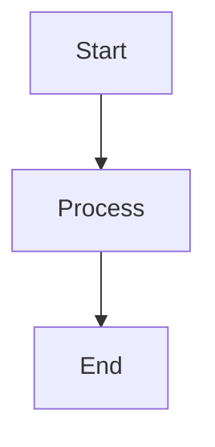

# Style Guide

This guide defines the standards for writing and formatting content in the knowledge base.

## File Naming

- Format: `NN. Title.md`
- NN: Zero-padded number (01, 02, ..., 99, 100+)
- Title: Short, descriptive, title case
- Examples:
  - ✅ `01. Introduction to Android Architecture.md`
  - ✅ `10. Jetpack Compose State Management.md`
  - ❌ `1. intro.md` (missing zero-padding, too short)
  - ❌ `01-intro-to-android.md` (wrong format)

## Frontmatter

### Required Fields

```yaml
number: 1                    # Integer, unique, sequential
title: "Title"              # String, title case, descriptive
slug: "title-slug"          # String, lowercase, hyphens, URL-safe
level: "beginner"           # Enum: beginner|intermediate|advanced|overachiever
tags: ["tag1", "tag2"]      # Array of strings, lowercase, kebab-case
prerequisites: []           # Array of numbers or slugs
estimated_minutes: 30        # Integer, realistic estimate
contributors: []            # Array of strings
canonical_id: "android-01"  # String, format: knowledgebase-NN, globally unique
```

### Optional Fields

```yaml
diagrams: ["path/to/diagram.svg"]  # Array of relative paths
examples: ["path/to/example.kt"]   # Array of relative paths
```

### Slug Format

- Lowercase
- Hyphens for word separation
- No special characters
- Examples:
  - ✅ `introduction-to-android-architecture`
  - ✅ `solid-principles`
  - ❌ `Introduction_to_Android` (uppercase, underscores)
  - ❌ `solid-principles!` (special characters)

### Canonical ID Format

- Format: `{knowledgebase}-{number}`
- Examples:
  - ✅ `android-01`
  - ✅ `android-10`
  - ✅ `kotlin-01` (for different knowledgebase)
  - ❌ `android_01` (underscore)
  - ❌ `01` (missing knowledgebase prefix)

## Markdown Content

### Headings

- Use proper hierarchy (H1 → H2 → H3)
- H1 is the title (from frontmatter, not in content)
- Start with H2 for main sections
- Examples:

```markdown
## Overview

## Deep Explanation

### Why Architecture Matters

### The Evolution of Android Architecture
```

### Code Blocks

- Specify language for syntax highlighting
- Use Kotlin for Android code
- Include complete, runnable examples
- Add comments for clarity

```markdown
```kotlin
// Example: ViewModel with StateFlow
class UserViewModel : ViewModel() {
    private val _user = MutableStateFlow<User?>(null)
    val user: StateFlow<User?> = _user.asStateFlow()
}
```
```

### Diagrams

#### Mermaid Diagrams

```markdown

```

#### External Diagrams

Reference SVG/PNG files:
- Store in `android/assets/diagrams/`
- Reference in frontmatter: `diagrams: ["diagrams/01-architecture.svg"]`
- Include caption in content

### Lists

- Use ordered lists for steps
- Use unordered lists for features/items
- Keep items parallel in structure

### Links

- Use relative paths for internal links
- Use absolute URLs for external links
- Format: `[Link Text](./path/to/file.md)`

### Quiz Format

```markdown
## Quiz

### Question 1
What is the main benefit of using ViewModel?

**A)** ViewModels are faster  
**B)** ViewModels survive configuration changes  
**C)** ViewModels use less memory  
**D)** ViewModels are required by Android

**Answer: B** - ViewModels survive configuration changes, allowing you to maintain UI state when the device rotates.
```

## Content Structure

Every file should follow this structure:

1. **Overview** (H2)
   - One paragraph summary

2. **Deep Explanation** (H2)
   - Multiple subsections (H3, H4)
   - Progressive complexity

3. **Diagrams** (H2)
   - Mermaid or external diagrams
   - Captions and explanations

4. **Real Code Examples** (H2)
   - Complete Kotlin examples
   - Explanations

5. **Hard Use-Case(s)** (H2)
   - Problem statement
   - Step-by-step solution
   - Alternatives

6. **Edge Cases and Pitfalls** (H2)
   - Common mistakes
   - Best practices

7. **References and Further Reading** (H2)
   - Links to official docs
   - Related articles

8. **Quiz** (H2)
   - 5 multiple choice questions
   - Answers with explanations

9. **Related Topics** (H2)
   - Cross-links to related files

## Writing Style

### Tone

- Professional but approachable
- Clear and concise
- Code-first approach
- Explain the "why"

### Language

- Use present tense
- Active voice preferred
- Avoid jargon without explanation
- Define acronyms on first use

### Examples

- ✅ "ViewModels survive configuration changes"
- ❌ "ViewModels will survive configuration changes"
- ❌ "Configuration changes are survived by ViewModels"

## Code Style

### Kotlin

- Follow Kotlin style guide
- Use modern Kotlin features (coroutines, sealed classes, etc.)
- Include type annotations when helpful
- Add comments for complex logic

### Examples

```kotlin
// ✅ Good: Clear, modern Kotlin
class UserViewModel(
    private val repository: UserRepository
) : ViewModel() {
    private val _user = MutableStateFlow<User?>(null)
    val user: StateFlow<User?> = _user.asStateFlow()
    
    fun loadUser(id: Int) {
        viewModelScope.launch {
            _user.value = repository.getUser(id)
        }
    }
}

// ❌ Bad: Old patterns, unclear
class UserViewModel : ViewModel() {
    var user: User? = null
    fun loadUser(id: Int) {
        // Implementation
    }
}
```

## Tag Conventions

- Use lowercase
- Use kebab-case for multi-word tags
- Be specific but not too granular
- Common tags:
  - `architecture`, `ui`, `testing`, `performance`
  - `kotlin`, `coroutines`, `compose`, `room`
  - `mvvm`, `clean-architecture`, `dependency-injection`

## Checklist

Before submitting, ensure:

- [ ] File name follows convention
- [ ] Frontmatter is complete and valid
- [ ] `canonical_id` is unique
- [ ] `slug` is unique in knowledgebase
- [ ] Content follows structure
- [ ] Code examples are complete and runnable
- [ ] Diagrams are included and explained
- [ ] Quiz has 5 questions with answers
- [ ] Links are valid
- [ ] No duplicate content (checked with script)
- [ ] Spelling and grammar checked


