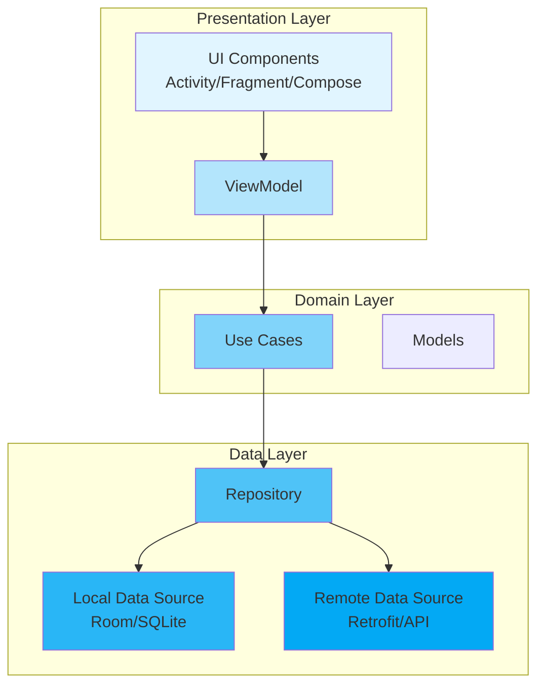

# Introduction to Android Architecture

## Overview

Android architecture defines how your app is structured, how components interact, and how data flows through your application. Understanding architecture patterns is crucial for building maintainable, testable, and scalable Android applications. This guide introduces you to the fundamental concepts of Android architecture, from the basic Activity lifecycle to modern architectural patterns like MVVM and Clean Architecture.

## Deep Explanation

### Why Architecture Matters

Without a clear architecture, Android apps can quickly become difficult to maintain. Common problems include:

- **God Activities**: Activities that contain business logic, UI logic, and data access code
- **Tight Coupling**: Components that depend directly on each other, making testing and changes difficult
- **No Separation of Concerns**: UI, business logic, and data access mixed together
- **Difficult Testing**: Business logic embedded in Activities makes unit testing nearly impossible

### The Evolution of Android Architecture

#### 1. Traditional Approach (Pre-2015)

Early Android apps typically put everything in Activities:

```kotlin
class MainActivity : AppCompatActivity() {
    private lateinit var database: DatabaseHelper
    
    override fun onCreate(savedInstanceState: Bundle?) {
        super.onCreate(savedInstanceState)
        setContentView(R.layout.activity_main)
        
        database = DatabaseHelper(this)
        val data = database.getData() // Data access in Activity
        processData(data) // Business logic in Activity
        updateUI(data) // UI logic in Activity
    }
    
    private fun processData(data: List<String>) {
        // Business logic mixed with UI
    }
    
    private fun updateUI(data: List<String>) {
        // UI updates
    }
}
```

**Problems**: Hard to test, violates Single Responsibility Principle, difficult to reuse logic.

#### 2. MVP (Model-View-Presenter)

MVP separates concerns into three layers:

- **Model**: Data and business logic
- **View**: UI components (Activity/Fragment)
- **Presenter**: Mediates between Model and View

```kotlin
// Model
data class User(val id: Int, val name: String)

interface UserRepository {
    fun getUser(id: Int): User?
}

// View
interface UserView {
    fun showUser(user: User)
    fun showError(message: String)
}

// Presenter
class UserPresenter(
    private val view: UserView,
    private val repository: UserRepository
) {
    fun loadUser(userId: Int) {
        val user = repository.getUser(userId)
        if (user != null) {
            view.showUser(user)
        } else {
            view.showError("User not found")
        }
    }
}

// Activity implements View
class UserActivity : AppCompatActivity(), UserView {
    private lateinit var presenter: UserPresenter
    
    override fun onCreate(savedInstanceState: Bundle?) {
        super.onCreate(savedInstanceState)
        setContentView(R.layout.activity_user)
        
        presenter = UserPresenter(this, UserRepositoryImpl())
        presenter.loadUser(1)
    }
    
    override fun showUser(user: User) {
        // Update UI
    }
    
    override fun showError(message: String) {
        // Show error
    }
}
```

**Benefits**: Testable presenters, reusable business logic, clear separation.

#### 3. MVVM (Model-View-ViewModel)

MVVM uses data binding and observables to automatically update the UI:

- **Model**: Data and business logic
- **View**: UI (Activity/Fragment/Compose)
- **ViewModel**: Holds UI-related data, survives configuration changes

```kotlin
// ViewModel
class UserViewModel(private val repository: UserRepository) : ViewModel() {
    private val _user = MutableLiveData<User>()
    val user: LiveData<User> = _user
    
    private val _error = MutableLiveData<String>()
    val error: LiveData<String> = _error
    
    fun loadUser(userId: Int) {
        viewModelScope.launch {
            try {
                val user = repository.getUser(userId)
                _user.value = user
            } catch (e: Exception) {
                _error.value = e.message
            }
        }
    }
}

// Activity/Fragment observes ViewModel
class UserActivity : AppCompatActivity() {
    private lateinit var viewModel: UserViewModel
    
    override fun onCreate(savedInstanceState: Bundle?) {
        super.onCreate(savedInstanceState)
        setContentView(R.layout.activity_user)
        
        viewModel = ViewModelProvider(this)[UserViewModel::class.java]
        
        viewModel.user.observe(this) { user ->
            // Update UI automatically
        }
        
        viewModel.error.observe(this) { error ->
            // Show error
        }
        
        viewModel.loadUser(1)
    }
}
```

**Benefits**: Automatic UI updates, survives configuration changes, works great with Jetpack Compose.

### Architecture Components

Google's Architecture Components provide building blocks for MVVM:

- **ViewModel**: Survives configuration changes, holds UI data
- **LiveData**: Observable data holder
- **Room**: Database abstraction layer
- **Navigation**: In-app navigation framework
- **WorkManager**: Background task scheduling

## Diagrams

### Architecture Layers Overview



**Reading the Diagram**: 
- Arrows show data flow direction
- Each layer has a specific responsibility
- Dependencies flow downward (UI depends on ViewModel, not vice versa)

## Real Code Examples

### Complete MVVM Example with Room

```kotlin
// Entity
@Entity(tableName = "users")
data class UserEntity(
    @PrimaryKey val id: Int,
    val name: String,
    val email: String
)

// DAO
@Dao
interface UserDao {
    @Query("SELECT * FROM users WHERE id = :id")
    suspend fun getUser(id: Int): UserEntity?
    
    @Insert(onConflict = OnConflictStrategy.REPLACE)
    suspend fun insertUser(user: UserEntity)
}

// Repository
class UserRepository(private val userDao: UserDao) {
    suspend fun getUser(id: Int): UserEntity? {
        return userDao.getUser(id)
    }
    
    suspend fun saveUser(user: UserEntity) {
        userDao.insertUser(user)
    }
}

// ViewModel
class UserViewModel(private val repository: UserRepository) : ViewModel() {
    private val _user = MutableStateFlow<UserEntity?>(null)
    val user: StateFlow<UserEntity?> = _user
    
    private val _isLoading = MutableStateFlow(false)
    val isLoading: StateFlow<Boolean> = _isLoading
    
    fun loadUser(userId: Int) {
        viewModelScope.launch {
            _isLoading.value = true
            try {
                _user.value = repository.getUser(userId)
            } catch (e: Exception) {
                // Handle error
            } finally {
                _isLoading.value = false
            }
        }
    }
}

// Compose UI
@Composable
fun UserScreen(viewModel: UserViewModel = viewModel()) {
    val user by viewModel.user.collectAsState()
    val isLoading by viewModel.isLoading.collectAsState()
    
    LaunchedEffect(Unit) {
        viewModel.loadUser(1)
    }
    
    if (isLoading) {
        CircularProgressIndicator()
    } else {
        user?.let {
            Column {
                Text("Name: ${it.name}")
                Text("Email: ${it.email}")
            }
        }
    }
}
```

## Hard Use-Case: Handling Configuration Changes

### Problem

When the device rotates, Activities are destroyed and recreated. Without proper architecture, you lose:
- Network requests in progress
- UI state
- User input

### Solution 1: ViewModel (Recommended)

```kotlin
class SearchViewModel : ViewModel() {
    private val _searchResults = MutableLiveData<List<Result>>()
    val searchResults: LiveData<List<Result>> = _searchResults
    
    private val _searchQuery = MutableLiveData<String>()
    val searchQuery: LiveData<String> = _searchQuery
    
    fun search(query: String) {
        _searchQuery.value = query
        viewModelScope.launch {
            val results = repository.search(query)
            _searchResults.value = results
        }
    }
}

// Activity automatically gets the same ViewModel instance after rotation
class SearchActivity : AppCompatActivity() {
    private lateinit var viewModel: SearchViewModel
    
    override fun onCreate(savedInstanceState: Bundle?) {
        super.onCreate(savedInstanceState)
        // ViewModel survives rotation automatically
        viewModel = ViewModelProvider(this)[SearchViewModel::class.java]
        
        viewModel.searchResults.observe(this) { results ->
            // Update UI
        }
    }
}
```

### Solution 2: SavedStateHandle (For Complex State)

```kotlin
class SearchViewModel(
    private val savedStateHandle: SavedStateHandle
) : ViewModel() {
    var searchQuery: String
        get() = savedStateHandle.get<String>("query") ?: ""
        set(value) = savedStateHandle.set("query", value)
    
    // State survives process death
}
```

### Alternative: Manual State Saving

```kotlin
override fun onSaveInstanceState(outState: Bundle) {
    super.onSaveInstanceState(outState)
    outState.putString("query", searchQuery)
}

override fun onCreate(savedInstanceState: Bundle?) {
    super.onCreate(savedInstanceState)
    val query = savedInstanceState?.getString("query") ?: ""
    // Restore state
}
```

**Why ViewModel is Better**: Automatic, type-safe, works with LiveData/StateFlow, handles process death with SavedStateHandle.

## Edge Cases and Pitfalls

### 1. ViewModel Scope Issues

**Problem**: Creating ViewModel in wrong scope

```kotlin
// WRONG: ViewModel tied to Activity, lost when Fragment is replaced
val viewModel = ViewModelProvider(requireActivity())[MyViewModel::class.java]

// CORRECT: ViewModel scoped to Fragment
val viewModel = ViewModelProvider(this)[MyViewModel::class.java]

// CORRECT: Shared ViewModel between Fragments
val viewModel = ViewModelProvider(requireActivity())[SharedViewModel::class.java]
```

### 2. Memory Leaks with Observers

**Problem**: Not removing LiveData observers

```kotlin
// WRONG: Observer not removed, Activity leaked
viewModel.data.observe(this) { }

// CORRECT: Lifecycle-aware observer automatically removed
viewModel.data.observe(this) { }

// CORRECT: Manual removal if needed
val observer = Observer<String> { }
viewModel.data.observe(this, observer)
// Later: viewModel.data.removeObserver(observer)
```

### 3. ViewModel with Context

**Problem**: Storing Context in ViewModel

```kotlin
// WRONG: Context can leak, ViewModel survives Activity
class MyViewModel(context: Context) : ViewModel() {
    private val db = Database(context) // LEAK!
}

// CORRECT: Use Application context or inject dependencies
class MyViewModel(
    private val repository: Repository // Injected
) : ViewModel()
```

### 4. Testing ViewModels

**Problem**: Hard to test ViewModels with dependencies

```kotlin
// WRONG: Hard dependencies
class UserViewModel : ViewModel() {
    private val repository = UserRepository() // Can't mock
}

// CORRECT: Dependency injection
class UserViewModel(
    private val repository: UserRepository // Can inject mock
) : ViewModel()

// Test
@Test
fun `loadUser updates state`() = runTest {
    val mockRepo = mock<UserRepository>()
    val viewModel = UserViewModel(mockRepo)
    // Test...
}
```

## References and Further Reading

- [Android Architecture Guide](https://developer.android.com/topic/architecture)
- [Guide to App Architecture](https://developer.android.com/topic/architecture)
- [ViewModel Overview](https://developer.android.com/topic/libraries/architecture/viewmodel)
- [LiveData Overview](https://developer.android.com/topic/libraries/architecture/livedata)
- [Room Persistence Library](https://developer.android.com/training/data-storage/room)

## Quiz

### Question 1
What is the main benefit of using ViewModel over storing state in an Activity?

**A)** ViewModels are faster  
**B)** ViewModels survive configuration changes  
**C)** ViewModels use less memory  
**D)** ViewModels are required by Android

**Answer: B** - ViewModels survive configuration changes, allowing you to maintain UI state when the device rotates or the Activity is recreated.

### Question 2
In MVVM architecture, where should business logic be placed?

**A)** In the View (Activity/Fragment)  
**B)** In the ViewModel  
**C)** In the Model/Repository  
**D)** In a separate UseCase class

**Answer: C or D** - Business logic should be in the Model layer (Repository) or in separate UseCase classes. ViewModels should only contain UI-related logic.

### Question 3
What happens to a ViewModel when the Activity is rotated?

**A)** It is destroyed and recreated  
**B)** It survives and is reused  
**C)** It is paused but not destroyed  
**D)** It depends on the implementation

**Answer: B** - ViewModels survive configuration changes and are automatically reused by the new Activity instance.

### Question 4
Which of the following should NOT be stored in a ViewModel?

**A)** UI state (e.g., form input)  
**B)** References to Views  
**C)** LiveData/StateFlow for UI updates  
**D)** Business logic results

**Answer: B** - ViewModels should never hold references to Views (Activities, Fragments, Views) as this can cause memory leaks.

### Question 5
What is the recommended way to handle errors in MVVM?

**A)** Throw exceptions from ViewModel  
**B)** Use sealed classes or Result types  
**C)** Log errors and continue  
**D)** Show Toast messages from ViewModel

**Answer: B** - Use sealed classes (like `sealed class Result<T>`) or Result types to represent success/error states, which can be observed by the UI layer.

## Related Topics

- [SOLID Principles](./02.%20SOLID%20Principles.md) - Learn design principles that guide good architecture
- [Kotlin Coroutines Basics](./03.%20Kotlin%20Coroutines%20Basics.md) - Essential for async operations in ViewModels
- [Jetpack Compose State Management](../02_intermediate/10.%20Jetpack%20Compose%20State%20Management.md) - Modern state management with Compose

