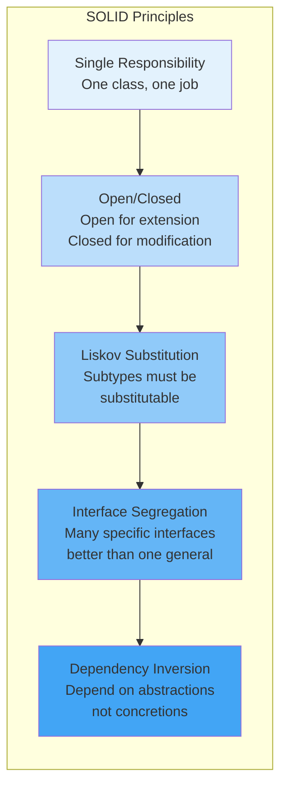

# SOLID Principles

## Overview

SOLID is an acronym for five object-oriented design principles that help developers create maintainable, flexible, and scalable software. These principles, introduced by Robert C. Martin, are especially important in Android development where apps grow complex quickly. Understanding SOLID principles will help you write better code, make your architecture more testable, and reduce technical debt.

## Deep Explanation

### S - Single Responsibility Principle (SRP)

**A class should have only one reason to change.**

Each class should have a single, well-defined responsibility. If a class has multiple reasons to change, it's doing too much.

#### Violation Example

```kotlin
// BAD: This class has multiple responsibilities
class UserManager {
    fun saveUser(user: User) {
        // Database operation
        val db = DatabaseHelper()
        db.insert(user)
    }
    
    fun sendEmail(user: User) {
        // Email sending
        EmailService.send(user.email, "Welcome!")
    }
    
    fun validateUser(user: User): Boolean {
        // Validation logic
        return user.email.isNotEmpty() && user.name.isNotEmpty()
    }
}
```

**Problems**: 
- Hard to test (need to mock database and email service)
- Changes to email logic affect database logic
- Can't reuse validation separately

#### Correct Implementation

```kotlin
// GOOD: Separate responsibilities
class UserRepository {
    fun saveUser(user: User) {
        val db = DatabaseHelper()
        db.insert(user)
    }
}

class EmailService {
    fun sendWelcomeEmail(user: User) {
        send(user.email, "Welcome!")
    }
}

class UserValidator {
    fun validate(user: User): Boolean {
        return user.email.isNotEmpty() && user.name.isNotEmpty()
    }
}

// Usage
class UserManager(
    private val repository: UserRepository,
    private val emailService: EmailService,
    private val validator: UserValidator
) {
    fun registerUser(user: User) {
        if (validator.validate(user)) {
            repository.saveUser(user)
            emailService.sendWelcomeEmail(user)
        }
    }
}
```

**Benefits**: Each class has one job, easier to test, easier to modify.

### O - Open/Closed Principle (OCP)

**Software entities should be open for extension but closed for modification.**

You should be able to add new functionality without changing existing code.

#### Violation Example

```kotlin
// BAD: Must modify this class to add new payment methods
class PaymentProcessor {
    fun processPayment(amount: Double, method: String) {
        when (method) {
            "credit_card" -> {
                // Credit card processing
            }
            "paypal" -> {
                // PayPal processing
            }
            // Adding new method requires modifying this class
        }
    }
}
```

#### Correct Implementation

```kotlin
// GOOD: Open for extension, closed for modification
interface PaymentMethod {
    fun processPayment(amount: Double)
}

class CreditCardPayment : PaymentMethod {
    override fun processPayment(amount: Double) {
        // Credit card processing
    }
}

class PayPalPayment : PaymentMethod {
    override fun processPayment(amount: Double) {
        // PayPal processing
    }
}

class CryptoPayment : PaymentMethod {
    override fun processPayment(amount: Double) {
        // Crypto processing - added without modifying existing code
    }
}

class PaymentProcessor {
    fun processPayment(amount: Double, method: PaymentMethod) {
        method.processPayment(amount)
    }
}
```

**Benefits**: Add new payment methods without touching existing code, easier to test each method independently.

### L - Liskov Substitution Principle (LSP)

**Objects of a superclass should be replaceable with objects of its subclasses without breaking the application.**

Subclasses should be able to replace their base classes without changing the correctness of the program.

#### Violation Example

```kotlin
// BAD: Square violates LSP
open class Rectangle {
    open var width: Int = 0
    open var height: Int = 0
    
    fun setDimensions(w: Int, h: Int) {
        width = w
        height = h
    }
    
    fun getArea(): Int = width * height
}

class Square : Rectangle() {
    override var width: Int = 0
        set(value) {
            field = value
            height = value // Forces square
        }
    
    override var height: Int = 0
        set(value) {
            field = value
            width = value // Forces square
        }
}

// This breaks LSP - code expecting Rectangle breaks with Square
fun testRectangle(rect: Rectangle) {
    rect.setDimensions(5, 10)
    assert(rect.getArea() == 50) // Fails with Square!
}
```

#### Correct Implementation

```kotlin
// GOOD: Proper inheritance hierarchy
interface Shape {
    fun getArea(): Int
}

class Rectangle(val width: Int, val height: Int) : Shape {
    override fun getArea(): Int = width * height
}

class Square(val side: Int) : Shape {
    override fun getArea(): Int = side * side
}

// Both can be used interchangeably as Shape
fun calculateTotalArea(shapes: List<Shape>): Int {
    return shapes.sumOf { it.getArea() }
}
```

**Android Example**:

```kotlin
// GOOD: ViewModel subclasses are substitutable
abstract class BaseViewModel : ViewModel() {
    abstract fun loadData()
    abstract fun handleError(error: Throwable)
}

class UserViewModel : BaseViewModel() {
    override fun loadData() {
        // Load user data
    }
    
    override fun handleError(error: Throwable) {
        // Handle user-specific errors
    }
}

class ProductViewModel : BaseViewModel() {
    override fun loadData() {
        // Load product data
    }
    
    override fun handleError(error: Throwable) {
        // Handle product-specific errors
    }
}

// Can use any BaseViewModel subclass
fun setupViewModel(viewModel: BaseViewModel) {
    viewModel.loadData()
}
```

### I - Interface Segregation Principle (ISP)

**Clients should not be forced to depend on interfaces they don't use.**

Create specific interfaces rather than one large interface.

#### Violation Example

```kotlin
// BAD: Large interface forcing implementations of unused methods
interface Worker {
    fun work()
    fun eat()
    fun sleep()
}

class HumanWorker : Worker {
    override fun work() { }
    override fun eat() { }
    override fun sleep() { }
}

class RobotWorker : Worker {
    override fun work() { }
    override fun eat() { 
        // Robot doesn't eat! Forced to implement
        throw UnsupportedOperationException()
    }
    override fun sleep() { 
        // Robot doesn't sleep! Forced to implement
        throw UnsupportedOperationException()
    }
}
```

#### Correct Implementation

```kotlin
// GOOD: Segregated interfaces
interface Workable {
    fun work()
}

interface Eatable {
    fun eat()
}

interface Sleepable {
    fun sleep()
}

class HumanWorker : Workable, Eatable, Sleepable {
    override fun work() { }
    override fun eat() { }
    override fun sleep() { }
}

class RobotWorker : Workable {
    override fun work() { }
    // No need to implement eat() or sleep()
}
```

**Android Example**:

```kotlin
// GOOD: Segregated repository interfaces
interface ReadableRepository<T> {
    suspend fun get(id: String): T?
    suspend fun getAll(): List<T>
}

interface WritableRepository<T> {
    suspend fun save(item: T)
    suspend fun delete(id: String)
}

interface SearchableRepository<T> {
    suspend fun search(query: String): List<T>
}

// Use only what you need
class UserRepository : ReadableRepository<User>, WritableRepository<User> {
    override suspend fun get(id: String): User? { }
    override suspend fun getAll(): List<User> { }
    override suspend fun save(item: User) { }
    override suspend fun delete(id: String) { }
}

class ProductRepository : ReadableRepository<Product>, SearchableRepository<Product> {
    override suspend fun get(id: String): Product? { }
    override suspend fun getAll(): List<Product> { }
    override suspend fun search(query: String): List<Product> { }
}
```

### D - Dependency Inversion Principle (DIP)

**High-level modules should not depend on low-level modules. Both should depend on abstractions.**

Depend on interfaces/abstractions, not concrete implementations.

#### Violation Example

```kotlin
// BAD: High-level module depends on low-level module
class UserService {
    private val database = MySQLDatabase() // Concrete dependency
    private val logger = FileLogger() // Concrete dependency
    
    fun saveUser(user: User) {
        logger.log("Saving user")
        database.save(user)
    }
}
```

#### Correct Implementation

```kotlin
// GOOD: Depend on abstractions
interface Database {
    fun save(user: User)
}

interface Logger {
    fun log(message: String)
}

class UserService(
    private val database: Database, // Abstraction
    private val logger: Logger      // Abstraction
) {
    fun saveUser(user: User) {
        logger.log("Saving user")
        database.save(user)
    }
}

// Implementations
class MySQLDatabase : Database {
    override fun save(user: User) { }
}

class RoomDatabase : Database {
    override fun save(user: User) { }
}

class FileLogger : Logger {
    override fun log(message: String) { }
}

class CloudLogger : Logger {
    override fun log(message: String) { }
}

// Easy to test with mocks
class TestDatabase : Database {
    override fun save(user: User) { }
}
```

**Android Example with Dependency Injection**:

```kotlin
// Define abstractions
interface UserRepository {
    suspend fun getUser(id: Int): User?
}

interface ApiService {
    suspend fun fetchUser(id: Int): UserDto
}

// Implementations
class UserRepositoryImpl(
    private val apiService: ApiService,
    private val userDao: UserDao
) : UserRepository {
    override suspend fun getUser(id: Int): User? {
        // Implementation
    }
}

class RetrofitApiService : ApiService {
    override suspend fun fetchUser(id: Int): UserDto {
        // Implementation
    }
}

// ViewModel depends on abstraction
class UserViewModel(
    private val repository: UserRepository // Abstraction, not concrete class
) : ViewModel() {
    fun loadUser(id: Int) {
        viewModelScope.launch {
            val user = repository.getUser(id)
        }
    }
}

// Easy to inject test doubles
class TestUserRepository : UserRepository {
    override suspend fun getUser(id: Int): User? = User(id, "Test")
}
```

## Diagrams

### SOLID Principles Overview



## Real Code Examples

### Complete Example: SOLID-Compliant Android App

```kotlin
// 1. Single Responsibility: Separate repositories
interface UserRepository {
    suspend fun getUser(id: Int): User?
}

interface ProductRepository {
    suspend fun getProduct(id: Int): Product?
}

// 2. Open/Closed: Extensible payment system
interface PaymentProcessor {
    fun process(amount: Double): PaymentResult
}

class CreditCardProcessor : PaymentProcessor {
    override fun process(amount: Double): PaymentResult {
        // Implementation
    }
}

class PayPalProcessor : PaymentProcessor {
    override fun process(amount: Double): PaymentResult {
        // Implementation
    }
}

// 3. Liskov Substitution: ViewModels are substitutable
abstract class BaseViewModel : ViewModel() {
    abstract fun initialize()
}

class UserViewModel : BaseViewModel() {
    override fun initialize() { }
}

// 4. Interface Segregation: Specific interfaces
interface Readable<T> {
    suspend fun read(id: Int): T?
}

interface Writable<T> {
    suspend fun write(item: T)
}

interface Deletable {
    suspend fun delete(id: Int)
}

// 5. Dependency Inversion: Depend on abstractions
class UserService(
    private val repository: UserRepository, // Abstraction
    private val logger: Logger              // Abstraction
) {
    suspend fun getUser(id: Int): User? {
        logger.log("Fetching user $id")
        return repository.getUser(id)
    }
}

// ViewModel uses abstraction
class UserViewModel(
    private val userService: UserService
) : ViewModel() {
    fun loadUser(id: Int) {
        viewModelScope.launch {
            val user = userService.getUser(id)
        }
    }
}
```

## Hard Use-Case: Refactoring Legacy Code to SOLID

### Problem

You have a large Activity with multiple responsibilities. How do you refactor it to follow SOLID principles?

### Step-by-Step Solution

#### Step 1: Identify Responsibilities

```kotlin
// BEFORE: God Activity
class MainActivity : AppCompatActivity() {
    // Responsibility 1: Data fetching
    private fun fetchData() { }
    
    // Responsibility 2: Data validation
    private fun validateData(data: String): Boolean { }
    
    // Responsibility 3: UI updates
    private fun updateUI(data: String) { }
    
    // Responsibility 4: Error handling
    private fun handleError(error: Throwable) { }
    
    // Responsibility 5: Navigation
    private fun navigateToDetail(id: Int) { }
}
```

#### Step 2: Extract to Separate Classes (SRP)

```kotlin
// Extract data fetching
class DataRepository {
    suspend fun fetchData(): String { }
}

// Extract validation
class DataValidator {
    fun validate(data: String): Boolean { }
}

// Extract error handling
class ErrorHandler {
    fun handle(error: Throwable) { }
}

// Extract navigation
class Navigator(private val activity: Activity) {
    fun navigateToDetail(id: Int) { }
}
```

#### Step 3: Create ViewModel (DIP)

```kotlin
class MainViewModel(
    private val repository: DataRepository,      // Abstraction
    private val validator: DataValidator,        // Abstraction
    private val errorHandler: ErrorHandler      // Abstraction
) : ViewModel() {
    private val _data = MutableLiveData<String>()
    val data: LiveData<String> = _data
    
    fun loadData() {
        viewModelScope.launch {
            try {
                val fetchedData = repository.fetchData()
                if (validator.validate(fetchedData)) {
                    _data.value = fetchedData
                }
            } catch (e: Exception) {
                errorHandler.handle(e)
            }
        }
    }
}
```

#### Step 4: Simplify Activity (OCP)

```kotlin
// AFTER: Clean Activity
class MainActivity : AppCompatActivity() {
    private lateinit var viewModel: MainViewModel
    
    override fun onCreate(savedInstanceState: Bundle?) {
        super.onCreate(savedInstanceState)
        setContentView(R.layout.activity_main)
        
        viewModel = ViewModelProvider(this)[MainViewModel::class.java]
        
        viewModel.data.observe(this) { data ->
            updateUI(data)
        }
        
        viewModel.loadData()
    }
    
    private fun updateUI(data: String) {
        // Only UI logic
    }
}
```

**Benefits**: Testable, maintainable, follows all SOLID principles.

## Edge Cases and Pitfalls

### 1. Over-Engineering

**Problem**: Creating too many small classes

```kotlin
// BAD: Over-engineered
class UserNameValidator { }
class UserEmailValidator { }
class UserAgeValidator { }
// ... 20 more validators

// GOOD: Balanced approach
class UserValidator {
    fun validateName(name: String): Boolean { }
    fun validateEmail(email: String): Boolean { }
    fun validateAge(age: Int): Boolean { }
}
```

### 2. Violating LSP with Android Components

**Problem**: Incorrectly extending Android classes

```kotlin
// BAD: Custom View that breaks LSP
class MyButton : Button {
    override fun setText(text: CharSequence?, type: BufferType?) {
        // Changes behavior in unexpected way
        super.setText(text?.uppercase(), type)
    }
}

// Code expecting Button breaks
fun setupButton(button: Button) {
    button.setText("Hello") // Expects "Hello", gets "HELLO"
}
```

### 3. Interface Pollution

**Problem**: Creating interfaces for everything

```kotlin
// BAD: Unnecessary abstraction
interface StringFormatter {
    fun format(text: String): String
}

class SimpleStringFormatter : StringFormatter {
    override fun format(text: String): String = text.trim()
}

// GOOD: Use interfaces when you need polymorphism or testing
// Simple utility classes don't need interfaces
class StringFormatter {
    fun format(text: String): String = text.trim()
}
```

### 4. Circular Dependencies

**Problem**: Classes depending on each other

```kotlin
// BAD: Circular dependency
class ServiceA(private val serviceB: ServiceB) { }
class ServiceB(private val serviceA: ServiceA) { }

// GOOD: Use events or mediator
class ServiceA(private val eventBus: EventBus) {
    fun doSomething() {
        eventBus.publish(EventA())
    }
}

class ServiceB(private val eventBus: EventBus) {
    init {
        eventBus.subscribe<EventA> { handleEvent() }
    }
}
```

## References and Further Reading

- [SOLID Principles (Wikipedia)](https://en.wikipedia.org/wiki/SOLID)
- [Clean Code by Robert C. Martin](https://www.amazon.com/Clean-Code-Handbook-Software-Craftsmanship/dp/0132350882)
- [Android Architecture: Applying SOLID Principles](https://developer.android.com/topic/architecture)
- [Dependency Injection in Android](https://developer.android.com/training/dependency-injection)

## Quiz

### Question 1
According to the Single Responsibility Principle, how many reasons should a class have to change?

**A)** Zero  
**B)** One  
**C)** Two  
**D)** As many as needed

**Answer: B** - A class should have only one reason to change, meaning it should have a single, well-defined responsibility.

### Question 2
What does the Open/Closed Principle state?

**A)** Code should be open source  
**B)** Classes should be open for extension but closed for modification  
**C)** All classes should be final  
**D)** Code should never be changed

**Answer: B** - You should be able to add new functionality (extension) without modifying existing code.

### Question 3
If a Square class extends Rectangle but changes the behavior of setWidth() to also set height, what principle is violated?

**A)** Single Responsibility  
**B)** Open/Closed  
**C)** Liskov Substitution  
**D)** Interface Segregation

**Answer: C** - The Liskov Substitution Principle is violated because code expecting a Rectangle will break when given a Square.

### Question 4
What is the main benefit of the Dependency Inversion Principle?

**A)** Faster compilation  
**B)** Easier testing and flexibility  
**C)** Smaller code size  
**D)** Better performance

**Answer: B** - By depending on abstractions, you can easily swap implementations and use mocks for testing.

### Question 5
In Android, which SOLID principle is most important for making ViewModels testable?

**A)** Single Responsibility  
**B)** Open/Closed  
**C)** Interface Segregation  
**D)** Dependency Inversion

**Answer: D** - Dependency Inversion allows you to inject mock repositories and services into ViewModels, making them easily testable.

## Related Topics

- [Introduction to Android Architecture](./01.%20Introduction%20to%20Android%20Architecture.md) - See SOLID principles in action
- [Kotlin Coroutines Basics](./03.%20Kotlin%20Coroutines%20Basics.md) - Essential for async operations
- [Testing Compose UIs](../02_intermediate/05.%20Testing%20Compose%20UIs.md) - SOLID makes testing easier

