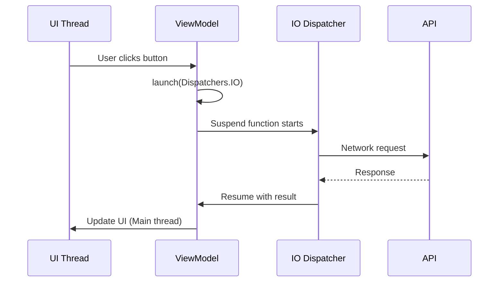
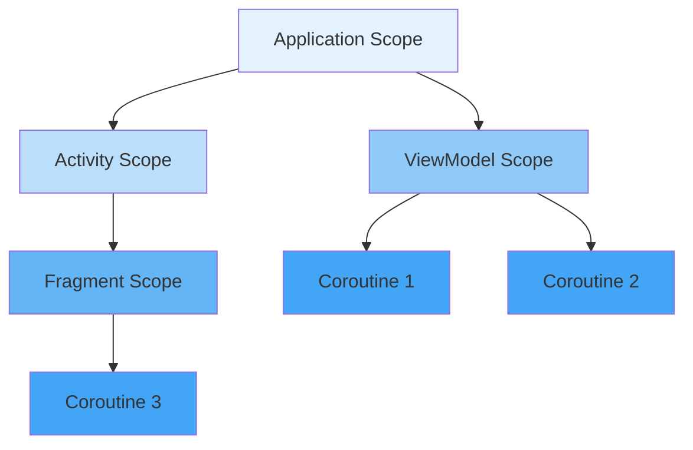

# Kotlin Coroutines Basics

## Overview

Kotlin Coroutines are a powerful concurrency framework that simplifies asynchronous programming in Android. They allow you to write asynchronous code that looks synchronous, making it easier to handle background operations, network calls, and database queries. Coroutines are lightweight threads that can be suspended and resumed, providing a more efficient alternative to traditional threading models.

## Deep Explanation

### What Are Coroutines?

Coroutines are suspendable computations - functions that can pause execution and resume later without blocking a thread. They're perfect for:

- Network requests
- Database operations
- File I/O
- Long-running computations

### Key Concepts

#### 1. Suspending Functions

Functions marked with `suspend` can be paused and resumed:

```kotlin
suspend fun fetchUser(id: Int): User {
    delay(1000) // Simulates network delay - doesn't block thread
    return User(id, "John")
}
```

#### 2. Coroutine Builders

Ways to start a coroutine:

```kotlin
// launch: Fire and forget
GlobalScope.launch {
    val user = fetchUser(1)
    println(user)
}

// async: Returns a result
val deferred = GlobalScope.async {
    fetchUser(1)
}
val user = deferred.await()

// runBlocking: Blocks current thread (mainly for testing)
runBlocking {
    val user = fetchUser(1)
}
```

#### 3. Coroutine Scope

Defines the lifetime of coroutines:

```kotlin
// ViewModelScope - cancels when ViewModel is cleared
class MyViewModel : ViewModel() {
    fun loadData() {
        viewModelScope.launch {
            val data = fetchData()
        }
    }
}

// LifecycleScope - cancels when lifecycle owner is destroyed
class MyActivity : AppCompatActivity() {
    override fun onCreate(savedInstanceState: Bundle?) {
        super.onCreate(savedInstanceState)
        lifecycleScope.launch {
            val data = fetchData()
        }
    }
}
```

### Coroutine Context and Dispatchers

Dispatchers determine which thread pool a coroutine runs on:

```kotlin
// Dispatchers.Main - UI thread
launch(Dispatchers.Main) {
    updateUI()
}

// Dispatchers.IO - For I/O operations
launch(Dispatchers.IO) {
    val data = networkCall()
}

// Dispatchers.Default - For CPU-intensive work
launch(Dispatchers.Default) {
    val result = heavyComputation()
}

// Dispatchers.Unconfined - Starts on current thread
launch(Dispatchers.Unconfined) {
    // Runs on current thread
}
```

### Structured Concurrency

Coroutines follow a parent-child relationship:

```kotlin
coroutineScope {
    launch {
        delay(1000)
        println("Task 1")
    }
    launch {
        delay(2000)
        println("Task 2")
    }
}
// Waits for both to complete
```

## Diagrams

### Coroutine Execution Flow



### Coroutine Scope Hierarchy



## Real Code Examples

### Basic Usage in Android

```kotlin
class UserViewModel(
    private val repository: UserRepository
) : ViewModel() {
    private val _users = MutableLiveData<List<User>>()
    val users: LiveData<List<User>> = _users
    
    private val _isLoading = MutableLiveData<Boolean>()
    val isLoading: LiveData<Boolean> = _isLoading
    
    fun loadUsers() {
        viewModelScope.launch {
            _isLoading.value = true
            try {
                val userList = withContext(Dispatchers.IO) {
                    repository.getUsers() // Network call on IO thread
                }
                _users.value = userList // Update on Main thread
            } catch (e: Exception) {
                // Handle error
            } finally {
                _isLoading.value = false
            }
        }
    }
}
```

### Parallel Execution

```kotlin
suspend fun loadUserData(userId: Int): UserData {
    return coroutineScope {
        val userDeferred = async { repository.getUser(userId) }
        val postsDeferred = async { repository.getPosts(userId) }
        val friendsDeferred = async { repository.getFriends(userId) }
        
        UserData(
            user = userDeferred.await(),
            posts = postsDeferred.await(),
            friends = friendsDeferred.await()
        )
    }
}
```

### Error Handling

```kotlin
fun loadData() {
    viewModelScope.launch {
        try {
            val data = repository.fetchData()
            _data.value = data
        } catch (e: IOException) {
            _error.value = "Network error"
        } catch (e: Exception) {
            _error.value = "Unknown error"
        }
    }
}
```

## Hard Use-Case: Handling Multiple Async Operations

### Problem

You need to:
1. Fetch user data
2. Fetch user's posts
3. Fetch user's friends
4. Update UI when all complete
5. Handle errors gracefully
6. Show loading state

### Solution

```kotlin
class UserProfileViewModel(
    private val userRepo: UserRepository,
    private val postRepo: PostRepository,
    private val friendRepo: FriendRepository
) : ViewModel() {
    
    private val _state = MutableStateFlow<UserProfileState>(UserProfileState.Loading)
    val state: StateFlow<UserProfileState> = _state
    
    fun loadUserProfile(userId: Int) {
        viewModelScope.launch {
            _state.value = UserProfileState.Loading
            
            try {
                // Run all operations in parallel
                val result = coroutineScope {
                    val userDeferred = async(Dispatchers.IO) {
                        userRepo.getUser(userId)
                    }
                    val postsDeferred = async(Dispatchers.IO) {
                        postRepo.getPosts(userId)
                    }
                    val friendsDeferred = async(Dispatchers.IO) {
                        friendRepo.getFriends(userId)
                    }
                    
                    // Wait for all to complete
                    val user = userDeferred.await()
                    val posts = postsDeferred.await()
                    val friends = friendsDeferred.await()
                    
                    UserProfileState.Success(user, posts, friends)
                }
                
                _state.value = result
            } catch (e: Exception) {
                _state.value = UserProfileState.Error(e.message ?: "Unknown error")
            }
        }
    }
}

sealed class UserProfileState {
    object Loading : UserProfileState()
    data class Success(
        val user: User,
        val posts: List<Post>,
        val friends: List<Friend>
    ) : UserProfileState()
    data class Error(val message: String) : UserProfileState()
}
```

### Alternative: Sequential with Progress

```kotlin
fun loadUserProfileSequential(userId: Int) {
    viewModelScope.launch {
        try {
            _progress.value = 0f
            
            val user = withContext(Dispatchers.IO) {
                userRepo.getUser(userId)
            }
            _progress.value = 0.33f
            
            val posts = withContext(Dispatchers.IO) {
                postRepo.getPosts(userId)
            }
            _progress.value = 0.66f
            
            val friends = withContext(Dispatchers.IO) {
                friendRepo.getFriends(userId)
            }
            _progress.value = 1.0f
            
            _state.value = UserProfileState.Success(user, posts, friends)
        } catch (e: Exception) {
            _state.value = UserProfileState.Error(e.message ?: "Error")
        }
    }
}
```

## Edge Cases and Pitfalls

### 1. Memory Leaks with GlobalScope

**Problem**: Using GlobalScope can cause memory leaks

```kotlin
// BAD: GlobalScope doesn't respect lifecycle
class MyActivity : AppCompatActivity() {
    override fun onCreate(savedInstanceState: Bundle?) {
        super.onCreate(savedInstanceState)
        GlobalScope.launch {
            // This continues even after Activity is destroyed!
            delay(5000)
            updateUI() // Crashes if Activity is gone
        }
    }
}

// GOOD: Use lifecycleScope
class MyActivity : AppCompatActivity() {
    override fun onCreate(savedInstanceState: Bundle?) {
        super.onCreate(savedInstanceState)
        lifecycleScope.launch {
            delay(5000)
            if (isActive) {
                updateUI() // Safe - cancelled if Activity destroyed
            }
        }
    }
}
```

### 2. Blocking the Main Thread

**Problem**: Using blocking operations in coroutines

```kotlin
// BAD: Blocks main thread
viewModelScope.launch(Dispatchers.Main) {
    Thread.sleep(1000) // Blocks main thread!
    updateUI()
}

// GOOD: Use delay or switch dispatcher
viewModelScope.launch(Dispatchers.Main) {
    delay(1000) // Suspends, doesn't block
    updateUI()
}

// OR
viewModelScope.launch {
    withContext(Dispatchers.IO) {
        Thread.sleep(1000) // OK on IO thread
    }
    updateUI() // Back on Main thread
}
```

### 3. Exception Handling in Parallel Coroutines

**Problem**: Exceptions in one coroutine can cancel others

```kotlin
// BAD: One failure cancels all
coroutineScope {
    launch { fetchUser() } // If this fails...
    launch { fetchPosts() } // ...this is cancelled
    launch { fetchFriends() } // ...and this too
}

// GOOD: Use SupervisorJob
supervisorScope {
    launch { fetchUser() } // Failure here...
    launch { fetchPosts() } // ...doesn't cancel this
    launch { fetchFriends() } // ...or this
}
```

### 4. Race Conditions

**Problem**: Shared mutable state

```kotlin
// BAD: Race condition
var counter = 0
repeat(100) {
    launch {
        counter++ // Not thread-safe!
    }
}

// GOOD: Use atomic or Mutex
val counter = AtomicInteger(0)
repeat(100) {
    launch {
        counter.incrementAndGet()
    }
}

// OR
val mutex = Mutex()
var counter = 0
repeat(100) {
    launch {
        mutex.withLock {
            counter++
        }
    }
}
```

## References and Further Reading

- [Kotlin Coroutines Guide](https://kotlinlang.org/docs/coroutines-guide.html)
- [Android Coroutines Best Practices](https://developer.android.com/kotlin/coroutines/coroutines-best-practices)
- [Coroutines Flow](https://kotlinlang.org/docs/flow.html)
- [Cancellation and Timeouts](https://kotlinlang.org/docs/cancellation-and-timeouts.html)

## Quiz

### Question 1
What is the main advantage of coroutines over traditional threads?

**A)** They're faster  
**B)** They're lighter weight and can be suspended  
**C)** They use less memory  
**D)** They're easier to debug

**Answer: B** - Coroutines are lightweight and can be suspended without blocking threads, making them more efficient than traditional threads.

### Question 2
Which dispatcher should you use for network operations?

**A)** Dispatchers.Main  
**B)** Dispatchers.IO  
**C)** Dispatchers.Default  
**D)** Dispatchers.Unconfined

**Answer: B** - Dispatchers.IO is optimized for I/O operations like network calls and database queries.

### Question 3
What happens to coroutines launched with `viewModelScope` when the ViewModel is cleared?

**A)** They continue running  
**B)** They are automatically cancelled  
**C)** They pause  
**D)** They move to GlobalScope

**Answer: B** - viewModelScope automatically cancels all coroutines when the ViewModel is cleared, preventing memory leaks.

### Question 4
What is the difference between `launch` and `async`?

**A)** `launch` returns a result, `async` doesn't  
**B)** `async` returns a result, `launch` doesn't  
**C)** They're the same  
**D)** `launch` is for UI, `async` is for background

**Answer: B** - `async` returns a `Deferred` that can be awaited for a result, while `launch` is fire-and-forget.

### Question 5
What should you use instead of `GlobalScope` in Android?

**A)** `lifecycleScope` or `viewModelScope`  
**B)** `runBlocking`  
**C)** `coroutineScope`  
**D)** `Dispatchers.Main`

**Answer: A** - `lifecycleScope` and `viewModelScope` respect the Android lifecycle and automatically cancel when the component is destroyed, preventing memory leaks.

## Related Topics

- [Introduction to Android Architecture](./01.%20Introduction%20to%20Android%20Architecture.md) - See coroutines in ViewModels
- [Advanced Coroutines & Cancellation](../03_advanced/20.%20Advanced%20Coroutines%20%26%20Cancellation.md) - Deep dive into coroutines
- [Jetpack Compose State Management](../02_intermediate/10.%20Jetpack%20Compose%20State%20Management.md) - Using coroutines with Compose

