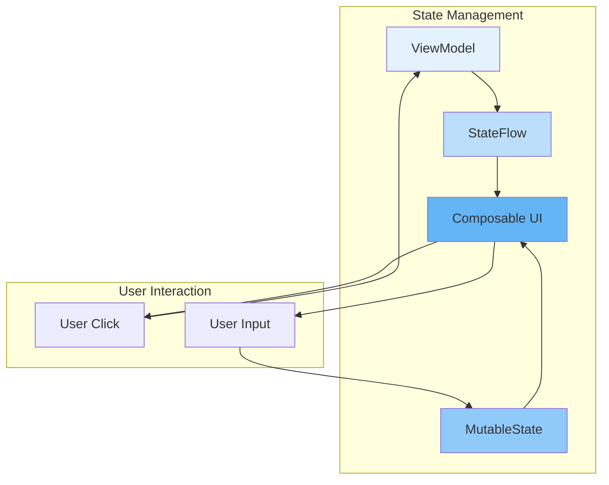
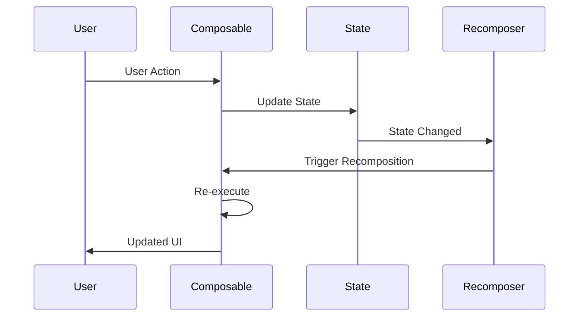

# Jetpack Compose State Management

## Overview

State management is fundamental to building reactive UIs in Jetpack Compose. Understanding how state works, when recomposition occurs, and how to structure state in your app is crucial for building performant Compose applications. This guide covers state hoisting, state holders, ViewModel integration, and advanced state management patterns.

## Deep Explanation

### What is State in Compose?

State in Compose is any value that can change over time and triggers recomposition when it changes. When state changes, Compose automatically recomposes (redraws) the affected parts of the UI.

### State Types

#### 1. MutableState

```kotlin
@Composable
fun Counter() {
    var count by remember { mutableStateOf(0) }
    
    Button(onClick = { count++ }) {
        Text("Count: $count")
    }
}
```

#### 2. StateFlow (from ViewModel)

```kotlin
class CounterViewModel : ViewModel() {
    private val _count = MutableStateFlow(0)
    val count: StateFlow<Int> = _count.asStateFlow()
    
    fun increment() {
        _count.value++
    }
}

@Composable
fun CounterScreen(viewModel: CounterViewModel = viewModel()) {
    val count by viewModel.count.collectAsState()
    
    Button(onClick = { viewModel.increment() }) {
        Text("Count: $count")
    }
}
```

#### 3. LiveData (legacy, but supported)

```kotlin
@Composable
fun CounterScreen(viewModel: CounterViewModel) {
    val count by viewModel.count.observeAsState(0)
    // ...
}
```

### State Hoisting

State hoisting moves state up to a common ancestor so multiple composables can share it:

```kotlin
// BAD: State in child, can't be shared
@Composable
fun Parent() {
    Child()
}

@Composable
fun Child() {
    var count by remember { mutableStateOf(0) }
    // Only Child can access count
}

// GOOD: State hoisted to parent
@Composable
fun Parent() {
    var count by remember { mutableStateOf(0) }
    Child(count = count, onCountChange = { count = it })
    AnotherChild(count = count) // Can share state
}

@Composable
fun Child(count: Int, onCountChange: (Int) -> Unit) {
    Button(onClick = { onCountChange(count + 1) }) {
        Text("Count: $count")
    }
}
```

### State Holders

For complex state, use state holder classes:

```kotlin
class LoginUiState(
    val email: String = "",
    val password: String = "",
    val isLoading: Boolean = false,
    val error: String? = null
)

class LoginStateHolder(
    private val viewModel: LoginViewModel
) {
    var uiState by mutableStateOf(LoginUiState())
        private set
    
    fun updateEmail(email: String) {
        uiState = uiState.copy(email = email)
    }
    
    fun updatePassword(password: String) {
        uiState = uiState.copy(password = password)
    }
    
    fun login() {
        viewModel.login(uiState.email, uiState.password)
    }
}

@Composable
fun rememberLoginStateHolder(
    viewModel: LoginViewModel = viewModel()
): LoginStateHolder {
    return remember {
        LoginStateHolder(viewModel)
    }
}

@Composable
fun LoginScreen() {
    val stateHolder = rememberLoginStateHolder()
    val uiState = stateHolder.uiState
    
    Column {
        TextField(
            value = uiState.email,
            onValueChange = stateHolder::updateEmail
        )
        TextField(
            value = uiState.password,
            onValueChange = stateHolder::updatePassword
        )
        Button(
            onClick = stateHolder::login,
            enabled = !uiState.isLoading
        ) {
            Text("Login")
        }
        uiState.error?.let { Text(it) }
    }
}
```

## Diagrams

### State Flow in Compose



### Recomposition Flow



## Real Code Examples

### Complete Example: Todo App with State Management

```kotlin
// ViewModel
class TodoViewModel : ViewModel() {
    private val _todos = MutableStateFlow<List<Todo>>(emptyList())
    val todos: StateFlow<List<Todo>> = _todos.asStateFlow()
    
    private val _filter = MutableStateFlow(TodoFilter.ALL)
    val filter: StateFlow<TodoFilter> = _filter.asStateFlow()
    
    fun addTodo(text: String) {
        val newTodo = Todo(
            id = UUID.randomUUID().toString(),
            text = text,
            completed = false
        )
        _todos.value = _todos.value + newTodo
    }
    
    fun toggleTodo(id: String) {
        _todos.value = _todos.value.map { todo ->
            if (todo.id == id) todo.copy(completed = !todo.completed)
            else todo
        }
    }
    
    fun setFilter(filter: TodoFilter) {
        _filter.value = filter
    }
    
    val filteredTodos: StateFlow<List<Todo>> = combine(_todos, _filter) { todos, filter ->
        when (filter) {
            TodoFilter.ALL -> todos
            TodoFilter.ACTIVE -> todos.filter { !it.completed }
            TodoFilter.COMPLETED -> todos.filter { it.completed }
        }
    }.stateIn(
        scope = viewModelScope,
        started = SharingStarted.WhileSubscribed(5000),
        initialValue = emptyList()
    )
}

data class Todo(
    val id: String,
    val text: String,
    val completed: Boolean
)

enum class TodoFilter { ALL, ACTIVE, COMPLETED }

// Composable
@Composable
fun TodoScreen(viewModel: TodoViewModel = viewModel()) {
    val todos by viewModel.filteredTodos.collectAsState()
    val filter by viewModel.filter.collectAsState()
    
    Column(modifier = Modifier.padding(16.dp)) {
        TodoInput(onAddTodo = viewModel::addTodo)
        TodoFilterBar(
            currentFilter = filter,
            onFilterSelected = viewModel::setFilter
        )
        LazyColumn {
            items(todos) { todo ->
                TodoItem(
                    todo = todo,
                    onToggle = { viewModel.toggleTodo(todo.id) }
                )
            }
        }
    }
}

@Composable
fun TodoInput(onAddTodo: (String) -> Unit) {
    var text by remember { mutableStateOf("") }
    
    Row {
        TextField(
            value = text,
            onValueChange = { text = it },
            modifier = Modifier.weight(1f)
        )
        Button(onClick = {
            if (text.isNotBlank()) {
                onAddTodo(text)
                text = ""
            }
        }) {
            Text("Add")
        }
    }
}

@Composable
fun TodoItem(todo: Todo, onToggle: () -> Unit) {
    Row(
        modifier = Modifier
            .fillMaxWidth()
            .clickable { onToggle() }
            .padding(8.dp)
    ) {
        Checkbox(
            checked = todo.completed,
            onCheckedChange = { onToggle() }
        )
        Text(
            text = todo.text,
            modifier = Modifier.weight(1f),
            textDecoration = if (todo.completed) {
                TextDecoration.LineThrough
            } else {
                null
            }
        )
    }
}
```

## Hard Use-Case: Complex Form with Validation

### Problem

You need to build a registration form with:
- Multiple fields (name, email, password, confirm password)
- Real-time validation
- Error messages
- Loading state during submission
- Success/error feedback

### Solution

```kotlin
data class RegistrationFormState(
    val name: String = "",
    val email: String = "",
    val password: String = "",
    val confirmPassword: String = "",
    val nameError: String? = null,
    val emailError: String? = null,
    val passwordError: String? = null,
    val confirmPasswordError: String? = null,
    val isLoading: Boolean = false,
    val isSuccess: Boolean = false,
    val errorMessage: String? = null
)

class RegistrationViewModel : ViewModel() {
    private val _uiState = MutableStateFlow(RegistrationFormState())
    val uiState: StateFlow<RegistrationFormState> = _uiState.asStateFlow()
    
    fun updateName(name: String) {
        _uiState.value = _uiState.value.copy(
            name = name,
            nameError = validateName(name)
        )
    }
    
    fun updateEmail(email: String) {
        _uiState.value = _uiState.value.copy(
            email = email,
            emailError = validateEmail(email)
        )
    }
    
    fun updatePassword(password: String) {
        val state = _uiState.value
        _uiState.value = state.copy(
            password = password,
            passwordError = validatePassword(password),
            confirmPasswordError = if (state.confirmPassword.isNotEmpty()) {
                validatePasswordMatch(password, state.confirmPassword)
            } else null
        )
    }
    
    fun updateConfirmPassword(confirmPassword: String) {
        val state = _uiState.value
        _uiState.value = state.copy(
            confirmPassword = confirmPassword,
            confirmPasswordError = validatePasswordMatch(state.password, confirmPassword)
        )
    }
    
    fun submit() {
        val state = _uiState.value
        if (isFormValid(state)) {
            viewModelScope.launch {
                _uiState.value = state.copy(isLoading = true, errorMessage = null)
                try {
                    // Registration API call
                    registerUser(state.name, state.email, state.password)
                    _uiState.value = state.copy(
                        isLoading = false,
                        isSuccess = true
                    )
                } catch (e: Exception) {
                    _uiState.value = state.copy(
                        isLoading = false,
                        errorMessage = e.message
                    )
                }
            }
        }
    }
    
    private fun validateName(name: String): String? {
        return when {
            name.isBlank() -> "Name is required"
            name.length < 2 -> "Name must be at least 2 characters"
            else -> null
        }
    }
    
    private fun validateEmail(email: String): String? {
        return when {
            email.isBlank() -> "Email is required"
            !android.util.Patterns.EMAIL_ADDRESS.matcher(email).matches() -> "Invalid email"
            else -> null
        }
    }
    
    private fun validatePassword(password: String): String? {
        return when {
            password.isBlank() -> "Password is required"
            password.length < 8 -> "Password must be at least 8 characters"
            !password.any { it.isDigit() } -> "Password must contain a number"
            else -> null
        }
    }
    
    private fun validatePasswordMatch(password: String, confirmPassword: String): String? {
        return if (password != confirmPassword) {
            "Passwords do not match"
        } else null
    }
    
    private fun isFormValid(state: RegistrationFormState): Boolean {
        return state.nameError == null &&
                state.emailError == null &&
                state.passwordError == null &&
                state.confirmPasswordError == null &&
                state.name.isNotBlank() &&
                state.email.isNotBlank() &&
                state.password.isNotBlank() &&
                state.confirmPassword.isNotBlank()
    }
}

@Composable
fun RegistrationScreen(viewModel: RegistrationViewModel = viewModel()) {
    val state by viewModel.uiState.collectAsState()
    
    if (state.isSuccess) {
        SuccessScreen()
    } else {
        Column(
            modifier = Modifier
                .fillMaxSize()
                .padding(16.dp)
                .verticalScroll(rememberScrollState()),
            verticalArrangement = Arrangement.spacedBy(16.dp)
        ) {
            Text("Register", style = MaterialTheme.typography.headlineLarge)
            
            OutlinedTextField(
                value = state.name,
                onValueChange = viewModel::updateName,
                label = { Text("Name") },
                isError = state.nameError != null,
                modifier = Modifier.fillMaxWidth()
            )
            state.nameError?.let {
                Text(it, color = MaterialTheme.colorScheme.error)
            }
            
            OutlinedTextField(
                value = state.email,
                onValueChange = viewModel::updateEmail,
                label = { Text("Email") },
                isError = state.emailError != null,
                modifier = Modifier.fillMaxWidth()
            )
            state.emailError?.let {
                Text(it, color = MaterialTheme.colorScheme.error)
            }
            
            OutlinedTextField(
                value = state.password,
                onValueChange = viewModel::updatePassword,
                label = { Text("Password") },
                visualTransformation = PasswordVisualTransformation(),
                isError = state.passwordError != null,
                modifier = Modifier.fillMaxWidth()
            )
            state.passwordError?.let {
                Text(it, color = MaterialTheme.colorScheme.error)
            }
            
            OutlinedTextField(
                value = state.confirmPassword,
                onValueChange = viewModel::updateConfirmPassword,
                label = { Text("Confirm Password") },
                visualTransformation = PasswordVisualTransformation(),
                isError = state.confirmPasswordError != null,
                modifier = Modifier.fillMaxWidth()
            )
            state.confirmPasswordError?.let {
                Text(it, color = MaterialTheme.colorScheme.error)
            }
            
            state.errorMessage?.let {
                Text(it, color = MaterialTheme.colorScheme.error)
            }
            
            Button(
                onClick = viewModel::submit,
                enabled = !state.isLoading,
                modifier = Modifier.fillMaxWidth()
            ) {
                if (state.isLoading) {
                    CircularProgressIndicator(modifier = Modifier.size(16.dp))
                } else {
                    Text("Register")
                }
            }
        }
    }
}
```

## Edge Cases and Pitfalls

### 1. Unnecessary Recomposition

**Problem**: State changes trigger too many recompositions

```kotlin
// BAD: Creates new list on every recomposition
@Composable
fun TodoList(todos: List<Todo>) {
    LazyColumn {
        items(todos.sorted()) { // New list created every time
            TodoItem(todo = it)
        }
    }
}

// GOOD: Use derivedStateOf or remember
@Composable
fun TodoList(todos: List<Todo>) {
    val sortedTodos = remember(todos) { todos.sorted() }
    LazyColumn {
        items(sortedTodos) {
            TodoItem(todo = it)
        }
    }
}
```

### 2. State in Wrong Scope

**Problem**: State doesn't survive configuration changes

```kotlin
// BAD: State lost on rotation
@Composable
fun MyScreen() {
    var count by remember { mutableStateOf(0) } // Lost on rotation
}

// GOOD: Use ViewModel
@Composable
fun MyScreen(viewModel: MyViewModel = viewModel()) {
    val count by viewModel.count.collectAsState() // Survives rotation
}
```

### 3. Mutable State in Lists

**Problem**: Modifying state in lists causes issues

```kotlin
// BAD: Direct mutation
@Composable
fun TodoList(todos: List<Todo>) {
    LazyColumn {
        items(todos) { todo ->
            var completed = todo.completed // Local copy
            Checkbox(
                checked = completed,
                onCheckedChange = { completed = it } // Doesn't update original
            )
        }
    }
}

// GOOD: Callback to update state
@Composable
fun TodoList(
    todos: List<Todo>,
    onToggle: (String) -> Unit
) {
    LazyColumn {
        items(todos) { todo ->
            Checkbox(
                checked = todo.completed,
                onCheckedChange = { onToggle(todo.id) }
            )
        }
    }
}
```

### 4. State Hoisting Too High

**Problem**: Hoisting state too high causes unnecessary recompositions

```kotlin
// BAD: All children recompose when any state changes
@Composable
fun Parent() {
    var state1 by remember { mutableStateOf(0) }
    var state2 by remember { mutableStateOf(0) }
    
    Child1(state1) // Recomposes when state2 changes
    Child2(state2) // Recomposes when state1 changes
}

// GOOD: Keep state local when possible
@Composable
fun Parent() {
    Child1() // Manages own state
    Child2() // Manages own state
}
```

## Composable Scopes

### What are Composable Scopes?

**Composable Scope**: Scope of recomposition affected by state changes

**Types**:
- **Restart Scope**: Entire composable restarts when state changes
- **Skip Scope**: Can skip recomposition if inputs unchanged
- **Remember Scope**: Remember values persist across recompositions

### Restart Scope

**Restart Scope**: When state changes, entire composable restarts

**Example**:
```kotlin
@Composable
fun MyComposable(count: Int) {
    // All code in restart scope
    Text("Count: $count")
    Button(onClick = { }) {
        Text("Click")
    }
    // Entire composable re-executes when count changes
}
```

**Behavior**: Entire composable re-executes

### Skip Scope

**Skip Scope**: Can skip recomposition if inputs unchanged

**Conditions**:
- **Stable Inputs**: All inputs are stable types
- **Unchanged**: Inputs haven't changed

**Example**:
```kotlin
@Composable
fun StableComposable(
    name: String  // Stable input
) {
    // Can skip if name unchanged
    Text(name)
}

@Composable
fun UnstableComposable(
    user: User  // Unstable - always recomposes
) {
    // Always recomposes
    Text(user.name)
}
```

### Remember Scope

**Remember Scope**: Remember values persist across recompositions

**Example**:
```kotlin
@Composable
fun MyComposable() {
    val expensiveValue = remember {
        // Computed once, reused across recompositions
        expensiveComputation()
    }
    
    Text("Value: $expensiveValue")
}
```

## Stability Annotations

### What are Stability Annotations?

**Stability Annotations**: Tell Compose about type stability to guide recomposition decisions

**Types**:
- **@Stable**: Stable but mutable (values stable unless explicitly changed)
- **@Immutable**: Immutable, always stable (never changes after creation)

**Purpose**: Optimize recomposition by skipping unnecessary recompositions

### Type Stability

**Stable Types**:
- **Primitives**: Int, String, Boolean, Float, etc.
- **@Stable**: Classes marked with @Stable annotation
- **@Immutable**: Classes marked with @Immutable annotation

**Unstable Types**:
- **Mutable Collections**: MutableList, HashMap, MutableMap
- **Unmarked Classes**: Classes without stability annotations

## @Stable Annotation

### What is @Stable?

**@Stable**: Marks type as stable - values won't change unless explicitly changed

**Characteristics**:
- **Stable**: Values stable unless changed
- **Mutable**: Can be mutable
- **Equality**: Uses structural equality (equals/hashCode)

### @Stable Example

**Example**:
```kotlin
@Stable
class UserState(
    val name: String,
    val age: Int
) {
    // Can have mutable properties
    var lastUpdated: Long = System.currentTimeMillis()
    
    fun copy(name: String = this.name): UserState {
        return UserState(name, age).also {
            it.lastUpdated = System.currentTimeMillis()
        }
    }
}

@Composable
fun UserProfile(user: UserState) {
    // Can skip recomposition if user unchanged
    Text("Name: ${user.name}")
    Text("Age: ${user.age}")
}
```

**Benefit**: Compose can skip recomposition when user state unchanged

### When to Use @Stable

**Use @Stable When**:
- **State Holders**: State holder classes
- **UI State**: UI state classes
- **Mutable but Stable**: Mutable but stable values

**Example**:
```kotlin
@Stable
class LoginUiState(
    val email: String,
    val password: String,
    val isLoading: Boolean
) {
    fun copy(
        email: String = this.email,
        password: String = this.password,
        isLoading: Boolean = this.isLoading
    ): LoginUiState {
        return LoginUiState(email, password, isLoading)
    }
}
```

## @Immutable Annotation

### What is @Immutable?

**@Immutable**: Marks type as immutable - never changes after creation

**Characteristics**:
- **Immutable**: Cannot change after creation
- **Always Stable**: Always considered stable
- **Value Types**: Value-like types

### @Immutable Example

**Example**:
```kotlin
@Immutable
data class Color(
    val red: Float,
    val green: Float,
    val blue: Float,
    val alpha: Float
)

@Composable
fun ColoredBox(color: Color) {
    // Always skips if color unchanged
    Box(modifier = Modifier.background(color.toColor()))
}
```

**Benefit**: Maximum recomposition skipping

### When to Use @Immutable

**Use @Immutable When**:
- **Value Types**: Value-like types
- **Data Classes**: Immutable data classes
- **Constants**: Constant values

**Example**:
```kotlin
@Immutable
data class Point(
    val x: Float,
    val y: Float
)

@Immutable
data class Size(
    val width: Float,
    val height: Float
)

@Composable
fun DrawShape(position: Point, size: Size) {
    // Both stable, can skip recomposition
    Canvas {
        drawRect(position, size)
    }
}
```

## CompositionLocal

### What is CompositionLocal?

**CompositionLocal**: Implicit composition-scoped values passed through composition tree

**Purpose**:
- **Avoid Prop Drilling**: Avoid passing values through many levels
- **Provide Context**: Provide context values
- **Scoped Values**: Composition-scoped values

**Use Cases**:
- **Theme**: Theme values (colors, typography)
- **Configuration**: Configuration values (density, locale)
- **Context**: Context values (Activity context)

### CompositionLocal Example

**Definition**:
```kotlin
val LocalDensity = compositionLocalOf<Density> {
    error("No Density provided")
}

val LocalContext = compositionLocalOf<Context> {
    error("No Context provided")
}

val LocalConfiguration = compositionLocalOf<Configuration> {
    error("No Configuration provided")
}
```

**Providing Values**:
```kotlin
@Composable
fun App() {
    val density = Density(context.resources.displayMetrics.density)
    val configuration = context.resources.configuration
    
    CompositionLocalProvider(
        LocalDensity provides density,
        LocalContext provides context,
        LocalConfiguration provides configuration
    ) {
        // Children can access via LocalDensity.current
        Content()
    }
}
```

**Accessing Values**:
```kotlin
@Composable
fun Content() {
    val density = LocalDensity.current
    val context = LocalContext.current
    val configuration = LocalConfiguration.current
    
    // Use density, context, configuration
    val widthPx = with(density) { 100.dp.toPx() }
}
```

### CompositionLocal Benefits

**Benefits**:
- **No Prop Drilling**: Avoid passing through many levels
- **Implicit**: Implicit access
- **Scoped**: Composition-scoped

**Trade-offs**:
- **Less Explicit**: Less explicit than parameters
- **Harder to Track**: Harder to track dependencies

## LocalDensity

### What is LocalDensity?

**LocalDensity**: CompositionLocal for density information

**Purpose**:
- **Convert dp/px**: Convert between density-independent pixels and pixels
- **Handle Density Scaling**: Handle different screen densities
- **Responsive Layouts**: Create density-aware layouts

### LocalDensity Usage

**Usage**:
```kotlin
@Composable
fun MyComposable() {
    val density = LocalDensity.current
    
    // Convert dp to px
    val widthPx = with(density) { 100.dp.toPx() }
    
    // Convert px to dp
    val heightDp = with(density) { 200.px.toDp() }
    
    Box(
        modifier = Modifier
            .width(widthPx.toInt().dp)
            .height(heightDp)
    ) {
        Text("Responsive")
    }
}
```

**Example**:
```kotlin
@Composable
fun ResponsiveBox() {
    val density = LocalDensity.current
    val configuration = LocalConfiguration.current
    val screenWidthDp = configuration.screenWidthDp
    
    Box(
        modifier = Modifier
            .width(with(density) { screenWidthDp.dp })
            .height(100.dp)
    ) {
        Text("Responsive Box")
    }
}
```

**Use**: Density-aware layouts, responsive design

## Relayout

### What is Relayout?

**Relayout**: Re-measure and re-layout composables when size constraints change

**Trigger**:
- **Size Constraints Change**: Parent size changes
- **Layout Changes**: Layout structure changes
- **Measure Changes**: Measurement requirements change

**Process**:
```
1. Constraints change
2. Measure phase (determine size)
3. Layout phase (position children)
4. Draw phase (render)
```

### Relayout Optimization

**Minimize Relayout**:
- **Stable Sizes**: Use stable sizes when possible
- **Avoid Unnecessary Changes**: Avoid unnecessary size changes
- **Remember Sizes**: Remember computed sizes

**Example**:
```kotlin
// BAD: Causes relayout on every recomposition
@Composable
fun BadExample() {
    var width by remember { mutableStateOf(100.dp) }
    Box(modifier = Modifier.width(width)) {
        // Relayouts when width changes
        Text("Content")
    }
}

// GOOD: Stable size
@Composable
fun GoodExample() {
    Box(modifier = Modifier.width(100.dp)) {
        // No relayout unless constraints change
        Text("Content")
    }
}
```

### Relayout vs Recomposition

**Recomposition**:
- **Re-execute**: Re-execute composable function
- **State Changes**: Triggered by state changes
- **Scope**: Composable scope

**Relayout**:
- **Re-measure/Layout**: Re-measure and re-layout
- **Constraint Changes**: Triggered by size constraint changes
- **Scope**: Layout scope

**Relationship**:
- **Recomposition may trigger relayout**: If size changes
- **Relayout doesn't trigger recomposition**: Layout is separate phase

## Performance Best Practices

### Practice 1: Use Stability Annotations

**Annotate Types**:
```kotlin
@Stable
class UiState { ... }

@Immutable
data class Config { ... }
```

**Benefit**: Better recomposition skipping

### Practice 2: Minimize Recomposition Scope

**Keep Scope Small**:
```kotlin
// BAD: Large scope - all recompose together
@Composable
fun LargeScope() {
    var count1 by remember { mutableStateOf(0) }
    var count2 by remember { mutableStateOf(0) }
    
    Child1(count1)  // Recomposes when count2 changes
    Child2(count2)  // Recomposes when count1 changes
}

// GOOD: Small scopes - independent recomposition
@Composable
fun SmallScopes() {
    SmallComposable1()  // Own scope
    SmallComposable2()  // Own scope
    // Each has independent scope
}
```

### Practice 3: Use Remember for Expensive Computations

**Remember Expensive Operations**:
```kotlin
@Composable
fun MyComposable(data: List<Item>) {
    val sortedData = remember(data) {
        // Recomputes only when data changes
        data.sorted()
    }
    
    val filteredData = remember(data, filter) {
        // Recomputes when data or filter changes
        data.filter { it.matches(filter) }
    }
}
```

### Practice 4: Avoid Unstable Types

**Avoid Mutable Collections**:
```kotlin
// BAD: Unstable - always recomposes
@Composable
fun Bad(list: MutableList<String>) {
    // Always recomposes
    LazyColumn {
        items(list) { Text(it) }
    }
}

// GOOD: Stable - can skip if unchanged
@Composable
fun Good(list: List<String>) {
    // Can skip if list unchanged
    LazyColumn {
        items(list) { Text(it) }
    }
}
```

### Practice 5: Use derivedStateOf

**Derived State**:
```kotlin
@Composable
fun MyComposable(items: List<Item>) {
    val sortedItems = remember {
        derivedStateOf {
            // Only recomputes when items change
            items.sorted()
        }
    }
    
    LazyColumn {
        items(sortedItems.value) { ... }
    }
}
```

## References and Further Reading

- [Compose State Documentation](https://developer.android.com/jetpack/compose/state)
- [State and Jetpack Compose](https://developer.android.com/jetpack/compose/state)
- [State Hoisting](https://developer.android.com/jetpack/compose/state#state-hoisting)
- [Compose Performance](https://developer.android.com/jetpack/compose/performance)
- [Stability in Compose](https://developer.android.com/jetpack/compose/performance#stability)
- [CompositionLocal](https://developer.android.com/jetpack/compose/compositionlocal)
- [Architecture Components with Compose](https://developer.android.com/jetpack/compose/libraries#architecture-components)

## Quiz

### Question 1
What triggers recomposition in Jetpack Compose?

**A)** Time passing  
**B)** State changes  
**C)** User interaction  
**D)** System events

**Answer: B** - Recomposition is triggered when observed state changes. User interactions update state, which then triggers recomposition.

### Question 2
What is the purpose of state hoisting?

**A)** To improve performance  
**B)** To share state between composables  
**C)** To reduce memory usage  
**D)** To simplify code

**Answer: B** - State hoisting moves state to a common ancestor so multiple composables can access and modify the same state.

### Question 3
Which is the recommended way to manage state that should survive configuration changes?

**A)** `remember { mutableStateOf() }`  
**B)** `ViewModel` with `StateFlow`  
**C)** `var` in composable  
**D)** Global variable

**Answer: B** - ViewModel with StateFlow is the recommended approach for state that should survive configuration changes and process death.

### Question 4
What does @Stable annotation do?

**A)** Makes type immutable  
**B)** Tells Compose type is stable, enabling recomposition skipping  
**C)** Makes type mutable  
**D)** Nothing

**Answer: B** - @Stable tells Compose a type is stable, enabling recomposition skipping when values haven't changed structurally.

### Question 5
What is CompositionLocal?

**A)** Global variable  
**B)** Implicit composition-scoped values passed through composition tree  
**C)** Parameter  
**D)** Property

**Answer: B** - CompositionLocal provides implicit values scoped to composition, avoiding prop drilling while maintaining composition scope.

### Question 6
What is relayout?

**A)** Re-execution of composable  
**B)** Re-measure and re-layout when size constraints change  
**C)** State change  
**D)** Drawing change

**Answer: B** - Relayout is the re-measurement and re-layout of composables when size constraints change, separate from recomposition.

### Question 4
What is the difference between `mutableStateOf` and `StateFlow`?

**A)** They're the same  
**B)** `mutableStateOf` is for Compose, `StateFlow` is for ViewModels  
**C)** `StateFlow` is faster  
**D)** `mutableStateOf` is deprecated

**Answer: B** - `mutableStateOf` is Compose's state holder, while `StateFlow` is Kotlin's reactive stream that works well with ViewModels and can be collected in Compose.

### Question 5
When should you use `remember` with state?

**A)** Always  
**B)** When state should survive recomposition  
**C)** Never  
**D)** Only in ViewModels

**Answer: B** - `remember` ensures that state survives recomposition. Without it, state would be reset on every recomposition.

## Related Topics

- [Introduction to Android Architecture](../01_beginners/01.%20Introduction%20to%20Android%20Architecture.md) - MVVM pattern
- [Kotlin Coroutines Basics](../01_beginners/03.%20Kotlin%20Coroutines%20Basics.md) - Async state updates
- [Navigation & Deep Links](./03.%20Navigation%20%26%20Deep%20Links.md) - State in navigation

