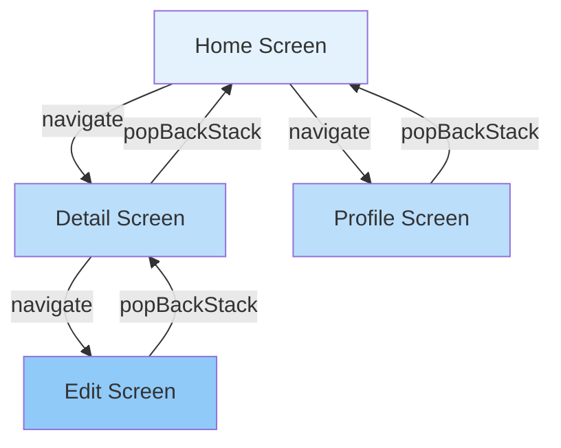
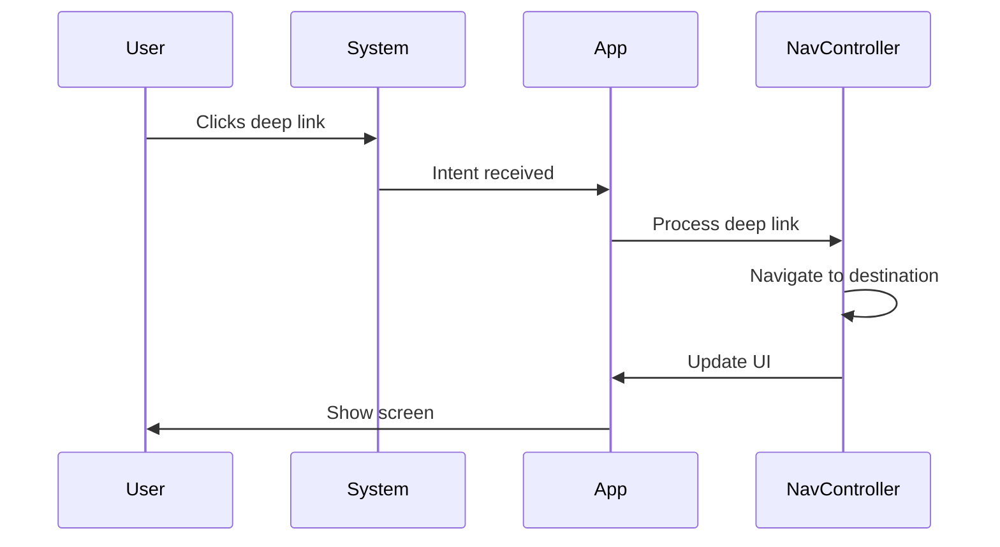

# Navigation & Deep Links

## Overview

Navigation is a critical part of Android app architecture. This guide covers the Navigation Component for both traditional Views and Jetpack Compose, deep linking (both app links and explicit deep links), navigation patterns, and best practices for building maintainable navigation in Android apps.

## Deep Explanation

### Navigation Component Basics

The Navigation Component provides a framework for navigating between destinations in your app. It handles:
- Fragment transactions
- Up and back button behavior
- Deep linking
- Type-safe argument passing
- Animation transitions

### Navigation Graph

A navigation graph defines all possible destinations and actions:

```kotlin
// navigation/nav_graph.xml (XML)
<navigation xmlns:android="http://schemas.android.com/apk/res/android"
    xmlns:app="http://schemas.android.com/apk/res-auto"
    android:id="@+id/nav_graph"
    app:startDestination="@id/homeFragment">

    <fragment
        android:id="@+id/homeFragment"
        android:name="com.example.HomeFragment"
        android:label="Home">
        <action
            android:id="@+id/action_home_to_detail"
            app:destination="@id/detailFragment" />
    </fragment>

    <fragment
        android:id="@+id/detailFragment"
        android:name="com.example.DetailFragment"
        android:label="Detail">
        <argument
            android:name="itemId"
            app:argType="string" />
    </fragment>
</navigation>
```

### Compose Navigation

In Jetpack Compose, navigation is code-based:

```kotlin
@Composable
fun AppNavigation() {
    val navController = rememberNavController()
    
    NavHost(
        navController = navController,
        startDestination = "home"
    ) {
        composable("home") {
            HomeScreen(
                onNavigateToDetail = { itemId ->
                    navController.navigate("detail/$itemId")
                }
            )
        }
        
        composable(
            route = "detail/{itemId}",
            arguments = listOf(navArgument("itemId") { type = NavType.StringType })
        ) { backStackEntry ->
            val itemId = backStackEntry.arguments?.getString("itemId") ?: ""
            DetailScreen(itemId = itemId)
        }
    }
}
```

## Diagrams

### Navigation Graph Structure



### Deep Link Flow



## Real Code Examples

### Complete Navigation Setup

```kotlin
// Navigation.kt
sealed class Screen(val route: String) {
    object Home : Screen("home")
    object Profile : Screen("profile")
    object Settings : Screen("settings")
    data class Detail(val itemId: String = "{itemId}") : Screen("detail/{itemId}") {
        fun createRoute(itemId: String) = "detail/$itemId"
    }
}

@Composable
fun AppNavigation() {
    val navController = rememberNavController()
    
    NavHost(
        navController = navController,
        startDestination = Screen.Home.route
    ) {
        composable(Screen.Home.route) {
            HomeScreen(
                onNavigateToDetail = { itemId ->
                    navController.navigate(Screen.Detail(itemId).createRoute(itemId))
                },
                onNavigateToProfile = {
                    navController.navigate(Screen.Profile.route)
                }
            )
        }
        
        composable(
            route = Screen.Detail().route,
            arguments = listOf(navArgument("itemId") { type = NavType.StringType })
        ) { backStackEntry ->
            val itemId = backStackEntry.arguments?.getString("itemId") ?: ""
            DetailScreen(
                itemId = itemId,
                onNavigateBack = { navController.popBackStack() }
            )
        }
        
        composable(Screen.Profile.route) {
            ProfileScreen(
                onNavigateToSettings = {
                    navController.navigate(Screen.Settings.route)
                }
            )
        }
        
        composable(Screen.Settings.route) {
            SettingsScreen()
        }
    }
}
```

### Deep Links

#### App Links (HTTP/HTTPS)

```kotlin
// AndroidManifest.xml
<activity
    android:name=".MainActivity"
    android:exported="true">
    <intent-filter android:autoVerify="true">
        <action android:name="android.intent.action.VIEW" />
        <category android:name="android.intent.category.DEFAULT" />
        <category android:name="android.intent.category.BROWSABLE" />
        <data
            android:scheme="https"
            android:host="example.com"
            android:pathPrefix="/item" />
    </intent-filter>
</activity>

// In Navigation
composable(
    route = "detail/{itemId}",
    deepLinks = listOf(
        navDeepLink {
            uriPattern = "https://example.com/item/{itemId}"
        }
    )
) { backStackEntry ->
    val itemId = backStackEntry.arguments?.getString("itemId") ?: ""
    DetailScreen(itemId = itemId)
}
```

#### Explicit Deep Links (Custom Scheme)

```kotlin
composable(
    route = "detail/{itemId}",
    deepLinks = listOf(
        navDeepLink {
            uriPattern = "myapp://detail/{itemId}"
        }
    )
) { backStackEntry ->
    // Handle deep link
}
```

### Type-Safe Navigation (with Safe Args)

```kotlin
// For Compose, use sealed classes or type-safe builders
@Composable
fun TypeSafeNavigation() {
    val navController = rememberNavController()
    
    NavHost(navController, "home") {
        composable<HomeDestination> {
            HomeScreen(
                onNavigateToDetail = { itemId ->
                    navController.navigate(DetailDestination(itemId))
                }
            )
        }
        
        composable<DetailDestination> { backStackEntry ->
            val destination = backStackEntry.destination as DetailDestination
            DetailScreen(itemId = destination.itemId)
        }
    }
}

// Define destinations
sealed class AppDestination(val route: String) {
    @Serializable
    object HomeDestination : AppDestination("home")
    
    @Serializable
    data class DetailDestination(val itemId: String) : AppDestination("detail")
}
```

## Hard Use-Case: Complex Navigation with Bottom Navigation

### Problem

You need:
- Bottom navigation with 4 tabs
- Each tab has its own navigation stack
- Deep links should navigate to specific tabs
- State preservation when switching tabs
- Nested navigation within tabs

### Solution

```kotlin
@Composable
fun MainScreen() {
    val navController = rememberNavController()
    var selectedTab by remember { mutableStateOf(0) }
    
    Scaffold(
        bottomBar = {
            BottomNavigation {
                BottomNavigationItem(
                    selected = selectedTab == 0,
                    onClick = { selectedTab = 0 },
                    icon = { Icon(Icons.Default.Home, "Home") },
                    label = { Text("Home") }
                )
                BottomNavigationItem(
                    selected = selectedTab == 1,
                    onClick = { selectedTab = 1 },
                    icon = { Icon(Icons.Default.Search, "Search") },
                    label = { Text("Search") }
                )
                BottomNavigationItem(
                    selected = selectedTab == 2,
                    onClick = { selectedTab = 2 },
                    icon = { Icon(Icons.Default.Favorite, "Favorites") },
                    label = { Text("Favorites") }
                )
                BottomNavigationItem(
                    selected = selectedTab == 3,
                    onClick = { selectedTab = 3 },
                    icon = { Icon(Icons.Default.Person, "Profile") },
                    label = { Text("Profile") }
                )
            }
        }
    ) { padding ->
        NavHost(
            navController = navController,
            startDestination = "home_tab",
            modifier = Modifier.padding(padding)
        ) {
            // Home tab navigation
            navigation(
                route = "home_tab",
                startDestination = "home"
            ) {
                composable("home") {
                    HomeTabScreen(
                        onNavigateToDetail = { id ->
                            navController.navigate("home/detail/$id")
                        }
                    )
                }
                composable(
                    route = "home/detail/{id}",
                    arguments = listOf(navArgument("id") { type = NavType.StringType })
                ) { backStackEntry ->
                    val id = backStackEntry.arguments?.getString("id") ?: ""
                    DetailScreen(id = id)
                }
            }
            
            // Search tab navigation
            navigation(
                route = "search_tab",
                startDestination = "search"
            ) {
                composable("search") {
                    SearchTabScreen()
                }
            }
            
            // Favorites tab navigation
            navigation(
                route = "favorites_tab",
                startDestination = "favorites"
            ) {
                composable("favorites") {
                    FavoritesTabScreen()
                }
            }
            
            // Profile tab navigation
            navigation(
                route = "profile_tab",
                startDestination = "profile"
            ) {
                composable("profile") {
                    ProfileTabScreen()
                }
            }
        }
        
        // Handle tab changes
        LaunchedEffect(selectedTab) {
            val routes = listOf("home_tab", "search_tab", "favorites_tab", "profile_tab")
            navController.navigate(routes[selectedTab]) {
                popUpTo(navController.graph.startDestinationId) {
                    saveState = true
                }
                launchSingleTop = true
                restoreState = true
            }
        }
    }
}
```

### Alternative: Using Navigation Bar

```kotlin
@Composable
fun MainScreenWithNavBar() {
    val navController = rememberNavController()
    
    Scaffold(
        bottomBar = {
            NavigationBar {
                val routes = listOf("home", "search", "favorites", "profile")
                val currentRoute = navController.currentDestination?.route
                
                routes.forEachIndexed { index, route ->
                    NavigationBarItem(
                        selected = currentRoute == route,
                        onClick = {
                            navController.navigate(route) {
                                popUpTo(navController.graph.startDestinationId) {
                                    saveState = true
                                }
                                launchSingleTop = true
                                restoreState = true
                            }
                        },
                        icon = { Icon(getIconForRoute(route), route) },
                        label = { Text(route.capitalize()) }
                    )
                }
            }
        }
    ) { padding ->
        NavHost(
            navController = navController,
            startDestination = "home",
            modifier = Modifier.padding(padding)
        ) {
            composable("home") { HomeScreen() }
            composable("search") { SearchScreen() }
            composable("favorites") { FavoritesScreen() }
            composable("profile") { ProfileScreen() }
        }
    }
}
```

## Edge Cases and Pitfalls

### 1. Multiple Navigations

**Problem**: Navigating multiple times causes back stack issues

```kotlin
// BAD: Can navigate multiple times
Button(onClick = {
    navController.navigate("detail")
    navController.navigate("detail") // Duplicate entries
})

// GOOD: Use launchSingleTop
Button(onClick = {
    navController.navigate("detail") {
        launchSingleTop = true
    }
})
```

### 2. Deep Link Handling

**Problem**: Deep links don't work correctly

```kotlin
// BAD: Missing arguments in deep link
composable(
    route = "detail/{itemId}",
    deepLinks = listOf(
        navDeepLink { uriPattern = "myapp://detail" } // Missing {itemId}
    )
)

// GOOD: Match route pattern
composable(
    route = "detail/{itemId}",
    deepLinks = listOf(
        navDeepLink { uriPattern = "myapp://detail/{itemId}" }
    )
)
```

### 3. State Loss on Configuration Change

**Problem**: Navigation state lost on rotation

```kotlin
// GOOD: Use rememberSaveable
@Composable
fun MyScreen() {
    var state by rememberSaveable { mutableStateOf("") }
    // State survives configuration changes
}
```

### 4. Circular Navigation

**Problem**: Navigation loops

```kotlin
// BAD: Can create loops
Home -> Detail -> Edit -> Detail -> Edit (loop)

// GOOD: Use conditional navigation or popUpTo
navController.navigate("edit") {
    popUpTo("detail") {
        inclusive = false
    }
}
```

## References and Further Reading

- [Navigation Component](https://developer.android.com/guide/navigation)
- [Compose Navigation](https://developer.android.com/jetpack/compose/navigation)
- [Deep Links](https://developer.android.com/training/app-links)
- [Type-Safe Navigation](https://developer.android.com/guide/navigation/navigation-type-safety)

## Quiz

### Question 1
What is the purpose of `launchSingleTop` in navigation?

**A)** To launch a new instance  
**B)** To reuse existing instance if on top of back stack  
**C)** To clear back stack  
**D)** To animate transition

**Answer: B** - `launchSingleTop = true` reuses an existing instance if it's already on top of the back stack, preventing duplicate entries.

### Question 2
What is the difference between app links and explicit deep links?

**A)** App links use HTTPS, explicit use custom schemes  
**B)** They're the same  
**C)** App links require verification  
**D)** Both A and C

**Answer: D** - App links use HTTP/HTTPS and require domain verification, while explicit deep links use custom URI schemes and don't require verification.

### Question 3
What does `popUpTo` do in navigation?

**A)** Navigates forward  
**B)** Pops destinations up to a specific destination  
**C)** Clears all destinations  
**D)** Adds a destination

**Answer: B** - `popUpTo` removes destinations from the back stack up to (and optionally including) the specified destination.

### Question 4
How do you pass arguments in Compose Navigation?

**A)** Using Intent extras  
**B)** Using route parameters with `navArgument`  
**C)** Using global state  
**D)** Using SharedPreferences

**Answer: B** - In Compose Navigation, arguments are defined in the route using `navArgument` and accessed from `backStackEntry.arguments`.

### Question 5
What is the recommended way to handle bottom navigation with separate navigation stacks?

**A)** One NavHost for all tabs  
**B)** Separate NavHost for each tab  
**C)** Use `navigation` composable to create nested graphs  
**D)** Use fragments

**Answer: C** - Using the `navigation` composable allows you to create separate navigation graphs for each tab while maintaining a single NavHost.

## Related Topics

- [Jetpack Compose State Management](./10.%20Jetpack%20Compose%20State%20Management.md) - State in navigation
- [Introduction to Android Architecture](../01_beginners/01.%20Introduction%20to%20Android%20Architecture.md) - Architecture patterns
- [Testing Compose UIs](./12.%20Testing%20Compose%20UIs.md) - Testing navigation

