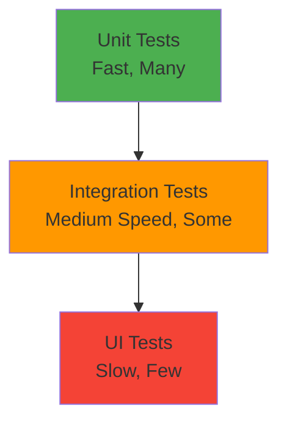
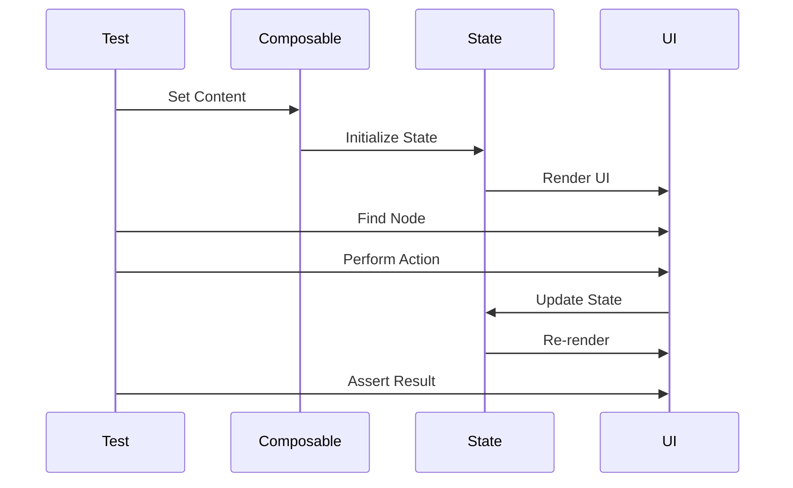

# Testing Compose UIs

## Overview

Testing is crucial for maintaining quality and preventing regressions in Android apps. This guide covers testing Jetpack Compose UIs, including unit tests for composables, UI tests with semantics, testing state, navigation testing, and best practices for writing maintainable test code.

## Deep Explanation

### Types of Tests

1. **Unit Tests**: Test individual composables in isolation
2. **Integration Tests**: Test interactions between composables
3. **UI Tests**: Test user interactions and visual output

### Testing Dependencies

```kotlin
dependencies {
    testImplementation "junit:junit:4.13.2"
    testImplementation "org.mockito:mockito-core:5.5.0"
    testImplementation "org.jetbrains.kotlinx:kotlinx-coroutines-test:1.7.3"
    
    androidTestImplementation "androidx.compose.ui:ui-test-junit4:1.5.4"
    androidTestImplementation "androidx.test.espresso:espresso-core:3.5.1"
    androidTestImplementation "androidx.test.ext:junit:1.1.5"
    debugImplementation "androidx.compose.ui:ui-test-manifest:1.5.4"
}
```

### Basic Composable Testing

```kotlin
@Test
fun testComposable() {
    composeTestRule.setContent {
        MyComposable()
    }
    
    composeTestRule.onNodeWithText("Hello").assertExists()
}
```

## Diagrams

### Testing Pyramid



### Test Flow



## Real Code Examples

### Unit Testing Composables

```kotlin
class CounterTest {
    @get:Rule
    val composeTestRule = createComposeRule()
    
    @Test
    fun counter_displaysInitialValue() {
        composeTestRule.setContent {
            Counter(initialValue = 5)
        }
        
        composeTestRule.onNodeWithText("5").assertExists()
    }
    
    @Test
    fun counter_incrementsOnButtonClick() {
        composeTestRule.setContent {
            Counter(initialValue = 0)
        }
        
        composeTestRule.onNodeWithText("0").assertExists()
        composeTestRule.onNodeWithText("Increment").performClick()
        composeTestRule.onNodeWithText("1").assertExists()
    }
}

@Composable
fun Counter(initialValue: Int) {
    var count by remember { mutableStateOf(initialValue) }
    
    Column {
        Text("$count")
        Button(onClick = { count++ }) {
            Text("Increment")
        }
    }
}
```

### Testing with ViewModel

```kotlin
class TodoViewModelTest {
    @get:Rule
    val composeTestRule = createComposeRule()
    
    @Test
    fun todoList_displaysTodosFromViewModel() = runTest {
        val viewModel = TodoViewModel(FakeTodoRepository())
        viewModel.addTodo("Test Todo")
        
        composeTestRule.setContent {
            TodoScreen(viewModel = viewModel)
        }
        
        composeTestRule.onNodeWithText("Test Todo").assertExists()
    }
    
    @Test
    fun todoList_addsTodoOnButtonClick() = runTest {
        val viewModel = TodoViewModel(FakeTodoRepository())
        
        composeTestRule.setContent {
            TodoScreen(viewModel = viewModel)
        }
        
        composeTestRule.onNodeWithText("Add Todo").performTextInput("New Todo")
        composeTestRule.onNodeWithText("Add").performClick()
        
        composeTestRule.onNodeWithText("New Todo").assertExists()
    }
}
```

### Testing Semantics

```kotlin
@Test
fun loginScreen_hasCorrectSemantics() {
    composeTestRule.setContent {
        LoginScreen()
    }
    
    // Find by semantics
    composeTestRule
        .onNodeWithContentDescription("Email input")
        .assertExists()
    
    composeTestRule
        .onNodeWithContentDescription("Password input")
        .assertExists()
    
    composeTestRule
        .onNodeWithContentDescription("Login button")
        .assertExists()
        .assertIsEnabled()
}

@Composable
fun LoginScreen() {
    Column {
        TextField(
            value = "",
            onValueChange = {},
            modifier = Modifier.semantics { contentDescription = "Email input" }
        )
        TextField(
            value = "",
            onValueChange = {},
            modifier = Modifier.semantics { contentDescription = "Password input" }
        )
        Button(
            onClick = {},
            modifier = Modifier.semantics { contentDescription = "Login button" }
        ) {
            Text("Login")
        }
    }
}
```

### Testing Navigation

```kotlin
class NavigationTest {
    @get:Rule
    val composeTestRule = createComposeRule()
    
    @Test
    fun navigation_navigatesToDetail() {
        val navController = TestNavHostController(LocalContext.current)
        navController.setGraph(NavGraph)
        
        composeTestRule.setContent {
            AppNavigation(navController = navController)
        }
        
        composeTestRule.onNodeWithText("Go to Detail").performClick()
        
        assertEquals("detail/123", navController.currentDestination?.route)
        composeTestRule.onNodeWithText("Detail Screen").assertExists()
    }
}
```

## Hard Use-Case: Testing Complex Form with Validation

### Problem

Test a registration form with:
- Multiple input fields
- Real-time validation
- Error messages
- Loading states
- Success/error feedback

### Solution

```kotlin
class RegistrationFormTest {
    @get:Rule
    val composeTestRule = createComposeRule()
    
    private lateinit var viewModel: RegistrationViewModel
    private lateinit var repository: FakeUserRepository
    
    @Before
    fun setup() {
        repository = FakeUserRepository()
        viewModel = RegistrationViewModel(repository)
    }
    
    @Test
    fun registrationForm_validatesName() {
        composeTestRule.setContent {
            RegistrationScreen(viewModel = viewModel)
        }
        
        // Test empty name
        composeTestRule.onNodeWithText("Name").performTextInput("")
        composeTestRule.onNodeWithText("Register").performClick()
        composeTestRule.onNodeWithText("Name is required").assertExists()
        
        // Test short name
        composeTestRule.onNodeWithText("Name").performTextInput("A")
        composeTestRule.onNodeWithText("Name must be at least 2 characters").assertExists()
        
        // Test valid name
        composeTestRule.onNodeWithText("Name").performTextInput("John")
        composeTestRule.onNodeWithText("Name is required").assertDoesNotExist()
    }
    
    @Test
    fun registrationForm_validatesEmail() {
        composeTestRule.setContent {
            RegistrationScreen(viewModel = viewModel)
        }
        
        // Test invalid email
        composeTestRule.onNodeWithText("Email").performTextInput("invalid")
        composeTestRule.onNodeWithText("Invalid email").assertExists()
        
        // Test valid email
        composeTestRule.onNodeWithText("Email").performTextInput("test@example.com")
        composeTestRule.onNodeWithText("Invalid email").assertDoesNotExist()
    }
    
    @Test
    fun registrationForm_submitsWhenValid() = runTest {
        composeTestRule.setContent {
            RegistrationScreen(viewModel = viewModel)
        }
        
        // Fill form
        composeTestRule.onNodeWithText("Name").performTextInput("John Doe")
        composeTestRule.onNodeWithText("Email").performTextInput("john@example.com")
        composeTestRule.onNodeWithText("Password").performTextInput("password123")
        composeTestRule.onNodeWithText("Confirm Password").performTextInput("password123")
        
        // Submit
        composeTestRule.onNodeWithText("Register").performClick()
        
        // Verify loading state
        composeTestRule.onNodeWithContentDescription("Loading").assertExists()
        
        // Wait for completion
        composeTestRule.waitForIdle()
        
        // Verify success
        composeTestRule.onNodeWithText("Registration successful").assertExists()
        assertEquals(1, repository.registeredUsers.size)
    }
    
    @Test
    fun registrationForm_showsErrorOnFailure() = runTest {
        repository.shouldFail = true
        
        composeTestRule.setContent {
            RegistrationScreen(viewModel = viewModel)
        }
        
        // Fill and submit form
        fillValidForm()
        composeTestRule.onNodeWithText("Register").performClick()
        
        composeTestRule.waitForIdle()
        
        // Verify error
        composeTestRule.onNodeWithText("Registration failed").assertExists()
    }
    
    private fun fillValidForm() {
        composeTestRule.onNodeWithText("Name").performTextInput("John Doe")
        composeTestRule.onNodeWithText("Email").performTextInput("john@example.com")
        composeTestRule.onNodeWithText("Password").performTextInput("password123")
        composeTestRule.onNodeWithText("Confirm Password").performTextInput("password123")
    }
}

// Fake repository for testing
class FakeUserRepository : UserRepository {
    var shouldFail = false
    val registeredUsers = mutableListOf<User>()
    
    override suspend fun registerUser(user: User): Result<Unit> {
        return if (shouldFail) {
            Result.failure(Exception("Registration failed"))
        } else {
            registeredUsers.add(user)
            Result.success(Unit)
        }
    }
}
```

### Alternative: Testing with State

```kotlin
@Test
fun registrationForm_updatesStateCorrectly() {
    composeTestRule.setContent {
        RegistrationScreen(viewModel = viewModel)
    }
    
    val state = viewModel.uiState.value
    assertEquals("", state.name)
    assertEquals("", state.email)
    assertFalse(state.isLoading)
    assertNull(state.errorMessage)
    
    composeTestRule.onNodeWithText("Name").performTextInput("John")
    
    composeTestRule.waitForIdle()
    
    val updatedState = viewModel.uiState.value
    assertEquals("John", updatedState.name)
}
```

## Edge Cases and Pitfalls

### 1. Testing Async Operations

**Problem**: Tests complete before async operations finish

```kotlin
// BAD: Test may fail due to timing
@Test
fun testAsyncOperation() {
    composeTestRule.setContent {
        MyScreen(viewModel = viewModel)
    }
    
    viewModel.loadData()
    composeTestRule.onNodeWithText("Data loaded").assertExists() // May not exist yet
}

// GOOD: Wait for idle or use coroutines test
@Test
fun testAsyncOperation() = runTest {
    composeTestRule.setContent {
        MyScreen(viewModel = viewModel)
    }
    
    viewModel.loadData()
    composeTestRule.waitForIdle()
    composeTestRule.onNodeWithText("Data loaded").assertExists()
}
```

### 2. Testing State Changes

**Problem**: Not waiting for recomposition

```kotlin
// BAD: May assert before recomposition
@Test
fun testStateChange() {
    composeTestRule.setContent {
        Counter()
    }
    
    composeTestRule.onNodeWithText("Increment").performClick()
    composeTestRule.onNodeWithText("1").assertExists() // May fail
}

// GOOD: Wait for idle
@Test
fun testStateChange() {
    composeTestRule.setContent {
        Counter()
    }
    
    composeTestRule.onNodeWithText("Increment").performClick()
    composeTestRule.waitForIdle()
    composeTestRule.onNodeWithText("1").assertExists()
}
```

### 3. Testing with Real ViewModels

**Problem**: Tests depend on real implementations

```kotlin
// BAD: Hard to test, slow
@Test
fun testWithRealViewModel() {
    val viewModel = MyViewModel(RealRepository(), RealApiService())
    // ...
}

// GOOD: Use fakes or mocks
@Test
fun testWithFakeViewModel() {
    val repository = FakeRepository()
    val viewModel = MyViewModel(repository)
    // Easy to control and fast
}
```

### 4. Finding Nodes

**Problem**: Ambiguous node selection

```kotlin
// BAD: May find wrong node
composeTestRule.onNodeWithText("Save").performClick()

// GOOD: Use semantics or more specific queries
composeTestRule
    .onNode(
        hasText("Save") and hasContentDescription("Save button")
    )
    .performClick()
```

## References and Further Reading

- [Testing in Compose](https://developer.android.com/jetpack/compose/testing)
- [Compose Testing Cheat Sheet](https://developer.android.com/jetpack/compose/testing-cheatsheet)
- [UI Testing](https://developer.android.com/training/testing/ui-testing)
- [Test-Driven Development](https://developer.android.com/training/testing/fundamentals)

## Quiz

### Question 1
What is the main difference between unit tests and UI tests for Compose?

**A)** Unit tests are faster  
**B)** Unit tests test composables in isolation, UI tests test user interactions  
**C)** UI tests require an emulator  
**D)** They're the same

**Answer: B** - Unit tests test composables in isolation with `createComposeRule()`, while UI tests (instrumented tests) run on a device/emulator and test full user interactions.

### Question 2
What should you use to wait for async operations in tests?

**A)** `Thread.sleep()`  
**B)** `waitForIdle()`  
**C)** `delay()`  
**D)** Nothing, tests wait automatically

**Answer: B** - `waitForIdle()` waits for all pending recompositions and coroutines to complete, making it ideal for testing async operations.

### Question 3
How do you test navigation in Compose?

**A)** Use real NavController  
**B)** Use TestNavHostController  
**C)** Mock navigation  
**D)** Can't test navigation

**Answer: B** - `TestNavHostController` allows you to test navigation without requiring a real activity or fragment.

### Question 4
What is the purpose of semantics in Compose testing?

**A)** To improve performance  
**B)** To make UI accessible and testable  
**C)** To reduce code size  
**D)** To enable animations

**Answer: B** - Semantics make UI elements accessible to screen readers and testing frameworks, allowing you to find and interact with elements reliably.

### Question 5
What is the recommended approach for testing ViewModels in Compose tests?

**A)** Always use real ViewModels  
**B)** Use fake repositories or mocks  
**C)** Don't test ViewModels  
**D)** Use only unit tests

**Answer: B** - Using fake repositories or mocks makes tests faster, more reliable, and easier to control, while still testing the integration between ViewModel and UI.

## Related Topics

- [Jetpack Compose State Management](./10.%20Jetpack%20Compose%20State%20Management.md) - Testing state
- [Introduction to Android Architecture](../01_beginners/01.%20Introduction%20to%20Android%20Architecture.md) - Testing architecture
- [SOLID Principles](../01_beginners/02.%20SOLID%20Principles.md) - Testable design

