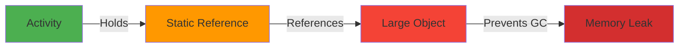
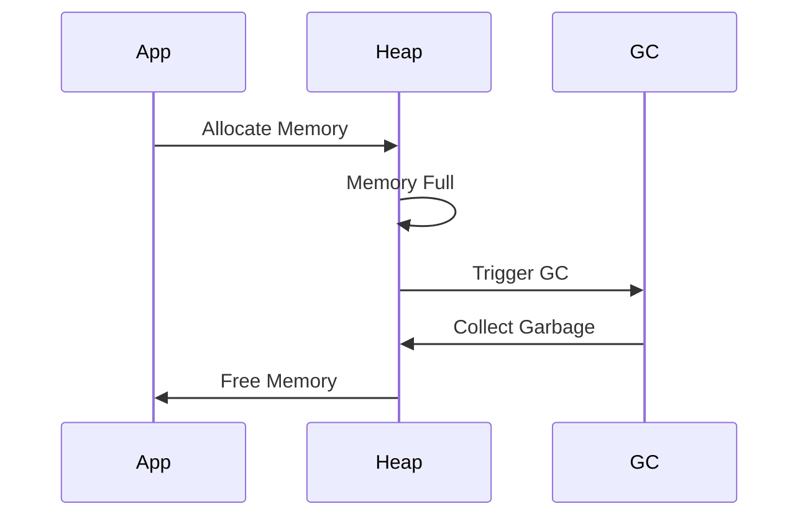

# Performance Profiling & Memory Leaks

## Overview

Performance optimization and memory leak detection are critical skills for advanced Android developers. This guide covers using Android Profiler, identifying memory leaks, optimizing app performance, understanding garbage collection, and best practices for building efficient Android applications.

## Deep Explanation

### Memory Leaks

A memory leak occurs when objects are no longer needed but still referenced, preventing garbage collection.

### Common Leak Sources

1. **Static References**
2. **Inner Classes**
3. **Listeners/Callbacks**
4. **Threads**
5. **Context References**

### Android Profiler

Android Studio's Profiler provides:
- CPU Profiler
- Memory Profiler
- Network Profiler
- Energy Profiler

## Diagrams

### Memory Leak Pattern



### GC Cycle



## Real Code Examples

### Detecting Memory Leaks

```kotlin
// BAD: Static reference to Activity
object AppManager {
    var currentActivity: Activity? = null // LEAK!
}

// GOOD: Use WeakReference or Application Context
object AppManager {
    private var currentActivityRef: WeakReference<Activity>? = null
    
    fun setActivity(activity: Activity) {
        currentActivityRef = WeakReference(activity)
    }
    
    fun getActivity(): Activity? = currentActivityRef?.get()
}

// BAD: Inner class holds outer reference
class MainActivity : AppCompatActivity() {
    private val handler = object : Handler(Looper.getMainLooper()) {
        override fun handleMessage(msg: Message) {
            // Holds reference to MainActivity
        }
    }
}

// GOOD: Static inner class or use WeakReference
class MainActivity : AppCompatActivity() {
    private val handler = MainHandler(this)
    
    private class MainHandler(activity: MainActivity) : Handler(Looper.getMainLooper()) {
        private val activityRef = WeakReference(activity)
        
        override fun handleMessage(msg: Message) {
            activityRef.get()?.let { activity ->
                // Use activity safely
            }
        }
    }
}
```

### LeakCanary Integration

```kotlin
dependencies {
    debugImplementation 'com.squareup.leakcanary:leakcanary-android:2.12'
}

// Automatically detects leaks in debug builds
// No code needed, just add dependency
```

### Performance Optimization

```kotlin
// BAD: Creating objects in loops
fun processList(items: List<Item>) {
    items.forEach { item ->
        val formatter = SimpleDateFormat("yyyy-MM-dd") // Created every iteration
        val date = formatter.format(item.date)
    }
}

// GOOD: Reuse objects
class ItemProcessor {
    private val dateFormatter = SimpleDateFormat("yyyy-MM-dd")
    
    fun processList(items: List<Item>) {
        items.forEach { item ->
            val date = dateFormatter.format(item.date)
        }
    }
}

// BAD: Unnecessary object creation
fun getFullName(user: User): String {
    return "${user.firstName} ${user.lastName}" // Creates new string
}

// GOOD: Use string builder for multiple concatenations
fun getFullName(user: User): String {
    return buildString {
        append(user.firstName)
        append(" ")
        append(user.lastName)
    }
}
```

## Hard Use-Case: Identifying and Fixing Complex Memory Leak

### Problem

Your app has:
- Memory usage growing over time
- Occasional OutOfMemoryErrors
- Slow performance after extended use
- Suspected leaks in ViewModel, Repository, or custom views

### Solution

```kotlin
// Step 1: Identify the leak using Profiler
// - Take heap dump
// - Analyze retained objects
// - Find reference chain

// Step 2: Fix ViewModel leak
// BAD: ViewModel holds Activity reference
class UserViewModel : ViewModel() {
    private var activity: Activity? = null // LEAK!
    
    fun setActivity(activity: Activity) {
        this.activity = activity
    }
}

// GOOD: Use Application context or callbacks
class UserViewModel : ViewModel() {
    private var callback: UserCallback? = null
    
    fun setCallback(callback: UserCallback) {
        this.callback = callback
    }
    
    override fun onCleared() {
        super.onCleared()
        callback = null // Clear reference
    }
}

// Step 3: Fix Repository leak
// BAD: Repository holds View reference
class UserRepository {
    private var listener: UserListener? = null
    
    fun setListener(listener: UserListener) {
        this.listener = listener // May hold Activity
    }
}

// GOOD: Use WeakReference or EventBus
class UserRepository {
    private val listeners = mutableListOf<WeakReference<UserListener>>()
    
    fun addListener(listener: UserListener) {
        listeners.add(WeakReference(listener))
    }
    
    fun notifyListeners(data: User) {
        listeners.removeAll { it.get() == null }
        listeners.forEach { it.get()?.onUserUpdated(data) }
    }
}

// Step 4: Fix Custom View leak
// BAD: View holds Activity reference
class CustomView @JvmOverloads constructor(
    context: Context,
    attrs: AttributeSet? = null
) : View(context, attrs) {
    private var activity: Activity? = null // LEAK!
    
    fun setActivity(activity: Activity) {
        this.activity = activity
    }
}

// GOOD: Use Context or WeakReference
class CustomView @JvmOverloads constructor(
    context: Context,
    attrs: AttributeSet? = null
) : View(context, attrs) {
    private var callback: ViewCallback? = null
    
    fun setCallback(callback: ViewCallback) {
        this.callback = callback
    }
    
    override fun onDetachedFromWindow() {
        super.onDetachedFromWindow()
        callback = null // Clear on detach
    }
}

// Step 5: Monitor with custom memory tracker
class MemoryTracker {
    fun trackObject(obj: Any, tag: String) {
        if (BuildConfig.DEBUG) {
            val ref = WeakReference(obj)
            // Track and log if not collected
        }
    }
}
```

### Using Android Profiler

1. **Record Memory Allocation**
   - Start recording
   - Perform actions
   - Stop and analyze

2. **Take Heap Dump**
   - Capture heap dump
   - Analyze by class
   - Find retained objects

3. **Monitor Memory**
   - Watch memory graph
   - Identify spikes
   - Correlate with user actions

## Edge Cases and Pitfalls

### 1. Context Leaks

**Problem**: Holding Activity context

```kotlin
// BAD: Activity context in singleton
object ImageLoader {
    private var context: Context? = null // May be Activity
    
    fun init(context: Context) {
        this.context = context
    }
}

// GOOD: Use Application context
object ImageLoader {
    private var appContext: Context? = null
    
    fun init(context: Context) {
        this.appContext = context.applicationContext
    }
}
```

### 2. Listener Leaks

**Problem**: Not removing listeners

```kotlin
// BAD: Listener not removed
class MyActivity : AppCompatActivity() {
    override fun onCreate(savedInstanceState: Bundle?) {
        super.onCreate(savedInstanceState)
        EventBus.register(this) // Never unregistered
    }
}

// GOOD: Remove in onDestroy
class MyActivity : AppCompatActivity() {
    override fun onCreate(savedInstanceState: Bundle?) {
        super.onCreate(savedInstanceState)
        EventBus.register(this)
    }
    
    override fun onDestroy() {
        super.onDestroy()
        EventBus.unregister(this)
    }
}
```

### 3. Thread Leaks

**Problem**: Threads not stopped

```kotlin
// BAD: Thread continues after Activity destroyed
class MyActivity : AppCompatActivity() {
    private val thread = Thread {
        while (true) {
            // Work
        }
    }
    
    override fun onCreate(savedInstanceState: Bundle?) {
        super.onCreate(savedInstanceState)
        thread.start()
    }
}

// GOOD: Use coroutines or stop thread
class MyActivity : AppCompatActivity() {
    private var job: Job? = null
    
    override fun onCreate(savedInstanceState: Bundle?) {
        super.onCreate(savedInstanceState)
        job = lifecycleScope.launch {
            while (isActive) {
                // Work
            }
        }
    }
    
    override fun onDestroy() {
        super.onDestroy()
        job?.cancel()
    }
}
```

### 4. Bitmap Leaks

**Problem**: Large bitmaps not recycled

```kotlin
// BAD: Bitmap not recycled
class ImageView : View {
    private var bitmap: Bitmap? = null
    
    fun setBitmap(bitmap: Bitmap) {
        this.bitmap?.recycle() // May be null
        this.bitmap = bitmap
    }
}

// GOOD: Proper bitmap management
class ImageView : View {
    private var bitmap: Bitmap? = null
    
    fun setBitmap(bitmap: Bitmap) {
        this.bitmap?.recycle()
        this.bitmap = bitmap
    }
    
    override fun onDetachedFromWindow() {
        super.onDetachedFromWindow()
        bitmap?.recycle()
        bitmap = null
    }
}
```

## References and Further Reading

- [Android Profiler](https://developer.android.com/studio/profile/android-profiler)
- [Memory Profiler](https://developer.android.com/studio/profile/memory-profiler)
- [LeakCanary](https://square.github.io/leakcanary/)
- [Performance Best Practices](https://developer.android.com/training/best-performance)

## Quiz

### Question 1
What is a memory leak?

**A)** When memory is freed too early  
**B)** When objects are no longer needed but still referenced  
**C)** When memory is allocated  
**D)** When garbage collection runs

**Answer: B** - A memory leak occurs when objects that are no longer needed are still referenced, preventing garbage collection.

### Question 2
What should you use instead of Activity context in singletons?

**A)** Fragment context  
**B)** Application context  
**C)** View context  
**D)** Any context

**Answer: B** - Application context should be used in singletons and long-lived objects because it doesn't hold references to Activities.

### Question 3
What tool can automatically detect memory leaks in debug builds?

**A)** Android Profiler  
**B)** LeakCanary  
**C)** Lint  
**D)** ProGuard

**Answer: B** - LeakCanary automatically detects memory leaks in debug builds and provides detailed leak traces.

### Question 4
When should you remove event listeners?

**A)** Never  
**B)** In onPause  
**C)** In onDestroy  
**D)** When memory is low

**Answer: C** - Event listeners should be removed in `onDestroy()` to prevent memory leaks when the Activity is destroyed.

### Question 5
What is the best way to handle context in custom views?

**A)** Store Activity reference  
**B)** Use WeakReference  
**C)** Use Application context  
**D)** Don't store context

**Answer: B or D** - Either use WeakReference for callbacks or avoid storing context references altogether. Custom views already have access to context through their constructor.

## Related Topics

- [Advanced Coroutines & Cancellation](./05.%20Advanced%20Coroutines%20%26%20Cancellation.md) - Memory with coroutines
- [Building Offline-First Apps](./04.%20Building%20Offline-First%20Apps.md) - Memory in offline scenarios
- [Large Scale App Architecture Case Study](../04_overachiever/03.%20Large%20Scale%20App%20Architecture%20Case%20Study.md) - Performance at scale

