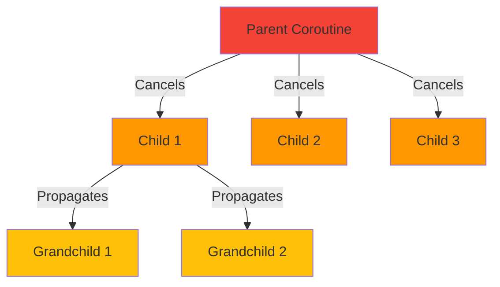
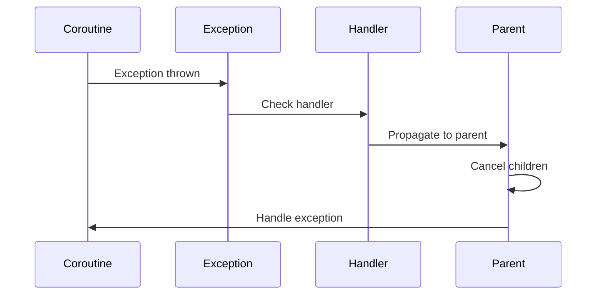

# Advanced Coroutines & Cancellation

## Overview

Understanding cancellation, exception handling, and advanced coroutine patterns is essential for building robust Android applications. This guide covers cancellation propagation, structured concurrency, exception handling strategies, flow operators, and performance optimization techniques for coroutines.

## Deep Explanation

### Cancellation Basics

Coroutines can be cancelled, but cancellation is cooperative - a coroutine must check for cancellation and respond to it.

```kotlin
// Cancellation check
suspend fun longRunningTask() {
    repeat(1000) { i ->
        yield() // Checks for cancellation
        println("Working $i")
    }
}

// Cancelling
val job = launch {
    longRunningTask()
}
delay(100)
job.cancel() // Requests cancellation
job.join() // Waits for cancellation to complete
```

### Cancellation Exceptions

When a coroutine is cancelled, it throws `CancellationException`:

```kotlin
try {
    longRunningTask()
} catch (e: CancellationException) {
    // Handle cancellation
    throw e // Must rethrow
} catch (e: Exception) {
    // Handle other exceptions
}
```

### Non-Cancellable Operations

Some operations shouldn't be cancelled:

```kotlin
suspend fun saveData() {
    try {
        // Save to database
    } finally {
        // Always execute, even if cancelled
        withContext(NonCancellable) {
            cleanup()
        }
    }
}
```

## Diagrams

### Cancellation Propagation



### Exception Handling Flow



## Real Code Examples

### Structured Concurrency

```kotlin
suspend fun fetchUserData(userId: Int): UserData = coroutineScope {
    val userDeferred = async { fetchUser(userId) }
    val postsDeferred = async { fetchPosts(userId) }
    val friendsDeferred = async { fetchFriends(userId) }
    
    // If any fails, all are cancelled
    UserData(
        user = userDeferred.await(),
        posts = postsDeferred.await(),
        friends = friendsDeferred.await()
    )
}

// SupervisorScope - doesn't cancel siblings on failure
suspend fun fetchIndependentData() = supervisorScope {
    val task1 = async { fetchData1() } // Failure doesn't cancel task2
    val task2 = async { fetchData2() } // Failure doesn't cancel task1
    
    try {
        Result(task1.await(), task2.await())
    } catch (e: Exception) {
        // Handle partial results
    }
}
```

### Exception Handling

```kotlin
class DataRepository {
    private val exceptionHandler = CoroutineExceptionHandler { _, exception ->
        when (exception) {
            is NetworkException -> handleNetworkError(exception)
            is DatabaseException -> handleDatabaseError(exception)
            else -> handleUnknownError(exception)
        }
    }
    
    fun loadData() {
        viewModelScope.launch(exceptionHandler) {
            val data = fetchData()
            updateUI(data)
        }
    }
}

// Try-catch in coroutine
suspend fun safeOperation() {
    try {
        riskyOperation()
    } catch (e: CancellationException) {
        throw e // Must rethrow
    } catch (e: Exception) {
        // Handle other exceptions
        logError(e)
    }
}
```

### Flow Operators

```kotlin
fun searchFlow(query: String): Flow<List<Result>> = flow {
    emit(emptyList())
    delay(300) // Debounce
    emit(repository.search(query))
}
    .flowOn(Dispatchers.IO)
    .catch { e -> emit(emptyList()) } // Handle errors
    .distinctUntilChanged() // Only emit when changed
    .shareIn(
        scope = viewModelScope,
        started = SharingStarted.WhileSubscribed(5000),
        replay = 1
    )

// Collecting with lifecycle
@Composable
fun SearchScreen() {
    val query by remember { mutableStateOf("") }
    val results by searchFlow(query)
        .collectAsStateWithLifecycle(initialValue = emptyList())
    
    // UI
}
```

### Timeout and Retry

```kotlin
// Timeout
suspend fun fetchWithTimeout(): Data {
    return withTimeout(5000) {
        fetchData()
    }
}

// Timeout with fallback
suspend fun fetchWithTimeoutOrNull(): Data? {
    return withTimeoutOrNull(5000) {
        fetchData()
    } ?: getCachedData()
}

// Retry with exponential backoff
suspend fun fetchWithRetry(): Data {
    return retry(
        times = 3,
        initialDelay = 1.seconds,
        maxDelay = 10.seconds,
        factor = 2.0
    ) {
        fetchData()
    }
}

suspend fun <T> retry(
    times: Int,
    initialDelay: Duration,
    maxDelay: Duration,
    factor: Double,
    block: suspend () -> T
): T {
    var currentDelay = initialDelay
    repeat(times - 1) {
        try {
            return block()
        } catch (e: Exception) {
            delay(currentDelay)
            currentDelay = (currentDelay * factor).coerceAtMost(maxDelay)
        }
    }
    return block() // Last attempt
}
```

## Hard Use-Case: Background Task with Progress and Cancellation

### Problem

You need to:
1. Perform a long-running background task
2. Show progress updates
3. Allow cancellation
4. Handle errors gracefully
5. Save partial results
6. Resume from interruption

### Solution

```kotlin
class DataProcessingViewModel : ViewModel() {
    private val _progress = MutableStateFlow(0f)
    val progress: StateFlow<Float> = _progress.asStateFlow()
    
    private val _status = MutableStateFlow<ProcessingStatus>(ProcessingStatus.Idle)
    val status: StateFlow<ProcessingStatus> = _status.asStateFlow()
    
    private var processingJob: Job? = null
    
    fun startProcessing(items: List<DataItem>) {
        processingJob?.cancel() // Cancel previous if running
        
        processingJob = viewModelScope.launch {
            try {
                _status.value = ProcessingStatus.Processing
                processItemsWithProgress(items)
                _status.value = ProcessingStatus.Completed
            } catch (e: CancellationException) {
                _status.value = ProcessingStatus.Cancelled
                savePartialResults()
                throw e
            } catch (e: Exception) {
                _status.value = ProcessingStatus.Error(e.message ?: "Unknown error")
            }
        }
    }
    
    fun cancelProcessing() {
        processingJob?.cancel()
    }
    
    private suspend fun processItemsWithProgress(items: List<DataItem>) {
        val total = items.size
        var processed = 0
        
        items.forEachIndexed { index, item ->
            ensureActive() // Check for cancellation
            
            processItem(item)
            processed++
            
            _progress.value = processed.toFloat() / total
            
            // Save checkpoint every 10 items
            if (index % 10 == 0) {
                saveCheckpoint(index)
            }
        }
    }
    
    private suspend fun processItem(item: DataItem) {
        withContext(Dispatchers.IO) {
            // Simulate processing
            delay(100)
            repository.save(item)
        }
    }
    
    private suspend fun saveCheckpoint(index: Int) {
        withContext(Dispatchers.IO) {
            repository.saveCheckpoint(index)
        }
    }
    
    private suspend fun savePartialResults() {
        withContext(NonCancellable) {
            repository.savePartialResults()
        }
    }
}

sealed class ProcessingStatus {
    object Idle : ProcessingStatus()
    object Processing : ProcessingStatus()
    object Completed : ProcessingStatus()
    data class Error(val message: String) : ProcessingStatus()
    object Cancelled : ProcessingStatus()
}

// UI
@Composable
fun ProcessingScreen(viewModel: DataProcessingViewModel = viewModel()) {
    val progress by viewModel.progress.collectAsState()
    val status by viewModel.status.collectAsState()
    
    Column {
        when (status) {
            is ProcessingStatus.Processing -> {
                LinearProgressIndicator(progress = progress)
                Text("Processing: ${(progress * 100).toInt()}%")
                Button(onClick = { viewModel.cancelProcessing() }) {
                    Text("Cancel")
                }
            }
            is ProcessingStatus.Completed -> {
                Text("Processing completed!")
            }
            is ProcessingStatus.Error -> {
                Text("Error: ${status.message}")
                Button(onClick = { /* Retry */ }) {
                    Text("Retry")
                }
            }
            is ProcessingStatus.Cancelled -> {
                Text("Processing cancelled")
            }
            else -> {}
        }
    }
}
```

### Alternative: Using Flow for Progress

```kotlin
fun processItemsFlow(items: List<DataItem>): Flow<ProcessingState> = flow {
    val total = items.size
    var processed = 0
    
    emit(ProcessingState.Processing(0f))
    
    items.forEach { item ->
        ensureActive()
        processItem(item)
        processed++
        
        val progress = processed.toFloat() / total
        emit(ProcessingState.Processing(progress))
        
        if (processed % 10 == 0) {
            saveCheckpoint(processed)
        }
    }
    
    emit(ProcessingState.Completed)
}.catch { e ->
    if (e is CancellationException) {
        savePartialResults()
        emit(ProcessingState.Cancelled)
    } else {
        emit(ProcessingState.Error(e.message ?: "Unknown error"))
    }
}.flowOn(Dispatchers.IO)

sealed class ProcessingState {
    data class Processing(val progress: Float) : ProcessingState()
    object Completed : ProcessingState()
    data class Error(val message: String) : ProcessingState()
    object Cancelled : ProcessingState()
}
```

## Edge Cases and Pitfalls

### 1. Cancellation Not Propagating

**Problem**: Child coroutines not cancelled

```kotlin
// BAD: Child in GlobalScope not cancelled
viewModelScope.launch {
    GlobalScope.launch {
        longTask() // Not cancelled when parent cancelled
    }
}

// GOOD: Use coroutineScope
viewModelScope.launch {
    coroutineScope {
        launch { longTask() } // Cancelled when parent cancelled
    }
}
```

### 2. Exception Swallowing

**Problem**: Exceptions not handled properly

```kotlin
// BAD: Swallows exception
launch {
    try {
        riskyOperation()
    } catch (e: Exception) {
        // Swallowed
    }
}

// GOOD: Handle or propagate
launch {
    try {
        riskyOperation()
    } catch (e: CancellationException) {
        throw e
    } catch (e: Exception) {
        handleError(e)
    }
}
```

### 3. Blocking Operations

**Problem**: Blocking operations prevent cancellation

```kotlin
// BAD: Blocks, can't be cancelled
suspend fun blockingOperation() {
    Thread.sleep(1000) // Blocks thread
}

// GOOD: Use delay or ensureActive
suspend fun cancellableOperation() {
    delay(1000) // Suspends, can be cancelled
    // OR
    ensureActive() // Check cancellation
    // Do work
}
```

### 4. Resource Leaks

**Problem**: Resources not cleaned up on cancellation

```kotlin
// BAD: Resource leak
suspend fun useResource() {
    val resource = acquireResource()
    use(resource)
    // If cancelled, resource not released
}

// GOOD: Use try-finally
suspend fun useResource() {
    val resource = acquireResource()
    try {
        use(resource)
    } finally {
        releaseResource(resource) // Always released
    }
}
```

## References and Further Reading

- [Cancellation and Timeouts](https://kotlinlang.org/docs/cancellation-and-timeouts.html)
- [Exception Handling](https://kotlinlang.org/docs/exception-handling.html)
- [Flow](https://kotlinlang.org/docs/flow.html)
- [Coroutines Best Practices](https://developer.android.com/kotlin/coroutines/coroutines-best-practices)

## Quiz

### Question 1
What happens when a parent coroutine is cancelled?

**A)** Nothing  
**B)** Only the parent is cancelled  
**C)** All children are cancelled  
**D)** Depends on the implementation

**Answer: C** - In structured concurrency, cancelling a parent automatically cancels all its children.

### Question 2
What must you do when catching `CancellationException`?

**A)** Handle it silently  
**B)** Log it  
**C)** Rethrow it  
**D)** Ignore it

**Answer: C** - `CancellationException` must be rethrown to maintain proper cancellation semantics.

### Question 3
What is the difference between `coroutineScope` and `supervisorScope`?

**A)** They're the same  
**B)** `supervisorScope` doesn't cancel siblings on failure  
**C)** `coroutineScope` is faster  
**D)** `supervisorScope` requires a supervisor

**Answer: B** - In `supervisorScope`, if one child fails, other children continue. In `coroutineScope`, failure of one child cancels all siblings.

### Question 4
What should you use for operations that must complete even if cancelled?

**A)** `NonCancellable`  
**B)** `GlobalScope`  
**C)** `runBlocking`  
**D)** Nothing, all operations are cancellable

**Answer: A** - `withContext(NonCancellable)` ensures code runs even if the coroutine is cancelled, useful for cleanup operations.

### Question 5
What is the purpose of `ensureActive()`?

**A)** To ensure coroutine is active  
**B)** To check for cancellation and throw if cancelled  
**C)** To activate a coroutine  
**D)** To wait for completion

**Answer: B** - `ensureActive()` checks if the coroutine is still active and throws `CancellationException` if it's been cancelled.

## Related Topics

- [Kotlin Coroutines Basics](../01_beginners/03.%20Kotlin%20Coroutines%20Basics.md) - Foundation
- [Performance Profiling & Memory Leaks](./03.%20Performance%20Profiling%20%26%20Memory%20Leaks.md) - Performance with coroutines
- [Building Offline-First Apps](./04.%20Building%20Offline-First%20Apps.md) - Coroutines in offline scenarios

