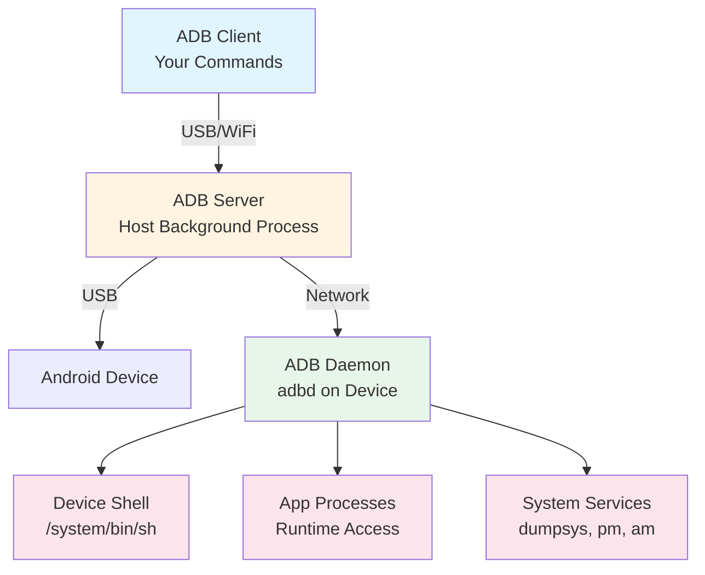

# Complete ADB Masterclass

## Overview

Android Debug Bridge (ADB) is a versatile command-line tool that enables communication between your development machine and Android devices. This comprehensive masterclass covers ADB fundamentals, device management, file operations, app installation and debugging, log analysis, performance monitoring, automation, advanced techniques, and troubleshooting strategies for professional Android development.

## Table of Contents

1. [ADB Fundamentals](#adb-fundamentals)
2. [Device Management](#device-management)
3. [File Operations](#file-operations)
4. [App Installation & Management](#app-installation-management)
5. [Logging & Debugging](#logging-debugging)
6. [Performance Monitoring](#performance-monitoring)
7. [Automation & Scripting](#automation-scripting)
8. [Advanced Techniques](#advanced-techniques)
9. [Network & Port Forwarding](#network-port-forwarding)
10. [Troubleshooting](#troubleshooting)

## ADB Fundamentals

### What is ADB?

Android Debug Bridge (ADB) is a versatile command-line tool that acts as a communication bridge between your development machine (host) and Android devices or emulators. It's part of the Android SDK Platform Tools package and serves as the foundation for many Android development workflows.

**Why ADB Matters:**
- **Universal Interface**: Works with physical devices, emulators, and even some Android TV devices
- **Powerful Automation**: Enables scripting and CI/CD integration
- **Deep System Access**: Provides low-level access to Android system internals
- **Debugging Foundation**: Essential for log analysis, performance profiling, and troubleshooting

**What ADB Enables:**
- **Device Communication**: Establish and manage connections to Android devices
- **App Installation & Management**: Install, uninstall, and manage applications
- **File Transfer**: Push and pull files between host and device
- **Shell Access**: Execute commands directly on the device
- **Performance Monitoring**: Monitor CPU, memory, network, and battery usage
- **Automation**: Script complex workflows for testing and deployment
- **Debugging**: Access logs, heap dumps, and system state information

### Understanding ADB Architecture

ADB uses a client-server architecture with three main components:

1. **ADB Client**: The command-line tool you run on your development machine
2. **ADB Server (Daemon)**: A background process on your host machine that manages connections
3. **ADB Daemon (adbd)**: A daemon running on the Android device that receives and executes commands

**How It Works:**
- When you run an `adb` command, the ADB client communicates with the ADB server
- The ADB server maintains connections to all connected devices
- Commands are forwarded to the appropriate device's ADB daemon
- The daemon executes commands and returns results through the same path



**Connection Types:**
- **USB**: Direct physical connection (most common, fastest, most reliable)
- **WiFi**: Network-based connection (convenient but requires initial USB setup)
- **TCP/IP**: For emulators and network-connected devices

### Installation & Setup

**Checking Installation:**
```bash
# Check if ADB is installed and see version
adb version
# Expected output:
# Android Debug Bridge version 1.0.41
# Version 33.0.3-8952118
```

**Installation Methods:**

**macOS (using Homebrew):**
```bash
# Install Android platform tools (includes ADB)
brew install android-platform-tools

# Verify installation
adb version
```

**Linux (Ubuntu/Debian):**
```bash
# Install ADB package
sudo apt-get update
sudo apt-get install android-tools-adb android-tools-fastboot

# Verify installation
adb version
```

**Windows:**
1. Download Android SDK Platform Tools from [developer.android.com](https://developer.android.com/studio/releases/platform-tools)
2. Extract to a folder (e.g., `C:\platform-tools`)
3. Add to PATH environment variable

**Adding to PATH (if needed):**
```bash
# macOS/Linux - Add to ~/.bashrc or ~/.zshrc
export PATH=$PATH:$HOME/Library/Android/sdk/platform-tools

# Or for Android Studio installation:
export PATH=$PATH:$HOME/Library/Android/sdk/platform-tools

# Verify PATH is set correctly
which adb
# Should output: /path/to/platform-tools/adb
```

**First-Time Setup:**
1. Enable Developer Options on your Android device (Settings → About Phone → tap Build Number 7 times)
2. Enable USB Debugging (Settings → Developer Options → USB Debugging)
3. Connect device via USB
4. Accept the "Allow USB Debugging" prompt on your device
5. Verify connection: `adb devices` should show your device

### Basic Commands Explained

**Checking ADB Version:**
```bash
adb version
```
This command shows the ADB client version. It's useful for:
- Verifying installation
- Checking compatibility with Android SDK requirements
- Troubleshooting version-related issues

**Listing Connected Devices:**
```bash
adb devices
```
**What it does:** Lists all Android devices and emulators currently connected to your development machine.

**Example Output:**
```
List of devices attached
emulator-5554    device
ABC123XYZ        device
DEF456UVW        unauthorized
```

**Device States Explained:**
- `device`: Device is connected and authorized for debugging
- `offline`: Device is connected but not responding
- `unauthorized`: Device is connected but USB debugging authorization hasn't been granted
- `no permissions`: Insufficient permissions to access the device (Linux)

**Getting Device Serial Number:**
```bash
adb get-serialno
```
**What it does:** Returns the unique serial number of the connected device. Useful for:
- Identifying specific devices when multiple are connected
- Device management in automation scripts
- Logging and tracking which device was used

**Getting Device State:**
```bash
adb get-state
```
**What it does:** Returns the current state of the device connection.

**Possible States:**
- `device`: Normal operational state, ready for commands
- `recovery`: Device is in recovery mode
- `sideload`: Device is in sideload mode (for OTA updates)
- `bootloader`: Device is in bootloader/fastboot mode
- `offline`: Device is not responding

**Managing ADB Server:**
```bash
# Stop the ADB server
adb kill-server

# Start the ADB server
adb start-server
```

**Why restart the server?**
- **Connection Issues**: When devices aren't detected properly
- **Stale Connections**: After unplugging/replugging devices
- **Permission Problems**: When authorization seems stuck
- **Version Updates**: After updating ADB or platform tools

**Waiting for Device:**
```bash
adb wait-for-device
```
**What it does:** Blocks execution until a device is connected and in the `device` state.

**Why use it?**
- **Scripts**: Ensures device is ready before running commands
- **CI/CD**: Prevents race conditions in automated pipelines
- **Reliability**: Avoids errors from commands running before device is ready

**Example in Script:**
```bash
#!/bin/bash
adb wait-for-device  # Wait for device to be ready
adb install app.apk  # Now safe to install
```

## Device Management

### Device Connection

Understanding how to establish and manage device connections is fundamental to using ADB effectively.

**Listing Devices with Details:**
```bash
# List all devices with additional information
adb devices -l
```

**What `-l` does:** The `-l` flag (long format) shows additional device information including:
- Device model name
- Product name
- Transport ID
- Device state details

**Example Output:**
```
List of devices attached
emulator-5554          device product:sdk_google_phone_x86 model:Android_SDK_built_for_x86 device:generic_x86 transport_id:1
ABC123XYZ              device product:walleye model:Pixel_2 device:walleye transport_id:2
```

**Why this matters:** When you have multiple devices connected, the `-l` output helps you identify which device is which, especially useful when you need to specify a device with `adb -s <serial>`.

**USB Connection (Default):**
```bash
# Check USB-connected devices
adb devices
```
USB is the default and most reliable connection method. It provides:
- Fastest data transfer speeds
- Most stable connection
- No network configuration needed
- Works immediately after enabling USB debugging

**WiFi Connection Setup:**

WiFi debugging is useful when:
- You need to test without a USB cable
- You want to debug multiple devices simultaneously
- You're working with devices that don't have USB ports (some Android TV devices)

**Step-by-Step WiFi Setup:**
```bash
# Step 1: Connect device via USB first (required for initial setup)
adb devices  # Verify USB connection

# Step 2: Switch device to TCP/IP mode on port 5555
adb tcpip 5555
# Output: restarting in TCP mode port: 5555

# Step 3: Find your device's IP address
adb shell ip addr show wlan0 | grep inet
# Or use: adb shell ifconfig wlan0
# Or check in device Settings → About Phone → Status → IP Address

# Step 4: Connect wirelessly (replace with your device's IP)
adb connect 192.168.1.100:5555
# Output: connected to 192.168.1.100:5555

# Step 5: Verify connection
adb devices
# Should show both USB and WiFi connections

# Step 6: You can now disconnect USB cable
```

**Important Notes:**
- Both devices must be on the same WiFi network
- Some corporate networks block ADB connections
- WiFi debugging is slower than USB but more convenient
- The device must remain on the same network

**Disconnecting WiFi:**
```bash
# Disconnect specific device
adb disconnect 192.168.1.100:5555

# Disconnect all WiFi devices
adb disconnect
```

**Reverting to USB Mode:**
```bash
# Switch back to USB mode
adb usb
# Output: restarting in USB mode
```

**Checking Connection State:**
```bash
# Get current device state
adb get-state
```

**Understanding Device States:**
- `device`: Normal state, ready for all ADB commands
- `recovery`: Device is in recovery mode (for system updates, factory reset)
- `sideload`: Device is in sideload mode (for installing OTA updates)
- `bootloader`: Device is in bootloader/fastboot mode (for flashing firmware)
- `offline`: Device is not responding (connection issue)

**When to check state:**
- Before running critical commands
- When troubleshooting connection issues
- In automation scripts to verify device readiness

### Device Information

Gathering device information is essential for:
- Debugging device-specific issues
- Writing conditional scripts
- Understanding device capabilities
- Logging and reporting

**System Properties Explained:**

Android uses system properties to store device configuration and build information. These are accessed via `getprop`.

**Getting Device Model:**
```bash
adb shell getprop ro.product.model
# Example output: Pixel 5
```
**Use cases:**
- Conditional logic in scripts ("if Pixel device, do X")
- Bug reports ("Issue occurs on Pixel 5")
- Feature detection

**Getting Android Version:**
```bash
adb shell getprop ro.build.version.release
# Example output: 13
```
**Why it matters:** Different Android versions have different behaviors, APIs, and security models.

**Getting API Level:**
```bash
adb shell getprop ro.build.version.sdk
# Example output: 33
```
**API Level vs Version:**
- API Level 33 = Android 13
- API Level 32 = Android 12L
- API Level 31 = Android 12
- This is what you use in code: `Build.VERSION.SDK_INT >= 33`

**Getting Device Manufacturer:**
```bash
adb shell getprop ro.product.manufacturer
# Example output: google
```
**Use cases:**
- Identifying OEM-specific issues
- Conditional feature enabling
- Device compatibility checks

**Getting All Properties:**
```bash
# List all system properties (output is very long)
adb shell getprop
```
**What you'll see:**
- Build properties (`ro.build.*`)
- Product properties (`ro.product.*`)
- System properties (`ro.*` = read-only, `sys.*` = writable)
- Runtime properties

**Common Useful Properties:**
```bash
# Build fingerprint (unique device identifier)
adb shell getprop ro.build.fingerprint

# Build date
adb shell getprop ro.build.date

# Security patch level
adb shell getprop ro.build.version.security_patch

# Hardware platform
adb shell getprop ro.hardware

# Screen density
adb shell getprop ro.sf.lcd_density

# Screen dimensions
adb shell wm size
adb shell wm density
```

**Getting Device Serial Number:**
```bash
adb get-serialno
# Example output: ABC123XYZ
```
**When to use:**
- Specifying device in commands: `adb -s ABC123XYZ install app.apk`
- Device identification in logs
- Multi-device management

**Getting Device ID with Details:**
```bash
adb devices -l
```
Shows transport ID and device details, useful for identifying devices in complex setups.

### Device Control

Device control commands let you interact with the device as if you were using it physically.

**Rebooting the Device:**

```bash
# Normal reboot (same as holding power button)
adb reboot
```
**What happens:**
- Device shuts down gracefully
- All apps are closed
- System services stop
- Device restarts fresh
- Takes 30-60 seconds typically

**Reboot to Bootloader:**
```bash
adb reboot bootloader
```
**Bootloader mode:**
- Used for flashing firmware, unlocking bootloader, installing custom recoveries
- Device shows bootloader menu
- ADB commands won't work (use `fastboot` instead)
- To exit: `fastboot reboot` or use device buttons

**Reboot to Recovery:**
```bash
adb reboot recovery
```
**Recovery mode:**
- Used for factory reset, applying OTA updates, clearing cache
- Shows recovery menu (varies by device)
- Limited ADB access
- To exit: Select "Reboot system now" or use `adb reboot`

**Reboot to Fastboot:**
```bash
adb reboot fastboot
```
**Fastboot mode:**
- Similar to bootloader mode
- Used for low-level device operations
- Requires `fastboot` tool (not ADB)

**Powering Off:**
```bash
adb shell reboot -p
```
**What `-p` does:** The `-p` flag means "power off" - device shuts down completely (doesn't restart).

**Taking Screenshots:**
```bash
# Capture screenshot on device
adb shell screencap /sdcard/screenshot.png

# Pull screenshot to your computer
adb pull /sdcard/screenshot.png

# Or in one command (using shell redirection)
adb shell screencap -p > screenshot.png
```

**Screenshot Details:**
- Format: PNG (default)
- Location: Can save anywhere on device with write permissions
- Quality: Full device resolution
- Speed: Very fast (usually < 1 second)

**Use cases:**
- Visual verification in automated tests
- Bug report documentation
- UI state capture for debugging
- Creating documentation

**Recording Screen:**
```bash
# Start recording (records until you stop it)
adb shell screenrecord /sdcard/record.mp4
# Press Ctrl+C to stop recording

# Pull recording to computer
adb pull /sdcard/record.mp4
```

**Screen Recording Options:**
```bash
# Record with specific bitrate (default 4Mbps)
adb shell screenrecord --bit-rate 8000000 /sdcard/record.mp4

# Record for specific time (10 seconds)
adb shell screenrecord --time-limit 10 /sdcard/record.mp4

# Record with specific size (720p)
adb shell screenrecord --size 1280x720 /sdcard/record.mp4
```

**Limitations:**
- Maximum 3 minutes by default (use `--time-limit` to change)
- Audio not recorded (Android limitation)
- Some secure screens may be blacked out
- Requires Android 4.4+ (API 19+)

**Sending Key Events:**

Key events simulate hardware button presses and system keys.

```bash
# Home button
adb shell input keyevent KEYCODE_HOME
# Or using numeric code:
adb shell input keyevent 3

# Back button
adb shell input keyevent KEYCODE_BACK
# Or: adb shell input keyevent 4

# Menu button (if available)
adb shell input keyevent KEYCODE_MENU
# Or: adb shell input keyevent 82
```

**Common Key Codes:**
- `KEYCODE_HOME` (3): Home button
- `KEYCODE_BACK` (4): Back button
- `KEYCODE_MENU` (82): Menu button
- `KEYCODE_POWER` (26): Power button
- `KEYCODE_VOLUME_UP` (24): Volume up
- `KEYCODE_VOLUME_DOWN` (25): Volume down
- `KEYCODE_ENTER` (66): Enter key
- `KEYCODE_DEL` (67): Delete/Backspace

**Full list:** `adb shell input keyevent --help` or check [Android KeyEvent documentation](https://developer.android.com/reference/android/view/KeyEvent)

**Sending Text Input:**
```bash
# Type text (simulates keyboard input)
adb shell input text "Hello World"
```

**Important Notes:**
- Spaces work: `adb shell input text "Hello World"`
- Special characters may need escaping
- Some characters (like `@`) may not work - use key events instead
- Text is sent to the currently focused input field

**For special characters:**
```bash
# Use key events for special characters
# @ symbol: adb shell input keyevent KEYCODE_AT
# Or combine: adb shell input text "user" && adb shell input keyevent 77 && adb shell input text "example.com"
```

**Tapping the Screen:**
```bash
# Tap at coordinates (x, y)
adb shell input tap 500 1000
```

**Understanding Coordinates:**
- Origin (0,0) is top-left corner
- X increases going right
- Y increases going down
- Coordinates are in pixels
- Resolution varies by device

**Finding Coordinates:**
```bash
# Enable pointer location in Developer Options
# Or use: adb shell getevent to see touch events
```

**Swiping:**
```bash
# Swipe from (x1, y1) to (x2, y2)
adb shell input swipe 300 1000 300 500
```

**Swipe Parameters:**
- Format: `swipe <x1> <y1> <x2> <y2> [duration_ms]`
- Default duration: 300ms
- Longer duration = slower swipe

**Common Swipe Patterns:**
```bash
# Scroll down (swipe up on screen)
adb shell input swipe 500 1500 500 500

# Scroll up (swipe down on screen)
adb shell input swipe 500 500 500 1500

# Swipe left
adb shell input swipe 800 1000 200 1000

# Swipe right
adb shell input swipe 200 1000 800 1000

# Long press (swipe with very long duration)
adb shell input swipe 500 1000 500 1000 2000
```

**Simulating Back Button:**
```bash
# Method 1: Using keyevent name
adb shell input keyevent KEYCODE_BACK

# Method 2: Using numeric code (more reliable in scripts)
adb shell input keyevent 4
```

**Why numeric codes?**
- More reliable across different Android versions
- Shorter to type
- Works even if key names change

## File Operations

File operations are fundamental to Android development - you'll frequently need to transfer files, inspect app data, and manage device storage.

### File Transfer

**Understanding Android File System:**

Android uses a Linux-based file system with specific directories:
- `/sdcard/` or `/storage/emulated/0/`: User-accessible storage (external storage)
- `/data/data/<package>/`: App private data (requires root or app's UID)
- `/system/`: System partition (read-only, requires root to modify)
- `/cache/`: Cache directory
- `/data/local/tmp/`: Temporary files (accessible without root)

**Pushing Files to Device:**

```bash
# Push a single file
adb push local_file.txt /sdcard/remote_file.txt
```

**What happens:**
1. ADB reads the file from your computer
2. Transfers it over USB/WiFi connection
3. Writes it to the specified location on device
4. Preserves file permissions (when possible)

**Example:**
```bash
# Push an APK for installation
adb push app.apk /sdcard/download/app.apk

# Push a configuration file
adb push config.json /sdcard/myapp/config.json

# Push with absolute path (recommended)
adb push ./local_file.txt /sdcard/remote_file.txt
```

**Important Notes:**
- Destination directory must exist (create with `adb shell mkdir -p` if needed)
- File paths with spaces need quotes: `adb push "my file.txt" /sdcard/`
- Large files may take time (progress isn't shown by default)
- Permissions: You can write to `/sdcard/` without root, but not to `/data/data/` (app-specific)

**Pulling Files from Device:**

```bash
# Pull a single file
adb pull /sdcard/remote_file.txt local_file.txt
```

**What happens:**
1. ADB reads file from device
2. Transfers to your computer
3. Saves to specified location
4. Creates directory structure if needed

**Example:**
```bash
# Pull a screenshot
adb pull /sdcard/screenshot.png ./screenshots/

# Pull app database (requires root or app's UID)
adb pull /data/data/com.example.app/databases/app.db ./

# Pull log file
adb pull /sdcard/logcat.txt ./
```

**If destination not specified:**
```bash
# Pulls to current directory with original filename
adb pull /sdcard/file.txt
# Creates: ./file.txt
```

**Transferring Directories:**

```bash
# Push entire directory (recursive)
adb push local_directory/ /sdcard/remote_directory/

# Pull entire directory (recursive)
adb pull /sdcard/remote_directory/ local_directory/
```

**Directory Transfer Details:**
- Trailing slashes matter: `directory/` vs `directory`
- All subdirectories and files are transferred
- Directory structure is preserved
- Empty directories are created

**Example:**
```bash
# Push project assets
adb push ./assets/ /sdcard/myapp/assets/
# Transfers: assets/images/, assets/sounds/, etc.

# Pull app's files directory
adb pull /sdcard/myapp/ ./backup/
```

**Syncing Files (Efficient Transfer):**

```bash
# Sync only changed files (faster for large directories)
adb sync
```

**What `adb sync` does:**
- Compares file timestamps and sizes
- Only transfers files that have changed
- Much faster than `push` for large directory trees
- Works in both directions (push and pull)

**When to use:**
- Syncing large project directories
- Updating assets during development
- Backing up frequently changing files

**Note:** `adb sync` uses a specific directory structure. For general use, `push`/`pull` is more flexible.

**Listing Files on Device:**

```bash
# List files in directory
adb shell ls /sdcard/
```

**Example Output:**
```
Alarms
Android
DCIM
Download
Movies
Music
Pictures
```

**Listing with Details:**
```bash
# Long format: permissions, owner, size, date
adb shell ls -la /sdcard/
```

**Example Output:**
```
drwxrwx--x  6 u0_a123 u0_a123     4096 2023-01-15 10:30 Android
-rw-rw----  1 u0_a123 u0_a123  1048576 2023-01-15 11:00 file.txt
```

**Understanding Permissions:**
- `d` = directory, `-` = file
- `rwx` = read, write, execute (owner, group, others)
- `u0_a123` = Android user ID (UID)

**Checking File Permissions:**
```bash
# Detailed file listing
adb shell ls -l /data/data/com.example.app/
```

**Why permissions matter:**
- `/sdcard/`: Usually writable by all apps
- `/data/data/<package>/`: Only accessible by that app (or root)
- `/system/`: Read-only for apps, writable only with root

### File Management

File management commands let you manipulate files and directories directly on the device.

**Creating Directories:**

```bash
# Create single directory
adb shell mkdir /sdcard/new_directory

# Create nested directories (parent directories created if needed)
adb shell mkdir -p /sdcard/path/to/nested/directory
```

**When to use `-p`:**
- Creating directory trees
- Ensuring parent directories exist
- Avoiding errors if directory already exists

**Removing Files and Directories:**

```bash
# Remove a file
adb shell rm /sdcard/file.txt

# Remove directory (must be empty)
adb shell rmdir /sdcard/empty_directory/

# Remove directory and all contents (recursive)
adb shell rm -r /sdcard/directory/

# Force remove (no prompts, useful in scripts)
adb shell rm -rf /sdcard/directory/
```

**Safety Tips:**
- Double-check paths before using `rm -rf`
- Test commands on non-critical files first
- Use `ls` to verify before removing
- Be especially careful with `/data/` and `/system/` directories

**Copying Files:**

```bash
# Copy file
adb shell cp /sdcard/file1.txt /sdcard/file2.txt

# Copy directory recursively
adb shell cp -r /sdcard/dir1/ /sdcard/dir2/
```

**Use cases:**
- Creating backups before modifications
- Duplicating configuration files
- Copying app data for testing

**Moving/Renaming Files:**

```bash
# Move file (also used for renaming)
adb shell mv /sdcard/file1.txt /sdcard/file2.txt

# Move directory
adb shell mv /sdcard/old_dir/ /sdcard/new_dir/
```

**Moving vs Copying:**
- `mv`: Original is removed, faster (no data copy)
- `cp`: Original remains, creates duplicate

**Changing File Permissions:**

```bash
# Change permissions using octal notation
adb shell chmod 755 /sdcard/file.txt
```

**Understanding Permission Numbers:**
- `755` = `rwxr-xr-x` (owner: read/write/execute, others: read/execute)
- `644` = `rw-r--r--` (owner: read/write, others: read only)
- `777` = `rwxrwxrwx` (all permissions for all)

**Common Permission Values:**
- `755`: Executable files, directories
- `644`: Regular files
- `600`: Private files (owner only)
- `777`: Temporary files (not recommended for security)

**Changing File Owner:**

```bash
# Change owner (requires root)
adb shell chown system:system /sdcard/file.txt

# Change owner recursively
adb shell chown -R u0_a123:u0_a123 /sdcard/directory/
```

**When you need this:**
- Fixing permission issues
- Making system files accessible
- Restoring proper ownership after operations

**Finding Files:**

```bash
# Find files by name pattern
adb shell find /sdcard -name "*.txt"

# Find files by type
adb shell find /sdcard -type f  # files only
adb shell find /sdcard -type d  # directories only

# Find files by size (larger than 10MB)
adb shell find /sdcard -size +10M

# Find and execute command on results
adb shell find /sdcard -name "*.log" -exec rm {} \;
```

**Searching File Content:**

```bash
# Search for text in file
adb shell grep "search_term" /sdcard/file.txt

# Case-insensitive search
adb shell grep -i "search_term" /sdcard/file.txt

# Search in multiple files
adb shell grep -r "search_term" /sdcard/directory/

# Show line numbers
adb shell grep -n "search_term" /sdcard/file.txt

# Show context (lines before/after match)
adb shell grep -C 3 "search_term" /sdcard/file.txt
```

**Advanced File Operations:**

```bash
# View file content
adb shell cat /sdcard/file.txt

# View first/last lines
adb shell head -n 20 /sdcard/file.txt
adb shell tail -n 20 /sdcard/file.txt

# Follow file (like tail -f)
adb shell tail -f /sdcard/log.txt

# Count lines, words, characters
adb shell wc -l /sdcard/file.txt

# Compare files
adb shell diff file1.txt file2.txt

# Get file size
adb shell du -h /sdcard/file.txt
adb shell du -sh /sdcard/directory/  # Summary for directory
```

**File Transfer Best Practices:**

1. **Use absolute paths:** Avoids confusion about current directory
2. **Verify transfers:** Check file size after transfer
3. **Handle large files:** Use `sync` or check available space first
4. **Preserve permissions:** Use `chmod` if needed after transfer
5. **Clean up:** Remove temporary files after operations
6. **Check space:** `adb shell df -h` to see available storage

## App Installation & Management

### App Installation

**Basic Installation:**

```bash
# Install APK file
adb install app.apk
```

**What happens during installation:**
1. APK is transferred to device (usually to `/data/local/tmp/`)
2. Package manager verifies APK signature
3. Checks for conflicts with existing apps
4. Extracts APK contents
5. Installs app to `/data/app/<package>/`
6. Creates app data directory in `/data/data/<package>/`
7. Registers app with system

**Success Output:**
```
Performing Streamed Install
Success
```

**Common Installation Options:**

```bash
# Replace existing app (upgrade)
adb install -r app.apk
```
**When to use `-r`:**
- Updating an existing app
- Reinstalling after uninstall
- Faster than uninstall + install separately
- Preserves app data (unless you also use `-d`)

**Allow Version Downgrade:**
```bash
adb install -d app.apk
```
**What it does:** Allows installing an older version over a newer one.

**When to use:**
- Testing older app versions
- Reverting to previous release
- Debugging version-specific issues

**Warning:** May cause data compatibility issues if app structure changed.

**Grant All Runtime Permissions:**
```bash
adb install -g app.apk
```
**What it does:** Automatically grants all runtime permissions declared in the app's manifest.

**Why it's useful:**
- Testing apps without manual permission dialogs
- Automation scripts
- CI/CD pipelines
- Reduces manual interaction

**Note:** Only works for permissions declared in manifest. Some permissions still require user approval.

**Allow Test APKs:**
```bash
adb install -t app.apk
```
**What it does:** Allows installing APKs signed with test keys.

**When needed:**
- Installing debug builds
- Testing unsigned APKs
- Development builds
- Some third-party APKs

**Install Multiple APKs (Split APKs):**

```bash
# Install split APK (base + feature modules)
adb install-multiple base.apk feature1.apk feature2.apk
```

**What are split APKs?**
- Android App Bundle (AAB) generates split APKs
- Base APK + feature modules + language/architecture splits
- Reduces download size (device only gets needed splits)

**When to use:**
- Installing apps from AAB format
- Testing modular apps
- Installing apps with dynamic features

**Uninstalling Apps:**

```bash
# Uninstall app (removes app and data)
adb uninstall com.example.app
```

**What gets removed:**
- App APK files
- App data in `/data/data/<package>/`
- App cache
- App from launcher

**Keep App Data:**
```bash
# Uninstall but keep data
adb uninstall -k com.example.app
```
**When to use:**
- Testing reinstallation scenarios
- Preserving user data during testing
- Debugging data migration issues

**Note:** Data remains in `/data/data/<package>/` but app is removed.

**Installing from Device:**

```bash
# Install APK that's already on device
adb install -r /sdcard/app.apk
```

**Use cases:**
- Installing APKs downloaded on device
- Installing from device storage
- Faster (no transfer needed)

**Installation Errors and Solutions:**

**Error: "INSTALL_FAILED_INSUFFICIENT_STORAGE"**
```bash
# Check available space
adb shell df -h /data

# Clear app cache
adb shell pm trim-caches 500M
```

**Error: "INSTALL_FAILED_UPDATE_INCOMPATIBLE"**
```bash
# Uninstall existing app first
adb uninstall com.example.app
adb install app.apk
```

**Error: "INSTALL_PARSE_FAILED_NO_CERTIFICATES"**
```bash
# Sign the APK or use -t flag
adb install -t app.apk
```

### App Management

The Package Manager (`pm`) is Android's system service for managing installed applications.

**Listing Installed Packages:**

```bash
# List all installed packages
adb shell pm list packages
```

**Example Output:**
```
package:com.android.chrome
package:com.example.app
package:com.google.android.gms
```

**Filtering Package Lists:**

```bash
# Third-party packages only (user-installed)
adb shell pm list packages -3
```

**What `-3` means:** Lists only packages that aren't system apps (third-party apps).

**System packages:**
```bash
# System packages only
adb shell pm list packages -s
```

**Enabled packages:**
```bash
# Only enabled packages
adb shell pm list packages -e
```

**Disabled packages:**
```bash
# Only disabled packages
adb shell pm list packages -d
```

**Searching for packages:**
```bash
# Find packages matching pattern
adb shell pm list packages | grep example
```

**Getting Package Information:**

```bash
# Detailed package information dump
adb shell pm dump com.example.app
```

**What you get:**
- Package name and version
- Installed location
- Permissions (granted and requested)
- Activities, services, receivers
- App signatures
- User IDs
- Much more...

**Example useful info:**
```bash
# Get just version info
adb shell pm dump com.example.app | grep versionName

# Get package path
adb shell pm path com.example.app
# Output: package:/data/app/com.example.app-1/base.apk
```

**Managing App State:**

```bash
# Clear all app data (like "Clear Data" in Settings)
adb shell pm clear com.example.app
```

**What gets cleared:**
- App's private data directory
- Shared preferences
- Databases
- Cache
- App returns to fresh install state

**Use cases:**
- Testing first-run experience
- Resetting app to clean state
- Debugging data corruption issues

**Enable/Disable Apps:**

```bash
# Disable app (hide from launcher, stop from running)
adb shell pm disable com.example.app

# Enable app
adb shell pm enable com.example.app
```

**What disabling does:**
- App doesn't appear in launcher
- App can't be launched
- Background processes are stopped
- App data is preserved

**When to use:**
- Testing app behavior when disabled
- Temporarily hiding system apps
- Freeing up resources

**Managing Permissions:**

```bash
# Grant runtime permission
adb shell pm grant com.example.app android.permission.CAMERA
```

**Permission format:**
- Full permission name from manifest
- Must match exactly: `android.permission.CAMERA`
- Package-specific permissions: `com.example.app.PERMISSION`

**Common permissions:**
```bash
# Camera
adb shell pm grant com.example.app android.permission.CAMERA

# Storage
adb shell pm grant com.example.app android.permission.READ_EXTERNAL_STORAGE
adb shell pm grant com.example.app android.permission.WRITE_EXTERNAL_STORAGE

# Location
adb shell pm grant com.example.app android.permission.ACCESS_FINE_LOCATION

# Contacts
adb shell pm grant com.example.app android.permission.READ_CONTACTS
```

**Revoking permissions:**
```bash
# Revoke permission
adb shell pm revoke com.example.app android.permission.CAMERA
```

**Reset all permissions:**
```bash
# Reset all runtime permissions to default state
adb shell pm reset-permissions
```

**Warning:** This affects ALL apps, not just one.

### App Launch & Activity Management

The Activity Manager (`am`) controls app lifecycle, activities, services, and broadcasts.

**Starting Activities:**

```bash
# Start activity by component name
adb shell am start -n com.example.app/.MainActivity
```

**Component name format:**
- `-n` = explicit component name
- Format: `package/activity`
- Leading dot (`.MainActivity`) = relative to package
- Full name: `com.example.app/com.example.app.MainActivity`

**Starting with Intent Actions:**

```bash
# Start activity with implicit intent
adb shell am start -a android.intent.action.VIEW -d "https://example.com"
```

**Intent components:**
- `-a`: Action (what to do)
- `-d`: Data URI (what to act on)
- `-t`: MIME type (optional)

**Common actions:**
```bash
# View URL
adb shell am start -a android.intent.action.VIEW -d "https://example.com"

# Dial number
adb shell am start -a android.intent.action.DIAL -d "tel:1234567890"

# Send email
adb shell am start -a android.intent.action.SENDTO -d "mailto:test@example.com"

# Open settings
adb shell am start -a android.settings.SETTINGS
```

**Starting Activities with Extras:**

```bash
# String extra
adb shell am start -n com.example.app/.MainActivity \
  --es "key" "value"

# Integer extra
adb shell am start -n com.example.app/.MainActivity \
  --ei "number" 123

# Boolean extra
adb shell am start -n com.example.app/.MainActivity \
  --ez "boolean" true

# Multiple extras
adb shell am start -n com.example.app/.MainActivity \
  --es "username" "john" \
  --ei "user_id" 42 \
  --ez "is_premium" true
```

**Extra types:**
- `--es`: String extra
- `--ei`: Integer extra
- `--ez`: Boolean extra
- `--ef`: Float extra
- `--eu`: URI extra
- `--ecn`: Component name extra
- `--eia`: Integer array extra
- `--ela`: Long array extra
- `--efa`: Float array extra
- `--esa`: String array extra

**Managing Services:**

```bash
# Start service
adb shell am startservice com.example.app/.MyService

# Stop service
adb shell am stopservice com.example.app/.MyService
```

**Service component format:**
- Similar to activities
- Can use `-n` for explicit or intent actions

**Broadcasting Intents:**

```bash
# Send broadcast
adb shell am broadcast -a com.example.app.ACTION

# Broadcast with extras
adb shell am broadcast -a com.example.app.ACTION \
  --es "data" "value"
```

**Use cases:**
- Testing broadcast receivers
- Triggering app behavior
- Simulating system events

**Stopping Apps:**

```bash
# Force stop app (like "Force Stop" in Settings)
adb shell am force-stop com.example.app
```

**What force-stop does:**
- Immediately stops all app processes
- Clears app from recent apps
- Stops all services and receivers
- App data is preserved

**Killing App Process:**

```bash
# Kill app process (less graceful than force-stop)
adb shell am kill com.example.app
```

**Difference:**
- `force-stop`: System-managed, more thorough
- `kill`: Direct process termination, may leave some state

**Use `force-stop` unless you specifically need `kill`.**

**Advanced Activity Management:**

```bash
# Start activity in specific stack
adb shell am start -n com.example.app/.MainActivity \
  --activity-task-stack-id 1

# Start activity with flags
adb shell am start -n com.example.app/.MainActivity \
  --activity-flags 0x10000000

# Start activity and wait for completion
adb shell am start -W -n com.example.app/.MainActivity
```

**The `-W` flag:**
- Waits for activity to complete
- Shows timing information
- Useful for performance testing

**Example output:**
```
Starting: Intent { cmp=com.example.app/.MainActivity }
Status: ok
Activity: com.example.app/.MainActivity
ThisTime: 245
TotalTime: 245
WaitTime: 250
Complete
```

**Useful for:**
- Measuring app launch time
- Performance benchmarking
- CI/CD performance tests

## Logging & Debugging

Logging is one of the most critical debugging tools. Understanding logcat (Android's logging system) is essential for diagnosing issues, understanding app behavior, and monitoring system state.

### Understanding Android Logging

Android uses a circular buffer system for logs:
- **Log buffers**: Different types of logs stored separately
- **Log levels**: Verbose (V), Debug (D), Info (I), Warning (W), Error (E)
- **Tags**: Each log entry has a tag (usually class name) for filtering
- **PIDs**: Process IDs help identify which app generated the log

**Log Format:**
```
<priority>/<tag>(<pid>): <message>
```

**Example:**
```
I/ActivityManager(  123): Starting activity: Intent { ... }
E/AndroidRuntime( 4567): FATAL EXCEPTION: main
```

### Logcat Commands

**Viewing All Logs:**

```bash
# View all logs (streaming, continuous)
adb logcat
```

**What you see:**
- All log entries from all apps and system
- Updates in real-time as new logs are generated
- Press Ctrl+C to stop

**Warning:** Output can be overwhelming. Use filters!

**Clearing Log Buffer:**

```bash
# Clear all log buffers
adb logcat -c
```

**When to clear:**
- Before reproducing a bug (clean slate)
- Reducing noise in logs
- Starting fresh logging session
- Before important operations

**Log Output Formats:**

Different formats show different levels of detail:

```bash
# Brief format (default) - minimal info
adb logcat -v brief

# Time format - includes timestamp
adb logcat -v time
```

**Example time format output:**
```
01-15 10:30:45.123  I/MyTag( 1234): Log message
```

**Process format:**
```bash
# Shows process name instead of PID
adb logcat -v process
```

**Thread format:**
```bash
# Shows thread ID
adb logcat -v thread
```

**Long format (most detailed):**
```bash
# Shows all available information
adb logcat -v long
```

**Example long format:**
```
[ 01-15 10:30:45.123  1234: 5678 I/MyTag ]
Log message here
```

**Tag format:**
```bash
# Shows only tag and message
adb logcat -v tag
```

**Filtering by Tag:**

```bash
# Show only logs with specific tag
adb logcat -s MyTag
```

**What `-s` does:** Suppresses all logs except those matching the specified tag(s).

**Common system tags:**
- `ActivityManager`: Activity lifecycle events
- `AndroidRuntime`: App crashes and exceptions
- `dalvikvm`: Virtual machine events
- `SystemServer`: System service events

**Filtering by Priority:**

```bash
# Show only errors
adb logcat *:E

# Show warnings and above
adb logcat *:W

# Show info and above
adb logcat *:I

# Show debug and above
adb logcat *:D

# Show everything (verbose)
adb logcat *:V
```

**Priority levels (lowest to highest):**
- `V` = Verbose (most detailed, usually disabled in production)
- `D` = Debug (development information)
- `I` = Info (general information)
- `W` = Warning (potential issues)
- `E` = Error (errors that need attention)

**Combining Filters:**

```bash
# Filter by tag AND priority
adb logcat MyTag:I *:E
# Shows: MyTag at Info+ level, all tags at Error level
```

**Filtering by Package:**

```bash
# Filter logs from specific app
adb logcat | grep com.example.app
```

**More efficient package filtering:**
```bash
# Get PID of app first
PID=$(adb shell pidof -s com.example.app)

# Filter by PID
adb logcat --pid=$PID
```

**Saving Logs to File:**

```bash
# Save all logs to file
adb logcat > logcat.txt

# Save with timestamps
adb logcat -v time > logcat.txt

# Save filtered logs
adb logcat *:E > errors_only.txt
```

**Best practices:**
- Always use `-v time` when saving (timestamps are crucial)
- Clear buffer first: `adb logcat -c && adb logcat -v time > log.txt`
- Use descriptive filenames: `logcat_2023-01-15_crash.txt`

**Viewing Historical Logs:**

```bash
# View logs from specific time
adb logcat -t '01-15 10:30:00.000'
```

**Time format:** `MM-DD HH:MM:SS.mmm`

**View last N lines:**
```bash
# View last 100 log lines
adb logcat -t 100

# View last 1000 lines
adb logcat -t 1000
```

**Filtering Multiple Tags:**

```bash
# Show logs from multiple tags
adb logcat -s Tag1 Tag2 Tag3

# Or using filter syntax
adb logcat Tag1:I Tag2:W Tag3:E
```

**Excluding Tags:**

```bash
# Exclude specific tags
adb logcat | grep -v "ExcludedTag"

# Exclude multiple tags
adb logcat | grep -v -E "Tag1|Tag2"
```

**Useful Filter Combinations:**

```bash
# Show only errors and warnings
adb logcat *:E *:W

# Show your app's logs at debug level, system errors
adb logcat MyApp:D *:E

# Show ActivityManager and your app
adb logcat ActivityManager:I MyApp:D *:E
```

### Advanced Logging

**Continuous Logging with Rotation:**

```bash
# Rotate logs when file reaches 1000KB, keep 10 files
adb logcat -r 1000 -n 10 -f /sdcard/logcat.txt
```

**Parameters explained:**
- `-r 1000`: Rotate when file reaches 1000KB
- `-n 10`: Keep 10 rotated files (logcat.txt, logcat.txt.1, ..., logcat.txt.10)
- `-f`: Output to file instead of stdout

**Use cases:**
- Long-running tests
- Production monitoring
- Capturing intermittent issues
- Automated logging

**Logging Specific Process:**

```bash
# Get PID and filter logs
adb shell logcat --pid=$(adb shell pidof -s com.example.app)
```

**What happens:**
1. Gets process ID of your app
2. Shows only logs from that PID
3. Updates if app restarts (PID changes)

**Alternative method:**
```bash
# Filter by package name in log message
adb logcat | grep $(adb shell pidof -s com.example.app)
```

**Regex Filtering:**

```bash
# Filter for errors or exceptions
adb logcat | grep -E "Error|Exception|FATAL"

# Case-insensitive search
adb logcat | grep -i "crash"

# Multiple patterns
adb logcat | grep -E "Error|Exception|NullPointer"
```

**Understanding Log Buffers:**

Android maintains separate log buffers for different system components:

**Main buffer (default):**
```bash
# Application logs (default)
adb logcat -b main
```
Contains most app and system logs.

**System buffer:**
```bash
# System service logs
adb logcat -b system
```
Contains logs from system services (ActivityManager, WindowManager, etc.)

**Radio buffer:**
```bash
# Radio/telephony logs
adb logcat -b radio
```
Contains logs from radio subsystem (phone calls, SMS, cellular data)

**Crash buffer:**
```bash
# Crash logs
adb logcat -b crash
```
Contains logs from app crashes and ANRs (Application Not Responding)

**Events buffer:**
```bash
# System events
adb logcat -b events
```
Contains structured system events (low-level, binary format)

**Kernel buffer:**
```bash
# Kernel messages
adb shell dmesg
```
Contains Linux kernel messages (hardware, drivers, low-level system)

**Viewing All Buffers:**

```bash
# View logs from all buffers
adb logcat -b all
```

**When to use different buffers:**
- **main**: General debugging, app logs
- **system**: System service issues, framework problems
- **radio**: Network, telephony, connectivity issues
- **crash**: App crashes, ANRs
- **events**: Low-level system events (advanced)

**Log Buffer Management:**

```bash
# Set buffer size (requires root on some devices)
adb logcat -G 16M

# Get current buffer sizes
adb logcat -g
```

**Buffer size considerations:**
- Larger buffers = more history but more memory
- Default is usually 256KB per buffer
- Can be increased for long debugging sessions

### Debugging Tools

**Checking if App is Debuggable:**

```bash
# Check debuggable flag
adb shell dumpsys package com.example.app | grep debuggable
```

**Output example:**
```
debuggable=true
```

**Why it matters:**
- Debuggable apps can be attached with debuggers
- Allows heap dumps, breakpoints, step debugging
- Required for some advanced debugging features

**Setting Debug App:**

```bash
# Set app to wait for debugger on startup
adb shell am set-debug-app -w com.example.app
```

**What `-w` does:** Waits for debugger to attach before app starts executing.

**Use cases:**
- Setting breakpoints in onCreate()
- Debugging app initialization
- Catching early crashes

**Clearing Debug App:**

```bash
# Remove debug app setting
adb shell am clear-debug-app
```

**Dumping Heap (Memory Analysis):**

```bash
# Create heap dump
adb shell am dumpheap com.example.app /sdcard/heap.hprof

# Pull heap dump to computer
adb pull /sdcard/heap.hprof

# Analyze with Android Studio or MAT (Memory Analyzer Tool)
```

**What heap dumps show:**
- Object instances and counts
- Memory leaks
- Large object allocations
- Reference chains

**When to use:**
- Investigating memory leaks
- Understanding memory usage
- Optimizing memory consumption

**Dumping App State:**

```bash
# Dump activity stack
adb shell dumpsys activity activities | grep -A 10 com.example.app
```

**What you get:**
- Current activity stack
- Task information
- Activity states (resumed, paused, stopped)
- Intent information

**Dumping Memory Information:**

```bash
# Detailed memory info for app
adb shell dumpsys meminfo com.example.app
```

**Output includes:**
- PSS (Proportional Set Size) - actual memory used
- Private dirty memory
- Shared dirty memory
- Heap allocations
- Native heap
- Graphics memory

**Example output:**
```
Applications Memory Usage (in Kilobytes):
Uptime: 1234567 Realtime: 1234567

** MEMINFO in pid 1234 [com.example.app] **
                   Pss  Private  Private  Swapped     Heap     Heap     Heap
                 Total    Dirty    Clean    Dirty     Size    Alloc     Free
  ------   ------   ------   ------   ------   ------   ------   ------
  Native Heap     1234     1234        0        0     2048     1024     1024
  Dalvik Heap     5678     5678        0        0     8192     4096     4096
```

**Useful for:**
- Memory leak detection
- Performance optimization
- Understanding memory footprint
- Comparing before/after changes

## Performance Monitoring

### CPU & Memory

```bash
# Monitor CPU usage
adb shell top

# Monitor specific app
adb shell top -p $(adb shell pidof -s com.example.app)

# Get memory info
adb shell dumpsys meminfo

# Get memory info for app
adb shell dumpsys meminfo com.example.app

# Get CPU info
adb shell dumpsys cpuinfo

# Monitor battery
adb shell dumpsys batterystats

# Reset battery stats
adb shell dumpsys batterystats --reset

# Get GPU info
adb shell dumpsys gfxinfo com.example.app

# Get frame rendering stats
adb shell dumpsys gfxinfo com.example.app framestats
```

### Network & I/O

```bash
# Monitor network stats
adb shell netstat

# Get network interface info
adb shell ip addr show

# Monitor network traffic
adb shell cat /proc/net/dev

# Get I/O stats
adb shell cat /proc/diskstats

# Monitor file system
adb shell df -h

# Get process I/O
adb shell iotop
```

### System Tracing

```bash
# Start system trace
adb shell atrace -t 10 -b 32768 -o /sdcard/trace.txt gfx input view webview wm am sm audio video camera hal res dalvik rs bionic power sched irq freq idle disk load sync workq memreclaim regulators

# Pull trace
adb pull /sdcard/trace.txt

# Start Perfetto trace
adb shell perfetto -t 10s -o /data/misc/perfetto-traces/trace.pb \
  -c - <<EOF
buffers: {
    size_kb: 63488
}
data_sources: {
    config {
        name: "android.surface_flinger"
    }
}
EOF

# Pull Perfetto trace
adb pull /data/misc/perfetto-traces/trace.pb
```

## Automation & Scripting

### Shell Scripts

```bash
#!/bin/bash
# install_and_test.sh

# Wait for device
adb wait-for-device

# Install APK
adb install -r app.apk

# Grant permissions
adb shell pm grant com.example.app android.permission.CAMERA
adb shell pm grant com.example.app android.permission.READ_EXTERNAL_STORAGE

# Clear logcat
adb logcat -c

# Launch app
adb shell am start -n com.example.app/.MainActivity

# Wait
sleep 5

# Take screenshot
adb shell screencap /sdcard/test_screenshot.png
adb pull /sdcard/test_screenshot.png

# Get logs
adb logcat -d > test_logs.txt

# Uninstall
adb uninstall com.example.app
```

### Python Automation

```python
#!/usr/bin/env python3
import subprocess
import time

class ADBManager:
    def __init__(self):
        self.device = self.get_device()
    
    def get_device(self):
        result = subprocess.run(['adb', 'devices'], 
                             capture_output=True, text=True)
        lines = result.stdout.strip().split('\n')[1:]
        devices = [line.split('\t')[0] for line in lines if '\tdevice' in line]
        return devices[0] if devices else None
    
    def install_apk(self, apk_path):
        cmd = ['adb', '-s', self.device, 'install', '-r', apk_path]
        return subprocess.run(cmd, capture_output=True, text=True)
    
    def launch_app(self, package, activity):
        cmd = ['adb', '-s', self.device, 'shell', 'am', 'start',
               '-n', f'{package}/{activity}']
        return subprocess.run(cmd, capture_output=True, text=True)
    
    def get_logcat(self, filter_tag=None):
        cmd = ['adb', '-s', self.device, 'logcat', '-d']
        if filter_tag:
            cmd.extend(['-s', filter_tag])
        return subprocess.run(cmd, capture_output=True, text=True)
    
    def take_screenshot(self, output_path):
        device_path = '/sdcard/screenshot.png'
        subprocess.run(['adb', '-s', self.device, 'shell', 
                       'screencap', device_path])
        subprocess.run(['adb', '-s', self.device, 'pull', 
                       device_path, output_path])
    
    def run_shell_command(self, command):
        cmd = ['adb', '-s', self.device, 'shell'] + command.split()
        return subprocess.run(cmd, capture_output=True, text=True)

# Usage
adb = ADBManager()
adb.install_apk('app.apk')
adb.launch_app('com.example.app', '.MainActivity')
time.sleep(5)
adb.take_screenshot('screenshot.png')
logs = adb.get_logcat('MyTag')
print(logs.stdout)
```

### Batch Operations

```bash
#!/bin/bash
# batch_install.sh

APK_DIR="./apks"
for apk in "$APK_DIR"/*.apk; do
    echo "Installing $apk..."
    adb install -r "$apk"
    if [ $? -eq 0 ]; then
        echo "✓ Installed $apk"
    else
        echo "✗ Failed to install $apk"
    fi
done
```

## Advanced Techniques

### Root Access

```bash
# Check if device is rooted
adb shell su -c "id"

# Execute command as root
adb shell su -c "command"

# Remount system partition as read-write
adb root
adb remount

# Push file to system partition
adb push file.txt /system/etc/

# Set file permissions in system
adb shell chmod 644 /system/etc/file.txt
adb shell chown root:root /system/etc/file.txt
```

### Backup & Restore

```bash
# Backup app data
adb backup -f backup.ab com.example.app

# Backup all apps
adb backup -f backup.ab -all

# Backup with encryption
adb backup -f backup.ab -all -encrypted

# Restore backup
adb restore backup.ab

# Backup to tar format
adb shell "tar -czf /sdcard/backup.tar.gz /data/data/com.example.app"
adb pull /sdcard/backup.tar.gz
```

### System Information

```bash
# Get system properties
adb shell getprop

# Get specific property
adb shell getprop ro.build.version.release

# Set property (requires root)
adb shell su -c "setprop property.name value"

# Dump system services
adb shell dumpsys

# List all services
adb shell service list

# Dump specific service
adb shell dumpsys activity
adb shell dumpsys window
adb shell dumpsys package
adb shell dumpsys meminfo
adb shell dumpsys battery
adb shell dumpsys connectivity
adb shell dumpsys wifi
adb shell dumpsys bluetooth
```

### Process Management

```bash
# List all processes
adb shell ps

# List processes with details
adb shell ps -A

# Find process by name
adb shell pidof com.example.app

# Kill process
adb shell kill <pid>

# Kill process by name
adb shell pkill com.example.app

# Kill all processes of user
adb shell killall -u <uid>
```

## Network & Port Forwarding

Port forwarding is essential for debugging network-related issues, testing web services, and connecting development tools to device services.

### Understanding Port Forwarding

**What is Port Forwarding?**
Port forwarding creates a tunnel between a port on your development machine and a port on the Android device, allowing network traffic to flow between them.

**Two Types:**
1. **Forward**: Host → Device (most common)
2. **Reverse**: Device → Host (useful for device services)

### Port Forwarding

**Forwarding Local Port to Device Port:**

```bash
# Forward host port 8080 to device port 8080
adb forward tcp:8080 tcp:8080
```

**What this does:**
- Creates a tunnel from `localhost:8080` on your computer
- To `localhost:8080` on the device
- Traffic sent to your computer's port 8080 is forwarded to device's port 8080

**Common Use Cases:**
- **Web server on device**: Device runs web server on port 8080, access from computer
- **Database access**: Connect to SQLite database server on device
- **API testing**: Test APIs running on device from development machine
- **Chrome DevTools**: Forward port for remote debugging

**Example:**
```bash
# Device has web server on port 8080
adb forward tcp:8080 tcp:8080

# Now you can access it from browser:
# http://localhost:8080
```

**Forwarding to Unix Socket:**

```bash
# Forward TCP port to Unix domain socket
adb forward tcp:8080 local:/dev/socket
```

**When to use:**
- Android system services that use Unix sockets
- Low-level system debugging
- Advanced use cases

**Listing Active Forwards:**

```bash
# List all active port forwards
adb forward --list
```

**Example output:**
```
emulator-5554 tcp:8080 tcp:8080
ABC123XYZ tcp:9000 tcp:9000
```

**Useful for:**
- Checking what ports are already forwarded
- Debugging connection issues
- Managing multiple forwards

**Removing Port Forwards:**

```bash
# Remove specific forward
adb forward --remove tcp:8080

# Remove all forwards
adb forward --remove-all
```

**When to remove:**
- Port conflicts
- Cleaning up after debugging
- Freeing up ports

### Reverse Port Forwarding

**Reverse Port Forwarding (Device → Host):**

```bash
# Forward device port 8080 to host port 8080
adb reverse tcp:8080 tcp:8080
```

**What this does:**
- Creates tunnel from device's `localhost:8080`
- To your computer's `localhost:8080`
- Traffic from device is forwarded to your computer

**Why use reverse forwarding?**
- **Development server on computer**: Device app connects to `localhost:8080`, which reaches your dev server
- **API mocking**: Device connects to mock server on your computer
- **Local testing**: Test with local services without deploying to device

**Example:**
```bash
# Your computer runs API server on port 3000
# Device app needs to connect to it
adb reverse tcp:3000 tcp:3000

# Device app connects to localhost:3000
# Actually reaches your computer's server
```

**Listing Reverse Forwards:**

```bash
# List all reverse forwards
adb reverse --list
```

**Removing Reverse Forwards:**

```bash
# Remove specific reverse forward
adb reverse --remove tcp:8080

# Remove all reverse forwards
adb reverse --remove-all
```

**Real-World Example:**
```bash
# Development workflow:
# 1. Start local API server on port 3000
# 2. Forward device port to host
adb reverse tcp:3000 tcp:3000

# 3. Device app connects to localhost:3000
# 4. Actually reaches your development server

# 5. When done, clean up
adb reverse --remove tcp:3000
```

### Network Debugging

```bash
# Enable network debugging
adb shell settings put global adb_enabled 1

# Check network debugging status
adb shell settings get global adb_enabled

# Set HTTP proxy
adb shell settings put global http_proxy host:port

# Clear HTTP proxy
adb shell settings delete global http_proxy

# Set WiFi proxy (requires root)
adb shell su -c "settings put global http_proxy host:port"
```

### Wireless ADB

```bash
# Enable wireless debugging
adb tcpip 5555

# Find device IP
adb shell ip addr show wlan0 | grep inet

# Connect wirelessly
adb connect <device-ip>:5555

# Disconnect
adb disconnect <device-ip>

# Revert to USB
adb usb

# Check connection
adb devices
```

## Troubleshooting

Troubleshooting ADB issues is a critical skill. Most problems have straightforward solutions once you understand the underlying causes.

### Common Issues and Solutions

**Device Not Detected:**

**Symptoms:**
- `adb devices` shows no devices
- Device appears in system but not in ADB
- "no devices/emulators found" error

**Solutions:**
```bash
# Step 1: Restart ADB server
adb kill-server
adb start-server

# Step 2: Check devices
adb devices

# Step 3: If still not working, check USB connection
# - Try different USB cable
# - Try different USB port
# - Check USB drivers (Windows)
```

**Additional checks:**
- Is USB debugging enabled on device?
- Did you accept the "Allow USB debugging" prompt?
- Is the device in the correct mode (not MTP/PTP)?
- Try `adb usb` to reset USB mode

**Unauthorized Device:**

**Symptoms:**
- Device shows as "unauthorized" in `adb devices`
- "device unauthorized" error messages

**Solutions:**
```bash
# Step 1: Revoke USB debugging authorizations on device
# Settings → Developer Options → Revoke USB debugging authorizations

# Step 2: Disconnect and reconnect USB cable

# Step 3: Accept the authorization prompt on device

# Step 4: Verify
adb devices
# Should show "device" instead of "unauthorized"
```

**Why this happens:**
- First time connecting device
- Authorization was revoked
- Device was factory reset
- ADB keys changed

**Permission Denied:**

**Symptoms:**
- "Permission denied" errors when accessing files
- Cannot write to `/data/` or `/system/`
- "Read-only file system" errors

**Solutions:**
```bash
# For system partition access (requires root)
adb root
adb remount

# For app data access
# Use app's UID or root
adb shell run-as com.example.app

# Check current user
adb shell id
```

**When you need root:**
- Accessing `/system/` partition
- Modifying system files
- Accessing other apps' data
- Some advanced debugging operations

**Device Offline:**

**Symptoms:**
- Device shows as "offline" in `adb devices`
- Commands fail with "device offline" error

**Solutions:**
```bash
# Step 1: Restart ADB server
adb kill-server
adb start-server

# Step 2: Check device state
adb get-state
# Should return "device", not "offline"

# Step 3: If still offline, reconnect USB
# Unplug and replug USB cable

# Step 4: Check USB debugging is still enabled
```

**Common causes:**
- ADB server crashed
- USB connection interrupted
- Device went to sleep
- USB debugging was disabled

**Multiple Devices Connected:**

**Symptoms:**
- "more than one device/emulator" error
- Commands fail because device is ambiguous

**Solutions:**
```bash
# List all devices with serial numbers
adb devices -l

# Use specific device by serial number
adb -s <serial-number> <command>

# Example:
adb -s emulator-5554 install app.apk
adb -s ABC123XYZ shell pm list packages
```

**Best practice:**
Always specify device serial when multiple devices are connected to avoid confusion.

**ADB Command Not Found:**

**Symptoms:**
- "adb: command not found" error
- ADB is installed but not in PATH

**Solutions:**

**macOS/Linux:**
```bash
# Add to PATH temporarily
export PATH=$PATH:$HOME/Library/Android/sdk/platform-tools

# Add to PATH permanently (add to ~/.bashrc or ~/.zshrc)
echo 'export PATH=$PATH:$HOME/Library/Android/sdk/platform-tools' >> ~/.bashrc
source ~/.bashrc

# Verify
which adb
adb version
```

**Windows:**
1. Add `C:\Users\<username>\AppData\Local\Android\Sdk\platform-tools` to PATH
2. Or use full path: `C:\...\platform-tools\adb.exe`

**Connection Refused:**

**Symptoms:**
- "Connection refused" errors
- Cannot connect to ADB server

**Solutions:**
```bash
# Step 1: Kill and restart ADB server
adb kill-server
adb start-server

# Step 2: Check if ADB server is running
ps aux | grep adb  # macOS/Linux
tasklist | findstr adb  # Windows

# Step 3: Check for port conflicts
# ADB server uses port 5037 by default
netstat -an | grep 5037  # macOS/Linux
netstat -an | findstr 5037  # Windows
```

**If port is in use:**
- Another ADB instance might be running
- Kill all ADB processes and restart
- Check for multiple Android Studio instances

### Debugging ADB Issues

```bash
# Enable ADB verbose logging
export ADB_TRACE=all
adb devices

# Check ADB version compatibility
adb version

# Verify USB connection
lsusb  # Linux
system_profiler SPUSBDataType  # macOS

# Check USB drivers (Windows)
# Device Manager -> Android Device

# Test connection
adb shell echo "test"

# Check ADB server
adb start-server
ps aux | grep adb
```

### Performance Issues

```bash
# Slow file transfer
adb push --sync local/ /sdcard/remote/

# Large file transfer
adb push large_file.zip /sdcard/ --sync

# Connection timeout
export ADB_INSTALL_TIMEOUT=10
adb install app.apk

# Memory issues
adb shell dumpsys meminfo
adb shell am kill-all
```

## Real-World Use Cases

### CI/CD Integration

```yaml
# .github/workflows/android-test.yml
name: Android Tests

on: [push, pull_request]

jobs:
  test:
    runs-on: ubuntu-latest
    steps:
      - uses: actions/checkout@v2
      - name: Setup Android SDK
        uses: android-actions/setup-android@v2
      - name: Install APK
        run: adb install app.apk
      - name: Run tests
        run: adb shell am instrument -w com.example.app.test/androidx.test.runner.AndroidJUnitRunner
      - name: Get test results
        run: adb pull /sdcard/test_results/
```

### Automated Testing

```bash
#!/bin/bash
# automated_test.sh

PACKAGE="com.example.app"
ACTIVITY=".MainActivity"

# Setup
adb install -r app.apk
adb shell pm grant $PACKAGE android.permission.CAMERA

# Test scenarios
adb shell am start -n $PACKAGE/$ACTIVITY
sleep 2
adb shell input tap 500 1000
sleep 1
adb shell input text "test"
sleep 1
adb shell input keyevent KEYCODE_ENTER

# Verification
adb shell screencap /sdcard/result.png
adb pull /sdcard/result.png

# Cleanup
adb uninstall $PACKAGE
```

## Edge Cases and Pitfalls

### Common Mistakes

1. **Not waiting for device:**
   ```bash
   # Wrong
   adb install app.apk
   
   # Correct
   adb wait-for-device
   adb install app.apk
   ```

2. **Multiple devices:**
   ```bash
   # Always specify device
   adb -s <serial> install app.apk
   ```

3. **Permission issues:**
   ```bash
   # Check if root is needed
   adb root
   adb remount
   ```

4. **File path issues:**
   ```bash
   # Use absolute paths
   adb push file.txt /sdcard/file.txt
   ```

5. **Log buffer overflow:**
   ```bash
   # Increase buffer size
   adb logcat -G 16M
   ```

### Best Practices

- Always use `wait-for-device` in scripts
- Specify device serial for multiple devices
- Clear logcat before important operations
- Use `-r` flag for app updates
- Test on multiple Android versions
- Handle errors gracefully in scripts
- Use proper file paths (absolute)
- Clean up temporary files
- Document ADB commands in scripts
- Use version-specific commands when needed

## References and Further Reading

- [ADB Official Documentation](https://developer.android.com/studio/command-line/adb)
- [ADB Command Reference](https://developer.android.com/studio/command-line/adb#commandsummary)
- [Android Platform Tools](https://developer.android.com/studio/releases/platform-tools)
- [ADB Source Code](https://android.googlesource.com/platform/packages/modules/adb/)

## Quiz

### Question 1
What command would you use to install an APK and grant all runtime permissions?

**A)** `adb install app.apk`  
**B)** `adb install -g app.apk`  
**C)** `adb install -r app.apk`  
**D)** `adb install -d app.apk`

**Answer: B** - The `-g` flag automatically grants all runtime permissions during installation.

### Question 2
How do you forward a local port 8080 to device port 8080?

**A)** `adb port-forward 8080 8080`  
**B)** `adb forward tcp:8080 tcp:8080`  
**C)** `adb connect 8080:8080`  
**D)** `adb tunnel 8080 8080`

**Answer: B** - The `adb forward` command with `tcp:` prefix forwards ports between host and device.

### Question 3
What is the correct way to filter logcat to show only errors?

**A)** `adb logcat *:ERROR`  
**B)** `adb logcat *:E`  
**C)** `adb logcat --filter ERROR`  
**D)** `adb logcat error`

**Answer: B** - The syntax `*:E` filters logcat to show only error level messages and above.

### Question 4
Which command enables wireless ADB debugging?

**A)** `adb wifi enable`  
**B)** `adb tcpip 5555`  
**C)** `adb wireless on`  
**D)** `adb network enable`

**Answer: B** - `adb tcpip 5555` switches ADB to TCP/IP mode on port 5555, enabling wireless debugging.

### Question 5
What command dumps memory information for a specific app?

**A)** `adb shell meminfo com.example.app`  
**B)** `adb shell dumpsys meminfo com.example.app`  
**C)** `adb shell memory com.example.app`  
**D)** `adb shell get-meminfo com.example.app`

**Answer: B** - `dumpsys meminfo` with a package name provides detailed memory information for that specific app.

## Related Topics

- [Android Studio Profiler - Complete Mastery Guide](./01.%20Android%20Studio%20Profiler%20-%20Complete%20Mastery%20Guide.md)
- [System Tracing - Complete Guide](./02.%20System%20Tracing%20-%20Complete%20Guide.md)
- [Performance Profiling & Memory Leaks](./03.%20Performance%20Profiling%20%26%20Memory%20Leaks.md)

