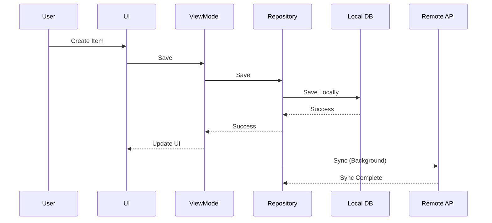
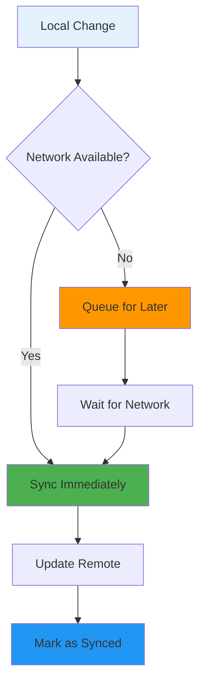

# Building Offline-First Apps

## Overview

Offline-first architecture ensures your app works seamlessly whether online or offline, providing a better user experience. This guide covers local data storage with Room, sync strategies, conflict resolution, network state management, and building resilient offline-capable Android applications.

## Deep Explanation

### Offline-First Principles

1. **Local-First**: Data stored locally by default
2. **Sync Later**: Network used for synchronization
3. **Optimistic Updates**: UI updates immediately
4. **Conflict Resolution**: Handle data conflicts gracefully

### Architecture

```
UI Layer
  ↓
ViewModel
  ↓
Repository (Single Source of Truth)
  ↓
Local DB (Room) ← → Remote API
```

### Room Database

Room provides an abstraction layer over SQLite:

```kotlin
@Entity(tableName = "users")
data class User(
    @PrimaryKey val id: String,
    val name: String,
    val email: String,
    val lastSynced: Long = System.currentTimeMillis()
)

@Dao
interface UserDao {
    @Query("SELECT * FROM users")
    fun getAllUsers(): Flow<List<User>>
    
    @Insert(onConflict = OnConflictStrategy.REPLACE)
    suspend fun insertUser(user: User)
    
    @Query("SELECT * FROM users WHERE id = :id")
    suspend fun getUser(id: String): User?
}

@Database(entities = [User::class], version = 1)
abstract class AppDatabase : RoomDatabase() {
    abstract fun userDao(): UserDao
}
```

## Diagrams

### Offline-First Flow



### Sync Strategy



## Real Code Examples

### Complete Offline-First Repository

```kotlin
class UserRepository(
    private val userDao: UserDao,
    private val apiService: ApiService,
    private val networkMonitor: NetworkMonitor
) {
    // Single source of truth - always read from local DB
    fun getUsers(): Flow<List<User>> = userDao.getAllUsers()
    
    suspend fun saveUser(user: User) {
        // Save locally first (optimistic update)
        userDao.insertUser(user.copy(lastSynced = 0)) // 0 = not synced
        
        // Try to sync if online
        if (networkMonitor.isOnline()) {
            try {
                syncUser(user)
            } catch (e: Exception) {
                // Sync failed, will retry later
                Log.e("UserRepository", "Sync failed", e)
            }
        }
    }
    
    private suspend fun syncUser(user: User) {
        val syncedUser = apiService.saveUser(user)
        userDao.insertUser(syncedUser.copy(lastSynced = System.currentTimeMillis()))
    }
    
    suspend fun syncAll() {
        if (!networkMonitor.isOnline()) return
        
        val unsyncedUsers = userDao.getUnsyncedUsers()
        unsyncedUsers.forEach { user ->
            try {
                syncUser(user)
            } catch (e: Exception) {
                Log.e("UserRepository", "Failed to sync user ${user.id}", e)
            }
        }
    }
}

// Network Monitor
class NetworkMonitor(private val context: Context) {
    private val connectivityManager = 
        context.getSystemService(Context.CONNECTIVITY_SERVICE) as ConnectivityManager
    
    fun isOnline(): Boolean {
        val network = connectivityManager.activeNetwork
        val capabilities = connectivityManager.getNetworkCapabilities(network)
        return capabilities?.hasCapability(
            NetworkCapabilities.NET_CAPABILITY_INTERNET
        ) == true
    }
    
    fun observeNetwork(): Flow<Boolean> = callbackFlow {
        val callback = object : ConnectivityManager.NetworkCallback() {
            override fun onAvailable(network: Network) {
                trySend(true)
            }
            
            override fun onLost(network: Network) {
                trySend(false)
            }
        }
        
        val request = NetworkRequest.Builder()
            .addCapability(NetworkCapabilities.NET_CAPABILITY_INTERNET)
            .build()
        
        connectivityManager.registerNetworkCallback(request, callback)
        
        awaitClose {
            connectivityManager.unregisterNetworkCallback(callback)
        }
    }
}
```

### WorkManager for Background Sync

```kotlin
class SyncWorker(
    context: Context,
    params: WorkerParameters
) : CoroutineWorker(context, params) {
    
    override suspend fun doWork(): Result {
        return try {
            val repository = (applicationContext as App).repository
            repository.syncAll()
            Result.success()
        } catch (e: Exception) {
            Result.retry()
        }
    }
    
    companion object {
        fun enqueue(context: Context) {
            val constraints = Constraints.Builder()
                .setRequiredNetworkType(NetworkType.CONNECTED)
                .build()
            
            val request = PeriodicWorkRequestBuilder<SyncWorker>(
                15, TimeUnit.MINUTES
            )
                .setConstraints(constraints)
                .build()
            
            WorkManager.getInstance(context).enqueue(request)
        }
    }
}
```

## Hard Use-Case: Conflict Resolution

### Problem

You need to handle conflicts when:
- Same data modified offline on multiple devices
- Server data changed while offline
- Multiple users editing same record
- Network interruptions during sync

### Solution

```kotlin
enum class ConflictResolutionStrategy {
    SERVER_WINS,
    CLIENT_WINS,
    MERGE,
    MANUAL
}

class ConflictResolver {
    fun resolveConflict(
        local: User,
        remote: User,
        strategy: ConflictResolutionStrategy
    ): User {
        return when (strategy) {
            ConflictResolutionStrategy.SERVER_WINS -> remote
            ConflictResolutionStrategy.CLIENT_WINS -> local
            ConflictResolutionStrategy.MERGE -> mergeUsers(local, remote)
            ConflictResolutionStrategy.MANUAL -> throw ManualResolutionRequired()
        }
    }
    
    private fun mergeUsers(local: User, remote: User): User {
        // Merge logic: take non-null values, prefer newer timestamps
        return User(
            id = local.id,
            name = remote.name.takeIf { it.isNotBlank() } ?: local.name,
            email = if (remote.lastSynced > local.lastSynced) {
                remote.email
            } else {
                local.email
            },
            lastSynced = System.currentTimeMillis()
        )
    }
}

class UserRepository(
    private val userDao: UserDao,
    private val apiService: ApiService,
    private val conflictResolver: ConflictResolver
) {
    suspend fun syncUser(user: User): SyncResult {
        return try {
            val remoteUser = apiService.getUser(user.id)
            
            if (remoteUser.lastSynced > user.lastSynced) {
                // Conflict detected
                val resolved = conflictResolver.resolveConflict(
                    local = user,
                    remote = remoteUser,
                    strategy = ConflictResolutionStrategy.MERGE
                )
                
                // Save resolved version
                userDao.insertUser(resolved)
                
                // Update server with resolved version
                val synced = apiService.saveUser(resolved)
                userDao.insertUser(synced.copy(lastSynced = System.currentTimeMillis()))
                
                SyncResult.Success(resolved)
            } else {
                // No conflict, update server
                val synced = apiService.saveUser(user)
                userDao.insertUser(synced.copy(lastSynced = System.currentTimeMillis()))
                SyncResult.Success(synced)
            }
        } catch (e: ManualResolutionRequired) {
            SyncResult.Conflict(user, remoteUser)
        } catch (e: Exception) {
            SyncResult.Error(e)
        }
    }
}

sealed class SyncResult {
    data class Success(val user: User) : SyncResult()
    data class Conflict(val local: User, val remote: User) : SyncResult()
    data class Error(val exception: Exception) : SyncResult()
}
```

### Alternative: Last-Write-Wins with Timestamps

```kotlin
@Entity(tableName = "users")
data class User(
    @PrimaryKey val id: String,
    val name: String,
    val email: String,
    val version: Long = 0, // Incremented on each change
    val lastModified: Long = System.currentTimeMillis(),
    val lastSynced: Long = 0
)

suspend fun syncWithVersioning(user: User): User {
    val remoteUser = apiService.getUser(user.id)
    
    return if (user.version > remoteUser.version) {
        // Local is newer, push to server
        val synced = apiService.saveUser(user)
        synced.copy(lastSynced = System.currentTimeMillis())
    } else if (remoteUser.version > user.version) {
        // Remote is newer, pull from server
        remoteUser.copy(lastSynced = System.currentTimeMillis())
    } else {
        // Same version, no conflict
        user.copy(lastSynced = System.currentTimeMillis())
    }
}
```

## Edge Cases and Pitfalls

### 1. Stale Data

**Problem**: Showing outdated data

```kotlin
// BAD: Never refresh
fun getUsers(): Flow<List<User>> = userDao.getAllUsers()

// GOOD: Periodic refresh
fun getUsers(): Flow<List<User>> = flow {
    emitAll(userDao.getAllUsers())
    
    while (true) {
        delay(5.minutes)
        if (networkMonitor.isOnline()) {
            refreshFromServer()
        }
    }
}
```

### 2. Sync Failures

**Problem**: Not handling sync failures

```kotlin
// BAD: Silent failure
suspend fun sync() {
    apiService.saveUser(user)
}

// GOOD: Retry with exponential backoff
suspend fun syncWithRetry(user: User, maxRetries: Int = 3) {
    var attempt = 0
    var delay = 1.seconds
    
    while (attempt < maxRetries) {
        try {
            apiService.saveUser(user)
            return
        } catch (e: Exception) {
            attempt++
            if (attempt < maxRetries) {
                delay(delay)
                delay *= 2
            } else {
                throw e
            }
        }
    }
}
```

### 3. Large Data Sets

**Problem**: Syncing too much data

```kotlin
// BAD: Sync everything
suspend fun syncAll() {
    val allUsers = userDao.getAllUsersSync()
    allUsers.forEach { syncUser(it) }
}

// GOOD: Pagination and incremental sync
suspend fun syncIncremental(lastSyncTime: Long) {
    var page = 0
    val pageSize = 50
    
    while (true) {
        val users = apiService.getUsers(
            page = page,
            size = pageSize,
            since = lastSyncTime
        )
        
        if (users.isEmpty()) break
        
        userDao.insertAll(users)
        page++
    }
}
```

### 4. Battery Optimization

**Problem**: Background sync draining battery

```kotlin
// GOOD: Smart sync scheduling
class SmartSyncScheduler {
    fun scheduleSync(context: Context) {
        val constraints = Constraints.Builder()
            .setRequiredNetworkType(NetworkType.UNMETERED) // WiFi only
            .setRequiresBatteryNotLow(true)
            .setRequiresCharging(false) // Can sync when not charging
            .build()
        
        val request = PeriodicWorkRequestBuilder<SyncWorker>(
            1, TimeUnit.HOURS
        )
            .setConstraints(constraints)
            .setBackoffCriteria(
                BackoffPolicy.EXPONENTIAL,
                15, TimeUnit.MINUTES
            )
            .build()
        
        WorkManager.getInstance(context).enqueue(request)
    }
}
```

## References and Further Reading

- [Room Persistence Library](https://developer.android.com/training/data-storage/room)
- [WorkManager](https://developer.android.com/topic/libraries/architecture/workmanager)
- [Offline-First Architecture](https://developer.android.com/topic/architecture/data-layer/offline-first)
- [Network State Management](https://developer.android.com/training/basics/network-ops/managing-network-usage)

## Quiz

### Question 1
What is the primary principle of offline-first architecture?

**A)** Always use network  
**B)** Store data locally first, sync later  
**C)** Only work online  
**D)** Cache everything

**Answer: B** - Offline-first means storing data locally by default and syncing with the server when possible.

### Question 2
What should be the single source of truth in offline-first apps?

**A)** Remote API  
**B)** Local database  
**C)** SharedPreferences  
**D)** ViewModel

**Answer: B** - The local database should be the single source of truth, with the UI always reading from it.

### Question 3
What is an optimistic update?

**A)** Updating UI after server confirms  
**B)** Updating UI immediately, syncing later  
**C)** Never updating UI  
**D)** Only updating on success

**Answer: B** - Optimistic updates update the UI immediately based on local changes, then sync with the server in the background.

### Question 4
What is the best strategy for handling conflicts in offline-first apps?

**A)** Always server wins  
**B)** Always client wins  
**C)** Depends on use case, often merge or manual resolution  
**D)** Ignore conflicts

**Answer: C** - The best strategy depends on the use case. Common approaches include merge, last-write-wins, or manual resolution for critical conflicts.

### Question 5
What should you use for background synchronization in Android?

**A)** Thread  
**B)** AsyncTask  
**C)** WorkManager  
**D)** Handler

**Answer: C** - WorkManager is the recommended solution for background work that needs to run reliably, even if the app is closed.

## Related Topics

- [Advanced Coroutines & Cancellation](./20.%20Advanced%20Coroutines%20%26%20Cancellation.md) - Async sync operations
- [Performance Profiling & Memory Leaks](./21.%20Performance%20Profiling%20%26%20Memory%20Leaks.md) - Memory with offline data
- [Large Scale App Architecture Case Study](../04_overachiever/32.%20Large%20Scale%20App%20Architecture%20Case%20Study.md) - Offline at scale

