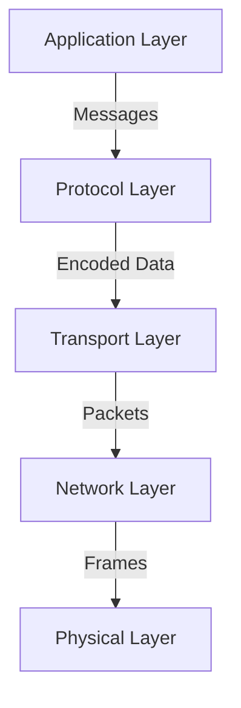

# Protocol Design and Implementations

## Overview

Protocol design is the foundation of efficient, reliable, and scalable communication between systems. This comprehensive guide covers protocol architecture principles, binary protocol design, text-based protocols, serialization strategies, RPC frameworks, message queue protocols, custom protocol implementations, performance optimization, security considerations, and real-world case studies for building production-grade communication systems.

## Table of Contents

1. [Protocol Fundamentals](#protocol-fundamentals)
2. [Protocol Architecture Patterns](#protocol-architecture-patterns)
3. [Binary Protocol Design](#binary-protocol-design)
4. [Text-Based Protocol Design](#text-based-protocol-design)
5. [Serialization Strategies](#serialization-strategies)
6. [RPC Protocol Implementation](#rpc-protocol-implementation)
7. [Message Queue Protocols](#message-queue-protocols)
8. [Custom Protocol Implementation](#custom-protocol-implementation)
9. [Performance Optimization](#performance-optimization)
10. [Security & Encryption](#security-encryption)
11. [Protocol Versioning](#protocol-versioning)
12. [Real-World Case Studies](#real-world-case-studies)

## Protocol Fundamentals

### What is a Protocol?

A protocol defines the rules, format, and semantics for communication between two or more entities. It specifies:

- **Message Format**: How data is structured
- **Encoding**: How data is represented (binary, text, JSON, etc.)
- **Transport**: How messages are delivered (TCP, UDP, HTTP, etc.)
- **Semantics**: What messages mean and how to respond
- **Error Handling**: How errors are communicated
- **State Management**: How connection state is maintained

### Protocol Layers



### Protocol Design Principles

1. **Simplicity**: Easy to understand and implement
2. **Efficiency**: Minimal overhead, fast parsing
3. **Extensibility**: Support for future changes
4. **Reliability**: Error detection and recovery
5. **Security**: Authentication and encryption
6. **Interoperability**: Works across platforms
7. **Backward Compatibility**: Supports older versions

## Protocol Architecture Patterns

### Request-Response Pattern

```kotlin
// Request-Response Protocol
sealed class ProtocolMessage {
    abstract val messageId: Long
    abstract val timestamp: Long
    
    data class Request(
        override val messageId: Long,
        override val timestamp: Long,
        val method: String,
        val parameters: Map<String, Any>
    ) : ProtocolMessage()
    
    data class Response(
        override val messageId: Long,
        override val timestamp: Long,
        val status: ResponseStatus,
        val result: Any?,
        val error: ProtocolError?
    ) : ProtocolMessage()
    
    enum class ResponseStatus {
        SUCCESS,
        ERROR,
        TIMEOUT
    }
    
    data class ProtocolError(
        val code: Int,
        val message: String,
        val details: Map<String, Any>?
    )
}
```

### Publish-Subscribe Pattern

```kotlin
// Pub-Sub Protocol
sealed class PubSubMessage {
    abstract val topic: String
    abstract val messageId: String
    
    data class Subscribe(
        override val topic: String,
        override val messageId: String,
        val subscriberId: String
    ) : PubSubMessage()
    
    data class Unsubscribe(
        override val topic: String,
        override val messageId: String,
        val subscriberId: String
    ) : PubSubMessage()
    
    data class Publish(
        override val topic: String,
        override val messageId: String,
        val payload: ByteArray,
        val headers: Map<String, String>
    ) : PubSubMessage()
    
    data class Notification(
        override val topic: String,
        override val messageId: String,
        val payload: ByteArray,
        val timestamp: Long
    ) : PubSubMessage()
}
```

### Streaming Pattern

```kotlin
// Streaming Protocol
class StreamingProtocol {
    sealed class StreamMessage {
        abstract val streamId: String
        abstract val sequenceNumber: Long
        
        data class StreamStart(
            override val streamId: String,
            override val sequenceNumber: Long,
            val metadata: Map<String, String>
        ) : StreamMessage()
        
        data class StreamData(
            override val streamId: String,
            override val sequenceNumber: Long,
            val data: ByteArray,
            val isLast: Boolean
        ) : StreamMessage()
        
        data class StreamAck(
            override val streamId: String,
            override val sequenceNumber: Long,
            val receivedSequence: Long
        ) : StreamMessage()
        
        data class StreamEnd(
            override val streamId: String,
            override val sequenceNumber: Long,
            val reason: String
        ) : StreamMessage()
    }
}
```

## Binary Protocol Design

### Fixed-Length Binary Protocol

```kotlin
// Fixed-Length Binary Protocol
class FixedLengthBinaryProtocol {
    companion object {
        private const val HEADER_SIZE = 16
        private const val MAX_PAYLOAD_SIZE = 65535
    }
    
    data class MessageHeader(
        val version: Byte,
        val messageType: Byte,
        val flags: Byte,
        val reserved: Byte,
        val payloadLength: Int,
        val messageId: Long
    ) {
        fun toBytes(): ByteArray {
            return ByteArray(HEADER_SIZE).apply {
                this[0] = version
                this[1] = messageType
                this[2] = flags
                this[3] = reserved
                System.arraycopy(payloadLength.toByteArray(), 0, this, 4, 4)
                System.arraycopy(messageId.toByteArray(), 0, this, 8, 8)
            }
        }
        
        companion object {
            fun fromBytes(bytes: ByteArray): MessageHeader {
                require(bytes.size >= HEADER_SIZE) { "Invalid header size" }
                return MessageHeader(
                    version = bytes[0],
                    messageType = bytes[1],
                    flags = bytes[2],
                    reserved = bytes[3],
                    payloadLength = bytes.sliceArray(4..7).toInt(),
                    messageId = bytes.sliceArray(8..15).toLong()
                )
            }
        }
    }
    
    data class BinaryMessage(
        val header: MessageHeader,
        val payload: ByteArray
    ) {
        fun toBytes(): ByteArray {
            require(payload.size <= MAX_PAYLOAD_SIZE) { "Payload too large" }
            return header.toBytes() + payload
        }
        
        companion object {
            fun fromBytes(bytes: ByteArray): BinaryMessage {
                val header = MessageHeader.fromBytes(bytes)
                val payload = bytes.sliceArray(HEADER_SIZE until HEADER_SIZE + header.payloadLength)
                return BinaryMessage(header, payload)
            }
        }
    }
}

// Helper extensions
private fun Int.toByteArray(): ByteArray = ByteArray(4) {
    (this shr (it * 8)).toByte()
}

private fun Long.toByteArray(): ByteArray = ByteArray(8) {
    (this shr (it * 8)).toByte()
}

private fun ByteArray.toInt(): Int {
    var result = 0
    for (i in indices) {
        result = result or ((this[i].toInt() and 0xFF) shl (i * 8))
    }
    return result
}

private fun ByteArray.toLong(): Long {
    var result = 0L
    for (i in indices) {
        result = result or ((this[i].toLong() and 0xFF) shl (i * 8))
    }
    return result
}
```

### Variable-Length Binary Protocol

```kotlin
// Variable-Length Binary Protocol with TLV (Type-Length-Value)
class TLVProtocol {
    data class TLVField(
        val type: Int,
        val length: Int,
        val value: ByteArray
    ) {
        fun toBytes(): ByteArray {
            val typeBytes = encodeVarInt(type)
            val lengthBytes = encodeVarInt(length)
            return typeBytes + lengthBytes + value
        }
        
        companion object {
            fun fromBytes(bytes: ByteArray, offset: Int = 0): Pair<TLVField, Int> {
                var currentOffset = offset
                val (type, typeBytes) = decodeVarInt(bytes, currentOffset)
                currentOffset += typeBytes
                
                val (length, lengthBytes) = decodeVarInt(bytes, currentOffset)
                currentOffset += lengthBytes
                
                val value = bytes.sliceArray(currentOffset until currentOffset + length)
                currentOffset += length
                
                return Pair(TLVField(type, length, value), currentOffset)
            }
        }
    }
    
    data class TLVMessage(
        val fields: List<TLVField>
    ) {
        fun toBytes(): ByteArray {
            return fields.flatMap { it.toBytes().toList() }.toByteArray()
        }
        
        fun getField(type: Int): TLVField? {
            return fields.find { it.type == type }
        }
        
        companion object {
            fun fromBytes(bytes: ByteArray): TLVMessage {
                val fields = mutableListOf<TLVField>()
                var offset = 0
                
                while (offset < bytes.size) {
                    val (field, newOffset) = TLVField.fromBytes(bytes, offset)
                    fields.add(field)
                    offset = newOffset
                }
                
                return TLVMessage(fields)
            }
        }
    }
    
    // Variable-length integer encoding (similar to Protocol Buffers)
    private fun encodeVarInt(value: Int): ByteArray {
        val result = mutableListOf<Byte>()
        var v = value
        while (v >= 0x80) {
            result.add(((v and 0x7F) or 0x80).toByte())
            v = v ushr 7
        }
        result.add(v.toByte())
        return result.toByteArray()
    }
    
    private fun decodeVarInt(bytes: ByteArray, offset: Int): Pair<Int, Int> {
        var result = 0
        var shift = 0
        var currentOffset = offset
        
        while (currentOffset < bytes.size) {
            val b = bytes[currentOffset++].toInt() and 0xFF
            result = result or ((b and 0x7F) shl shift)
            if ((b and 0x80) == 0) {
                break
            }
            shift += 7
        }
        
        return Pair(result, currentOffset - offset)
    }
}
```

## Text-Based Protocol Design

### JSON Protocol

```kotlin
// JSON-Based Protocol
class JSONProtocol {
    data class JSONMessage(
        val version: String,
        val type: String,
        val id: String,
        val timestamp: Long,
        val payload: Map<String, Any>
    ) {
        fun toJSON(): String {
            return json {
                "version" to version
                "type" to type
                "id" to id
                "timestamp" to timestamp
                "payload" to payload
            }.toString()
        }
        
        companion object {
            fun fromJSON(json: String): JSONMessage {
                val obj = JSONObject(json)
                return JSONMessage(
                    version = obj.getString("version"),
                    type = obj.getString("type"),
                    id = obj.getString("id"),
                    timestamp = obj.getLong("timestamp"),
                    payload = obj.getJSONObject("payload").toMap()
                )
            }
        }
    }
    
    // Using kotlinx.serialization
    @Serializable
    data class SerializableMessage(
        val version: String,
        val type: String,
        val id: String,
        val timestamp: Long,
        val payload: Map<String, JsonElement>
    ) {
        fun toJSON(): String {
            return Json.encodeToString(this)
        }
        
        companion object {
            fun fromJSON(json: String): SerializableMessage {
                return Json.decodeFromString(json)
            }
        }
    }
}
```

### Custom Text Protocol

```kotlin
// Custom Text Protocol (similar to HTTP/Redis)
class TextProtocol {
    data class TextMessage(
        val command: String,
        val arguments: List<String>,
        val metadata: Map<String, String>
    ) {
        fun serialize(): String {
            val parts = mutableListOf<String>()
            parts.add(command)
            parts.addAll(arguments)
            
            if (metadata.isNotEmpty()) {
                parts.add("METADATA")
                metadata.forEach { (key, value) ->
                    parts.add("$key:$value")
                }
            }
            
            return parts.joinToString(" ") + "\n"
        }
        
        companion object {
            fun deserialize(text: String): TextMessage {
                val lines = text.trim().split("\n")
                val firstLine = lines[0].split(" ")
                val command = firstLine[0]
                val arguments = firstLine.drop(1).takeWhile { it != "METADATA" }
                
                val metadataStart = firstLine.indexOf("METADATA")
                val metadata = if (metadataStart >= 0) {
                    firstLine.drop(metadataStart + 1)
                        .associate { part ->
                            val (key, value) = part.split(":", limit = 2)
                            key to value
                        }
                } else {
                    emptyMap()
                }
                
                return TextMessage(command, arguments, metadata)
            }
        }
    }
    
    // Example usage
    fun example() {
        val message = TextMessage(
            command = "SET",
            arguments = listOf("key", "value"),
            metadata = mapOf("ttl" to "3600", "flags" to "NX")
        )
        
        val serialized = message.serialize()
        // "SET key value METADATA ttl:3600 flags:NX\n"
        
        val deserialized = TextMessage.deserialize(serialized)
    }
}
```

## Serialization Strategies

### Protocol Buffers Implementation

```kotlin
// Protocol Buffers-like implementation
class ProtobufSerializer {
    fun serialize(message: Map<String, Any>): ByteArray {
        val result = mutableListOf<Byte>()
        
        message.forEach { (key, value) ->
            val fieldNumber = key.hashCode() and 0x1F
            val wireType = when (value) {
                is Int -> 0 // Varint
                is Long -> 0 // Varint
                is String -> 2 // Length-delimited
                is ByteArray -> 2 // Length-delimited
                else -> 2
            }
            
            val tag = (fieldNumber shl 3) or wireType
            result.addAll(encodeVarInt(tag).toList())
            
            when (value) {
                is Int -> result.addAll(encodeVarInt(value).toList())
                is Long -> result.addAll(encodeVarLong(value).toList())
                is String -> {
                    val bytes = value.toByteArray()
                    result.addAll(encodeVarInt(bytes.size).toList())
                    result.addAll(bytes.toList())
                }
                is ByteArray -> {
                    result.addAll(encodeVarInt(value.size).toList())
                    result.addAll(value.toList())
                }
            }
        }
        
        return result.toByteArray()
    }
    
    private fun encodeVarInt(value: Int): ByteArray {
        val result = mutableListOf<Byte>()
        var v = value
        while (v >= 0x80) {
            result.add(((v and 0x7F) or 0x80).toByte())
            v = v ushr 7
        }
        result.add(v.toByte())
        return result.toByteArray()
    }
    
    private fun encodeVarLong(value: Long): ByteArray {
        val result = mutableListOf<Byte>()
        var v = value
        while (v >= 0x80) {
            result.add(((v and 0x7F) or 0x80).toByte())
            v = v ushr 7
        }
        result.add(v.toByte())
        return result.toByteArray()
    }
}
```

### MessagePack Implementation

```kotlin
// MessagePack-like binary serialization
class MessagePackSerializer {
    fun serialize(value: Any): ByteArray {
        return when (value) {
            is Int -> serializeInt(value)
            is Long -> serializeLong(value)
            is String -> serializeString(value)
            is ByteArray -> serializeBinary(value)
            is List<*> -> serializeArray(value)
            is Map<*, *> -> serializeMap(value)
            else -> throw IllegalArgumentException("Unsupported type")
        }
    }
    
    private fun serializeInt(value: Int): ByteArray {
        return when {
            value >= 0 && value <= 127 -> byteArrayOf(value.toByte())
            value >= -32 && value < 0 -> byteArrayOf(value.toByte())
            value >= -128 && value <= 127 -> byteArrayOf(0xD0.toByte(), value.toByte())
            value >= Short.MIN_VALUE.toInt() && value <= Short.MAX_VALUE.toInt() -> {
                val bytes = ByteArray(3)
                bytes[0] = 0xD1.toByte()
                bytes[1] = ((value ushr 8) and 0xFF).toByte()
                bytes[2] = (value and 0xFF).toByte()
                bytes
            }
            else -> {
                val bytes = ByteArray(5)
                bytes[0] = 0xD2.toByte()
                bytes[1] = ((value ushr 24) and 0xFF).toByte()
                bytes[2] = ((value ushr 16) and 0xFF).toByte()
                bytes[3] = ((value ushr 8) and 0xFF).toByte()
                bytes[4] = (value and 0xFF).toByte()
                bytes
            }
        }
    }
    
    private fun serializeString(value: String): ByteArray {
        val bytes = value.toByteArray(Charsets.UTF_8)
        return when {
            bytes.size <= 31 -> {
                byteArrayOf((0xA0 or bytes.size).toByte()) + bytes
            }
            bytes.size <= 255 -> {
                byteArrayOf(0xD9.toByte(), bytes.size.toByte()) + bytes
            }
            bytes.size <= 65535 -> {
                val header = ByteArray(3)
                header[0] = 0xDA.toByte()
                header[1] = ((bytes.size ushr 8) and 0xFF).toByte()
                header[2] = (bytes.size and 0xFF).toByte()
                header + bytes
            }
            else -> {
                val header = ByteArray(5)
                header[0] = 0xDB.toByte()
                header[1] = ((bytes.size ushr 24) and 0xFF).toByte()
                header[2] = ((bytes.size ushr 16) and 0xFF).toByte()
                header[3] = ((bytes.size ushr 8) and 0xFF).toByte()
                header[4] = (bytes.size and 0xFF).toByte()
                header + bytes
            }
        }
    }
    
    private fun serializeArray(value: List<*>): ByteArray {
        val items = value.map { serialize(it!!) }
        val totalSize = items.sumOf { it.size }
        
        return when {
            value.size <= 15 -> {
                byteArrayOf((0x90 or value.size).toByte()) + items.flatMap { it.toList() }.toByteArray()
            }
            value.size <= 65535 -> {
                val header = ByteArray(3)
                header[0] = 0xDC.toByte()
                header[1] = ((value.size ushr 8) and 0xFF).toByte()
                header[2] = (value.size and 0xFF).toByte()
                header + items.flatMap { it.toList() }.toByteArray()
            }
            else -> {
                val header = ByteArray(5)
                header[0] = 0xDD.toByte()
                header[1] = ((value.size ushr 24) and 0xFF).toByte()
                header[2] = ((value.size ushr 16) and 0xFF).toByte()
                header[3] = ((value.size ushr 8) and 0xFF).toByte()
                header[4] = (value.size and 0xFF).toByte()
                header + items.flatMap { it.toList() }.toByteArray()
            }
        }
    }
    
    private fun serializeMap(value: Map<*, *>): ByteArray {
        val entries = value.flatMap { (k, v) ->
            listOf(serialize(k!!), serialize(v!!))
        }
        
        return when {
            value.size <= 15 -> {
                byteArrayOf((0x80 or value.size).toByte()) + entries.flatMap { it.toList() }.toByteArray()
            }
            value.size <= 65535 -> {
                val header = ByteArray(3)
                header[0] = 0xDE.toByte()
                header[1] = ((value.size ushr 8) and 0xFF).toByte()
                header[2] = (value.size and 0xFF).toByte()
                header + entries.flatMap { it.toList() }.toByteArray()
            }
            else -> {
                val header = ByteArray(5)
                header[0] = 0xDF.toByte()
                header[1] = ((value.size ushr 24) and 0xFF).toByte()
                header[2] = ((value.size ushr 16) and 0xFF).toByte()
                header[3] = ((value.size ushr 8) and 0xFF).toByte()
                header[4] = (value.size and 0xFF).toByte()
                header + entries.flatMap { it.toList() }.toByteArray()
            }
        }
    }
    
    private fun serializeBinary(value: ByteArray): ByteArray {
        return when {
            value.size <= 255 -> {
                byteArrayOf(0xC4.toByte(), value.size.toByte()) + value
            }
            value.size <= 65535 -> {
                val header = ByteArray(3)
                header[0] = 0xC5.toByte()
                header[1] = ((value.size ushr 8) and 0xFF).toByte()
                header[2] = (value.size and 0xFF).toByte()
                header + value
            }
            else -> {
                val header = ByteArray(5)
                header[0] = 0xC6.toByte()
                header[1] = ((value.size ushr 24) and 0xFF).toByte()
                header[2] = ((value.size ushr 16) and 0xFF).toByte()
                header[3] = ((value.size ushr 8) and 0xFF).toByte()
                header[4] = (value.size and 0xFF).toByte()
                header + value
            }
        }
    }
    
    private fun serializeLong(value: Long): ByteArray {
        // Similar to Int but with 8 bytes
        val bytes = ByteArray(9)
        bytes[0] = 0xCF.toByte()
        for (i in 0 until 8) {
            bytes[i + 1] = ((value ushr (56 - i * 8)) and 0xFF).toByte()
        }
        return bytes
    }
}
```

## RPC Protocol Implementation

### Custom RPC Protocol

```kotlin
// Custom RPC Protocol
class RPCProtocol {
    data class RPCRequest(
        val requestId: Long,
        val method: String,
        val parameters: List<Any>,
        val timeout: Long = 5000
    ) {
        fun serialize(): ByteArray {
            // Implementation using chosen serialization
            return MessagePackSerializer().serialize(mapOf(
                "id" to requestId,
                "method" to method,
                "params" to parameters,
                "timeout" to timeout
            ))
        }
        
        companion object {
            fun deserialize(bytes: ByteArray): RPCRequest {
                // Deserialize implementation
                val map = deserializeToMap(bytes)
                return RPCRequest(
                    requestId = (map["id"] as Number).toLong(),
                    method = map["method"] as String,
                    parameters = map["params"] as List<Any>,
                    timeout = (map["timeout"] as? Number)?.toLong() ?: 5000
                )
            }
        }
    }
    
    data class RPCResponse(
        val requestId: Long,
        val result: Any?,
        val error: RPCError?
    ) {
        fun serialize(): ByteArray {
            return MessagePackSerializer().serialize(mapOf(
                "id" to requestId,
                "result" to (result ?: ""),
                "error" to (error?.let { mapOf("code" to it.code, "message" to it.message) } ?: "")
            ))
        }
        
        companion object {
            fun deserialize(bytes: ByteArray): RPCResponse {
                val map = deserializeToMap(bytes)
                val errorMap = map["error"] as? Map<*, *>
                return RPCResponse(
                    requestId = (map["id"] as Number).toLong(),
                    result = map["result"],
                    error = errorMap?.let {
                        RPCError(
                            code = (it["code"] as Number).toInt(),
                            message = it["message"] as String
                        )
                    }
                )
            }
        }
    }
    
    data class RPCError(
        val code: Int,
        val message: String
    )
    
    // RPC Server
    class RPCServer {
        private val handlers = mutableMapOf<String, suspend (List<Any>) -> Any>()
        
        fun registerHandler(method: String, handler: suspend (List<Any>) -> Any) {
            handlers[method] = handler
        }
        
        suspend fun handleRequest(requestBytes: ByteArray): ByteArray {
            val request = RPCRequest.deserialize(requestBytes)
            val handler = handlers[request.method]
                ?: return RPCResponse(
                    request.requestId,
                    null,
                    RPCError(-32601, "Method not found")
                ).serialize()
            
            return try {
                val result = handler(request.parameters)
                RPCResponse(request.requestId, result, null).serialize()
            } catch (e: Exception) {
                RPCResponse(
                    request.requestId,
                    null,
                    RPCError(-32603, e.message ?: "Internal error")
                ).serialize()
            }
        }
    }
    
    // RPC Client
    class RPCClient(private val transport: Transport) {
        private var nextRequestId = 0L
        private val pendingRequests = mutableMapOf<Long, CompletableDeferred<RPCResponse>>()
        
        suspend fun call(method: String, vararg parameters: Any): Any {
            val requestId = nextRequestId++
            val request = RPCRequest(requestId, method, parameters.toList())
            
            val deferred = CompletableDeferred<RPCResponse>()
            pendingRequests[requestId] = deferred
            
            transport.send(request.serialize())
            
            val response = withTimeout(request.timeout) {
                deferred.await()
            }
            
            pendingRequests.remove(requestId)
            
            if (response.error != null) {
                throw RPCException(response.error)
            }
            
            return response.result!!
        }
        
        fun handleResponse(responseBytes: ByteArray) {
            val response = RPCResponse.deserialize(responseBytes)
            pendingRequests[response.requestId]?.complete(response)
        }
    }
    
    interface Transport {
        suspend fun send(data: ByteArray)
        fun setResponseHandler(handler: (ByteArray) -> Unit)
    }
    
    class RPCException(val error: RPCError) : Exception(error.message)
}
```

## Message Queue Protocols

### Custom Message Queue Protocol

```kotlin
// Message Queue Protocol
class MessageQueueProtocol {
    data class QueueMessage(
        val messageId: String,
        val queue: String,
        val payload: ByteArray,
        val priority: Int = 0,
        val timestamp: Long = System.currentTimeMillis(),
        val ttl: Long? = null,
        val headers: Map<String, String> = emptyMap()
    ) {
        fun isExpired(): Boolean {
            return ttl?.let { System.currentTimeMillis() > timestamp + it } ?: false
        }
    }
    
    sealed class QueueCommand {
        abstract val commandId: String
        
        data class Enqueue(
            override val commandId: String,
            val queue: String,
            val message: QueueMessage
        ) : QueueCommand()
        
        data class Dequeue(
            override val commandId: String,
            val queue: String,
            val timeout: Long = 0
        ) : QueueCommand()
        
        data class Ack(
            override val commandId: String,
            val messageId: String
        ) : QueueCommand()
        
        data class Nack(
            override val commandId: String,
            val messageId: String,
            val requeue: Boolean = false
        ) : QueueCommand()
        
        data class CreateQueue(
            override val commandId: String,
            val queue: String,
            val maxSize: Int? = null
        ) : QueueCommand()
        
        data class DeleteQueue(
            override val commandId: String,
            val queue: String
        ) : QueueCommand()
    }
    
    class MessageQueue {
        private val queues = mutableMapOf<String, ArrayDeque<QueueMessage>>()
        private val unackedMessages = mutableMapOf<String, QueueMessage>()
        
        fun createQueue(name: String, maxSize: Int? = null) {
            queues[name] = ArrayDeque()
        }
        
        fun enqueue(queue: String, message: QueueMessage): Boolean {
            val q = queues[queue] ?: return false
            if (q.size >= (queues[queue]?.size ?: Int.MAX_VALUE)) {
                return false
            }
            q.addLast(message)
            return true
        }
        
        fun dequeue(queue: String, timeout: Long = 0): QueueMessage? {
            val q = queues[queue] ?: return null
            
            val startTime = System.currentTimeMillis()
            while (q.isEmpty() && (timeout == 0L || System.currentTimeMillis() - startTime < timeout)) {
                Thread.sleep(100)
            }
            
            val message = q.removeFirstOrNull()
            if (message != null && !message.isExpired()) {
                unackedMessages[message.messageId] = message
                return message
            }
            return null
        }
        
        fun ack(messageId: String): Boolean {
            return unackedMessages.remove(messageId) != null
        }
        
        fun nack(messageId: String, requeue: Boolean = false): Boolean {
            val message = unackedMessages.remove(messageId) ?: return false
            if (requeue) {
                queues.values.firstOrNull()?.addFirst(message)
            }
            return true
        }
    }
}
```

## Custom Protocol Implementation

### Complete Protocol Stack

```kotlin
// Complete Protocol Implementation
class CustomProtocolStack {
    // Layer 1: Application Protocol
    sealed class ApplicationMessage {
        abstract val messageId: Long
        abstract val timestamp: Long
        
        data class DataMessage(
            override val messageId: Long,
            override val timestamp: Long,
            val data: ByteArray,
            val metadata: Map<String, String>
        ) : ApplicationMessage()
        
        data class ControlMessage(
            override val messageId: Long,
            override val timestamp: Long,
            val command: String,
            val parameters: Map<String, Any>
        ) : ApplicationMessage()
    }
    
    // Layer 2: Protocol Layer
    class ProtocolLayer {
        fun encode(message: ApplicationMessage): ByteArray {
            val serializer = MessagePackSerializer()
            return when (message) {
                is ApplicationMessage.DataMessage -> {
                    serializer.serialize(mapOf(
                        "type" to "data",
                        "id" to message.messageId,
                        "timestamp" to message.timestamp,
                        "data" to message.data,
                        "metadata" to message.metadata
                    ))
                }
                is ApplicationMessage.ControlMessage -> {
                    serializer.serialize(mapOf(
                        "type" to "control",
                        "id" to message.messageId,
                        "timestamp" to message.timestamp,
                        "command" to message.command,
                        "params" to message.parameters
                    ))
                }
            }
        }
        
        fun decode(bytes: ByteArray): ApplicationMessage {
            val map = deserializeToMap(bytes)
            val type = map["type"] as String
            val id = (map["id"] as Number).toLong()
            val timestamp = (map["timestamp"] as Number).toLong()
            
            return when (type) {
                "data" -> ApplicationMessage.DataMessage(
                    id,
                    timestamp,
                    map["data"] as ByteArray,
                    map["metadata"] as Map<String, String>
                )
                "control" -> ApplicationMessage.ControlMessage(
                    id,
                    timestamp,
                    map["command"] as String,
                    map["params"] as Map<String, Any>
                )
                else -> throw IllegalArgumentException("Unknown message type")
            }
        }
    }
    
    // Layer 3: Transport Layer
    class TransportLayer {
        private val protocolLayer = ProtocolLayer()
        private val pendingMessages = mutableMapOf<Long, CompletableDeferred<ApplicationMessage>>()
        
        suspend fun send(message: ApplicationMessage, channel: OutputStream) {
            val encoded = protocolLayer.encode(message)
            val header = createHeader(encoded.size)
            channel.write(header)
            channel.write(encoded)
            channel.flush()
        }
        
        suspend fun receive(channel: InputStream): ApplicationMessage {
            val header = readHeader(channel)
            val payload = ByteArray(header.payloadSize)
            channel.readFully(payload)
            
            val message = protocolLayer.decode(payload)
            
            // Handle response if it's a response to a pending request
            if (header.isResponse) {
                pendingMessages[header.messageId]?.complete(message)
            }
            
            return message
        }
        
        private fun createHeader(payloadSize: Int): TransportHeader {
            return TransportHeader(
                version = 1,
                flags = 0,
                payloadSize = payloadSize,
                messageId = generateMessageId(),
                isResponse = false
            )
        }
        
        private fun readHeader(channel: InputStream): TransportHeader {
            val bytes = ByteArray(16)
            channel.readFully(bytes)
            return TransportHeader.fromBytes(bytes)
        }
        
        private fun generateMessageId(): Long {
            return System.currentTimeMillis() * 1000 + (Math.random() * 1000).toLong()
        }
    }
    
    data class TransportHeader(
        val version: Byte,
        val flags: Byte,
        val payloadSize: Int,
        val messageId: Long,
        val isResponse: Boolean
    ) {
        fun toBytes(): ByteArray {
            return ByteArray(16).apply {
                this[0] = version
                this[1] = flags
                System.arraycopy(payloadSize.toByteArray(), 0, this, 2, 4)
                System.arraycopy(messageId.toByteArray(), 0, this, 6, 8)
                this[14] = if (isResponse) 1 else 0
                this[15] = 0 // Reserved
            }
        }
        
        companion object {
            fun fromBytes(bytes: ByteArray): TransportHeader {
                return TransportHeader(
                    version = bytes[0],
                    flags = bytes[1],
                    payloadSize = bytes.sliceArray(2..5).toInt(),
                    messageId = bytes.sliceArray(6..13).toLong(),
                    isResponse = bytes[14] == 1.toByte()
                )
            }
        }
    }
}

// Helper function
private fun InputStream.readFully(buffer: ByteArray) {
    var totalRead = 0
    while (totalRead < buffer.size) {
        val read = read(buffer, totalRead, buffer.size - totalRead)
        if (read == -1) throw EOFException()
        totalRead += read
    }
}
```

## Performance Optimization

### Zero-Copy Protocol

```kotlin
// Zero-Copy Protocol using ByteBuffer
class ZeroCopyProtocol {
    fun encodeToBuffer(message: Map<String, Any>): ByteBuffer {
        val estimatedSize = estimateSize(message)
        val buffer = ByteBuffer.allocateDirect(estimatedSize)
        buffer.order(ByteOrder.LITTLE_ENDIAN)
        
        // Write header
        buffer.putInt(message.size)
        
        // Write entries
        message.forEach { (key, value) ->
            writeString(buffer, key)
            writeValue(buffer, value)
        }
        
        buffer.flip()
        return buffer
    }
    
    private fun writeString(buffer: ByteBuffer, value: String) {
        val bytes = value.toByteArray(Charsets.UTF_8)
        buffer.putInt(bytes.size)
        buffer.put(bytes)
    }
    
    private fun writeValue(buffer: ByteBuffer, value: Any) {
        when (value) {
            is Int -> {
                buffer.put(1) // Type marker
                buffer.putInt(value)
            }
            is Long -> {
                buffer.put(2)
                buffer.putLong(value)
            }
            is String -> {
                buffer.put(3)
                writeString(buffer, value)
            }
            is ByteArray -> {
                buffer.put(4)
                buffer.putInt(value.size)
                buffer.put(value)
            }
        }
    }
    
    private fun estimateSize(message: Map<String, Any>): Int {
        var size = 4 // Entry count
        message.forEach { (key, value) ->
            size += 4 + key.toByteArray(Charsets.UTF_8).size // Key
            size += 1 // Type marker
            size += when (value) {
                is Int -> 4
                is Long -> 8
                is String -> 4 + value.toByteArray(Charsets.UTF_8).size
                is ByteArray -> 4 + value.size
                else -> 0
            }
        }
        return size
    }
}
```

### Connection Pooling

```kotlin
class ProtocolConnectionPool(
    private val maxConnections: Int = 10,
    private val connectionFactory: () -> ProtocolConnection
) {
    private val availableConnections = ArrayDeque<ProtocolConnection>()
    private val activeConnections = mutableSetOf<ProtocolConnection>()
    private val lock = ReentrantLock()
    private val condition = lock.newCondition()
    
    fun acquireConnection(): ProtocolConnection {
        lock.lock()
        try {
            while (availableConnections.isEmpty() && 
                   activeConnections.size >= maxConnections) {
                condition.await()
            }
            
            val connection = if (availableConnections.isNotEmpty()) {
                availableConnections.removeFirst()
            } else {
                connectionFactory()
            }
            
            activeConnections.add(connection)
            return connection
        } finally {
            lock.unlock()
        }
    }
    
    fun releaseConnection(connection: ProtocolConnection) {
        lock.lock()
        try {
            activeConnections.remove(connection)
            if (connection.isHealthy()) {
                availableConnections.add(connection)
            } else {
                connection.close()
            }
            condition.signal()
        } finally {
            lock.unlock()
        }
    }
}

interface ProtocolConnection {
    fun isHealthy(): Boolean
    fun close()
    suspend fun send(data: ByteArray)
    suspend fun receive(): ByteArray
}
```

## Security & Encryption

### Encrypted Protocol

```kotlin
class EncryptedProtocol(
    private val encryptionKey: SecretKey
) {
    private val cipher = Cipher.getInstance("AES/GCM/NoPadding")
    private val random = SecureRandom()
    
    fun encryptMessage(message: ByteArray): EncryptedMessage {
        val iv = ByteArray(12).apply { random.nextBytes(this) }
        val params = GCMParameterSpec(128, iv)
        
        cipher.init(Cipher.ENCRYPT_MODE, encryptionKey, params)
        val encrypted = cipher.doFinal(message)
        
        // Get authentication tag
        val tag = cipher.getIV() // In GCM, tag is appended to ciphertext
        
        return EncryptedMessage(encrypted, iv)
    }
    
    fun decryptMessage(encryptedMessage: EncryptedMessage): ByteArray {
        val params = GCMParameterSpec(128, encryptedMessage.iv)
        cipher.init(Cipher.DECRYPT_MODE, encryptionKey, params)
        return cipher.doFinal(encryptedMessage.data)
    }
    
    data class EncryptedMessage(
        val data: ByteArray,
        val iv: ByteArray
    )
}

// Protocol with Authentication
class AuthenticatedProtocol {
    private val hmac = Mac.getInstance("HmacSHA256")
    
    fun signMessage(message: ByteArray, key: SecretKey): ByteArray {
        hmac.init(key)
        return hmac.doFinal(message)
    }
    
    fun verifyMessage(message: ByteArray, signature: ByteArray, key: SecretKey): Boolean {
        val computed = signMessage(message, key)
        return MessageDigest.isEqual(computed, signature)
    }
    
    data class SignedMessage(
        val message: ByteArray,
        val signature: ByteArray
    ) {
        fun toBytes(): ByteArray {
            val messageLength = message.size.toByteArray()
            val signatureLength = signature.size.toByteArray()
            return messageLength + signatureLength + message + signature
        }
        
        companion object {
            fun fromBytes(bytes: ByteArray): SignedMessage {
                var offset = 0
                val msgLen = bytes.sliceArray(offset until offset + 4).toInt()
                offset += 4
                val sigLen = bytes.sliceArray(offset until offset + 4).toInt()
                offset += 4
                val message = bytes.sliceArray(offset until offset + msgLen)
                offset += msgLen
                val signature = bytes.sliceArray(offset until offset + sigLen)
                return SignedMessage(message, signature)
            }
        }
    }
}
```

## Protocol Versioning

### Versioned Protocol

```kotlin
class VersionedProtocol {
    sealed class ProtocolVersion(val version: Int) {
        object V1 : ProtocolVersion(1)
        object V2 : ProtocolVersion(2)
        object V3 : ProtocolVersion(3)
    }
    
    interface VersionedMessage {
        val version: ProtocolVersion
    }
    
    data class V1Message(
        override val version: ProtocolVersion = ProtocolVersion.V1,
        val data: String
    ) : VersionedMessage
    
    data class V2Message(
        override val version: ProtocolVersion = ProtocolVersion.V2,
        val data: String,
        val metadata: Map<String, String>
    ) : VersionedMessage
    
    data class V3Message(
        override val version: ProtocolVersion = ProtocolVersion.V3,
        val data: String,
        val metadata: Map<String, String>,
        val timestamp: Long
    ) : VersionedMessage
    
    class ProtocolSerializer {
        fun serialize(message: VersionedMessage): ByteArray {
            return when (message.version) {
                is ProtocolVersion.V1 -> serializeV1(message as V1Message)
                is ProtocolVersion.V2 -> serializeV2(message as V2Message)
                is ProtocolVersion.V3 -> serializeV3(message as V3Message)
            }
        }
        
        fun deserialize(bytes: ByteArray): VersionedMessage {
            val version = bytes[0].toInt()
            return when (version) {
                1 -> deserializeV1(bytes)
                2 -> deserializeV2(bytes)
                3 -> deserializeV3(bytes)
                else -> throw IllegalArgumentException("Unsupported version: $version")
            }
        }
        
        private fun serializeV1(message: V1Message): ByteArray {
            val dataBytes = message.data.toByteArray()
            return byteArrayOf(1) + dataBytes.size.toByteArray() + dataBytes
        }
        
        private fun deserializeV1(bytes: ByteArray): V1Message {
            val dataLen = bytes.sliceArray(1..4).toInt()
            val data = bytes.sliceArray(5 until 5 + dataLen).decodeToString()
            return V1Message(data = data)
        }
        
        // Similar for V2 and V3...
        private fun serializeV2(message: V2Message): ByteArray {
            // Implementation
            return byteArrayOf()
        }
        
        private fun deserializeV2(bytes: ByteArray): V2Message {
            // Implementation
            return V2Message("", emptyMap())
        }
        
        private fun serializeV3(message: V3Message): ByteArray {
            // Implementation
            return byteArrayOf()
        }
        
        private fun deserializeV3(bytes: ByteArray): V3Message {
            // Implementation
            return V3Message("", emptyMap(), 0L)
        }
    }
    
    // Migration support
    class ProtocolMigrator {
        fun migrate(message: VersionedMessage, targetVersion: ProtocolVersion): VersionedMessage {
            return when {
                message.version.version == targetVersion.version -> message
                message.version.version < targetVersion.version -> upgrade(message, targetVersion)
                else -> downgrade(message, targetVersion)
            }
        }
        
        private fun upgrade(message: VersionedMessage, target: ProtocolVersion): VersionedMessage {
            // Implement upgrade logic
            return when (message) {
                is V1Message -> V2Message(
                    data = message.data,
                    metadata = emptyMap()
                )
                is V2Message -> V3Message(
                    data = message.data,
                    metadata = message.metadata,
                    timestamp = System.currentTimeMillis()
                )
                else -> message
            }
        }
        
        private fun downgrade(message: VersionedMessage, target: ProtocolVersion): VersionedMessage {
            // Implement downgrade logic
            return when (message) {
                is V3Message -> V2Message(
                    data = message.data,
                    metadata = message.metadata
                )
                is V2Message -> V1Message(
                    data = message.data
                )
                else -> message
            }
        }
    }
}
```

## Real-World Case Studies

### Case Study 1: High-Performance Game Protocol

```kotlin
// Optimized protocol for real-time gaming
class GameProtocol {
    // Compact binary format for game state updates
    data class GameStateUpdate(
        val frameNumber: Int,
        val playerId: Byte,
        val position: Triple<Float, Float, Float>,
        val rotation: Float,
        val actions: Set<GameAction>
    ) {
        fun toBytes(): ByteArray {
            val buffer = ByteBuffer.allocate(32)
            buffer.order(ByteOrder.LITTLE_ENDIAN)
            buffer.putInt(frameNumber)
            buffer.put(playerId)
            buffer.putFloat(position.first)
            buffer.putFloat(position.second)
            buffer.putFloat(position.third)
            buffer.putFloat(rotation)
            buffer.put(actions.size.toByte())
            actions.forEach { buffer.put(it.toByte()) }
            buffer.flip()
            return buffer.array()
        }
    }
    
    enum class GameAction(val value: Byte) {
        JUMP(0x01),
        SHOOT(0x02),
        RELOAD(0x04),
        CROUCH(0x08)
    }
}
```

### Case Study 2: IoT Device Protocol

```kotlin
// Lightweight protocol for IoT devices
class IoTProtocol {
    data class SensorReading(
        val deviceId: String,
        val sensorType: Byte,
        val value: Float,
        val timestamp: Long,
        val batteryLevel: Byte
    ) {
        fun toBytes(): ByteArray {
            val deviceIdBytes = deviceId.toByteArray()
            return byteArrayOf(
                deviceIdBytes.size.toByte(),
                *deviceIdBytes,
                sensorType,
                *value.toByteArray(),
                *timestamp.toByteArray(),
                batteryLevel
            )
        }
    }
}
```

## Edge Cases and Pitfalls

### Common Issues

1. **Byte Order (Endianness):**
   - Always specify byte order explicitly
   - Use `ByteOrder.LITTLE_ENDIAN` or `ByteOrder.BIG_ENDIAN`
   - Document byte order in protocol specification

2. **Integer Overflow:**
   - Use appropriate integer sizes
   - Check bounds before serialization
   - Handle large numbers with variable-length encoding

3. **String Encoding:**
   - Always specify character encoding (UTF-8 recommended)
   - Handle multi-byte characters correctly
   - Consider string length limits

4. **Buffer Management:**
   - Pre-allocate buffers when possible
   - Use direct buffers for zero-copy operations
   - Handle buffer overflow gracefully

5. **Version Compatibility:**
   - Design for backward compatibility
   - Implement migration strategies
   - Handle unknown fields gracefully

### Best Practices

- Design protocols with extensibility in mind
- Use well-defined serialization formats
- Implement proper error handling
- Add checksums/authentication for critical data
- Document protocol specifications thoroughly
- Test with various data sizes and edge cases
- Optimize for common use cases
- Consider compression for large payloads
- Implement connection pooling for performance
- Use encryption for sensitive data

## References and Further Reading

- [Protocol Buffers Documentation](https://developers.google.com/protocol-buffers)
- [MessagePack Specification](https://msgpack.org/)
- [gRPC Protocol](https://grpc.io/docs/what-is-grpc/core-concepts/)
- [Apache Kafka Protocol](https://kafka.apache.org/protocol.html)
- [WebSocket Protocol](https://tools.ietf.org/html/rfc6455)

## Quiz

### Question 1
What is the main advantage of using a binary protocol over a text-based protocol?

**A)** Easier to debug  
**B)** More human-readable  
**C)** Smaller message size and faster parsing  
**D)** Better error messages

**Answer: C** - Binary protocols are more compact and can be parsed faster, making them ideal for high-performance applications.

### Question 2
What is the purpose of TLV (Type-Length-Value) encoding in protocol design?

**A)** To make protocols human-readable  
**B)** To enable variable-length fields and extensibility  
**C)** To reduce message size  
**D)** To improve security

**Answer: B** - TLV encoding allows protocols to have variable-length fields and makes it easier to add new fields without breaking compatibility.

### Question 3
Which serialization strategy is best for maximum performance with minimal overhead?

**A)** JSON  
**B)** XML  
**C)** Binary serialization (e.g., MessagePack, Protocol Buffers)  
**D)** CSV

**Answer: C** - Binary serialization formats like MessagePack and Protocol Buffers offer the best performance with minimal overhead compared to text-based formats.

### Question 4
What is a critical consideration when implementing protocol versioning?

**A)** Always require clients to upgrade immediately  
**B)** Ensure backward compatibility and graceful handling of version differences  
**C)** Never change the protocol  
**D)** Use only the latest version

**Answer: B** - Backward compatibility and graceful version handling are essential for maintaining system stability and allowing gradual migrations.

### Question 5
In an encrypted protocol, what is the purpose of the Initialization Vector (IV)?

**A)** To encrypt the message  
**B)** To ensure the same plaintext produces different ciphertexts  
**C)** To compress the message  
**D)** To authenticate the message

**Answer: B** - The IV ensures that encrypting the same plaintext multiple times produces different ciphertexts, which is crucial for security.

## Related Topics

- [Cross-Device Communications](../03_advanced/18.%20Cross-Device%20Communications.md)
- [Distributed Systems Patterns](../../backend/04_overachiever/01.%20Distributed%20Systems%20Patterns.md)
- [Networking Fundamentals](../../computer_science/networking/)

