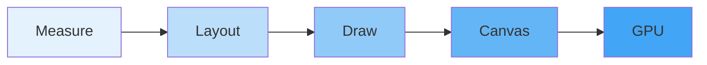
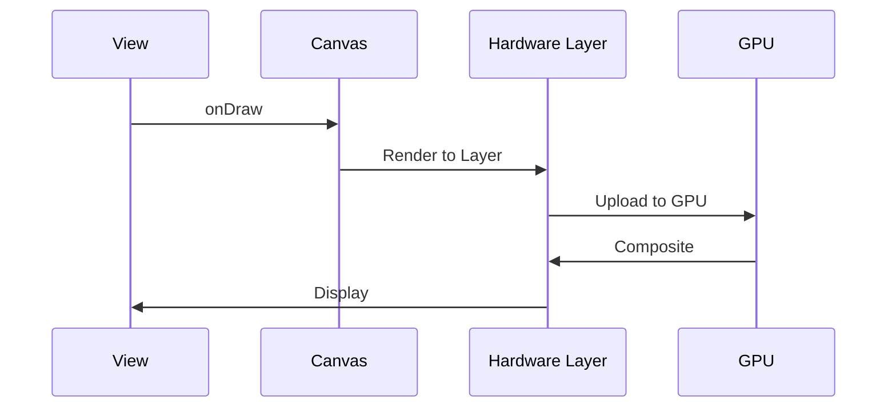

# Designing Custom Renderers

## Overview

Creating custom renderers allows you to build unique, performant UI components that aren't possible with standard Android views. This guide covers Canvas drawing, custom View and Compose implementations, hardware acceleration, performance optimization, and advanced rendering techniques for expert Android developers.

## Deep Explanation

### Canvas Drawing

Android's Canvas API provides low-level drawing capabilities:

```kotlin
class CustomView @JvmOverloads constructor(
    context: Context,
    attrs: AttributeSet? = null
) : View(context, attrs) {
    
    override fun onDraw(canvas: Canvas) {
        super.onDraw(canvas)
        
        val paint = Paint().apply {
            color = Color.BLUE
            style = Paint.Style.FILL
            isAntiAlias = true
        }
        
        canvas.drawCircle(width / 2f, height / 2f, 100f, paint)
    }
}
```

### Path Drawing

```kotlin
override fun onDraw(canvas: Canvas) {
    val path = Path().apply {
        moveTo(0f, height / 2f)
        lineTo(width / 2f, 0f)
        lineTo(width.toFloat(), height / 2f)
        close()
    }
    
    val paint = Paint().apply {
        color = Color.RED
        style = Paint.Style.FILL
    }
    
    canvas.drawPath(path, paint)
}
```

### Custom Compose Renderer

```kotlin
@Composable
fun CustomCanvas(
    modifier: Modifier = Modifier,
    onDraw: DrawScope.() -> Unit
) {
    Canvas(modifier = modifier) {
        onDraw()
    }
}

@Composable
fun CustomCircle(color: Color) {
    CustomCanvas(
        modifier = Modifier.size(200.dp)
    ) {
        drawCircle(
            color = color,
            radius = 100.dp.toPx()
        )
    }
}
```

## Diagrams

### Rendering Pipeline



### Hardware Acceleration



## Real Code Examples

### Advanced Custom View

```kotlin
class WaveformView @JvmOverloads constructor(
    context: Context,
    attrs: AttributeSet? = null
) : View(context, attrs) {
    
    private val waveformData = mutableListOf<Float>()
    private val paint = Paint().apply {
        color = Color.BLUE
        strokeWidth = 4f
        style = Paint.Style.STROKE
        isAntiAlias = true
    }
    
    private val path = Path()
    
    fun updateWaveform(data: List<Float>) {
        waveformData.clear()
        waveformData.addAll(data)
        invalidate()
    }
    
    override fun onDraw(canvas: Canvas) {
        super.onDraw(canvas)
        
        if (waveformData.isEmpty()) return
        
        path.reset()
        
        val centerY = height / 2f
        val barWidth = width.toFloat() / waveformData.size
        
        waveformData.forEachIndexed { index, amplitude ->
            val x = index * barWidth
            val barHeight = amplitude * centerY
            
            path.moveTo(x, centerY - barHeight)
            path.lineTo(x, centerY + barHeight)
        }
        
        canvas.drawPath(path, paint)
    }
    
    override fun onMeasure(widthMeasureSpec: Int, heightMeasureSpec: Int) {
        val minWidth = suggestedMinimumWidth + paddingLeft + paddingRight
        val minHeight = suggestedMinimumHeight + paddingTop + paddingBottom
        
        val width = resolveSize(minWidth, widthMeasureSpec)
        val height = resolveSize(minHeight, heightMeasureSpec)
        
        setMeasuredDimension(width, height)
    }
}
```

### Custom Compose Renderer with Animation

```kotlin
@Composable
fun AnimatedWaveform(
    data: List<Float>,
    modifier: Modifier = Modifier,
    color: Color = Color.Blue
) {
    val infiniteTransition = rememberInfiniteTransition()
    val phase by infiniteTransition.animateFloat(
        initialValue = 0f,
        targetValue = 2 * PI.toFloat(),
        animationSpec = infiniteRepeatable(
            animation = tween(1000, easing = LinearEasing)
        )
    )
    
    Canvas(modifier = modifier) {
        val centerY = size.height / 2
        val barWidth = size.width / data.size
        
        data.forEachIndexed { index, amplitude ->
            val x = index * barWidth
            val animatedAmplitude = amplitude * (0.5f + 0.5f * sin(phase + index * 0.1f))
            val barHeight = animatedAmplitude * centerY
            
            drawLine(
                color = color,
                start = Offset(x, centerY - barHeight),
                end = Offset(x, centerY + barHeight),
                strokeWidth = 4f
            )
        }
    }
}
```

### Hardware Accelerated Custom View

```kotlin
class ParticleView @JvmOverloads constructor(
    context: Context,
    attrs: AttributeSet? = null
) : View(context, attrs) {
    
    private val particles = mutableListOf<Particle>()
    private val paint = Paint().apply {
        isAntiAlias = true
    }
    
    private val animator = ValueAnimator.ofFloat(0f, 1f).apply {
        duration = 16 // ~60fps
        repeatCount = ValueAnimator.INFINITE
        addUpdateListener {
            updateParticles()
            invalidate()
        }
    }
    
    init {
        setLayerType(LAYER_TYPE_HARDWARE, null) // Enable hardware acceleration
    }
    
    fun startAnimation() {
        animator.start()
    }
    
    fun stopAnimation() {
        animator.cancel()
    }
    
    private fun updateParticles() {
        particles.forEach { particle ->
            particle.x += particle.vx
            particle.y += particle.vy
            particle.vy += 0.1f // Gravity
            
            // Bounce off walls
            if (particle.x < 0 || particle.x > width) {
                particle.vx *= -1
            }
            if (particle.y < 0 || particle.y > height) {
                particle.vy *= -1
            }
        }
    }
    
    override fun onDraw(canvas: Canvas) {
        super.onDraw(canvas)
        
        particles.forEach { particle ->
            paint.color = particle.color
            canvas.drawCircle(particle.x, particle.y, particle.radius, paint)
        }
    }
    
    data class Particle(
        var x: Float,
        var y: Float,
        var vx: Float,
        var vy: Float,
        val radius: Float,
        val color: Int
    )
}
```

## Hard Use-Case: Custom Chart Renderer

### Problem

You need to create a high-performance chart component that:
- Renders thousands of data points smoothly
- Supports zoom and pan
- Updates in real-time
- Works with hardware acceleration
- Handles touch interactions

### Solution

```kotlin
class ChartView @JvmOverloads constructor(
    context: Context,
    attrs: AttributeSet? = null
) : View(context, attrs) {
    
    private val dataPoints = mutableListOf<DataPoint>()
    private var viewport = Viewport(0f, 100f, 0f, 100f)
    
    private val gridPaint = Paint().apply {
        color = Color.GRAY
        strokeWidth = 1f
        pathEffect = DashPathEffect(floatArrayOf(5f, 5f), 0f)
    }
    
    private val linePaint = Paint().apply {
        color = Color.BLUE
        strokeWidth = 3f
        style = Paint.Style.STROKE
        isAntiAlias = true
    }
    
    private val path = Path()
    private val gridPath = Path()
    
    private var scaleGestureDetector: ScaleGestureDetector? = null
    private var lastTouchX = 0f
    private var lastTouchY = 0f
    
    init {
        setLayerType(LAYER_TYPE_HARDWARE, null)
        
        scaleGestureDetector = ScaleGestureDetector(context, object : ScaleGestureDetector.SimpleOnScaleGestureListener() {
            override fun onScale(detector: ScaleGestureDetector): Boolean {
                val scaleFactor = detector.scaleFactor
                val focusX = detector.focusX
                val focusY = detector.focusY
                
                // Zoom around focus point
                val newWidth = viewport.width / scaleFactor
                val newHeight = viewport.height / scaleFactor
                
                val focusDataX = viewport.left + (focusX / width) * viewport.width
                val focusDataY = viewport.top - (focusY / height) * viewport.height
                
                viewport = Viewport(
                    left = focusDataX - (focusX / width) * newWidth,
                    right = focusDataX + ((width - focusX) / width) * newWidth,
                    top = focusDataY + (focusY / height) * newHeight,
                    bottom = focusDataY - ((height - focusY) / height) * newHeight
                )
                
                invalidate()
                return true
            }
        })
    }
    
    fun setData(points: List<DataPoint>) {
        dataPoints.clear()
        dataPoints.addAll(points)
        
        // Auto-fit viewport
        if (points.isNotEmpty()) {
            val minX = points.minOf { it.x }
            val maxX = points.maxOf { it.x }
            val minY = points.minOf { it.y }
            val maxY = points.maxOf { it.y }
            
            val paddingX = (maxX - minX) * 0.1f
            val paddingY = (maxY - minY) * 0.1f
            
            viewport = Viewport(
                left = minX - paddingX,
                right = maxX + paddingX,
                top = maxY + paddingY,
                bottom = minY - paddingY
            )
        }
        
        invalidate()
    }
    
    override fun onTouchEvent(event: MotionEvent): Boolean {
        scaleGestureDetector?.onTouchEvent(event)
        
        when (event.action) {
            MotionEvent.ACTION_DOWN -> {
                lastTouchX = event.x
                lastTouchY = event.y
            }
            MotionEvent.ACTION_MOVE -> {
                if (!scaleGestureDetector!!.isInProgress) {
                    val dx = event.x - lastTouchX
                    val dy = event.y - lastTouchY
                    
                    // Pan
                    val dataDx = (dx / width) * viewport.width
                    val dataDy = (dy / height) * viewport.height
                    
                    viewport = viewport.copy(
                        left = viewport.left - dataDx,
                        right = viewport.right - dataDx,
                        top = viewport.top + dataDy,
                        bottom = viewport.bottom + dataDy
                    )
                    
                    invalidate()
                }
                
                lastTouchX = event.x
                lastTouchY = event.y
            }
        }
        
        return true
    }
    
    override fun onDraw(canvas: Canvas) {
        super.onDraw(canvas)
        
        if (dataPoints.isEmpty()) return
        
        // Draw grid
        drawGrid(canvas)
        
        // Draw line
        path.reset()
        var first = true
        
        dataPoints.forEach { point ->
            val x = ((point.x - viewport.left) / viewport.width) * width
            val y = height - ((point.y - viewport.bottom) / viewport.height) * height
            
            if (first) {
                path.moveTo(x, y)
                first = false
            } else {
                path.lineTo(x, y)
            }
        }
        
        canvas.drawPath(path, linePaint)
    }
    
    private fun drawGrid(canvas: Canvas) {
        val gridLines = 10
        val stepX = viewport.width / gridLines
        val stepY = viewport.height / gridLines
        
        gridPath.reset()
        
        // Vertical lines
        for (i in 0..gridLines) {
            val dataX = viewport.left + i * stepX
            val screenX = ((dataX - viewport.left) / viewport.width) * width
            gridPath.moveTo(screenX, 0f)
            gridPath.lineTo(screenX, height.toFloat())
        }
        
        // Horizontal lines
        for (i in 0..gridLines) {
            val dataY = viewport.bottom + i * stepY
            val screenY = height - ((dataY - viewport.bottom) / viewport.height) * height
            gridPath.moveTo(0f, screenY)
            gridPath.lineTo(width.toFloat(), screenY)
        }
        
        canvas.drawPath(gridPath, gridPaint)
    }
    
    data class DataPoint(val x: Float, val y: Float)
    data class Viewport(val left: Float, val right: Float, val top: Float, val bottom: Float) {
        val width = right - left
        val height = top - bottom
    }
}
```

## Edge Cases and Pitfalls

### 1. Performance Issues

**Problem**: Slow rendering with many objects

```kotlin
// BAD: Creating objects in onDraw
override fun onDraw(canvas: Canvas) {
    val paint = Paint() // Created every frame!
    canvas.drawCircle(0f, 0f, 100f, paint)
}

// GOOD: Reuse objects
class CustomView : View {
    private val paint = Paint() // Created once
    
    override fun onDraw(canvas: Canvas) {
        canvas.drawCircle(0f, 0f, 100f, paint)
    }
}
```

### 2. Memory Leaks

**Problem**: Holding references in custom views

```kotlin
// BAD: Holding Activity reference
class CustomView : View {
    private var activity: Activity? = null
}

// GOOD: Use WeakReference or callbacks
class CustomView : View {
    private var callback: ViewCallback? = null
    
    override fun onDetachedFromWindow() {
        super.onDetachedFromWindow()
        callback = null
    }
}
```

### 3. Hardware Acceleration Issues

**Problem**: Some operations not supported with hardware acceleration

```kotlin
// Some Canvas operations require software rendering
override fun onDraw(canvas: Canvas) {
    if (needsSoftwareRendering()) {
        setLayerType(LAYER_TYPE_SOFTWARE, null)
    } else {
        setLayerType(LAYER_TYPE_HARDWARE, null)
    }
    // Draw
}
```

## References and Further Reading

- [Custom Views](https://developer.android.com/develop/ui/views/custom-views)
- [Canvas and Drawables](https://developer.android.com/guide/topics/graphics/2d-graphics)
- [Hardware Acceleration](https://developer.android.com/guide/topics/graphics/hardware-accel)
- [Compose Graphics](https://developer.android.com/jetpack/compose/graphics)

## Quiz

### Question 1
What is the main advantage of hardware acceleration for custom views?

**A)** Smaller code size  
**B)** Better performance through GPU rendering  
**C)** Easier to implement  
**D)** More features

**Answer: B** - Hardware acceleration uses the GPU for rendering, providing better performance for complex graphics.

### Question 2
When should you create Paint objects in custom views?

**A)** In onDraw()  
**B)** As class properties, created once  
**C)** In onMeasure()  
**D)** In constructor only

**Answer: B** - Paint objects should be created as class properties to avoid creating new objects on every frame, which causes performance issues.

### Question 3
What is the purpose of setLayerType()?

**A)** To set view size  
**B)** To enable/disable hardware acceleration  
**C)** To set colors  
**D)** To enable animations

**Answer: B** - `setLayerType()` controls whether the view uses hardware or software rendering.

### Question 4
What should you do in onDetachedFromWindow()?

**A)** Nothing  
**B)** Start animations  
**C)** Clean up resources and cancel operations  
**D)** Initialize views

**Answer: C** - `onDetachedFromWindow()` is called when the view is removed, so you should clean up resources and cancel any ongoing operations to prevent memory leaks.

### Question 5
What is the best approach for rendering many objects in a custom view?

**A)** Create new Paint for each object  
**B)** Reuse Paint objects and batch drawing operations  
**C)** Use multiple Canvas instances  
**D)** Draw in separate threads

**Answer: B** - Reusing Paint objects and batching drawing operations is the most efficient approach for rendering many objects.

## Related Topics

- [Performance Profiling & Memory Leaks](../03_advanced/21.%20Performance%20Profiling%20%26%20Memory%20Leaks.md) - Optimizing renderers
- [Jetpack Compose State Management](../02_intermediate/10.%20Jetpack%20Compose%20State%20Management.md) - Compose rendering
- [Build Systems & Advanced Gradle](./31.%20Build%20Systems%20%26%20Advanced%20Gradle.md) - Optimizing builds for custom views

