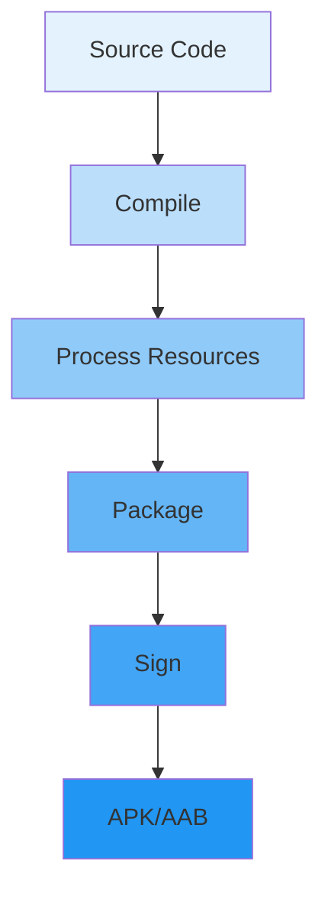
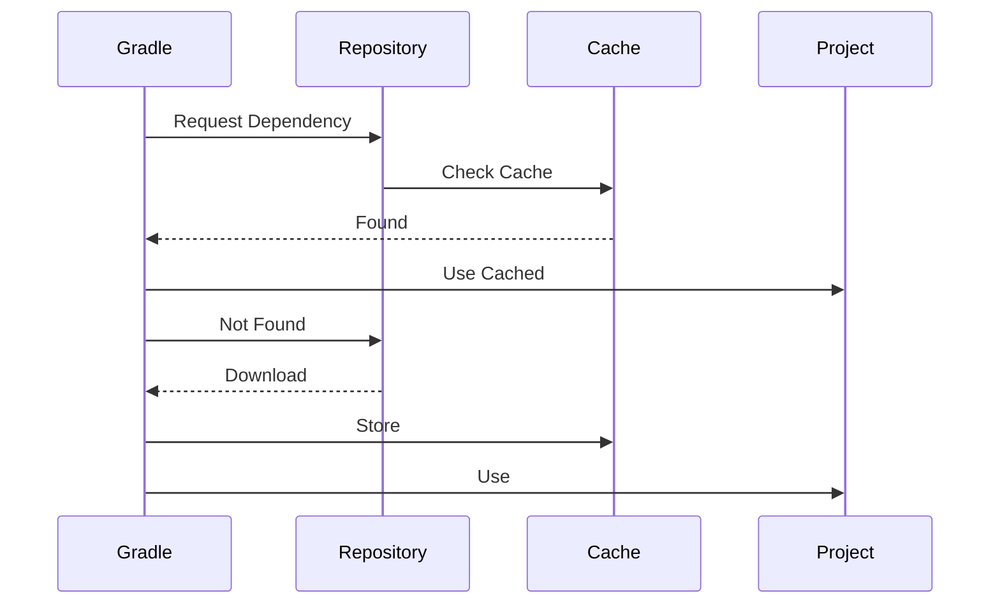

# Build Systems & Advanced Gradle

## Overview

Mastering Gradle is essential for building efficient, maintainable Android projects. This guide covers advanced Gradle configurations, build optimization, custom tasks, build variants, dependency management, and CI/CD integration for expert Android developers.

## Deep Explanation

### Gradle Basics

Gradle is Android's build system. Key concepts:

- **Build Files**: `build.gradle` (project and module level)
- **Tasks**: Units of work (compile, test, assemble)
- **Plugins**: Extend functionality
- **Dependencies**: External libraries

### Build Configuration

```kotlin
// build.gradle.kts (Kotlin DSL)
plugins {
    id("com.android.application")
    id("org.jetbrains.kotlin.android")
}

android {
    namespace = "com.example.app"
    compileSdk = 34
    
    defaultConfig {
        applicationId = "com.example.app"
        minSdk = 24
        targetSdk = 34
        versionCode = 1
        versionName = "1.0"
    }
    
    buildTypes {
        getByName("release") {
            isMinifyEnabled = true
            proguardFiles(
                getDefaultProguardFile("proguard-android-optimize.txt"),
                "proguard-rules.pro"
            )
        }
    }
}

dependencies {
    implementation("androidx.core:core-ktx:1.12.0")
    testImplementation("junit:junit:4.13.2")
}
```

### Build Variants

```kotlin
android {
    flavorDimensions += "environment"
    
    productFlavors {
        create("dev") {
            dimension = "environment"
            applicationIdSuffix = ".dev"
            versionNameSuffix = "-dev"
            buildConfigField("String", "API_URL", "\"https://dev.api.com\"")
        }
        
        create("staging") {
            dimension = "environment"
            applicationIdSuffix = ".staging"
            versionNameSuffix = "-staging"
            buildConfigField("String", "API_URL", "\"https://staging.api.com\"")
        }
        
        create("production") {
            dimension = "environment"
            buildConfigField("String", "API_URL", "\"https://api.com\"")
        }
    }
}
```

## Diagrams

### Gradle Build Process



### Dependency Resolution



## Real Code Examples

### Advanced Build Configuration

```kotlin
// build.gradle.kts
plugins {
    id("com.android.application")
    id("org.jetbrains.kotlin.android")
    id("kotlin-kapt")
    id("dagger.hilt.android.plugin")
}

android {
    compileSdk = 34
    
    defaultConfig {
        applicationId = "com.example.app"
        minSdk = 24
        targetSdk = 34
        versionCode = getVersionCode()
        versionName = getVersionName()
        
        testInstrumentationRunner = "androidx.test.runner.AndroidJUnitRunner"
    }
    
    buildTypes {
        getByName("debug") {
            isDebuggable = true
            applicationIdSuffix = ".debug"
            versionNameSuffix = "-debug"
        }
        
        getByName("release") {
            isMinifyEnabled = true
            isShrinkResources = true
            proguardFiles(
                getDefaultProguardFile("proguard-android-optimize.txt"),
                "proguard-rules.pro"
            )
        }
    }
    
    compileOptions {
        sourceCompatibility = JavaVersion.VERSION_17
        targetCompatibility = JavaVersion.VERSION_17
    }
    
    kotlinOptions {
        jvmTarget = "17"
    }
    
    buildFeatures {
        compose = true
        buildConfig = true
    }
    
    composeOptions {
        kotlinCompilerExtensionVersion = "1.5.4"
    }
    
    packaging {
        resources {
            excludes += "/META-INF/{AL2.0,LGPL2.1}"
        }
    }
}

dependencies {
    // Core
    implementation("androidx.core:core-ktx:1.12.0")
    implementation("androidx.lifecycle:lifecycle-runtime-ktx:2.6.2")
    
    // Compose
    implementation(platform("androidx.compose:compose-bom:2023.10.01"))
    implementation("androidx.compose.ui:ui")
    implementation("androidx.compose.ui:ui-graphics")
    implementation("androidx.compose.ui:ui-tooling-preview")
    implementation("androidx.compose.material3:material3")
    
    // Hilt
    implementation("com.google.dagger:hilt-android:2.48")
    kapt("com.google.dagger:hilt-compiler:2.48")
    
    // Testing
    testImplementation("junit:junit:4.13.2")
    androidTestImplementation("androidx.test.ext:junit:1.1.5")
    androidTestImplementation("androidx.compose.ui:ui-test-junit4")
}

// Custom functions
fun getVersionCode(): Int {
    return System.getenv("VERSION_CODE")?.toInt() ?: 1
}

fun getVersionName(): String {
    return System.getenv("VERSION_NAME") ?: "1.0.0"
}
```

### Custom Gradle Tasks

```kotlin
// build.gradle.kts
tasks.register("generateVersionFile") {
    doLast {
        val versionFile = File("$projectDir/src/main/assets/version.txt")
        versionFile.parentFile.mkdirs()
        versionFile.writeText("${project.version}")
    }
}

tasks.named("preBuild") {
    dependsOn("generateVersionFile")
}

tasks.register("cleanBuild") {
    dependsOn("clean", "build")
    description = "Cleans and builds the project"
}

tasks.register("analyzeCode") {
    dependsOn("lint", "ktlintCheck", "detekt")
    description = "Runs all code analysis tasks"
}
```

### Build Optimization

```kotlin
// gradle.properties
org.gradle.jvmargs=-Xmx4096m -XX:MaxMetaspaceSize=512m
org.gradle.parallel=true
org.gradle.caching=true
org.gradle.configureondemand=true
android.useAndroidX=true
android.enableJetifier=true

// build.gradle.kts
android {
    // Enable build cache
    buildCache {
        isEnabled = true
    }
    
    // Enable incremental compilation
    compileOptions {
        incremental = true
    }
}

// Optimize dependency resolution
configurations.all {
    resolutionStrategy {
        cacheChangingModulesFor(0, TimeUnit.SECONDS)
        cacheDynamicVersionsFor(10, TimeUnit.MINUTES)
    }
}
```

## Hard Use-Case: Multi-Module Project Setup

### Problem

You need to:
- Organize a large project into modules
- Share code between modules
- Manage dependencies efficiently
- Build modules independently
- Handle version conflicts

### Solution

```kotlin
// settings.gradle.kts
pluginManagement {
    repositories {
        google()
        mavenCentral()
        gradlePluginPortal()
    }
}

dependencyResolutionManagement {
    repositoriesMode.set(RepositoriesMode.FAIL_ON_PROJECT_REPOS)
    repositories {
        google()
        mavenCentral()
    }
}

rootProject.name = "MyApp"
include(":app")
include(":core:common")
include(":core:data")
include(":core:domain")
include(":core:ui")
include(":feature:auth")
include(":feature:home")

// build.gradle.kts (project level)
buildscript {
    extra["kotlinVersion"] = "1.9.20"
    extra["composeVersion"] = "1.5.4"
    extra["hiltVersion"] = "2.48"
}

// core/common/build.gradle.kts
plugins {
    id("com.android.library")
    id("org.jetbrains.kotlin.android")
}

android {
    namespace = "com.example.core.common"
    compileSdk = 34
}

dependencies {
    // Common dependencies
}

// core/data/build.gradle.kts
plugins {
    id("com.android.library")
    id("org.jetbrains.kotlin.android")
}

dependencies {
    implementation(project(":core:common"))
    // Data-specific dependencies
}

// feature/auth/build.gradle.kts
plugins {
    id("com.android.library")
    id("org.jetbrains.kotlin.android")
}

dependencies {
    implementation(project(":core:common"))
    implementation(project(":core:data"))
    implementation(project(":core:ui"))
    // Feature-specific dependencies
}

// app/build.gradle.kts
plugins {
    id("com.android.application")
    id("org.jetbrains.kotlin.android")
}

dependencies {
    implementation(project(":core:common"))
    implementation(project(":core:data"))
    implementation(project(":core:domain"))
    implementation(project(":core:ui"))
    implementation(project(":feature:auth"))
    implementation(project(":feature:home"))
}
```

### Version Catalog (Gradle 7+)

```kotlin
// gradle/libs.versions.toml
[versions]
kotlin = "1.9.20"
compose = "1.5.4"
hilt = "2.48"

[libraries]
kotlin-stdlib = { module = "org.jetbrains.kotlin:kotlin-stdlib", version.ref = "kotlin" }
compose-ui = { module = "androidx.compose.ui:ui", version.ref = "compose" }
hilt-android = { module = "com.google.dagger:hilt-android", version.ref = "hilt" }

[plugins]
kotlin = { id = "org.jetbrains.kotlin.android", version.ref = "kotlin" }
hilt = { id = "com.google.dagger.hilt.android", version.ref = "hilt" }

// build.gradle.kts
plugins {
    alias(libs.plugins.kotlin)
    alias(libs.plugins.hilt)
}

dependencies {
    implementation(libs.kotlin.stdlib)
    implementation(libs.compose.ui)
    implementation(libs.hilt.android)
}
```

## Edge Cases and Pitfalls

### 1. Dependency Conflicts

**Problem**: Multiple versions of same library

```kotlin
// BAD: Version conflicts
dependencies {
    implementation("com.squareup.retrofit2:retrofit:2.9.0")
    implementation("com.squareup.retrofit2:retrofit:2.8.0") // Conflict!
}

// GOOD: Use dependency resolution
configurations.all {
    resolutionStrategy {
        force("com.squareup.retrofit2:retrofit:2.9.0")
    }
}
```

### 2. Build Performance

**Problem**: Slow builds

```kotlin
// Enable build cache and parallel execution
// gradle.properties
org.gradle.parallel=true
org.gradle.caching=true
org.gradle.configureondemand=true

// Use build cache
android {
    buildCache {
        isEnabled = true
    }
}
```

### 3. ProGuard Issues

**Problem**: Code removed by ProGuard

```kotlin
// proguard-rules.pro
-keep class com.example.model.** { *; }
-keepclassmembers class * {
    @com.google.gson.annotations.SerializedName <fields>;
}

# Keep data classes
-keep class com.example.data.** { *; }
```

## References and Further Reading

- [Gradle User Guide](https://docs.gradle.org/)
- [Android Build Configuration](https://developer.android.com/studio/build)
- [Gradle Performance](https://docs.gradle.org/current/userguide/performance.html)
- [Version Catalogs](https://docs.gradle.org/current/userguide/platforms.html)

## Quiz

### Question 1
What is the purpose of build variants in Android?

**A)** To organize code  
**B)** To create different versions of the app (dev, staging, production)  
**C)** To improve performance  
**D)** To reduce APK size

**Answer: B** - Build variants allow you to create different versions of your app with different configurations, such as different API endpoints or application IDs.

### Question 2
What is the benefit of using a version catalog?

**A)** Faster builds  
**B)** Centralized dependency version management  
**C)** Smaller APK  
**D)** Better performance

**Answer: B** - Version catalogs provide centralized management of dependency versions, making it easier to maintain consistency across modules.

### Question 3
What does `org.gradle.parallel=true` do?

**A)** Enables parallel project execution  
**B)** Enables parallel task execution  
**C)** Both A and B  
**D)** Nothing

**Answer: C** - This setting enables both parallel project and task execution, significantly speeding up builds for multi-module projects.

### Question 4
What is the purpose of ProGuard?

**A)** To compile code  
**B)** To obfuscate and shrink code  
**C)** To test code  
**D)** To deploy code

**Answer: B** - ProGuard obfuscates code (makes it harder to reverse engineer) and removes unused code to reduce APK size.

### Question 5
What should you do to optimize build performance?

**A)** Disable build cache  
**B)** Enable build cache and parallel execution  
**C)** Use only one module  
**D)** Disable incremental compilation

**Answer: B** - Enabling build cache and parallel execution are key optimizations for build performance.

## Related Topics

- [Introduction to Android Architecture](../01_beginners/01.%20Introduction%20to%20Android%20Architecture.md) - Module architecture
- [Large Scale App Architecture Case Study](./32.%20Large%20Scale%20App%20Architecture%20Case%20Study.md) - Build systems at scale
- [Performance Profiling & Memory Leaks](../03_advanced/21.%20Performance%20Profiling%20%26%20Memory%20Leaks.md) - Build optimization impact

