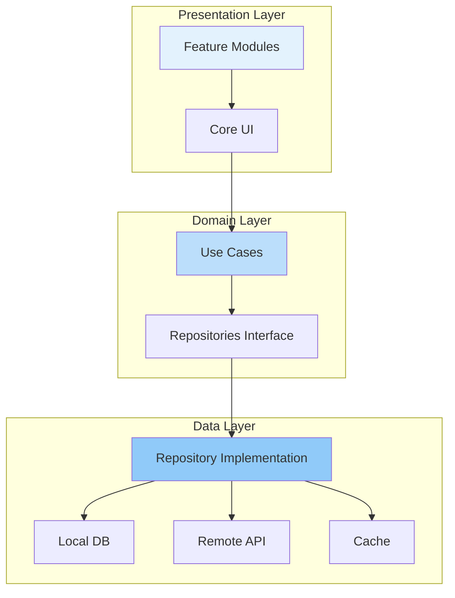
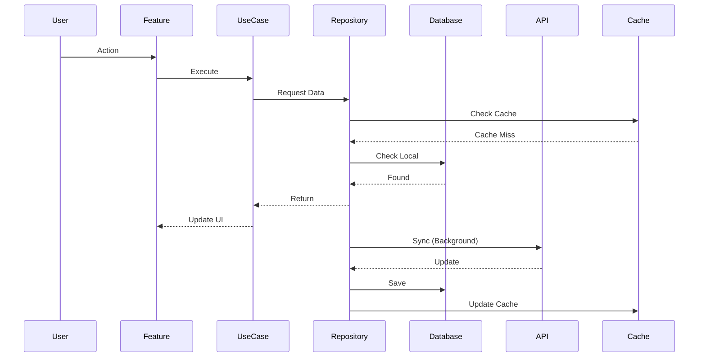

# Large Scale App Architecture Case Study

## Overview

This comprehensive case study examines the architecture of a large-scale Android application serving millions of users. We'll explore real-world challenges, architectural decisions, scalability patterns, team collaboration strategies, and lessons learned from building enterprise-grade Android applications.

## Deep Explanation

### Architecture Overview

Large-scale apps require:
- **Modular Architecture**: Independent, testable modules
- **Scalable Data Layer**: Efficient data management
- **Robust Error Handling**: Graceful failure handling
- **Performance Optimization**: Fast, responsive UI
- **Team Scalability**: Multiple teams working independently

### Modular Architecture

```
app/
├── core/
│   ├── common/       # Shared utilities
│   ├── data/         # Data layer
│   ├── domain/       # Business logic
│   └── ui/           # UI components
├── feature/
│   ├── auth/         # Authentication
│   ├── home/         # Home screen
│   ├── profile/      # User profile
│   └── settings/     # Settings
└── app/              # Application module
```

## Diagrams

### Large Scale Architecture



### Data Flow



## Real Code Examples

### Complete Modular Setup

```kotlin
// core/domain/src/main/java/com/example/core/domain/repository/UserRepository.kt
interface UserRepository {
    suspend fun getUser(id: String): Result<User>
    suspend fun getUsers(): Flow<List<User>>
    suspend fun updateUser(user: User): Result<Unit>
}

// core/data/src/main/java/com/example/core/data/repository/UserRepositoryImpl.kt
class UserRepositoryImpl(
    private val localDataSource: UserLocalDataSource,
    private val remoteDataSource: UserRemoteDataSource,
    private val networkMonitor: NetworkMonitor
) : UserRepository {
    
    override suspend fun getUser(id: String): Result<User> {
        return try {
            // Try local first
            val localUser = localDataSource.getUser(id)
            if (localUser != null) {
                // Sync in background if online
                if (networkMonitor.isOnline()) {
                    syncUser(id)
                }
                Result.success(localUser)
            } else {
                // Fetch from remote if not local
                if (networkMonitor.isOnline()) {
                    val remoteUser = remoteDataSource.getUser(id)
                    localDataSource.saveUser(remoteUser)
                    Result.success(remoteUser)
                } else {
                    Result.failure(Exception("No network and no local data"))
                }
            }
        } catch (e: Exception) {
            Result.failure(e)
        }
    }
    
    override fun getUsers(): Flow<List<User>> {
        return localDataSource.getUsers()
            .map { users ->
                if (networkMonitor.isOnline()) {
                    syncUsers()
                }
                users
            }
    }
    
    private suspend fun syncUser(id: String) {
        try {
            val remoteUser = remoteDataSource.getUser(id)
            localDataSource.saveUser(remoteUser)
        } catch (e: Exception) {
            // Log but don't fail
        }
    }
    
    private suspend fun syncUsers() {
        // Background sync
    }
}

// feature/auth/src/main/java/com/example/feature/auth/AuthViewModel.kt
class AuthViewModel(
    private val authUseCase: AuthUseCase
) : ViewModel() {
    private val _uiState = MutableStateFlow<AuthUiState>(AuthUiState.Idle)
    val uiState: StateFlow<AuthUiState> = _uiState.asStateFlow()
    
    fun login(email: String, password: String) {
        viewModelScope.launch {
            _uiState.value = AuthUiState.Loading
            when (val result = authUseCase.login(email, password)) {
                is Result.Success -> {
                    _uiState.value = AuthUiState.Success(result.data)
                }
                is Result.Failure -> {
                    _uiState.value = AuthUiState.Error(result.exception.message ?: "Unknown error")
                }
            }
        }
    }
}

// core/domain/src/main/java/com/example/core/domain/usecase/AuthUseCase.kt
class AuthUseCase(
    private val authRepository: AuthRepository,
    private val userRepository: UserRepository
) {
    suspend operator fun invoke(email: String, password: String): Result<AuthResult> {
        return try {
            val authResult = authRepository.login(email, password)
            userRepository.updateUser(authResult.user)
            Result.Success(authResult)
        } catch (e: Exception) {
            Result.Failure(e)
        }
    }
}
```

## Hard Use-Case: Multi-Team Collaboration

### Problem

You have:
- 5+ teams working on different features
- Shared components and utilities
- Need for independent development
- Version conflicts
- Integration challenges

### Solution

```kotlin
// 1. Define clear module boundaries
// core/common - No feature dependencies
// core/data - Depends only on core/common
// core/domain - Depends only on core/common
// feature/* - Can depend on core/* but not other features

// 2. Use interfaces for communication
// feature/auth defines:
interface AuthResult {
    val userId: String
    val token: String
}

// Other features depend on interface, not implementation

// 3. Event bus for feature communication
sealed class AppEvent {
    data class UserLoggedIn(val userId: String) : AppEvent()
    data class UserLoggedOut : AppEvent()
    data class DataUpdated(val type: String) : AppEvent()
}

class EventBus {
    private val subscribers = mutableMapOf<Class<*>, MutableList<(Any) -> Unit>>()
    
    fun <T : AppEvent> subscribe(eventClass: Class<T>, handler: (T) -> Unit) {
        subscribers.getOrPut(eventClass) { mutableListOf() }
            .add { handler(it as T) }
    }
    
    fun publish(event: AppEvent) {
        subscribers[event::class.java]?.forEach { it(event) }
    }
}

// 4. Version management
// gradle/libs.versions.toml
[versions]
coreCommon = "1.0.0"
coreData = "1.0.0"
coreDomain = "1.0.0"

[libraries]
core-common = { module = "com.example:core-common", version.ref = "coreCommon" }
core-data = { module = "com.example:core-data", version.ref = "coreData" }
core-domain = { module = "com.example:core-domain", version.ref = "coreDomain" }

// 5. API contracts
// core/data defines API interfaces
interface ApiService {
    @GET("users/{id}")
    suspend fun getUser(@Path("id") id: String): UserDto
}

// Features use repository, not API directly

// 6. Testing strategy
// Each module has its own tests
// Integration tests in app module
// Mock interfaces for testing
```

### Dependency Injection Setup

```kotlin
// core/di/src/main/java/com/example/core/di/CoreModule.kt
@Module
@InstallIn(SingletonComponent::class)
object CoreModule {
    @Provides
    @Singleton
    fun provideDatabase(@ApplicationContext context: Context): AppDatabase {
        return Room.databaseBuilder(
            context,
            AppDatabase::class.java,
            "app_database"
        ).build()
    }
    
    @Provides
    @Singleton
    fun provideNetworkMonitor(@ApplicationContext context: Context): NetworkMonitor {
        return NetworkMonitor(context)
    }
}

// feature/auth/di/src/main/java/com/example/feature/auth/di/AuthModule.kt
@Module
@InstallIn(ViewModelComponent::class)
object AuthModule {
    @Provides
    fun provideAuthRepository(
        apiService: ApiService,
        userDao: UserDao
    ): AuthRepository {
        return AuthRepositoryImpl(apiService, userDao)
    }
}
```

## Edge Cases and Pitfalls

### 1. Circular Dependencies

**Problem**: Modules depending on each other

```kotlin
// BAD: Circular dependency
// feature/auth depends on feature/profile
// feature/profile depends on feature/auth

// GOOD: Extract shared to core
// feature/auth and feature/profile both depend on core/common
```

### 2. Version Conflicts

**Problem**: Different modules using different library versions

```kotlin
// Solution: Use version catalog and force resolution
configurations.all {
    resolutionStrategy {
        force("com.squareup.retrofit2:retrofit:2.9.0")
    }
}
```

### 3. Build Performance

**Problem**: Slow builds with many modules

```kotlin
// Solution: Enable build cache, parallel execution
// gradle.properties
org.gradle.parallel=true
org.gradle.caching=true
org.gradle.configureondemand=true
```

## References and Further Reading

- [Android Architecture Guide](https://developer.android.com/topic/architecture)
- [Modularization](https://developer.android.com/topic/modularization)
- [Large Scale Android Apps](https://developer.android.com/topic/architecture/large-scale-apps)
- [Clean Architecture](https://blog.cleancoder.com/uncle-bob/2012/08/13/the-clean-architecture.html)

## Quiz

### Question 1
What is the main benefit of modular architecture in large-scale apps?

**A)** Smaller APK  
**B)** Independent team development and better testability  
**C)** Faster builds  
**D)** Less code

**Answer: B** - Modular architecture allows teams to work independently on different modules and makes each module easier to test in isolation.

### Question 2
How should features communicate in a modular architecture?

**A)** Direct dependencies  
**B)** Through interfaces and events  
**C)** Shared global state  
**D)** Direct method calls

**Answer: B** - Features should communicate through well-defined interfaces and events to maintain loose coupling.

### Question 3
What should be the single source of truth for data in a large-scale app?

**A)** Remote API  
**B)** Local database  
**C)** ViewModel  
**D)** SharedPreferences

**Answer: B** - The local database should be the single source of truth, with the UI always reading from it and syncing with the server in the background.

### Question 4
How do you prevent circular dependencies between modules?

**A)** Use only one module  
**B)** Extract shared code to core modules  
**C)** Use global variables  
**D)** Don't use modules

**Answer: B** - Extracting shared code to core modules (like core/common) prevents circular dependencies by ensuring modules only depend on core, not each other.

### Question 5
What is the recommended approach for dependency injection in multi-module projects?

**A)** Manual dependency passing  
**B)** Dagger Hilt with module-specific components  
**C)** No dependency injection  
**D)** Singleton pattern only

**Answer: B** - Using Dagger Hilt with module-specific components (like ViewModelComponent) allows for proper scoping and testability in multi-module projects.

## Related Topics

- [Introduction to Android Architecture](../01_beginners/01.%20Introduction%20to%20Android%20Architecture.md) - Foundation
- [Building Offline-First Apps](../03_advanced/22.%20Building%20Offline-First%20Apps.md) - Data layer
- [Build Systems & Advanced Gradle](./31.%20Build%20Systems%20%26%20Advanced%20Gradle.md) - Build configuration

