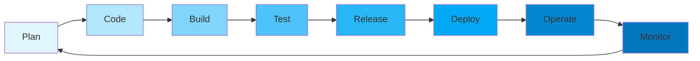
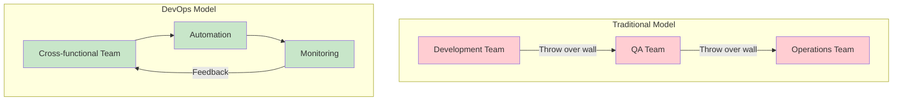
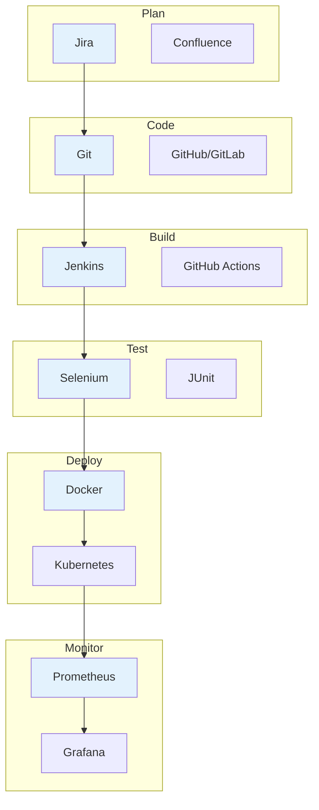

# Introduction to DevOps

## Overview

DevOps is a cultural and technical movement that bridges the gap between software development and IT operations. It emphasizes collaboration, automation, continuous integration, continuous delivery, and monitoring to enable faster, more reliable software releases. This guide introduces you to the core concepts, principles, and practices that define DevOps, from its cultural foundations to the technical tools and methodologies that make it possible.

## Deep Explanation

### What is DevOps?

DevOps is a combination of **Development** and **Operations**, representing a cultural shift that brings together software developers and IT operations teams. The term was coined around 2009 and has evolved into a comprehensive approach to software delivery that emphasizes:

- **Collaboration**: Breaking down silos between teams
- **Automation**: Automating repetitive tasks and processes
- **Continuous Integration**: Integrating code changes frequently
- **Continuous Delivery**: Delivering software reliably and frequently
- **Monitoring**: Observing systems in production
- **Feedback Loops**: Learning from production and improving

### The Problem DevOps Solves

#### Traditional Waterfall Model

In traditional software development:

```
Development → QA → Operations
     ↓           ↓         ↓
   Months    Weeks    Days
```

**Problems**:
- Long release cycles (months or years)
- Manual handoffs between teams
- "It works on my machine" syndrome
- Blame culture when things break
- Slow feedback loops
- Difficult to rollback changes

#### DevOps Approach

```
Development ←→ Operations
     ↓              ↓
   Hours/Days   Continuous
```

**Benefits**:
- Faster time to market
- Higher quality software
- Better collaboration
- Faster recovery from failures
- Continuous improvement

### Core DevOps Principles

#### 1. Culture of Collaboration

**Before DevOps**:
- Developers write code, throw it over the wall
- Operations deploys code, blames developers when it breaks
- Separate goals and incentives

**With DevOps**:
- Shared responsibility for the entire software lifecycle
- Cross-functional teams
- Shared goals and metrics
- Open communication

#### 2. Automation

Automate everything that can be automated:

- **Build Automation**: Compile and package code automatically
- **Test Automation**: Run tests automatically on every change
- **Deployment Automation**: Deploy to environments automatically
- **Infrastructure Automation**: Provision and configure infrastructure automatically
- **Monitoring Automation**: Alert on issues automatically

**Example**: Instead of manually deploying:
```bash
# Manual (error-prone)
ssh server
cd /var/www
git pull
npm install
pm2 restart app
```

```yaml
# Automated (reliable)
# .github/workflows/deploy.yml
- name: Deploy
  run: |
    ssh server "cd /var/www && git pull && npm install && pm2 restart app"
```

#### 3. Continuous Integration (CI)

**Definition**: Automatically integrating code changes from multiple developers into a shared repository multiple times per day.

**Process**:
1. Developer commits code
2. CI system automatically:
   - Builds the application
   - Runs tests
   - Checks code quality
   - Reports results

**Benefits**:
- Catch bugs early
- Reduce integration problems
- Faster feedback
- Higher code quality

**Example CI Pipeline**:
```yaml
# .github/workflows/ci.yml
name: CI
on: [push, pull_request]
jobs:
  test:
    runs-on: ubuntu-latest
    steps:
      - uses: actions/checkout@v2
      - name: Install dependencies
        run: npm install
      - name: Run tests
        run: npm test
      - name: Lint code
        run: npm run lint
```

#### 4. Continuous Delivery (CD)

**Definition**: Automatically preparing code changes for release to production.

**Process**:
1. Code passes CI
2. Automatically deploy to staging
3. Run integration tests
4. Deploy to production (manual approval or automatic)

**Benefits**:
- Release anytime
- Lower risk releases
- Faster time to market
- Consistent deployments

#### 5. Monitoring and Logging

**Why Monitor?**
- Know when things break
- Understand system behavior
- Make data-driven decisions
- Improve over time

**What to Monitor**:
- **Metrics**: CPU, memory, disk, network
- **Logs**: Application logs, error logs
- **Traces**: Request flows through services
- **Alerts**: Notifications when thresholds are exceeded

**Example Monitoring Stack**:
```
Application → Prometheus (metrics) → Grafana (visualization)
          → ELK Stack (logs) → Kibana (search)
          → Jaeger (tracing)
```

### DevOps Practices

#### 1. Infrastructure as Code (IaC)

**Definition**: Managing infrastructure using code and version control.

**Benefits**:
- Reproducible infrastructure
- Version controlled
- Reviewable changes
- Testable infrastructure

**Tools**:
- **Terraform**: Multi-cloud IaC
- **CloudFormation**: AWS-specific
- **Ansible**: Configuration management
- **Pulumi**: IaC using programming languages

**Example**:
```hcl
# infrastructure.tf
resource "aws_instance" "web" {
  ami           = "ami-0c55b159cbfafe1f0"
  instance_type = "t2.micro"
  
  tags = {
    Name = "WebServer"
  }
}
```

#### 2. Microservices Architecture

**Definition**: Building applications as a collection of small, independent services.

**Benefits**:
- Independent deployment
- Technology diversity
- Scalability
- Fault isolation

**Challenges**:
- Service communication
- Distributed systems complexity
- Data consistency
- Monitoring

#### 3. Containerization

**Definition**: Packaging applications and dependencies into containers.

**Benefits**:
- Consistent environments
- Isolation
- Portability
- Resource efficiency

**Tools**:
- **Docker**: Container platform
- **Kubernetes**: Container orchestration
- **Docker Compose**: Multi-container applications

### The DevOps Lifecycle



**Stages**:

1. **Plan**: Define requirements, plan features
2. **Code**: Write code, use version control
3. **Build**: Compile, package application
4. **Test**: Run automated tests
5. **Release**: Prepare for deployment
6. **Deploy**: Deploy to production
7. **Operate**: Run in production
8. **Monitor**: Observe, collect feedback

### DevOps vs Traditional IT

| Aspect | Traditional IT | DevOps |
|--------|---------------|--------|
| **Release Frequency** | Months/Years | Days/Hours |
| **Team Structure** | Siloed | Cross-functional |
| **Deployment** | Manual | Automated |
| **Failure Recovery** | Hours/Days | Minutes |
| **Communication** | Formal | Continuous |
| **Focus** | Stability | Speed + Stability |
| **Tools** | Separate | Integrated |

## Diagrams

### DevOps Culture Shift



### DevOps Toolchain



## Real Code Examples

### Simple CI/CD Pipeline

```yaml
# .github/workflows/deploy.yml
name: Deploy Application

on:
  push:
    branches: [main]

jobs:
  build-and-test:
    runs-on: ubuntu-latest
    steps:
      - name: Checkout code
        uses: actions/checkout@v3
      
      - name: Setup Node.js
        uses: actions/setup-node@v3
        with:
          node-version: '18'
      
      - name: Install dependencies
        run: npm ci
      
      - name: Run tests
        run: npm test
      
      - name: Build application
        run: npm run build
      
      - name: Build Docker image
        run: docker build -t myapp:${{ github.sha }} .
      
      - name: Push to registry
        run: |
          echo "${{ secrets.DOCKER_PASSWORD }}" | docker login -u "${{ secrets.DOCKER_USERNAME }}" --password-stdin
          docker push myapp:${{ github.sha }}

  deploy:
    needs: build-and-test
    runs-on: ubuntu-latest
    steps:
      - name: Deploy to production
        run: |
          ssh deploy@server "docker pull myapp:${{ github.sha }} && docker-compose up -d"
```

### Infrastructure as Code Example

```hcl
# terraform/main.tf
terraform {
  required_providers {
    aws = {
      source  = "hashicorp/aws"
      version = "~> 4.0"
    }
  }
}

provider "aws" {
  region = "us-east-1"
}

resource "aws_instance" "web" {
  ami           = "ami-0c55b159cbfafe1f0"
  instance_type = "t2.micro"
  
  user_data = <<-EOF
              #!/bin/bash
              yum update -y
              yum install -y docker
              systemctl start docker
              docker run -d -p 80:80 nginx
              EOF
  
  tags = {
    Name = "WebServer"
    Environment = "Production"
  }
}

resource "aws_security_group" "web" {
  name = "web-sg"
  
  ingress {
    from_port   = 80
    to_port     = 80
    protocol    = "tcp"
    cidr_blocks = ["0.0.0.0/0"]
  }
  
  egress {
    from_port   = 0
    to_port     = 0
    protocol    = "-1"
    cidr_blocks = ["0.0.0.0/0"]
  }
}
```

### Dockerfile Example

```dockerfile
# Dockerfile
FROM node:18-alpine

WORKDIR /app

# Copy package files
COPY package*.json ./

# Install dependencies
RUN npm ci --only=production

# Copy application code
COPY . .

# Build application
RUN npm run build

# Expose port
EXPOSE 3000

# Health check
HEALTHCHECK --interval=30s --timeout=3s \
  CMD node healthcheck.js

# Run application
CMD ["node", "dist/index.js"]
```

## Hard Use-Case: Implementing DevOps in a Legacy Organization

### Problem

A company with:
- 20-year-old monolithic application
- Separate Dev and Ops teams
- Manual deployments (takes 2 days)
- Releases every 6 months
- No automated testing
- Frequent production outages

### Solution: Phased Approach

#### Phase 1: Foundation (Months 1-3)

1. **Introduce Version Control**
   ```bash
   # Migrate codebase to Git
   git init
   git add .
   git commit -m "Initial commit"
   git remote add origin https://github.com/company/app.git
   git push -u origin main
   ```

2. **Set Up CI Pipeline**
   ```yaml
   # Start with basic CI
   - Build on every commit
   - Run basic tests
   - Generate artifacts
   ```

3. **Create Staging Environment**
   ```bash
   # Mirror production environment
   # Deploy to staging first
   ```

#### Phase 2: Automation (Months 4-6)

1. **Automate Testing**
   ```bash
   # Add unit tests
   # Add integration tests
   # Add end-to-end tests
   ```

2. **Automate Deployment**
   ```bash
   # Script deployment process
   # Deploy to staging automatically
   # Deploy to production with approval
   ```

3. **Infrastructure as Code**
   ```hcl
   # Document infrastructure
   # Version control infrastructure
   # Automate provisioning
   ```

#### Phase 3: Culture (Months 7-12)

1. **Cross-functional Teams**
   - Pair developers with operations
   - Shared on-call rotation
   - Joint retrospectives

2. **Monitoring and Feedback**
   ```bash
   # Set up monitoring
   # Create dashboards
   # Establish feedback loops
   ```

3. **Continuous Improvement**
   - Regular retrospectives
   - Experiment with new tools
   - Measure and improve

### Results

- **Before**: 6-month release cycles, 2-day deployments, frequent outages
- **After**: 2-week release cycles, 30-minute deployments, rare outages

## Edge Cases and Pitfalls

### 1. Over-Automation

**Problem**: Automating everything without understanding

```yaml
# BAD: Complex automation without clear purpose
- name: Deploy
  run: |
    # 200 lines of bash script
    # No error handling
    # No rollback mechanism
```

**Solution**: Start simple, iterate

```yaml
# GOOD: Simple, clear automation
- name: Deploy
  run: |
    docker-compose up -d
    # Simple rollback: docker-compose down
```

### 2. Ignoring Security

**Problem**: Focusing on speed, ignoring security

```dockerfile
# BAD: Running as root
FROM node:18
RUN npm install
CMD ["node", "app.js"]
```

**Solution**: Security best practices

```dockerfile
# GOOD: Non-root user, minimal image
FROM node:18-alpine
RUN addgroup -g 1001 -S nodejs && \
    adduser -S nodejs -u 1001
USER nodejs
RUN npm ci --only=production
CMD ["node", "app.js"]
```

### 3. Tool Overload

**Problem**: Adopting too many tools at once

```
Using: Jenkins, GitLab CI, CircleCI, Travis CI, GitHub Actions
All at the same time!
```

**Solution**: Standardize on one tool, master it

```
Choose: GitHub Actions (if using GitHub)
Master it before adding others
```

### 4. Neglecting Monitoring

**Problem**: Deploying without monitoring

```yaml
# BAD: Deploy and hope
- name: Deploy
  run: docker-compose up -d
# No monitoring, no alerts
```

**Solution**: Monitor from day one

```yaml
# GOOD: Deploy with monitoring
- name: Deploy
  run: docker-compose up -d
- name: Health check
  run: |
    until curl -f http://localhost/health; do
      sleep 5
    done
```

### 5. Cultural Resistance

**Problem**: Technical changes without cultural changes

```
Automated everything but teams still don't talk
```

**Solution**: Focus on culture first

```
- Cross-functional teams
- Shared goals
- Open communication
- Blameless postmortems
```

## References and Further Reading

- [The Phoenix Project](https://www.amazon.com/Phoenix-Project-DevOps-Helping-Business/dp/0988262592) - DevOps novel
- [The DevOps Handbook](https://www.amazon.com/DevOps-Handbook-World-Class-Reliability-Organizations/dp/1942788002) - Comprehensive guide
- [Accelerate](https://www.amazon.com/Accelerate-Software-Performing-Technology-Organizations/dp/1942788339) - Research on DevOps
- [DevOps Roadmap](https://roadmap.sh/devops) - Learning path
- [AWS DevOps](https://aws.amazon.com/devops/) - AWS DevOps resources

## Quiz

### Question 1
What is the primary goal of DevOps?

**A)** To replace developers with operations  
**B)** To bridge the gap between development and operations  
**C)** To eliminate operations teams  
**D)** To make developers do operations work

**Answer: B** - DevOps bridges the gap between development and operations teams, fostering collaboration and shared responsibility.

### Question 2
What does CI stand for in DevOps?

**A)** Continuous Integration  
**B)** Continuous Improvement  
**C)** Continuous Inspection  
**D)** Continuous Innovation

**Answer: A** - CI stands for Continuous Integration, which involves automatically integrating code changes frequently.

### Question 3
Which practice involves managing infrastructure using code?

**A)** Infrastructure as Code  
**B)** Code as Infrastructure  
**C)** Infrastructure Coding  
**D)** Code Infrastructure

**Answer: A** - Infrastructure as Code (IaC) involves managing and provisioning infrastructure through code and version control.

### Question 4
What is a key benefit of containerization?

**A)** Larger application size  
**B)** Consistent environments across different systems  
**C)** Slower deployments  
**D)** More manual configuration

**Answer: B** - Containerization provides consistent environments, ensuring applications run the same way across development, testing, and production.

### Question 5
What should be monitored in a DevOps environment?

**A)** Only application errors  
**B)** Metrics, logs, traces, and alerts  
**C)** Only server CPU  
**D)** Only deployment times

**Answer: B** - A comprehensive monitoring strategy includes metrics (CPU, memory), logs (application logs), traces (request flows), and alerts (notifications).

## Related Topics

- [Git Fundamentals & Workflows](./02.%20Git%20Fundamentals%20%26%20Workflows.md) - Version control essentials
- [Linux Fundamentals for DevOps](./03.%20Linux%20Fundamentals%20for%20DevOps.md) - Operating system basics
- [Introduction to CI/CD](./04.%20Introduction%20to%20CI%CD.md) - Continuous integration and delivery
- [Docker Basics](./05.%20Docker%20Basics.md) - Containerization fundamentals

