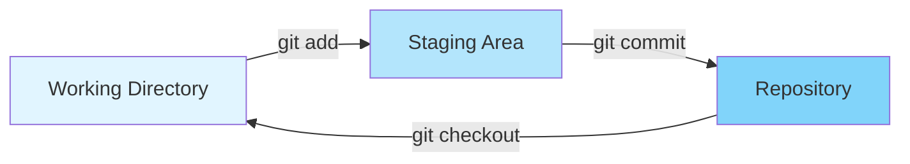
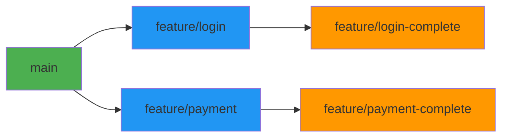
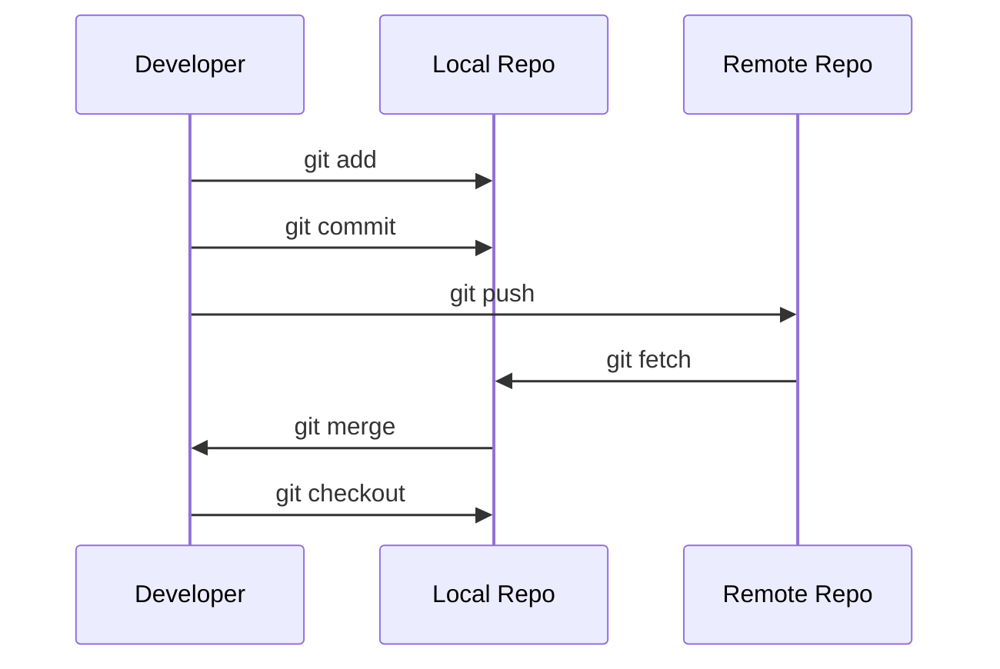
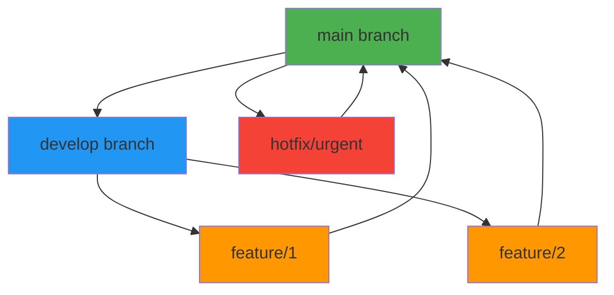

# Git Fundamentals & Workflows

## Overview

Git is a distributed version control system that enables teams to track changes, collaborate on code, and manage software projects efficiently. Understanding Git is fundamental to DevOps practices, as it forms the foundation for continuous integration, code reviews, and collaborative development. This guide covers Git basics, common workflows, branching strategies, and best practices for effective version control.

## Deep Explanation

### What is Version Control?

Version control is a system that records changes to files over time, allowing you to:
- Track history of changes
- Revert to previous versions
- Compare different versions
- Collaborate without conflicts
- Branch and merge code

**Without Version Control**:
```
project_v1.txt
project_v2.txt
project_v2_final.txt
project_v2_final_really.txt
project_v3.txt
```

**With Version Control**:
```
git log
commit abc123 (HEAD -> main)
commit def456
commit ghi789
```

### Git Architecture

#### Three States of Files

Git has three main states:

1. **Working Directory**: Files you're currently editing
2. **Staging Area (Index)**: Files marked for next commit
3. **Repository**: Committed snapshots



#### Git Objects

Git stores data as objects:

- **Blob**: File content
- **Tree**: Directory structure
- **Commit**: Snapshot with metadata
- **Tag**: Named reference to commit

### Basic Git Commands

#### Initialization and Configuration

```bash
# Initialize repository
git init

# Configure user
git config --global user.name "Your Name"
git config --global user.email "your.email@example.com"

# View configuration
git config --list
```

#### Basic Workflow

```bash
# Check status
git status

# Add files to staging
git add file.txt
git add .                    # Add all files
git add *.js                # Add all .js files

# Commit changes
git commit -m "Add feature X"

# View history
git log
git log --oneline           # Compact view
git log --graph --all       # Visual history

# View changes
git diff                    # Unstaged changes
git diff --staged           # Staged changes
git diff HEAD~1             # Compare with previous commit
```

### Branching

#### What are Branches?

Branches allow you to:
- Work on features independently
- Experiment without affecting main code
- Collaborate on different features simultaneously



#### Branch Operations

```bash
# List branches
git branch
git branch -a               # All branches (including remote)

# Create branch
git branch feature/new-feature
git checkout -b feature/new-feature  # Create and switch

# Switch branches
git checkout main
git switch main             # Modern alternative

# Delete branch
git branch -d feature/old   # Safe delete (merged)
git branch -D feature/old   # Force delete (unmerged)

# Rename branch
git branch -m old-name new-name
```

### Merging

#### Fast-Forward Merge

When branch is directly ahead:

```bash
# Before merge
main:     A---B---C
                \
feature:         D---E

# After fast-forward merge
main:     A---B---C---D---E
```

```bash
git checkout main
git merge feature
```

#### Three-Way Merge

When branches have diverged:

```bash
# Before merge
main:     A---B---C---F
                \
feature:         D---E

# After merge
main:     A---B---C---F---M
                \         /
feature:         D-------E
```

```bash
git checkout main
git merge feature
# Resolve conflicts if any
git add .
git commit
```

### Remote Repositories

#### Working with Remotes

```bash
# Add remote
git remote add origin https://github.com/user/repo.git

# List remotes
git remote -v

# Fetch changes
git fetch origin

# Pull changes
git pull origin main
git pull                    # Shorthand

# Push changes
git push origin main
git push                    # Shorthand

# Set upstream
git push -u origin main     # Set upstream for first push
```

#### Remote Branch Tracking

```bash
# View remote branches
git branch -r

# Checkout remote branch
git checkout -b local-branch origin/remote-branch

# Track remote branch
git branch --set-upstream-to=origin/main main
```

### Common Workflows

#### 1. Feature Branch Workflow

**Process**:
1. Create feature branch from main
2. Make changes and commit
3. Push branch to remote
4. Create pull request
5. Review and merge
6. Delete feature branch

```bash
# Start feature
git checkout -b feature/user-authentication
git add .
git commit -m "Add user authentication"
git push -u origin feature/user-authentication

# After merge, cleanup
git checkout main
git pull
git branch -d feature/user-authentication
```

#### 2. Git Flow

**Branches**:
- `main`: Production code
- `develop`: Integration branch
- `feature/*`: Feature branches
- `release/*`: Release preparation
- `hotfix/*`: Production fixes

```bash
# Start feature
git checkout develop
git checkout -b feature/new-feature

# Finish feature
git checkout develop
git merge --no-ff feature/new-feature
git branch -d feature/new-feature

# Start release
git checkout develop
git checkout -b release/1.0.0

# Finish release
git checkout main
git merge --no-ff release/1.0.0
git tag -a v1.0.0
git checkout develop
git merge --no-ff release/1.0.0
```

#### 3. GitHub Flow

**Simplified workflow**:
1. Create branch from main
2. Make changes
3. Open pull request
4. Review and merge
5. Deploy

```bash
# Create branch
git checkout -b feature/add-login

# Make changes
git add .
git commit -m "Add login functionality"
git push -u origin feature/add-login

# Create PR on GitHub, then merge
git checkout main
git pull
```

### Resolving Conflicts

#### Understanding Conflicts

Conflicts occur when:
- Same lines changed in different branches
- File deleted in one branch, modified in another
- Both branches modify same file

#### Conflict Resolution Process

```bash
# Attempt merge
git merge feature-branch

# Git marks conflicts
<<<<<<< HEAD
// Current branch code
=======
// Incoming branch code
>>>>>>> feature-branch

# Edit file to resolve
# Remove conflict markers
# Keep desired code

# Mark as resolved
git add resolved-file.txt
git commit
```

**Example Resolution**:

```javascript
// Before (conflict)
<<<<<<< HEAD
function login(username, password) {
    return authenticate(username, password);
}
=======
function login(username, password) {
    return authService.login(username, password);
}
>>>>>>> feature-branch

// After (resolved)
function login(username, password) {
    return authService.login(username, password);
}
```

### Advanced Git Concepts

#### Rebasing

Rebasing replays commits on top of another branch:

```bash
# Before rebase
main:     A---B---C
                \
feature:         D---E

# After rebase
main:     A---B---C
                    \
feature:             D'---E'
```

```bash
git checkout feature
git rebase main

# Interactive rebase
git rebase -i HEAD~3    # Rebase last 3 commits
```

**Rebase vs Merge**:
- **Rebase**: Linear history, cleaner
- **Merge**: Preserves branch history

#### Stashing

Temporarily save changes:

```bash
# Save changes
git stash
git stash save "Work in progress"

# List stashes
git stash list

# Apply stash
git stash apply           # Keep stash
git stash pop             # Apply and remove

# Drop stash
git stash drop stash@{0}
```

#### Cherry-Picking

Apply specific commits:

```bash
# Apply commit from another branch
git cherry-pick abc123

# Apply multiple commits
git cherry-pick abc123 def456
```

#### Undoing Changes

```bash
# Undo working directory changes
git checkout -- file.txt
git restore file.txt      # Modern alternative

# Unstage file
git reset HEAD file.txt
git restore --staged file.txt

# Undo commit (keep changes)
git reset --soft HEAD~1

# Undo commit (discard changes)
git reset --hard HEAD~1   # DANGEROUS!

# Revert commit (safe, creates new commit)
git revert abc123
```

### Git Hooks

Hooks are scripts that run at specific Git events:

```bash
# Pre-commit hook
#!/bin/sh
# .git/hooks/pre-commit
npm test
if [ $? -ne 0 ]; then
    echo "Tests failed"
    exit 1
fi
```

Common hooks:
- `pre-commit`: Before commit
- `pre-push`: Before push
- `post-merge`: After merge
- `post-checkout`: After checkout

## Diagrams

### Git Workflow



### Branching Strategy



## Real Code Examples

### Complete Feature Workflow

```bash
#!/bin/bash
# Complete feature development workflow

# 1. Start new feature
git checkout main
git pull origin main
git checkout -b feature/user-profile

# 2. Make changes
cat > user-profile.js << 'EOF'
function UserProfile(user) {
    this.name = user.name;
    this.email = user.email;
}
EOF

# 3. Stage and commit
git add user-profile.js
git commit -m "Add user profile component"

# 4. Push to remote
git push -u origin feature/user-profile

# 5. Create PR on GitHub/GitLab
# ... (manual step)

# 6. After PR approved and merged
git checkout main
git pull origin main
git branch -d feature/user-profile
```

### Git Aliases

```bash
# Add to ~/.gitconfig
[alias]
    st = status
    co = checkout
    br = branch
    ci = commit
    unstage = reset HEAD --
    last = log -1 HEAD
    visual = !gitk
    lg = log --oneline --decorate --graph --all
    amend = commit --amend --no-edit
    undo = reset HEAD~1
```

### Pre-commit Hook Example

```bash
#!/bin/sh
# .git/hooks/pre-commit

# Run linter
echo "Running linter..."
npm run lint
if [ $? -ne 0 ]; then
    echo "Linter failed. Commit aborted."
    exit 1
fi

# Run tests
echo "Running tests..."
npm test
if [ $? -ne 0 ]; then
    echo "Tests failed. Commit aborted."
    exit 1
fi

echo "Pre-commit checks passed!"
exit 0
```

## Hard Use-Case: Large Team Collaboration

### Problem

Team of 50 developers:
- Frequent merge conflicts
- Long-lived feature branches
- Difficult code reviews
- Integration issues

### Solution: Trunk-Based Development

#### Strategy

1. **Short-lived branches** (< 1 day)
2. **Small commits** (focused changes)
3. **Frequent integration** (multiple times per day)
4. **Feature flags** (deploy incomplete features)

#### Implementation

```bash
# Developer workflow
git checkout main
git pull origin main

# Create small feature branch
git checkout -b feature/add-button

# Make small change
git add button.js
git commit -m "Add submit button"

# Push immediately
git push -u origin feature/add-button

# Create PR, get quick review
# Merge within hours

# Repeat for next small change
```

#### Feature Flags

```javascript
// Use feature flags instead of long branches
if (featureFlags.isEnabled('new-checkout')) {
    renderNewCheckout();
} else {
    renderOldCheckout();
}
```

### Benefits

- Fewer conflicts (smaller changes)
- Faster integration
- Easier reviews
- Continuous deployment

## Edge Cases and Pitfalls

### 1. Force Push to Shared Branch

**Problem**: Rewriting shared history

```bash
# DANGEROUS!
git push --force origin main
```

**Solution**: Never force push to shared branches

```bash
# Safe: Force push to feature branch (your own)
git push --force origin feature/my-branch

# Better: Rebase instead
git rebase main
git push origin feature/my-branch
```

### 2. Committing Secrets

**Problem**: Accidentally committing passwords/API keys

```bash
# BAD: Committed secret
git commit -m "Add config"
# Contains: API_KEY=secret123
```

**Solution**: Use .gitignore and remove from history

```bash
# Add to .gitignore
echo "config/secrets.env" >> .gitignore

# Remove from history (if already committed)
git filter-branch --force --index-filter \
  "git rm --cached --ignore-unmatch config/secrets.env" \
  --prune-empty --tag-name-filter cat -- --all

# Force push (coordinate with team!)
git push --force --all
```

### 3. Large Files

**Problem**: Committing large files slows Git

```bash
# BAD: 500MB video file
git add video.mp4
git commit -m "Add video"
```

**Solution**: Use Git LFS or external storage

```bash
# Install Git LFS
git lfs install

# Track large files
git lfs track "*.mp4"
git add .gitattributes
git add video.mp4
git commit -m "Add video (LFS)"
```

### 4. Merge vs Rebase Confusion

**Problem**: Using wrong strategy

```bash
# BAD: Rebasing shared branch
git checkout main
git rebase feature-branch  # Rewrites main history!
```

**Solution**: Understand when to use each

```bash
# GOOD: Merge shared branches
git checkout main
git merge feature-branch

# GOOD: Rebase your feature branch
git checkout feature-branch
git rebase main
```

### 5. Not Pulling Before Push

**Problem**: Push rejected due to remote changes

```bash
# Error: Updates were rejected
git push origin main
```

**Solution**: Always pull first

```bash
# GOOD: Pull before push
git pull origin main
git push origin main

# Or: Fetch and merge
git fetch origin
git merge origin/main
git push origin main
```

## References and Further Reading

- [Pro Git Book](https://git-scm.com/book) - Comprehensive Git guide
- [Git Documentation](https://git-scm.com/doc) - Official documentation
- [GitHub Flow](https://guides.github.com/introduction/flow/) - GitHub workflow
- [Git Flow](https://nvie.com/posts/a-successful-git-branching-model/) - Git branching model
- [Atlassian Git Tutorials](https://www.atlassian.com/git/tutorials) - Git tutorials

## Quiz

### Question 1
What are the three main states of files in Git?

**A)** Created, Modified, Deleted  
**B)** Working Directory, Staging Area, Repository  
**C)** Local, Remote, Synced  
**D)** Committed, Pushed, Merged

**Answer: B** - Git has three main states: Working Directory (files you're editing), Staging Area (files marked for commit), and Repository (committed snapshots).

### Question 2
What is the difference between `git merge` and `git rebase`?

**A)** Merge creates linear history, rebase preserves branches  
**B)** Merge preserves branch history, rebase creates linear history  
**C)** They're the same  
**D)** Merge is for local, rebase is for remote

**Answer: B** - `git merge` preserves the branch history by creating a merge commit, while `git rebase` replays commits on top of another branch, creating a linear history.

### Question 3
What command safely undoes a commit while keeping the changes?

**A)** `git reset --hard HEAD~1`  
**B)** `git reset --soft HEAD~1`  
**C)** `git revert HEAD`  
**D)** `git checkout HEAD~1`

**Answer: B** - `git reset --soft HEAD~1` undoes the commit but keeps changes staged. `git revert` creates a new commit that undoes changes, which is safer for shared branches.

### Question 4
What should you never do to a shared branch?

**A)** Merge into it  
**B)** Create feature branches from it  
**C)** Force push to it  
**D)** Pull from it

**Answer: C** - Force pushing to a shared branch rewrites history that others may have based their work on, causing serious collaboration issues.

### Question 5
What is the purpose of `.gitignore`?

**A)** To ignore Git commands  
**B)** To specify files Git should not track  
**C)** To hide Git history  
**D)** To disable Git features

**Answer: B** - `.gitignore` specifies files and patterns that Git should not track, such as build artifacts, dependencies, and sensitive files.

## Related Topics

- [Introduction to DevOps](./01.%20Introduction%20to%20DevOps.md) - DevOps fundamentals
- [Linux Fundamentals for DevOps](./03.%20Linux%20Fundamentals%20for%20DevOps.md) - Command line basics
- [Introduction to CI/CD](./04.%20Introduction%20to%20CI%CD.md) - Using Git with CI/CD

