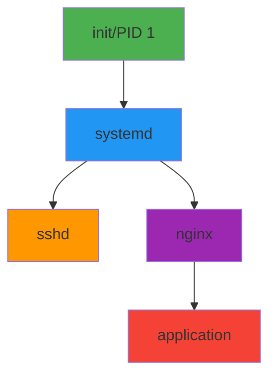
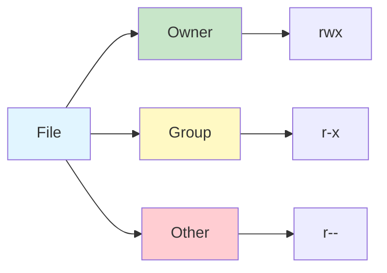

# Linux Fundamentals for DevOps

## Overview

Linux is the operating system powering most servers, containers, and cloud infrastructure. DevOps engineers spend significant time working in Linux environments, managing servers, debugging issues, and automating tasks. This guide covers essential Linux commands, file system navigation, process management, text processing, and shell scripting fundamentals needed for effective DevOps work.

## Deep Explanation

### Why Linux for DevOps?

- **Ubiquity**: Most servers run Linux
- **Containers**: Docker containers are Linux-based
- **Cloud**: Major cloud providers use Linux
- **Tools**: Most DevOps tools are Linux-native
- **Automation**: Scripting and automation are Linux strengths

### Linux File System Hierarchy

```
/
├── bin/          # Essential binaries
├── boot/         # Boot files
├── dev/          # Device files
├── etc/          # Configuration files
├── home/         # User directories
├── lib/          # Libraries
├── opt/          # Optional software
├── proc/         # Process information
├── root/         # Root user home
├── sbin/         # System binaries
├── tmp/          # Temporary files
├── usr/          # User programs
└── var/          # Variable data (logs, etc.)
```

### Essential Commands

#### Navigation

```bash
# Current directory
pwd

# List files
ls
ls -l              # Long format
ls -la             # Include hidden files
ls -lh             # Human-readable sizes

# Change directory
cd /path/to/dir
cd ~                # Home directory
cd -                # Previous directory
cd ..               # Parent directory

# Create directories
mkdir dirname
mkdir -p path/to/dir  # Create parent directories

# Remove
rm file.txt
rm -r dirname        # Recursive (directories)
rm -rf dirname       # Force recursive (DANGEROUS!)

# Copy
cp source.txt dest.txt
cp -r sourcedir destdir

# Move/Rename
mv old.txt new.txt
mv file.txt /path/to/dest/
```

#### File Operations

```bash
# View file
cat file.txt
less file.txt        # Scrollable view
head file.txt        # First 10 lines
tail file.txt        # Last 10 lines
tail -f file.txt     # Follow (watch updates)

# Edit file
nano file.txt        # Simple editor
vim file.txt         # Advanced editor
vi file.txt          # Classic editor

# Search in files
grep "pattern" file.txt
grep -r "pattern" dir/  # Recursive
grep -i "pattern" file.txt  # Case-insensitive

# Find files
find /path -name "*.txt"
find /path -type f -name "*.log"
find /path -mtime -7  # Modified in last 7 days

# File permissions
chmod 755 script.sh
chmod +x script.sh   # Make executable
chown user:group file.txt
```

#### Process Management

```bash
# List processes
ps
ps aux              # All processes
ps aux | grep nginx

# Process tree
pstree

# Real-time process monitor
top
htop                # Enhanced top

# Kill process
kill PID
kill -9 PID         # Force kill
killall processname

# Background jobs
command &           # Run in background
jobs                # List jobs
fg %1               # Bring to foreground
bg %1               # Resume in background
```

#### System Information

```bash
# System info
uname -a
hostname
uptime

# Disk usage
df -h               # Filesystem usage
du -h dir/          # Directory usage
du -sh *            # Summary by directory

# Memory
free -h
cat /proc/meminfo

# CPU
lscpu
cat /proc/cpuinfo

# Network
ifconfig
ip addr
netstat -tulpn      # Listening ports
ss -tulpn           # Modern alternative
```

### Text Processing

#### grep

```bash
# Basic search
grep "error" log.txt

# Options
grep -i "error" log.txt        # Case-insensitive
grep -v "debug" log.txt        # Invert match
grep -n "error" log.txt        # Show line numbers
grep -c "error" log.txt        # Count matches
grep -r "error" /var/log/      # Recursive

# Regular expressions
grep "^ERROR" log.txt          # Lines starting with ERROR
grep "error$" log.txt          # Lines ending with error
grep "error\|warning" log.txt # error OR warning
```

#### sed (Stream Editor)

```bash
# Substitute
sed 's/old/new/g' file.txt
sed 's/old/new/' file.txt      # First occurrence only

# Delete lines
sed '/pattern/d' file.txt
sed '5d' file.txt              # Delete line 5

# Print specific lines
sed -n '10,20p' file.txt       # Lines 10-20

# In-place edit
sed -i 's/old/new/g' file.txt
```

#### awk

```bash
# Print columns
awk '{print $1}' file.txt      # First column
awk '{print $1, $3}' file.txt  # First and third

# With delimiter
awk -F: '{print $1}' /etc/passwd

# Conditional
awk '$3 > 1000 {print $1}' /etc/passwd

# Built-in variables
awk '{print NR, $0}' file.txt  # Line number + line
awk 'END {print NR}' file.txt  # Total lines
```

#### cut

```bash
# Extract columns
cut -d: -f1 /etc/passwd        # First field, colon delimiter
cut -c1-10 file.txt            # Characters 1-10
```

### Pipes and Redirection

#### Pipes

```bash
# Chain commands
command1 | command2 | command3

# Examples
ps aux | grep nginx
cat log.txt | grep error | wc -l
ls -la | head -20
```

#### Redirection

```bash
# Output to file
command > file.txt             # Overwrite
command >> file.txt            # Append

# Input from file
command < file.txt

# Error handling
command > output.txt 2>&1      # Redirect stdout and stderr
command 2> error.txt           # Redirect stderr only
command > /dev/null 2>&1       # Discard output

# Here document
cat << EOF
Line 1
Line 2
EOF
```

### Shell Scripting Basics

#### Basic Script

```bash
#!/bin/bash
# script.sh

# Variables
NAME="DevOps"
echo "Hello, $NAME"

# Command substitution
DATE=$(date)
echo "Current date: $DATE"

# Arguments
echo "First argument: $1"
echo "All arguments: $@"
echo "Number of arguments: $#"

# Exit codes
if [ $? -eq 0 ]; then
    echo "Success"
else
    echo "Failed"
fi
```

#### Conditionals

```bash
# If statement
if [ condition ]; then
    commands
elif [ condition ]; then
    commands
else
    commands
fi

# File tests
if [ -f file.txt ]; then
    echo "File exists"
fi

if [ -d dir/ ]; then
    echo "Directory exists"
fi

# String comparison
if [ "$VAR" = "value" ]; then
    echo "Match"
fi

if [ -z "$VAR" ]; then
    echo "Variable is empty"
fi
```

#### Loops

```bash
# For loop
for i in 1 2 3; do
    echo $i
done

for file in *.txt; do
    echo "Processing $file"
done

# While loop
while [ condition ]; do
    commands
done

# Until loop
until [ condition ]; do
    commands
done
```

#### Functions

```bash
# Define function
function greet() {
    echo "Hello, $1"
}

# Call function
greet "World"

# Return value
function add() {
    local sum=$(($1 + $2))
    echo $sum
}

result=$(add 5 3)
echo "Sum: $result"
```

### Package Management

#### apt (Debian/Ubuntu)

```bash
# Update package list
sudo apt update

# Upgrade packages
sudo apt upgrade

# Install package
sudo apt install nginx

# Remove package
sudo apt remove nginx

# Search packages
apt search nginx

# Show package info
apt show nginx
```

#### yum/dnf (RedHat/CentOS/Fedora)

```bash
# Update packages
sudo yum update
sudo dnf update

# Install package
sudo yum install nginx
sudo dnf install nginx

# Remove package
sudo yum remove nginx

# Search packages
yum search nginx
```

### System Services

#### systemd

```bash
# Service status
systemctl status nginx

# Start service
sudo systemctl start nginx

# Stop service
sudo systemctl stop nginx

# Restart service
sudo systemctl restart nginx

# Enable on boot
sudo systemctl enable nginx

# Disable on boot
sudo systemctl disable nginx

# List services
systemctl list-units --type=service
```

#### Logs

```bash
# System logs
journalctl
journalctl -u nginx           # Service logs
journalctl -f                 # Follow logs
journalctl --since "1 hour ago"
journalctl --since today

# Application logs
tail -f /var/log/nginx/access.log
tail -f /var/log/nginx/error.log
```

### Networking

#### Basic Commands

```bash
# Ping
ping google.com
ping -c 4 google.com          # 4 packets

# DNS lookup
nslookup google.com
dig google.com
host google.com

# Download files
wget https://example.com/file.zip
curl -O https://example.com/file.zip
curl https://api.example.com/data

# Network configuration
ip addr show
ip route show
```

#### Firewall (ufw)

```bash
# Enable firewall
sudo ufw enable

# Allow port
sudo ufw allow 22/tcp         # SSH
sudo ufw allow 80/tcp         # HTTP
sudo ufw allow 443/tcp        # HTTPS

# Deny port
sudo ufw deny 8080/tcp

# Status
sudo ufw status
```

### File Permissions

#### Understanding Permissions

```
-rwxr-xr-x 1 user group 1024 Jan 1 12:00 script.sh
││││││││││ │  │    │     │   │  │  │      │
││││││││││ │  │    │     │   │  │  │      └─ Filename
││││││││││ │  │    │     │   │  │  └─────── Date
││││││││││ │  │    │     │   │  └────────── Time
││││││││││ │  │    │     │   └───────────── Size
││││││││││ │  │    │     └───────────────── Group
││││││││││ │  │    └─────────────────────── Owner
││││││││││ │  └──────────────────────────── Links
││││││││││ └─────────────────────────────── Type
│└┴┴└┴┴└┴┴
│ │ │ │ │ │ │
│ │ │ │ │ │ └─ Other: read, execute
│ │ │ │ │ └─── Group: read, execute
│ │ │ │ └───── Owner: read, write, execute
│ │ │ └─────── Type: - (file), d (directory), l (link)
└─┴─┴─┴─┴─┴─┴─ Permissions
```

#### Permission Numbers

```
r (read)   = 4
w (write)  = 2
x (execute) = 1

rwx = 4+2+1 = 7
rw- = 4+2+0 = 6
r-- = 4+0+0 = 4
--- = 0+0+0 = 0

755 = rwxr-xr-x (owner: rwx, group: r-x, other: r-x)
644 = rw-r--r-- (owner: rw-, group: r--, other: r--)
```

#### Changing Permissions

```bash
# Numeric
chmod 755 script.sh
chmod 644 file.txt

# Symbolic
chmod u+x script.sh           # User execute
chmod g+w file.txt            # Group write
chmod o-r file.txt            # Other remove read
chmod a+x script.sh           # All execute

# Recursive
chmod -R 755 directory/
```

### Environment Variables

```bash
# Set variable
export VAR="value"
VAR="value"                   # Current shell only

# View variable
echo $VAR

# List all
env
printenv

# Persistent (add to ~/.bashrc)
echo 'export VAR="value"' >> ~/.bashrc
source ~/.bashrc
```

## Diagrams

### Linux Process Hierarchy



### File System Permissions



## Real Code Examples

### Complete Deployment Script

```bash
#!/bin/bash
# deploy.sh - Deployment script

set -e  # Exit on error
set -u  # Exit on undefined variable

# Configuration
APP_NAME="myapp"
APP_DIR="/var/www/$APP_NAME"
BACKUP_DIR="/var/backups/$APP_NAME"
REPO_URL="https://github.com/user/repo.git"

# Colors for output
RED='\033[0;31m'
GREEN='\033[0;32m'
YELLOW='\033[1;33m'
NC='\033[0m' # No Color

# Logging function
log() {
    echo -e "${GREEN}[$(date +'%Y-%m-%d %H:%M:%S')]${NC} $1"
}

error() {
    echo -e "${RED}[ERROR]${NC} $1" >&2
    exit 1
}

warning() {
    echo -e "${YELLOW}[WARNING]${NC} $1"
}

# Check if running as root
if [ "$EUID" -eq 0 ]; then
    error "Please do not run as root"
fi

# Create backup
log "Creating backup..."
mkdir -p "$BACKUP_DIR"
BACKUP_FILE="$BACKUP_DIR/backup-$(date +%Y%m%d-%H%M%S).tar.gz"
tar -czf "$BACKUP_FILE" "$APP_DIR" || error "Backup failed"
log "Backup created: $BACKUP_FILE"

# Pull latest code
log "Pulling latest code..."
cd "$APP_DIR" || error "Directory not found"
git pull origin main || error "Git pull failed"

# Install dependencies
log "Installing dependencies..."
npm ci --production || error "npm install failed"

# Build application
log "Building application..."
npm run build || error "Build failed"

# Restart service
log "Restarting service..."
sudo systemctl restart "$APP_NAME" || error "Service restart failed"

# Health check
log "Performing health check..."
sleep 5
if curl -f http://localhost/health > /dev/null 2>&1; then
    log "Deployment successful!"
else
    warning "Health check failed, rolling back..."
    # Rollback logic here
    error "Deployment failed"
fi
```

### Log Analysis Script

```bash
#!/bin/bash
# analyze-logs.sh

LOG_FILE="/var/log/application.log"
REPORT_FILE="/tmp/log-report-$(date +%Y%m%d).txt"

# Count errors
ERROR_COUNT=$(grep -i "error" "$LOG_FILE" | wc -l)

# Count warnings
WARNING_COUNT=$(grep -i "warning" "$LOG_FILE" | wc -l)

# Top error messages
TOP_ERRORS=$(grep -i "error" "$LOG_FILE" | \
    awk '{print $NF}' | \
    sort | uniq -c | \
    sort -rn | head -10)

# Generate report
cat > "$REPORT_FILE" << EOF
Log Analysis Report
Generated: $(date)

Total Errors: $ERROR_COUNT
Total Warnings: $WARNING_COUNT

Top 10 Error Messages:
$TOP_ERRORS
EOF

echo "Report generated: $REPORT_FILE"
cat "$REPORT_FILE"
```

### Process Monitor Script

```bash
#!/bin/bash
# monitor-process.sh

PROCESS_NAME="$1"
MAX_CPU=80
MAX_MEM=80

if [ -z "$PROCESS_NAME" ]; then
    echo "Usage: $0 <process-name>"
    exit 1
fi

while true; do
    PID=$(pgrep "$PROCESS_NAME" | head -1)
    
    if [ -z "$PID" ]; then
        echo "[$(date)] Process $PROCESS_NAME not found"
        sleep 5
        continue
    fi
    
    CPU=$(ps -p "$PID" -o %cpu --no-headers | tr -d ' ')
    MEM=$(ps -p "$PID" -o %mem --no-headers | tr -d ' ')
    
    echo "[$(date)] PID: $PID, CPU: ${CPU}%, MEM: ${MEM}%"
    
    if (( $(echo "$CPU > $MAX_CPU" | bc -l) )); then
        echo "WARNING: CPU usage exceeded $MAX_CPU%"
    fi
    
    if (( $(echo "$MEM > $MAX_MEM" | bc -l) )); then
        echo "WARNING: Memory usage exceeded $MAX_MEM%"
    fi
    
    sleep 5
done
```

## Hard Use-Case: Troubleshooting Production Issue

### Problem

Application is slow, need to diagnose:
- High CPU usage
- Memory leaks
- Network issues
- Disk I/O problems

### Solution: Systematic Diagnosis

```bash
#!/bin/bash
# diagnose.sh - Production diagnostics

echo "=== System Overview ==="
uptime
echo ""

echo "=== CPU Usage ==="
top -bn1 | head -20
echo ""

echo "=== Memory Usage ==="
free -h
echo ""

echo "=== Disk Usage ==="
df -h
echo ""

echo "=== Top Processes by CPU ==="
ps aux --sort=-%cpu | head -10
echo ""

echo "=== Top Processes by Memory ==="
ps aux --sort=-%mem | head -10
echo ""

echo "=== Network Connections ==="
netstat -tulpn | head -20
echo ""

echo "=== Disk I/O ==="
iostat -x 1 5
echo ""

echo "=== Recent Errors in Logs ==="
journalctl -p err -n 20 --no-pager
echo ""

echo "=== Application Logs (Last 50 lines) ==="
tail -50 /var/log/application.log
```

### Analysis Steps

1. **Check system resources**
   ```bash
   htop
   ```

2. **Identify resource-intensive processes**
   ```bash
   ps aux --sort=-%cpu | head -10
   ps aux --sort=-%mem | head -10
   ```

3. **Check network**
   ```bash
   ss -tulpn
   netstat -i
   ```

4. **Check disk I/O**
   ```bash
   iostat -x 1 5
   ```

5. **Analyze logs**
   ```bash
   tail -f /var/log/application.log
   grep -i error /var/log/application.log | tail -20
   ```

## Edge Cases and Pitfalls

### 1. rm -rf in Wrong Directory

**Problem**: Accidentally deleting important files

```bash
# DANGEROUS!
cd /tmp
rm -rf /  # Wrong! Should be: rm -rf ./*
```

**Solution**: Always double-check path

```bash
# SAFE: Check first
pwd
ls -la
rm -rf ./temp-files  # Explicit path
```

### 2. Background Process Not Terminated

**Problem**: Process continues after terminal closes

```bash
# Process dies when terminal closes
nohup command &
# Or use screen/tmux
screen -S mysession
tmux new -s mysession
```

### 3. Permission Denied Errors

**Problem**: Can't execute script

```bash
# Error: Permission denied
./script.sh

# Solution
chmod +x script.sh
./script.sh
```

### 4. Disk Space Full

**Problem**: No space left on device

```bash
# Find large files
du -h / | sort -rh | head -20

# Find large files by type
find / -type f -size +100M

# Clean up
sudo apt autoremove
sudo apt autoclean
journalctl --vacuum-time=7d  # Clean old logs
```

### 5. Broken Pipe Errors

**Problem**: Process terminated while piping

```bash
# Error: Broken pipe
yes | head -10

# Solution: Handle SIGPIPE
yes 2>/dev/null | head -10
```

## References and Further Reading

- [Linux Command Line](https://linuxcommand.org/) - Linux command line tutorial
- [Bash Guide](https://mywiki.wooledge.org/BashGuide) - Comprehensive bash guide
- [Linux System Administration](https://www.tldp.org/LDP/sag/) - System administration guide
- [Advanced Bash Scripting](https://tldp.org/LDP/abs/html/) - Advanced scripting
- [Linux Filesystem Hierarchy](https://www.pathname.com/fhs/) - Filesystem standard

## Quiz

### Question 1
What command shows currently running processes?

**A)** `ls`  
**B)** `ps`  
**C)** `cat`  
**D)** `grep`

**Answer: B** - `ps` displays information about running processes. `ps aux` shows all processes with detailed information.

### Question 2
What does `chmod 755` do?

**A)** Makes file readable only  
**B)** Gives owner rwx, group and others r-x  
**C)** Makes file executable only  
**D)** Removes all permissions

**Answer: B** - `chmod 755` sets permissions to rwxr-xr-x (owner: read/write/execute, group: read/execute, others: read/execute).

### Question 3
What is the purpose of `grep`?

**A)** Edit files  
**B)** Search for patterns in text  
**C)** Copy files  
**D)** Delete files

**Answer: B** - `grep` searches for patterns in text files or output, making it essential for log analysis and text processing.

### Question 4
What does `|` (pipe) do in Linux?

**A)** Redirects output to file  
**B)** Chains commands, passing output as input  
**C)** Runs commands in parallel  
**D)** Comments out code

**Answer: B** - The pipe (`|`) takes the output of one command and passes it as input to the next command, enabling powerful command chaining.

### Question 5
What is the purpose of `systemctl`?

**A)** Manage files  
**B)** Manage system services  
**C)** Manage users  
**D)** Manage network

**Answer: B** - `systemctl` is used to manage systemd services, including starting, stopping, enabling, and checking status of services.

## Related Topics

- [Introduction to DevOps](./01.%20Introduction%20to%20DevOps.md) - DevOps overview
- [Git Fundamentals & Workflows](./02.%20Git%20Fundamentals%20%26%20Workflows.md) - Version control
- [Docker Basics](./05.%20Docker%20Basics.md) - Containerization

