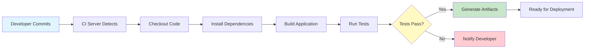
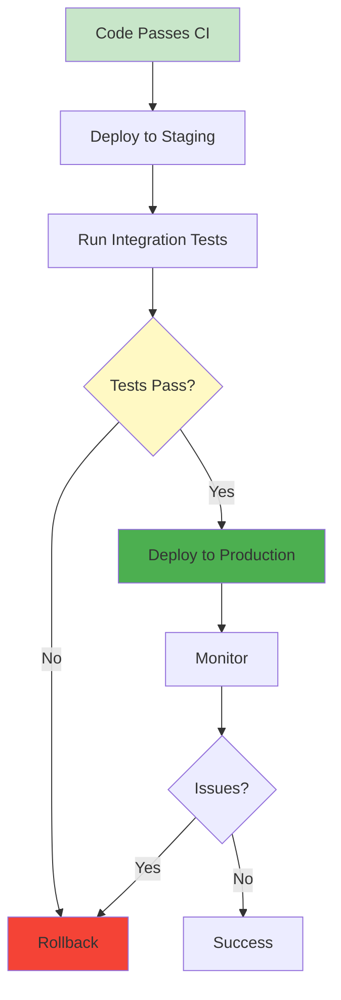
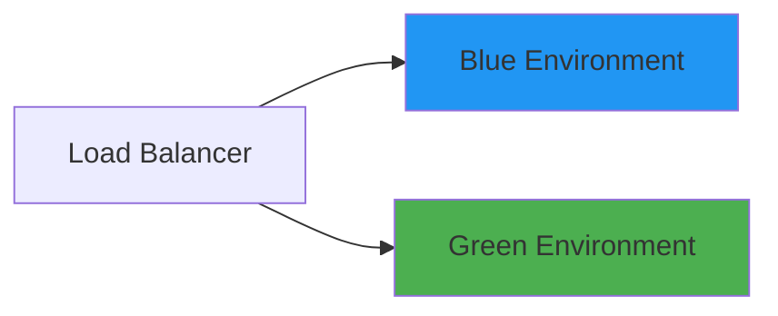
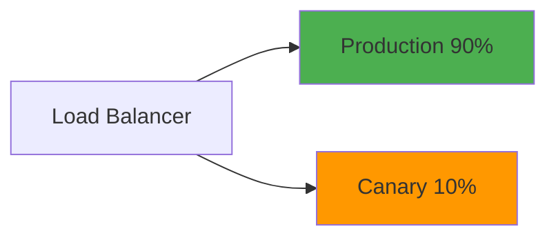
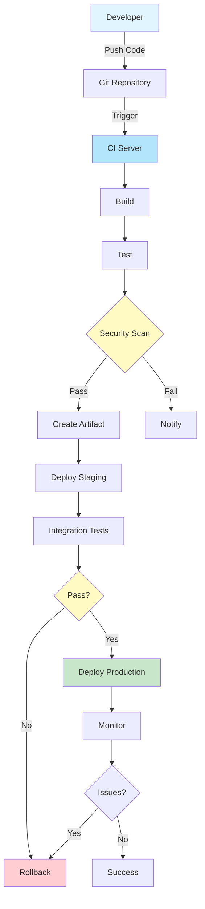
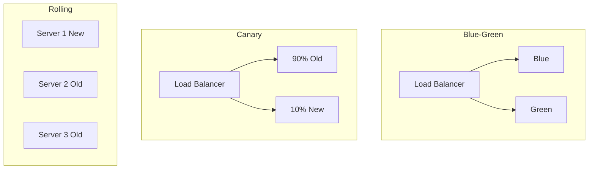

# Introduction to CI/CD

## Overview

Continuous Integration (CI) and Continuous Delivery/Deployment (CD) are fundamental DevOps practices that automate the software delivery process. CI ensures code changes are integrated and tested frequently, while CD automates deployment to various environments. This guide covers CI/CD concepts, pipeline design, popular tools, and best practices for implementing automated software delivery.

## Deep Explanation

### What is CI/CD?

**CI/CD** stands for:
- **Continuous Integration**: Automatically building and testing code changes
- **Continuous Delivery**: Automatically preparing code for release
- **Continuous Deployment**: Automatically deploying to production

### Continuous Integration (CI)

#### Definition

CI is the practice of frequently integrating code changes into a shared repository, where automated builds and tests are run.

#### CI Process



#### Benefits

- **Early Bug Detection**: Catch issues before they reach production
- **Faster Feedback**: Know immediately if code works
- **Reduced Integration Problems**: Frequent merges prevent conflicts
- **Higher Code Quality**: Automated testing enforces standards

#### CI Best Practices

1. **Commit Frequently**: Small, frequent commits
2. **Fast Builds**: Keep builds under 10 minutes
3. **Fail Fast**: Run quick tests first
4. **Parallel Execution**: Run independent tests in parallel
5. **Artifact Management**: Store build artifacts

### Continuous Delivery (CD)

#### Definition

CD extends CI by automatically deploying code to staging/production environments after passing tests.

#### CD Process



#### Benefits

- **Faster Releases**: Deploy anytime, not just on release day
- **Lower Risk**: Small, frequent deployments
- **Consistent Process**: Same process every time
- **Quick Rollback**: Easy to revert if issues occur

### Continuous Deployment vs Continuous Delivery

**Continuous Delivery**:
- Code is always deployable
- Manual approval before production
- Human decides when to deploy

**Continuous Deployment**:
- Automatic deployment to production
- No manual approval
- Fully automated

### CI/CD Pipeline Stages

#### Typical Pipeline

```yaml
# Example pipeline stages
stages:
  - build      # Compile code
  - test       # Run tests
  - security   # Security scans
  - deploy     # Deploy to environments
  - monitor    # Monitor deployment
```

#### Stage Breakdown

1. **Build Stage**
   - Checkout source code
   - Install dependencies
   - Compile/build application
   - Create artifacts

2. **Test Stage**
   - Unit tests
   - Integration tests
   - End-to-end tests
   - Performance tests

3. **Security Stage**
   - Dependency scanning
   - Code scanning
   - Container scanning
   - Secrets detection

4. **Deploy Stage**
   - Deploy to staging
   - Deploy to production
   - Run smoke tests

5. **Monitor Stage**
   - Health checks
   - Performance monitoring
   - Error tracking

### Popular CI/CD Tools

#### GitHub Actions

**Pros**:
- Integrated with GitHub
- Free for public repos
- Large marketplace
- YAML-based configuration

**Example**:
```yaml
name: CI/CD Pipeline
on:
  push:
    branches: [main]
  pull_request:
    branches: [main]

jobs:
  build:
    runs-on: ubuntu-latest
    steps:
      - uses: actions/checkout@v3
      - name: Setup Node.js
        uses: actions/setup-node@v3
        with:
          node-version: '18'
      - name: Install dependencies
        run: npm ci
      - name: Run tests
        run: npm test
      - name: Build
        run: npm run build
```

#### GitLab CI

**Pros**:
- Integrated with GitLab
- Powerful runner system
- Built-in container registry
- Comprehensive features

**Example**:
```yaml
# .gitlab-ci.yml
stages:
  - build
  - test
  - deploy

build:
  stage: build
  script:
    - npm ci
    - npm run build
  artifacts:
    paths:
      - dist/

test:
  stage: test
  script:
    - npm test
  coverage: '/Coverage: \d+\.\d+%/'

deploy:
  stage: deploy
  script:
    - ./deploy.sh
  only:
    - main
```

#### Jenkins

**Pros**:
- Highly customizable
- Extensive plugin ecosystem
- Self-hosted option
- Mature and stable

**Example** (Jenkinsfile):
```groovy
pipeline {
    agent any
    
    stages {
        stage('Build') {
            steps {
                sh 'npm ci'
                sh 'npm run build'
            }
        }
        
        stage('Test') {
            steps {
                sh 'npm test'
            }
        }
        
        stage('Deploy') {
            when {
                branch 'main'
            }
            steps {
                sh './deploy.sh'
            }
        }
    }
}
```

#### CircleCI

**Pros**:
- Fast builds
- Good Docker support
- Free tier available
- Cloud-hosted

**Example** (.circleci/config.yml):
```yaml
version: 2.1
jobs:
  build:
    docker:
      - image: node:18
    steps:
      - checkout
      - run: npm ci
      - run: npm test
      - run: npm run build
```

### Pipeline Design Patterns

#### 1. Branch-Based Pipeline

```yaml
# Different pipelines for different branches
on:
  push:
    branches:
      - main      # Full pipeline
      - develop   # Test only
      - feature/* # Test only
```

#### 2. Matrix Builds

```yaml
# Test on multiple versions
strategy:
  matrix:
    node-version: [16, 18, 20]
    os: [ubuntu-latest, windows-latest]
```

#### 3. Conditional Stages

```yaml
# Run stages conditionally
deploy:
  if: github.ref == 'refs/heads/main'
  script:
    - ./deploy.sh
```

#### 4. Parallel Execution

```yaml
# Run tests in parallel
test:
  parallel:
    - name: Unit Tests
      script: npm run test:unit
    - name: Integration Tests
      script: npm run test:integration
    - name: E2E Tests
      script: npm run test:e2e
```

### Artifact Management

#### What are Artifacts?

Artifacts are files produced during builds:
- Compiled binaries
- Docker images
- Documentation
- Test reports

#### Artifact Storage

```yaml
# Store artifacts
artifacts:
  paths:
    - dist/
    - coverage/
  expire_in: 1 week
```

#### Docker Images

```yaml
# Build and push Docker image
- name: Build Docker image
  run: |
    docker build -t myapp:${{ github.sha }} .
    docker push myapp:${{ github.sha }}
```

### Testing in CI/CD

#### Test Types

1. **Unit Tests**: Fast, test individual components
2. **Integration Tests**: Test component interactions
3. **End-to-End Tests**: Test full user flows
4. **Performance Tests**: Test under load
5. **Security Tests**: Test for vulnerabilities

#### Test Strategy

```yaml
# Test pyramid approach
test:
  steps:
    # Fast tests first (unit)
    - name: Unit tests
      run: npm run test:unit
    
    # Slower tests (integration)
    - name: Integration tests
      run: npm run test:integration
    
    # Slowest tests last (E2E)
    - name: E2E tests
      run: npm run test:e2e
```

### Deployment Strategies

#### 1. Blue-Green Deployment



**Process**:
1. Deploy new version to green
2. Test green environment
3. Switch traffic to green
4. Keep blue as backup

#### 2. Canary Deployment



**Process**:
1. Deploy to small percentage
2. Monitor metrics
3. Gradually increase
4. Full rollout if successful

#### 3. Rolling Deployment

**Process**:
1. Deploy to subset of servers
2. Wait and verify
3. Deploy to next subset
4. Continue until all updated

### Environment Management

#### Environment Types

- **Development**: Local development
- **Staging**: Pre-production testing
- **Production**: Live environment

#### Environment Configuration

```yaml
# Different configs per environment
deploy:
  environment: production
  env:
    DATABASE_URL: ${{ secrets.PROD_DB_URL }}
    API_KEY: ${{ secrets.PROD_API_KEY }}
```

## Diagrams

### Complete CI/CD Pipeline



### Deployment Strategies Comparison



## Real Code Examples

### Complete GitHub Actions Pipeline

```yaml
name: CI/CD Pipeline

on:
  push:
    branches: [main, develop]
  pull_request:
    branches: [main]

env:
  NODE_VERSION: '18'
  REGISTRY: ghcr.io
  IMAGE_NAME: ${{ github.repository }}

jobs:
  test:
    runs-on: ubuntu-latest
    steps:
      - name: Checkout code
        uses: actions/checkout@v3
      
      - name: Setup Node.js
        uses: actions/setup-node@v3
        with:
          node-version: ${{ env.NODE_VERSION }}
          cache: 'npm'
      
      - name: Install dependencies
        run: npm ci
      
      - name: Run linter
        run: npm run lint
      
      - name: Run unit tests
        run: npm run test:unit
        env:
          CI: true
      
      - name: Run integration tests
        run: npm run test:integration
      
      - name: Upload coverage
        uses: codecov/codecov-action@v3
        with:
          files: ./coverage/lcov.info

  build:
    needs: test
    runs-on: ubuntu-latest
    steps:
      - name: Checkout code
        uses: actions/checkout@v3
      
      - name: Setup Node.js
        uses: actions/setup-node@v3
        with:
          node-version: ${{ env.NODE_VERSION }}
      
      - name: Install dependencies
        run: npm ci
      
      - name: Build application
        run: npm run build
      
      - name: Build Docker image
        run: |
          docker build -t ${{ env.REGISTRY }}/${{ env.IMAGE_NAME }}:${{ github.sha }} .
          docker build -t ${{ env.REGISTRY }}/${{ env.IMAGE_NAME }}:latest .
      
      - name: Login to Container Registry
        uses: docker/login-action@v2
        with:
          registry: ${{ env.REGISTRY }}
          username: ${{ github.actor }}
          password: ${{ secrets.GITHUB_TOKEN }}
      
      - name: Push Docker image
        run: |
          docker push ${{ env.REGISTRY }}/${{ env.IMAGE_NAME }}:${{ github.sha }}
          docker push ${{ env.REGISTRY }}/${{ env.IMAGE_NAME }}:latest

  deploy-staging:
    needs: build
    runs-on: ubuntu-latest
    environment: staging
    steps:
      - name: Deploy to staging
        run: |
          echo "Deploying to staging..."
          # Deployment script here
          ./scripts/deploy.sh staging ${{ github.sha }}
      
      - name: Run smoke tests
        run: |
          ./scripts/smoke-tests.sh staging

  deploy-production:
    needs: deploy-staging
    runs-on: ubuntu-latest
    environment: production
    if: github.ref == 'refs/heads/main'
    steps:
      - name: Deploy to production
        run: |
          echo "Deploying to production..."
          ./scripts/deploy.sh production ${{ github.sha }}
      
      - name: Run smoke tests
        run: |
          ./scripts/smoke-tests.sh production
      
      - name: Notify team
        if: success()
        run: |
          curl -X POST ${{ secrets.SLACK_WEBHOOK }} \
            -d '{"text":"Deployment successful!"}'
```

### Multi-Stage Dockerfile for CI/CD

```dockerfile
# Build stage
FROM node:18-alpine AS builder
WORKDIR /app
COPY package*.json ./
RUN npm ci
COPY . .
RUN npm run build

# Test stage
FROM builder AS tester
RUN npm run test
RUN npm run test:e2e

# Production stage
FROM node:18-alpine AS production
WORKDIR /app
COPY package*.json ./
RUN npm ci --only=production
COPY --from=builder /app/dist ./dist
EXPOSE 3000
CMD ["node", "dist/index.js"]
```

### Deployment Script

```bash
#!/bin/bash
# deploy.sh

set -e

ENVIRONMENT=$1
VERSION=$2

if [ -z "$ENVIRONMENT" ] || [ -z "$VERSION" ]; then
    echo "Usage: $0 <environment> <version>"
    exit 1
fi

echo "Deploying version $VERSION to $ENVIRONMENT"

# Load environment-specific config
source "./config/$ENVIRONMENT.env"

# Pull latest image
docker pull "myapp:$VERSION"

# Stop old container
docker stop "myapp-$ENVIRONMENT" || true
docker rm "myapp-$ENVIRONMENT" || true

# Start new container
docker run -d \
    --name "myapp-$ENVIRONMENT" \
    -p "$PORT:3000" \
    -e DATABASE_URL="$DATABASE_URL" \
    -e API_KEY="$API_KEY" \
    "myapp:$VERSION"

# Health check
echo "Waiting for health check..."
for i in {1..30}; do
    if curl -f "http://localhost:$PORT/health" > /dev/null 2>&1; then
        echo "Deployment successful!"
        exit 0
    fi
    sleep 2
done

echo "Health check failed, rolling back..."
# Rollback logic here
exit 1
```

## Hard Use-Case: Implementing CI/CD for Legacy Application

### Problem

Legacy application with:
- No automated tests
- Manual deployment process
- Multiple environments
- Frequent production issues

### Solution: Phased CI/CD Implementation

#### Phase 1: Basic CI (Week 1-2)

```yaml
# Start with build verification
name: Basic CI
on: [push]
jobs:
  build:
    runs-on: ubuntu-latest
    steps:
      - uses: actions/checkout@v2
      - name: Build
        run: ./build.sh
      - name: Basic smoke test
        run: ./smoke-test.sh
```

#### Phase 2: Add Tests (Week 3-4)

```yaml
# Add automated tests gradually
test:
  steps:
    - name: Unit tests
      run: npm test -- --coverage=false
    # Add more tests incrementally
```

#### Phase 3: Automated Deployment (Week 5-6)

```yaml
# Automate deployment to staging
deploy-staging:
  if: github.ref == 'refs/heads/develop'
  steps:
    - name: Deploy
      run: ./deploy.sh staging
```

#### Phase 4: Production Automation (Week 7-8)

```yaml
# Add production deployment with approval
deploy-production:
  environment: production
  needs: [test, deploy-staging]
  steps:
    - name: Deploy
      run: ./deploy.sh production
```

### Results

- **Before**: 2-week release cycle, manual deployment, frequent issues
- **After**: Daily deployments, automated process, fewer issues

## Edge Cases and Pitfalls

### 1. Flaky Tests

**Problem**: Tests that sometimes pass, sometimes fail

```yaml
# BAD: No retry mechanism
- name: Run tests
  run: npm test
```

**Solution**: Add retries and investigate

```yaml
# GOOD: Retry flaky tests
- name: Run tests
  run: npm test -- --maxRetries=3
```

### 2. Long Build Times

**Problem**: Builds take too long

```yaml
# BAD: Sequential execution
- name: Install
  run: npm install
- name: Build
  run: npm run build
- name: Test
  run: npm test
```

**Solution**: Parallel execution and caching

```yaml
# GOOD: Parallel and cached
- name: Cache dependencies
  uses: actions/cache@v3
  with:
    path: node_modules
    key: ${{ runner.os }}-node-${{ hashFiles('**/package-lock.json') }}
- name: Install
  run: npm ci
- name: Build & Test
  run: |
    npm run build &
    npm test &
    wait
```

### 3. Secrets in Logs

**Problem**: Accidentally logging secrets

```yaml
# BAD: Secrets visible in logs
- name: Deploy
  run: |
    echo "API_KEY=$API_KEY"
    ./deploy.sh
```

**Solution**: Use secret masking

```yaml
# GOOD: Secrets masked
- name: Deploy
  env:
    API_KEY: ${{ secrets.API_KEY }}
  run: ./deploy.sh
```

### 4. No Rollback Strategy

**Problem**: No way to rollback failed deployment

**Solution**: Implement rollback

```bash
#!/bin/bash
# Always keep previous version
PREVIOUS_VERSION=$(docker ps --filter "name=myapp" --format "{{.Image}}" | cut -d: -f2)
docker tag "myapp:$PREVIOUS_VERSION" "myapp:previous"
# On failure: docker run myapp:previous
```

### 5. Environment Drift

**Problem**: Environments differ from each other

**Solution**: Infrastructure as Code

```yaml
# Use same config for all environments
deploy:
  steps:
    - name: Apply infrastructure
      run: terraform apply -var-file=${{ env.ENVIRONMENT }}.tfvars
```

## References and Further Reading

- [GitHub Actions Documentation](https://docs.github.com/en/actions) - GitHub Actions guide
- [GitLab CI/CD](https://docs.gitlab.com/ee/ci/) - GitLab CI documentation
- [Jenkins Handbook](https://www.jenkins.io/doc/book/) - Jenkins guide
- [CI/CD Best Practices](https://about.gitlab.com/topics/ci-cd/) - Best practices
- [The Twelve-Factor App](https://12factor.net/) - App design principles

## Quiz

### Question 1
What is the main purpose of Continuous Integration?

**A)** To deploy code automatically  
**B)** To frequently integrate and test code changes  
**C)** To manage code repositories  
**D)** To monitor production systems

**Answer: B** - Continuous Integration focuses on frequently integrating code changes and running automated tests to catch issues early.

### Question 2
What is the difference between Continuous Delivery and Continuous Deployment?

**A)** They're the same  
**B)** Continuous Delivery requires manual approval, Continuous Deployment is fully automated  
**C)** Continuous Deployment is faster  
**D)** Continuous Delivery is for staging only

**Answer: B** - Continuous Delivery prepares code for release but requires manual approval, while Continuous Deployment automatically deploys to production.

### Question 3
What is a common first stage in a CI/CD pipeline?

**A)** Deploy  
**B)** Build  
**C)** Monitor  
**D)** Notify

**Answer: B** - Build is typically the first stage, where code is compiled and dependencies are installed.

### Question 4
What deployment strategy deploys to a small percentage of users first?

**A)** Blue-Green  
**B)** Canary  
**C)** Rolling  
**D)** Big Bang

**Answer: B** - Canary deployment deploys to a small percentage of users first, then gradually increases if successful.

### Question 5
What should you do if a deployment fails?

**A)** Investigate later  
**B)** Have a rollback strategy  
**C)** Ignore it  
**D)** Deploy again immediately

**Answer: B** - Always have a rollback strategy to quickly revert to a previous working version if deployment fails.

## Related Topics

- [Introduction to DevOps](./01.%20Introduction%20to%20DevOps.md) - DevOps overview
- [Git Fundamentals & Workflows](./02.%20Git%20Fundamentals%20%26%20Workflows.md) - Version control
- [Docker Basics](./05.%20Docker%20Basics.md) - Containerization

