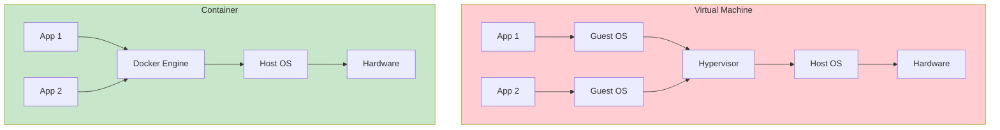
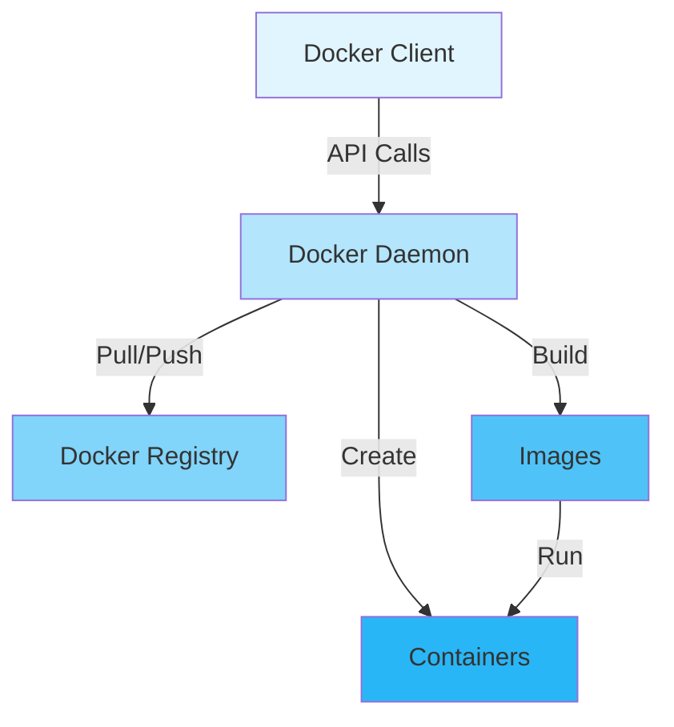
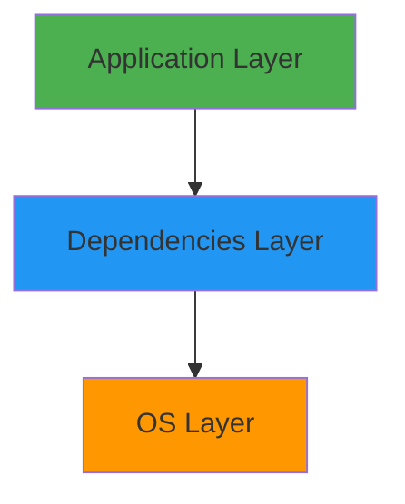
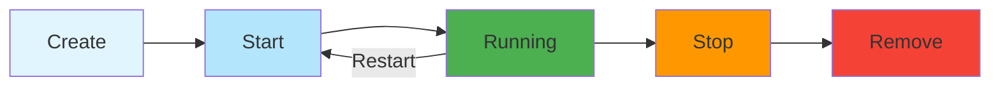
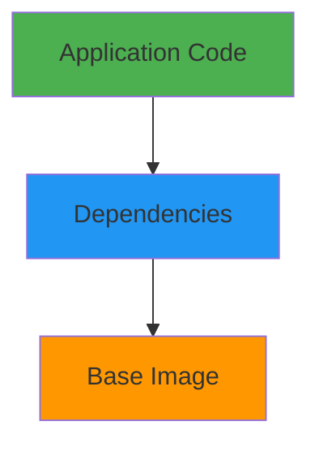
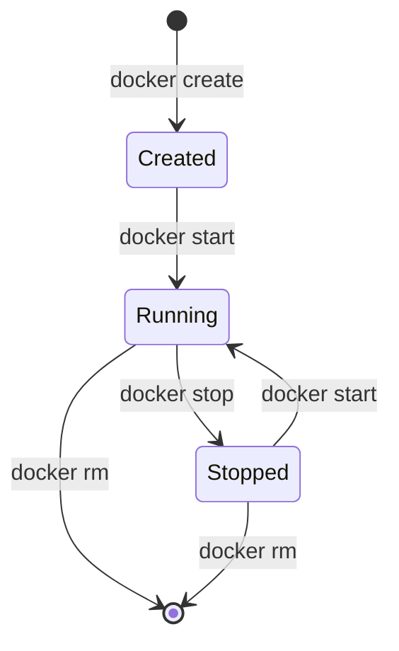

# Docker Basics

## Overview

Docker is a platform for developing, shipping, and running applications using containerization. Containers package applications with their dependencies, ensuring consistent behavior across different environments. This guide covers Docker fundamentals, including images, containers, Dockerfiles, Docker Compose, and best practices for containerizing applications.

## Deep Explanation

### What is Containerization?

Containerization packages an application and its dependencies into a lightweight, portable container that runs consistently across different environments.

#### Containers vs Virtual Machines



**Key Differences**:
- **VMs**: Full OS, heavier, slower startup
- **Containers**: Shared OS, lighter, faster startup

### Docker Architecture

#### Components

1. **Docker Engine**: Runtime and API
2. **Docker Images**: Read-only templates
3. **Docker Containers**: Running instances of images
4. **Dockerfile**: Instructions to build images
5. **Docker Registry**: Store and share images

#### Docker Architecture Diagram



### Docker Images

#### What is an Image?

An image is a read-only template with instructions for creating a container.

#### Image Layers

Images are built in layers:
- Each instruction creates a layer
- Layers are cached
- Shared layers reduce storage



#### Working with Images

```bash
# List images
docker images

# Pull image from registry
docker pull nginx:latest
docker pull node:18-alpine

# Search images
docker search nginx

# Remove image
docker rmi image-name
docker rmi image-id

# Inspect image
docker inspect image-name

# Image history
docker history image-name
```

### Docker Containers

#### What is a Container?

A container is a running instance of an image.

#### Container Lifecycle



#### Container Commands

```bash
# Run container
docker run nginx
docker run -d nginx                    # Detached mode
docker run -p 8080:80 nginx            # Port mapping
docker run -v /data:/app nginx         # Volume mount
docker run -e VAR=value nginx           # Environment variable
docker run --name my-nginx nginx        # Named container

# List containers
docker ps                               # Running
docker ps -a                            # All

# Start/Stop containers
docker start container-name
docker stop container-name
docker restart container-name

# Remove container
docker rm container-name
docker rm -f container-name             # Force remove

# Execute command in container
docker exec container-name ls
docker exec -it container-name bash     # Interactive

# View logs
docker logs container-name
docker logs -f container-name          # Follow

# Container stats
docker stats container-name
```

### Dockerfile

#### What is a Dockerfile?

A Dockerfile contains instructions for building a Docker image.

#### Dockerfile Instructions

```dockerfile
# FROM: Base image
FROM node:18-alpine

# WORKDIR: Set working directory
WORKDIR /app

# COPY: Copy files
COPY package*.json ./
COPY . .

# RUN: Execute commands
RUN npm install
RUN npm run build

# EXPOSE: Document port
EXPOSE 3000

# ENV: Environment variables
ENV NODE_ENV=production

# CMD: Default command
CMD ["node", "dist/index.js"]
```

#### Complete Dockerfile Example

```dockerfile
# Multi-stage build
FROM node:18-alpine AS builder
WORKDIR /app
COPY package*.json ./
RUN npm ci
COPY . .
RUN npm run build

# Production stage
FROM node:18-alpine AS production
WORKDIR /app
RUN addgroup -g 1001 -S nodejs && \
    adduser -S nodejs -u 1001
COPY package*.json ./
RUN npm ci --only=production && \
    npm cache clean --force
COPY --from=builder /app/dist ./dist
USER nodejs
EXPOSE 3000
HEALTHCHECK --interval=30s --timeout=3s \
  CMD node healthcheck.js
CMD ["node", "dist/index.js"]
```

#### Building Images

```bash
# Build image
docker build -t myapp:latest .
docker build -t myapp:v1.0.0 .
docker build -t myapp:latest -f Dockerfile.prod .

# Build with build args
docker build --build-arg NODE_ENV=production -t myapp .

# Build from different context
docker build -t myapp -f Dockerfile ../

# Tag image
docker tag myapp:latest myapp:v1.0.0
docker tag myapp:latest registry.com/myapp:latest
```

### Docker Compose

#### What is Docker Compose?

Docker Compose defines and runs multi-container applications.

#### docker-compose.yml

```yaml
version: '3.8'

services:
  web:
    build: .
    ports:
      - "3000:3000"
    environment:
      - NODE_ENV=production
      - DATABASE_URL=postgresql://db:5432/mydb
    depends_on:
      - db
    volumes:
      - ./logs:/app/logs
    networks:
      - app-network

  db:
    image: postgres:14-alpine
    environment:
      - POSTGRES_DB=mydb
      - POSTGRES_USER=user
      - POSTGRES_PASSWORD=password
    volumes:
      - db-data:/var/lib/postgresql/data
    networks:
      - app-network

  redis:
    image: redis:7-alpine
    ports:
      - "6379:6379"
    networks:
      - app-network

volumes:
  db-data:

networks:
  app-network:
    driver: bridge
```

#### Docker Compose Commands

```bash
# Start services
docker-compose up
docker-compose up -d              # Detached

# Stop services
docker-compose down
docker-compose down -v            # Remove volumes

# Build services
docker-compose build
docker-compose build --no-cache

# View logs
docker-compose logs
docker-compose logs -f web        # Follow specific service

# Execute command
docker-compose exec web bash
docker-compose exec db psql -U user -d mydb

# Scale services
docker-compose up --scale web=3

# Restart service
docker-compose restart web
```

### Volumes and Data Persistence

#### Types of Volumes

1. **Named Volumes**: Managed by Docker
2. **Bind Mounts**: Mount host directory
3. **tmpfs Mounts**: In-memory storage

#### Volume Examples

```bash
# Named volume
docker run -v mydata:/data nginx

# Bind mount
docker run -v /host/path:/container/path nginx

# tmpfs mount
docker run --tmpfs /tmp nginx

# Volume in docker-compose
volumes:
  - mydata:/data
```

#### Volume Management

```bash
# List volumes
docker volume ls

# Inspect volume
docker volume inspect volume-name

# Remove volume
docker volume rm volume-name
docker volume prune              # Remove unused
```

### Networking

#### Docker Networks

```bash
# List networks
docker network ls

# Create network
docker network create my-network

# Inspect network
docker network inspect my-network

# Connect container to network
docker network connect my-network container-name

# Remove network
docker network rm my-network
```

#### Network Types

1. **Bridge**: Default network for containers
2. **Host**: Use host network
3. **None**: No network
4. **Overlay**: Multi-host networking

#### Network Example

```bash
# Create network
docker network create app-network

# Run containers on network
docker run -d --name web --network app-network nginx
docker run -d --name db --network app-network postgres

# Containers can communicate by name
# web can reach db at "db:5432"
```

### Environment Variables

#### Setting Environment Variables

```bash
# Command line
docker run -e VAR=value nginx
docker run -e VAR1=value1 -e VAR2=value2 nginx

# From file
docker run --env-file .env nginx

# In docker-compose
environment:
  - VAR=value
  - VAR2=${HOST_VAR}
env_file:
  - .env
```

### Health Checks

#### Health Check in Dockerfile

```dockerfile
HEALTHCHECK --interval=30s --timeout=3s --start-period=5s --retries=3 \
  CMD curl -f http://localhost/health || exit 1
```

#### Health Check in docker-compose

```yaml
healthcheck:
  test: ["CMD", "curl", "-f", "http://localhost/health"]
  interval: 30s
  timeout: 3s
  retries: 3
  start_period: 40s
```

### Best Practices

#### 1. Use Multi-Stage Builds

```dockerfile
# Build stage
FROM node:18 AS builder
WORKDIR /app
COPY . .
RUN npm install && npm run build

# Production stage
FROM node:18-alpine
WORKDIR /app
COPY --from=builder /app/dist ./dist
COPY package.json ./
RUN npm ci --only=production
CMD ["node", "dist/index.js"]
```

#### 2. Minimize Image Size

```dockerfile
# Use alpine images
FROM node:18-alpine

# Remove unnecessary files
RUN npm install && \
    npm cache clean --force && \
    rm -rf /tmp/*
```

#### 3. Don't Run as Root

```dockerfile
RUN addgroup -g 1001 -S appgroup && \
    adduser -S appuser -u 1001
USER appuser
```

#### 4. Use .dockerignore

```dockerignore
node_modules
npm-debug.log
.git
.gitignore
README.md
.env
.nyc_output
coverage
```

#### 5. Layer Ordering

```dockerfile
# BAD: Changes frequently
COPY . .
RUN npm install

# GOOD: Changes infrequently first
COPY package*.json ./
RUN npm install
COPY . .
```

#### 6. Use Specific Tags

```dockerfile
# BAD
FROM node:latest

# GOOD
FROM node:18-alpine
```

## Diagrams

### Docker Image Layers



### Container Lifecycle



## Real Code Examples

### Complete Node.js Application Dockerfile

```dockerfile
# Build stage
FROM node:18-alpine AS builder

WORKDIR /app

# Copy package files
COPY package*.json ./

# Install dependencies
RUN npm ci

# Copy source code
COPY . .

# Build application
RUN npm run build

# Production stage
FROM node:18-alpine AS production

WORKDIR /app

# Create non-root user
RUN addgroup -g 1001 -S nodejs && \
    adduser -S nodejs -u 1001

# Copy package files
COPY package*.json ./

# Install production dependencies
RUN npm ci --only=production && \
    npm cache clean --force

# Copy built application from builder
COPY --from=builder /app/dist ./dist

# Set ownership
RUN chown -R nodejs:nodejs /app

# Switch to non-root user
USER nodejs

# Expose port
EXPOSE 3000

# Health check
HEALTHCHECK --interval=30s --timeout=3s --start-period=5s --retries=3 \
  CMD node -e "require('http').get('http://localhost:3000/health', (r) => {process.exit(r.statusCode === 200 ? 0 : 1)})"

# Start application
CMD ["node", "dist/index.js"]
```

### Complete Docker Compose Setup

```yaml
version: '3.8'

services:
  app:
    build:
      context: .
      dockerfile: Dockerfile
      target: production
    ports:
      - "3000:3000"
    environment:
      - NODE_ENV=production
      - DATABASE_URL=postgresql://postgres:password@db:5432/mydb
      - REDIS_URL=redis://redis:6379
    depends_on:
      db:
        condition: service_healthy
      redis:
        condition: service_started
    volumes:
      - app-logs:/app/logs
    networks:
      - app-network
    restart: unless-stopped
    healthcheck:
      test: ["CMD", "node", "-e", "require('http').get('http://localhost:3000/health', (r) => {process.exit(r.statusCode === 200 ? 0 : 1)})"]
      interval: 30s
      timeout: 3s
      retries: 3
      start_period: 40s

  db:
    image: postgres:14-alpine
    environment:
      - POSTGRES_DB=mydb
      - POSTGRES_USER=postgres
      - POSTGRES_PASSWORD=password
    volumes:
      - db-data:/var/lib/postgresql/data
    networks:
      - app-network
    restart: unless-stopped
    healthcheck:
      test: ["CMD-SHELL", "pg_isready -U postgres"]
      interval: 10s
      timeout: 5s
      retries: 5

  redis:
    image: redis:7-alpine
    command: redis-server --appendonly yes
    volumes:
      - redis-data:/data
    networks:
      - app-network
    restart: unless-stopped
    healthcheck:
      test: ["CMD", "redis-cli", "ping"]
      interval: 10s
      timeout: 3s
      retries: 5

  nginx:
    image: nginx:alpine
    ports:
      - "80:80"
      - "443:443"
    volumes:
      - ./nginx.conf:/etc/nginx/nginx.conf:ro
      - ./ssl:/etc/nginx/ssl:ro
    depends_on:
      - app
    networks:
      - app-network
    restart: unless-stopped

volumes:
  db-data:
  redis-data:
  app-logs:

networks:
  app-network:
    driver: bridge
```

### Build and Deploy Script

```bash
#!/bin/bash
# build-and-deploy.sh

set -e

IMAGE_NAME="myapp"
VERSION="${1:-latest}"
REGISTRY="registry.example.com"

echo "Building image..."
docker build -t "$IMAGE_NAME:$VERSION" .
docker tag "$IMAGE_NAME:$VERSION" "$REGISTRY/$IMAGE_NAME:$VERSION"
docker tag "$IMAGE_NAME:$VERSION" "$REGISTRY/$IMAGE_NAME:latest"

echo "Pushing to registry..."
docker push "$REGISTRY/$IMAGE_NAME:$VERSION"
docker push "$REGISTRY/$IMAGE_NAME:latest"

echo "Deploying..."
docker-compose pull
docker-compose up -d

echo "Waiting for health check..."
sleep 10
if docker-compose ps | grep -q "Up (healthy)"; then
    echo "Deployment successful!"
else
    echo "Deployment failed!"
    docker-compose logs
    exit 1
fi
```

## Hard Use-Case: Containerizing Legacy Application

### Problem

Legacy application with:
- Complex dependencies
- File system writes
- Multiple services
- No containerization experience

### Solution: Gradual Containerization

#### Step 1: Analyze Dependencies

```bash
# List all dependencies
npm list --depth=0
pip freeze > requirements.txt
```

#### Step 2: Create Basic Dockerfile

```dockerfile
FROM node:16
WORKDIR /app
COPY package*.json ./
RUN npm install
COPY . .
CMD ["node", "server.js"]
```

#### Step 3: Handle File System Writes

```dockerfile
# Use volumes for writes
VOLUME ["/app/uploads", "/app/logs"]
```

#### Step 4: Multi-Service Setup

```yaml
# docker-compose.yml
services:
  app:
    build: .
    volumes:
      - ./uploads:/app/uploads
      - ./logs:/app/logs
  db:
    image: postgres:13
```

#### Step 5: Optimize

```dockerfile
# Multi-stage build
FROM node:16-alpine AS builder
# ... build steps

FROM node:16-alpine
# ... production steps
```

## Edge Cases and Pitfalls

### 1. Large Image Sizes

**Problem**: Images too large

```dockerfile
# BAD: Includes build tools
FROM node:18
RUN npm install
```

**Solution**: Multi-stage builds, alpine images

```dockerfile
# GOOD: Multi-stage with alpine
FROM node:18-alpine AS builder
# ... build
FROM node:18-alpine
# ... production only
```

### 2. Running as Root

**Problem**: Security risk

```dockerfile
# BAD: Runs as root
FROM node:18
CMD ["node", "app.js"]
```

**Solution**: Create non-root user

```dockerfile
# GOOD: Non-root user
RUN adduser -D appuser
USER appuser
CMD ["node", "app.js"]
```

### 3. Not Using .dockerignore

**Problem**: Including unnecessary files

**Solution**: Create .dockerignore

```dockerignore
node_modules
.git
.env
*.log
```

### 4. Hardcoded Values

**Problem**: Hardcoded configuration

```dockerfile
# BAD
ENV DATABASE_URL=localhost:5432
```

**Solution**: Use environment variables

```dockerfile
# GOOD
ENV DATABASE_URL=${DATABASE_URL}
```

### 5. Not Handling Signals

**Problem**: Containers don't shut down gracefully

**Solution**: Handle SIGTERM

```dockerfile
# Use exec form of CMD
CMD ["node", "app.js"]  # Not: CMD node app.js
```

## References and Further Reading

- [Docker Documentation](https://docs.docker.com/) - Official Docker docs
- [Docker Best Practices](https://docs.docker.com/develop/dev-best-practices/) - Best practices
- [Docker Compose Documentation](https://docs.docker.com/compose/) - Compose guide
- [Container Patterns](https://www.docker.com/blog/containerized-patterns/) - Design patterns
- [Docker Security](https://docs.docker.com/engine/security/) - Security guide

## Quiz

### Question 1
What is the difference between a Docker image and a container?

**A)** They're the same  
**B)** An image is a template, a container is a running instance  
**C)** An image is running, a container is a template  
**D)** Images are for development, containers are for production

**Answer: B** - A Docker image is a read-only template used to create containers, while a container is a running instance of an image.

### Question 2
What Dockerfile instruction sets the default command for a container?

**A)** RUN  
**B)** CMD  
**C)** ENTRYPOINT  
**D)** EXEC

**Answer: B** - `CMD` sets the default command that runs when a container starts. `ENTRYPOINT` is similar but less easily overridden.

### Question 3
What is the purpose of multi-stage builds?

**A)** To run multiple containers  
**B)** To reduce final image size  
**C)** To speed up builds  
**D)** To add more features

**Answer: B** - Multi-stage builds allow you to use intermediate stages for building and then copy only necessary files to a smaller final image.

### Question 4
What command runs a container in detached mode?

**A)** `docker run -d`  
**B)** `docker run --detach`  
**C)** `docker run -t`  
**D)** `docker run --background`

**Answer: A** - The `-d` flag runs a container in detached mode, meaning it runs in the background.

### Question 5
What is Docker Compose used for?

**A)** Building images  
**B)** Managing multi-container applications  
**C)** Running single containers  
**D)** Managing Docker volumes

**Answer: B** - Docker Compose is used to define and run multi-container Docker applications using a YAML file.

## Related Topics

- [Introduction to DevOps](./01.%20Introduction%20to%20DevOps.md) - DevOps overview
- [Linux Fundamentals for DevOps](./03.%20Linux%20Fundamentals%20for%20DevOps.md) - Linux basics
- [Introduction to CI/CD](./04.%20Introduction%20to%20CI%CD.md) - CI/CD pipelines
- [Kubernetes Fundamentals](../02_intermediate/01.%20Kubernetes%20Fundamentals.md) - Container orchestration

