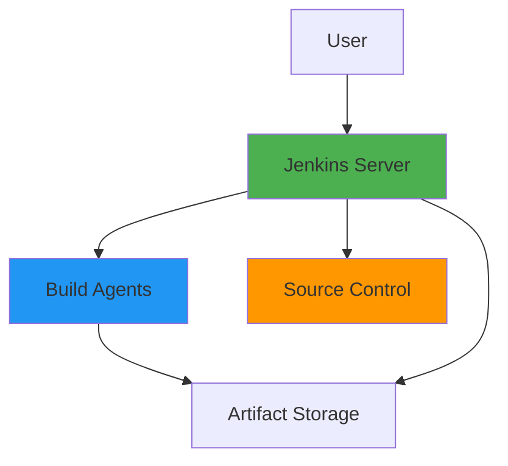
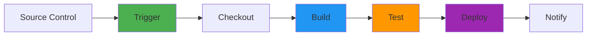
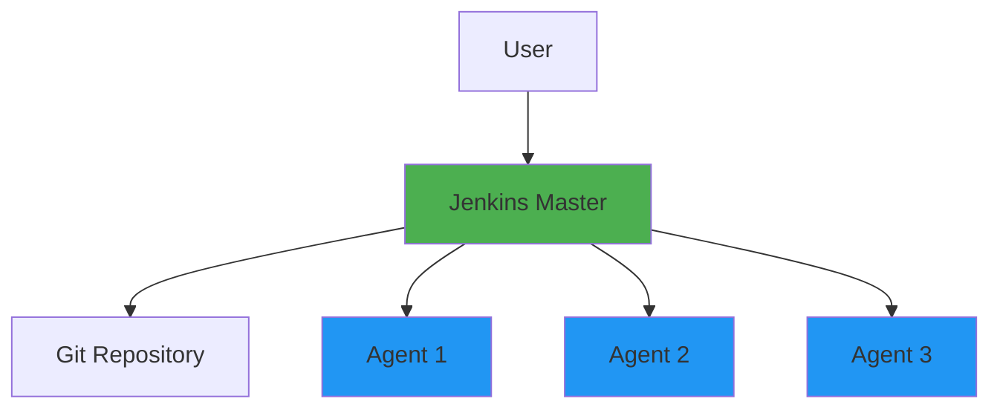

# Jenkins Fundamentals

## Overview

Jenkins is an open-source automation server that enables continuous integration and continuous delivery (CI/CD). It's one of the most widely used CI/CD tools, offering extensive plugin ecosystem, flexible pipeline configuration, and powerful automation capabilities. This guide covers Jenkins installation, pipeline creation, job configuration, plugins, and best practices.

## Deep Explanation

### What is Jenkins?

Jenkins is a self-contained, Java-based automation server that can be installed on any machine with Java support.

#### Jenkins Architecture



**Components**:
- **Jenkins Server**: Central controller
- **Build Agents**: Execute builds
- **Plugins**: Extend functionality
- **Jobs/Pipelines**: Automation definitions

### Installation

#### Docker Installation

```bash
# Run Jenkins in Docker
docker run -d \
  --name jenkins \
  -p 8080:8080 \
  -p 50000:50000 \
  -v jenkins_home:/var/jenkins_home \
  jenkins/jenkins:lts

# Access Jenkins
# http://localhost:8080
# Initial password: docker exec jenkins cat /var/jenkins_home/secrets/initialAdminPassword
```

#### Kubernetes Installation

```yaml
apiVersion: apps/v1
kind: Deployment
metadata:
  name: jenkins
spec:
  replicas: 1
  selector:
    matchLabels:
      app: jenkins
  template:
    metadata:
      labels:
        app: jenkins
    spec:
      containers:
      - name: jenkins
        image: jenkins/jenkins:lts
        ports:
        - containerPort: 8080
        - containerPort: 50000
        volumeMounts:
        - name: jenkins-home
          mountPath: /var/jenkins_home
      volumes:
      - name: jenkins-home
        persistentVolumeClaim:
          claimName: jenkins-pvc
---
apiVersion: v1
kind: Service
metadata:
  name: jenkins
spec:
  selector:
    app: jenkins
  ports:
  - port: 8080
    targetPort: 8080
  type: LoadBalancer
```

### Jenkins Jobs

#### Freestyle Project

**Configuration**:
1. **General**: Project name, description
2. **Source Code Management**: Git, SVN, etc.
3. **Build Triggers**: Polling, webhooks
4. **Build Steps**: Shell, batch, Maven, etc.
5. **Post-build Actions**: Archive artifacts, notifications

**Example Freestyle Job**:
```
1. Source Code Management: Git
   Repository: https://github.com/user/repo.git
   Branches: */main

2. Build Triggers:
   - Poll SCM: H/5 * * * * (every 5 minutes)

3. Build Steps:
   - Execute shell:
     npm install
     npm test
     npm run build

4. Post-build Actions:
   - Archive artifacts: dist/**
   - Email notification on failure
```

#### Pipeline Project

**Declarative Pipeline**:
```groovy
pipeline {
    agent any
    
    environment {
        NODE_VERSION = '18'
        APP_NAME = 'myapp'
    }
    
    stages {
        stage('Checkout') {
            steps {
                checkout scm
            }
        }
        
        stage('Build') {
            steps {
                sh 'npm install'
                sh 'npm run build'
            }
        }
        
        stage('Test') {
            steps {
                sh 'npm test'
            }
        }
        
        stage('Deploy') {
            when {
                branch 'main'
            }
            steps {
                sh './deploy.sh'
            }
        }
    }
    
    post {
        success {
            echo 'Pipeline succeeded!'
        }
        failure {
            emailext(
                subject: "Pipeline Failed: ${env.JOB_NAME}",
                body: "Build failed. Check console output.",
                to: "team@example.com"
            )
        }
    }
}
```

**Scripted Pipeline**:
```groovy
node {
    stage('Checkout') {
        checkout scm
    }
    
    stage('Build') {
        sh 'npm install'
        sh 'npm run build'
    }
    
    stage('Test') {
        sh 'npm test'
    }
    
    stage('Deploy') {
        if (env.BRANCH_NAME == 'main') {
            sh './deploy.sh'
        }
    }
}
```

### Jenkinsfile

#### Basic Jenkinsfile

```groovy
// Jenkinsfile
pipeline {
    agent any
    
    stages {
        stage('Build') {
            steps {
                echo 'Building application...'
                sh 'npm install && npm run build'
            }
        }
        
        stage('Test') {
            steps {
                echo 'Running tests...'
                sh 'npm test'
            }
        }
        
        stage('Deploy') {
            steps {
                echo 'Deploying application...'
                sh './deploy.sh'
            }
        }
    }
}
```

#### Advanced Jenkinsfile

```groovy
pipeline {
    agent any
    
    tools {
        nodejs 'NodeJS-18'
        maven 'Maven-3.8'
    }
    
    environment {
        DOCKER_REGISTRY = 'registry.example.com'
        IMAGE_TAG = "${env.BUILD_NUMBER}"
    }
    
    options {
        timeout(time: 1, unit: 'HOURS')
        retry(3)
        timestamps()
        ansiColor('xterm')
    }
    
    stages {
        stage('Checkout') {
            steps {
                checkout scm
            }
        }
        
        stage('Build') {
            parallel {
                stage('Build Frontend') {
                    steps {
                        dir('frontend') {
                            sh 'npm install'
                            sh 'npm run build'
                        }
                    }
                }
                stage('Build Backend') {
                    steps {
                        dir('backend') {
                            sh 'mvn clean package'
                        }
                    }
                }
            }
        }
        
        stage('Test') {
            parallel {
                stage('Unit Tests') {
                    steps {
                        sh 'npm test'
                        sh 'mvn test'
                    }
                }
                stage('Integration Tests') {
                    steps {
                        sh 'npm run test:integration'
                    }
                }
            }
            post {
                always {
                    junit '**/test-results.xml'
                    publishTestResults testResultsPattern: '**/test-results.xml'
                }
            }
        }
        
        stage('Build Docker Image') {
            steps {
                script {
                    def image = docker.build("${DOCKER_REGISTRY}/${APP_NAME}:${IMAGE_TAG}")
                    image.push()
                    image.push("latest")
                }
            }
        }
        
        stage('Deploy to Staging') {
            when {
                branch 'develop'
            }
            steps {
                sh "kubectl set image deployment/myapp myapp=${DOCKER_REGISTRY}/${APP_NAME}:${IMAGE_TAG}"
            }
        }
        
        stage('Deploy to Production') {
            when {
                branch 'main'
            }
            steps {
                input message: 'Deploy to production?', ok: 'Deploy'
                sh "kubectl set image deployment/myapp myapp=${DOCKER_REGISTRY}/${APP_NAME}:${IMAGE_TAG}"
            }
        }
    }
    
    post {
        always {
            cleanWs()
        }
        success {
            emailext(
                subject: "Pipeline Succeeded: ${env.JOB_NAME} #${env.BUILD_NUMBER}",
                body: "Build succeeded. Artifacts available.",
                to: "team@example.com"
            )
        }
        failure {
            emailext(
                subject: "Pipeline Failed: ${env.JOB_NAME} #${env.BUILD_NUMBER}",
                body: "Build failed. Check console output.",
                to: "team@example.com"
            )
        }
    }
}
```

### Build Agents

#### Agent Configuration

**Node Configuration**:
```
Name: build-agent-1
Description: Linux build agent
# of executors: 2
Remote root directory: /var/jenkins/agent
Labels: linux, docker
Launch method: SSH
Host: agent.example.com
Credentials: SSH key
```

**Docker Agent**:
```groovy
pipeline {
    agent {
        docker {
            image 'node:18'
            args '-v /var/jenkins_home:/workspace'
        }
    }
    
    stages {
        stage('Build') {
            steps {
                sh 'npm install && npm run build'
            }
        }
    }
}
```

**Kubernetes Agent**:
```groovy
pipeline {
    agent {
        kubernetes {
            yaml """
apiVersion: v1
kind: Pod
spec:
  containers:
  - name: node
    image: node:18
    command: ['sleep']
    args: ['99d']
"""
        }
    }
    
    stages {
        stage('Build') {
            steps {
                container('node') {
                    sh 'npm install && npm run build'
                }
            }
        }
    }
}
```

### Plugins

#### Essential Plugins

1. **Pipeline**: Pipeline as Code
2. **Git**: Git integration
3. **Docker Pipeline**: Docker support
4. **Kubernetes**: K8s integration
5. **Blue Ocean**: Modern UI
6. **Credentials Binding**: Secure credentials
7. **Email Extension**: Email notifications
8. **JUnit**: Test reporting

#### Installing Plugins

**Via UI**:
1. Manage Jenkins → Manage Plugins
2. Available plugins tab
3. Search and install

**Via CLI**:
```bash
jenkins-plugin-cli --plugins \
  pipeline \
  git \
  docker-workflow \
  kubernetes
```

**Via Configuration as Code**:
```yaml
# jenkins.yaml
jenkins:
  systemMessage: "Jenkins configured as code"
  
plugins:
  - name: pipeline
    version: latest
  - name: git
    version: latest
```

### Shared Libraries

#### Library Structure

```
vars/
  deploy.groovy
  notify.groovy
src/
  com/example/
    DeployUtils.groovy
```

#### Using Shared Libraries

```groovy
// Jenkinsfile
@Library('my-shared-library') _

pipeline {
    agent any
    
    stages {
        stage('Deploy') {
            steps {
                deploy(
                    environment: 'production',
                    image: 'myapp:latest'
                )
            }
        }
    }
    
    post {
        always {
            notify(
                status: currentBuild.result,
                channel: '#deployments'
            )
        }
    }
}
```

**Library Code** (`vars/deploy.groovy`):
```groovy
def call(Map config) {
    echo "Deploying to ${config.environment}"
    sh """
        kubectl set image deployment/myapp \
          myapp=${config.image} \
          -n ${config.environment}
    """
}
```

### Security

#### Credentials Management

**Creating Credentials**:
1. Manage Jenkins → Manage Credentials
2. Add Credentials
3. Select type (SSH, Username/Password, Secret text, etc.)
4. Configure and save

**Using Credentials in Pipeline**:
```groovy
pipeline {
    agent any
    
    environment {
        DOCKER_CREDENTIALS = credentials('docker-registry-credentials')
    }
    
    stages {
        stage('Build') {
            steps {
                sh """
                    docker login -u ${DOCKER_CREDENTIALS_USR} \
                      -p ${DOCKER_CREDENTIALS_PSW} \
                      registry.example.com
                """
            }
        }
    }
}
```

**With Credentials Binding**:
```groovy
stage('Deploy') {
    steps {
        withCredentials([
            usernamePassword(
                credentialsId: 'aws-credentials',
                usernameVariable: 'AWS_ACCESS_KEY_ID',
                passwordVariable: 'AWS_SECRET_ACCESS_KEY'
            )
        ]) {
            sh 'aws s3 sync . s3://my-bucket'
        }
    }
}
```

### Best Practices

#### 1. Use Jenkinsfile

Store pipeline definitions in version control:
```groovy
// Jenkinsfile in repository
pipeline {
    agent any
    // ...
}
```

#### 2. Use Shared Libraries

Reuse common functionality:
```groovy
@Library('shared-library') _
```

#### 3. Parallel Execution

Speed up pipelines:
```groovy
stage('Test') {
    parallel {
        stage('Unit Tests') {
            steps {
                sh 'npm test'
            }
        }
        stage('Integration Tests') {
            steps {
                sh 'npm run test:integration'
            }
        }
    }
}
```

#### 4. Artifact Management

Archive and publish artifacts:
```groovy
post {
    always {
        archiveArtifacts artifacts: 'dist/**', fingerprint: true
        publishTestResults testResultsPattern: '**/test-results.xml'
    }
}
```

#### 5. Notifications

Keep team informed:
```groovy
post {
    failure {
        emailext(
            subject: "Build Failed: ${env.JOB_NAME}",
            body: "Check console output for details.",
            to: "team@example.com"
        )
    }
}
```

## Diagrams

### Jenkins Pipeline Flow



### Jenkins Architecture



## Real Code Examples

### Complete CI/CD Pipeline

```groovy
pipeline {
    agent any
    
    tools {
        nodejs 'NodeJS-18'
        docker 'Docker'
    }
    
    environment {
        DOCKER_REGISTRY = 'registry.example.com'
        IMAGE_NAME = 'myapp'
        KUBERNETES_NAMESPACE = 'production'
    }
    
    options {
        timeout(time: 1, unit: 'HOURS')
        timestamps()
        ansiColor('xterm')
        buildDiscarder(logRotator(numToKeepStr: '10'))
    }
    
    stages {
        stage('Checkout') {
            steps {
                checkout scm
                script {
                    env.GIT_COMMIT_SHORT = sh(
                        script: 'git rev-parse --short HEAD',
                        returnStdout: true
                    ).trim()
                }
            }
        }
        
        stage('Install Dependencies') {
            steps {
                sh 'npm ci'
            }
        }
        
        stage('Lint') {
            steps {
                sh 'npm run lint'
            }
        }
        
        stage('Test') {
            parallel {
                stage('Unit Tests') {
                    steps {
                        sh 'npm run test:unit'
                    }
                    post {
                        always {
                            junit 'test-results/unit/*.xml'
                        }
                    }
                }
                stage('Integration Tests') {
                    steps {
                        sh 'npm run test:integration'
                    }
                    post {
                        always {
                            junit 'test-results/integration/*.xml'
                        }
                    }
                }
            }
        }
        
        stage('Build') {
            steps {
                sh 'npm run build'
            }
            post {
                success {
                    archiveArtifacts artifacts: 'dist/**', fingerprint: true
                }
            }
        }
        
        stage('Build Docker Image') {
            steps {
                script {
                    def imageTag = "${env.DOCKER_REGISTRY}/${env.IMAGE_NAME}:${env.BUILD_NUMBER}"
                    def image = docker.build(imageTag, '--build-arg NODE_ENV=production .')
                    
                    withCredentials([
                        usernamePassword(
                            credentialsId: 'docker-registry',
                            usernameVariable: 'DOCKER_USER',
                            passwordVariable: 'DOCKER_PASS'
                        )
                    ]) {
                        sh """
                            docker login -u ${DOCKER_USER} -p ${DOCKER_PASS} ${env.DOCKER_REGISTRY}
                            docker push ${imageTag}
                            docker tag ${imageTag} ${env.DOCKER_REGISTRY}/${env.IMAGE_NAME}:latest
                            docker push ${env.DOCKER_REGISTRY}/${env.IMAGE_NAME}:latest
                        """
                    }
                }
            }
        }
        
        stage('Security Scan') {
            steps {
                sh 'trivy image ${DOCKER_REGISTRY}/${env.IMAGE_NAME}:${env.BUILD_NUMBER}'
            }
        }
        
        stage('Deploy to Staging') {
            when {
                branch 'develop'
            }
            steps {
                script {
                    sh """
                        kubectl set image deployment/myapp \
                          myapp=${env.DOCKER_REGISTRY}/${env.IMAGE_NAME}:${env.BUILD_NUMBER} \
                          -n staging
                        kubectl rollout status deployment/myapp -n staging
                    """
                }
            }
        }
        
        stage('Deploy to Production') {
            when {
                branch 'main'
            }
            steps {
                script {
                    def userInput = input(
                        message: 'Deploy to production?',
                        ok: 'Deploy',
                        parameters: [
                            choice(
                                name: 'ENVIRONMENT',
                                choices: ['production', 'production-blue-green'],
                                description: 'Select deployment strategy'
                            )
                        ]
                    )
                    
                    if (userInput == 'production-blue-green') {
                        sh './scripts/blue-green-deploy.sh'
                    } else {
                        sh """
                            kubectl set image deployment/myapp \
                              myapp=${env.DOCKER_REGISTRY}/${env.IMAGE_NAME}:${env.BUILD_NUMBER} \
                              -n ${env.KUBERNETES_NAMESPACE}
                            kubectl rollout status deployment/myapp -n ${env.KUBERNETES_NAMESPACE}
                        """
                    }
                }
            }
        }
    }
    
    post {
        always {
            cleanWs()
            script {
                def duration = currentBuild.durationString
                echo "Pipeline duration: ${duration}"
            }
        }
        success {
            emailext(
                subject: "✅ Build Succeeded: ${env.JOB_NAME} #${env.BUILD_NUMBER}",
                body: """
                    <h2>Build Succeeded</h2>
                    <p><b>Job:</b> ${env.JOB_NAME}</p>
                    <p><b>Build Number:</b> ${env.BUILD_NUMBER}</p>
                    <p><b>Commit:</b> ${env.GIT_COMMIT_SHORT}</p>
                    <p><b>Branch:</b> ${env.BRANCH_NAME}</p>
                    <p><a href="${env.BUILD_URL}">View Build</a></p>
                """,
                mimeType: 'text/html',
                to: "team@example.com"
            )
        }
        failure {
            emailext(
                subject: "❌ Build Failed: ${env.JOB_NAME} #${env.BUILD_NUMBER}",
                body: """
                    <h2>Build Failed</h2>
                    <p><b>Job:</b> ${env.JOB_NAME}</p>
                    <p><b>Build Number:</b> ${env.BUILD_NUMBER}</p>
                    <p><b>Commit:</b> ${env.GIT_COMMIT_SHORT}</p>
                    <p><b>Branch:</b> ${env.BRANCH_NAME}</p>
                    <p><a href="${env.BUILD_URL}">View Build</a></p>
                """,
                mimeType: 'text/html',
                to: "team@example.com"
            )
        }
        unstable {
            echo 'Build is unstable'
        }
    }
}
```

### Multi-Branch Pipeline

```groovy
pipeline {
    agent any
    
    stages {
        stage('Build') {
            steps {
                sh 'npm install && npm run build'
            }
        }
        
        stage('Test') {
            steps {
                sh 'npm test'
            }
        }
        
        stage('Deploy') {
            when {
                anyOf {
                    branch 'main'
                    branch 'develop'
                }
            }
            steps {
                script {
                    if (env.BRANCH_NAME == 'main') {
                        sh './deploy-production.sh'
                    } else if (env.BRANCH_NAME == 'develop') {
                        sh './deploy-staging.sh'
                    }
                }
            }
        }
    }
}
```

## Hard Use-Case: Blue-Green Deployment Pipeline

### Problem

Implement zero-downtime deployment with rollback capability.

### Solution: Blue-Green Deployment Pipeline

```groovy
pipeline {
    agent any
    
    environment {
        DOCKER_REGISTRY = 'registry.example.com'
        APP_NAME = 'myapp'
        BLUE_PORT = '8080'
        GREEN_PORT = '8081'
    }
    
    stages {
        stage('Build') {
            steps {
                sh 'docker build -t ${DOCKER_REGISTRY}/${APP_NAME}:${BUILD_NUMBER} .'
                sh 'docker push ${DOCKER_REGISTRY}/${APP_NAME}:${BUILD_NUMBER}'
            }
        }
        
        stage('Determine Current Color') {
            steps {
                script {
                    def currentService = sh(
                        script: 'kubectl get service myapp -o jsonpath="{.spec.selector.version}"',
                        returnStdout: true
                    ).trim()
                    
                    env.CURRENT_COLOR = currentService == 'blue' ? 'blue' : 'green'
                    env.NEW_COLOR = env.CURRENT_COLOR == 'blue' ? 'green' : 'blue'
                    env.NEW_PORT = env.NEW_COLOR == 'blue' ? env.BLUE_PORT : env.GREEN_PORT
                }
            }
        }
        
        stage('Deploy New Version') {
            steps {
                script {
                    sh """
                        kubectl set image deployment/myapp-${env.NEW_COLOR} \
                          myapp=${DOCKER_REGISTRY}/${APP_NAME}:${BUILD_NUMBER}
                        kubectl rollout status deployment/myapp-${env.NEW_COLOR}
                    """
                }
            }
        }
        
        stage('Health Check') {
            steps {
                script {
                    def healthy = false
                    def retries = 10
                    
                    for (int i = 0; i < retries; i++) {
                        def status = sh(
                            script: "curl -f http://localhost:${env.NEW_PORT}/health",
                            returnStdout: true,
                            returnStatus: true
                        )
                        
                        if (status == 0) {
                            healthy = true
                            break
                        }
                        sleep(5)
                    }
                    
                    if (!healthy) {
                        error('Health check failed')
                    }
                }
            }
        }
        
        stage('Switch Traffic') {
            steps {
                script {
                    sh """
                        kubectl patch service myapp -p '{"spec":{"selector":{"version":"${env.NEW_COLOR}"}}}'
                    """
                }
            }
        }
        
        stage('Verify') {
            steps {
                script {
                    sleep(30)
                    def errors = sh(
                        script: 'kubectl logs -l app=myapp --tail=100 | grep -i error | wc -l',
                        returnStdout: true
                    ).trim().toInteger()
                    
                    if (errors > 10) {
                        error('Too many errors detected')
                    }
                }
            }
        }
    }
    
    post {
        failure {
            script {
                // Rollback to previous color
                sh """
                    kubectl patch service myapp -p '{"spec":{"selector":{"version":"${env.CURRENT_COLOR}"}}}'
                """
            }
        }
    }
}
```

## Edge Cases and Pitfalls

### 1. Not Cleaning Workspace

**Problem**: Disk space issues

**Solution**: Always clean workspace

```groovy
post {
    always {
        cleanWs()
    }
}
```

### 2. Hardcoded Credentials

**Problem**: Security risk

**Solution**: Use credentials binding

```groovy
withCredentials([
    usernamePassword(
        credentialsId: 'my-credentials',
        usernameVariable: 'USER',
        passwordVariable: 'PASS'
    )
]) {
    sh 'command using $USER and $PASS'
}
```

### 3. Not Handling Failures

**Problem**: Unclear failure reasons

**Solution**: Proper error handling

```groovy
stage('Deploy') {
    steps {
        script {
            try {
                sh './deploy.sh'
            } catch (Exception e) {
                echo "Deployment failed: ${e.message}"
                sh './rollback.sh'
                throw e
            }
        }
    }
}
```

## References and Further Reading

- [Jenkins Documentation](https://www.jenkins.io/doc/) - Official docs
- [Pipeline Syntax](https://www.jenkins.io/doc/book/pipeline/syntax/) - Pipeline reference
- [Jenkins Plugins](https://plugins.jenkins.io/) - Plugin repository
- [Blue Ocean](https://www.jenkins.io/doc/book/blueocean/) - Modern UI

## Quiz

### Question 1
What is a Jenkinsfile?

**A)** A configuration file  
**B)** Pipeline definition stored in version control  
**C)** A plugin  
**D)** A build agent

**Answer: B** - Jenkinsfile is a text file that defines the pipeline as code, typically stored in version control.

### Question 2
What is the difference between declarative and scripted pipelines?

**A)** They're the same  
**B)** Declarative is simpler, scripted is more flexible  
**C)** Scripted is simpler  
**D)** No difference

**Answer: B** - Declarative pipelines use a simpler syntax, while scripted pipelines offer more flexibility with Groovy code.

### Question 3
What are Jenkins agents used for?

**A)** Storing artifacts  
**B)** Executing builds  
**C)** Managing plugins  
**D)** Storing credentials

**Answer: B** - Jenkins agents (nodes) are used to execute builds and distribute the workload.

### Question 4
What is a shared library in Jenkins?

**A)** A plugin  
**B)** Reusable pipeline code  
**C)** A build agent  
**D)** A credential

**Answer: B** - Shared libraries contain reusable pipeline code that can be used across multiple pipelines.

### Question 5
What should you use to store sensitive information in Jenkins?

**A)** Hardcode in pipeline  
**B)** Credentials management  
**C)** Environment variables  
**D)** Comments

**Answer: B** - Jenkins credentials management securely stores sensitive information like passwords and API keys.

## Related Topics

- [Introduction to CI/CD](./04.%20Introduction%20to%20CI%CD.md) - CI/CD concepts
- [Git Fundamentals & Workflows](./02.%20Git%20Fundamentals%20%26%20Workflows.md) - Version control
- [Docker Basics](./05.%20Docker%20Basics.md) - Containerization

