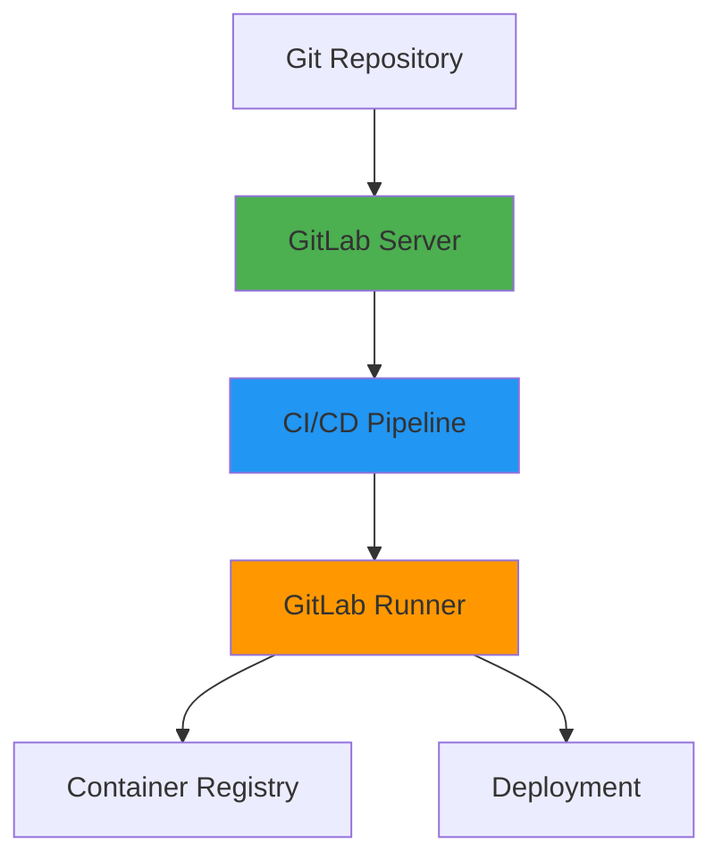
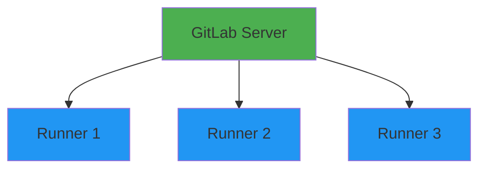

# GitLab CI/CD

## Overview

GitLab CI/CD is a built-in continuous integration and deployment tool integrated with GitLab. It uses a YAML-based configuration file (.gitlab-ci.yml) to define pipelines that automatically build, test, and deploy applications. This guide covers GitLab CI/CD fundamentals, pipeline configuration, runners, jobs, stages, and best practices.

## Deep Explanation

### What is GitLab CI/CD?

GitLab CI/CD is GitLab's integrated continuous integration and deployment platform that automates the software development lifecycle.

#### GitLab CI/CD Architecture



**Components**:
- **GitLab Server**: Hosts repositories and CI/CD
- **GitLab Runner**: Executes jobs
- **Pipeline**: Defined in `.gitlab-ci.yml`
- **Jobs**: Individual tasks in pipeline

### GitLab CI/CD Configuration

#### Basic .gitlab-ci.yml

```yaml
# .gitlab-ci.yml
stages:
  - build
  - test
  - deploy

build:
  stage: build
  script:
    - echo "Building application..."
    - npm install
    - npm run build
  artifacts:
    paths:
      - dist/
    expire_in: 1 week

test:
  stage: test
  script:
    - echo "Running tests..."
    - npm test
  coverage: '/Coverage: \d+\.\d+%/'

deploy:
  stage: deploy
  script:
    - echo "Deploying application..."
    - ./deploy.sh
  only:
    - main
```

#### Pipeline Stages

**Stage Execution**:


**Stage Definition**:
```yaml
stages:
  - build
  - test
  - security
  - deploy
  - cleanup
```

### Jobs

#### Job Configuration

**Basic Job**:
```yaml
job_name:
  script:
    - echo "Hello, GitLab CI!"
```

**Complete Job**:
```yaml
build_app:
  stage: build
  image: node:18
  before_script:
    - npm ci
  script:
    - npm run build
  after_script:
    - echo "Build completed"
  artifacts:
    paths:
      - dist/
    when: on_success
  only:
    - main
    - develop
  except:
    - tags
```

#### Job Keywords

**image**: Docker image to use
```yaml
job:
  image: node:18-alpine
```

**services**: Additional Docker services
```yaml
test:
  image: node:18
  services:
    - postgres:14
    - redis:7
```

**variables**: Environment variables
```yaml
job:
  variables:
    NODE_ENV: production
    API_URL: https://api.example.com
```

**cache**: Cache dependencies
```yaml
job:
  cache:
    key: ${CI_COMMIT_REF_SLUG}
    paths:
      - node_modules/
```

**artifacts**: Files to pass between jobs
```yaml
build:
  artifacts:
    paths:
      - dist/
    expire_in: 1 week
    reports:
      junit: test-results.xml
```

### Runners

#### What are Runners?

Runners are agents that execute jobs in GitLab CI/CD pipelines.

#### Runner Types

**Shared Runners**: Available to all projects
**Group Runners**: Available to group projects
**Project Runners**: Specific to one project

#### Installing GitLab Runner

**Docker**:
```bash
docker run -d --name gitlab-runner --restart always \
  -v /srv/gitlab-runner/config:/etc/gitlab-runner \
  -v /var/run/docker.sock:/var/run/docker.sock \
  gitlab/gitlab-runner:latest
```

**Kubernetes**:
```yaml
apiVersion: apps/v1
kind: Deployment
metadata:
  name: gitlab-runner
spec:
  replicas: 2
  template:
    spec:
      containers:
      - name: gitlab-runner
        image: gitlab/gitlab-runner:latest
        env:
        - name: CI_SERVER_URL
          value: "https://gitlab.com"
        - name: REGISTRATION_TOKEN
          valueFrom:
            secretKeyRef:
              name: gitlab-runner-secret
              key: token
```

**Register Runner**:
```bash
gitlab-runner register \
  --url https://gitlab.com/ \
  --registration-token YOUR_TOKEN \
  --executor docker \
  --docker-image alpine:latest \
  --description "My Docker Runner"
```

#### Runner Tags

**Tagged Jobs**:
```yaml
deploy_production:
  tags:
    - production
    - docker
  script:
    - ./deploy.sh
```

### Advanced Pipeline Features

#### Parallel Jobs

```yaml
test:
  stage: test
  parallel:
    matrix:
      - NODE_VERSION: ["16", "18", "20"]
        OS: ["ubuntu-latest", "windows-latest"]
  image: node:${NODE_VERSION}
  script:
    - npm test
```

#### Conditional Jobs

```yaml
deploy_staging:
  stage: deploy
  script:
    - ./deploy.sh staging
  only:
    - develop
  when: manual

deploy_production:
  stage: deploy
  script:
    - ./deploy.sh production
  only:
    - main
  when: manual
  environment:
    name: production
    url: https://app.example.com
```

#### Job Dependencies

```yaml
build:
  stage: build
  script:
    - npm run build
  artifacts:
    paths:
      - dist/

test:
  stage: test
  dependencies:
    - build
  script:
    - npm test

deploy:
  stage: deploy
  dependencies:
    - build
  script:
    - ./deploy.sh
```

#### Includes

**Include External Files**:
```yaml
# .gitlab-ci.yml
include:
  - local: '/templates/.gitlab-ci-template.yml'
  - remote: 'https://example.com/ci-template.yml'
  - template: Auto-DevOps.gitlab-ci.yml

stages:
  - build
  - test
```

**Template File** (`templates/.gitlab-ci-template.yml`):
```yaml
.build_template: &build_template
  stage: build
  script:
    - echo "Building..."
    - npm run build
  artifacts:
    paths:
      - dist/

build_app:
  <<: *build_template
  image: node:18
```

### GitLab Container Registry

#### Using Container Registry

```yaml
build_image:
  stage: build
  script:
    - docker build -t $CI_REGISTRY_IMAGE:$CI_COMMIT_SHA .
    - docker push $CI_REGISTRY_IMAGE:$CI_COMMIT_SHA
    - docker tag $CI_REGISTRY_IMAGE:$CI_COMMIT_SHA $CI_REGISTRY_IMAGE:latest
    - docker push $CI_REGISTRY_IMAGE:latest
```

#### Login to Registry

```yaml
build:
  before_script:
    - docker login -u $CI_REGISTRY_USER -p $CI_REGISTRY_PASSWORD $CI_REGISTRY
  script:
    - docker build -t $CI_REGISTRY_IMAGE .
    - docker push $CI_REGISTRY_IMAGE
```

### Environments and Deployments

#### Environment Configuration

```yaml
deploy_staging:
  stage: deploy
  script:
    - ./deploy.sh staging
  environment:
    name: staging
    url: https://staging.example.com
    on_stop: stop_staging

stop_staging:
  stage: deploy
  script:
    - ./stop.sh staging
  environment:
    name: staging
    action: stop
  when: manual
  only:
    - develop
```

#### Deployment Tracking

```yaml
deploy:
  stage: deploy
  script:
    - ./deploy.sh
  environment:
    name: production
    url: https://app.example.com
    deployment_tier: production
```

### Security Scanning

#### SAST (Static Application Security Testing)

```yaml
sast:
  stage: test
  include:
    - template: Security/SAST.gitlab-ci.yml
```

#### Dependency Scanning

```yaml
dependency_scanning:
  stage: test
  include:
    - template: Security/Dependency-Scanning.gitlab-ci.yml
```

#### Container Scanning

```yaml
container_scanning:
  stage: test
  include:
    - template: Security/Container-Scanning.gitlab-ci.yml
```

### Complete Pipeline Example

```yaml
# .gitlab-ci.yml
stages:
  - build
  - test
  - security
  - deploy

variables:
  DOCKER_DRIVER: overlay2
  DOCKER_TLS_CERTDIR: "/certs"

build:
  stage: build
  image: docker:latest
  services:
    - docker:dind
  before_script:
    - docker login -u $CI_REGISTRY_USER -p $CI_REGISTRY_PASSWORD $CI_REGISTRY
  script:
    - docker build -t $CI_REGISTRY_IMAGE:$CI_COMMIT_SHA .
    - docker build -t $CI_REGISTRY_IMAGE:latest .
    - docker push $CI_REGISTRY_IMAGE:$CI_COMMIT_SHA
    - docker push $CI_REGISTRY_IMAGE:latest
  only:
    - main
    - develop

test:
  stage: test
  image: node:18
  cache:
    key: ${CI_COMMIT_REF_SLUG}
    paths:
      - node_modules/
  before_script:
    - npm ci
  script:
    - npm run lint
    - npm test
    - npm run test:integration
  coverage: '/Coverage: \d+\.\d+%/'
  artifacts:
    reports:
      junit: test-results.xml
      coverage_report:
        coverage_format: cobertura
        path: coverage/cobertura-coverage.xml
    expire_in: 1 week

security_scan:
  stage: security
  image: node:18
  script:
    - npm audit
    - npm run security-scan
  allow_failure: true

deploy_staging:
  stage: deploy
  image: alpine:latest
  script:
    - apk add --no-cache curl
    - curl -X POST https://api.example.com/deploy \
        -H "Authorization: Bearer $DEPLOY_TOKEN" \
        -d "environment=staging&image=$CI_REGISTRY_IMAGE:$CI_COMMIT_SHA"
  environment:
    name: staging
    url: https://staging.example.com
  only:
    - develop
  when: manual

deploy_production:
  stage: deploy
  image: alpine:latest
  script:
    - apk add --no-cache curl
    - curl -X POST https://api.example.com/deploy \
        -H "Authorization: Bearer $DEPLOY_TOKEN" \
        -d "environment=production&image=$CI_REGISTRY_IMAGE:$CI_COMMIT_SHA"
  environment:
    name: production
    url: https://app.example.com
  only:
    - main
  when: manual
  dependencies:
    - test
```

## Diagrams

### GitLab CI/CD Pipeline Flow


### Runner Architecture



## Real Code Examples

### Multi-Stage Pipeline with Docker

```yaml
# .gitlab-ci.yml
image: docker:latest

services:
  - docker:dind

variables:
  DOCKER_DRIVER: overlay2
  DOCKER_TLS_CERTDIR: "/certs"
  IMAGE_TAG: $CI_REGISTRY_IMAGE:$CI_COMMIT_SHORT_SHA

stages:
  - build
  - test
  - security
  - build-image
  - deploy

before_script:
  - docker login -u $CI_REGISTRY_USER -p $CI_REGISTRY_PASSWORD $CI_REGISTRY

build:
  stage: build
  image: node:18
  cache:
    key: ${CI_COMMIT_REF_SLUG}
    paths:
      - node_modules/
  script:
    - npm ci
    - npm run build
  artifacts:
    paths:
      - dist/
    expire_in: 1 week

test:
  stage: test
  image: node:18
  cache:
    key: ${CI_COMMIT_REF_SLUG}
    paths:
      - node_modules/
  dependencies:
    - build
  script:
    - npm ci
    - npm run test:unit
    - npm run test:integration
  coverage: '/Coverage: \d+\.\d+%/'
  artifacts:
    reports:
      junit: test-results.xml

security:
  stage: security
  image: node:18
  script:
    - npm audit --audit-level=high
    - npm run security-scan
  allow_failure: true

build_image:
  stage: build-image
  script:
    - docker build -t $IMAGE_TAG .
    - docker build -t $CI_REGISTRY_IMAGE:latest .
    - docker push $IMAGE_TAG
    - docker push $CI_REGISTRY_IMAGE:latest
  only:
    - main
    - develop

deploy_staging:
  stage: deploy
  image: alpine:latest
  script:
    - apk add --no-cache kubectl
    - kubectl set image deployment/myapp myapp=$IMAGE_TAG -n staging
    - kubectl rollout status deployment/myapp -n staging
  environment:
    name: staging
    url: https://staging.example.com
  only:
    - develop
  when: manual

deploy_production:
  stage: deploy
  image: alpine:latest
  script:
    - apk add --no-cache kubectl
    - kubectl set image deployment/myapp myapp=$IMAGE_TAG -n production
    - kubectl rollout status deployment/myapp -n production
  environment:
    name: production
    url: https://app.example.com
  only:
    - main
  when: manual
```

### Matrix Builds

```yaml
test:
  stage: test
  parallel:
    matrix:
      - NODE_VERSION: ["16", "18", "20"]
        OS: ["ubuntu-latest"]
      - NODE_VERSION: ["18"]
        OS: ["ubuntu-latest", "windows-latest"]
  image: node:${NODE_VERSION}
  script:
    - npm ci
    - npm test
```

### Parent-Child Pipelines

**Parent Pipeline**:
```yaml
# .gitlab-ci.yml
stages:
  - triggers

trigger_microservices:
  stage: triggers
  trigger:
    include:
      - local: microservices/.gitlab-ci.yml
    strategy: depend
```

**Child Pipeline** (`microservices/.gitlab-ci.yml`):
```yaml
stages:
  - build
  - test

build_service_a:
  stage: build
  script:
    - cd service-a && npm run build

build_service_b:
  stage: build
  script:
    - cd service-b && npm run build
```

## Hard Use-Case: Blue-Green Deployment Pipeline

### Problem

Implement zero-downtime deployment with GitLab CI/CD.

### Solution: Blue-Green Deployment

```yaml
stages:
  - build
  - deploy-blue
  - test-blue
  - deploy-green
  - switch-traffic
  - cleanup

build:
  stage: build
  script:
    - docker build -t $CI_REGISTRY_IMAGE:$CI_COMMIT_SHA .
    - docker push $CI_REGISTRY_IMAGE:$CI_COMMIT_SHA

deploy_blue:
  stage: deploy-blue
  script:
    - kubectl apply -f k8s/blue-deployment.yaml
    - kubectl set image deployment/app-blue app=$CI_REGISTRY_IMAGE:$CI_COMMIT_SHA
    - kubectl rollout status deployment/app-blue
  environment:
    name: blue
    action: start

test_blue:
  stage: test-blue
  script:
    - ./scripts/health-check.sh blue
    - ./scripts/smoke-tests.sh blue

deploy_green:
  stage: deploy-green
  script:
    - kubectl apply -f k8s/green-deployment.yaml
    - kubectl set image deployment/app-green app=$CI_REGISTRY_IMAGE:$CI_COMMIT_SHA
    - kubectl rollout status deployment/app-green
  environment:
    name: green
    action: start

switch_traffic:
  stage: switch-traffic
  script:
    - kubectl patch service app-service -p '{"spec":{"selector":{"version":"green"}}}'
  environment:
    name: production
    action: start
  when: manual

cleanup_blue:
  stage: cleanup
  script:
    - kubectl delete deployment app-blue
  environment:
    name: blue
    action: stop
  when: manual
```

## Edge Cases and Pitfalls

### 1. Cache Key Issues

**Problem**: Cache not working

**Solution**: Use proper cache keys

```yaml
# BAD
cache:
  paths:
    - node_modules/

# GOOD
cache:
  key: ${CI_COMMIT_REF_SLUG}
  paths:
    - node_modules/
```

### 2. Artifact Expiration

**Problem**: Artifacts expired before use

**Solution**: Set appropriate expiration

```yaml
artifacts:
  paths:
    - dist/
  expire_in: 1 week  # Adjust based on needs
```

### 3. Runner Capacity

**Problem**: Jobs waiting for runners

**Solution**: Scale runners or use tags

```yaml
job:
  tags:
    - specific-runner
```

## References and Further Reading

- [GitLab CI/CD Documentation](https://docs.gitlab.com/ee/ci/) - Official docs
- [GitLab CI/CD YAML Reference](https://docs.gitlab.com/ee/ci/yaml/) - YAML reference
- [GitLab Runners](https://docs.gitlab.com/runner/) - Runner documentation

## Quiz

### Question 1
What file defines GitLab CI/CD pipelines?

**A)** pipeline.yml  
**B)** .gitlab-ci.yml  
**C)** gitlab-pipeline.yml  
**D)** ci-config.yml

**Answer: B** - GitLab CI/CD pipelines are defined in `.gitlab-ci.yml` file in the repository root.

### Question 2
What are GitLab Runners?

**A)** Users  
**B)** Agents that execute jobs  
**C)** Pipelines  
**D)** Jobs

**Answer: B** - GitLab Runners are agents that execute jobs defined in CI/CD pipelines.

### Question 3
What keyword is used to run jobs in parallel?

**A)** parallel  
**B)** concurrent  
**C)** async  
**D)** matrix

**Answer: A** - The `parallel` keyword allows running multiple instances of a job in parallel.

### Question 4
What is the purpose of artifacts in GitLab CI?

**A)** Store logs  
**B)** Pass files between jobs  
**C)** Store secrets  
**D)** Store images

**Answer: B** - Artifacts allow passing files and data between jobs in a pipeline.

### Question 5
What does `when: manual` do?

**A)** Runs automatically  
**B)** Requires manual trigger  
**C)** Runs on schedule  
**D)** Skips the job

**Answer: B** - `when: manual` requires a manual trigger to run the job, useful for deployments.

## Related Topics

- [Introduction to CI/CD](./04.%20Introduction%20to%20CI%CD.md) - CI/CD concepts
- [Jenkins Fundamentals](./06.%20Jenkins%20Fundamentals.md) - Alternative CI/CD tool
- [Git Fundamentals & Workflows](./02.%20Git%20Fundamentals%20%26%20Workflows.md) - Version control

