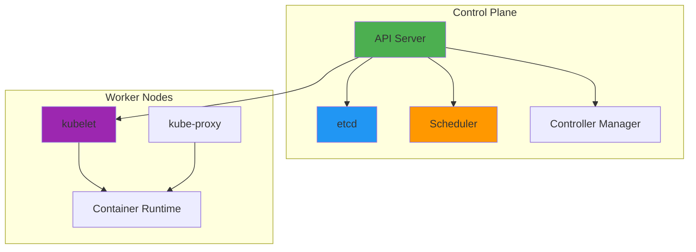
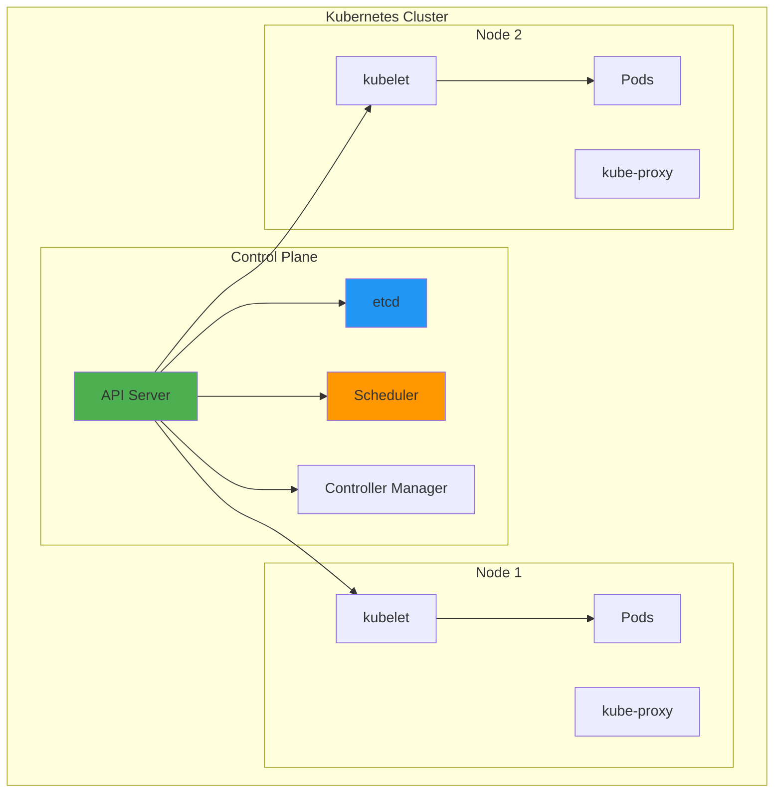
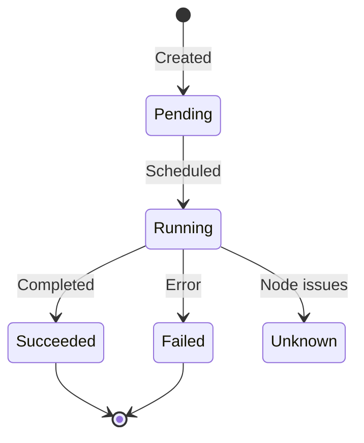

# Kubernetes Fundamentals

## Overview

Kubernetes (K8s) is an open-source container orchestration platform that automates deployment, scaling, and management of containerized applications. It provides a robust framework for running distributed systems, handling failures, and managing resources efficiently. This guide covers Kubernetes architecture, core concepts, common resources, and practical deployment patterns.

## Deep Explanation

### What is Kubernetes?

Kubernetes is a platform for managing containerized workloads and services. It provides:
- **Automated Deployment**: Deploy containers automatically
- **Scaling**: Scale applications up or down
- **Self-Healing**: Restart failed containers
- **Service Discovery**: Automatic service discovery
- **Load Balancing**: Distribute traffic
- **Rolling Updates**: Update without downtime

### Kubernetes Architecture

#### Cluster Components



#### Control Plane Components

1. **API Server**: Entry point for all operations
2. **etcd**: Distributed key-value store
3. **Scheduler**: Assigns pods to nodes
4. **Controller Manager**: Runs controllers

#### Node Components

1. **kubelet**: Agent running on each node
2. **kube-proxy**: Network proxy
3. **Container Runtime**: Runs containers (Docker, containerd)

### Core Concepts

#### Pods

**Pod** is the smallest deployable unit in Kubernetes.

```yaml
apiVersion: v1
kind: Pod
metadata:
  name: my-pod
spec:
  containers:
  - name: nginx
    image: nginx:alpine
    ports:
    - containerPort: 80
```

**Key Points**:
- One or more containers
- Shared network and storage
- Ephemeral (can be recreated)

#### Deployments

**Deployment** manages ReplicaSets and provides declarative updates.

```yaml
apiVersion: apps/v1
kind: Deployment
metadata:
  name: nginx-deployment
spec:
  replicas: 3
  selector:
    matchLabels:
      app: nginx
  template:
    metadata:
      labels:
        app: nginx
    spec:
      containers:
      - name: nginx
        image: nginx:1.21
        ports:
        - containerPort: 80
```

**Features**:
- Desired state management
- Rolling updates
- Rollback capability
- Scaling

#### Services

**Service** provides stable network access to pods.

```yaml
apiVersion: v1
kind: Service
metadata:
  name: nginx-service
spec:
  selector:
    app: nginx
  ports:
  - protocol: TCP
    port: 80
    targetPort: 80
  type: LoadBalancer
```

**Service Types**:
- **ClusterIP**: Internal cluster access
- **NodePort**: External access via node port
- **LoadBalancer**: Cloud load balancer
- **ExternalName**: External service

#### ConfigMaps and Secrets

**ConfigMap** stores configuration data.

```yaml
apiVersion: v1
kind: ConfigMap
metadata:
  name: app-config
data:
  database_url: "postgresql://db:5432/mydb"
  log_level: "info"
```

**Secret** stores sensitive data.

```yaml
apiVersion: v1
kind: Secret
metadata:
  name: app-secret
type: Opaque
data:
  password: cGFzc3dvcmQxMjM=  # base64 encoded
```

### Common Operations

#### Creating Resources

```bash
# Create from file
kubectl apply -f deployment.yaml

# Create from URL
kubectl apply -f https://example.com/manifest.yaml

# Create inline
kubectl create deployment nginx --image=nginx
```

#### Viewing Resources

```bash
# List pods
kubectl get pods
kubectl get pods -A              # All namespaces
kubectl get pods -l app=nginx     # Filtered

# Describe resource
kubectl describe pod my-pod

# Get logs
kubectl logs my-pod
kubectl logs -f my-pod            # Follow
kubectl logs deployment/nginx     # All pods in deployment
```

#### Updating Resources

```bash
# Update image
kubectl set image deployment/nginx nginx=nginx:1.22

# Scale deployment
kubectl scale deployment nginx --replicas=5

# Edit resource
kubectl edit deployment nginx
```

#### Deleting Resources

```bash
# Delete resource
kubectl delete pod my-pod
kubectl delete deployment nginx
kubectl delete -f deployment.yaml
```

### Namespaces

**Namespace** provides logical separation of resources.

```bash
# List namespaces
kubectl get namespaces

# Create namespace
kubectl create namespace production

# Use namespace
kubectl apply -f deployment.yaml -n production
kubectl get pods -n production
```

**Default Namespaces**:
- `default`: Default namespace
- `kube-system`: System components
- `kube-public`: Public resources
- `kube-node-lease`: Node heartbeat

### Labels and Selectors

**Labels** are key-value pairs attached to resources.

```yaml
metadata:
  labels:
    app: nginx
    version: "1.21"
    environment: production
```

**Selectors** filter resources by labels.

```yaml
selector:
  matchLabels:
    app: nginx
  matchExpressions:
    - {key: version, operator: In, values: ["1.21", "1.22"]}
```

### Health Checks

#### Liveness Probe

Restarts container if unhealthy.

```yaml
livenessProbe:
  httpGet:
    path: /health
    port: 8080
  initialDelaySeconds: 30
  periodSeconds: 10
```

#### Readiness Probe

Determines if pod can receive traffic.

```yaml
readinessProbe:
  httpGet:
    path: /ready
    port: 8080
  initialDelaySeconds: 5
  periodSeconds: 5
```

#### Startup Probe

Checks if application has started.

```yaml
startupProbe:
  httpGet:
    path: /startup
    port: 8080
  failureThreshold: 30
  periodSeconds: 10
```

### Resource Management

#### Requests and Limits

```yaml
resources:
  requests:
    memory: "64Mi"
    cpu: "250m"
  limits:
    memory: "128Mi"
    cpu: "500m"
```

**Requests**: Guaranteed resources
**Limits**: Maximum resources

### Rolling Updates

#### Update Strategy

```yaml
spec:
  strategy:
    type: RollingUpdate
    rollingUpdate:
      maxSurge: 1
      maxUnavailable: 0
```

**Rolling Update Process**:
1. Create new ReplicaSet
2. Scale up new pods
3. Scale down old pods
4. Continue until complete

#### Rollback

```bash
# View rollout history
kubectl rollout history deployment/nginx

# Rollback to previous
kubectl rollout undo deployment/nginx

# Rollback to specific revision
kubectl rollout undo deployment/nginx --to-revision=2
```

## Diagrams

### Kubernetes Architecture



### Pod Lifecycle



## Real Code Examples

### Complete Application Deployment

```yaml
# deployment.yaml
apiVersion: apps/v1
kind: Deployment
metadata:
  name: web-app
  labels:
    app: web-app
spec:
  replicas: 3
  selector:
    matchLabels:
      app: web-app
  template:
    metadata:
      labels:
        app: web-app
    spec:
      containers:
      - name: web
        image: myapp:1.0.0
        ports:
        - containerPort: 3000
        env:
        - name: DATABASE_URL
          valueFrom:
            secretKeyRef:
              name: app-secret
              key: database-url
        - name: LOG_LEVEL
          valueFrom:
            configMapKeyRef:
              name: app-config
              key: log_level
        resources:
          requests:
            memory: "128Mi"
            cpu: "100m"
          limits:
            memory: "256Mi"
            cpu: "200m"
        livenessProbe:
          httpGet:
            path: /health
            port: 3000
          initialDelaySeconds: 30
          periodSeconds: 10
        readinessProbe:
          httpGet:
            path: /ready
            port: 3000
          initialDelaySeconds: 5
          periodSeconds: 5
---
apiVersion: v1
kind: Service
metadata:
  name: web-app-service
spec:
  selector:
    app: web-app
  ports:
  - protocol: TCP
    port: 80
    targetPort: 3000
  type: LoadBalancer
---
apiVersion: v1
kind: ConfigMap
metadata:
  name: app-config
data:
  log_level: "info"
  feature_flags: "feature1,feature2"
---
apiVersion: v1
kind: Secret
metadata:
  name: app-secret
type: Opaque
stringData:
  database-url: "postgresql://db:5432/mydb"
  api-key: "secret-key-123"
```

### Multi-Tier Application

```yaml
# frontend-deployment.yaml
apiVersion: apps/v1
kind: Deployment
metadata:
  name: frontend
spec:
  replicas: 3
  selector:
    matchLabels:
      app: frontend
  template:
    metadata:
      labels:
        app: frontend
    spec:
      containers:
      - name: frontend
        image: frontend:latest
        ports:
        - containerPort: 80
---
apiVersion: v1
kind: Service
metadata:
  name: frontend-service
spec:
  selector:
    app: frontend
  ports:
  - port: 80
    targetPort: 80
  type: LoadBalancer
---
# backend-deployment.yaml
apiVersion: apps/v1
kind: Deployment
metadata:
  name: backend
spec:
  replicas: 2
  selector:
    matchLabels:
      app: backend
  template:
    metadata:
      labels:
        app: backend
    spec:
      containers:
      - name: backend
        image: backend:latest
        ports:
        - containerPort: 8080
        env:
        - name: FRONTEND_URL
          value: "http://frontend-service"
        - name: DATABASE_URL
          valueFrom:
            secretKeyRef:
              name: db-secret
              key: url
---
apiVersion: v1
kind: Service
metadata:
  name: backend-service
spec:
  selector:
    app: backend
  ports:
  - port: 8080
    targetPort: 8080
---
# database-deployment.yaml
apiVersion: apps/v1
kind: StatefulSet
metadata:
  name: database
spec:
  serviceName: database
  replicas: 1
  selector:
    matchLabels:
      app: database
  template:
    metadata:
      labels:
        app: database
    spec:
      containers:
      - name: postgres
        image: postgres:14
        ports:
        - containerPort: 5432
        env:
        - name: POSTGRES_DB
          value: mydb
        - name: POSTGRES_PASSWORD
          valueFrom:
            secretKeyRef:
              name: db-secret
              key: password
        volumeMounts:
        - name: data
          mountPath: /var/lib/postgresql/data
  volumeClaimTemplates:
  - metadata:
      name: data
    spec:
      accessModes: [ "ReadWriteOnce" ]
      resources:
        requests:
          storage: 10Gi
```

### Horizontal Pod Autoscaler

```yaml
apiVersion: autoscaling/v2
kind: HorizontalPodAutoscaler
metadata:
  name: web-app-hpa
spec:
  scaleTargetRef:
    apiVersion: apps/v1
    kind: Deployment
    name: web-app
  minReplicas: 2
  maxReplicas: 10
  metrics:
  - type: Resource
    resource:
      name: cpu
      target:
        type: Utilization
        averageUtilization: 70
  - type: Resource
    resource:
      name: memory
      target:
        type: Utilization
        averageUtilization: 80
```

## Hard Use-Case: Zero-Downtime Deployment

### Problem

Deploy new version without downtime, with:
- Database migrations
- Backward compatibility
- Rollback capability

### Solution: Blue-Green Deployment Pattern

#### Step 1: Deploy New Version

```yaml
# new-version-deployment.yaml
apiVersion: apps/v1
kind: Deployment
metadata:
  name: web-app-v2
spec:
  replicas: 3
  selector:
    matchLabels:
      app: web-app
      version: "2.0"
  template:
    metadata:
      labels:
        app: web-app
        version: "2.0"
    spec:
      containers:
      - name: web
        image: myapp:2.0.0
```

#### Step 2: Run Migrations

```bash
# Run migration job
kubectl create job migration-v2 --from=cronjob/migration-base
```

#### Step 3: Switch Traffic Gradually

```yaml
# Use service with selector for gradual rollout
apiVersion: v1
kind: Service
metadata:
  name: web-app-service
spec:
  selector:
    app: web-app
    version: "2.0"  # Switch selector
```

#### Step 4: Monitor and Rollback if Needed

```bash
# Monitor metrics
kubectl top pods -l app=web-app

# If issues, rollback
kubectl set selector service/web-app-service app=web-app,version=1.0
```

## Edge Cases and Pitfalls

### 1. Pod Not Starting

**Problem**: Pod stays in Pending state

```bash
# Check events
kubectl describe pod my-pod

# Common causes:
# - Resource constraints
# - Image pull errors
# - Node selector mismatches
```

**Solution**: Check events and resource availability

### 2. Service Not Routing Traffic

**Problem**: Service can't reach pods

```yaml
# BAD: Selector mismatch
service:
  selector:
    app: nginx
pod:
  labels:
    application: nginx
```

**Solution**: Ensure selector matches pod labels

```yaml
# GOOD: Matching labels
service:
  selector:
    app: nginx
pod:
  labels:
    app: nginx
```

### 3. Resource Limits Too Low

**Problem**: Pods being killed (OOMKilled)

```yaml
# BAD: No limits
resources: {}
```

**Solution**: Set appropriate limits

```yaml
# GOOD: Proper limits
resources:
  requests:
    memory: "128Mi"
    cpu: "100m"
  limits:
    memory: "256Mi"
    cpu: "200m"
```

### 4. Image Pull Errors

**Problem**: Cannot pull image

```bash
# Check image pull secrets
kubectl get secrets

# Add image pull secret
kubectl create secret docker-registry regcred \
  --docker-server=<registry> \
  --docker-username=<user> \
  --docker-password=<pass>
```

### 5. Stale ConfigMaps/Secrets

**Problem**: Changes not reflected in pods

**Solution**: Restart pods or use reloader

```bash
# Restart deployment
kubectl rollout restart deployment/web-app
```

## References and Further Reading

- [Kubernetes Documentation](https://kubernetes.io/docs/) - Official docs
- [Kubernetes Concepts](https://kubernetes.io/docs/concepts/) - Core concepts
- [kubectl Cheat Sheet](https://kubernetes.io/docs/reference/kubectl/cheatsheet/) - Command reference
- [Kubernetes Patterns](https://k8spatterns.io/) - Design patterns
- [Kubernetes Best Practices](https://kubernetes.io/docs/concepts/configuration/overview/) - Best practices

## Quiz

### Question 1
What is the smallest deployable unit in Kubernetes?

**A)** Container  
**B)** Pod  
**C)** Node  
**D)** Service

**Answer: B** - A Pod is the smallest deployable unit in Kubernetes and can contain one or more containers.

### Question 2
What Kubernetes resource manages ReplicaSets and provides rolling updates?

**A)** Pod  
**B)** Service  
**C)** Deployment  
**D)** ReplicaSet

**Answer: C** - Deployments manage ReplicaSets and provide declarative updates, including rolling updates and rollbacks.

### Question 3
What Service type provides external access via a cloud load balancer?

**A)** ClusterIP  
**B)** NodePort  
**C)** LoadBalancer  
**D)** ExternalName

**Answer: C** - LoadBalancer service type automatically provisions a cloud load balancer for external access.

### Question 4
What probe determines if a pod can receive traffic?

**A)** Liveness probe  
**B)** Readiness probe  
**C)** Startup probe  
**D)** Health probe

**Answer: B** - Readiness probe determines if a pod is ready to accept traffic, while liveness probe determines if a pod should be restarted.

### Question 5
What command scales a deployment to 5 replicas?

**A)** `kubectl scale deployment nginx --replicas=5`  
**B)** `kubectl resize deployment nginx 5`  
**C)** `kubectl set replicas deployment nginx 5`  
**D)** `kubectl update deployment nginx --replicas=5`

**Answer: A** - `kubectl scale` is the command to change the number of replicas in a deployment.

## Related Topics

- [Docker Basics](../01_beginners/05.%20Docker%20Basics.md) - Container fundamentals
- [Terraform Fundamentals](./02.%20Terraform%20Fundamentals.md) - Infrastructure as Code
- [Cloud Platforms Overview](./03.%20Cloud%20Platforms%20Overview.md) - Managed Kubernetes services

