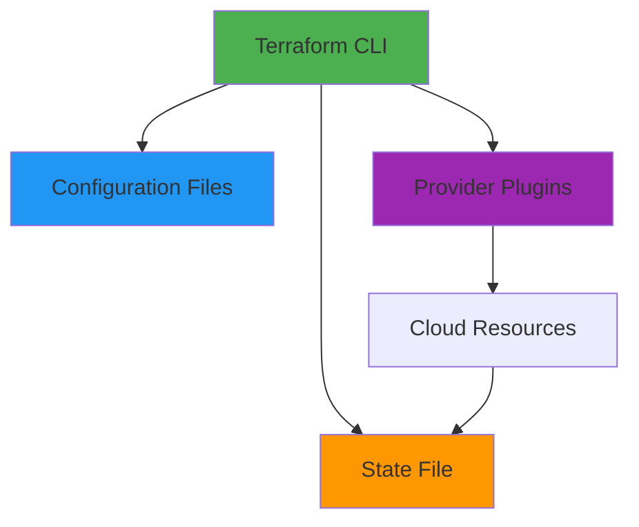
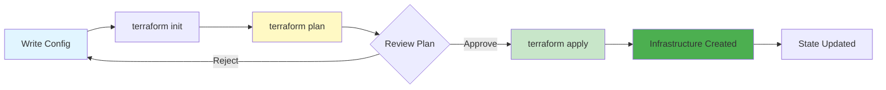
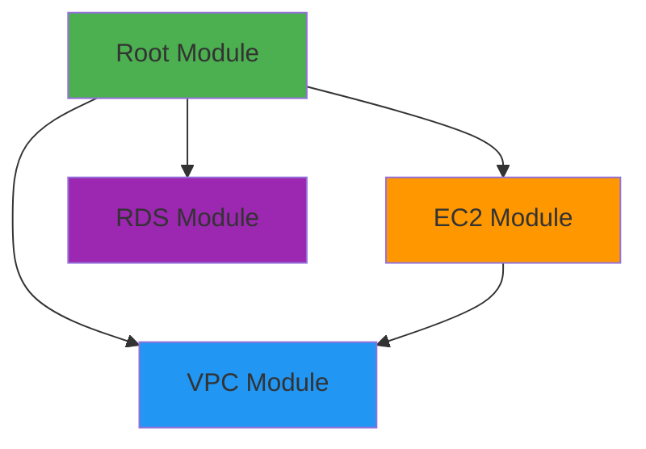

# Terraform Fundamentals

## Overview

Terraform is an Infrastructure as Code (IaC) tool that enables you to define, provision, and manage cloud infrastructure using declarative configuration files. It supports multiple cloud providers and allows you to version control your infrastructure, making it reproducible, testable, and maintainable. This guide covers Terraform basics, core concepts, state management, modules, and best practices.

## Deep Explanation

### What is Infrastructure as Code?

Infrastructure as Code (IaC) is the practice of managing infrastructure through code and version control, rather than manual processes.

**Benefits**:
- **Reproducibility**: Same infrastructure every time
- **Version Control**: Track changes over time
- **Collaboration**: Multiple people can work together
- **Testing**: Test infrastructure changes
- **Documentation**: Code documents infrastructure

### Terraform Architecture

#### Core Components



#### Terraform Workflow

1. **Write**: Define infrastructure in `.tf` files
2. **Initialize**: `terraform init` - Download providers
3. **Plan**: `terraform plan` - Preview changes
4. **Apply**: `terraform apply` - Create/update infrastructure
5. **Destroy**: `terraform destroy` - Remove infrastructure

### Basic Terraform Syntax

#### Provider Configuration

```hcl
terraform {
  required_providers {
    aws = {
      source  = "hashicorp/aws"
      version = "~> 4.0"
    }
  }
}

provider "aws" {
  region = "us-east-1"
}
```

#### Resources

```hcl
resource "aws_instance" "web" {
  ami           = "ami-0c55b159cbfafe1f0"
  instance_type = "t2.micro"
  
  tags = {
    Name = "WebServer"
  }
}
```

#### Variables

```hcl
variable "instance_type" {
  description = "EC2 instance type"
  type        = string
  default     = "t2.micro"
}

variable "region" {
  description = "AWS region"
  type        = string
}

# Usage
resource "aws_instance" "web" {
  instance_type = var.instance_type
}
```

#### Outputs

```hcl
output "instance_id" {
  description = "ID of the EC2 instance"
  value       = aws_instance.web.id
}

output "instance_public_ip" {
  description = "Public IP of the EC2 instance"
  value       = aws_instance.web.public_ip
}
```

### State Management

#### What is State?

State is a file that tracks the mapping between Terraform configuration and real-world resources.

#### Local State

```hcl
terraform {
  backend "local" {
    path = "terraform.tfstate"
  }
}
```

#### Remote State

```hcl
terraform {
  backend "s3" {
    bucket = "my-terraform-state"
    key    = "prod/terraform.tfstate"
    region = "us-east-1"
  }
}
```

#### State Commands

```bash
# Show state
terraform show

# List resources
terraform state list

# Show specific resource
terraform state show aws_instance.web

# Move resource
terraform state mv aws_instance.old aws_instance.new

# Remove from state
terraform state rm aws_instance.web
```

### Data Sources

Data sources fetch information from providers.

```hcl
data "aws_ami" "latest_ubuntu" {
  most_recent = true
  owners      = ["099720109477"] # Canonical
  
  filter {
    name   = "name"
    values = ["ubuntu/images/h2-ssd/ubuntu-jammy-22.04-amd64-server-*"]
  }
}

resource "aws_instance" "web" {
  ami           = data.aws_ami.latest_ubuntu.id
  instance_type = "t2.micro"
}
```

### Modules

Modules are reusable Terraform configurations.

#### Using Modules

```hcl
module "vpc" {
  source = "./modules/vpc"
  
  vpc_cidr = "10.0.0.0/16"
  environment = "production"
}

module "ec2" {
  source = "./modules/ec2"
  
  vpc_id = module.vpc.vpc_id
  subnet_id = module.vpc.public_subnet_id
}
```

#### Creating Modules

```hcl
# modules/vpc/main.tf
variable "vpc_cidr" {
  type = string
}

variable "environment" {
  type = string
}

resource "aws_vpc" "main" {
  cidr_block = var.vpc_cidr
  
  tags = {
    Name = "vpc-${var.environment}"
  }
}

output "vpc_id" {
  value = aws_vpc.main.id
}
```

### Workspaces

Workspaces allow multiple state files for the same configuration.

```bash
# Create workspace
terraform workspace new production
terraform workspace new staging

# List workspaces
terraform workspace list

# Select workspace
terraform workspace select production

# Show current workspace
terraform workspace show
```

### Functions

Terraform provides built-in functions.

```hcl
# String functions
locals {
  name = "my-app"
  upper_name = upper(local.name)
  tags = {
    Name = "${local.name}-${random_id.instance.hex}"
  }
}

# Numeric functions
locals {
  count = 3
  total = local.count * 2
}

# Collection functions
locals {
  instances = ["web1", "web2", "web3"]
  first = local.instances[0]
  count = length(local.instances)
}

# Conditional
resource "aws_instance" "web" {
  instance_type = var.environment == "prod" ? "t3.large" : "t2.micro"
}
```

### Provisioners

Provisioners run scripts on resources (use sparingly).

```hcl
resource "aws_instance" "web" {
  ami           = "ami-0c55b159cbfafe1f0"
  instance_type = "t2.micro"
  
  provisioner "remote-exec" {
    inline = [
      "sudo yum update -y",
      "sudo yum install -y nginx",
      "sudo systemctl start nginx"
    ]
  }
  
  connection {
    type     = "ssh"
    user     = "ec2-user"
    host     = self.public_ip
  }
}
```

**Note**: Prefer user_data or configuration management tools.

### Common Patterns

#### Count and For Each

```hcl
# Using count
resource "aws_instance" "web" {
  count = 3
  
  ami           = "ami-0c55b159cbfafe1f0"
  instance_type = "t2.micro"
  
  tags = {
    Name = "web-${count.index + 1}"
  }
}

# Using for_each
resource "aws_instance" "web" {
  for_each = {
    web1 = "t2.micro"
    web2 = "t2.small"
    web3 = "t2.medium"
  }
  
  ami           = "ami-0c55b159cbfafe1f0"
  instance_type = each.value
  
  tags = {
    Name = each.key
  }
}
```

#### Locals

```hcl
locals {
  common_tags = {
    Environment = var.environment
    Project     = "my-project"
    ManagedBy   = "Terraform"
  }
  
  instance_config = {
    prod    = { type = "t3.large", count = 3 }
    staging = { type = "t2.medium", count = 2 }
    dev     = { type = "t2.micro", count = 1 }
  }
  
  config = local.instance_config[var.environment]
}

resource "aws_instance" "web" {
  count         = local.config.count
  instance_type = local.config.type
  
  tags = local.common_tags
}
```

## Diagrams

### Terraform Workflow



### Module Structure



## Real Code Examples

### Complete AWS Infrastructure

```hcl
# variables.tf
variable "environment" {
  description = "Environment name"
  type        = string
  default     = "production"
}

variable "region" {
  description = "AWS region"
  type        = string
  default     = "us-east-1"
}

variable "instance_type" {
  description = "EC2 instance type"
  type        = string
  default     = "t2.micro"
}

variable "allowed_cidrs" {
  description = "Allowed CIDR blocks"
  type        = list(string)
  default     = ["0.0.0.0/0"]
}

# main.tf
terraform {
  required_version = ">= 1.0"
  
  required_providers {
    aws = {
      source  = "hashicorp/aws"
      version = "~> 4.0"
    }
  }
  
  backend "s3" {
    bucket = "my-terraform-state-bucket"
    key    = "prod/terraform.tfstate"
    region = "us-east-1"
  }
}

provider "aws" {
  region = var.region
  
  default_tags {
    tags = {
      Environment = var.environment
      ManagedBy   = "Terraform"
    }
  }
}

# VPC
resource "aws_vpc" "main" {
  cidr_block           = "10.0.0.0/16"
  enable_dns_hostnames = true
  enable_dns_support   = true
  
  tags = {
    Name = "vpc-${var.environment}"
  }
}

# Internet Gateway
resource "aws_internet_gateway" "main" {
  vpc_id = aws_vpc.main.id
  
  tags = {
    Name = "igw-${var.environment}"
  }
}

# Public Subnet
resource "aws_subnet" "public" {
  vpc_id                  = aws_vpc.main.id
  cidr_block              = "10.0.1.0/24"
  availability_zone       = "${var.region}a"
  map_public_ip_on_launch = true
  
  tags = {
    Name = "subnet-public-${var.environment}"
  }
}

# Route Table
resource "aws_route_table" "public" {
  vpc_id = aws_vpc.main.id
  
  route {
    cidr_block = "0.0.0.0/0"
    gateway_id = aws_internet_gateway.main.id
  }
  
  tags = {
    Name = "rt-public-${var.environment}"
  }
}

resource "aws_route_table_association" "public" {
  subnet_id      = aws_subnet.public.id
  route_table_id = aws_route_table.public.id
}

# Security Group
resource "aws_security_group" "web" {
  name        = "sg-web-${var.environment}"
  description = "Security group for web servers"
  vpc_id      = aws_vpc.main.id
  
  ingress {
    description = "HTTP"
    from_port   = 80
    to_port     = 80
    protocol    = "tcp"
    cidr_blocks = var.allowed_cidrs
  }
  
  ingress {
    description = "HTTPS"
    from_port   = 443
    to_port     = 443
    protocol    = "tcp"
    cidr_blocks = var.allowed_cidrs
  }
  
  ingress {
    description = "SSH"
    from_port   = 22
    to_port     = 22
    protocol    = "tcp"
    cidr_blocks = var.allowed_cidrs
  }
  
  egress {
    from_port   = 0
    to_port     = 0
    protocol    = "-1"
    cidr_blocks = ["0.0.0.0/0"]
  }
  
  tags = {
    Name = "sg-web-${var.environment}"
  }
}

# EC2 Instance
data "aws_ami" "latest_amazon_linux" {
  most_recent = true
  owners      = ["amazon"]
  
  filter {
    name   = "name"
    values = ["amzn2-ami-hvm-*-x86_64-gp2"]
  }
}

resource "aws_instance" "web" {
  ami                    = data.aws_ami.latest_amazon_linux.id
  instance_type          = var.instance_type
  subnet_id              = aws_subnet.public.id
  vpc_security_group_ids = [aws_security_group.web.id]
  
  user_data = <<-EOF
              #!/bin/bash
              yum update -y
              yum install -y httpd
              systemctl start httpd
              systemctl enable httpd
              echo "<h1>Hello from Terraform</h1>" > /var/www/html/index.html
              EOF
  
  tags = {
    Name = "web-${var.environment}"
  }
}

# Elastic IP
resource "aws_eip" "web" {
  instance = aws_instance.web.id
  domain   = "vpc"
  
  tags = {
    Name = "eip-web-${var.environment}"
  }
}

# outputs.tf
output "vpc_id" {
  description = "VPC ID"
  value       = aws_vpc.main.id
}

output "instance_id" {
  description = "EC2 Instance ID"
  value       = aws_instance.web.id
}

output "instance_public_ip" {
  description = "EC2 Instance Public IP"
  value       = aws_eip.web.public_ip
}

output "instance_public_dns" {
  description = "EC2 Instance Public DNS"
  value       = aws_instance.web.public_dns
}
```

### Reusable Module Example

```hcl
# modules/ec2-instance/variables.tf
variable "name" {
  type = string
}

variable "ami" {
  type = string
}

variable "instance_type" {
  type    = string
  default = "t2.micro"
}

variable "subnet_id" {
  type = string
}

variable "security_group_ids" {
  type = list(string)
}

variable "user_data" {
  type    = string
  default = ""
}

variable "tags" {
  type    = map(string)
  default = {}
}

# modules/ec2-instance/main.tf
resource "aws_instance" "this" {
  ami                    = var.ami
  instance_type          = var.instance_type
  subnet_id              = var.subnet_id
  vpc_security_group_ids = var.security_group_ids
  user_data              = var.user_data
  
  tags = merge(
    {
      Name = var.name
    },
    var.tags
  )
}

# modules/ec2-instance/outputs.tf
output "instance_id" {
  value = aws_instance.this.id
}

output "instance_private_ip" {
  value = aws_instance.this.private_ip
}

output "instance_public_ip" {
  value = aws_instance.this.public_ip
}

# Usage in root module
module "web_server" {
  source = "./modules/ec2-instance"
  
  name              = "web-server"
  ami               = data.aws_ami.latest_amazon_linux.id
  instance_type     = "t3.small"
  subnet_id         = aws_subnet.public.id
  security_group_ids = [aws_security_group.web.id]
  
  user_data = file("${path.module}/scripts/user-data.sh")
  
  tags = {
    Environment = "production"
    Role        = "web"
  }
}
```

## Hard Use-Case: Multi-Environment Infrastructure

### Problem

Manage infrastructure for multiple environments (dev, staging, prod) with:
- Shared components
- Environment-specific configurations
- State isolation

### Solution: Workspaces and Modules

#### Directory Structure

```
terraform/
├── environments/
│   ├── dev/
│   │   └── main.tf
│   ├── staging/
│   │   └── main.tf
│   └── prod/
│       └── main.tf
├── modules/
│   ├── vpc/
│   ├── ec2/
│   └── rds/
└── shared/
    └── main.tf
```

#### Environment Configuration

```hcl
# environments/prod/main.tf
terraform {
  backend "s3" {
    bucket = "terraform-state-prod"
    key    = "prod/terraform.tfstate"
    region = "us-east-1"
  }
}

module "infrastructure" {
  source = "../../modules"
  
  environment = "production"
  instance_type = "t3.large"
  instance_count = 3
  
  vpc_cidr = "10.0.0.0/16"
}
```

#### Shared Module

```hcl
# modules/main.tf
variable "environment" {
  type = string
}

variable "instance_type" {
  type    = string
  default = "t2.micro"
}

variable "instance_count" {
  type    = number
  default = 1
}

variable "vpc_cidr" {
  type = string
}

module "vpc" {
  source = "./vpc"
  
  vpc_cidr     = var.vpc_cidr
  environment  = var.environment
}

module "ec2" {
  source = "./ec2"
  
  vpc_id        = module.vpc.vpc_id
  subnet_id     = module.vpc.public_subnet_id
  instance_type = var.instance_type
  count         = var.instance_count
  environment   = var.environment
}
```

## Edge Cases and Pitfalls

### 1. State File Conflicts

**Problem**: Multiple people modifying infrastructure

**Solution**: Use remote state with locking

```hcl
terraform {
  backend "s3" {
    bucket         = "terraform-state"
    key            = "terraform.tfstate"
    region         = "us-east-1"
    dynamodb_table = "terraform-locks"
    encrypt        = true
  }
}
```

### 2. Sensitive Data in State

**Problem**: Secrets stored in state file

**Solution**: Use sensitive variables and outputs

```hcl
variable "db_password" {
  type      = string
  sensitive = true
}

output "db_password" {
  value     = aws_db_instance.main.password
  sensitive = true
}
```

### 3. Resource Dependencies

**Problem**: Resources created in wrong order

**Solution**: Use explicit dependencies

```hcl
resource "aws_instance" "web" {
  # ...
  depends_on = [aws_security_group.web]
}
```

### 4. Importing Existing Resources

**Problem**: Managing existing infrastructure

**Solution**: Import resources

```bash
terraform import aws_instance.web i-1234567890abcdef0
```

### 5. Provider Version Constraints

**Problem**: Breaking changes in provider updates

**Solution**: Pin provider versions

```hcl
terraform {
  required_providers {
    aws = {
      source  = "hashicorp/aws"
      version = "~> 4.0"  # Allow 4.x, not 5.x
    }
  }
}
```

## References and Further Reading

- [Terraform Documentation](https://www.terraform.io/docs) - Official docs
- [Terraform AWS Provider](https://registry.terraform.io/providers/hashicorp/aws/latest/docs) - AWS provider docs
- [Terraform Best Practices](https://www.terraform.io/docs/cloud/guides/recommended-practices/index.html) - Best practices
- [Terraform Registry](https://registry.terraform.io/) - Module registry
- [Terraform Up & Running](https://www.terraformupandrunning.com/) - Book

## Quiz

### Question 1
What command initializes a Terraform working directory?

**A)** `terraform init`  
**B)** `terraform plan`  
**C)** `terraform apply`  
**D)** `terraform validate`

**Answer: A** - `terraform init` initializes a Terraform working directory by downloading providers and setting up the backend.

### Question 2
What is the purpose of Terraform state?

**A)** To store configuration files  
**B)** To track mapping between configuration and real resources  
**C)** To store variables  
**D)** To store outputs

**Answer: B** - Terraform state tracks the mapping between your configuration and the real-world resources it manages.

### Question 3
What is a Terraform module?

**A)** A provider plugin  
**B)** A reusable Terraform configuration  
**C)** A state file  
**D)** A variable file

**Answer: B** - Modules are reusable Terraform configurations that can be called from other configurations.

### Question 4
What command shows what Terraform will do without making changes?

**A)** `terraform init`  
**B)** `terraform plan`  
**C)** `terraform apply`  
**D)** `terraform show`

**Answer: B** - `terraform plan` creates an execution plan showing what Terraform will do without making any changes.

### Question 5
What backend type stores state in S3?

**A)** `local`  
**B)** `s3`  
**C)** `remote`  
**D)** `consul`

**Answer: B** - The `s3` backend stores Terraform state in an S3 bucket, enabling team collaboration and state locking.

## Related Topics

- [Linux Fundamentals for DevOps](../01_beginners/03.%20Linux%20Fundamentals%20for%20DevOps.md) - Command line basics
- [Cloud Platforms Overview](./03.%20Cloud%20Platforms%20Overview.md) - Cloud infrastructure
- [Kubernetes Fundamentals](./01.%20Kubernetes%20Fundamentals.md) - Container orchestration

