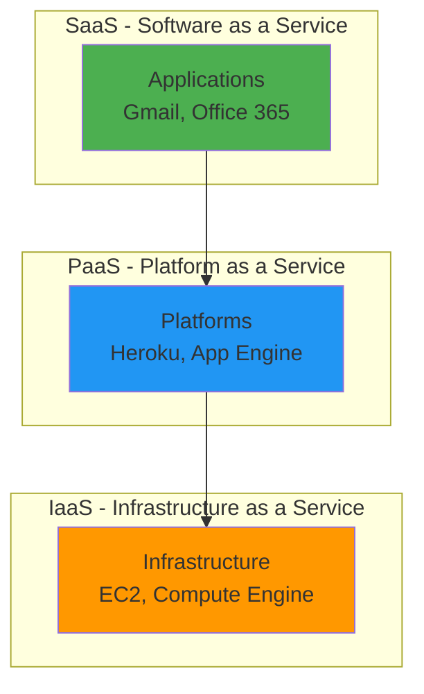
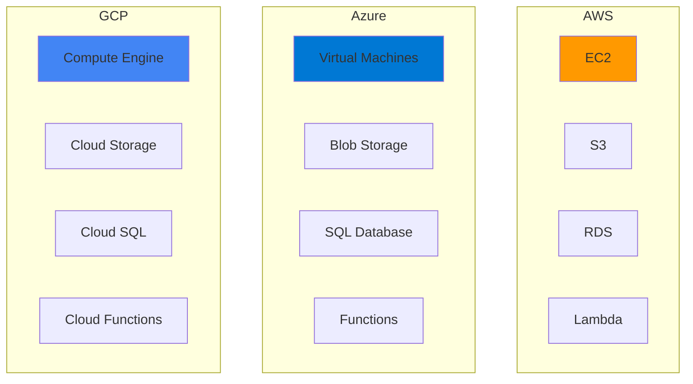
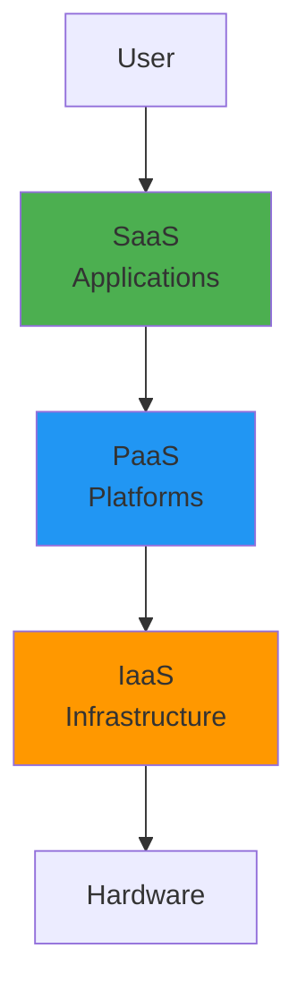
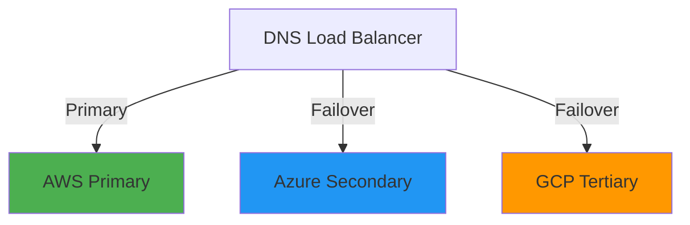

# Cloud Platforms Overview

## Overview

Cloud platforms provide on-demand computing resources, storage, and services over the internet. Understanding the major cloud providers—AWS, Azure, and GCP—is essential for DevOps engineers. This guide covers cloud computing fundamentals, core services across platforms, pricing models, and how to choose the right platform for your needs.

## Deep Explanation

### What is Cloud Computing?

Cloud computing delivers computing services (servers, storage, databases, networking, software) over the internet ("the cloud") instead of local servers or personal devices.

#### Cloud Service Models



**IaaS**: Virtual machines, storage, networking
**PaaS**: Platforms for developing and deploying applications
**SaaS**: Complete software solutions

#### Cloud Deployment Models

1. **Public Cloud**: Shared infrastructure (AWS, Azure, GCP)
2. **Private Cloud**: Dedicated infrastructure
3. **Hybrid Cloud**: Combination of public and private
4. **Multi-Cloud**: Using multiple public clouds

### Major Cloud Providers

#### Amazon Web Services (AWS)

**Strengths**:
- Largest market share
- Extensive service catalog
- Mature ecosystem
- Global presence

**Key Services**:
- **Compute**: EC2, Lambda, ECS, EKS
- **Storage**: S3, EBS, EFS
- **Database**: RDS, DynamoDB, Redshift
- **Networking**: VPC, CloudFront, Route 53
- **Management**: CloudFormation, CloudWatch

#### Microsoft Azure

**Strengths**:
- Enterprise integration
- Windows ecosystem
- Hybrid cloud capabilities
- Strong compliance

**Key Services**:
- **Compute**: Virtual Machines, Functions, AKS
- **Storage**: Blob Storage, Files, Disks
- **Database**: SQL Database, Cosmos DB
- **Networking**: Virtual Network, CDN, DNS
- **Management**: ARM Templates, Monitor

#### Google Cloud Platform (GCP)

**Strengths**:
- Data analytics and ML
- Kubernetes (GKE)
- Competitive pricing
- Strong in AI/ML

**Key Services**:
- **Compute**: Compute Engine, Cloud Functions, GKE
- **Storage**: Cloud Storage, Persistent Disk
- **Database**: Cloud SQL, Firestore, BigQuery
- **Networking**: VPC, Cloud CDN, Cloud DNS
- **Management**: Deployment Manager, Cloud Monitoring

### Core Services Comparison

#### Compute Services

| Feature | AWS | Azure | GCP |
|---------|-----|-------|-----|
| Virtual Machines | EC2 | Virtual Machines | Compute Engine |
| Serverless | Lambda | Functions | Cloud Functions |
| Containers | ECS/EKS | AKS | GKE |
| Auto Scaling | Auto Scaling | VM Scale Sets | Managed Instance Groups |

#### Storage Services

| Feature | AWS | Azure | GCP |
|---------|-----|-------|-----|
| Object Storage | S3 | Blob Storage | Cloud Storage |
| Block Storage | EBS | Managed Disks | Persistent Disk |
| File Storage | EFS | Files | Filestore |
| Archive | Glacier | Archive Storage | Archive Storage |

#### Database Services

| Feature | AWS | Azure | GCP |
|---------|-----|-------|-----|
| SQL | RDS | SQL Database | Cloud SQL |
| NoSQL | DynamoDB | Cosmos DB | Firestore |
| Data Warehouse | Redshift | Synapse | BigQuery |
| Caching | ElastiCache | Redis Cache | Memorystore |

### AWS Core Services

#### EC2 (Elastic Compute Cloud)

```bash
# Launch EC2 instance via AWS CLI
aws ec2 run-instances \
  --image-id ami-0c55b159cbfafe1f0 \
  --instance-type t2.micro \
  --key-name my-key \
  --security-group-ids sg-12345678 \
  --subnet-id subnet-12345678
```

**Features**:
- Virtual servers in the cloud
- Multiple instance types
- Auto Scaling
- Elastic IP addresses

#### S3 (Simple Storage Service)

```bash
# Create S3 bucket
aws s3 mb s3://my-bucket-name

# Upload file
aws s3 cp file.txt s3://my-bucket-name/

# Download file
aws s3 cp s3://my-bucket-name/file.txt ./
```

**Features**:
- Object storage
- Versioning
- Lifecycle policies
- Static website hosting

#### VPC (Virtual Private Cloud)

```hcl
# Terraform example
resource "aws_vpc" "main" {
  cidr_block = "10.0.0.0/16"
  
  tags = {
    Name = "main-vpc"
  }
}

resource "aws_subnet" "public" {
  vpc_id     = aws_vpc.main.id
  cidr_block = "10.0.1.0/24"
  
  tags = {
    Name = "public-subnet"
  }
}
```

**Features**:
- Isolated network
- Subnets
- Route tables
- Internet gateways

#### Lambda (Serverless)

```python
# Lambda function example
import json

def lambda_handler(event, context):
    return {
        'statusCode': 200,
        'body': json.dumps('Hello from Lambda!')
    }
```

**Features**:
- Serverless compute
- Pay per execution
- Auto scaling
- Event-driven

### Azure Core Services

#### Virtual Machines

```bash
# Create VM via Azure CLI
az vm create \
  --resource-group myResourceGroup \
  --name myVM \
  --image UbuntuLTS \
  --admin-username azureuser \
  --generate-ssh-keys
```

**Features**:
- Windows and Linux VMs
- Multiple sizes
- Scale sets
- Hybrid connectivity

#### Blob Storage

```bash
# Create storage account
az storage account create \
  --name mystorageaccount \
  --resource-group myResourceGroup

# Upload blob
az storage blob upload \
  --account-name mystorageaccount \
  --container-name mycontainer \
  --name file.txt \
  --file ./file.txt
```

**Features**:
- Object storage
- Hot, cool, archive tiers
- CDN integration
- Lifecycle management

#### Azure Functions

```python
# Azure Function example
import azure.functions as func

def main(req: func.HttpRequest) -> func.HttpResponse:
    return func.HttpResponse("Hello from Azure Functions!")
```

**Features**:
- Serverless compute
- Multiple languages
- Event triggers
- Consumption plan

### GCP Core Services

#### Compute Engine

```bash
# Create VM via gcloud CLI
gcloud compute instances create my-vm \
  --zone=us-central1-a \
  --machine-type=e2-medium \
  --image-family=ubuntu-2004-lts \
  --image-project=ubuntu-os-cloud
```

**Features**:
- Virtual machines
- Preemptible instances
- Custom machine types
- Live migration

#### Cloud Storage

```bash
# Create bucket
gsutil mb gs://my-bucket-name

# Upload file
gsutil cp file.txt gs://my-bucket-name/

# Download file
gsutil cp gs://my-bucket-name/file.txt ./
```

**Features**:
- Object storage
- Multi-regional
- Lifecycle policies
- Versioning

#### Cloud Functions

```python
# Cloud Function example
def hello_world(request):
    return 'Hello from Cloud Functions!'
```

**Features**:
- Serverless compute
- Event-driven
- Auto scaling
- Pay per use

### Kubernetes Services

#### EKS (AWS)

```bash
# Create EKS cluster
eksctl create cluster \
  --name my-cluster \
  --region us-east-1 \
  --nodegroup-name workers \
  --node-type t3.medium \
  --nodes 3
```

#### AKS (Azure)

```bash
# Create AKS cluster
az aks create \
  --resource-group myResourceGroup \
  --name myAKSCluster \
  --node-count 3 \
  --enable-addons monitoring
```

#### GKE (GCP)

```bash
# Create GKE cluster
gcloud container clusters create my-cluster \
  --zone us-central1-a \
  --num-nodes 3
```

### Networking Services

#### AWS Networking

- **VPC**: Virtual private cloud
- **CloudFront**: CDN
- **Route 53**: DNS
- **API Gateway**: API management
- **Direct Connect**: Dedicated connection

#### Azure Networking

- **Virtual Network**: Isolated network
- **CDN**: Content delivery
- **DNS**: Domain name system
- **API Management**: API gateway
- **ExpressRoute**: Private connection

#### GCP Networking

- **VPC**: Virtual private cloud
- **Cloud CDN**: Content delivery
- **Cloud DNS**: Domain name system
- **Cloud Endpoints**: API management
- **Cloud Interconnect**: Private connection

### Monitoring and Logging

#### AWS

- **CloudWatch**: Monitoring and logging
- **X-Ray**: Distributed tracing
- **CloudTrail**: Audit logging

#### Azure

- **Monitor**: Monitoring and logging
- **Application Insights**: Application monitoring
- **Log Analytics**: Log management

#### GCP

- **Cloud Monitoring**: Monitoring
- **Cloud Logging**: Log management
- **Cloud Trace**: Distributed tracing

### Pricing Models

#### Pay-as-You-Go

- Pay for what you use
- No upfront costs
- Flexible pricing

#### Reserved Instances

- Commit to 1-3 years
- Significant discounts (up to 75%)
- Predictable costs

#### Spot/Preemptible Instances

- Use spare capacity
- Up to 90% discount
- Can be interrupted

#### Free Tiers

All providers offer free tiers:
- **AWS**: 12 months free, then always free tier
- **Azure**: $200 credit, always free services
- **GCP**: $300 credit, always free tier

### Choosing a Cloud Provider

#### Factors to Consider

1. **Requirements**: What services do you need?
2. **Cost**: Compare pricing for your workload
3. **Compliance**: Regulatory requirements
4. **Ecosystem**: Existing tools and integrations
5. **Support**: Support level needed
6. **Geography**: Data residency requirements

#### Use Cases

**Choose AWS if**:
- Need broadest service catalog
- Enterprise features required
- Global presence needed
- Mature ecosystem important

**Choose Azure if**:
- Windows-heavy environment
- Microsoft ecosystem integration
- Enterprise agreements
- Hybrid cloud needed

**Choose GCP if**:
- Data analytics/ML focus
- Kubernetes-native
- Cost optimization priority
- AI/ML capabilities needed

### Multi-Cloud Strategy

#### Benefits

- **Vendor Lock-in**: Avoid dependency on one vendor
- **Best of Breed**: Use best services from each
- **Disaster Recovery**: Redundancy across clouds
- **Cost Optimization**: Compare and optimize

#### Challenges

- **Complexity**: Managing multiple platforms
- **Skills**: Need expertise in multiple clouds
- **Cost**: May increase costs
- **Integration**: Connecting services

#### Tools

- **Terraform**: Multi-cloud IaC
- **Kubernetes**: Portable workloads
- **Cloud Management Platforms**: Unified management

## Diagrams

### Cloud Architecture Comparison



### Service Model Layers



## Real Code Examples

### Multi-Cloud Terraform Configuration

```hcl
# AWS Resources
provider "aws" {
  region = "us-east-1"
}

resource "aws_instance" "web" {
  ami           = "ami-0c55b159cbfafe1f0"
  instance_type = "t2.micro"
  
  tags = {
    Name = "web-server"
  }
}

# Azure Resources
provider "azurerm" {
  features {}
}

resource "azurerm_virtual_machine" "web" {
  name                  = "web-vm"
  location              = "East US"
  resource_group_name   = azurerm_resource_group.example.name
  vm_size               = "Standard_B1s"
  
  storage_image_reference {
    publisher = "Canonical"
    offer     = "UbuntuServer"
    sku       = "18.04-LTS"
    version   = "latest"
  }
}

# GCP Resources
provider "google" {
  project = "my-project"
  region  = "us-central1"
}

resource "google_compute_instance" "web" {
  name         = "web-instance"
  machine_type = "e2-medium"
  zone         = "us-central1-a"
  
  boot_disk {
    initialize_params {
      image = "ubuntu-os-cloud/ubuntu-2004-lts"
    }
  }
}
```

### AWS Serverless Application

```yaml
# serverless.yml (AWS)
service: my-service

provider:
  name: aws
  runtime: python3.9
  region: us-east-1

functions:
  hello:
    handler: handler.hello
    events:
      - http:
          path: hello
          method: get
          
resources:
  Resources:
    MyBucket:
      Type: AWS::S3::Bucket
      Properties:
        BucketName: my-bucket-name
```

### Azure ARM Template

```json
{
  "$schema": "https://schema.management.azure.com/schemas/2019-04-01/deploymentTemplate.json#",
  "contentVersion": "1.0.0.0",
  "parameters": {
    "vmName": {
      "type": "string"
    }
  },
  "resources": [
    {
      "type": "Microsoft.Compute/virtualMachines",
      "apiVersion": "2021-11-01",
      "name": "[parameters('vmName')]",
      "location": "[resourceGroup().location]",
      "properties": {
        "hardwareProfile": {
          "vmSize": "Standard_B1s"
        }
      }
    }
  ]
}
```

### GCP Deployment Manager

```yaml
# config.yaml (GCP)
resources:
- name: web-instance
  type: compute.v1.instance
  properties:
    zone: us-central1-a
    machineType: zones/us-central1-a/machineTypes/e2-medium
    disks:
    - deviceName: boot
      type: PERSISTENT
      boot: true
      initializeParams:
        sourceImage: projects/ubuntu-os-cloud/global/images/family/ubuntu-2004-lts
```

## Hard Use-Case: Multi-Cloud Disaster Recovery

### Problem

Ensure high availability across multiple cloud providers for critical application.

### Solution: Multi-Cloud DR Strategy

#### Architecture



#### Implementation

```hcl
# Primary AWS Infrastructure
resource "aws_instance" "primary" {
  ami           = "ami-0c55b159cbfafe1f0"
  instance_type = "t3.large"
  
  tags = {
    Environment = "primary"
    Role        = "web-server"
  }
}

# Secondary Azure Infrastructure
resource "azurerm_virtual_machine" "secondary" {
  name                  = "secondary-vm"
  location              = "East US"
  resource_group_name   = azurerm_resource_group.dr.name
  vm_size               = "Standard_D2s_v3"
  
  tags = {
    Environment = "secondary"
    Role        = "web-server"
  }
}

# Health Check and Failover
resource "aws_route53_health_check" "primary" {
  fqdn              = aws_instance.primary.public_dns
  port              = 80
  type              = "HTTP"
  resource_path     = "/health"
  failure_threshold = 3
}

resource "aws_route53_record" "www" {
  zone_id = aws_route53_zone.main.zone_id
  name    = "www.example.com"
  type    = "A"
  
  failover_routing_policy {
    type = "PRIMARY"
  }
  
  set_identifier = "primary"
  health_check_id = aws_route53_health_check.primary.id
  records = [aws_instance.primary.public_ip]
}
```

## Edge Cases and Pitfalls

### 1. Vendor Lock-in

**Problem**: Difficult to migrate between clouds

**Solution**: Use abstraction layers

```hcl
# Use Terraform for multi-cloud
# Use Kubernetes for portable workloads
# Use standard APIs and protocols
```

### 2. Cost Overruns

**Problem**: Unexpected cloud costs

**Solution**: Implement cost monitoring

```bash
# AWS Cost Explorer
aws ce get-cost-and-usage \
  --time-period Start=2024-01-01,End=2024-01-31 \
  --granularity MONTHLY \
  --metrics BlendedCost

# Set up billing alerts
# Use reserved instances
# Monitor unused resources
```

### 3. Security Misconfiguration

**Problem**: Exposed resources, default credentials

**Solution**: Security best practices

```hcl
# Use IAM roles, not access keys
# Enable encryption at rest
# Use security groups/firewalls
# Regular security audits
# Enable CloudTrail/audit logs
```

### 4. Region Selection

**Problem**: Wrong region causing latency

**Solution**: Choose based on requirements

```bash
# Consider:
# - User location
# - Data residency
# - Service availability
# - Cost differences
# - Latency requirements
```

### 5. Resource Limits

**Problem**: Hitting service limits

**Solution**: Request limit increases

```bash
# AWS Service Quotas
aws service-quotas request-service-quota-increase \
  --service-code ec2 \
  --quota-code L-34B43A08 \
  --desired-value 20

# Plan ahead
# Monitor usage
# Request increases early
```

## References and Further Reading

- [AWS Documentation](https://docs.aws.amazon.com/) - AWS docs
- [Azure Documentation](https://docs.microsoft.com/azure/) - Azure docs
- [GCP Documentation](https://cloud.google.com/docs) - GCP docs
- [Cloud Comparison](https://www.comparitech.com/cloud-providers/) - Provider comparison
- [Well-Architected Framework](https://aws.amazon.com/architecture/well-architected/) - Best practices

## Quiz

### Question 1
What does IaaS stand for?

**A)** Infrastructure as a Service  
**B)** Integration as a Service  
**C)** Intelligence as a Service  
**D)** Internet as a Service

**Answer: A** - IaaS (Infrastructure as a Service) provides virtualized computing resources over the internet.

### Question 2
Which AWS service provides object storage?

**A)** EC2  
**B)** S3  
**C)** RDS  
**D)** Lambda

**Answer: B** - S3 (Simple Storage Service) is AWS's object storage service.

### Question 3
What is the main benefit of serverless computing?

**A)** Always-on servers  
**B)** Pay per execution, no server management  
**C)** More control  
**D)** Lower latency

**Answer: B** - Serverless computing allows you to pay only for execution time without managing servers.

### Question 4
Which cloud provider is known for strong Kubernetes support?

**A)** AWS only  
**B)** Azure only  
**C)** GCP (Google created Kubernetes)  
**D)** All equally

**Answer: C** - Google Cloud Platform created Kubernetes and offers GKE (Google Kubernetes Engine) with strong native support.

### Question 5
What is a key advantage of multi-cloud strategy?

**A)** Lower costs always  
**B)** Avoids vendor lock-in  
**C)** Simpler management  
**D)** Single vendor support

**Answer: B** - Multi-cloud strategy helps avoid vendor lock-in and provides flexibility to use best services from each provider.

## Related Topics

- [Terraform Fundamentals](./02.%20Terraform%20Fundamentals.md) - Infrastructure as Code
- [Kubernetes Fundamentals](./01.%20Kubernetes%20Fundamentals.md) - Container orchestration
- [Introduction to CI/CD](../01_beginners/04.%20Introduction%20to%20CI%CD.md) - Deployment pipelines

