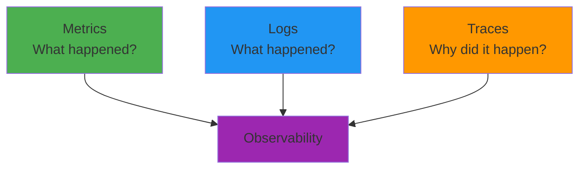
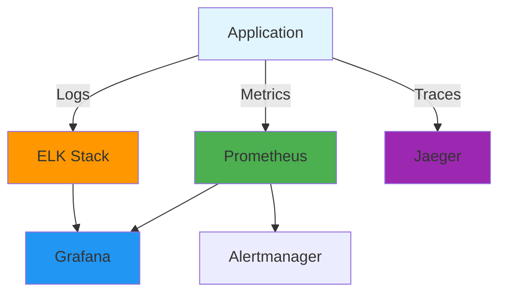
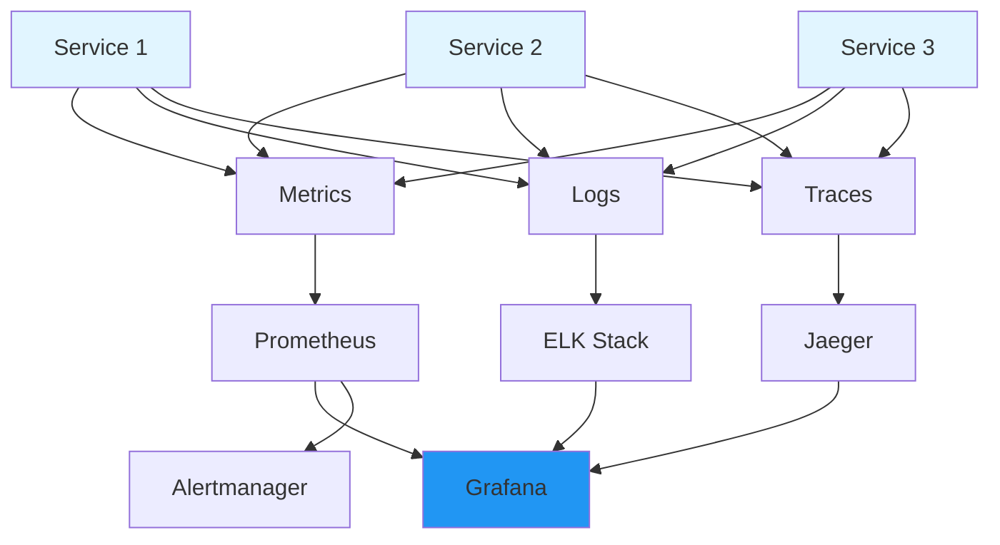
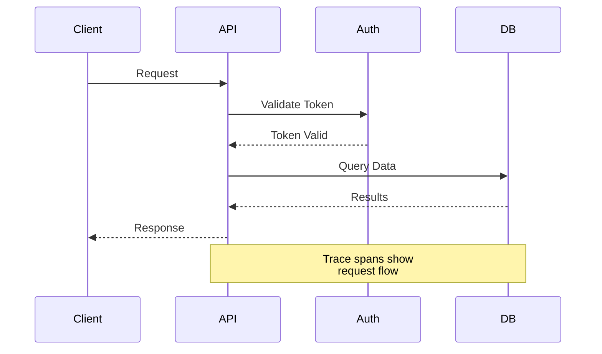

# Monitoring & Observability

## Overview

Monitoring and observability are critical for understanding system behavior, detecting issues, and ensuring reliability. This guide covers the three pillars of observability (metrics, logs, traces), popular monitoring tools, alerting strategies, and best practices for building observable systems.

## Deep Explanation

### What is Observability?

Observability is the ability to understand a system's internal state by examining its outputs. It goes beyond monitoring to provide insights into system behavior.

#### Three Pillars of Observability



**Metrics**: Numerical measurements over time
**Logs**: Event records with timestamps
**Traces**: Request flows through services

### Metrics

#### Types of Metrics

1. **Counter**: Incrementing value (requests, errors)
2. **Gauge**: Value that goes up and down (CPU usage, memory)
3. **Histogram**: Distribution of values (response times)
4. **Summary**: Similar to histogram with quantiles

#### Key Metrics (The Four Golden Signals)

1. **Latency**: Time to serve requests
2. **Traffic**: Demand on system
3. **Errors**: Rate of failed requests
4. **Saturation**: How "full" the system is

#### Example Metrics

```python
# Prometheus metrics example
from prometheus_client import Counter, Gauge, Histogram

# Counter
request_count = Counter('http_requests_total', 'Total HTTP requests', ['method', 'endpoint'])

# Gauge
cpu_usage = Gauge('cpu_usage_percent', 'CPU usage percentage')

# Histogram
request_duration = Histogram('http_request_duration_seconds', 'HTTP request duration')

# Usage
request_count.labels(method='GET', endpoint='/api/users').inc()
cpu_usage.set(75.5)
request_duration.observe(0.234)
```

### Logging

#### Log Levels

- **DEBUG**: Detailed information for debugging
- **INFO**: General informational messages
- **WARN**: Warning messages
- **ERROR**: Error messages
- **FATAL**: Critical errors

#### Structured Logging

```python
# Structured logging example
import json
import logging

# Configure structured logging
logging.basicConfig(
    format='%(asctime)s %(levelname)s %(message)s',
    level=logging.INFO
)

logger = logging.getLogger(__name__)

# Structured log entry
logger.info(json.dumps({
    'event': 'user_login',
    'user_id': 12345,
    'ip_address': '192.168.1.1',
    'timestamp': '2024-01-15T10:30:00Z'
}))
```

#### Log Aggregation

```yaml
# ELK Stack (Elasticsearch, Logstash, Kibana)
# Logstash configuration
input {
  file {
    path => "/var/log/app.log"
    codec => "json"
  }
}

filter {
  grok {
    match => { "message" => "%{COMBINEDAPACHELOG}" }
  }
}

output {
  elasticsearch {
    hosts => ["localhost:9200"]
    index => "app-logs-%{+YYYY.MM.dd}"
  }
}
```

### Distributed Tracing

#### What is Tracing?

Tracing follows a request as it flows through multiple services.

#### Trace Components

- **Trace**: Complete request flow
- **Span**: Single operation in trace
- **Parent-Child Relationships**: Spans can have children

#### Example Trace

```python
# OpenTelemetry tracing example
from opentelemetry import trace
from opentelemetry.sdk.trace import TracerProvider
from opentelemetry.sdk.trace.export import ConsoleSpanExporter

trace.set_tracer_provider(TracerProvider())
tracer = trace.get_tracer(__name__)

def process_request():
    with tracer.start_as_current_span("process_request") as span:
        span.set_attribute("http.method", "GET")
        span.set_attribute("http.url", "/api/users")
        
        # Call database
        with tracer.start_as_current_span("database_query") as db_span:
            db_span.set_attribute("db.query", "SELECT * FROM users")
            # Execute query
        
        span.set_attribute("http.status_code", 200)
```

### Monitoring Tools

#### Prometheus

**Prometheus** is a metrics collection and alerting system.

```yaml
# prometheus.yml
global:
  scrape_interval: 15s

scrape_configs:
  - job_name: 'web-app'
    static_configs:
      - targets: ['localhost:8080']
```

**Features**:
- Pull-based metrics
- PromQL query language
- Alertmanager integration
- Time-series database

#### Grafana

**Grafana** visualizes metrics and logs.

```json
{
  "dashboard": {
    "title": "Application Metrics",
    "panels": [
      {
        "title": "Request Rate",
        "targets": [
          {
            "expr": "rate(http_requests_total[5m])"
          }
        ]
      }
    ]
  }
}
```

**Features**:
- Rich visualizations
- Multiple data sources
- Alerting
- Dashboard sharing

#### ELK Stack

**Elasticsearch, Logstash, Kibana** for log management.

**Components**:
- **Elasticsearch**: Search and analytics engine
- **Logstash**: Log processing pipeline
- **Kibana**: Visualization and exploration

#### Jaeger

**Jaeger** is a distributed tracing system.

**Features**:
- Distributed context propagation
- Service dependency analysis
- Performance optimization
- Root cause analysis

### Alerting

#### Alert Rules

```yaml
# Prometheus alert rules
groups:
- name: application_alerts
  rules:
  - alert: HighErrorRate
    expr: rate(http_requests_total{status=~"5.."}[5m]) > 0.05
    for: 5m
    labels:
      severity: critical
    annotations:
      summary: "High error rate detected"
      description: "Error rate is {{ $value }} errors per second"

  - alert: HighLatency
    expr: histogram_quantile(0.95, rate(http_request_duration_seconds_bucket[5m])) > 1
    for: 10m
    labels:
      severity: warning
    annotations:
      summary: "High latency detected"
```

#### Alerting Best Practices

1. **Avoid Alert Fatigue**: Only alert on actionable items
2. **Use Severity Levels**: Critical, warning, info
3. **Set Appropriate Thresholds**: Not too sensitive
4. **Include Context**: What, when, where, why
5. **Test Alerts**: Ensure they work

#### Alert Routing

```yaml
# Alertmanager configuration
route:
  group_by: ['alertname', 'cluster']
  group_wait: 10s
  group_interval: 10s
  repeat_interval: 12h
  receiver: 'default'
  routes:
  - match:
      severity: critical
    receiver: 'oncall'
  - match:
      severity: warning
    receiver: 'slack'
```

### Monitoring Architecture

#### Complete Observability Stack



### Application Instrumentation

#### Metrics Instrumentation

```python
# Flask application with Prometheus
from flask import Flask
from prometheus_client import Counter, Histogram, generate_latest

app = Flask(__name__)

REQUEST_COUNT = Counter('requests_total', 'Total requests', ['method', 'endpoint'])
REQUEST_DURATION = Histogram('request_duration_seconds', 'Request duration')

@app.route('/api/users')
def get_users():
    with REQUEST_DURATION.time():
        REQUEST_COUNT.labels(method='GET', endpoint='/api/users').inc()
        # Business logic
        return {'users': []}

@app.route('/metrics')
def metrics():
    return generate_latest()
```

#### Logging Instrumentation

```python
# Structured logging with context
import logging
import uuid

class RequestLogger:
    def __init__(self):
        self.logger = logging.getLogger(__name__)
    
    def log_request(self, request_id, method, path, status_code, duration):
        self.logger.info({
            'request_id': request_id,
            'method': method,
            'path': path,
            'status_code': status_code,
            'duration_ms': duration * 1000,
            'timestamp': datetime.utcnow().isoformat()
        })
```

### SLOs, SLIs, and Error Budgets

#### Service Level Indicators (SLIs)

Measurable aspects of service quality:
- **Availability**: Uptime percentage
- **Latency**: Response time percentiles
- **Error Rate**: Percentage of failed requests
- **Throughput**: Requests per second

#### Service Level Objectives (SLOs)

Target values for SLIs:
- **Availability**: 99.9% uptime
- **Latency**: p95 < 200ms
- **Error Rate**: < 0.1%

#### Error Budgets

Remaining room for error:
- **99.9% SLO**: 0.1% error budget
- **Monthly**: ~43 minutes downtime allowed
- **Spent**: Track actual downtime

#### Example SLO Configuration

```yaml
# SLO definition
slo:
  name: api_availability
  sli:
    type: availability
    window: 30d
  target: 0.999  # 99.9%
  error_budget: 0.001  # 0.1%
```

### Dashboard Design

#### Effective Dashboards

1. **Top-Level Dashboard**: Key metrics at a glance
2. **Service Dashboards**: Per-service details
3. **Infrastructure Dashboard**: System resources
4. **Business Dashboard**: Business metrics

#### Dashboard Example

```json
{
  "dashboard": {
    "title": "Application Overview",
    "panels": [
      {
        "title": "Request Rate",
        "type": "graph",
        "targets": [
          {"expr": "rate(http_requests_total[5m])"}
        ]
      },
      {
        "title": "Error Rate",
        "type": "graph",
        "targets": [
          {"expr": "rate(http_requests_total{status=~'5..'}[5m])"}
        ]
      },
      {
        "title": "Latency (p95)",
        "type": "graph",
        "targets": [
          {"expr": "histogram_quantile(0.95, rate(http_request_duration_seconds_bucket[5m]))"}
        ]
      },
      {
        "title": "Active Users",
        "type": "stat",
        "targets": [
          {"expr": "sum(active_users)"}
        ]
      }
    ]
  }
}
```

## Diagrams

### Observability Stack



### Distributed Trace



## Real Code Examples

### Complete Monitoring Setup

```yaml
# docker-compose.yml for monitoring stack
version: '3.8'

services:
  prometheus:
    image: prom/prometheus:latest
    ports:
      - "9090:9090"
    volumes:
      - ./prometheus.yml:/etc/prometheus/prometheus.yml
      - prometheus-data:/prometheus
    command:
      - '--config.file=/etc/prometheus/prometheus.yml'
      - '--storage.tsdb.path=/prometheus'

  grafana:
    image: grafana/grafana:latest
    ports:
      - "3000:3000"
    environment:
      - GF_SECURITY_ADMIN_PASSWORD=admin
    volumes:
      - grafana-data:/var/lib/grafana

  alertmanager:
    image: prom/alertmanager:latest
    ports:
      - "9093:9093"
    volumes:
      - ./alertmanager.yml:/etc/alertmanager/alertmanager.yml

  elasticsearch:
    image: docker.elastic.co/elasticsearch/elasticsearch:8.0.0
    environment:
      - discovery.type=single-node
    ports:
      - "9200:9200"

  logstash:
    image: docker.elastic.co/logstash/logstash:8.0.0
    volumes:
      - ./logstash.conf:/usr/share/logstash/pipeline/logstash.conf

  kibana:
    image: docker.elastic.co/kibana/kibana:8.0.0
    ports:
      - "5601:5601"
    environment:
      - ELASTICSEARCH_HOSTS=http://elasticsearch:9200

volumes:
  prometheus-data:
  grafana-data:
```

### Instrumented Application

```python
# app.py - Fully instrumented Flask application
from flask import Flask, request, jsonify
from prometheus_client import Counter, Histogram, Gauge, generate_latest
from opentelemetry import trace
from opentelemetry.sdk.trace import TracerProvider
from opentelemetry.sdk.trace.export import BatchSpanProcessor
from opentelemetry.exporter.jaeger import JaegerExporter
import logging
import time

app = Flask(__name__)

# Configure logging
logging.basicConfig(
    level=logging.INFO,
    format='%(asctime)s %(name)s %(levelname)s %(message)s'
)
logger = logging.getLogger(__name__)

# Configure tracing
trace.set_tracer_provider(TracerProvider())
jaeger_exporter = JaegerExporter(
    agent_host_name='jaeger',
    agent_port=6831
)
trace.get_tracer_provider().add_span_processor(
    BatchSpanProcessor(jaeger_exporter)
)
tracer = trace.get_tracer(__name__)

# Prometheus metrics
REQUEST_COUNT = Counter(
    'http_requests_total',
    'Total HTTP requests',
    ['method', 'endpoint', 'status']
)

REQUEST_DURATION = Histogram(
    'http_request_duration_seconds',
    'HTTP request duration',
    ['method', 'endpoint']
)

ACTIVE_REQUESTS = Gauge(
    'http_active_requests',
    'Active HTTP requests'
)

@app.before_request
def before_request():
    request.start_time = time.time()
    ACTIVE_REQUESTS.inc()

@app.after_request
def after_request(response):
    duration = time.time() - request.start_time
    ACTIVE_REQUESTS.dec()
    
    REQUEST_COUNT.labels(
        method=request.method,
        endpoint=request.path,
        status=response.status_code
    ).inc()
    
    REQUEST_DURATION.labels(
        method=request.method,
        endpoint=request.path
    ).observe(duration)
    
    # Structured logging
    logger.info({
        'method': request.method,
        'path': request.path,
        'status_code': response.status_code,
        'duration_ms': duration * 1000,
        'ip': request.remote_addr
    })
    
    return response

@app.route('/api/users')
def get_users():
    with tracer.start_as_current_span("get_users") as span:
        span.set_attribute("http.method", "GET")
        span.set_attribute("http.url", "/api/users")
        
        # Simulate database query
        with tracer.start_as_current_span("database_query") as db_span:
            db_span.set_attribute("db.query", "SELECT * FROM users")
            time.sleep(0.1)  # Simulate query time
        
        span.set_attribute("http.status_code", 200)
        return jsonify({'users': []})

@app.route('/metrics')
def metrics():
    return generate_latest()

if __name__ == '__main__':
    app.run(host='0.0.0.0', port=8080)
```

### Alert Configuration

```yaml
# alertmanager.yml
global:
  resolve_timeout: 5m

route:
  group_by: ['alertname', 'cluster']
  group_wait: 10s
  group_interval: 10s
  repeat_interval: 12h
  receiver: 'default'
  routes:
  - match:
      severity: critical
    receiver: 'oncall-pagerduty'
  - match:
      severity: warning
    receiver: 'slack-alerts'

receivers:
- name: 'default'
  webhook_configs:
  - url: 'http://localhost:5001/webhook'

- name: 'oncall-pagerduty'
  pagerduty_configs:
  - service_key: 'your-pagerduty-key'

- name: 'slack-alerts'
  slack_configs:
  - api_url: 'https://hooks.slack.com/services/YOUR/WEBHOOK/URL'
    channel: '#alerts'
    title: 'Alert: {{ .GroupLabels.alertname }}'
    text: '{{ .CommonAnnotations.description }}'
```

## Hard Use-Case: Debugging Production Issue

### Problem

Application experiencing intermittent slowdowns. Need to identify root cause.

### Solution: Multi-Pillar Investigation

#### Step 1: Check Metrics

```promql
# Check latency percentiles
histogram_quantile(0.95, rate(http_request_duration_seconds_bucket[5m]))

# Check error rate
rate(http_requests_total{status=~"5.."}[5m])

# Check resource usage
cpu_usage_percent
memory_usage_percent
```

#### Step 2: Analyze Logs

```bash
# Search for errors
grep -i "error" /var/log/app.log | tail -100

# Check slow queries
grep "duration_ms" /var/log/app.log | awk '$NF > 1000'
```

#### Step 3: Examine Traces

```python
# Query Jaeger for slow traces
# Filter by duration > 1s
# Identify which service is slow
```

#### Step 4: Correlate Findings

- Metrics show high p95 latency
- Logs show database query warnings
- Traces show database span taking 2s
- **Root Cause**: Slow database queries

## Edge Cases and Pitfalls

### 1. Too Many Metrics

**Problem**: Metric cardinality explosion

```python
# BAD: High cardinality
counter.labels(user_id=user_id, session_id=session_id).inc()
# Creates thousands of time series
```

**Solution**: Limit label cardinality

```python
# GOOD: Low cardinality
counter.labels(endpoint=endpoint, status=status).inc()
```

### 2. Log Volume

**Problem**: Too many logs, high costs

**Solution**: Use log levels appropriately

```python
# Use DEBUG only in development
logger.debug("Detailed debug info")

# Use INFO for important events
logger.info("User logged in")

# Use WARNING for recoverable issues
logger.warning("Rate limit approaching")

# Use ERROR for failures
logger.error("Failed to process request")
```

### 3. Alert Fatigue

**Problem**: Too many alerts, ignored

**Solution**: Focus on actionable alerts

```yaml
# BAD: Alert on everything
- alert: HighCPU
  expr: cpu_usage > 50

# GOOD: Alert on actionable threshold
- alert: HighCPU
  expr: cpu_usage > 90
  for: 5m
  annotations:
    runbook: "https://wiki/runbooks/high-cpu"
```

### 4. Missing Context

**Problem**: Alerts without context

**Solution**: Include relevant information

```yaml
annotations:
  summary: "High error rate on {{ $labels.endpoint }}"
  description: |
    Error rate is {{ $value }} errors/second.
    Check logs: kubectl logs -l app={{ $labels.app }}
    Runbook: https://wiki/runbooks/high-error-rate
```

### 5. Sampling Traces

**Problem**: Too many traces, high overhead

**Solution**: Sample traces intelligently

```python
# Sample 1% of requests, 100% of errors
if status_code >= 500 or random.random() < 0.01:
    tracer.start_as_current_span("request")
```

## References and Further Reading

- [Prometheus Documentation](https://prometheus.io/docs/) - Prometheus guide
- [Grafana Documentation](https://grafana.com/docs/) - Grafana docs
- [OpenTelemetry](https://opentelemetry.io/) - Observability framework
- [SRE Book](https://sre.google/books/) - Site Reliability Engineering
- [Observability Engineering](https://www.oreilly.com/library/view/observability-engineering/9781492076438/) - Observability practices

## Quiz

### Question 1
What are the three pillars of observability?

**A)** Metrics, Logs, Alerts  
**B)** Metrics, Logs, Traces  
**C)** CPU, Memory, Disk  
**D)** Availability, Latency, Errors

**Answer: B** - The three pillars of observability are Metrics (what happened), Logs (what happened), and Traces (why it happened).

### Question 2
What is the difference between a counter and a gauge metric?

**A)** They're the same  
**B)** Counter increments, gauge goes up and down  
**C)** Counter is for errors, gauge is for latency  
**D)** Counter is faster

**Answer: B** - A counter only increments (like total requests), while a gauge can go up and down (like CPU usage).

### Question 3
What does SLO stand for?

**A)** Service Level Objective  
**B)** System Level Operation  
**C)** Service Level Operation  
**D)** System Level Objective

**Answer: A** - SLO (Service Level Objective) defines target values for service quality metrics.

### Question 4
What is the main purpose of distributed tracing?

**A)** To measure CPU usage  
**B)** To follow requests across services  
**C)** To store logs  
**D)** To send alerts

**Answer: B** - Distributed tracing follows requests as they flow through multiple services to understand system behavior.

### Question 5
What should you avoid to prevent alert fatigue?

**A)** Setting up alerts  
**B)** Alerting on non-actionable items  
**C)** Using multiple alert channels  
**D)** Testing alerts

**Answer: B** - Alert fatigue occurs when too many non-actionable alerts are sent, causing important alerts to be ignored.

## Related Topics

- [Kubernetes Fundamentals](./01.%20Kubernetes%20Fundamentals.md) - Monitoring Kubernetes
- [Cloud Platforms Overview](./03.%20Cloud%20Platforms%20Overview.md) - Cloud monitoring services
- [Introduction to DevOps](../01_beginners/01.%20Introduction%20to%20DevOps.md) - DevOps practices

