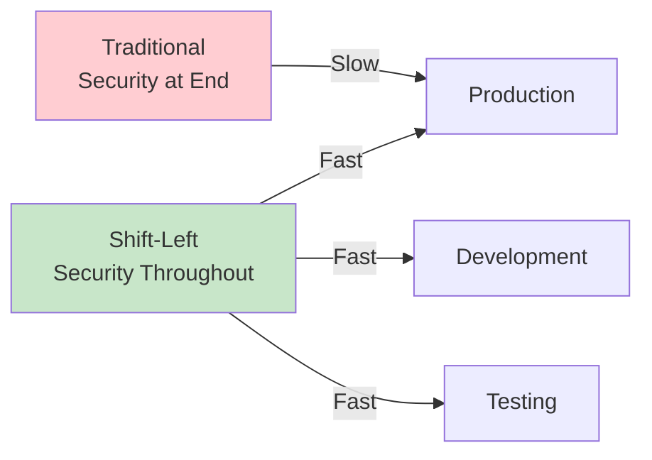
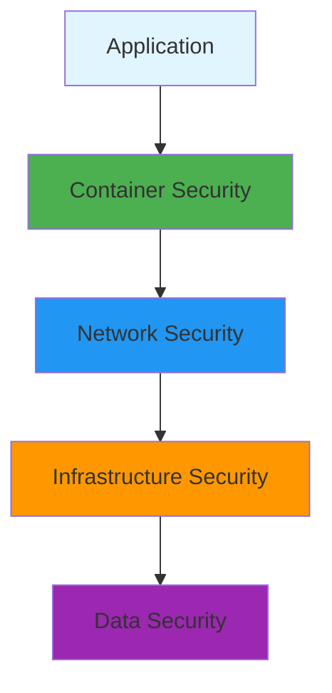
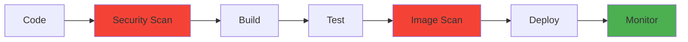

# Security Fundamentals

## Overview

Security is a critical aspect of DevOps, requiring a shift-left approach where security is integrated throughout the development and operations lifecycle. This guide covers security fundamentals including secrets management, encryption, authentication, authorization, vulnerability scanning, and security best practices for cloud-native applications.

## Deep Explanation

### DevSecOps

DevSecOps integrates security practices into DevOps workflows, making security everyone's responsibility.

#### Security Shift-Left



**Benefits**:
- Early detection of vulnerabilities
- Faster remediation
- Lower costs
- Better security posture

### Secrets Management

#### What are Secrets?

Secrets are sensitive data that must be protected:
- Passwords
- API keys
- Certificates
- Database credentials
- SSH keys

#### Secrets Management Principles

1. **Never Commit Secrets**: Don't store in code
2. **Encrypt at Rest**: Encrypt stored secrets
3. **Encrypt in Transit**: Use TLS
4. **Rotate Regularly**: Change secrets periodically
5. **Least Privilege**: Grant minimum access

#### Kubernetes Secrets

```yaml
# Create secret
apiVersion: v1
kind: Secret
metadata:
  name: db-secret
type: Opaque
stringData:
  username: admin
  password: secret123

---
# Use secret
apiVersion: v1
kind: Pod
spec:
  containers:
  - name: app
    image: myapp:latest
    env:
    - name: DB_USERNAME
      valueFrom:
        secretKeyRef:
          name: db-secret
          key: username
    - name: DB_PASSWORD
      valueFrom:
        secretKeyRef:
          name: db-secret
          key: password
```

#### External Secrets Operator

```yaml
apiVersion: external-secrets.io/v1beta1
kind: ExternalSecret
metadata:
  name: app-secret
spec:
  secretStoreRef:
    name: aws-secrets-manager
    kind: SecretStore
  target:
    name: app-secret
    creationPolicy: Owner
  data:
  - secretKey: password
    remoteRef:
      key: prod/database/password
```

#### HashiCorp Vault

```bash
# Install Vault
vault server -dev

# Store secret
vault kv put secret/database password=secret123

# Read secret
vault kv get secret/database

# Kubernetes integration
vault write auth/kubernetes/config \
  token_reviewer_jwt="<token>" \
  kubernetes_host="https://kubernetes:443"
```

### Encryption

#### Encryption at Rest

**Database Encryption**:
```sql
-- PostgreSQL
CREATE TABLE users (
  id SERIAL PRIMARY KEY,
  email VARCHAR(255) ENCRYPTED
);

-- MySQL
CREATE TABLE users (
  id INT PRIMARY KEY,
  email VARCHAR(255)
) ENCRYPTION='Y';
```

**File System Encryption**:
```bash
# Encrypt volume
cryptsetup luksFormat /dev/sdb1
cryptsetup luksOpen /dev/sdb1 encrypted_volume
```

#### Encryption in Transit

**TLS/SSL Configuration**:
```yaml
# Kubernetes TLS secret
apiVersion: v1
kind: Secret
metadata:
  name: tls-secret
type: kubernetes.io/tls
data:
  tls.crt: <base64-encoded-cert>
  tls.key: <base64-encoded-key>

---
# Use in Ingress
apiVersion: networking.k8s.io/v1
kind: Ingress
metadata:
  name: tls-ingress
spec:
  tls:
  - hosts:
    - example.com
    secretName: tls-secret
```

**mTLS (Mutual TLS)**:
```yaml
# Istio mTLS
apiVersion: security.istio.io/v1beta1
kind: PeerAuthentication
metadata:
  name: default
spec:
  mtls:
    mode: STRICT
```

### Authentication and Authorization

#### Authentication Methods

**API Keys**:
```python
# API key authentication
from flask import request, abort

def require_api_key(f):
    @wraps(f)
    def decorated_function(*args, **kwargs):
        api_key = request.headers.get('X-API-Key')
        if api_key != os.environ.get('API_KEY'):
            abort(401)
        return f(*args, **kwargs)
    return decorated_function
```

**OAuth 2.0**:
```python
# OAuth 2.0 flow
from authlib.integrations.flask_client import OAuth

oauth = OAuth(app)
oauth.register(
    name='google',
    client_id=os.environ.get('GOOGLE_CLIENT_ID'),
    client_secret=os.environ.get('GOOGLE_CLIENT_SECRET'),
    server_metadata_url='https://accounts.google.com/.well-known/openid-configuration',
    client_kwargs={'scope': 'openid email profile'}
)
```

**JWT (JSON Web Tokens)**:
```python
# JWT authentication
import jwt
from datetime import datetime, timedelta

def generate_token(user_id):
    payload = {
        'user_id': user_id,
        'exp': datetime.utcnow() + timedelta(hours=1)
    }
    return jwt.encode(payload, SECRET_KEY, algorithm='HS256')

def verify_token(token):
    try:
        payload = jwt.decode(token, SECRET_KEY, algorithms=['HS256'])
        return payload['user_id']
    except jwt.ExpiredSignatureError:
        return None
```

#### RBAC (Role-Based Access Control)

**Kubernetes RBAC**:
```yaml
# Role
apiVersion: rbac.authorization.k8s.io/v1
kind: Role
metadata:
  name: pod-reader
rules:
- apiGroups: [""]
  resources: ["pods"]
  verbs: ["get", "list", "watch"]

---
# RoleBinding
apiVersion: rbac.authorization.k8s.io/v1
kind: RoleBinding
metadata:
  name: read-pods
subjects:
- kind: User
  name: jane
  apiGroup: rbac.authorization.k8s.io
roleRef:
  kind: Role
  name: pod-reader
  apiGroup: rbac.authorization.k8s.io
```

**AWS IAM**:
```json
{
  "Version": "2012-10-17",
  "Statement": [
    {
      "Effect": "Allow",
      "Action": [
        "s3:GetObject",
        "s3:ListBucket"
      ],
      "Resource": [
        "arn:aws:s3:::my-bucket/*",
        "arn:aws:s3:::my-bucket"
      ]
    }
  ]
}
```

### Vulnerability Scanning

#### Container Scanning

**Trivy**:
```bash
# Scan container image
trivy image myapp:latest

# Scan with exit code
trivy image --exit-code 1 --severity HIGH,CRITICAL myapp:latest

# Scan Kubernetes cluster
trivy k8s cluster --severity HIGH,CRITICAL
```

**Docker Bench Security**:
```bash
# Run Docker security audit
docker run --rm --net host --pid host --userns host --cap-add audit_control \
  -v /etc:/etc:ro \
  -v /usr/bin/containerd:/usr/bin/containerd:ro \
  -v /usr/bin/runc:/usr/bin/runc:ro \
  -v /usr/lib/systemd:/usr/lib/systemd:ro \
  -v /var/lib:/var/lib:ro \
  -v /var/run/docker.sock:/var/run/docker.sock:ro \
  --label docker_bench_security \
  docker/docker-bench-security
```

#### Dependency Scanning

**Snyk**:
```bash
# Scan dependencies
snyk test

# Monitor dependencies
snyk monitor

# Fix vulnerabilities
snyk fix
```

**OWASP Dependency-Check**:
```bash
# Scan dependencies
dependency-check --scan . --format HTML
```

#### SAST (Static Application Security Testing)

**SonarQube**:
```yaml
# sonar-project.properties
sonar.projectKey=myapp
sonar.sources=src
sonar.language=java
sonar.sourceEncoding=UTF-8
```

**Semgrep**:
```bash
# Scan code
semgrep --config=auto .

# Custom rules
semgrep --config=/path/to/rules .
```

### Security Policies

#### Pod Security Standards

```yaml
# Pod Security Policy
apiVersion: v1
kind: Namespace
metadata:
  name: production
  labels:
    pod-security.kubernetes.io/enforce: restricted
    pod-security.kubernetes.io/audit: restricted
    pod-security.kubernetes.io/warn: restricted

---
# Pod Security Context
apiVersion: v1
kind: Pod
spec:
  securityContext:
    runAsNonRoot: true
    runAsUser: 1000
    fsGroup: 2000
    seccompProfile:
      type: RuntimeDefault
  containers:
  - name: app
    securityContext:
      allowPrivilegeEscalation: false
      capabilities:
        drop:
        - ALL
      readOnlyRootFilesystem: true
```

#### Network Policies

```yaml
apiVersion: networking.k8s.io/v1
kind: NetworkPolicy
metadata:
  name: deny-all
spec:
  podSelector: {}
  policyTypes:
  - Ingress
  - Egress

---
apiVersion: networking.k8s.io/v1
kind: NetworkPolicy
metadata:
  name: allow-api
spec:
  podSelector:
    matchLabels:
      app: api
  policyTypes:
  - Ingress
  ingress:
  - from:
    - podSelector:
        matchLabels:
          app: frontend
    ports:
    - protocol: TCP
      port: 8080
```

### Security Best Practices

#### Container Security

1. **Use Minimal Base Images**: Alpine, distroless
2. **Run as Non-Root**: Use non-root user
3. **Scan Images**: Regular vulnerability scanning
4. **Sign Images**: Use image signing
5. **Limit Capabilities**: Drop unnecessary capabilities

```dockerfile
# Secure Dockerfile
FROM alpine:latest

# Create non-root user
RUN addgroup -g 1000 appgroup && \
    adduser -D -u 1000 -G appgroup appuser

# Copy application
COPY --chown=appuser:appgroup app /app

# Switch to non-root user
USER appuser

# Drop capabilities
# Use security context in Kubernetes

CMD ["/app"]
```

#### Infrastructure Security

1. **Least Privilege**: Minimum required permissions
2. **Encryption**: Encrypt data at rest and in transit
3. **Network Segmentation**: Isolate networks
4. **Audit Logging**: Log all access
5. **Regular Updates**: Keep systems updated

#### CI/CD Security

```yaml
# Secure CI/CD pipeline
name: Secure Build
on: [push]

jobs:
  security-scan:
    runs-on: ubuntu-latest
    steps:
      - uses: actions/checkout@v3
      
      # Dependency scanning
      - name: Run Snyk
        uses: snyk/actions/node@master
        env:
          SNYK_TOKEN: ${{ secrets.SNYK_TOKEN }}
      
      # Container scanning
      - name: Scan container
        run: |
          docker build -t myapp .
          trivy image --exit-code 1 myapp
      
      # SAST
      - name: Run Semgrep
        run: semgrep --config=auto .
```

### Compliance

#### Common Compliance Standards

**SOC 2**:
- Security
- Availability
- Processing integrity
- Confidentiality
- Privacy

**PCI DSS**:
- Secure network
- Protect cardholder data
- Maintain vulnerability management
- Implement strong access control
- Monitor and test networks

**GDPR**:
- Data protection
- Right to erasure
- Data portability
- Privacy by design

#### Compliance Automation

```yaml
# Compliance checks in CI/CD
compliance-check:
  runs-on: ubuntu-latest
  steps:
    - name: Check security policies
      run: |
        # Run security scans
        # Check configurations
        # Verify encryption
        # Audit access controls
```

## Diagrams

### Security Layers



### DevSecOps Pipeline



## Real Code Examples

### Complete Security Setup

```yaml
# Kubernetes security configuration
apiVersion: v1
kind: Namespace
metadata:
  name: secure-app
  labels:
    pod-security.kubernetes.io/enforce: restricted

---
apiVersion: v1
kind: Secret
metadata:
  name: app-secrets
  namespace: secure-app
type: Opaque
stringData:
  database-url: postgresql://user:pass@db:5432/db
  api-key: secret-api-key

---
apiVersion: v1
kind: Pod
metadata:
  name: secure-app
  namespace: secure-app
spec:
  securityContext:
    runAsNonRoot: true
    runAsUser: 1000
    fsGroup: 2000
    seccompProfile:
      type: RuntimeDefault
  containers:
  - name: app
    image: myapp:latest
    securityContext:
      allowPrivilegeEscalation: false
      capabilities:
        drop:
        - ALL
      readOnlyRootFilesystem: true
    env:
    - name: DATABASE_URL
      valueFrom:
        secretKeyRef:
          name: app-secrets
          key: database-url
    volumeMounts:
    - name: tmp
      mountPath: /tmp
  volumes:
  - name: tmp
    emptyDir: {}

---
apiVersion: networking.k8s.io/v1
kind: NetworkPolicy
metadata:
  name: secure-app-policy
  namespace: secure-app
spec:
  podSelector:
    matchLabels:
      app: secure-app
  policyTypes:
  - Ingress
  - Egress
  ingress:
  - from:
    - podSelector:
        matchLabels:
          app: frontend
    ports:
    - protocol: TCP
      port: 8080
  egress:
  - to:
    - podSelector:
        matchLabels:
          app: database
    ports:
    - protocol: TCP
      port: 5432
```

### Secure CI/CD Pipeline

```yaml
name: Secure CI/CD

on: [push, pull_request]

jobs:
  security:
    runs-on: ubuntu-latest
    steps:
      - uses: actions/checkout@v3
      
      - name: Run Trivy vulnerability scanner
        uses: aquasecurity/trivy-action@master
        with:
          scan-type: 'fs'
          scan-ref: '.'
          format: 'sarif'
          output: 'trivy-results.sarif'
      
      - name: Upload Trivy results
        uses: github/codeql-action/upload-sarif@v2
        with:
          sarif_file: 'trivy-results.sarif'
      
      - name: Run Snyk
        uses: snyk/actions/node@master
        env:
          SNYK_TOKEN: ${{ secrets.SNYK_TOKEN }}
        with:
          args: --severity-threshold=high
      
      - name: Run Semgrep
        run: |
          docker run --rm -v "${PWD}:/src" returntocorp/semgrep semgrep --config=auto /src
      
      - name: Build container
        run: docker build -t myapp:${{ github.sha }} .
      
      - name: Scan container image
        run: |
          trivy image --exit-code 1 --severity HIGH,CRITICAL myapp:${{ github.sha }}

  build:
    needs: security
    runs-on: ubuntu-latest
    steps:
      - uses: actions/checkout@v3
      - name: Build
        run: npm ci && npm run build

  deploy:
    needs: build
    runs-on: ubuntu-latest
    if: github.ref == 'refs/heads/main'
    steps:
      - name: Deploy
        run: ./deploy.sh
```

## Hard Use-Case: Implementing Zero Trust Security

### Problem

Implement zero trust security model in Kubernetes cluster.

### Solution: Zero Trust Architecture

#### Principles

1. **Never Trust, Always Verify**: Verify every request
2. **Least Privilege**: Minimum required access
3. **Assume Breach**: Assume network is compromised

#### Implementation

```yaml
# Enable mTLS
apiVersion: security.istio.io/v1beta1
kind: PeerAuthentication
metadata:
  name: default
spec:
  mtls:
    mode: STRICT

---
# Authorization policies
apiVersion: security.istio.io/v1beta1
kind: AuthorizationPolicy
metadata:
  name: deny-all
spec:
  action: DENY
  rules: []

---
# Allow specific traffic
apiVersion: security.istio.io/v1beta1
kind: AuthorizationPolicy
metadata:
  name: allow-api
spec:
  selector:
    matchLabels:
      app: api
  action: ALLOW
  rules:
  - from:
    - source:
        principals: ["cluster.local/ns/default/sa/frontend"]
    to:
    - operation:
        methods: ["GET", "POST"]
```

## Edge Cases and Pitfalls

### 1. Secrets in Environment Variables

**Problem**: Secrets visible in process list

```bash
# BAD: Visible in ps
export DB_PASSWORD=secret123
```

**Solution**: Use secret management

```yaml
# GOOD: Use secrets
env:
- name: DB_PASSWORD
  valueFrom:
    secretKeyRef:
      name: db-secret
      key: password
```

### 2. Overly Permissive Policies

**Problem**: Too broad access

```yaml
# BAD: Allow all
apiVersion: networking.k8s.io/v1
kind: NetworkPolicy
spec:
  podSelector: {}
  ingress:
  - {}
```

**Solution**: Least privilege

```yaml
# GOOD: Specific access
apiVersion: networking.k8s.io/v1
kind: NetworkPolicy
spec:
  podSelector:
    matchLabels:
      app: api
  ingress:
  - from:
    - podSelector:
        matchLabels:
          app: frontend
    ports:
    - protocol: TCP
      port: 8080
```

### 3. Not Rotating Secrets

**Problem**: Long-lived secrets

**Solution**: Automated rotation

```python
# Secret rotation script
def rotate_secret(secret_name):
    new_secret = generate_secret()
    update_secret(secret_name, new_secret)
    notify_services(secret_name)
```

## References and Further Reading

- [OWASP Top 10](https://owasp.org/www-project-top-ten/) - Common vulnerabilities
- [CIS Benchmarks](https://www.cisecurity.org/cis-benchmarks/) - Security benchmarks
- [NIST Cybersecurity Framework](https://www.nist.gov/cyberframework) - Security framework
- [Kubernetes Security](https://kubernetes.io/docs/concepts/security/) - K8s security guide

## Quiz

### Question 1
What is DevSecOps?

**A)** A security tool  
**B)** Integrating security into DevOps workflows  
**C)** A compliance standard  
**D)** A programming language

**Answer: B** - DevSecOps integrates security practices throughout the DevOps lifecycle, making security everyone's responsibility.

### Question 2
What should you never do with secrets?

**A)** Encrypt them  
**B)** Commit them to version control  
**C)** Rotate them  
**D)** Store them securely

**Answer: B** - Secrets should never be committed to version control as they become visible in git history.

### Question 3
What is mTLS?

**A)** Multi-factor authentication  
**B)** Mutual TLS - both sides authenticate  
**C)** Maximum TLS  
**D)** Minimum TLS

**Answer: B** - mTLS (Mutual TLS) requires both client and server to authenticate, providing stronger security than one-way TLS.

### Question 4
What is the principle of least privilege?

**A)** Grant maximum access  
**B)** Grant minimum required access  
**C)** No access control  
**D)** Access for everyone

**Answer: B** - Least privilege means granting only the minimum access necessary to perform required tasks.

### Question 5
What should you scan for security vulnerabilities?

**A)** Only production  
**B)** Only dependencies  
**C)** Code, dependencies, and containers  
**D)** Nothing

**Answer: C** - You should scan code (SAST), dependencies, and container images to identify vulnerabilities at all layers.

## Related Topics

- [Kubernetes Fundamentals](./01.%20Kubernetes%20Fundamentals.md) - K8s security
- [Monitoring & Observability](./04.%20Monitoring%20%26%20Observability.md) - Security monitoring
- [Service Mesh Fundamentals](../03_advanced/02.%20Service%20Mesh%20Fundamentals.md) - mTLS

