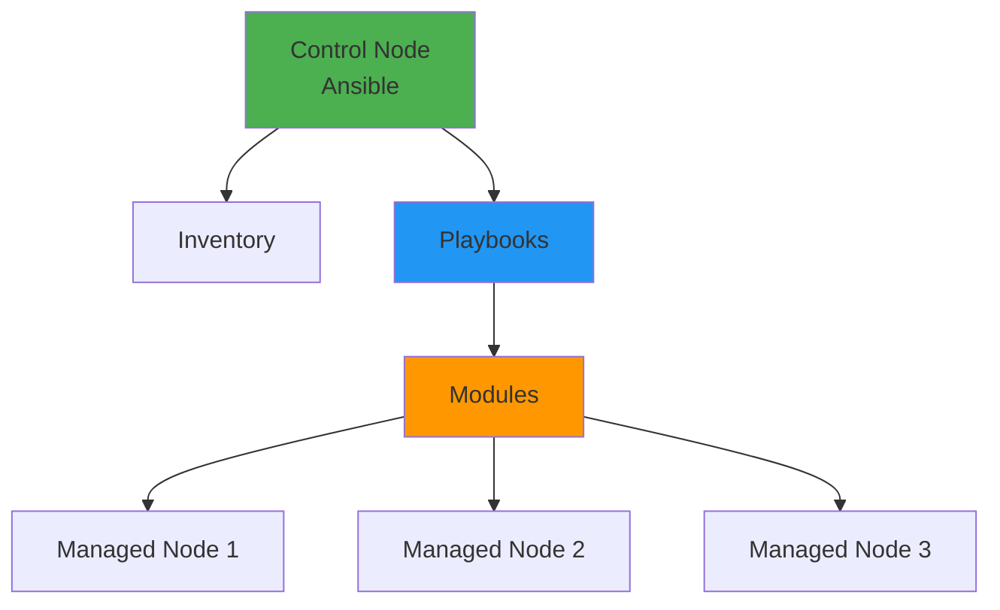
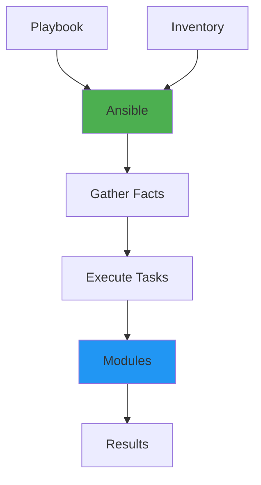
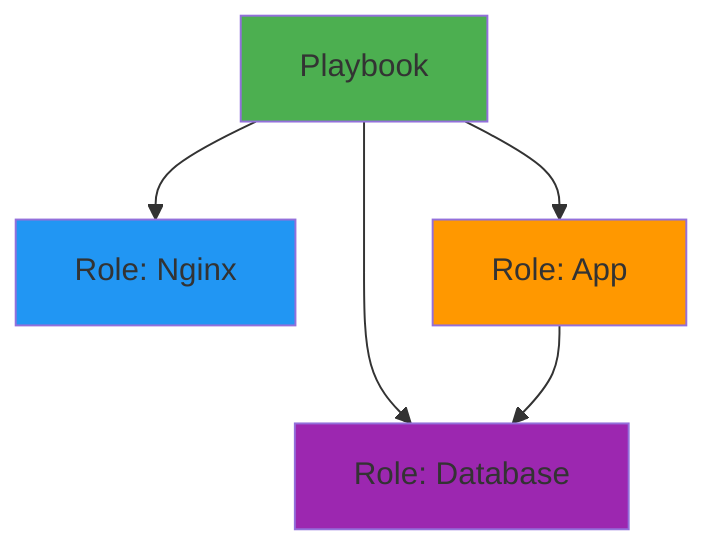

# Ansible Fundamentals

## Overview

Ansible is an open-source automation tool for configuration management, application deployment, and task automation. It uses a simple YAML-based language and requires no agents on managed nodes, making it easy to use and deploy. This guide covers Ansible basics, playbooks, roles, inventory management, and automation patterns.

## Deep Explanation

### What is Ansible?

Ansible is an agentless automation tool that:
- Manages configurations
- Deploys applications
- Automates repetitive tasks
- Orchestrates complex workflows

#### Ansible Architecture



**Key Features**:
- **Agentless**: Uses SSH (Linux) or WinRM (Windows)
- **Idempotent**: Safe to run multiple times
- **Simple**: YAML-based syntax
- **Powerful**: Extensive module library

### Core Concepts

#### Inventory

Inventory defines managed hosts.

**Static Inventory** (`inventory.ini`):
```ini
[web_servers]
web1.example.com
web2.example.com

[db_servers]
db1.example.com

[all:vars]
ansible_user=ubuntu
ansible_ssh_private_key_file=~/.ssh/id_rsa
```

**Dynamic Inventory**:
```python
#!/usr/bin/env python3
# aws_ec2.py
import json
import boto3

ec2 = boto3.client('ec2')
instances = ec2.describe_instances()

inventory = {
    'web': {
        'hosts': [],
        'vars': {}
    }
}

for reservation in instances['Reservations']:
    for instance in reservation['Instances']:
        if instance['State']['Name'] == 'running':
            inventory['web']['hosts'].append(instance['PublicIpAddress'])

print(json.dumps(inventory))
```

#### Playbooks

Playbooks define automation tasks.

**Basic Playbook** (`playbook.yml`):
```yaml
---
- name: Configure web servers
  hosts: web_servers
  become: yes
  tasks:
    - name: Install nginx
      apt:
        name: nginx
        state: present
        update_cache: yes
    
    - name: Start nginx
      systemd:
        name: nginx
        state: started
        enabled: yes
    
    - name: Copy configuration
      template:
        src: nginx.conf.j2
        dest: /etc/nginx/nginx.conf
      notify: restart nginx
  
  handlers:
    - name: restart nginx
      systemd:
        name: nginx
        state: restarted
```

#### Modules

Modules are units of work in Ansible.

**Common Modules**:
- `apt` / `yum`: Package management
- `systemd`: Service management
- `copy` / `template`: File operations
- `user`: User management
- `file`: File/directory operations
- `command` / `shell`: Execute commands

**Module Examples**:
```yaml
# Package management
- name: Install packages
  apt:
    name:
      - nginx
      - python3
    state: present

# Service management
- name: Ensure service is running
  systemd:
    name: nginx
    state: started
    enabled: yes

# File operations
- name: Create directory
  file:
    path: /var/www/html
    state: directory
    mode: '0755'

# Copy files
- name: Copy file
  copy:
    src: /local/file.txt
    dest: /remote/file.txt
    mode: '0644'

# Templates
- name: Configure application
  template:
    src: config.j2
    dest: /etc/app/config.conf
    owner: root
    group: root
    mode: '0644'
```

### Variables

#### Variable Types

**Playbook Variables**:
```yaml
---
- name: Configure app
  hosts: web_servers
  vars:
    app_name: myapp
    app_port: 8080
  tasks:
    - name: Print variable
      debug:
        msg: "App: {{ app_name }}, Port: {{ app_port }}"
```

**Inventory Variables**:
```ini
[web_servers]
web1.example.com app_port=8080
web2.example.com app_port=8081

[web_servers:vars]
app_name=myapp
db_host=db.example.com
```

**Group Variables** (`group_vars/web_servers.yml`):
```yaml
app_name: myapp
app_port: 8080
db_host: db.example.com
```

**Host Variables** (`host_vars/web1.example.com.yml`):
```yaml
app_port: 8080
```

#### Variable Precedence

1. Command line (`-e`)
2. Playbook vars
3. Inventory vars
4. Group vars
5. Host vars
6. Facts
7. Role defaults

### Conditionals and Loops

#### Conditionals

```yaml
- name: Install package conditionally
  apt:
    name: nginx
    state: present
  when: ansible_os_family == "Debian"

- name: Multiple conditions
  command: /bin/false
  when:
    - ansible_distribution == "Ubuntu"
    - ansible_distribution_version == "20.04"

- name: Complex condition
  command: /bin/true
  when: >
    (ansible_distribution == "Ubuntu" and
     ansible_distribution_version == "20.04") or
    (ansible_distribution == "CentOS" and
     ansible_distribution_version == "8")
```

#### Loops

```yaml
# Simple loop
- name: Install packages
  apt:
    name: "{{ item }}"
    state: present
  loop:
    - nginx
    - python3
    - git

# Loop with dictionary
- name: Create users
  user:
    name: "{{ item.name }}"
    uid: "{{ item.uid }}"
    groups: "{{ item.groups }}"
  loop:
    - name: alice
      uid: 1001
      groups: developers
    - name: bob
      uid: 1002
      groups: admins

# Loop with condition
- name: Install packages
  apt:
    name: "{{ item }}"
    state: present
  loop: "{{ packages }}"
  when: item is defined
```

### Roles

Roles organize playbooks into reusable components.

#### Role Structure

```
roles/
  nginx/
    tasks/
      main.yml
    handlers/
      main.yml
    templates/
      nginx.conf.j2
    files/
      default
    vars/
      main.yml
    defaults/
      main.yml
    meta/
      main.yml
```

#### Creating a Role

**Role Tasks** (`roles/nginx/tasks/main.yml`):
```yaml
---
- name: Install nginx
  apt:
    name: nginx
    state: present
  when: ansible_os_family == "Debian"

- name: Configure nginx
  template:
    src: nginx.conf.j2
    dest: /etc/nginx/nginx.conf
  notify: restart nginx

- name: Start nginx
  systemd:
    name: nginx
    state: started
    enabled: yes
```

**Role Defaults** (`roles/nginx/defaults/main.yml`):
```yaml
---
nginx_port: 80
nginx_worker_processes: auto
nginx_user: www-data
```

**Role Vars** (`roles/nginx/vars/main.yml`):
```yaml
---
nginx_package: nginx
nginx_service: nginx
```

**Using Roles**:
```yaml
---
- name: Configure web servers
  hosts: web_servers
  roles:
    - role: nginx
      vars:
        nginx_port: 8080
    - role: app
```

### Handlers

Handlers run tasks triggered by other tasks.

```yaml
---
- name: Configure nginx
  hosts: web_servers
  tasks:
    - name: Update nginx config
      template:
        src: nginx.conf.j2
        dest: /etc/nginx/nginx.conf
      notify: restart nginx
    
    - name: Update app config
      template:
        src: app.conf.j2
        dest: /etc/app/app.conf
      notify:
        - restart nginx
        - restart app
  
  handlers:
    - name: restart nginx
      systemd:
        name: nginx
        state: restarted
    
    - name: restart app
      systemd:
        name: app
        state: restarted
```

### Templates

Templates use Jinja2 syntax.

**Template File** (`templates/nginx.conf.j2`):
```nginx
user {{ nginx_user }};
worker_processes {{ nginx_worker_processes }};

events {
    worker_connections {{ nginx_worker_connections }};
}

http {
    server {
        listen {{ nginx_port }};
        server_name {{ server_name }};
        
        location / {
            proxy_pass http://{{ app_host }}:{{ app_port }};
        }
    }
}
```

**Using Templates**:
```yaml
- name: Configure nginx
  template:
    src: nginx.conf.j2
    dest: /etc/nginx/nginx.conf
    vars:
      nginx_user: www-data
      nginx_port: 80
      server_name: example.com
```

### Facts

Facts are system information gathered by Ansible.

**Gathering Facts**:
```yaml
---
- name: Gather facts
  hosts: all
  tasks:
    - name: Display facts
      debug:
        var: ansible_facts
```

**Using Facts**:
```yaml
- name: Install package based on OS
  apt:
    name: nginx
    state: present
  when: ansible_os_family == "Debian"

- name: Use hostname
  debug:
    msg: "Hostname: {{ ansible_hostname }}"
```

**Custom Facts** (`/etc/ansible/facts.d/custom.fact`):
```ini
[application]
name=myapp
version=1.0.0
```

### Error Handling

#### Ignoring Errors

```yaml
- name: Try command
  command: /bin/false
  ignore_errors: yes
```

#### Failed When

```yaml
- name: Check service
  command: systemctl is-active nginx
  register: result
  failed_when: result.rc != 0
```

#### Blocks

```yaml
- name: Configure service
  block:
    - name: Install package
      apt:
        name: nginx
        state: present
    
    - name: Configure service
      template:
        src: nginx.conf.j2
        dest: /etc/nginx/nginx.conf
    
    - name: Start service
      systemd:
        name: nginx
        state: started
  
  rescue:
    - name: Handle error
      debug:
        msg: "Configuration failed"
  
  always:
    - name: Cleanup
      file:
        path: /tmp/nginx.conf
        state: absent
```

## Diagrams

### Ansible Execution Flow



### Role Dependencies



## Real Code Examples

### Complete Web Server Setup

```yaml
---
# playbook.yml
- name: Configure web servers
  hosts: web_servers
  become: yes
  vars:
    app_name: myapp
    app_port: 8080
    nginx_port: 80
  
  tasks:
    - name: Update apt cache
      apt:
        update_cache: yes
      when: ansible_os_family == "Debian"
    
    - name: Install nginx
      apt:
        name: nginx
        state: present
        update_cache: yes
    
    - name: Create app directory
      file:
        path: /var/www/{{ app_name }}
        state: directory
        owner: www-data
        group: www-data
        mode: '0755'
    
    - name: Copy application files
      copy:
        src: app/
        dest: /var/www/{{ app_name }}/
        owner: www-data
        group: www-data
    
    - name: Configure nginx
      template:
        src: nginx.conf.j2
        dest: /etc/nginx/sites-available/{{ app_name }}
        owner: root
        group: root
        mode: '0644'
      notify: restart nginx
    
    - name: Enable site
      file:
        src: /etc/nginx/sites-available/{{ app_name }}
        dest: /etc/nginx/sites-enabled/{{ app_name }}
        state: link
    
    - name: Remove default site
      file:
        path: /etc/nginx/sites-enabled/default
        state: absent
    
    - name: Start and enable nginx
      systemd:
        name: nginx
        state: started
        enabled: yes
  
  handlers:
    - name: restart nginx
      systemd:
        name: nginx
        state: restarted
```

**Template** (`templates/nginx.conf.j2`):
```nginx
server {
    listen {{ nginx_port }};
    server_name {{ ansible_hostname }};
    
    root /var/www/{{ app_name }};
    index index.html;
    
    location / {
        try_files $uri $uri/ =404;
    }
    
    location /api {
        proxy_pass http://localhost:{{ app_port }};
        proxy_set_header Host $host;
        proxy_set_header X-Real-IP $remote_addr;
    }
}
```

### Multi-Tier Application Deployment

```yaml
---
- name: Deploy multi-tier application
  hosts: all
  become: yes
  
  tasks:
    - name: Include web server tasks
      include_tasks: tasks/web.yml
      when: "'web' in group_names"
    
    - name: Include database tasks
      include_tasks: tasks/database.yml
      when: "'db' in group_names"
    
    - name: Include app server tasks
      include_tasks: tasks/app.yml
      when: "'app' in group_names"

---
# tasks/web.yml
- name: Install nginx
  apt:
    name: nginx
    state: present

- name: Configure nginx
  template:
    src: nginx.conf.j2
    dest: /etc/nginx/nginx.conf
  notify: restart nginx

---
# tasks/database.yml
- name: Install PostgreSQL
  apt:
    name: postgresql
    state: present

- name: Create database
  postgresql_db:
    name: "{{ db_name }}"
    state: present

- name: Create user
  postgresql_user:
    name: "{{ db_user }}"
    password: "{{ db_password }}"
    priv: "{{ db_name }}:ALL"
    state: present

---
# tasks/app.yml
- name: Install Python
  apt:
    name:
      - python3
      - python3-pip
    state: present

- name: Install application dependencies
  pip:
    requirements: /opt/app/requirements.txt
    virtualenv: /opt/app/venv

- name: Start application
  systemd:
    name: app
    state: started
    enabled: yes
```

### Role Example: Nginx Role

**Role Structure**:
```
roles/nginx/
├── tasks/
│   └── main.yml
├── handlers/
│   └── main.yml
├── templates/
│   └── nginx.conf.j2
├── defaults/
│   └── main.yml
└── vars/
    └── main.yml
```

**tasks/main.yml**:
```yaml
---
- name: Install nginx
  package:
    name: "{{ nginx_package }}"
    state: present

- name: Configure nginx
  template:
    src: nginx.conf.j2
    dest: "{{ nginx_config_path }}"
  notify: restart nginx

- name: Ensure nginx is running
  systemd:
    name: "{{ nginx_service }}"
    state: started
    enabled: yes
```

**defaults/main.yml**:
```yaml
---
nginx_package: nginx
nginx_service: nginx
nginx_config_path: /etc/nginx/nginx.conf
nginx_port: 80
nginx_user: www-data
```

**Using the Role**:
```yaml
---
- name: Configure web servers
  hosts: web_servers
  roles:
    - role: nginx
      vars:
        nginx_port: 8080
```

## Hard Use-Case: Zero-Downtime Deployment

### Problem

Deploy application updates without downtime.

### Solution: Blue-Green Deployment with Ansible

```yaml
---
- name: Zero-downtime deployment
  hosts: web_servers
  vars:
    app_version: "2.0.0"
    blue_port: 8080
    green_port: 8081
  
  tasks:
    - name: Determine current version
      command: docker ps --filter "name=app" --format "{{ '{{' }}.Image{{ '}}' }}"
      register: current_version
      changed_when: false
    
    - name: Set deployment color
      set_fact:
        deploy_color: "{{ 'green' if 'blue' in current_version.stdout else 'blue' }}"
        target_port: "{{ green_port if deploy_color == 'green' else blue_port }}"
        old_port: "{{ blue_port if deploy_color == 'green' else green_port }}"
    
    - name: Deploy new version
      docker_container:
        name: "app-{{ deploy_color }}"
        image: "myapp:{{ app_version }}"
        ports:
          - "{{ target_port }}:8080"
        state: started
    
    - name: Health check new version
      uri:
        url: "http://localhost:{{ target_port }}/health"
        status_code: 200
      register: health_check
      until: health_check.status == 200
      retries: 10
      delay: 5
    
    - name: Switch traffic to new version
      template:
        src: nginx.conf.j2
        dest: /etc/nginx/nginx.conf
        vars:
          app_port: "{{ target_port }}"
      notify: reload nginx
    
    - name: Stop old version
      docker_container:
        name: "app-{{ 'blue' if deploy_color == 'green' else 'green' }}"
        state: stopped
  
  handlers:
    - name: reload nginx
      systemd:
        name: nginx
        state: reloaded
```

## Edge Cases and Pitfalls

### 1. Not Using Idempotency

**Problem**: Tasks not idempotent

```yaml
# BAD: Not idempotent
- name: Create file
  command: echo "content" > /tmp/file.txt
```

**Solution**: Use idempotent modules

```yaml
# GOOD: Idempotent
- name: Create file
  copy:
    content: "content"
    dest: /tmp/file.txt
```

### 2. Ignoring Errors Incorrectly

**Problem**: Hiding real errors

```yaml
# BAD: Ignore all errors
- name: Install package
  apt:
    name: nonexistent
  ignore_errors: yes
```

**Solution**: Handle errors appropriately

```yaml
# GOOD: Handle specific errors
- name: Install package
  apt:
    name: package
  rescue:
    - name: Handle error
      debug:
        msg: "Package installation failed"
```

### 3. Not Using Roles

**Problem**: Duplicated code

**Solution**: Use roles for reusability

```yaml
# GOOD: Use roles
roles:
  - nginx
  - app
```

## References and Further Reading

- [Ansible Documentation](https://docs.ansible.com/) - Official docs
- [Ansible Best Practices](https://docs.ansible.com/ansible/latest/user_guide/playbooks_best_practices.html) - Best practices
- [Ansible Galaxy](https://galaxy.ansible.com/) - Role repository
- [Ansible Modules](https://docs.ansible.com/ansible/latest/modules/modules_by_category.html) - Module reference

## Quiz

### Question 1
What makes Ansible agentless?

**A)** It doesn't require agents on managed nodes  
**B)** It uses agents  
**C)** It requires agents  
**D)** It's not agentless

**Answer: A** - Ansible is agentless because it uses SSH (Linux) or WinRM (Windows) to connect to managed nodes, requiring no agents.

### Question 2
What is a playbook?

**A)** A list of hosts  
**B)** A YAML file defining automation tasks  
**C)** A module  
**D)** A variable

**Answer: B** - A playbook is a YAML file that defines automation tasks, plays, and configurations.

### Question 3
What is idempotency in Ansible?

**A)** Running tasks multiple times  
**B)** Running tasks produces the same result regardless of how many times it's run  
**C)** Running tasks once  
**D)** Not running tasks

**Answer: B** - Idempotency means running a task multiple times produces the same result, making Ansible safe to run repeatedly.

### Question 4
What are roles used for?

**A)** Defining hosts  
**B)** Organizing playbooks into reusable components  
**C)** Running commands  
**D)** Storing variables

**Answer: B** - Roles organize playbooks into reusable, shareable components with a standard directory structure.

### Question 5
What is a handler?

**A)** A task that always runs  
**B)** A task triggered by other tasks  
**C)** A variable  
**D)** A module

**Answer: B** - Handlers are tasks that run when notified by other tasks, typically used for service restarts.

## Related Topics

- [Linux Fundamentals for DevOps](../01_beginners/03.%20Linux%20Fundamentals%20for%20DevOps.md) - Linux basics
- [Terraform Fundamentals](./02.%20Terraform%20Fundamentals.md) - Infrastructure as Code
- [Introduction to CI/CD](../01_beginners/04.%20Introduction%20to%20CI%CD.md) - Automation pipelines

