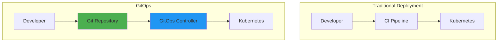
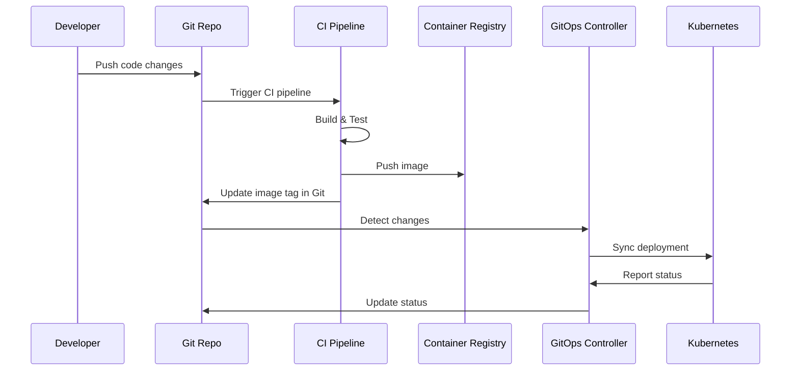
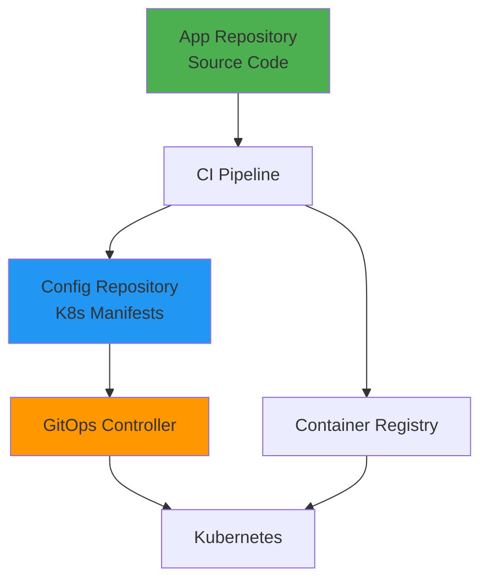
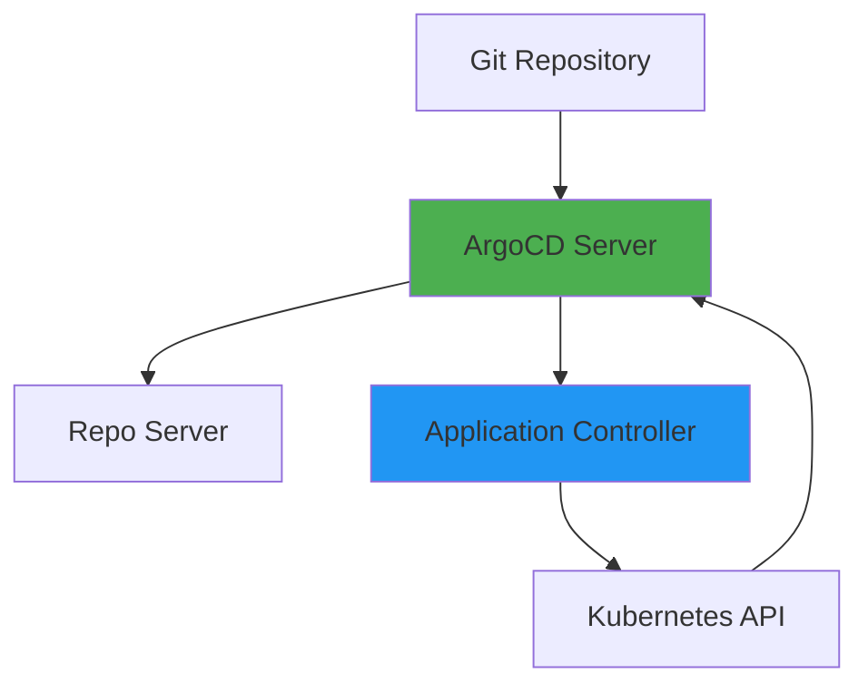
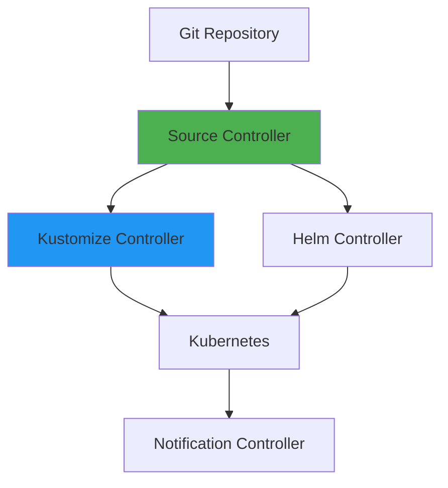
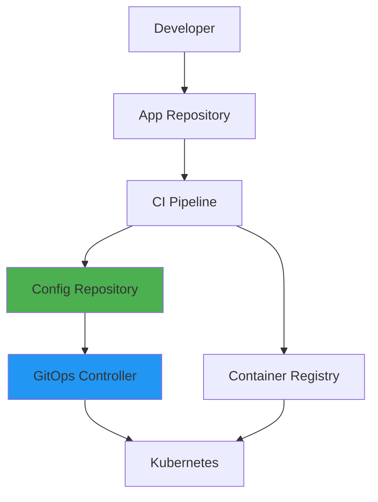
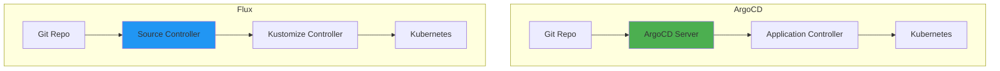

# GitOps Fundamentals

## Overview

GitOps is a methodology that uses Git as the single source of truth for infrastructure and application deployments. It extends DevOps practices by managing infrastructure and application state declaratively through Git repositories, enabling automated, auditable, and reproducible deployments. This guide covers GitOps principles, ArgoCD and Flux implementations, and best practices for Git-based operations.

## Deep Explanation

### What is GitOps?

GitOps is an operational framework that takes DevOps best practices used for application development and applies them to infrastructure automation.

#### GitOps Principles

1. **Declarative**: System state described declaratively
2. **Version Controlled**: All changes in Git
3. **Automated**: Automated synchronization
4. **Observable**: Continuous monitoring and alerting

#### GitOps vs Traditional Deployment



**Traditional**: CI pipeline deploys directly
**GitOps**: Git is source of truth, controller syncs

### GitOps Workflow

#### Basic Workflow



#### Two Repository Pattern

**App Repository**: Application code
**Config Repository**: Kubernetes manifests



### ArgoCD

#### What is ArgoCD?

ArgoCD is a declarative, GitOps continuous delivery tool for Kubernetes.

#### ArgoCD Architecture



**Components**:
- **API Server**: REST API and UI
- **Repository Server**: Fetches Git repos
- **Application Controller**: Syncs applications

#### Installing ArgoCD

```bash
# Install ArgoCD
kubectl create namespace argocd
kubectl apply -n argocd -f https://raw.githubusercontent.com/argoproj/argo-cd/stable/manifests/install.yaml

# Get admin password
kubectl -n argocd get secret argocd-initial-admin-secret -o jsonpath="{.data.password}" | base64 -d

# Port forward to access UI
kubectl port-forward svc/argocd-server -n argocd 8080:443
```

#### ArgoCD Application

**Application Manifest**:
```yaml
apiVersion: argoproj.io/v1alpha1
kind: Application
metadata:
  name: myapp
  namespace: argocd
spec:
  project: default
  source:
    repoURL: https://github.com/user/config-repo.git
    targetRevision: main
    path: apps/myapp
  destination:
    server: https://kubernetes.default.svc
    namespace: production
  syncPolicy:
    automated:
      prune: true
      selfHeal: true
    syncOptions:
    - CreateNamespace=true
```

**CLI Commands**:
```bash
# Create application
argocd app create myapp \
  --repo https://github.com/user/config-repo.git \
  --path apps/myapp \
  --dest-server https://kubernetes.default.svc \
  --dest-namespace production

# Sync application
argocd app sync myapp

# Get application status
argocd app get myapp

# List applications
argocd app list
```

#### ArgoCD Sync Policies

**Manual Sync**:
```yaml
syncPolicy:
  syncOptions:
    - CreateNamespace=true
```

**Automated Sync**:
```yaml
syncPolicy:
  automated:
    prune: true      # Delete resources not in Git
    selfHeal: true   # Auto-sync if drift detected
```

**Sync Windows**:
```yaml
syncPolicy:
  syncWindows:
  - kind: allow
    schedule: '10 1 * * *'  # Allow sync at 1:10 AM
    duration: 1h
  - kind: deny
    schedule: '* * * * *'   # Deny all other times
```

### Flux

#### What is Flux?

Flux is a GitOps tool that automatically keeps Kubernetes clusters in sync with sources of configuration.

#### Flux Architecture



**Components**:
- **Source Controller**: Manages sources (Git, Helm, S3)
- **Kustomize Controller**: Applies Kustomize manifests
- **Helm Controller**: Manages Helm releases
- **Notification Controller**: Sends notifications

#### Installing Flux

```bash
# Install Flux CLI
curl -s https://fluxcd.io/install.sh | sudo bash

# Bootstrap Flux
flux bootstrap github \
  --owner=user \
  --repository=flux-config \
  --branch=main \
  --path=clusters/production \
  --personal

# Verify installation
flux check
```

#### Flux GitRepository

```yaml
apiVersion: source.toolkit.fluxcd.io/v1beta2
kind: GitRepository
metadata:
  name: myapp
  namespace: flux-system
spec:
  interval: 1m
  url: https://github.com/user/config-repo
  ref:
    branch: main
  secretRef:
    name: git-credentials
```

#### Flux Kustomization

```yaml
apiVersion: kustomize.toolkit.fluxcd.io/v1beta2
kind: Kustomization
metadata:
  name: myapp
  namespace: flux-system
spec:
  interval: 5m
  path: ./apps/myapp
  prune: true
  sourceRef:
    kind: GitRepository
    name: myapp
  validation: client
  healthChecks:
  - apiVersion: apps/v1
    kind: Deployment
    name: myapp
    namespace: production
```

#### Flux HelmRelease

```yaml
apiVersion: helm.toolkit.fluxcd.io/v2beta1
kind: HelmRelease
metadata:
  name: myapp
  namespace: production
spec:
  interval: 5m
  chart:
    spec:
      chart: myapp
      sourceRef:
        kind: HelmRepository
        name: my-charts
      version: "1.0.0"
  values:
    replicaCount: 3
    image:
      tag: "1.0.0"
```

### GitOps Patterns

#### Pattern 1: Image Update Automation

**ArgoCD Image Updater**:
```yaml
apiVersion: argoproj.io/v1alpha1
kind: Application
metadata:
  name: myapp
  annotations:
    argocd-image-updater.argoproj.io/image-list: myapp=registry.example.com/myapp
    argocd-image-updater.argoproj.io/write-back-method: git
spec:
  source:
    repoURL: https://github.com/user/config-repo.git
    path: apps/myapp
```

**Flux Image Automation**:
```yaml
apiVersion: image.toolkit.fluxcd.io/v1beta1
kind: ImageRepository
metadata:
  name: myapp
  namespace: flux-system
spec:
  image: registry.example.com/myapp
  interval: 1m

---
apiVersion: image.toolkit.fluxcd.io/v1beta1
kind: ImagePolicy
metadata:
  name: myapp
  namespace: flux-system
spec:
  imageRepositoryRef:
    name: myapp
  policy:
    semver:
      range: '>=1.0.0'

---
apiVersion: image.toolkit.fluxcd.io/v1beta1
kind: ImageUpdateAutomation
metadata:
  name: myapp
  namespace: flux-system
spec:
  interval: 5m
  sourceRef:
    kind: GitRepository
    name: flux-config
  git:
    checkout:
      ref:
        branch: main
    commit:
      author:
        name: Flux
        email: flux@example.com
      messageTemplate: 'Update image to {{range $filename, $value := .}}{{ $filename }}: {{ $value }}{{end}}'
  update:
    path: ./apps/myapp
    strategy: Setters
```

#### Pattern 2: Multi-Environment

**Environment Structure**:
```
config-repo/
├── base/
│   └── deployment.yaml
├── overlays/
│   ├── staging/
│   │   └── kustomization.yaml
│   └── production/
│       └── kustomization.yaml
```

**Base Deployment**:
```yaml
# base/deployment.yaml
apiVersion: apps/v1
kind: Deployment
metadata:
  name: myapp
spec:
  replicas: 1
  template:
    spec:
      containers:
      - name: myapp
        image: registry.example.com/myapp:latest
```

**Staging Overlay**:
```yaml
# overlays/staging/kustomization.yaml
apiVersion: kustomize.config.k8s.io/v1beta1
kind: Kustomization
bases:
- ../../base
replicas:
- name: myapp
  count: 2
patches:
- target:
    kind: Deployment
    name: myapp
  patch: |-
    - op: replace
      path: /spec/template/spec/containers/0/env
      value:
      - name: ENVIRONMENT
        value: staging
```

**Production Overlay**:
```yaml
# overlays/production/kustomization.yaml
apiVersion: kustomize.config.k8s.io/v1beta1
kind: Kustomization
bases:
- ../../base
replicas:
- name: myapp
  count: 5
patches:
- target:
    kind: Deployment
    name: myapp
  patch: |-
    - op: replace
      path: /spec/template/spec/containers/0/env
      value:
      - name: ENVIRONMENT
        value: production
```

#### Pattern 3: Progressive Delivery

**ArgoCD Rollouts**:
```yaml
apiVersion: argoproj.io/v1alpha1
kind: Rollout
metadata:
  name: myapp
spec:
  replicas: 5
  strategy:
    canary:
      steps:
      - setWeight: 20
      - pause: {}
      - setWeight: 40
      - pause: {duration: 10}
      - setWeight: 60
      - pause: {duration: 10}
      - setWeight: 80
      - pause: {duration: 10}
      canaryService: myapp-canary
      stableService: myapp-stable
      trafficRouting:
        istio:
          virtualService:
            name: myapp-vs
            routes:
            - primary
  selector:
    matchLabels:
      app: myapp
  template:
    metadata:
      labels:
        app: myapp
    spec:
      containers:
      - name: myapp
        image: registry.example.com/myapp:1.0.0
```

**Flagger**:
```yaml
apiVersion: flagger.app/v1beta1
kind: Canary
metadata:
  name: myapp
spec:
  targetRef:
    apiVersion: apps/v1
    kind: Deployment
    name: myapp
  service:
    port: 8080
  analysis:
    interval: 1m
    threshold: 5
    maxWeight: 50
    stepWeight: 10
    metrics:
    - name: request-success-rate
      thresholdRange:
        min: 99
    - name: request-duration
      thresholdRange:
        max: 500
```

### Best Practices

#### 1. Separate Repositories

- **App Repo**: Application source code
- **Config Repo**: Kubernetes manifests
- **Ops Repo**: Infrastructure as Code

#### 2. Use Kustomize or Helm

**Kustomize**:
```yaml
# kustomization.yaml
apiVersion: kustomize.config.k8s.io/v1beta1
kind: Kustomization
resources:
- deployment.yaml
- service.yaml
patches:
- patch.yaml
```

**Helm**:
```yaml
# values.yaml
replicaCount: 3
image:
  repository: myapp
  tag: "1.0.0"
```

#### 3. Implement Sync Policies

```yaml
syncPolicy:
  automated:
    prune: true
    selfHeal: true
  syncOptions:
    - CreateNamespace=true
    - PruneLast=true
```

#### 4. Use Health Checks

```yaml
healthChecks:
- apiVersion: apps/v1
  kind: Deployment
  name: myapp
  namespace: production
```

#### 5. Monitor and Alert

```yaml
# ArgoCD Notifications
apiVersion: v1
kind: ConfigMap
metadata:
  name: argocd-notifications-cm
data:
  service.slack: |
    token: $slack-token
  trigger.on-sync-succeeded: |
    - send:
        slack:
          message: Application {{.app.metadata.name}} synced successfully
```

## Diagrams

### GitOps Architecture



### ArgoCD vs Flux



## Real Code Examples

### Complete GitOps Setup

**Repository Structure**:
```
config-repo/
├── apps/
│   └── myapp/
│       ├── base/
│       │   ├── deployment.yaml
│       │   ├── service.yaml
│       │   └── kustomization.yaml
│       └── overlays/
│           ├── staging/
│           │   └── kustomization.yaml
│           └── production/
│               └── kustomization.yaml
└── infrastructure/
    └── monitoring/
        └── prometheus.yaml
```

**Base Deployment**:
```yaml
# apps/myapp/base/deployment.yaml
apiVersion: apps/v1
kind: Deployment
metadata:
  name: myapp
spec:
  replicas: 1
  selector:
    matchLabels:
      app: myapp
  template:
    metadata:
      labels:
        app: myapp
    spec:
      containers:
      - name: myapp
        image: registry.example.com/myapp:latest
        ports:
        - containerPort: 8080
        env:
        - name: ENVIRONMENT
          value: base
        resources:
          requests:
            memory: "128Mi"
            cpu: "100m"
          limits:
            memory: "256Mi"
            cpu: "200m"
        livenessProbe:
          httpGet:
            path: /health
            port: 8080
          initialDelaySeconds: 30
          periodSeconds: 10
        readinessProbe:
          httpGet:
            path: /ready
            port: 8080
          initialDelaySeconds: 5
          periodSeconds: 5

---
# apps/myapp/base/service.yaml
apiVersion: v1
kind: Service
metadata:
  name: myapp
spec:
  selector:
    app: myapp
  ports:
  - port: 80
    targetPort: 8080
  type: ClusterIP

---
# apps/myapp/base/kustomization.yaml
apiVersion: kustomize.config.k8s.io/v1beta1
kind: Kustomization
resources:
- deployment.yaml
- service.yaml
```

**Production Overlay**:
```yaml
# apps/myapp/overlays/production/kustomization.yaml
apiVersion: kustomize.config.k8s.io/v1beta1
kind: Kustomization
namespace: production
bases:
- ../../base
replicas:
- name: myapp
  count: 5
patches:
- target:
    kind: Deployment
    name: myapp
  patch: |-
    - op: replace
      path: /spec/template/spec/containers/0/env/0/value
      value: production
    - op: replace
      path: /spec/template/spec/containers/0/resources/requests/memory
      value: "256Mi"
    - op: replace
      path: /spec/template/spec/containers/0/resources/limits/memory
      value: "512Mi"
```

**ArgoCD Application**:
```yaml
# argocd-apps/myapp.yaml
apiVersion: argoproj.io/v1alpha1
kind: Application
metadata:
  name: myapp-production
  namespace: argocd
spec:
  project: default
  source:
    repoURL: https://github.com/user/config-repo.git
    targetRevision: main
    path: apps/myapp/overlays/production
  destination:
    server: https://kubernetes.default.svc
    namespace: production
  syncPolicy:
    automated:
      prune: true
      selfHeal: true
    syncOptions:
    - CreateNamespace=true
    - PruneLast=true
  revisionHistoryLimit: 10
```

### CI/CD Integration

**GitHub Actions**:
```yaml
# .github/workflows/update-image.yaml
name: Update Image Tag
on:
  push:
    branches: [main]
    paths:
      - 'apps/myapp/**'

jobs:
  update-image:
    runs-on: ubuntu-latest
    steps:
      - uses: actions/checkout@v3
        with:
          token: ${{ secrets.GITHUB_TOKEN }}
      
      - name: Build and push image
        run: |
          docker build -t registry.example.com/myapp:${{ github.sha }} .
          docker push registry.example.com/myapp:${{ github.sha }}
      
      - name: Update image tag
        run: |
          sed -i "s|image:.*|image: registry.example.com/myapp:${{ github.sha }}|" \
            apps/myapp/base/deployment.yaml
      
      - name: Commit changes
        run: |
          git config user.name "GitHub Actions"
          git config user.email "actions@github.com"
          git add apps/myapp/base/deployment.yaml
          git commit -m "Update image to ${{ github.sha }}"
          git push
```

## Hard Use-Case: Multi-Cluster GitOps

### Problem

Manage deployments across multiple Kubernetes clusters.

### Solution: Multi-Cluster ArgoCD

```yaml
# ArgoCD Application for each cluster
apiVersion: argoproj.io/v1alpha1
kind: Application
metadata:
  name: myapp-cluster1
spec:
  source:
    repoURL: https://github.com/user/config-repo.git
    path: clusters/cluster1/apps/myapp
  destination:
    server: https://cluster1.example.com
    namespace: production

---
apiVersion: argoproj.io/v1alpha1
kind: Application
metadata:
  name: myapp-cluster2
spec:
  source:
    repoURL: https://github.com/user/config-repo.git
    path: clusters/cluster2/apps/myapp
  destination:
    server: https://cluster2.example.com
    namespace: production
```

## Edge Cases and Pitfalls

### 1. Drift Detection

**Problem**: Manual changes cause drift

**Solution**: Enable self-heal

```yaml
syncPolicy:
  automated:
    selfHeal: true  # Auto-sync if drift detected
```

### 2. Secret Management

**Problem**: Secrets in Git

**Solution**: Use external secret management

```yaml
# Use Sealed Secrets or External Secrets Operator
apiVersion: bitnami.com/v1alpha1
kind: SealedSecret
metadata:
  name: mysecret
spec:
  encryptedData:
    password: AgBy3i4OJSWK+PiTySYZZA==
```

### 3. Large Repositories

**Problem**: Slow sync times

**Solution**: Use shallow clones

```yaml
source:
  repoURL: https://github.com/user/repo.git
  targetRevision: main
  # ArgoCD uses shallow clones by default
```

## References and Further Reading

- [ArgoCD Documentation](https://argo-cd.readthedocs.io/) - ArgoCD guide
- [Flux Documentation](https://fluxcd.io/docs/) - Flux guide
- [GitOps Working Group](https://www.gitops.tech/) - GitOps principles
- [OpenGitOps](https://opengitops.dev/) - GitOps standards

## Quiz

### Question 1
What is GitOps?

**A)** Using Git for version control  
**B)** Using Git as single source of truth for infrastructure and deployments  
**C)** Git operations  
**D)** Git branching strategy

**Answer: B** - GitOps uses Git as the single source of truth for both infrastructure and application deployments, with automated synchronization.

### Question 2
What is the main difference between ArgoCD and Flux?

**A)** They're the same  
**B)** ArgoCD is more UI-focused, Flux is more CLI/API-focused  
**C)** Flux is only for Helm  
**D)** ArgoCD doesn't support Git

**Answer: B** - ArgoCD provides a rich UI, while Flux is more focused on CLI and API, though both support GitOps workflows.

### Question 3
What is a Kustomization in Flux?

**A)** A Git repository  
**B)** A resource that applies Kustomize manifests  
**C)** A Helm chart  
**D)** A Kubernetes deployment

**Answer: B** - Kustomization is a Flux resource that applies Kustomize manifests from a Git repository to a Kubernetes cluster.

### Question 4
What is self-heal in GitOps?

**A)** Fixing broken code  
**B)** Automatically syncing when drift is detected  
**C)** Health checks  
**D)** Restarting pods

**Answer: B** - Self-heal automatically syncs the cluster state back to match Git when drift is detected.

### Question 5
What should you use for secret management in GitOps?

**A)** Store secrets directly in Git  
**B)** Use external secret management tools  
**C)** Hardcode secrets  
**D)** Don't use secrets

**Answer: B** - Use external secret management tools like Sealed Secrets or External Secrets Operator, never store plain secrets in Git.

## Related Topics

- [Git Fundamentals & Workflows](../01_beginners/02.%20Git%20Fundamentals%20%26%20Workflows.md) - Git basics
- [Kubernetes Fundamentals](./01.%20Kubernetes%20Fundamentals.md) - Kubernetes
- [Introduction to CI/CD](../01_beginners/04.%20Introduction%20to%20CI%CD.md) - CI/CD concepts

