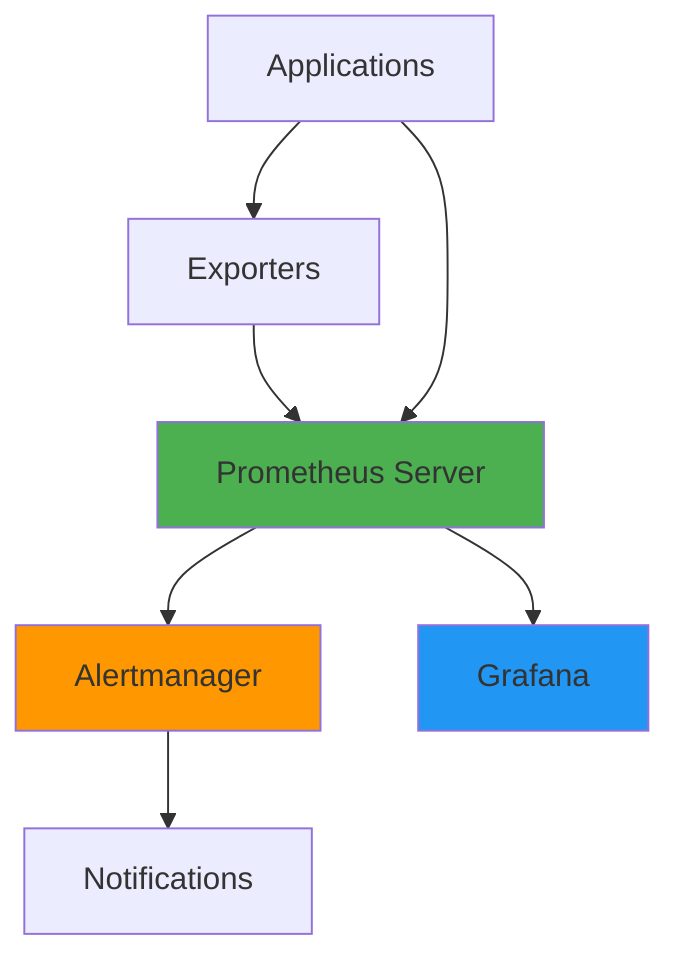
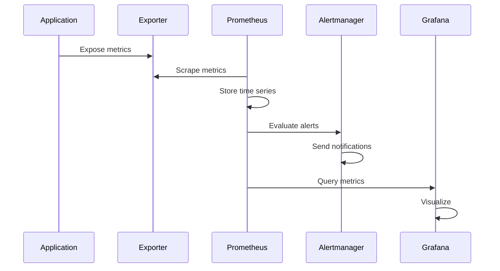
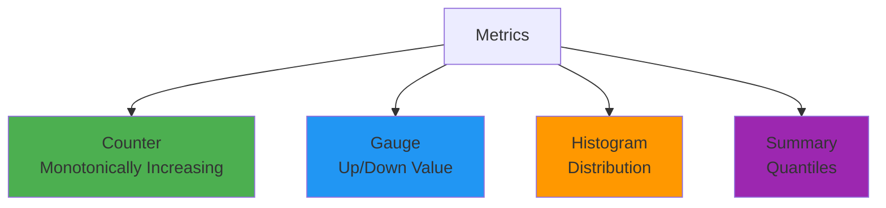

# Prometheus & Grafana Deep Dive

## Overview

Prometheus is a powerful open-source monitoring and alerting toolkit, while Grafana provides rich visualization and analytics capabilities. Together, they form a comprehensive monitoring solution for modern applications. This guide covers Prometheus architecture, PromQL query language, Grafana dashboard creation, alerting rules, and advanced monitoring patterns.

## Deep Explanation

### Prometheus Architecture

#### Core Components



**Components**:
- **Prometheus Server**: Scrapes and stores metrics
- **Exporters**: Expose metrics from various systems
- **Alertmanager**: Handles alerts
- **Grafana**: Visualizes metrics

#### Data Model

**Metrics**: Time series identified by metric name and labels

```
http_requests_total{method="GET", status="200", endpoint="/api/users"}
```

**Structure**:
- **Metric Name**: `http_requests_total`
- **Labels**: `method="GET"`, `status="200"`, `endpoint="/api/users"`
- **Value**: Numeric value at a timestamp

### PromQL (Prometheus Query Language)

#### Basic Queries

**Selecting Metrics**:
```promql
# Select all time series
http_requests_total

# Filter by label
http_requests_total{method="GET"}

# Multiple label filters
http_requests_total{method="GET", status="200"}

# Regex matching
http_requests_total{method=~"GET|POST"}

# Negative matching
http_requests_total{method!="GET"}
```

#### Rate Functions

**Rate**:
```promql
# Rate over 5 minutes
rate(http_requests_total[5m])

# Rate per second
rate(http_requests_total[5m]) * 60
```

**Increase**:
```promql
# Increase over 5 minutes
increase(http_requests_total[5m])
```

**Irate**:
```promql
# Instant rate (last two samples)
irate(http_requests_total[5m])
```

#### Aggregation Functions

**Sum**:
```promql
# Sum all requests
sum(http_requests_total)

# Sum by label
sum(http_requests_total) by (method)

# Sum without label
sum(http_requests_total) without (instance)
```

**Average**:
```promql
# Average CPU usage
avg(cpu_usage_percent)

# Average by instance
avg(cpu_usage_percent) by (instance)
```

**Max/Min**:
```promql
# Maximum latency
max(http_request_duration_seconds)

# Minimum memory usage
min(memory_usage_bytes)
```

**Count**:
```promql
# Count instances
count(http_requests_total)

# Count by status
count(http_requests_total) by (status)
```

#### Aggregation Operators

**Grouping**:
```promql
# Group by method
sum(http_requests_total) by (method)

# Group by multiple labels
sum(http_requests_total) by (method, status)
```

**Without**:
```promql
# Sum without instance label
sum(http_requests_total) without (instance)
```

#### Mathematical Operations

**Arithmetic**:
```promql
# Calculate percentage
(rate(http_requests_total{status="200"}[5m]) / rate(http_requests_total[5m])) * 100

# Multiply
memory_usage_bytes * 1024

# Divide
rate(http_requests_total[5m]) / rate(http_requests_total[5m])
```

**Comparison**:
```promql
# Greater than
cpu_usage_percent > 80

# Less than
memory_usage_bytes < 1073741824

# Equal
http_requests_total{status="500"} == 0
```

#### Functions

**Time Functions**:
```promql
# Current time
time()

# Timestamp
timestamp(http_requests_total)
```

**Mathematical Functions**:
```promql
# Absolute value
abs(temperature_celsius)

# Square root
sqrt(area_square_meters)

# Logarithm
log2(memory_bytes)
```

**Statistical Functions**:
```promql
# Quantile
quantile(0.95, http_request_duration_seconds)

# Standard deviation
stddev(cpu_usage_percent)

# Variance
variance(response_time_seconds)
```

**Histogram Functions**:
```promql
# Histogram quantile
histogram_quantile(0.95, rate(http_request_duration_seconds_bucket[5m]))

# Rate of histogram
rate(http_request_duration_seconds_bucket[5m])
```

### Prometheus Configuration

#### prometheus.yml

```yaml
global:
  scrape_interval: 15s
  evaluation_interval: 15s
  external_labels:
    cluster: 'production'
    environment: 'prod'

# Alertmanager configuration
alerting:
  alertmanagers:
    - static_configs:
        - targets:
            - alertmanager:9093

# Load rules
rule_files:
  - "alerts/*.yml"

# Scrape configurations
scrape_configs:
  # Prometheus itself
  - job_name: 'prometheus'
    static_configs:
      - targets: ['localhost:9090']

  # Kubernetes pods
  - job_name: 'kubernetes-pods'
    kubernetes_sd_configs:
      - role: pod
    relabel_configs:
      - source_labels: [__meta_kubernetes_pod_annotation_prometheus_io_scrape]
        action: keep
        regex: true
      - source_labels: [__meta_kubernetes_pod_annotation_prometheus_io_path]
        action: replace
        target_label: __metrics_path__
        regex: (.+)
      - source_labels: [__address__, __meta_kubernetes_pod_annotation_prometheus_io_port]
        action: replace
        regex: ([^:]+)(?::\d+)?;(\d+)
        replacement: $1:$2
        target_label: __address__

  # Node exporter
  - job_name: 'node-exporter'
    static_configs:
      - targets: ['node-exporter:9100']

  # Application metrics
  - job_name: 'myapp'
    static_configs:
      - targets: ['myapp:8080']
    metrics_path: '/metrics'
    scrape_interval: 10s
```

#### Service Discovery

**Kubernetes Service Discovery**:
```yaml
scrape_configs:
  - job_name: 'kubernetes-services'
    kubernetes_sd_configs:
      - role: service
    relabel_configs:
      - source_labels: [__meta_kubernetes_service_annotation_prometheus_io_scrape]
        action: keep
        regex: true
```

**Consul Service Discovery**:
```yaml
scrape_configs:
  - job_name: 'consul-services'
    consul_sd_configs:
      - server: 'consul:8500'
        services: []
```

### Alerting Rules

#### Alert Rule Definition

```yaml
# alerts/rules.yml
groups:
  - name: application_alerts
    interval: 30s
    rules:
      - alert: HighErrorRate
        expr: |
          rate(http_requests_total{status=~"5.."}[5m]) > 0.05
        for: 5m
        labels:
          severity: critical
          team: backend
        annotations:
          summary: "High error rate detected"
          description: "Error rate is {{ $value }} errors per second"
          runbook_url: "https://wiki/runbooks/high-error-rate"

      - alert: HighLatency
        expr: |
          histogram_quantile(0.95, rate(http_request_duration_seconds_bucket[5m])) > 1
        for: 10m
        labels:
          severity: warning
          team: backend
        annotations:
          summary: "High latency detected"
          description: "P95 latency is {{ $value }}s"

      - alert: InstanceDown
        expr: |
          up == 0
        for: 5m
        labels:
          severity: critical
        annotations:
          summary: "Instance {{ $labels.instance }} is down"

      - alert: HighCPUUsage
        expr: |
          100 - (avg(irate(node_cpu_seconds_total{mode="idle"}[5m])) * 100) > 80
        for: 10m
        labels:
          severity: warning
        annotations:
          summary: "High CPU usage on {{ $labels.instance }}"
          description: "CPU usage is {{ $value }}%"

      - alert: HighMemoryUsage
        expr: |
          (1 - (node_memory_MemAvailable_bytes / node_memory_MemTotal_bytes)) * 100 > 90
        for: 10m
        labels:
          severity: warning
        annotations:
          summary: "High memory usage on {{ $labels.instance }}"
          description: "Memory usage is {{ $value }}%"
```

### Grafana Dashboards

#### Dashboard JSON

```json
{
  "dashboard": {
    "title": "Application Monitoring",
    "tags": ["application", "monitoring"],
    "timezone": "browser",
    "panels": [
      {
        "id": 1,
        "title": "Request Rate",
        "type": "graph",
        "targets": [
          {
            "expr": "rate(http_requests_total[5m])",
            "legendFormat": "{{method}} {{status}}"
          }
        ],
        "yaxes": [
          {
            "label": "Requests/sec",
            "format": "reqps"
          }
        ],
        "gridPos": {
          "h": 8,
          "w": 12,
          "x": 0,
          "y": 0
        }
      },
      {
        "id": 2,
        "title": "Error Rate",
        "type": "graph",
        "targets": [
          {
            "expr": "rate(http_requests_total{status=~\"5..\"}[5m])",
            "legendFormat": "Errors"
          }
        ],
        "yaxes": [
          {
            "label": "Errors/sec",
            "format": "reqps"
          }
        ],
        "gridPos": {
          "h": 8,
          "w": 12,
          "x": 12,
          "y": 0
        }
      },
      {
        "id": 3,
        "title": "Latency (P95)",
        "type": "graph",
        "targets": [
          {
            "expr": "histogram_quantile(0.95, rate(http_request_duration_seconds_bucket[5m]))",
            "legendFormat": "P95"
          },
          {
            "expr": "histogram_quantile(0.99, rate(http_request_duration_seconds_bucket[5m]))",
            "legendFormat": "P99"
          }
        ],
        "yaxes": [
          {
            "label": "Latency",
            "format": "s"
          }
        ],
        "gridPos": {
          "h": 8,
          "w": 12,
          "x": 0,
          "y": 8
        }
      },
      {
        "id": 4,
        "title": "Active Requests",
        "type": "stat",
        "targets": [
          {
            "expr": "sum(http_active_requests)",
            "legendFormat": "Active"
          }
        ],
        "gridPos": {
          "h": 4,
          "w": 6,
          "x": 12,
          "y": 8
        }
      }
    ],
    "refresh": "10s",
    "time": {
      "from": "now-1h",
      "to": "now"
    }
  }
}
```

#### Dashboard Variables

```json
{
  "templating": {
    "list": [
      {
        "name": "environment",
        "type": "query",
        "query": "label_values(environment)",
        "current": {
          "value": "production"
        }
      },
      {
        "name": "service",
        "type": "query",
        "query": "label_values(http_requests_total, service)",
        "refresh": 1
      }
    ]
  },
  "panels": [
    {
      "targets": [
        {
          "expr": "rate(http_requests_total{environment=\"$environment\", service=\"$service\"}[5m])"
        }
      ]
    }
  ]
}
```

### Application Instrumentation

#### Prometheus Client (Python)

```python
from prometheus_client import Counter, Histogram, Gauge, start_http_server
import time

# Define metrics
REQUEST_COUNT = Counter(
    'http_requests_total',
    'Total HTTP requests',
    ['method', 'endpoint', 'status']
)

REQUEST_DURATION = Histogram(
    'http_request_duration_seconds',
    'HTTP request duration',
    ['method', 'endpoint'],
    buckets=[0.1, 0.5, 1.0, 2.5, 5.0, 10.0]
)

ACTIVE_REQUESTS = Gauge(
    'http_active_requests',
    'Active HTTP requests'
)

# Use in application
def handle_request(method, endpoint):
    ACTIVE_REQUESTS.inc()
    
    with REQUEST_DURATION.labels(method=method, endpoint=endpoint).time():
        # Process request
        status = process_request(method, endpoint)
        
        REQUEST_COUNT.labels(
            method=method,
            endpoint=endpoint,
            status=status
        ).inc()
    
    ACTIVE_REQUESTS.dec()

# Start metrics server
start_http_server(8000)
```

#### Prometheus Client (Go)

```go
package main

import (
    "net/http"
    "time"
    
    "github.com/prometheus/client_golang/prometheus"
    "github.com/prometheus/client_golang/prometheus/promhttp"
)

var (
    httpRequestsTotal = prometheus.NewCounterVec(
        prometheus.CounterOpts{
            Name: "http_requests_total",
            Help: "Total HTTP requests",
        },
        []string{"method", "endpoint", "status"},
    )
    
    httpRequestDuration = prometheus.NewHistogramVec(
        prometheus.HistogramOpts{
            Name: "http_request_duration_seconds",
            Help: "HTTP request duration",
            Buckets: []float64{0.1, 0.5, 1.0, 2.5, 5.0, 10.0},
        },
        []string{"method", "endpoint"},
    )
)

func init() {
    prometheus.MustRegister(httpRequestsTotal)
    prometheus.MustRegister(httpRequestDuration)
}

func handler(w http.ResponseWriter, r *http.Request) {
    start := time.Now()
    
    // Process request
    status := processRequest(r)
    
    duration := time.Since(start).Seconds()
    httpRequestDuration.WithLabelValues(r.Method, r.URL.Path).Observe(duration)
    httpRequestsTotal.WithLabelValues(r.Method, r.URL.Path, status).Inc()
}

func main() {
    http.HandleFunc("/", handler)
    http.Handle("/metrics", promhttp.Handler())
    http.ListenAndServe(":8080", nil)
}
```

### Exporters

#### Node Exporter

```bash
# Run node exporter
docker run -d \
  --name node-exporter \
  -p 9100:9100 \
  prom/node-exporter

# Metrics available at
# http://localhost:9100/metrics
```

#### Custom Exporter

```python
from prometheus_client import Gauge, start_http_server
import requests

# Define metric
database_connections = Gauge(
    'database_connections_active',
    'Active database connections'
)

def collect_metrics():
    while True:
        # Fetch from database
        connections = get_database_connections()
        database_connections.set(connections)
        time.sleep(10)

if __name__ == '__main__':
    start_http_server(8000)
    collect_metrics()
```

### Alertmanager Configuration

#### alertmanager.yml

```yaml
global:
  resolve_timeout: 5m
  slack_api_url: 'https://hooks.slack.com/services/YOUR/WEBHOOK/URL'

route:
  group_by: ['alertname', 'cluster']
  group_wait: 10s
  group_interval: 10s
  repeat_interval: 12h
  receiver: 'default'
  routes:
    - match:
        severity: critical
      receiver: 'oncall-pagerduty'
      continue: true
    - match:
        severity: warning
      receiver: 'slack-alerts'

receivers:
  - name: 'default'
    webhook_configs:
      - url: 'http://localhost:5001/webhook'

  - name: 'oncall-pagerduty'
    pagerduty_configs:
      - service_key: 'your-pagerduty-key'
        description: '{{ .GroupLabels.alertname }}'

  - name: 'slack-alerts'
    slack_configs:
      - channel: '#alerts'
        title: 'Alert: {{ .GroupLabels.alertname }}'
        text: '{{ .CommonAnnotations.description }}'
        send_resolved: true
```

### Recording Rules

#### Recording Rules

```yaml
# rules/recording.yml
groups:
  - name: recording_rules
    interval: 30s
    rules:
      - record: http:requests:rate5m
        expr: rate(http_requests_total[5m])
      
      - record: http:errors:rate5m
        expr: rate(http_requests_total{status=~"5.."}[5m])
      
      - record: http:latency:p95
        expr: histogram_quantile(0.95, rate(http_request_duration_seconds_bucket[5m]))
```

## Diagrams

### Prometheus Data Flow



### Metric Types



## Real Code Examples

### Complete Monitoring Setup

```yaml
# docker-compose.yml
version: '3.8'

services:
  prometheus:
    image: prom/prometheus:latest
    ports:
      - "9090:9090"
    volumes:
      - ./prometheus.yml:/etc/prometheus/prometheus.yml
      - ./alerts:/etc/prometheus/alerts
      - prometheus-data:/prometheus
    command:
      - '--config.file=/etc/prometheus/prometheus.yml'
      - '--storage.tsdb.path=/prometheus'
      - '--web.console.libraries=/usr/share/prometheus/console_libraries'
      - '--web.console.templates=/usr/share/prometheus/consoles'

  alertmanager:
    image: prom/alertmanager:latest
    ports:
      - "9093:9093"
    volumes:
      - ./alertmanager.yml:/etc/alertmanager/alertmanager.yml
      - alertmanager-data:/alertmanager

  grafana:
    image: grafana/grafana:latest
    ports:
      - "3000:3000"
    environment:
      - GF_SECURITY_ADMIN_PASSWORD=admin
      - GF_USERS_ALLOW_SIGN_UP=false
    volumes:
      - grafana-data:/var/lib/grafana
      - ./grafana/provisioning:/etc/grafana/provisioning

  node-exporter:
    image: prom/node-exporter:latest
    ports:
      - "9100:9100"
    command:
      - '--path.procfs=/host/proc'
      - '--path.sysfs=/host/sys'
    volumes:
      - /proc:/host/proc:ro
      - /sys:/host/sys:ro

volumes:
  prometheus-data:
  alertmanager-data:
  grafana-data:
```

### Advanced PromQL Queries

```promql
# SLO: 99.9% availability
(
  sum(rate(http_requests_total{status=~"2.."}[5m])) /
  sum(rate(http_requests_total[5m]))
) * 100 > 99.9

# Error budget remaining
(100 - 99.9) - (
  (1 - (
    sum(rate(http_requests_total{status=~"2.."}[5m])) /
    sum(rate(http_requests_total[5m]))
  )) * 100
)

# Top 10 endpoints by request rate
topk(10, sum(rate(http_requests_total[5m])) by (endpoint))

# CPU usage percentage
100 - (avg(irate(node_cpu_seconds_total{mode="idle"}[5m])) * 100)

# Memory usage percentage
(1 - (node_memory_MemAvailable_bytes / node_memory_MemTotal_bytes)) * 100

# Disk usage percentage
(1 - (node_filesystem_avail_bytes / node_filesystem_size_bytes)) * 100

# Request rate by status code
sum(rate(http_requests_total[5m])) by (status)

# Error rate percentage
(
  sum(rate(http_requests_total{status=~"5.."}[5m])) /
  sum(rate(http_requests_total[5m]))
) * 100
```

## Hard Use-Case: SLO Monitoring Dashboard

### Problem

Create dashboard monitoring SLOs with error budgets.

### Solution: SLO Dashboard

```json
{
  "dashboard": {
    "title": "SLO Dashboard",
    "panels": [
      {
        "title": "Availability SLO",
        "targets": [
          {
            "expr": "(sum(rate(http_requests_total{status=~\"2..\"}[5m])) / sum(rate(http_requests_total[5m]))) * 100",
            "legendFormat": "Availability"
          }
        ],
        "thresholds": [
          {
            "value": 99.9,
            "color": "green"
          },
          {
            "value": 99.5,
            "color": "yellow"
          },
          {
            "value": 99.0,
            "color": "red"
          }
        ]
      },
      {
        "title": "Error Budget Remaining",
        "targets": [
          {
            "expr": "(100 - 99.9) - ((1 - (sum(rate(http_requests_total{status=~\"2..\"}[5m])) / sum(rate(http_requests_total[5m])))) * 100)",
            "legendFormat": "Budget"
          }
        ],
        "thresholds": [
          {
            "value": 0.05,
            "color": "green"
          },
          {
            "value": 0.02,
            "color": "yellow"
          },
          {
            "value": 0,
            "color": "red"
          }
        ]
      }
    ]
  }
}
```

## Edge Cases and Pitfalls

### 1. High Cardinality

**Problem**: Too many time series

**Solution**: Limit label cardinality

```python
# BAD: High cardinality
counter.labels(user_id=user_id).inc()

# GOOD: Low cardinality
counter.labels(endpoint=endpoint, status=status).inc()
```

### 2. Staleness

**Problem**: Metrics not updating

**Solution**: Check scrape intervals

```yaml
scrape_configs:
  - job_name: 'myapp'
    scrape_interval: 15s  # Scrape every 15 seconds
```

### 3. Missing Metrics

**Problem**: Metrics not appearing

**Solution**: Verify exporter and scrape config

```bash
# Check if metrics endpoint works
curl http://localhost:8080/metrics

# Check Prometheus targets
curl http://localhost:9090/api/v1/targets
```

## References and Further Reading

- [Prometheus Documentation](https://prometheus.io/docs/) - Official docs
- [PromQL Guide](https://prometheus.io/docs/prometheus/latest/querying/basics/) - Query language
- [Grafana Documentation](https://grafana.com/docs/) - Grafana guide
- [Prometheus Best Practices](https://prometheus.io/docs/practices/) - Best practices

## Quiz

### Question 1
What is PromQL?

**A)** A programming language  
**B)** Prometheus Query Language  
**C)** A database  
**D)** A visualization tool

**Answer: B** - PromQL is the Prometheus Query Language used to query and aggregate time series data.

### Question 2
What is the difference between rate() and irate()?

**A)** They're the same  
**B)** rate() uses all samples, irate() uses last two  
**C)** irate() is slower  
**D)** rate() doesn't work

**Answer: B** - `rate()` calculates per-second average rate over a time range, while `irate()` uses only the last two samples for instant rate.

### Question 3
What is a recording rule?

**A)** An alert rule  
**B)** A precomputed query stored as a new metric  
**C)** A scrape config  
**D)** A dashboard

**Answer: B** - Recording rules precompute frequently used queries and store the result as a new time series.

### Question 4
What should you avoid in Prometheus metrics?

**A)** Labels  
**B)** High cardinality  
**C)** Counters  
**D)** Histograms

**Answer: B** - High cardinality (too many unique label combinations) can cause performance issues in Prometheus.

### Question 5
What is Alertmanager used for?

**A)** Storing metrics  
**B)** Handling and routing alerts  
**C)** Querying metrics  
**D)** Visualizing data

**Answer: B** - Alertmanager handles alerts sent by Prometheus, including grouping, inhibition, and routing to notification channels.

## Related Topics

- [Monitoring & Observability](./04.%20Monitoring%20%26%20Observability.md) - Observability concepts
- [Site Reliability Engineering (SRE)](../04_overachiever/01.%20Site%20Reliability%20Engineering%20(SRE).md) - SLOs and error budgets
- [Kubernetes Fundamentals](./01.%20Kubernetes%20Fundamentals.md) - K8s monitoring

