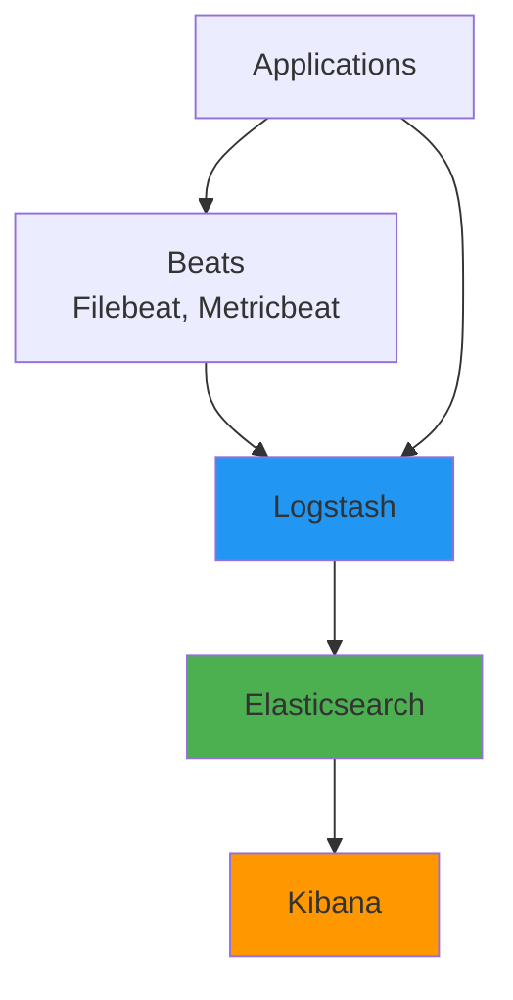
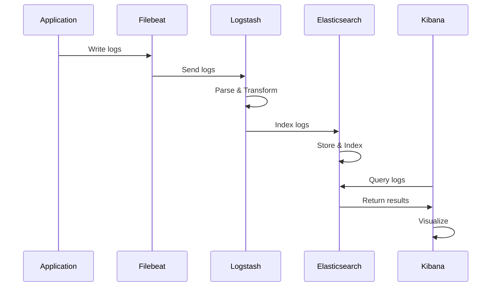

# ELK Stack - Logging & Analysis

## Overview

The ELK Stack (Elasticsearch, Logstash, Kibana) is a powerful open-source log management and analysis platform. Elasticsearch provides search and analytics capabilities, Logstash processes and transforms logs, and Kibana offers visualization and exploration. This guide covers ELK Stack architecture, log ingestion, processing, searching, and visualization patterns.

## Deep Explanation

### What is ELK Stack?

ELK Stack is a collection of three open-source tools:
- **Elasticsearch**: Distributed search and analytics engine
- **Logstash**: Log processing pipeline
- **Kibana**: Visualization and exploration

#### ELK Architecture



**Data Flow**:
1. **Beats** collect logs from applications
2. **Logstash** processes and transforms logs
3. **Elasticsearch** indexes and stores logs
4. **Kibana** visualizes and searches logs

### Elasticsearch

#### What is Elasticsearch?

Elasticsearch is a distributed, RESTful search and analytics engine built on Apache Lucene.

#### Core Concepts

**Indices**: Collections of documents
**Documents**: JSON objects
**Fields**: Key-value pairs in documents
**Shards**: Horizontal partitions of indices
**Replicas**: Copies of shards

#### Installing Elasticsearch

```bash
# Docker
docker run -d \
  --name elasticsearch \
  -p 9200:9200 \
  -p 9300:9300 \
  -e "discovery.type=single-node" \
  -e "xpack.security.enabled=false" \
  docker.elastic.co/elasticsearch/elasticsearch:8.0.0

# Kubernetes
kubectl apply -f https://www.elastic.co/guide/en/cloud-on-k8s/current/k8s-deploy-elasticsearch.yaml
```

#### Elasticsearch API

**Create Index**:
```bash
curl -X PUT "localhost:9200/logs" -H 'Content-Type: application/json' -d'
{
  "settings": {
    "number_of_shards": 1,
    "number_of_replicas": 1
  },
  "mappings": {
    "properties": {
      "timestamp": { "type": "date" },
      "level": { "type": "keyword" },
      "message": { "type": "text" },
      "service": { "type": "keyword" }
    }
  }
}
'
```

**Index Document**:
```bash
curl -X POST "localhost:9200/logs/_doc" -H 'Content-Type: application/json' -d'
{
  "timestamp": "2024-01-15T10:30:00Z",
  "level": "INFO",
  "message": "Request processed successfully",
  "service": "api"
}
'
```

**Search**:
```bash
curl -X GET "localhost:9200/logs/_search?q=level:ERROR"
```

**Query DSL**:
```bash
curl -X GET "localhost:9200/logs/_search" -H 'Content-Type: application/json' -d'
{
  "query": {
    "bool": {
      "must": [
        { "match": { "level": "ERROR" } },
        { "range": { "timestamp": { "gte": "now-1h" } } }
      ]
    }
  }
}
'
```

### Logstash

#### What is Logstash?

Logstash is a server-side data processing pipeline that ingests data from multiple sources, transforms it, and sends it to Elasticsearch.

#### Logstash Pipeline

**Pipeline Structure**:
```
Input → Filter → Output
```

**Input**: Receive data
**Filter**: Process and transform
**Output**: Send to destination

#### Logstash Configuration

**Basic Configuration** (`logstash.conf`):
```ruby
input {
  file {
    path => "/var/log/app.log"
    start_position => "beginning"
    codec => "json"
  }
}

filter {
  grok {
    match => { "message" => "%{COMBINEDAPACHELOG}" }
  }
  
  date {
    match => [ "timestamp", "ISO8601" ]
  }
  
  mutate {
    convert => { "response" => "integer" }
    remove_field => [ "host" ]
  }
}

output {
  elasticsearch {
    hosts => ["http://elasticsearch:9200"]
    index => "logs-%{+YYYY.MM.dd}"
  }
  
  stdout {
    codec => rubydebug
  }
}
```

#### Input Plugins

**File Input**:
```ruby
input {
  file {
    path => "/var/log/*.log"
    type => "syslog"
    start_position => "beginning"
  }
}
```

**Beats Input**:
```ruby
input {
  beats {
    port => 5044
  }
}
```

**HTTP Input**:
```ruby
input {
  http {
    port => 8080
    codec => json
  }
}
```

**Kafka Input**:
```ruby
input {
  kafka {
    bootstrap_servers => "kafka:9092"
    topics => ["logs"]
  }
}
```

#### Filter Plugins

**Grok Pattern**:
```ruby
filter {
  grok {
    match => {
      "message" => "%{IP:client} %{WORD:method} %{URIPATHPARAM:request} %{NUMBER:bytes} %{NUMBER:duration}"
    }
  }
}
```

**JSON Filter**:
```ruby
filter {
  json {
    source => "message"
    target => "parsed"
  }
}
```

**Date Filter**:
```ruby
filter {
  date {
    match => [ "timestamp", "yyyy-MM-dd HH:mm:ss" ]
    target => "@timestamp"
  }
}
```

**Mutate Filter**:
```ruby
filter {
  mutate {
    rename => { "old_field" => "new_field" }
    convert => { "age" => "integer" }
    lowercase => [ "status" ]
    remove_field => [ "unwanted_field" ]
  }
}
```

**GeoIP Filter**:
```ruby
filter {
  geoip {
    source => "client_ip"
    target => "geoip"
  }
}
```

#### Output Plugins

**Elasticsearch Output**:
```ruby
output {
  elasticsearch {
    hosts => ["http://elasticsearch:9200"]
    index => "logs-%{+YYYY.MM.dd}"
    document_type => "_doc"
  }
}
```

**File Output**:
```ruby
output {
  file {
    path => "/var/log/processed.log"
    codec => json_lines
  }
}
```

**Kafka Output**:
```ruby
output {
  kafka {
    bootstrap_servers => "kafka:9092"
    topic_id => "processed-logs"
  }
}
```

### Beats

#### Filebeat

**Filebeat Configuration** (`filebeat.yml`):
```yaml
filebeat.inputs:
  - type: log
    enabled: true
    paths:
      - /var/log/app/*.log
    fields:
      service: api
      environment: production
    fields_under_root: false
    multiline.pattern: '^\d{4}-\d{2}-\d{2}'
    multiline.negate: true
    multiline.match: after

output.logstash:
  hosts: ["logstash:5044"]

processors:
  - add_host_metadata:
      when.not.contains.tags: forwarded
  - add_docker_metadata: ~
```

**Docker Logs**:
```yaml
filebeat.inputs:
  - type: container
    paths:
      - '/var/lib/docker/containers/*/*.log'
    processors:
      - add_docker_metadata:
          host: "unix:///var/run/docker.sock"
```

#### Metricbeat

**Metricbeat Configuration** (`metricbeat.yml`):
```yaml
metricbeat.modules:
  - module: system
    metricsets:
      - cpu
      - memory
      - disk
      - network
    enabled: true
    period: 10s

  - module: docker
    metricsets:
      - container
      - cpu
      - memory
      - network
    hosts: ["unix:///var/run/docker.sock"]
    period: 10s

output.elasticsearch:
  hosts: ["http://elasticsearch:9200"]
  index: "metrics-%{+yyyy.MM.dd}"
```

### Kibana

#### What is Kibana?

Kibana is a visualization and exploration tool for Elasticsearch data.

#### Kibana Features

- **Discover**: Search and explore data
- **Visualize**: Create visualizations
- **Dashboard**: Combine visualizations
- **Dev Tools**: Query Elasticsearch
- **Management**: Index management

#### Creating Visualizations

**Line Chart**:
```json
{
  "visualization": {
    "title": "Error Rate Over Time",
    "type": "line",
    "params": {
      "xAxis": {
        "field": "@timestamp"
      },
      "yAxis": {
        "aggregations": [
          {
            "type": "count",
            "schema": "metric"
          }
        ]
      }
    },
    "aggs": [
      {
        "id": "1",
        "type": "date_histogram",
        "params": {
          "field": "@timestamp",
          "interval": "1h"
        }
      },
      {
        "id": "2",
        "type": "filters",
        "params": {
          "filters": [
            {
              "query": {
                "match": {
                  "level": "ERROR"
                }
              }
            }
          ]
        }
      }
    ]
  }
}
```

**Pie Chart**:
```json
{
  "visualization": {
    "title": "Logs by Level",
    "type": "pie",
    "aggs": [
      {
        "id": "1",
        "type": "count"
      },
      {
        "id": "2",
        "type": "terms",
        "params": {
          "field": "level",
          "size": 5
        }
      }
    ]
  }
}
```

#### Creating Dashboards

**Dashboard JSON**:
```json
{
  "dashboard": {
    "title": "Application Logs Dashboard",
    "panels": [
      {
        "id": "1",
        "type": "visualization",
        "panelIndex": "1",
        "gridData": {
          "x": 0,
          "y": 0,
          "w": 24,
          "h": 15
        }
      }
    ],
    "time": {
      "from": "now-1h",
      "to": "now"
    },
    "refreshInterval": {
      "pause": false,
      "value": 10000
    }
  }
}
```

### Complete ELK Stack Setup

#### Docker Compose

```yaml
version: '3.8'

services:
  elasticsearch:
    image: docker.elastic.co/elasticsearch/elasticsearch:8.0.0
    environment:
      - discovery.type=single-node
      - xpack.security.enabled=false
      - "ES_JAVA_OPTS=-Xms512m -Xmx512m"
    ports:
      - "9200:9200"
      - "9300:9300"
    volumes:
      - es-data:/usr/share/elasticsearch/data

  logstash:
    image: docker.elastic.co/logstash/logstash:8.0.0
    volumes:
      - ./logstash/config:/usr/share/logstash/config
      - ./logstash/pipeline:/usr/share/logstash/pipeline
    ports:
      - "5044:5044"
      - "9600:9600"
    depends_on:
      - elasticsearch

  kibana:
    image: docker.elastic.co/kibana/kibana:8.0.0
    environment:
      - ELASTICSEARCH_HOSTS=http://elasticsearch:9200
    ports:
      - "5601:5601"
    depends_on:
      - elasticsearch

  filebeat:
    image: docker.elastic.co/beats/filebeat:8.0.0
    user: root
    volumes:
      - ./filebeat/filebeat.yml:/usr/share/filebeat/filebeat.yml:ro
      - /var/log:/var/log:ro
      - /var/lib/docker/containers:/var/lib/docker/containers:ro
    depends_on:
      - logstash

volumes:
  es-data:
```

#### Kubernetes Deployment

```yaml
# Elasticsearch StatefulSet
apiVersion: apps/v1
kind: StatefulSet
metadata:
  name: elasticsearch
spec:
  serviceName: elasticsearch
  replicas: 3
  template:
    spec:
      containers:
      - name: elasticsearch
        image: docker.elastic.co/elasticsearch/elasticsearch:8.0.0
        env:
        - name: discovery.seed_hosts
          value: "elasticsearch-0.elasticsearch,elasticsearch-1.elasticsearch"
        - name: cluster.initial_master_nodes
          value: "elasticsearch-0,elasticsearch-1,elasticsearch-2"
        ports:
        - containerPort: 9200
        - containerPort: 9300
        volumeMounts:
        - name: data
          mountPath: /usr/share/elasticsearch/data
  volumeClaimTemplates:
  - metadata:
      name: data
    spec:
      accessModes: [ "ReadWriteOnce" ]
      resources:
        requests:
          storage: 10Gi

---
# Logstash Deployment
apiVersion: apps/v1
kind: Deployment
metadata:
  name: logstash
spec:
  replicas: 2
  template:
    spec:
      containers:
      - name: logstash
        image: docker.elastic.co/logstash/logstash:8.0.0
        ports:
        - containerPort: 5044
        volumeMounts:
        - name: config
          mountPath: /usr/share/logstash/config
        - name: pipeline
          mountPath: /usr/share/logstash/pipeline
      volumes:
      - name: config
        configMap:
          name: logstash-config
      - name: pipeline
        configMap:
          name: logstash-pipeline

---
# Kibana Deployment
apiVersion: apps/v1
kind: Deployment
metadata:
  name: kibana
spec:
  replicas: 1
  template:
    spec:
      containers:
      - name: kibana
        image: docker.elastic.co/kibana/kibana:8.0.0
        env:
        - name: ELASTICSEARCH_HOSTS
          value: "http://elasticsearch:9200"
        ports:
        - containerPort: 5601
```

### Log Processing Patterns

#### Apache Log Parsing

```ruby
# Logstash configuration
filter {
  grok {
    match => {
      "message" => "%{COMBINEDAPACHELOG}"
    }
  }
  
  date {
    match => [ "timestamp", "dd/MMM/yyyy:HH:mm:ss Z" ]
  }
  
  mutate {
    convert => {
      "response" => "integer"
      "bytes" => "integer"
    }
  }
  
  geoip {
    source => "clientip"
  }
}
```

#### JSON Log Parsing

```ruby
filter {
  json {
    source => "message"
    target => "parsed"
  }
  
  if [parsed][level] {
    mutate {
      add_field => { "log_level" => "%{[parsed][level]}" }
    }
  }
}
```

#### Multi-Line Logs

```ruby
filter {
  multiline {
    pattern => "^\d{4}-\d{2}-\d{2}"
    negate => true
    what => "previous"
  }
}
```

### Search and Query Patterns

#### Basic Search

```json
{
  "query": {
    "match": {
      "message": "error"
    }
  }
}
```

#### Boolean Query

```json
{
  "query": {
    "bool": {
      "must": [
        { "match": { "level": "ERROR" } },
        { "range": { "@timestamp": { "gte": "now-1h" } } }
      ],
      "must_not": [
        { "match": { "service": "test" } }
      ],
      "should": [
        { "match": { "message": "timeout" } }
      ]
    }
  }
}
```

#### Aggregations

**Terms Aggregation**:
```json
{
  "aggs": {
    "levels": {
      "terms": {
        "field": "level",
        "size": 10
      }
    }
  }
}
```

**Date Histogram**:
```json
{
  "aggs": {
    "logs_over_time": {
      "date_histogram": {
        "field": "@timestamp",
        "interval": "1h"
      }
    }
  }
}
```

**Range Aggregation**:
```json
{
  "aggs": {
    "response_time_ranges": {
      "range": {
        "field": "response_time",
        "ranges": [
          { "to": 100 },
          { "from": 100, "to": 500 },
          { "from": 500 }
        ]
      }
    }
  }
}
```

### Index Management

#### Index Lifecycle Management

```json
{
  "policy": {
    "phases": {
      "hot": {
        "actions": {
          "rollover": {
            "max_size": "50GB",
            "max_age": "7d"
          }
        }
      },
      "warm": {
        "min_age": "7d",
        "actions": {
          "shrink": {
            "number_of_shards": 1
          },
          "forcemerge": {
            "max_num_segments": 1
          }
        }
      },
      "cold": {
        "min_age": "30d",
        "actions": {
          "allocate": {
            "number_of_replicas": 0
          }
        }
      },
      "delete": {
        "min_age": "90d",
        "actions": {
          "delete": {}
        }
      }
    }
  }
}
```

#### Index Templates

```json
{
  "index_patterns": ["logs-*"],
  "template": {
    "settings": {
      "number_of_shards": 1,
      "number_of_replicas": 1
    },
    "mappings": {
      "properties": {
        "@timestamp": { "type": "date" },
        "level": { "type": "keyword" },
        "message": { "type": "text" }
      }
    }
  }
}
```

## Diagrams

### ELK Stack Data Flow



### Log Processing Pipeline


## Real Code Examples

### Complete Log Processing Pipeline

**Logstash Configuration**:
```ruby
# logstash/pipeline/main.conf
input {
  beats {
    port => 5044
  }
  
  http {
    port => 8080
    codec => json
  }
}

filter {
  # Parse JSON logs
  if [fields][log_type] == "json" {
    json {
      source => "message"
    }
  }
  
  # Parse Apache logs
  if [fields][log_type] == "apache" {
    grok {
      match => {
        "message" => "%{COMBINEDAPACHELOG}"
      }
    }
    
    date {
      match => [ "timestamp", "dd/MMM/yyyy:HH:mm:ss Z" ]
    }
  }
  
  # Add geoip information
  if [clientip] {
    geoip {
      source => "clientip"
      target => "geoip"
    }
  }
  
  # Parse user agent
  if [agent] {
    useragent {
      source => "agent"
      target => "user_agent"
    }
  }
  
  # Add timestamp if missing
  if ![timestamp] {
    date {
      match => [ "log_date", "yyyy-MM-dd HH:mm:ss" ]
      target => "@timestamp"
    }
  }
  
  # Remove unwanted fields
  mutate {
    remove_field => [ "host", "agent" ]
  }
}

output {
  # Send to Elasticsearch
  elasticsearch {
    hosts => ["http://elasticsearch:9200"]
    index => "logs-%{+YYYY.MM.dd}"
    template_name => "logs"
    template => "/etc/logstash/templates/logs.json"
    template_overwrite => true
  }
  
  # Send errors to separate index
  if [level] == "ERROR" {
    elasticsearch {
      hosts => ["http://elasticsearch:9200"]
      index => "errors-%{+YYYY.MM.dd}"
    }
  }
  
  # Debug output
  stdout {
    codec => rubydebug
  }
}
```

**Filebeat Configuration**:
```yaml
# filebeat.yml
filebeat.inputs:
  - type: log
    enabled: true
    paths:
      - /var/log/app/*.log
    fields:
      log_type: application
      environment: production
    multiline.pattern: '^\d{4}-\d{2}-\d{2}'
    multiline.negate: true
    multiline.match: after

  - type: log
    enabled: true
    paths:
      - /var/log/apache/*.log
    fields:
      log_type: apache
      environment: production

processors:
  - add_host_metadata:
      when.not.contains.tags: forwarded
  - add_docker_metadata: ~
  - drop_fields:
      fields: ["agent", "ecs", "host.architecture"]

output.logstash:
  hosts: ["logstash:5044"]

logging.level: info
logging.to_files: true
logging.files:
  path: /var/log/filebeat
  name: filebeat
  keepfiles: 7
  permissions: 0644
```

### Kibana Dashboard

**Dashboard Configuration**:
```json
{
  "dashboard": {
    "title": "Application Logs Dashboard",
    "description": "Real-time application monitoring",
    "panels": [
      {
        "id": "1",
        "type": "visualization",
        "title": "Logs Over Time",
        "gridData": { "x": 0, "y": 0, "w": 24, "h": 10 }
      },
      {
        "id": "2",
        "type": "visualization",
        "title": "Logs by Level",
        "gridData": { "x": 0, "y": 10, "w": 12, "h": 10 }
      },
      {
        "id": "3",
        "type": "visualization",
        "title": "Top Errors",
        "gridData": { "x": 12, "y": 10, "w": 12, "h": 10 }
      }
    ],
    "time": {
      "from": "now-1h",
      "to": "now"
    },
    "refreshInterval": {
      "pause": false,
      "value": 10000
    }
  }
}
```

## Hard Use-Case: Centralized Logging for Microservices

### Problem

Collect and analyze logs from 50+ microservices running in Kubernetes.

### Solution: ELK Stack with Filebeat DaemonSet

**Filebeat DaemonSet**:
```yaml
apiVersion: apps/v1
kind: DaemonSet
metadata:
  name: filebeat
spec:
  selector:
    matchLabels:
      app: filebeat
  template:
    metadata:
      labels:
        app: filebeat
    spec:
      containers:
      - name: filebeat
        image: docker.elastic.co/beats/filebeat:8.0.0
        volumeMounts:
        - name: varlog
          mountPath: /var/log
          readOnly: true
        - name: varlibdockercontainers
          mountPath: /var/lib/docker/containers
          readOnly: true
        - name: config
          mountPath: /usr/share/filebeat/filebeat.yml
          subPath: filebeat.yml
      volumes:
      - name: varlog
        hostPath:
          path: /var/log
      - name: varlibdockercontainers
        hostPath:
          path: /var/lib/docker/containers
      - name: config
        configMap:
          name: filebeat-config
```

## Edge Cases and Pitfalls

### 1. High Log Volume

**Problem**: Too many logs, storage issues

**Solution**: Index lifecycle management

```json
{
  "policy": {
    "phases": {
      "hot": {
        "actions": {
          "rollover": {
            "max_size": "50GB"
          }
        }
      },
      "delete": {
        "min_age": "30d"
      }
    }
  }
}
```

### 2. Log Format Inconsistency

**Problem**: Different log formats

**Solution**: Use multiple grok patterns

```ruby
filter {
  grok {
    match => {
      "message" => [
        "%{COMBINEDAPACHELOG}",
        "%{TIMESTAMP_ISO8601:timestamp} %{LOGLEVEL:level} %{GREEDYDATA:message}"
      ]
    }
  }
}
```

### 3. Missing Logs

**Problem**: Logs not appearing

**Solution**: Check Filebeat and Logstash

```bash
# Check Filebeat status
filebeat test config
filebeat test output

# Check Logstash
logstash --config.test_and_exit -f /etc/logstash/pipeline
```

## References and Further Reading

- [Elasticsearch Documentation](https://www.elastic.co/guide/en/elasticsearch/reference/current/index.html) - ES docs
- [Logstash Documentation](https://www.elastic.co/guide/en/logstash/current/index.html) - Logstash guide
- [Kibana Documentation](https://www.elastic.co/guide/en/kibana/current/index.html) - Kibana guide
- [Beats Documentation](https://www.elastic.co/guide/en/beats/index.html) - Beats guide

## Quiz

### Question 1
What does ELK stand for?

**A)** Elasticsearch, Logstash, Kibana  
**B)** Elastic, Logging, Kubernetes  
**C)** Enterprise, Logging, Knowledge  
**D)** Elastic, Linux, Kernel

**Answer: A** - ELK stands for Elasticsearch (search engine), Logstash (log processor), and Kibana (visualization).

### Question 2
What is Logstash used for?

**A)** Storing logs  
**B)** Processing and transforming logs  
**C)** Visualizing logs  
**D)** Searching logs

**Answer: B** - Logstash is a log processing pipeline that ingests, transforms, and outputs logs.

### Question 3
What is Filebeat?

**A)** A log processor  
**B)** A lightweight log shipper  
**C)** A visualization tool  
**D)** A database

**Answer: B** - Filebeat is a lightweight log shipper that collects logs and sends them to Logstash or Elasticsearch.

### Question 4
What is an index in Elasticsearch?

**A)** A database  
**B)** A collection of documents  
**C)** A search query  
**D)** A visualization

**Answer: B** - An index in Elasticsearch is a collection of documents with similar characteristics, similar to a database in relational databases.

### Question 5
What is Grok in Logstash?

**A)** A filter plugin  
**B)** A pattern matching language  
**C)** An output plugin  
**D)** A visualization

**Answer: B** - Grok is a pattern matching language used in Logstash to parse unstructured log data into structured data.

## Related Topics

- [Monitoring & Observability](./04.%20Monitoring%20%26%20Observability.md) - Observability concepts
- [Prometheus & Grafana Deep Dive](./08.%20Prometheus%20%26%20Grafana%20Deep%20Dive.md) - Metrics monitoring
- [Kubernetes Fundamentals](./01.%20Kubernetes%20Fundamentals.md) - K8s logging

