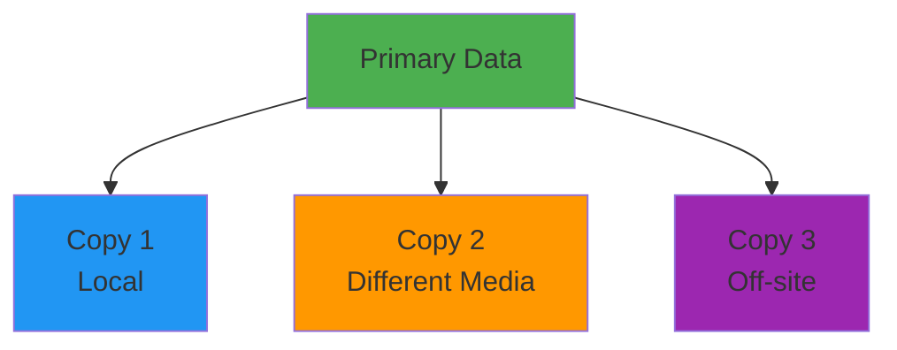
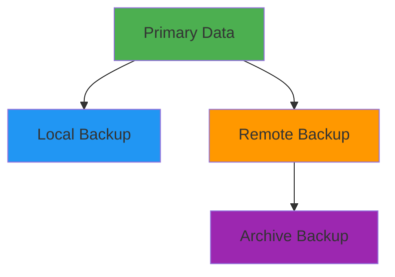

# Backup & Disaster Recovery

## Overview

Backup and Disaster Recovery (DR) are critical components of any production system, ensuring data protection and business continuity. This guide covers backup strategies, recovery procedures, RTO/RPO concepts, disaster recovery planning, and implementation patterns for cloud-native and traditional infrastructures.

## Deep Explanation

### What is Disaster Recovery?

Disaster Recovery is the process of restoring systems and data after a disaster or failure.

#### Key Concepts

**RTO (Recovery Time Objective)**: Maximum acceptable downtime
**RPO (Recovery Point Objective)**: Maximum acceptable data loss


**Example**:
- **RTO**: 4 hours (system must be restored within 4 hours)
- **RPO**: 1 hour (can lose up to 1 hour of data)

### Backup Types

#### Full Backup

Complete backup of all data.

**Pros**:
- Complete recovery
- Simple restore

**Cons**:
- Time-consuming
- Storage intensive

**Example**:
```bash
# Full database backup
pg_dump -F c -b -v -f backup_full.dump mydb

# Full filesystem backup
tar -czf backup_full.tar.gz /data
```

#### Incremental Backup

Backs up only changes since last backup.

**Pros**:
- Faster
- Less storage

**Cons**:
- Requires full backup + incrementals for restore
- More complex restore

**Example**:
```bash
# Incremental backup using rsync
rsync -av --link-dest=/backups/last_full /data /backups/inc_$(date +%Y%m%d)
```

#### Differential Backup

Backs up changes since last full backup.

**Pros**:
- Faster than full
- Simpler restore than incremental

**Cons**:
- More storage than incremental
- Slower than incremental

#### Snapshot Backup

Point-in-time copy of data.

**Pros**:
- Fast
- Space-efficient
- Easy restore

**Cons**:
- Requires snapshot support
- May impact performance

**Example**:
```bash
# LVM snapshot
lvcreate -L 10G -s -n data_snapshot /dev/vg/data
```

### Backup Strategies

#### 3-2-1 Rule

- **3** copies of data
- **2** different media types
- **1** off-site copy



#### Backup Schedule

**Daily Backups**:
- Full backup: Weekly
- Incremental: Daily
- Retention: 30 days

**Example Schedule**:
```
Monday:    Full backup
Tuesday:   Incremental
Wednesday: Incremental
Thursday:  Incremental
Friday:    Incremental
Saturday:  Incremental
Sunday:    Incremental
```

### Database Backups

#### PostgreSQL Backup

**Full Backup**:
```bash
# Dump database
pg_dump -F c -b -v -f backup.dump mydb

# Restore
pg_restore -d mydb backup.dump
```

**Continuous Archiving**:
```bash
# Enable WAL archiving
archive_mode = on
archive_command = 'cp %p /backups/wal/%f'

# Base backup
pg_basebackup -D /backups/base -Ft -z -P
```

**Point-in-Time Recovery**:
```bash
# Restore base backup
tar -xzf base.tar.gz -C /var/lib/postgresql/data

# Restore WAL files
cp /backups/wal/* /var/lib/postgresql/data/pg_wal/

# Configure recovery
echo "restore_command = 'cp /backups/wal/%f %p'" > recovery.conf
```

#### MySQL Backup

**mysqldump**:
```bash
# Full backup
mysqldump --all-databases --single-transaction --routines --triggers > backup.sql

# Restore
mysql < backup.sql
```

**MySQL Enterprise Backup**:
```bash
# Full backup
mysqlbackup --backup-dir=/backups backup

# Incremental backup
mysqlbackup --backup-dir=/backups --incremental --incremental-base=history:last_backup backup
```

**Binary Log Backup**:
```bash
# Enable binary logging
log-bin=mysql-bin

# Backup binary logs
mysqlbinlog mysql-bin.000001 > binlog.sql
```

#### MongoDB Backup

**mongodump**:
```bash
# Full backup
mongodump --out /backups/$(date +%Y%m%d)

# Restore
mongorestore /backups/20240115
```

**Oplog Backup**:
```bash
# Backup oplog for point-in-time recovery
mongodump --oplog --out /backups/oplog
```

### File System Backups

#### rsync

```bash
# Full backup
rsync -av --delete /source/ /backup/full/

# Incremental backup
rsync -av --link-dest=/backup/full/ /source/ /backup/inc_$(date +%Y%m%d)/
```

#### tar

```bash
# Full backup
tar -czf backup_$(date +%Y%m%d).tar.gz /data

# Incremental backup
tar --newer-mtime="1 day ago" -czf backup_inc.tar.gz /data
```

#### Duplicity

```bash
# Full backup
duplicity full /data file:///backup

# Incremental backup
duplicity incremental /data file:///backup

# Restore
duplicity restore file:///backup /restore
```

### Cloud Backups

#### AWS S3 Backup

```bash
# Upload to S3
aws s3 sync /data s3://my-backup-bucket/data/

# Enable versioning
aws s3api put-bucket-versioning \
  --bucket my-backup-bucket \
  --versioning-configuration Status=Enabled

# Enable lifecycle policies
aws s3api put-bucket-lifecycle-configuration \
  --bucket my-backup-bucket \
  --lifecycle-configuration file://lifecycle.json
```

**Lifecycle Policy**:
```json
{
  "Rules": [
    {
      "Id": "Transition to Glacier",
      "Status": "Enabled",
      "Transitions": [
        {
          "Days": 30,
          "StorageClass": "GLACIER"
        }
      ]
    },
    {
      "Id": "Delete old backups",
      "Status": "Enabled",
      "Expiration": {
        "Days": 365
      }
    }
  ]
}
```

#### Azure Blob Backup

```bash
# Upload to Azure Blob
az storage blob upload-batch \
  --destination mycontainer \
  --source /data \
  --account-name mystorageaccount

# Enable soft delete
az storage blob service-properties update \
  --account-name mystorageaccount \
  --enable-delete-retention true \
  --delete-retention-days 30
```

#### GCP Cloud Storage Backup

```bash
# Upload to GCS
gsutil -m rsync -r /data gs://my-backup-bucket/data/

# Set lifecycle policy
gsutil lifecycle set lifecycle.json gs://my-backup-bucket
```

**Lifecycle Policy**:
```json
{
  "lifecycle": {
    "rule": [
      {
        "action": {
          "type": "SetStorageClass",
          "storageClass": "COLDLINE"
        },
        "condition": {
          "age": 30
        }
      },
      {
        "action": {
          "type": "Delete"
        },
        "condition": {
          "age": 365
        }
      }
    ]
  }
}
```

### Container Backups

#### Docker Volume Backup

```bash
# Backup volume
docker run --rm \
  -v myvolume:/data \
  -v $(pwd):/backup \
  alpine tar czf /backup/volume_backup.tar.gz -C /data .

# Restore volume
docker run --rm \
  -v myvolume:/data \
  -v $(pwd):/backup \
  alpine tar xzf /backup/volume_backup.tar.gz -C /data
```

#### Kubernetes Volume Backup

```yaml
# Backup job
apiVersion: batch/v1
kind: Job
metadata:
  name: backup-job
spec:
  template:
    spec:
      containers:
      - name: backup
        image: alpine
        command:
        - sh
        - -c
        - |
          tar czf /backup/data.tar.gz -C /data .
          aws s3 cp /backup/data.tar.gz s3://backup-bucket/
        volumeMounts:
        - name: data
          mountPath: /data
        - name: backup
          mountPath: /backup
      volumes:
      - name: data
        persistentVolumeClaim:
          claimName: data-pvc
      - name: backup
        emptyDir: {}
      restartPolicy: Never
```

### Disaster Recovery Strategies

#### Backup and Restore

**Process**:
1. Regular backups
2. Store off-site
3. Test restore procedures
4. Document recovery steps

**RTO**: Hours to days
**RPO**: Hours to days

#### Pilot Light

**Process**:
1. Minimal infrastructure running
2. Data replicated
3. Scale up on disaster

**RTO**: Hours
**RPO**: Minutes to hours

#### Warm Standby

**Process**:
1. Scaled-down replica running
2. Data continuously replicated
3. Scale up on disaster

**RTO**: Minutes to hours
**RPO**: Minutes

#### Hot Standby / Multi-Site

**Process**:
1. Full replica running
2. Data continuously replicated
3. Automatic failover

**RTO**: Seconds to minutes
**RPO**: Seconds to minutes

### DR Implementation

#### AWS Multi-Region DR

```hcl
# Primary region
resource "aws_instance" "primary" {
  provider = aws.us_east_1
  ami      = "ami-xxx"
  # ...
}

# Secondary region
resource "aws_instance" "secondary" {
  provider = aws.us_west_2
  ami      = "ami-xxx"
  # ...
}

# Route53 failover
resource "aws_route53_record" "primary" {
  zone_id = aws_route53_zone.main.zone_id
  name    = "app.example.com"
  type    = "A"
  
  set_identifier = "primary"
  failover_routing_policy {
    type = "PRIMARY"
  }
  
  health_check_id = aws_route53_health_check.primary.id
}

resource "aws_route53_record" "secondary" {
  zone_id = aws_route53_zone.main.zone_id
  name    = "app.example.com"
  type    = "A"
  
  set_identifier = "secondary"
  failover_routing_policy {
    type = "SECONDARY"
  }
}
```

#### Database Replication

**PostgreSQL Streaming Replication**:
```sql
-- Primary
wal_level = replica
max_wal_senders = 3

-- Standby
primary_conninfo = 'host=primary port=5432 user=replicator'
```

**MySQL Replication**:
```sql
-- Primary
log-bin=mysql-bin
server-id=1

-- Replica
server-id=2
relay-log=mysql-relay-bin
read-only=1
```

### Backup Automation

#### Cron Job

```bash
#!/bin/bash
# backup.sh

BACKUP_DIR="/backups"
DATE=$(date +%Y%m%d)
RETENTION_DAYS=30

# Database backup
pg_dump -F c -f "$BACKUP_DIR/db_$DATE.dump" mydb

# File backup
tar -czf "$BACKUP_DIR/files_$DATE.tar.gz" /data

# Upload to S3
aws s3 cp "$BACKUP_DIR/db_$DATE.dump" s3://backup-bucket/
aws s3 cp "$BACKUP_DIR/files_$DATE.tar.gz" s3://backup-bucket/

# Cleanup old backups
find $BACKUP_DIR -type f -mtime +$RETENTION_DAYS -delete

# Cron entry
# 0 2 * * * /path/to/backup.sh
```

#### Kubernetes CronJob

```yaml
apiVersion: batch/v1
kind: CronJob
metadata:
  name: backup-job
spec:
  schedule: "0 2 * * *"  # Daily at 2 AM
  jobTemplate:
    spec:
      template:
        spec:
          containers:
          - name: backup
            image: postgres:14
            command:
            - /bin/sh
            - -c
            - |
              pg_dump -h $DB_HOST -U $DB_USER -d $DB_NAME -F c -f /backup/backup.dump
              aws s3 cp /backup/backup.dump s3://backup-bucket/$(date +%Y%m%d).dump
            env:
            - name: DB_HOST
              valueFrom:
                secretKeyRef:
                  name: db-secret
                  key: host
            - name: DB_USER
              valueFrom:
                secretKeyRef:
                  name: db-secret
                  key: user
            - name: DB_NAME
              value: mydb
            volumeMounts:
            - name: backup
              mountPath: /backup
          volumes:
          - name: backup
            emptyDir: {}
          restartPolicy: OnFailure
```

### Backup Testing

#### Restore Testing

```bash
#!/bin/bash
# test_restore.sh

# Restore to test environment
pg_restore -d test_db backup.dump

# Verify data
psql -d test_db -c "SELECT COUNT(*) FROM users;"

# Run integrity checks
psql -d test_db -c "VACUUM ANALYZE;"

# Compare with production
# (if safe to do so)
```

#### Automated Testing

```python
# backup_test.py
import subprocess
import psycopg2
import boto3

def test_backup_restore():
    # Download backup
    s3 = boto3.client('s3')
    s3.download_file('backup-bucket', 'backup.dump', '/tmp/backup.dump')
    
    # Restore to test database
    subprocess.run([
        'pg_restore',
        '-d', 'test_db',
        '/tmp/backup.dump'
    ])
    
    # Verify data
    conn = psycopg2.connect("dbname=test_db")
    cur = conn.cursor()
    cur.execute("SELECT COUNT(*) FROM users")
    count = cur.fetchone()[0]
    
    assert count > 0, "No users found in restored database"
    
    # Verify integrity
    cur.execute("SELECT COUNT(*) FROM users WHERE email IS NULL")
    null_count = cur.fetchone()[0]
    assert null_count == 0, "Found NULL emails"
    
    print("Backup restore test passed!")

if __name__ == '__main__':
    test_backup_restore()
```

## Diagrams

### Backup Strategy



### Disaster Recovery Process

```mermaid
sequenceDiagram
    participant Failure as Failure Detected
    participant Assess as Assess Damage
    participant Restore as Restore Backup
    participant Verify as Verify System
    participant Switch as Switch Traffic
    participant Monitor as Monitor
    
    Failure --> Assess
    Assess --> Restore
    Restore --> Verify
    Verify --> Switch
    Switch --> Monitor
```

## Real Code Examples

### Complete Backup Solution

```python
# backup_system.py
import boto3
import subprocess
import datetime
import os
from pathlib import Path

class BackupSystem:
    def __init__(self, s3_bucket, retention_days=30):
        self.s3_bucket = s3_bucket
        self.retention_days = retention_days
        self.s3_client = boto3.client('s3')
        self.backup_dir = Path('/backups')
        self.backup_dir.mkdir(exist_ok=True)
    
    def backup_database(self, db_name, db_host, db_user):
        """Backup PostgreSQL database"""
        timestamp = datetime.datetime.now().strftime('%Y%m%d_%H%M%S')
        backup_file = self.backup_dir / f"db_{db_name}_{timestamp}.dump"
        
        # Create backup
        subprocess.run([
            'pg_dump',
            '-h', db_host,
            '-U', db_user,
            '-d', db_name,
            '-F', 'c',
            '-f', str(backup_file)
        ], check=True)
        
        # Upload to S3
        s3_key = f"database/{db_name}/{backup_file.name}"
        self.s3_client.upload_file(
            str(backup_file),
            self.s3_bucket,
            s3_key
        )
        
        # Cleanup local file
        backup_file.unlink()
        
        return s3_key
    
    def backup_files(self, source_path):
        """Backup filesystem"""
        timestamp = datetime.datetime.now().strftime('%Y%m%d_%H%M%S')
        backup_file = self.backup_dir / f"files_{timestamp}.tar.gz"
        
        # Create archive
        subprocess.run([
            'tar',
            '-czf',
            str(backup_file),
            '-C',
            str(Path(source_path).parent),
            Path(source_path).name
        ], check=True)
        
        # Upload to S3
        s3_key = f"filesystem/{backup_file.name}"
        self.s3_client.upload_file(
            str(backup_file),
            self.s3_bucket,
            s3_key
        )
        
        # Cleanup local file
        backup_file.unlink()
        
        return s3_key
    
    def cleanup_old_backups(self):
        """Delete backups older than retention period"""
        cutoff_date = datetime.datetime.now() - datetime.timedelta(
            days=self.retention_days
        )
        
        # List S3 objects
        paginator = self.s3_client.get_paginator('list_objects_v2')
        pages = paginator.paginate(Bucket=self.s3_bucket)
        
        for page in pages:
            for obj in page.get('Contents', []):
                if obj['LastModified'] < cutoff_date:
                    self.s3_client.delete_object(
                        Bucket=self.s3_bucket,
                        Key=obj['Key']
                    )
                    print(f"Deleted old backup: {obj['Key']}")
    
    def restore_database(self, db_name, s3_key, db_host, db_user):
        """Restore database from backup"""
        backup_file = self.backup_dir / Path(s3_key).name
        
        # Download from S3
        self.s3_client.download_file(
            self.s3_bucket,
            s3_key,
            str(backup_file)
        )
        
        # Restore
        subprocess.run([
            'pg_restore',
            '-h', db_host,
            '-U', db_user,
            '-d', db_name,
            '-c',  # Clean before restore
            str(backup_file)
        ], check=True)
        
        # Cleanup
        backup_file.unlink()
    
    def verify_backup(self, s3_key):
        """Verify backup integrity"""
        backup_file = self.backup_dir / Path(s3_key).name
        
        # Download from S3
        self.s3_client.download_file(
            self.s3_bucket,
            s3_key,
            str(backup_file)
        )
        
        # Verify file
        if backup_file.suffix == '.dump':
            # PostgreSQL dump verification
            result = subprocess.run(
                ['pg_restore', '--list', str(backup_file)],
                capture_output=True,
                text=True
            )
            return result.returncode == 0
        elif backup_file.suffix == '.tar.gz':
            # Tar verification
            result = subprocess.run(
                ['tar', '-tzf', str(backup_file)],
                capture_output=True
            )
            return result.returncode == 0
        
        return False

# Usage
if __name__ == '__main__':
    backup = BackupSystem('my-backup-bucket', retention_days=30)
    
    # Daily backup
    backup.backup_database('mydb', 'localhost', 'postgres')
    backup.backup_files('/var/www')
    
    # Cleanup
    backup.cleanup_old_backups()
```

## Hard Use-Case: Multi-Region Disaster Recovery

### Problem

Ensure business continuity with RTO < 1 hour, RPO < 15 minutes across regions.

### Solution: Hot Standby with Continuous Replication

```yaml
# Primary region deployment
apiVersion: apps/v1
kind: Deployment
metadata:
  name: app-primary
  namespace: production
spec:
  replicas: 5
  template:
    spec:
      containers:
      - name: app
        image: myapp:latest
        env:
        - name: REGION
          value: "us-east-1"
        - name: DB_HOST
          value: "db-primary.us-east-1"

---
# Standby region deployment
apiVersion: apps/v1
kind: Deployment
metadata:
  name: app-standby
  namespace: production
spec:
  replicas: 5
  template:
    spec:
      containers:
      - name: app
        image: myapp:latest
        env:
        - name: REGION
          value: "us-west-2"
        - name: DB_HOST
          value: "db-standby.us-west-2"
        # Standby mode - ready but not serving traffic
```

**Failover Script**:
```bash
#!/bin/bash
# failover.sh

PRIMARY_REGION="us-east-1"
STANDBY_REGION="us-west-2"

# Check primary health
if ! curl -f http://app-primary.example.com/health; then
    echo "Primary region unhealthy, initiating failover..."
    
    # Update DNS
    aws route53 change-resource-record-sets \
      --hosted-zone-id Z123456 \
      --change-batch file://failover.json
    
    # Scale up standby
    kubectl scale deployment app-standby --replicas=10 -n production
    
    # Notify team
    send_notification "Failover to $STANDBY_REGION initiated"
fi
```

## Edge Cases and Pitfalls

### 1. Backup Corruption

**Problem**: Backup file corrupted

**Solution**: Verify backups regularly

```python
def verify_backup(backup_file):
    # Verify checksum
    checksum = calculate_checksum(backup_file)
    stored_checksum = get_stored_checksum(backup_file)
    assert checksum == stored_checksum
```

### 2. Incomplete Backups

**Problem**: Backup interrupted

**Solution**: Use transactions and verify

```bash
# PostgreSQL with transaction
pg_dump --single-transaction mydb > backup.sql
```

### 3. Storage Costs

**Problem**: Backup storage costs too high

**Solution**: Use lifecycle policies and compression

```json
{
  "lifecycle": {
    "rule": [
      {
        "action": {
          "type": "SetStorageClass",
          "storageClass": "GLACIER"
        },
        "condition": {
          "age": 30
        }
      }
    ]
  }
}
```

## References and Further Reading

- [AWS Disaster Recovery](https://aws.amazon.com/disaster-recovery/) - AWS DR guide
- [Backup Best Practices](https://www.backupassist.com/blog/backup-best-practices/) - Backup practices
- [Disaster Recovery Planning](https://www.ready.gov/business/emergency-plans/continuity-planning) - DR planning

## Quiz

### Question 1
What is RTO?

**A)** Recovery Time Objective - maximum acceptable downtime  
**B)** Recovery Point Objective - maximum data loss  
**C)** Real Time Operations  
**D)** Remote Time Operations

**Answer: A** - RTO (Recovery Time Objective) is the maximum acceptable downtime before systems must be restored.

### Question 2
What is the 3-2-1 backup rule?

**A)** 3 backups, 2 locations, 1 format  
**B)** 3 copies, 2 media types, 1 off-site  
**C)** 3 days, 2 weeks, 1 month  
**D)** 3 servers, 2 databases, 1 backup

**Answer: B** - The 3-2-1 rule means 3 copies of data, on 2 different media types, with 1 copy off-site.

### Question 3
What is the difference between incremental and differential backup?

**A)** They're the same  
**B)** Incremental backs up since last backup, differential since last full  
**C)** Differential is faster  
**D)** Incremental requires full backup

**Answer: B** - Incremental backs up changes since the last backup (full or incremental), while differential backs up changes since the last full backup.

### Question 4
What is hot standby?

**A)** Cold backup  
**B)** Full replica running continuously  
**C)** Backup stored offline  
**D)** Manual backup

**Answer: B** - Hot standby is a full replica running continuously, ready for immediate failover.

### Question 5
Why is backup testing important?

**A)** It's not important  
**B)** To ensure backups can be restored  
**C)** To reduce costs  
**D)** To speed up backups

**Answer: B** - Regular backup testing ensures that backups are valid and can be successfully restored when needed.

## Related Topics

- [Site Reliability Engineering (SRE)](../04_overachiever/01.%20Site%20Reliability%20Engineering%20(SRE).md) - Reliability practices
- [Multi-Cloud Strategies](../04_overachiever/02.%20Multi-Cloud%20Strategies.md) - Multi-region DR
- [Kubernetes Fundamentals](./01.%20Kubernetes%20Fundamentals.md) - K8s backups

