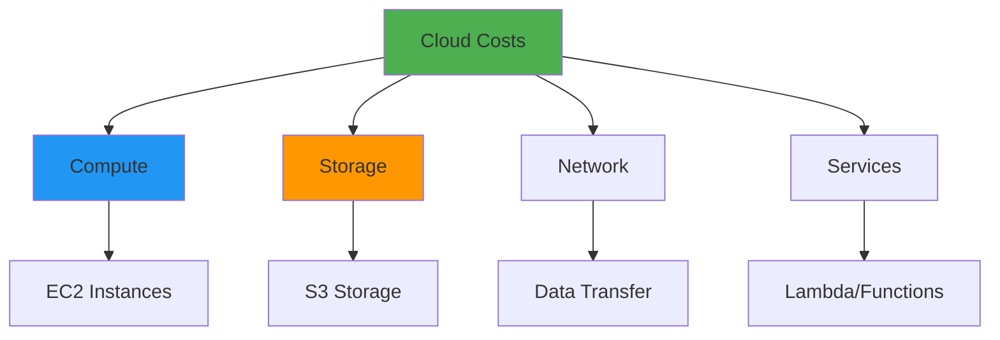
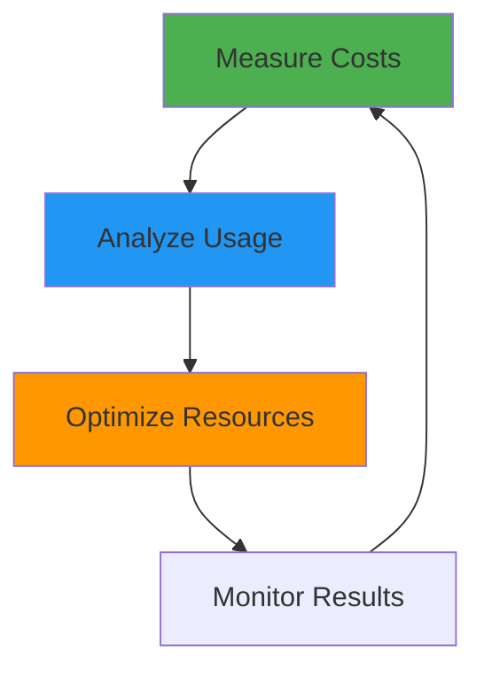
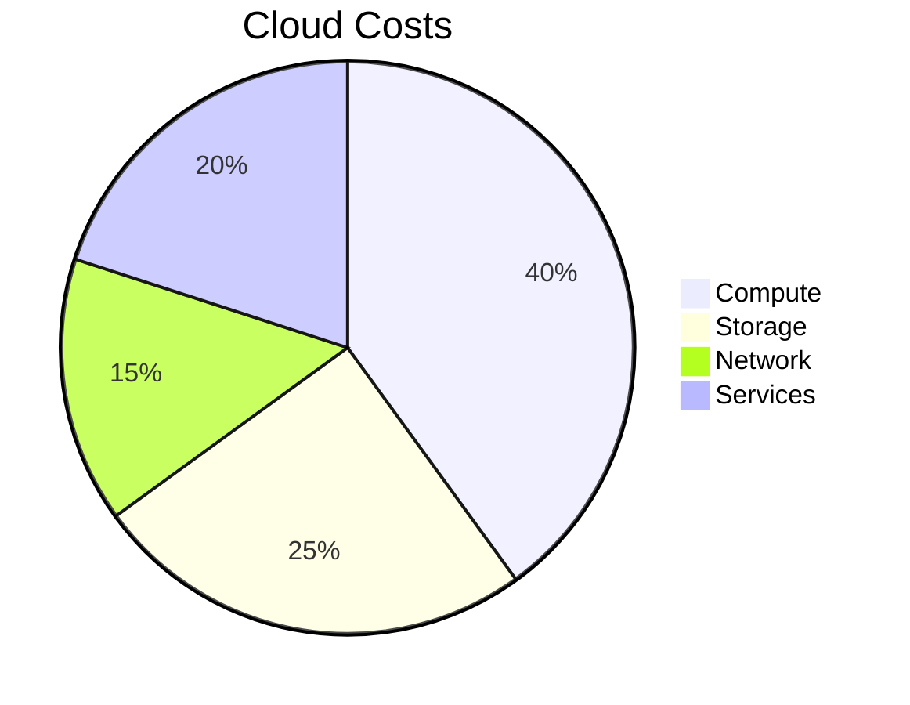

# Cost Optimization

## Overview

Cost optimization is a critical aspect of cloud operations, ensuring efficient resource utilization while maintaining performance and reliability. This guide covers cost optimization strategies including right-sizing, reserved instances, spot instances, resource tagging, cost monitoring, and FinOps practices for managing cloud spending effectively.

## Deep Explanation

### What is Cost Optimization?

Cost optimization involves reducing cloud spending while maintaining or improving performance, reliability, and functionality.

#### Cost Optimization Principles

1. **Right-Sizing**: Match resources to actual needs
2. **Reserved Capacity**: Commit for discounts
3. **Spot/Preemptible**: Use spare capacity
4. **Automation**: Automate cost optimization
5. **Monitoring**: Track and analyze costs

#### Cloud Cost Components



### Right-Sizing

#### What is Right-Sizing?

Right-sizing means selecting the optimal instance size for workloads.

#### Right-Sizing Process

1. **Measure**: Current resource usage
2. **Analyze**: Identify over-provisioned resources
3. **Recommend**: Suggest optimal sizes
4. **Implement**: Apply changes
5. **Monitor**: Track results

#### AWS Right-Sizing

**CloudWatch Metrics**:
```bash
# Check CPU utilization
aws cloudwatch get-metric-statistics \
  --namespace AWS/EC2 \
  --metric-name CPUUtilization \
  --dimensions Name=InstanceId,Value=i-1234567890abcdef0 \
  --start-time 2024-01-01T00:00:00Z \
  --end-time 2024-01-31T23:59:59Z \
  --period 3600 \
  --statistics Average,Maximum
```

**Cost Explorer Recommendations**:
```bash
# Get right-sizing recommendations
aws ce get-rightsizing-recommendation \
  --service EC2-Instance
```

#### Kubernetes Right-Sizing

**Vertical Pod Autoscaler**:
```yaml
apiVersion: autoscaling.k8s.io/v1
kind: VerticalPodAutoscaler
metadata:
  name: myapp-vpa
spec:
  targetRef:
    apiVersion: apps/v1
    kind: Deployment
    name: myapp
  updatePolicy:
    updateMode: "Auto"
  resourcePolicy:
    containerPolicies:
    - containerName: myapp
      minAllowed:
        cpu: 100m
        memory: 128Mi
      maxAllowed:
        cpu: 2
        memory: 4Gi
```

### Reserved Instances

#### AWS Reserved Instances

**Types**:
- **Standard**: Up to 72% discount
- **Convertible**: Up to 54% discount, can change attributes
- **Scheduled**: For predictable workloads

**Purchase**:
```bash
# Purchase reserved instance
aws ec2 purchase-reserved-instances-offering \
  --reserved-instances-offering-id xxxxx \
  --instance-count 1
```

**Savings Plan**:
```bash
# Purchase compute savings plan
aws savings-plans purchase-savings-plan \
  --savings-plan-type COMPUTE \
  --payment-option AllUpfront \
  --term 1year \
  --upfront-payment-amount 1000
```

#### Azure Reserved Instances

**Purchase**:
```bash
# Purchase reserved VM instance
az vm reservation purchase \
  --reservation-order-id xxxxx \
  --sku Standard_B1s \
  --quantity 1 \
  --term P1Y \
  --billing-scope Subscription
```

#### GCP Committed Use Discounts

**Commitment**:
```bash
# Create commitment
gcloud compute commitments create my-commitment \
  --plan 12-month \
  --resources vcpu=4,memory=16 \
  --region us-central1
```

### Spot Instances

#### AWS Spot Instances

**Request Spot Instance**:
```bash
# Request spot instance
aws ec2 request-spot-instances \
  --instance-count 1 \
  --launch-specification file://specification.json \
  --spot-price "0.05"
```

**Spot Fleet**:
```json
{
  "SpotFleetRequestConfig": {
    "TargetCapacity": 10,
    "IamFleetRole": "arn:aws:iam::account:role/spot-fleet-role",
    "LaunchSpecifications": [
      {
        "ImageId": "ami-xxx",
        "InstanceType": "t3.medium",
        "SpotPrice": "0.05"
      }
    ],
    "AllocationStrategy": "lowestPrice"
  }
}
```

#### GCP Preemptible Instances

```yaml
# Kubernetes preemptible node pool
apiVersion: v1
kind: NodePool
spec:
  config:
    machineType: e2-medium
    preemptible: true
  autoscaling:
    minNodeCount: 0
    maxNodeCount: 10
```

### Storage Optimization

#### S3 Storage Classes

**Lifecycle Policies**:
```json
{
  "Rules": [
    {
      "Id": "Transition to Standard-IA",
      "Status": "Enabled",
      "Transitions": [
        {
          "Days": 30,
          "StorageClass": "STANDARD_IA"
        }
      ]
    },
    {
      "Id": "Transition to Glacier",
      "Status": "Enabled",
      "Transitions": [
        {
          "Days": 90,
          "StorageClass": "GLACIER"
        }
      ]
    },
    {
      "Id": "Delete old versions",
      "Status": "Enabled",
      "NoncurrentVersionTransitions": [
        {
          "NoncurrentDays": 30,
          "StorageClass": "GLACIER"
        }
      ],
      "NoncurrentVersionExpiration": {
        "NoncurrentDays": 365
      }
    }
  ]
}
```

#### EBS Optimization

**Volume Types**:
- **gp3**: General purpose, cost-effective
- **io2**: High IOPS, expensive
- **st1**: Throughput optimized, cheaper

**Snapshot Lifecycle**:
```bash
# Create snapshot lifecycle policy
aws dlm create-lifecycle-policy \
  --execution-role-arn arn:aws:iam::account:role/dlm-role \
  --description "EBS snapshot policy" \
  --state ENABLED \
  --policy-details file://policy.json
```

### Cost Monitoring

#### AWS Cost Explorer

**Query Costs**:
```bash
# Get cost and usage
aws ce get-cost-and-usage \
  --time-period Start=2024-01-01,End=2024-01-31 \
  --granularity MONTHLY \
  --metrics BlendedCost \
  --group-by Type=DIMENSION,Key=SERVICE
```

**Cost Forecast**:
```bash
# Get cost forecast
aws ce get-cost-forecast \
  --time-period Start=2024-02-01,End=2024-02-28 \
  --metric BLENDED_COST \
  --granularity MONTHLY
```

#### Budgets and Alerts

**Create Budget**:
```bash
# Create cost budget
aws budgets create-budget \
  --account-id 123456789012 \
  --budget file://budget.json \
  --notifications-with-subscribers file://notifications.json
```

**Budget JSON**:
```json
{
  "BudgetName": "monthly-budget",
  "BudgetLimit": {
    "Amount": "1000",
    "Unit": "USD"
  },
  "TimeUnit": "MONTHLY",
  "BudgetType": "COST",
  "CostFilters": {
    "Service": ["Amazon Elastic Compute Cloud - Compute"]
  }
}
```

### Resource Tagging

#### Tagging Strategy

**Cost Allocation Tags**:
```bash
# Enable cost allocation tags
aws ce create-cost-category-definition \
  --name "Environment" \
  --rules '[{
    "Value": "Production",
    "Rule": {
      "Tags": {
        "Key": "Environment",
        "Values": ["Production"]
      }
    }
  }]'
```

**Tag Resources**:
```bash
# Tag EC2 instance
aws ec2 create-tags \
  --resources i-1234567890abcdef0 \
  --tags Key=Environment,Value=Production \
         Key=Project,Value=MyApp \
         Key=CostCenter,Value=Engineering
```

#### Kubernetes Labels

```yaml
apiVersion: v1
kind: Pod
metadata:
  labels:
    environment: production
    project: myapp
    cost-center: engineering
spec:
  containers:
  - name: app
    image: myapp:latest
```

### Automation

#### Auto-Scaling

**Horizontal Pod Autoscaler**:
```yaml
apiVersion: autoscaling/v2
kind: HorizontalPodAutoscaler
metadata:
  name: myapp-hpa
spec:
  scaleTargetRef:
    apiVersion: apps/v1
    kind: Deployment
    name: myapp
  minReplicas: 2
  maxReplicas: 10
  metrics:
  - type: Resource
    resource:
      name: cpu
      target:
        type: Utilization
        averageUtilization: 70
```

#### Scheduled Scaling

**AWS Auto Scaling Schedule**:
```bash
# Create scheduled action
aws autoscaling put-scheduled-update-group-action \
  --auto-scaling-group-name my-asg \
  --scheduled-action-name scale-up \
  --min-size 5 \
  --max-size 10 \
  --desired-capacity 8 \
  --recurrence "0 9 * * *"  # 9 AM daily
```

### Cost Optimization Tools

#### AWS Cost Anomaly Detection

```bash
# Create anomaly detector
aws ce create-anomaly-detector \
  --anomaly-detector-name cost-anomaly-detector \
  --monitor-type DIMENSIONAL \
  --monitor-dimension SERVICE
```

#### Azure Cost Management

```bash
# Get cost analysis
az consumption usage list \
  --start-date 2024-01-01 \
  --end-date 2024-01-31
```

#### GCP Cost Management

```bash
# Export billing data
gcloud billing accounts list
gcloud billing budgets create \
  --billing-account=xxxxx \
  --display-name="Monthly Budget" \
  --budget-amount=1000USD \
  --threshold-rule=percent=90
```

### FinOps

#### What is FinOps?

FinOps is a cultural practice that brings financial accountability to cloud spending.

#### FinOps Principles

1. **Inform**: Provide cost visibility
2. **Optimize**: Reduce waste
3. **Operate**: Maintain efficiency

#### FinOps Practices

**Cost Allocation**:
- Tag all resources
- Track by team/project
- Chargeback/showback

**Cost Optimization**:
- Regular reviews
- Right-sizing
- Reserved capacity

**Cost Governance**:
- Budgets and alerts
- Approval processes
- Cost policies

## Diagrams

### Cost Optimization Process



### Cost Breakdown



## Real Code Examples

### Cost Optimization Script

```python
# cost_optimizer.py
import boto3
from datetime import datetime, timedelta

class CostOptimizer:
    def __init__(self):
        self.ce = boto3.client('ce')
        self.ec2 = boto3.client('ec2')
        self.cloudwatch = boto3.client('cloudwatch')
    
    def analyze_instance_usage(self, instance_id, days=30):
        """Analyze EC2 instance usage"""
        end_time = datetime.utcnow()
        start_time = end_time - timedelta(days=days)
        
        # Get CPU utilization
        cpu_response = self.cloudwatch.get_metric_statistics(
            Namespace='AWS/EC2',
            MetricName='CPUUtilization',
            Dimensions=[{'Name': 'InstanceId', 'Value': instance_id}],
            StartTime=start_time,
            EndTime=end_time,
            Period=3600,
            Statistics=['Average', 'Maximum']
        )
        
        # Calculate average CPU
        cpu_values = [d['Average'] for d in cpu_response['Datapoints']]
        avg_cpu = sum(cpu_values) / len(cpu_values) if cpu_values else 0
        max_cpu = max([d['Maximum'] for d in cpu_response['Datapoints']]) if cpu_response['Datapoints'] else 0
        
        # Get instance type
        instance = self.ec2.describe_instances(InstanceIds=[instance_id])
        instance_type = instance['Reservations'][0]['Instances'][0]['InstanceType']
        
        return {
            'instance_id': instance_id,
            'instance_type': instance_type,
            'avg_cpu': avg_cpu,
            'max_cpu': max_cpu,
            'recommendation': self.get_recommendation(avg_cpu, max_cpu, instance_type)
        }
    
    def get_recommendation(self, avg_cpu, max_cpu, current_type):
        """Get right-sizing recommendation"""
        if avg_cpu < 10:
            return f"Downsize from {current_type} - CPU usage too low"
        elif avg_cpu > 80:
            return f"Upsize from {current_type} - CPU usage too high"
        else:
            return f"{current_type} is appropriately sized"
    
    def get_cost_by_service(self, start_date, end_date):
        """Get costs by service"""
        response = self.ce.get_cost_and_usage(
            TimePeriod={
                'Start': start_date,
                'End': end_date
            },
            Granularity='MONTHLY',
            Metrics=['BlendedCost'],
            GroupBy=[
                {'Type': 'DIMENSION', 'Key': 'SERVICE'}
            ]
        )
        
        costs = {}
        for result in response['ResultsByTime']:
            for group in result['Groups']:
                service = group['Keys'][0]
                cost = float(group['Metrics']['BlendedCost']['Amount'])
                costs[service] = costs.get(service, 0) + cost
        
        return costs
    
    def find_unused_resources(self):
        """Find unused resources"""
        unused = {
            'volumes': [],
            'snapshots': [],
            'load_balancers': []
        }
        
        # Find unattached EBS volumes
        volumes = self.ec2.describe_volumes(
            Filters=[{'Name': 'status', 'Values': ['available']}]
        )
        for volume in volumes['Volumes']:
            if not volume['Attachments']:
                unused['volumes'].append(volume['VolumeId'])
        
        # Find old snapshots
        snapshots = self.ec2.describe_snapshots(OwnerIds=['self'])
        cutoff_date = datetime.utcnow() - timedelta(days=90)
        for snapshot in snapshots['Snapshots']:
            if snapshot['StartTime'].replace(tzinfo=None) < cutoff_date:
                unused['snapshots'].append(snapshot['SnapshotId'])
        
        return unused
    
    def optimize_costs(self):
        """Run cost optimization"""
        print("Analyzing costs...")
        
        # Get costs by service
        end_date = datetime.utcnow().strftime('%Y-%m-%d')
        start_date = (datetime.utcnow() - timedelta(days=30)).strftime('%Y-%m-%d')
        costs = self.get_cost_by_service(start_date, end_date)
        
        print("\nTop 5 services by cost:")
        for service, cost in sorted(costs.items(), key=lambda x: x[1], reverse=True)[:5]:
            print(f"  {service}: ${cost:.2f}")
        
        # Find unused resources
        print("\nFinding unused resources...")
        unused = self.find_unused_resources()
        print(f"  Unattached volumes: {len(unused['volumes'])}")
        print(f"  Old snapshots: {len(unused['snapshots'])}")
        
        # Analyze instances
        print("\nAnalyzing instances...")
        instances = self.ec2.describe_instances()
        for reservation in instances['Reservations']:
            for instance in reservation['Instances']:
                if instance['State']['Name'] == 'running':
                    analysis = self.analyze_instance_usage(instance['InstanceId'])
                    if 'Downsize' in analysis['recommendation'] or 'Upsize' in analysis['recommendation']:
                        print(f"  {instance['InstanceId']}: {analysis['recommendation']}")

if __name__ == '__main__':
    optimizer = CostOptimizer()
    optimizer.optimize_costs()
```

### Kubernetes Cost Optimization

```yaml
# VPA for right-sizing
apiVersion: autoscaling.k8s.io/v1
kind: VerticalPodAutoscaler
metadata:
  name: myapp-vpa
spec:
  targetRef:
    apiVersion: apps/v1
    kind: Deployment
    name: myapp
  updatePolicy:
    updateMode: "Auto"
  resourcePolicy:
    containerPolicies:
    - containerName: myapp
      minAllowed:
        cpu: 100m
        memory: 128Mi
      maxAllowed:
        cpu: 1
        memory: 1Gi
      controlledResources: ["cpu", "memory"]

---
# HPA for scaling
apiVersion: autoscaling/v2
kind: HorizontalPodAutoscaler
metadata:
  name: myapp-hpa
spec:
  scaleTargetRef:
    apiVersion: apps/v1
    kind: Deployment
    name: myapp
  minReplicas: 2
  maxReplicas: 10
  metrics:
  - type: Resource
    resource:
      name: cpu
      target:
        type: Utilization
        averageUtilization: 70
  - type: Resource
    resource:
      name: memory
      target:
        type: Utilization
        averageUtilization: 80
```

## Hard Use-Case: Reducing Cloud Costs by 50%

### Problem

Reduce cloud costs by 50% without impacting performance.

### Solution: Multi-Strategy Optimization

#### Step 1: Right-Size Resources

```python
# Analyze and right-size
for instance in instances:
    usage = analyze_usage(instance)
    if usage['avg_cpu'] < 20:
        downsize_instance(instance)
```

#### Step 2: Use Reserved Instances

```bash
# Purchase reserved instances for predictable workloads
aws ec2 purchase-reserved-instances-offering \
  --reserved-instances-offering-id xxxxx \
  --instance-count 10
```

#### Step 3: Use Spot Instances

```yaml
# Use spot instances for non-critical workloads
nodeSelector:
  node-type: spot
```

#### Step 4: Optimize Storage

```json
{
  "lifecycle": {
    "rule": [
      {
        "action": {
          "type": "SetStorageClass",
          "storageClass": "GLACIER"
        },
        "condition": {
          "age": 30
        }
      }
    ]
  }
}
```

#### Results

- **Before**: $10,000/month
- **After**: $5,000/month
- **Savings**: 50%

## Edge Cases and Pitfalls

### 1. Over-Optimization

**Problem**: Too aggressive optimization causes issues

**Solution**: Gradual optimization with monitoring

```python
# Gradual right-sizing
def optimize_gradually(instance, target_type):
    # First, test in staging
    test_instance = create_test_instance(target_type)
    if test_passes(test_instance):
        # Then apply to production
        resize_instance(instance, target_type)
```

### 2. Ignoring Hidden Costs

**Problem**: Only optimizing compute, missing other costs

**Solution**: Comprehensive cost analysis

```python
# Analyze all cost components
costs = {
    'compute': get_compute_costs(),
    'storage': get_storage_costs(),
    'network': get_network_costs(),
    'services': get_service_costs()
}
```

### 3. Not Monitoring After Optimization

**Problem**: Costs increase after optimization

**Solution**: Continuous monitoring

```python
# Monitor costs after optimization
def monitor_costs():
    current_cost = get_current_cost()
    if current_cost > baseline_cost * 1.1:
        alert("Costs increased after optimization")
```

## References and Further Reading

- [AWS Cost Optimization](https://aws.amazon.com/pricing/cost-optimization/) - AWS guide
- [FinOps Foundation](https://www.finops.org/) - FinOps practices
- [Cloud Cost Management](https://www.oreilly.com/library/view/cloud-cost-management/9781492053804/) - Cost management guide

## Quiz

### Question 1
What is right-sizing?

**A)** Using largest instances  
**B)** Matching resources to actual needs  
**C)** Using smallest instances  
**D)** Not optimizing

**Answer: B** - Right-sizing means selecting the optimal instance size that matches actual workload requirements.

### Question 2
What is the main benefit of reserved instances?

**A)** More flexibility  
**B)** Significant cost savings (up to 72%)  
**C)** Better performance  
**D)** More features

**Answer: B** - Reserved instances provide significant cost savings (up to 72% discount) in exchange for a commitment.

### Question 3
What are spot instances best for?

**A)** Critical workloads  
**B)** Fault-tolerant, flexible workloads  
**C)** Database workloads  
**D)** Always-on services

**Answer: B** - Spot instances are best for fault-tolerant, flexible workloads that can handle interruptions.

### Question 4
What is FinOps?

**A)** A tool  
**B)** A cultural practice for cloud financial management  
**C)** A cloud provider  
**D)** A programming language

**Answer: B** - FinOps is a cultural practice that brings financial accountability to cloud spending.

### Question 5
What should you do first when optimizing costs?

**A)** Delete resources  
**B)** Measure and analyze current costs  
**C)** Buy reserved instances  
**D)** Use spot instances

**Answer: B** - Always measure and analyze current costs first to understand spending patterns before optimizing.

## Related Topics

- [Cloud Platforms Overview](./03.%20Cloud%20Platforms%20Overview.md) - Cloud providers
- [Performance Optimization](../03_advanced/03.%20Performance%20Optimization.md) - Performance vs cost
- [Monitoring & Observability](./04.%20Monitoring%20%26%20Observability.md) - Cost monitoring

