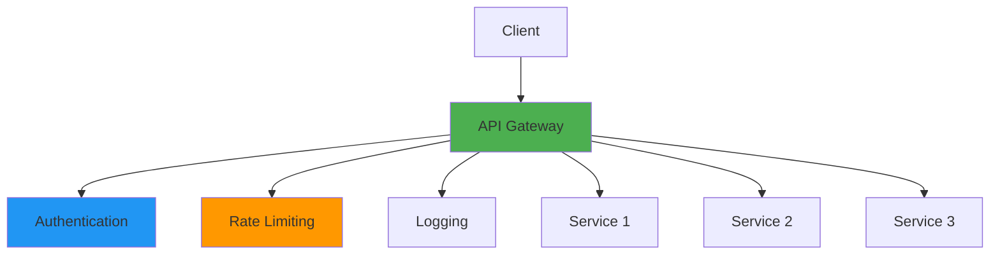
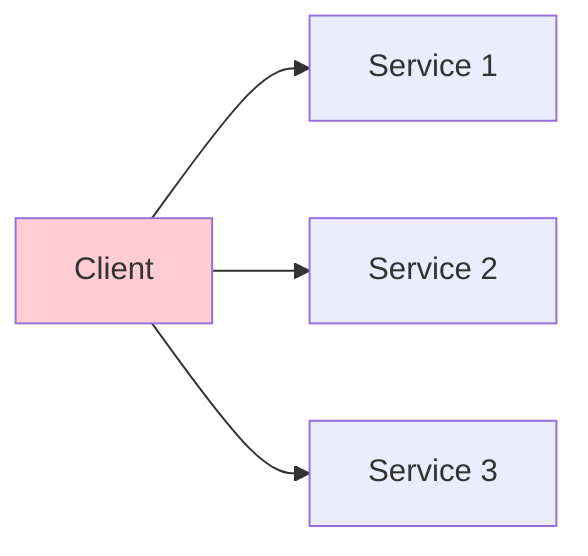
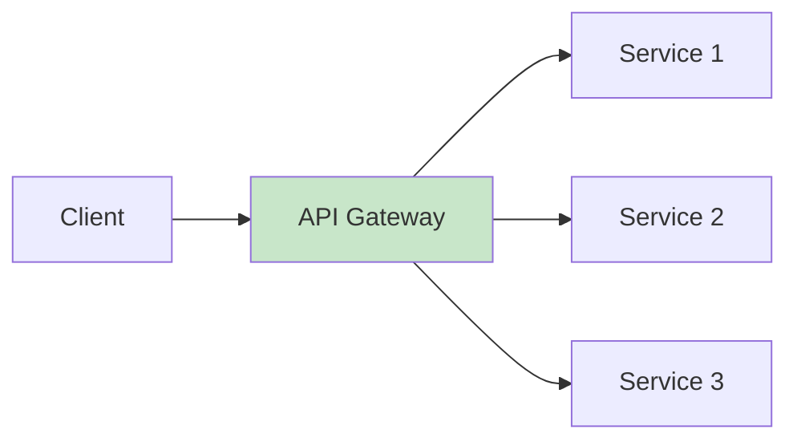
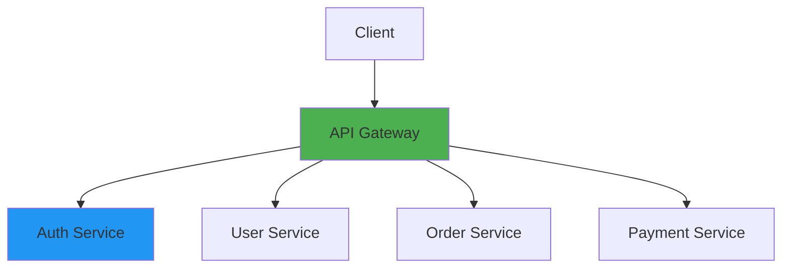
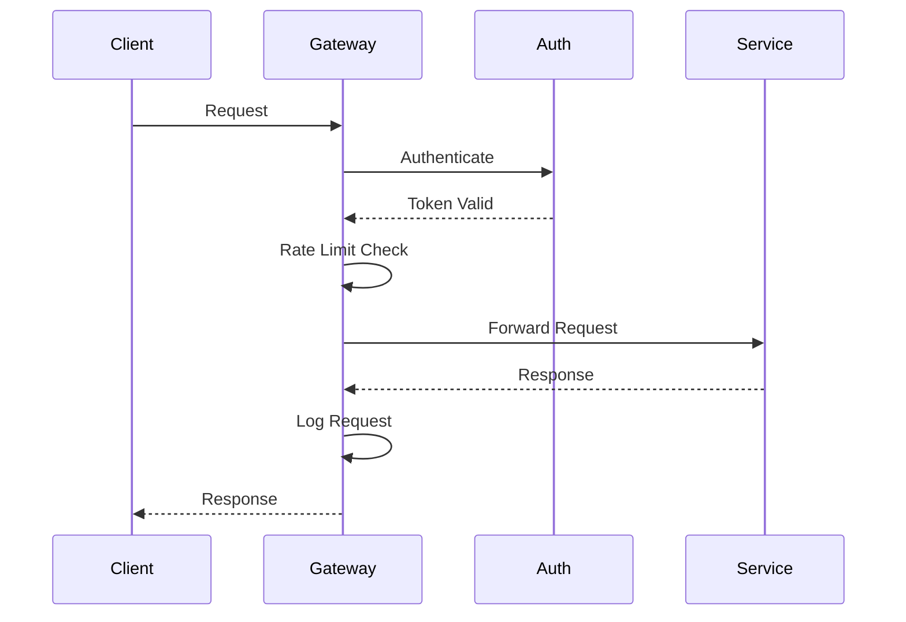

# API Gateway Fundamentals

## Overview

API Gateways serve as a single entry point for client requests to backend services in microservices architectures. They handle routing, authentication, rate limiting, monitoring, and other cross-cutting concerns. This guide covers API Gateway concepts, popular implementations (Kong, AWS API Gateway, Azure API Management), routing patterns, security, and best practices.

## Deep Explanation

### What is an API Gateway?

An API Gateway is a service that acts as a reverse proxy, routing client requests to appropriate backend services.

#### API Gateway Architecture



**Functions**:
- **Routing**: Route requests to services
- **Authentication**: Verify client identity
- **Rate Limiting**: Control request rate
- **Load Balancing**: Distribute load
- **Monitoring**: Track requests
- **Transformation**: Modify requests/responses

### API Gateway Benefits

#### Without API Gateway



**Problems**:
- Multiple endpoints for clients
- Duplicated cross-cutting concerns
- No centralized security
- Difficult to monitor

#### With API Gateway



**Benefits**:
- Single entry point
- Centralized cross-cutting concerns
- Unified security
- Centralized monitoring

### Kong API Gateway

#### What is Kong?

Kong is an open-source API gateway built on Nginx.

#### Installing Kong

**Docker**:
```bash
# Start Kong with database
docker run -d --name kong-database \
  -p 5432:5432 \
  -e "POSTGRES_USER=kong" \
  -e "POSTGRES_DB=kong" \
  postgres:13

# Run migrations
docker run --rm \
  --link kong-database:kong-database \
  -e "KONG_DATABASE=postgres" \
  -e "KONG_PG_HOST=kong-database" \
  kong:latest kong migrations bootstrap

# Start Kong
docker run -d --name kong \
  --link kong-database:kong-database \
  -e "KONG_DATABASE=postgres" \
  -e "KONG_PG_HOST=kong-database" \
  -e "KONG_PROXY_ACCESS_LOG=/dev/stdout" \
  -e "KONG_ADMIN_ACCESS_LOG=/dev/stdout" \
  -e "KONG_PROXY_ERROR_LOG=/dev/stderr" \
  -e "KONG_ADMIN_ERROR_LOG=/dev/stderr" \
  -e "KONG_ADMIN_LISTEN=0.0.0.0:8001" \
  -p 8000:8000 \
  -p 8443:8443 \
  -p 8001:8001 \
  -p 8444:8444 \
  kong:latest
```

**Kubernetes**:
```yaml
apiVersion: v1
kind: Service
metadata:
  name: kong-admin
spec:
  ports:
  - port: 8001
    targetPort: 8001
  selector:
    app: kong

---
apiVersion: apps/v1
kind: Deployment
metadata:
  name: kong
spec:
  replicas: 2
  template:
    spec:
      containers:
      - name: kong
        image: kong:latest
        env:
        - name: KONG_DATABASE
          value: "postgres"
        - name: KONG_PG_HOST
          value: "postgres"
        ports:
        - containerPort: 8000
        - containerPort: 8001
```

#### Kong Configuration

**Service**:
```bash
# Create service
curl -i -X POST http://localhost:8001/services/ \
  --data "name=my-service" \
  --data "url=http://backend:8080"

# List services
curl http://localhost:8001/services/
```

**Route**:
```bash
# Create route
curl -i -X POST http://localhost:8001/services/my-service/routes \
  --data "hosts[]=api.example.com" \
  --data "paths[]=/api"
```

**Kongfig (Declarative)**:
```yaml
# kong.yml
_format_version: "3.0"

services:
  - name: user-service
    url: http://user-service:8080
    routes:
      - name: user-route
        paths:
          - /api/users
        methods:
          - GET
          - POST
        strip_path: false

  - name: order-service
    url: http://order-service:8080
    routes:
      - name: order-route
        paths:
          - /api/orders
        methods:
          - GET
          - POST
          - PUT
          - DELETE

plugins:
  - name: rate-limiting
    config:
      minute: 100
      hour: 1000
  - name: cors
    config:
      origins:
        - "*"
      methods:
        - GET
        - POST
        - PUT
        - DELETE
```

#### Kong Plugins

**Rate Limiting**:
```bash
# Enable rate limiting
curl -X POST http://localhost:8001/services/my-service/plugins \
  --data "name=rate-limiting" \
  --data "config.minute=100" \
  --data "config.hour=1000"
```

**Authentication**:
```bash
# Enable key authentication
curl -X POST http://localhost:8001/services/my-service/plugins \
  --data "name=key-auth"

# Create consumer
curl -X POST http://localhost:8001/consumers \
  --data "username=my-consumer"

# Create API key
curl -X POST http://localhost:8001/consumers/my-consumer/key-auth \
  --data "key=my-api-key"
```

**CORS**:
```bash
# Enable CORS
curl -X POST http://localhost:8001/services/my-service/plugins \
  --data "name=cors" \
  --data "config.origins=*" \
  --data "config.methods=GET,POST"
```

**Request Transformation**:
```bash
# Add header
curl -X POST http://localhost:8001/services/my-service/plugins \
  --data "name=request-transformer" \
  --data "config.add.headers=X-Custom-Header:value"
```

### AWS API Gateway

#### REST API

**Create API**:
```bash
# Create REST API
aws apigateway create-rest-api \
  --name my-api \
  --description "My API"

# Create resource
aws apigateway create-resource \
  --rest-api-id xxxxx \
  --parent-id yyyyy \
  --path-part users

# Create method
aws apigateway put-method \
  --rest-api-id xxxxx \
  --resource-id zzzzz \
  --http-method GET \
  --authorization-type NONE
```

**Terraform**:
```hcl
resource "aws_api_gateway_rest_api" "api" {
  name        = "my-api"
  description = "My API Gateway"
}

resource "aws_api_gateway_resource" "users" {
  rest_api_id = aws_api_gateway_rest_api.api.id
  parent_id   = aws_api_gateway_rest_api.api.root_resource_id
  path_part   = "users"
}

resource "aws_api_gateway_method" "get_users" {
  rest_api_id   = aws_api_gateway_rest_api.api.id
  resource_id   = aws_api_gateway_resource.users.id
  http_method   = "GET"
  authorization = "NONE"
}

resource "aws_api_gateway_integration" "users" {
  rest_api_id = aws_api_gateway_rest_api.api.id
  resource_id = aws_api_gateway_resource.users.id
  http_method = aws_api_gateway_method.get_users.http_method
  
  type                    = "HTTP_PROXY"
  integration_http_method = "GET"
  uri                     = "http://backend:8080/api/users"
}

resource "aws_api_gateway_deployment" "api" {
  rest_api_id = aws_api_gateway_rest_api.api.id
  
  triggers = {
    redeployment = sha1(jsonencode([
      aws_api_gateway_resource.users.id,
      aws_api_gateway_method.get_users.id,
    ]))
  }
  
  lifecycle {
    create_before_destroy = true
  }
}

resource "aws_api_gateway_stage" "production" {
  deployment_id = aws_api_gateway_deployment.api.id
  rest_api_id   = aws_api_gateway_rest_api.api.id
  stage_name    = "production"
}
```

#### HTTP API

**Terraform**:
```hcl
resource "aws_apigatewayv2_api" "http_api" {
  name          = "my-http-api"
  protocol_type = "HTTP"
  description   = "HTTP API Gateway"
}

resource "aws_apigatewayv2_integration" "users" {
  api_id           = aws_apigatewayv2_api.http_api.id
  integration_type = "HTTP_PROXY"
  integration_uri  = "http://backend:8080/api/users"
  integration_method = "GET"
}

resource "aws_apigatewayv2_route" "users" {
  api_id    = aws_apigatewayv2_api.http_api.id
  route_key = "GET /api/users"
  target    = "integrations/${aws_apigatewayv2_integration.users.id}"
}

resource "aws_apigatewayv2_stage" "production" {
  api_id      = aws_apigatewayv2_api.http_api.id
  name        = "production"
  auto_deploy = true
}
```

#### API Gateway Features

**Usage Plans**:
```hcl
resource "aws_api_gateway_usage_plan" "plan" {
  name = "basic-plan"
  
  api_stages {
    api_id = aws_api_gateway_rest_api.api.id
    stage  = aws_api_gateway_stage.production.stage_name
  }
  
  throttle_settings {
    burst_limit = 20
    rate_limit  = 10
  }
  
  quota_settings {
    limit  = 10000
    period = "MONTH"
  }
}

resource "aws_api_gateway_api_key" "key" {
  name = "my-api-key"
}

resource "aws_api_gateway_usage_plan_key" "plan_key" {
  key_id        = aws_api_gateway_api_key.key.id
  key_type      = "API_KEY"
  usage_plan_id = aws_api_gateway_usage_plan.plan.id
}
```

**Authorizers**:
```hcl
resource "aws_api_gateway_authorizer" "cognito" {
  name                   = "cognito-authorizer"
  rest_api_id            = aws_api_gateway_rest_api.api.id
  type                   = "COGNITO_USER_POOLS"
  provider_arns          = [aws_cognito_user_pool.pool.arn]
  authorizer_credentials = aws_iam_role.authorizer.arn
}
```

### Azure API Management

#### Creating API

**Azure CLI**:
```bash
# Create API Management instance
az apim create \
  --name my-apim \
  --resource-group my-rg \
  --location eastus \
  --publisher-name "My Company" \
  --publisher-email admin@example.com \
  --sku-name Consumption

# Create API
az apim api create \
  --resource-group my-rg \
  --service-name my-apim \
  --api-id my-api \
  --path api \
  --display-name "My API"
```

**Terraform**:
```hcl
resource "azurerm_api_management" "apim" {
  name                = "my-apim"
  location            = azurerm_resource_group.main.location
  resource_group_name = azurerm_resource_group.main.name
  publisher_name      = "My Company"
  publisher_email     = "admin@example.com"
  
  sku_name = "Consumption_0"
}

resource "azurerm_api_management_api" "api" {
  name                = "my-api"
  resource_group_name = azurerm_resource_group.main.name
  api_management_name = azurerm_api_management.apim.name
  revision            = "1"
  display_name        = "My API"
  path                = "api"
  protocols           = ["https"]
}
```

### Common Patterns

#### Request Routing

**Path-Based Routing**:
```yaml
# Kong
services:
  - name: user-service
    url: http://user-service:8080
    routes:
      - paths:
          - /api/users
  
  - name: order-service
    url: http://order-service:8080
    routes:
      - paths:
          - /api/orders
```

**Host-Based Routing**:
```yaml
services:
  - name: api-v1
    url: http://api-v1:8080
    routes:
      - hosts:
          - api-v1.example.com
  
  - name: api-v2
    url: http://api-v2:8080
    routes:
      - hosts:
          - api-v2.example.com
```

#### Load Balancing

**Kong Load Balancing**:
```bash
# Create upstream
curl -X POST http://localhost:8001/upstreams \
  --data "name=my-upstream"

# Add targets
curl -X POST http://localhost:8001/upstreams/my-upstream/targets \
  --data "target=backend1:8080" \
  --data "weight=100"

curl -X POST http://localhost:8001/upstreams/my-upstream/targets \
  --data "target=backend2:8080" \
  --data "weight=100"
```

#### Circuit Breaker

**Kong Circuit Breaker**:
```bash
curl -X POST http://localhost:8001/services/my-service/plugins \
  --data "name=circuit-breaker" \
  --data "config.failure_threshold=5" \
  --data "config.success_threshold=2" \
  --data "config.timeout=10"
```

#### API Versioning

**Path Versioning**:
```yaml
services:
  - name: api-v1
    url: http://api-v1:8080
    routes:
      - paths:
          - /api/v1
  
  - name: api-v2
    url: http://api-v2:8080
    routes:
      - paths:
          - /api/v2
```

**Header Versioning**:
```yaml
services:
  - name: api-v1
    url: http://api-v1:8080
    routes:
      - headers:
          X-API-Version: ["v1"]
  
  - name: api-v2
    url: http://api-v2:8080
    routes:
      - headers:
          X-API-Version: ["v2"]
```

### Security

#### Authentication

**API Keys**:
```bash
# Kong key authentication
curl -X POST http://localhost:8001/services/my-service/plugins \
  --data "name=key-auth"
```

**JWT Authentication**:
```bash
# Kong JWT
curl -X POST http://localhost:8001/services/my-service/plugins \
  --data "name=jwt"
```

**OAuth 2.0**:
```bash
# Kong OAuth 2.0
curl -X POST http://localhost:8001/services/my-service/plugins \
  --data "name=oauth2" \
  --data "config.scopes=read,write" \
  --data "config.mandatory_scope=true"
```

#### Rate Limiting

**Per Consumer**:
```bash
curl -X POST http://localhost:8001/services/my-service/plugins \
  --data "name=rate-limiting" \
  --data "config.minute=100" \
  --data "config.hour=1000" \
  --data "config.limit_by=consumer"
```

**Per IP**:
```bash
curl -X POST http://localhost:8001/services/my-service/plugins \
  --data "name=rate-limiting" \
  --data "config.minute=100" \
  --data "config.limit_by=ip"
```

### Monitoring

#### Request Logging

**Kong File Log**:
```bash
curl -X POST http://localhost:8001/services/my-service/plugins \
  --data "name=file-log" \
  --data "config.path=/tmp/access.log"
```

**Kong HTTP Log**:
```bash
curl -X POST http://localhost:8001/services/my-service/plugins \
  --data "name=http-log" \
  --data "config.http_endpoint=http://log-server:8080/logs"
```

#### Metrics

**Prometheus Plugin**:
```bash
curl -X POST http://localhost:8001/services/my-service/plugins \
  --data "name=prometheus"
```

**Access Metrics**:
```bash
curl http://localhost:8001/metrics
```

## Diagrams

### API Gateway Architecture



### Request Flow



## Real Code Examples

### Complete Kong Setup

```yaml
# kong.yml
_format_version: "3.0"

services:
  - name: user-service
    url: http://user-service:8080
    routes:
      - name: user-route
        paths:
          - /api/users
        methods:
          - GET
          - POST
          - PUT
          - DELETE
        strip_path: false
    plugins:
      - name: rate-limiting
        config:
          minute: 100
          hour: 1000
          limit_by: consumer
      - name: key-auth
        config:
          key_names:
            - apikey
      - name: cors
        config:
          origins:
            - "*"
          methods:
            - GET
            - POST
            - PUT
            - DELETE
          headers:
            - Accept
            - Content-Type
          exposed_headers:
            - X-Request-Id
          credentials: true
          max_age: 3600

  - name: order-service
    url: http://order-service:8080
    routes:
      - name: order-route
        paths:
          - /api/orders
        methods:
          - GET
          - POST
          - PUT
          - DELETE
    plugins:
      - name: rate-limiting
        config:
          minute: 50
          hour: 500
      - name: jwt
        config:
          secret_is_base64: false
          run_on_preflight: true

consumers:
  - username: mobile-app
    keyauth_credentials:
      - key: mobile-app-key-12345
  - username: web-app
    keyauth_credentials:
      - key: web-app-key-67890

plugins:
  - name: prometheus
    config:
      per_consumer: true
  - name: file-log
    config:
      path: /var/log/kong/access.log
      reopen: true
```

### AWS API Gateway Complete Setup

```hcl
# Terraform configuration
resource "aws_api_gateway_rest_api" "api" {
  name        = "my-api"
  description = "My API Gateway"
  
  endpoint_configuration {
    types = ["REGIONAL"]
  }
}

resource "aws_api_gateway_resource" "users" {
  rest_api_id = aws_api_gateway_rest_api.api.id
  parent_id   = aws_api_gateway_rest_api.api.root_resource_id
  path_part   = "users"
}

resource "aws_api_gateway_method" "get_users" {
  rest_api_id   = aws_api_gateway_rest_api.api.id
  resource_id   = aws_api_gateway_resource.users.id
  http_method   = "GET"
  authorization = "AWS_IAM"
}

resource "aws_api_gateway_integration" "users" {
  rest_api_id = aws_api_gateway_rest_api.api.id
  resource_id = aws_api_gateway_resource.users.id
  http_method = aws_api_gateway_method.get_users.http_method
  
  type                    = "AWS_PROXY"
  integration_http_method = "POST"
  uri                     = aws_lambda_function.users.invoke_arn
}

resource "aws_api_gateway_deployment" "api" {
  rest_api_id = aws_api_gateway_rest_api.api.id
  
  triggers = {
    redeployment = sha1(jsonencode([
      aws_api_gateway_resource.users.id,
      aws_api_gateway_method.get_users.id,
      aws_api_gateway_integration.users.id,
    ]))
  }
  
  lifecycle {
    create_before_destroy = true
  }
  
  depends_on = [
    aws_api_gateway_method.get_users,
    aws_api_gateway_integration.users,
  ]
}

resource "aws_api_gateway_stage" "production" {
  deployment_id = aws_api_gateway_deployment.api.id
  rest_api_id   = aws_api_gateway_rest_api.api.id
  stage_name    = "production"
  
  access_log_settings {
    destination_arn = aws_cloudwatch_log_group.api.arn
    format = jsonencode({
      requestId      = "$context.requestId"
      ip             = "$context.identity.sourceIp"
      requestTime    = "$context.requestTime"
      httpMethod     = "$context.httpMethod"
      routeKey       = "$context.routeKey"
      status         = "$context.status"
      protocol       = "$context.protocol"
      responseLength = "$context.responseLength"
    })
  }
}

resource "aws_api_gateway_usage_plan" "plan" {
  name = "basic-plan"
  
  api_stages {
    api_id = aws_api_gateway_rest_api.api.id
    stage  = aws_api_gateway_stage.production.stage_name
  }
  
  throttle_settings {
    burst_limit = 20
    rate_limit  = 10
  }
  
  quota_settings {
    limit  = 10000
    period = "MONTH"
  }
}

resource "aws_api_gateway_api_key" "key" {
  name = "my-api-key"
}

resource "aws_api_gateway_usage_plan_key" "plan_key" {
  key_id        = aws_api_gateway_api_key.key.id
  key_type      = "API_KEY"
  usage_plan_id = aws_api_gateway_usage_plan.plan.id
}
```

## Hard Use-Case: Multi-Service API Gateway

### Problem

Route requests to 20+ microservices with different authentication, rate limits, and transformations.

### Solution: Service-Specific Configuration

```yaml
# kong.yml
_format_version: "3.0"

services:
  - name: auth-service
    url: http://auth-service:8080
    routes:
      - paths:
          - /api/auth
    plugins:
      - name: rate-limiting
        config:
          minute: 1000
      - name: request-id
      - name: cors

  - name: user-service
    url: http://user-service:8080
    routes:
      - paths:
          - /api/users
    plugins:
      - name: key-auth
      - name: rate-limiting
        config:
          minute: 100
          limit_by: consumer
      - name: request-transformer
        config:
          add:
            headers:
              - "X-User-Service: true"

  - name: order-service
    url: http://order-service:8080
    routes:
      - paths:
          - /api/orders
    plugins:
      - name: jwt
      - name: rate-limiting
        config:
          minute: 200
      - name: circuit-breaker
        config:
          failure_threshold: 5
          success_threshold: 2
          timeout: 10
```

## Edge Cases and Pitfalls

### 1. Single Point of Failure

**Problem**: Gateway becomes bottleneck

**Solution**: High availability setup

```yaml
# Multiple gateway instances
replicas: 3
```

### 2. Latency Addition

**Problem**: Gateway adds latency

**Solution**: Optimize gateway configuration

```yaml
# Use caching
plugins:
  - name: proxy-cache
    config:
      cache_ttl: 60
```

### 3. Configuration Complexity

**Problem**: Too many routes/plugins

**Solution**: Use declarative config and version control

```yaml
# Version controlled kong.yml
_format_version: "3.0"
# ...
```

## References and Further Reading

- [Kong Documentation](https://docs.konghq.com/) - Kong guide
- [AWS API Gateway](https://docs.aws.amazon.com/apigateway/) - AWS docs
- [API Gateway Pattern](https://microservices.io/patterns/apigateway.html) - Pattern guide

## Quiz

### Question 1
What is the main purpose of an API Gateway?

**A)** Store data  
**B)** Act as single entry point for backend services  
**C)** Run applications  
**D)** Store secrets

**Answer: B** - API Gateway acts as a single entry point, routing client requests to appropriate backend services.

### Question 2
What is Kong?

**A)** A database  
**B)** An open-source API gateway  
**C)** A cloud provider  
**D)** A programming language

**Answer: B** - Kong is an open-source API gateway built on Nginx.

### Question 3
What is rate limiting used for?

**A)** Speed up requests  
**B)** Control request rate and prevent abuse  
**C)** Store requests  
**D)** Delete requests

**Answer: B** - Rate limiting controls the rate of requests to prevent abuse and ensure fair usage.

### Question 4
What is circuit breaker pattern?

**A)** Breaking circuits  
**B)** Preventing cascading failures  
**C)** Increasing requests  
**D)** Storing data

**Answer: B** - Circuit breaker prevents cascading failures by stopping requests to failing services.

### Question 5
What should you use for API versioning?

**A)** Only path versioning  
**B)** Path, header, or query parameter versioning  
**C)** No versioning  
**D)** Only header versioning

**Answer: B** - API versioning can be done via path (/api/v1), headers (X-API-Version), or query parameters.

## Related Topics

- [Kubernetes Fundamentals](./01.%20Kubernetes%20Fundamentals.md) - K8s ingress
- [Service Mesh Fundamentals](../03_advanced/02.%20Service%20Mesh%20Fundamentals.md) - Service mesh
- [Microservices Architecture](../03_advanced/05.%20Microservices%20Architecture.md) - Microservices patterns

