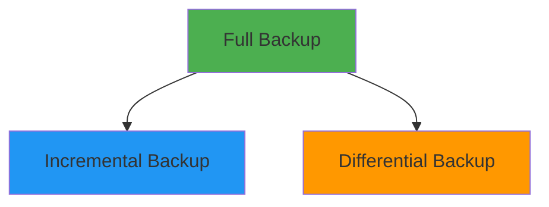
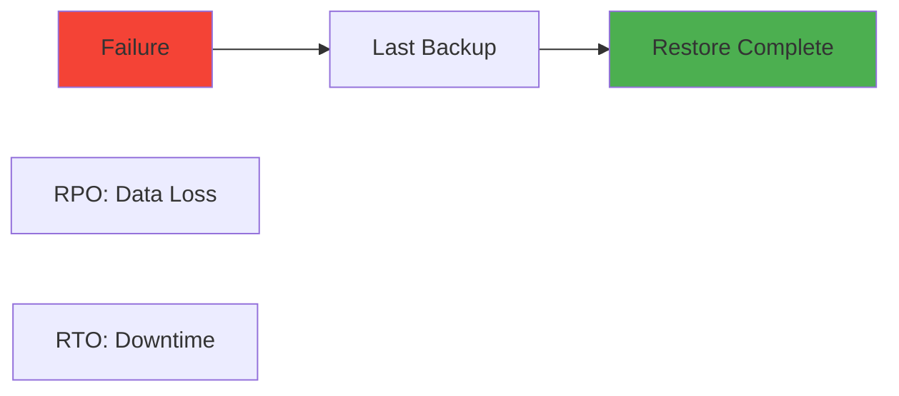
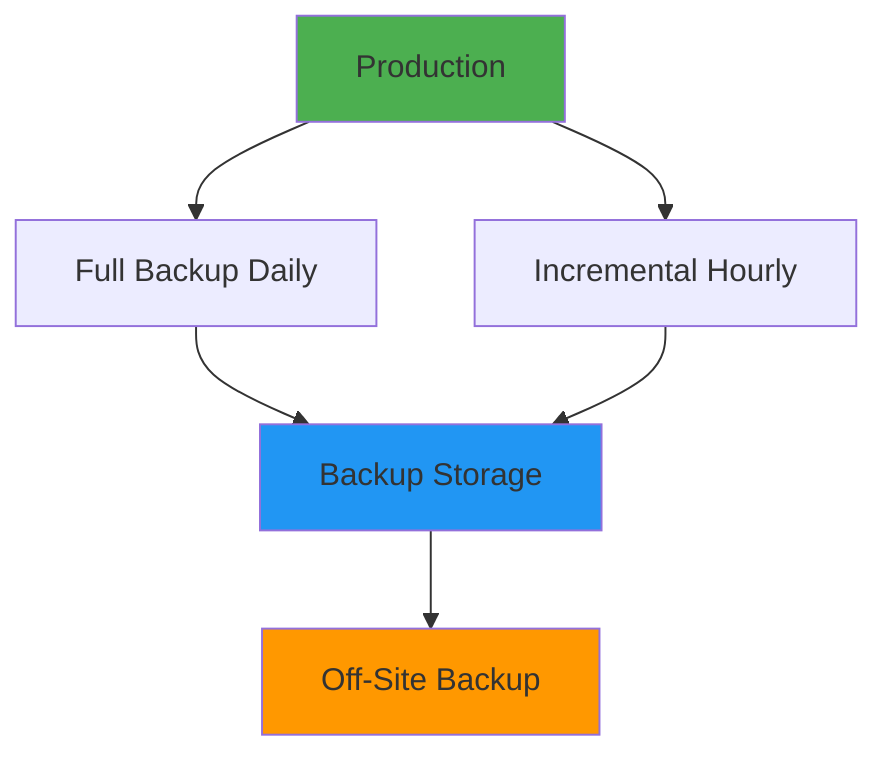
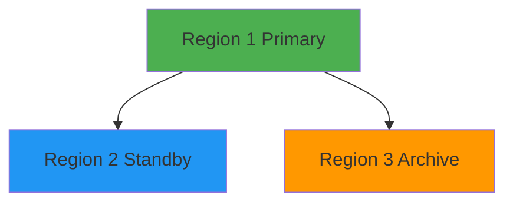

# Backup & Disaster Recovery

## Overview

Backup and Disaster Recovery (DR) are critical components of DevOps operations, ensuring data protection and business continuity. This guide covers backup strategies, disaster recovery planning, RPO (Recovery Point Objective) and RTO (Recovery Time Objective), replication, high availability, and testing recovery procedures.

## Deep Explanation

### Backup Fundamentals

#### What is Backup?

Backup is creating copies of data to restore in case of data loss.

#### Backup Types

**Full Backup**: Complete copy of all data
**Incremental Backup**: Only changed data since last backup
**Differential Backup**: Changed data since last full backup



### Disaster Recovery Concepts

#### RPO and RTO

**RPO (Recovery Point Objective)**: Maximum acceptable data loss
**RTO (Recovery Time Objective)**: Maximum acceptable downtime



**Example**:
- **RPO**: 1 hour (can lose up to 1 hour of data)
- **RTO**: 4 hours (must restore within 4 hours)

### Backup Strategies

#### 3-2-1 Rule

- **3** copies of data
- **2** different media types
- **1** off-site copy

#### Backup Schedule

**Daily Backups**:
```bash
# Full backup daily
0 2 * * * /usr/local/bin/full_backup.sh
```

**Hourly Incremental**:
```bash
# Incremental backup hourly
0 * * * * /usr/local/bin/incremental_backup.sh
```

### Database Backups

#### PostgreSQL Backup

**Automated Backup Script**:
```bash
#!/bin/bash
# postgres_backup.sh

BACKUP_DIR="/backups/postgres"
DATE=$(date +%Y%m%d_%H%M%S)
DB_NAME="myapp"
RETENTION_DAYS=30

# Create backup directory
mkdir -p $BACKUP_DIR

# Full backup
pg_dump -h localhost -U postgres -d $DB_NAME \
  -F c -f "$BACKUP_DIR/${DB_NAME}_full_${DATE}.dump"

# Compress
gzip "$BACKUP_DIR/${DB_NAME}_full_${DATE}.dump"

# Upload to S3
aws s3 cp "$BACKUP_DIR/${DB_NAME}_full_${DATE}.dump.gz" \
  s3://backups/postgres/

# Cleanup old backups
find $BACKUP_DIR -name "*.dump.gz" -mtime +$RETENTION_DAYS -delete

echo "Backup completed: ${DB_NAME}_full_${DATE}.dump.gz"
```

**Continuous Archiving**:
```bash
# postgresql.conf
wal_level = replica
archive_mode = on
archive_command = 'aws s3 cp %p s3://backups/postgres/wal/%f'
```

#### MySQL Backup

**Automated Backup**:
```bash
#!/bin/bash
# mysql_backup.sh

BACKUP_DIR="/backups/mysql"
DATE=$(date +%Y%m%d_%H%M%S)
DB_NAME="myapp"

# Create backup
mysqldump -h localhost -u root -p$MYSQL_ROOT_PASSWORD \
  --single-transaction \
  --routines \
  --triggers \
  $DB_NAME | gzip > "$BACKUP_DIR/${DB_NAME}_${DATE}.sql.gz"

# Upload to S3
aws s3 cp "$BACKUP_DIR/${DB_NAME}_${DATE}.sql.gz" \
  s3://backups/mysql/

echo "Backup completed"
```

#### MongoDB Backup

**Automated Backup**:
```bash
#!/bin/bash
# mongodb_backup.sh

BACKUP_DIR="/backups/mongodb"
DATE=$(date +%Y%m%d_%H%M%S)
DB_NAME="myapp"

# Create backup
mongodump --host localhost:27017 \
  --username $MONGO_USER \
  --password $MONGO_PASSWORD \
  --authenticationDatabase admin \
  --db $DB_NAME \
  --archive="$BACKUP_DIR/${DB_NAME}_${DATE}.archive" \
  --gzip

# Upload to S3
aws s3 cp "$BACKUP_DIR/${DB_NAME}_${DATE}.archive" \
  s3://backups/mongodb/

echo "Backup completed"
```

### File System Backups

#### rsync Backup

**Incremental Backup**:
```bash
#!/bin/bash
# filesystem_backup.sh

SOURCE_DIR="/data"
BACKUP_DIR="/backups/filesystem"
DATE=$(date +%Y%m%d)

# Create backup with rsync
rsync -av --delete \
  --link-dest="$BACKUP_DIR/latest" \
  "$SOURCE_DIR/" \
  "$BACKUP_DIR/$DATE/"

# Update latest symlink
rm -f "$BACKUP_DIR/latest"
ln -s "$BACKUP_DIR/$DATE" "$BACKUP_DIR/latest"

# Upload to S3
aws s3 sync "$BACKUP_DIR/$DATE" \
  s3://backups/filesystem/$DATE/

echo "Backup completed"
```

#### tar Backup

**Compressed Archive**:
```bash
#!/bin/bash
# tar_backup.sh

SOURCE_DIR="/data"
BACKUP_DIR="/backups"
DATE=$(date +%Y%m%d_%H%M%S)

# Create compressed archive
tar -czf "$BACKUP_DIR/data_${DATE}.tar.gz" \
  -C "$SOURCE_DIR" .

# Upload to S3
aws s3 cp "$BACKUP_DIR/data_${DATE}.tar.gz" \
  s3://backups/filesystem/

echo "Backup completed"
```

### Cloud Backups

#### AWS S3 Backup

**S3 Lifecycle Policies**:
```json
{
  "Rules": [
    {
      "Id": "BackupLifecycle",
      "Status": "Enabled",
      "Transitions": [
        {
          "Days": 30,
          "StorageClass": "STANDARD_IA"
        },
        {
          "Days": 90,
          "StorageClass": "GLACIER"
        }
      ],
      "Expiration": {
        "Days": 365
      }
    }
  ]
}
```

**S3 Backup Script**:
```bash
#!/bin/bash
# s3_backup.sh

BACKUP_FILE=$1
S3_BUCKET="backups"
S3_KEY="backups/$(basename $BACKUP_FILE)"

# Upload with metadata
aws s3 cp "$BACKUP_FILE" \
  "s3://${S3_BUCKET}/${S3_KEY}" \
  --metadata "backup-date=$(date -Iseconds)"

echo "Uploaded to s3://${S3_BUCKET}/${S3_KEY}"
```

### Disaster Recovery Strategies

#### Backup and Restore

**Simple Strategy**:


#### Replication

**Database Replication**:
```sql
-- PostgreSQL streaming replication
-- Primary
wal_level = replica
max_wal_senders = 3

-- Standby
primary_conninfo = 'host=primary_host port=5432 user=replicator'
```

**File Replication**:
```bash
# rsync replication
rsync -av --delete \
  source_host:/data/ \
  /backup/data/
```

### High Availability

#### Database HA

**PostgreSQL HA with Patroni**:
```yaml
# patroni.yml
scope: postgres-cluster
namespace: /db/
name: postgres1

restapi:
  listen: 0.0.0.0:8008
  connect_address: postgres1:8008

etcd:
  hosts: etcd1:2379,etcd2:2379,etcd3:2379

bootstrap:
  dcs:
    postgresql:
      parameters:
        wal_level: replica
        max_wal_senders: 3
        max_replication_slots: 3

postgresql:
  listen: 0.0.0.0:5432
  connect_address: postgres1:5432
  data_dir: /var/lib/postgresql/data
  pgpass: /tmp/pgpass
  authentication:
    replication:
      username: replicator
      password: replicator_password
```

#### Application HA

**Load Balancer with Health Checks**:
```yaml
# Kubernetes deployment
apiVersion: apps/v1
kind: Deployment
metadata:
  name: app
spec:
  replicas: 3
  template:
    spec:
      containers:
      - name: app
        image: app:latest
        livenessProbe:
          httpGet:
            path: /health
            port: 8080
          initialDelaySeconds: 30
          periodSeconds: 10
        readinessProbe:
          httpGet:
            path: /ready
            port: 8080
          initialDelaySeconds: 5
          periodSeconds: 5
```

### Recovery Procedures

#### Database Recovery

**PostgreSQL Point-in-Time Recovery**:
```bash
# Restore base backup
pg_basebackup -h primary_host -D /var/lib/postgresql/data -U replicator

# Configure recovery
# postgresql.conf
restore_command = 'aws s3 cp s3://backups/postgres/wal/%f %p'
recovery_target_time = '2024-01-01 12:00:00'

# Start PostgreSQL
pg_ctl start -D /var/lib/postgresql/data
```

**MySQL Recovery**:
```bash
# Restore from backup
gunzip < backup.sql.gz | mysql -u root -p myapp

# Point-in-time recovery
mysqlbinlog --start-datetime="2024-01-01 12:00:00" \
  binlog.000001 | mysql -u root -p myapp
```

#### File System Recovery

**Restore from Backup**:
```bash
# Restore from rsync backup
rsync -av --delete \
  /backups/filesystem/20240101/ \
  /data/

# Restore from tar
tar -xzf /backups/data_20240101.tar.gz -C /data/
```

### Testing Recovery

#### Disaster Recovery Testing

**Test Script**:
```bash
#!/bin/bash
# test_recovery.sh

echo "Testing disaster recovery..."

# 1. Create test environment
echo "Creating test environment..."
create_test_env

# 2. Restore backup
echo "Restoring backup..."
restore_backup

# 3. Verify data
echo "Verifying data..."
verify_data

# 4. Test application
echo "Testing application..."
test_application

# 5. Cleanup
echo "Cleaning up..."
cleanup_test_env

echo "DR test completed"
```

**Automated Testing**:
```yaml
# Kubernetes CronJob for DR testing
apiVersion: batch/v1
kind: CronJob
metadata:
  name: dr-test
spec:
  schedule: "0 2 * * 0"  # Weekly on Sunday
  jobTemplate:
    spec:
      template:
        spec:
          containers:
          - name: dr-test
            image: dr-test:latest
            command: ["/bin/bash", "/scripts/test_recovery.sh"]
```

### Monitoring Backups

#### Backup Monitoring

**Check Backup Status**:
```bash
#!/bin/bash
# check_backups.sh

BACKUP_DIR="/backups"
ALERT_EMAIL="admin@example.com"

# Check if backups exist
if [ ! -f "$BACKUP_DIR/latest_backup.dump" ]; then
  echo "ERROR: No backup found" | mail -s "Backup Alert" $ALERT_EMAIL
  exit 1
fi

# Check backup age
BACKUP_AGE=$(find "$BACKUP_DIR" -name "latest_backup.dump" -mtime +1)
if [ -n "$BACKUP_AGE" ]; then
  echo "WARNING: Backup is older than 24 hours" | mail -s "Backup Alert" $ALERT_EMAIL
fi

# Check backup size
BACKUP_SIZE=$(stat -f%z "$BACKUP_DIR/latest_backup.dump")
if [ $BACKUP_SIZE -lt 1000000 ]; then
  echo "ERROR: Backup size is suspiciously small" | mail -s "Backup Alert" $ALERT_EMAIL
fi

echo "Backup check completed"
```

## Diagrams

### Backup Strategy



### Disaster Recovery Flow


## Real Code Examples

### Complete Backup System

```bash
#!/bin/bash
# complete_backup.sh

set -e

BACKUP_TYPE=${1:-full}
BACKUP_DIR="/backups"
S3_BUCKET="backups"
RETENTION_DAYS=30
DATE=$(date +%Y%m%d_%H%M%S)

log() {
  echo "[$(date +'%Y-%m-%d %H:%M:%S')] $1"
}

backup_database() {
  log "Backing up database..."
  
  if [ "$BACKUP_TYPE" = "full" ]; then
    pg_dump -h localhost -U postgres -d myapp \
      -F c -f "$BACKUP_DIR/db_full_${DATE}.dump"
  else
    # Incremental backup using WAL
    pg_basebackup -h localhost -U replicator \
      -D "$BACKUP_DIR/db_incr_${DATE}" \
      -Ft -z -P
  fi
  
  log "Database backup completed"
}

backup_files() {
  log "Backing up files..."
  
  rsync -av --delete \
    --link-dest="$BACKUP_DIR/files_latest" \
    /data/ \
    "$BACKUP_DIR/files_${DATE}/"
  
  rm -f "$BACKUP_DIR/files_latest"
  ln -s "$BACKUP_DIR/files_${DATE}" "$BACKUP_DIR/files_latest"
  
  log "Files backup completed"
}

upload_to_s3() {
  log "Uploading to S3..."
  
  aws s3 sync "$BACKUP_DIR" \
    "s3://${S3_BUCKET}/" \
    --exclude "*" \
    --include "*${DATE}*" \
    --storage-class STANDARD_IA
  
  log "Upload completed"
}

cleanup_old_backups() {
  log "Cleaning up old backups..."
  
  find "$BACKUP_DIR" -name "*.dump" -mtime +$RETENTION_DAYS -delete
  find "$BACKUP_DIR" -type d -name "files_*" -mtime +$RETENTION_DAYS -exec rm -rf {} +
  
  log "Cleanup completed"
}

# Main execution
log "Starting backup: $BACKUP_TYPE"

backup_database
backup_files
upload_to_s3
cleanup_old_backups

log "Backup completed successfully"
```

## Hard Use-Case: Multi-Region Disaster Recovery

### Problem

Ensure business continuity with RPO of 1 hour and RTO of 4 hours across multiple regions.

### Solution: Multi-Region Replication

**Architecture**:


**Implementation**:
- **Continuous Replication**: Region 1 → Region 2
- **Hourly Backups**: Region 1 → Region 3
- **Automated Failover**: DNS switch on failure
- **Regular Testing**: Monthly DR drills

## Edge Cases and Pitfalls

### 1. Backup Corruption

**Problem**: Backups become corrupted

**Solution**: Verify backups regularly

```bash
# Verify backup integrity
pg_restore --list backup.dump > /dev/null
if [ $? -ne 0 ]; then
  echo "Backup corrupted!"
fi
```

### 2. Incomplete Backups

**Problem**: Backups don't complete

**Solution**: Monitor backup completion

```bash
# Check backup completion
if [ -f "$BACKUP_DIR/backup.dump" ]; then
  echo "Backup completed"
else
  echo "Backup failed"
fi
```

### 3. Recovery Time Too Long

**Problem**: Recovery takes longer than RTO

**Solution**: Optimize recovery process

```bash
# Parallel restore
pg_restore -j 4 backup.dump
```

## References and Further Reading

- [AWS Backup](https://aws.amazon.com/backup/) - AWS backup services
- [Disaster Recovery Planning](https://www.oreilly.com/library/view/disaster-recovery-planning/9781492045199/) - DR guide
- [Backup Best Practices](https://www.backupbestpractices.com/) - Backup guide

## Quiz

### Question 1
What is RPO?

**A)** Recovery Time Objective  
**B)** Recovery Point Objective - maximum acceptable data loss  
**C)** Recovery Process Order  
**D)** Recovery Point Operation

**Answer: B** - RPO (Recovery Point Objective) is the maximum acceptable amount of data loss measured in time.

### Question 2
What is the 3-2-1 backup rule?

**A)** 3 backups, 2 locations, 1 type  
**B)** 3 copies, 2 media types, 1 off-site  
**C)** 3 days, 2 weeks, 1 month  
**D)** 3 servers, 2 databases, 1 backup

**Answer: B** - The 3-2-1 rule means 3 copies of data, 2 different media types, and 1 off-site copy.

### Question 3
What is the difference between full and incremental backup?

**A)** No difference  
**B)** Full backs up everything, incremental only changes  
**C)** Incremental is faster  
**D)** Full is smaller

**Answer: B** - Full backup copies all data, while incremental backup only copies data changed since the last backup.

### Question 4
What should you do regularly for disaster recovery?

**A)** Nothing  
**B)** Test recovery procedures  
**C)** Delete backups  
**D)** Ignore failures

**Answer: B** - Regular testing of recovery procedures ensures they work when needed.

### Question 5
What is high availability?

**A)** One server  
**B)** Multiple redundant systems to minimize downtime  
**C)** No backups  
**D)** Single point of failure

**Answer: B** - High availability uses multiple redundant systems to minimize downtime and ensure service continuity.

## Related Topics

- [Database Administration](./13.%20Database%20Administration.md) - Database backups
- [High Availability Patterns](../03_advanced/08.%20High%20Availability%20Patterns.md) - HA strategies
- [Monitoring & Observability](./04.%20Monitoring%20%26%20Observability.md) - Backup monitoring

