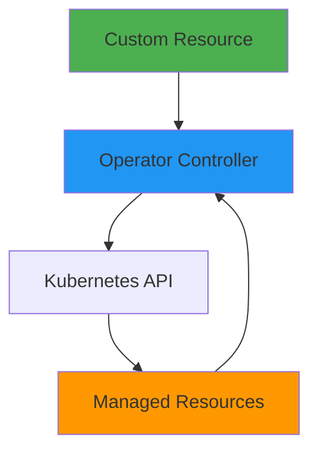
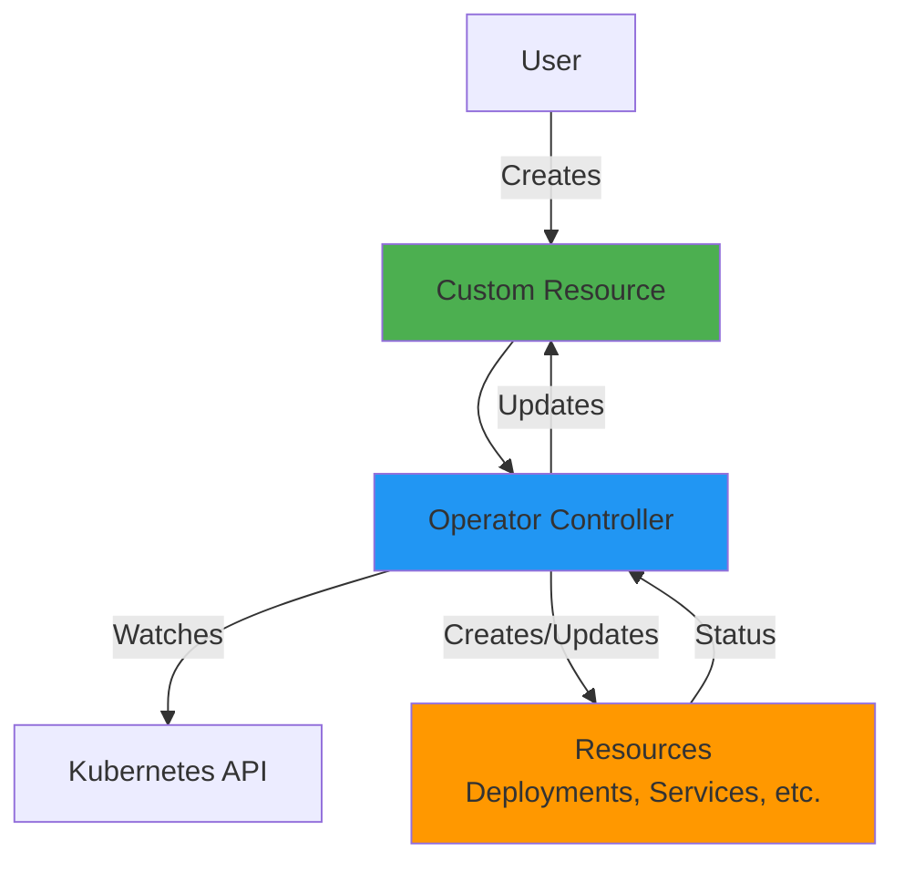
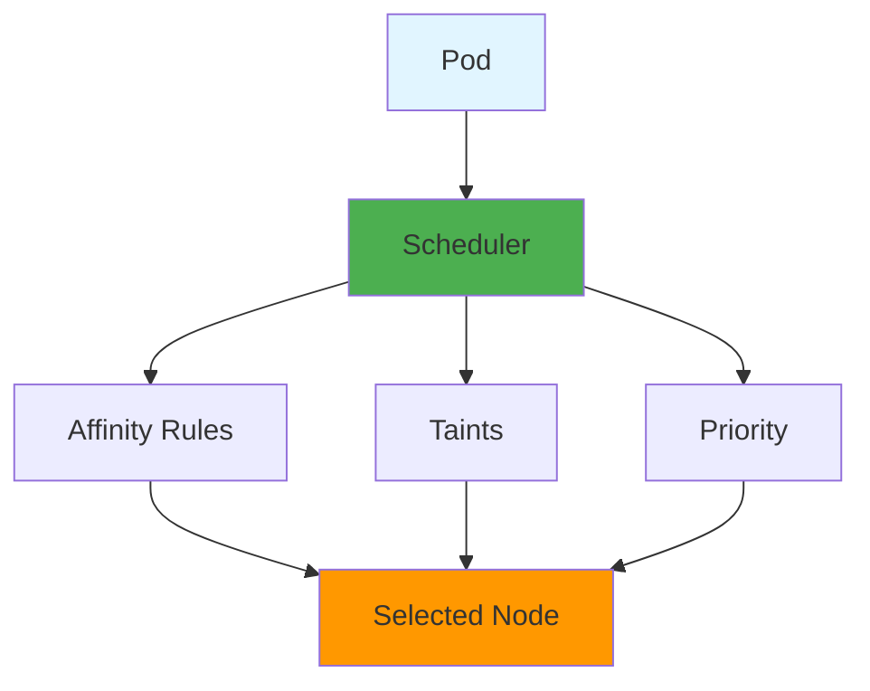

# Advanced Kubernetes Patterns

## Overview

Advanced Kubernetes patterns enable sophisticated application architectures and operational capabilities. This guide covers custom resources, operators, advanced scheduling, service mesh integration, and production-ready patterns for complex workloads.

## Deep Explanation

### Custom Resource Definitions (CRDs)

CRDs extend Kubernetes API with custom resources.

#### Creating a CRD

```yaml
apiVersion: apiextensions.k8s.io/v1
kind: CustomResourceDefinition
metadata:
  name: databases.example.com
spec:
  group: example.com
  versions:
  - name: v1
    served: true
    storage: true
    schema:
      openAPIV3Schema:
        type: object
        properties:
          spec:
            type: object
            properties:
              databaseName:
                type: string
              replicas:
                type: integer
  scope: Namespaced
  names:
    plural: databases
    singular: database
    kind: Database
```

#### Using Custom Resources

```yaml
apiVersion: example.com/v1
kind: Database
metadata:
  name: my-database
spec:
  databaseName: mydb
  replicas: 3
```

### Kubernetes Operators

Operators are controllers that manage complex applications.

#### Operator Pattern



#### Operator Example (Python)

```python
from kubernetes import client, config, watch
from kubernetes.client.rest import ApiException

config.load_incluster_config()
v1 = client.CustomObjectsApi()
core_v1 = client.CoreV1Api()

def reconcile_database(name, namespace, spec):
    """Reconcile database custom resource"""
    db_name = spec.get('databaseName')
    replicas = spec.get('replicas', 1)
    
    # Create StatefulSet
    statefulset = {
        "apiVersion": "apps/v1",
        "kind": "StatefulSet",
        "metadata": {
            "name": f"{name}-db",
            "namespace": namespace
        },
        "spec": {
            "replicas": replicas,
            "serviceName": f"{name}-db",
            "selector": {
                "matchLabels": {"app": name}
            },
            "template": {
                "metadata": {"labels": {"app": name}},
                "spec": {
                    "containers": [{
                        "name": "postgres",
                        "image": "postgres:14",
                        "env": [{
                            "name": "POSTGRES_DB",
                            "value": db_name
                        }]
                    }]
                }
            }
        }
    }
    
    try:
        apps_v1 = client.AppsV1Api()
        apps_v1.create_namespaced_stateful_set(namespace, statefulset)
    except ApiException as e:
        if e.status == 409:
            # Update existing
            apps_v1.replace_namespaced_stateful_set(
                f"{name}-db", namespace, statefulset
            )

def watch_databases():
    """Watch for database custom resources"""
    w = watch.Watch()
    for event in w.stream(
        v1.list_namespaced_custom_object,
        "example.com",
        "v1",
        "default",
        "databases"
    ):
        obj = event['object']
        event_type = event['type']
        name = obj['metadata']['name']
        namespace = obj['metadata']['namespace']
        spec = obj.get('spec', {})
        
        if event_type in ['ADDED', 'MODIFIED']:
            reconcile_database(name, namespace, spec)

if __name__ == '__main__':
    watch_databases()
```

### Advanced Scheduling

#### Node Affinity

```yaml
apiVersion: v1
kind: Pod
metadata:
  name: gpu-pod
spec:
  affinity:
    nodeAffinity:
      requiredDuringSchedulingIgnoredDuringExecution:
        nodeSelectorTerms:
        - matchExpressions:
          - key: accelerator
            operator: In
            values:
            - nvidia-tesla-k80
      preferredDuringSchedulingIgnoredDuringExecution:
      - weight: 100
        preference:
          matchExpressions:
          - key: zone
            operator: In
            values:
            - us-east-1a
  containers:
  - name: gpu-app
    image: nvidia/cuda:11.0
```

#### Pod Affinity/Anti-Affinity

```yaml
apiVersion: v1
kind: Pod
metadata:
  name: web-pod
spec:
  affinity:
    podAffinity:
      requiredDuringSchedulingIgnoredDuringExecution:
      - labelSelector:
          matchExpressions:
          - key: app
            operator: In
            values:
            - cache
        topologyKey: kubernetes.io/hostname
    podAntiAffinity:
      preferredDuringSchedulingIgnoredDuringExecution:
      - weight: 100
        podAffinityTerm:
          labelSelector:
            matchExpressions:
            - key: app
              operator: In
              values:
              - web
          topologyKey: kubernetes.io/hostname
  containers:
  - name: web
    image: nginx
```

#### Taints and Tolerations

```yaml
# Taint node
kubectl taint nodes node1 key=value:NoSchedule

# Pod with toleration
apiVersion: v1
kind: Pod
metadata:
  name: special-pod
spec:
  tolerations:
  - key: "key"
    operator: "Equal"
    value: "value"
    effect: "NoSchedule"
  containers:
  - name: app
    image: nginx
```

### Advanced Resource Management

#### Resource Quotas

```yaml
apiVersion: v1
kind: ResourceQuota
metadata:
  name: compute-quota
spec:
  hard:
    requests.cpu: "4"
    requests.memory: 8Gi
    limits.cpu: "8"
    limits.memory: 16Gi
    persistentvolumeclaims: "4"
```

#### Limit Ranges

```yaml
apiVersion: v1
kind: LimitRange
metadata:
  name: mem-limit-range
spec:
  limits:
  - default:
      memory: "512Mi"
      cpu: "500m"
    defaultRequest:
      memory: "256Mi"
      cpu: "250m"
    type: Container
```

#### Priority Classes

```yaml
apiVersion: scheduling.k8s.io/v1
kind: PriorityClass
metadata:
  name: high-priority
value: 1000
globalDefault: false
description: "High priority class"

---
apiVersion: v1
kind: Pod
metadata:
  name: important-pod
spec:
  priorityClassName: high-priority
  containers:
  - name: app
    image: nginx
```

### StatefulSets Advanced Patterns

#### StatefulSet with Headless Service

```yaml
apiVersion: v1
kind: Service
metadata:
  name: db
spec:
  clusterIP: None  # Headless service
  selector:
    app: database
  ports:
  - port: 5432

---
apiVersion: apps/v1
kind: StatefulSet
metadata:
  name: db
spec:
  serviceName: db
  replicas: 3
  selector:
    matchLabels:
      app: database
  template:
    metadata:
      labels:
        app: database
    spec:
      containers:
      - name: postgres
        image: postgres:14
        env:
        - name: POSTGRES_REPLICA_MODE
          value: "true"
        - name: POSTGRES_MASTER_HOST
          value: "db-0.db.default.svc.cluster.local"
```

### Advanced Networking

#### Network Policies

```yaml
apiVersion: networking.k8s.io/v1
kind: NetworkPolicy
metadata:
  name: api-allow
spec:
  podSelector:
    matchLabels:
      app: api
  policyTypes:
  - Ingress
  - Egress
  ingress:
  - from:
    - podSelector:
        matchLabels:
          app: frontend
    ports:
    - protocol: TCP
      port: 8080
  egress:
  - to:
    - podSelector:
        matchLabels:
          app: database
    ports:
    - protocol: TCP
      port: 5432
```

#### Ingress Controllers

```yaml
apiVersion: networking.k8s.io/v1
kind: Ingress
metadata:
  name: app-ingress
  annotations:
    nginx.ingress.kubernetes.io/rewrite-target: /
    cert-manager.io/cluster-issuer: letsencrypt-prod
spec:
  ingressClassName: nginx
  tls:
  - hosts:
    - app.example.com
    secretName: app-tls
  rules:
  - host: app.example.com
    http:
      paths:
      - path: /
        pathType: Prefix
        backend:
          service:
            name: web-service
            port:
              number: 80
```

### Advanced Deployment Strategies

#### Canary Deployment

```yaml
apiVersion: v1
kind: Service
metadata:
  name: app-service
spec:
  selector:
    app: app
  ports:
  - port: 80

---
apiVersion: apps/v1
kind: Deployment
metadata:
  name: app-stable
spec:
  replicas: 9
  selector:
    matchLabels:
      app: app
      version: stable
  template:
    metadata:
      labels:
        app: app
        version: stable
    spec:
      containers:
      - name: app
        image: app:v1.0.0

---
apiVersion: apps/v1
kind: Deployment
metadata:
  name: app-canary
spec:
  replicas: 1
  selector:
    matchLabels:
      app: app
      version: canary
  template:
    metadata:
      labels:
        app: app
        version: canary
    spec:
      containers:
      - name: app
        image: app:v1.1.0
```

#### Blue-Green with Services

```yaml
# Blue deployment
apiVersion: apps/v1
kind: Deployment
metadata:
  name: app-blue
spec:
  replicas: 3
  selector:
    matchLabels:
      app: app
      version: blue
  template:
    metadata:
      labels:
        app: app
        version: blue
    spec:
      containers:
      - name: app
        image: app:v1.0.0

---
# Green deployment
apiVersion: apps/v1
kind: Deployment
metadata:
  name: app-green
spec:
  replicas: 3
  selector:
    matchLabels:
      app: app
      version: green
  template:
    metadata:
      labels:
        app: app
        version: green
    spec:
      containers:
      - name: app
        image: app:v1.1.0

---
# Service switches between blue/green
apiVersion: v1
kind: Service
metadata:
  name: app-service
spec:
  selector:
    app: app
    version: blue  # Switch to green for new version
  ports:
  - port: 80
```

### Horizontal Pod Autoscaler (Advanced)

```yaml
apiVersion: autoscaling/v2
kind: HorizontalPodAutoscaler
metadata:
  name: app-hpa
spec:
  scaleTargetRef:
    apiVersion: apps/v1
    kind: Deployment
    name: app
  minReplicas: 2
  maxReplicas: 10
  metrics:
  - type: Resource
    resource:
      name: cpu
      target:
        type: Utilization
        averageUtilization: 70
  - type: Resource
    resource:
      name: memory
      target:
        type: Utilization
        averageUtilization: 80
  - type: Pods
    pods:
      metric:
        name: http_requests_per_second
      target:
        type: AverageValue
        averageValue: "100"
  behavior:
    scaleDown:
      stabilizationWindowSeconds: 300
      policies:
      - type: Percent
        value: 50
        periodSeconds: 60
    scaleUp:
      stabilizationWindowSeconds: 0
      policies:
      - type: Percent
        value: 100
        periodSeconds: 15
      - type: Pods
        value: 4
        periodSeconds: 15
      selectPolicy: Max
```

### Vertical Pod Autoscaler

```yaml
apiVersion: autoscaling.k8s.io/v1
kind: VerticalPodAutoscaler
metadata:
  name: app-vpa
spec:
  targetRef:
    apiVersion: apps/v1
    kind: Deployment
    name: app
  updatePolicy:
    updateMode: "Auto"
  resourcePolicy:
    containerPolicies:
    - containerName: app
      minAllowed:
        cpu: 100m
        memory: 128Mi
      maxAllowed:
        cpu: 1
        memory: 512Mi
```

### Jobs and CronJobs

#### Job with Completions

```yaml
apiVersion: batch/v1
kind: Job
metadata:
  name: batch-job
spec:
  completions: 5
  parallelism: 2
  template:
    spec:
      containers:
      - name: worker
        image: worker:latest
        command: ["/bin/sh", "-c", "process-item"]
      restartPolicy: Never
```

#### CronJob

```yaml
apiVersion: batch/v1
kind: CronJob
metadata:
  name: backup-job
spec:
  schedule: "0 2 * * *"  # Daily at 2 AM
  jobTemplate:
    spec:
      template:
        spec:
          containers:
          - name: backup
            image: backup:latest
            command: ["/bin/sh", "-c", "backup-database"]
          restartPolicy: OnFailure
```

### Secrets Management

#### External Secrets Operator

```yaml
apiVersion: external-secrets.io/v1beta1
kind: ExternalSecret
metadata:
  name: app-secret
spec:
  secretStoreRef:
    name: aws-secrets-manager
    kind: SecretStore
  target:
    name: app-secret
    creationPolicy: Owner
  data:
  - secretKey: password
    remoteRef:
      key: prod/database/password
```

### Service Mesh Integration

#### Istio Sidecar Injection

```yaml
apiVersion: v1
kind: Namespace
metadata:
  name: production
  labels:
    istio-injection: enabled

---
apiVersion: apps/v1
kind: Deployment
metadata:
  name: app
  namespace: production
spec:
  template:
    metadata:
      annotations:
        sidecar.istio.io/inject: "true"
    spec:
      containers:
      - name: app
        image: app:latest
```

## Diagrams

### Operator Pattern



### Advanced Scheduling



## Real Code Examples

### Complete Operator Implementation

```python
# operator.py - Complete database operator
from kubernetes import client, config, watch
from kubernetes.client.rest import ApiException
import time
import logging

logging.basicConfig(level=logging.INFO)
logger = logging.getLogger(__name__)

config.load_incluster_config()

class DatabaseOperator:
    def __init__(self):
        self.custom_api = client.CustomObjectsApi()
        self.apps_api = client.AppsV1Api()
        self.core_api = client.CoreV1Api()
        self.group = "example.com"
        self.version = "v1"
        self.plural = "databases"
    
    def create_statefulset(self, name, namespace, spec):
        """Create StatefulSet for database"""
        db_name = spec.get('databaseName', name)
        replicas = spec.get('replicas', 1)
        image = spec.get('image', 'postgres:14')
        
        statefulset = {
            "apiVersion": "apps/v1",
            "kind": "StatefulSet",
            "metadata": {
                "name": f"{name}-db",
                "namespace": namespace,
                "ownerReferences": [{
                    "apiVersion": f"{self.group}/{self.version}",
                    "kind": "Database",
                    "name": name,
                    "uid": spec.get('uid')
                }]
            },
            "spec": {
                "serviceName": f"{name}-db",
                "replicas": replicas,
                "selector": {
                    "matchLabels": {"app": name, "component": "database"}
                },
                "template": {
                    "metadata": {
                        "labels": {"app": name, "component": "database"}
                    },
                    "spec": {
                        "containers": [{
                            "name": "database",
                            "image": image,
                            "env": [
                                {"name": "POSTGRES_DB", "value": db_name},
                                {"name": "POSTGRES_USER", "value": "admin"},
                                {"name": "POSTGRES_PASSWORD",
                                 "valueFrom": {
                                     "secretKeyRef": {
                                         "name": f"{name}-secret",
                                         "key": "password"
                                     }
                                 }}
                            ],
                            "ports": [{"containerPort": 5432}],
                            "volumeMounts": [{
                                "name": "data",
                                "mountPath": "/var/lib/postgresql/data"
                            }]
                        }],
                        "volumes": [{
                            "name": "data",
                            "persistentVolumeClaim": {
                                "claimName": f"{name}-data"
                            }
                        }]
                    }
                }
            }
        }
        
        try:
            self.apps_api.create_namespaced_stateful_set(
                namespace, statefulset
            )
            logger.info(f"Created StatefulSet for {name}")
        except ApiException as e:
            if e.status == 409:
                self.apps_api.replace_namespaced_stateful_set(
                    f"{name}-db", namespace, statefulset
                )
                logger.info(f"Updated StatefulSet for {name}")
            else:
                logger.error(f"Error creating StatefulSet: {e}")
    
    def create_service(self, name, namespace):
        """Create Service for database"""
        service = {
            "apiVersion": "v1",
            "kind": "Service",
            "metadata": {
                "name": f"{name}-db",
                "namespace": namespace
            },
            "spec": {
                "selector": {"app": name, "component": "database"},
                "ports": [{"port": 5432, "targetPort": 5432}],
                "clusterIP": None  # Headless
            }
        }
        
        try:
            self.core_api.create_namespaced_service(namespace, service)
            logger.info(f"Created Service for {name}")
        except ApiException as e:
            if e.status == 409:
                logger.debug(f"Service already exists for {name}")
            else:
                logger.error(f"Error creating Service: {e}")
    
    def update_status(self, name, namespace, status):
        """Update CustomResource status"""
        try:
            cr = self.custom_api.get_namespaced_custom_object(
                self.group, self.version, namespace, self.plural, name
            )
            cr['status'] = status
            self.custom_api.replace_namespaced_custom_object(
                self.group, self.version, namespace, self.plural, name, cr
            )
        except ApiException as e:
            logger.error(f"Error updating status: {e}")
    
    def reconcile(self, name, namespace, spec):
        """Reconcile database resource"""
        logger.info(f"Reconciling database {name} in {namespace}")
        
        # Create Service
        self.create_service(name, namespace)
        
        # Create StatefulSet
        self.create_statefulset(name, namespace, spec)
        
        # Update status
        self.update_status(name, namespace, {
            "phase": "Running",
            "ready": True
        })
    
    def run(self):
        """Main operator loop"""
        logger.info("Starting database operator")
        
        w = watch.Watch()
        for event in w.stream(
            self.custom_api.list_namespaced_custom_object,
            self.group,
            self.version,
            "default",
            self.plural
        ):
            obj = event['object']
            event_type = event['type']
            name = obj['metadata']['name']
            namespace = obj['metadata'].get('namespace', 'default')
            spec = obj.get('spec', {})
            
            logger.info(f"Event: {event_type} for {name}")
            
            if event_type in ['ADDED', 'MODIFIED']:
                self.reconcile(name, namespace, spec)
            elif event_type == 'DELETED':
                logger.info(f"Database {name} deleted")

if __name__ == '__main__':
    operator = DatabaseOperator()
    operator.run()
```

## Hard Use-Case: Multi-Region Database Operator

### Problem

Create operator managing PostgreSQL clusters across multiple regions with automatic failover.

### Solution: Advanced Operator with Cross-Region Support

```python
class MultiRegionDatabaseOperator:
    def reconcile_multi_region(self, name, namespace, spec):
        regions = spec.get('regions', ['us-east-1', 'us-west-2'])
        primary_region = spec.get('primaryRegion', regions[0])
        
        for region in regions:
            is_primary = (region == primary_region)
            
            # Create StatefulSet per region
            self.create_regional_statefulset(
                name, namespace, region, is_primary, spec
            )
            
            # Configure replication if not primary
            if not is_primary:
                self.setup_replication(name, namespace, region, primary_region)
```

## Edge Cases and Pitfalls

### 1. CRD Versioning

**Problem**: Breaking changes in CRD versions

**Solution**: Use versioning strategy

```yaml
# Support multiple versions
versions:
- name: v1
  served: true
  storage: false  # Not stored
- name: v2
  served: true
  storage: true  # Stored version
```

### 2. Operator Performance

**Problem**: Operator processing too slowly

**Solution**: Optimize reconciliation

```python
# Use work queues
# Batch operations
# Cache API responses
# Parallel processing
```

### 3. Resource Cleanup

**Problem**: Resources not cleaned up on deletion

**Solution**: Use owner references

```yaml
ownerReferences:
- apiVersion: example.com/v1
  kind: Database
  name: my-db
  uid: "12345"
```

## References and Further Reading

- [Kubernetes Operators](https://kubernetes.io/docs/concepts/extend-kubernetes/operator/) - Operator pattern
- [Custom Resources](https://kubernetes.io/docs/concepts/extend-kubernetes/api-extension/custom-resources/) - CRDs
- [Advanced Scheduling](https://kubernetes.io/docs/concepts/scheduling-eviction/) - Scheduling
- [Operator SDK](https://sdk.operatorframework.io/) - Operator framework

## Quiz

### Question 1
What is a Kubernetes Operator?

**A)** A pod that runs applications  
**B)** A controller that manages complex applications using custom resources  
**C)** A service that routes traffic  
**D)** A storage class

**Answer: B** - Operators are controllers that extend Kubernetes to manage complex applications using custom resources.

### Question 2
What is the purpose of node affinity?

**A)** To schedule pods on specific nodes  
**B)** To prevent pods from running  
**C)** To limit resources  
**D)** To scale pods

**Answer: A** - Node affinity allows you to constrain which nodes pods can be scheduled on based on node labels.

### Question 3
What does a headless service provide?

**A)** Load balancing  
**B)** Direct pod IP access  
**C)** External access  
**D)** SSL termination

**Answer: B** - A headless service (clusterIP: None) provides direct access to pod IPs, useful for StatefulSets.

### Question 4
What is the purpose of network policies?

**A)** To define ingress rules  
**B)** To control pod-to-pod communication  
**C)** To configure DNS  
**D)** To manage storage

**Answer: B** - Network policies control how pods communicate with each other and other network endpoints.

### Question 5
What is a CRD?

**A)** Custom Resource Definition - extends Kubernetes API  
**B)** Container Resource Deployment  
**C)** Cluster Resource Directory  
**D)** Custom Runtime Definition

**Answer: A** - CRD (Custom Resource Definition) extends the Kubernetes API to add custom resources.

## Related Topics

- [Kubernetes Fundamentals](../02_intermediate/01.%20Kubernetes%20Fundamentals.md) - Kubernetes basics
- [Service Mesh Fundamentals](./02.%20Service%20Mesh%20Fundamentals.md) - Service mesh patterns
- [Monitoring & Observability](../02_intermediate/04.%20Monitoring%20%26%20Observability.md) - Observing operators

