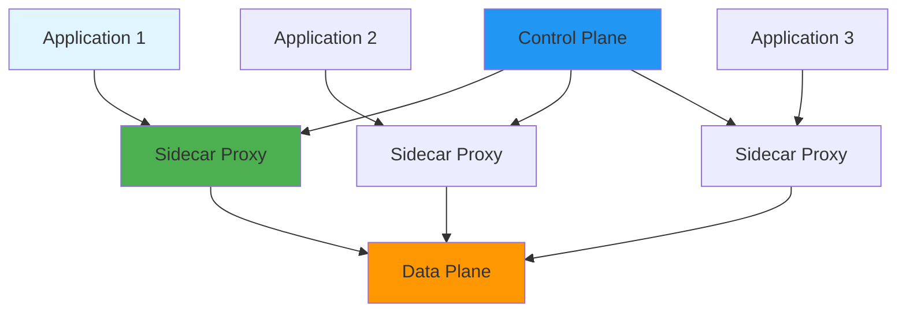
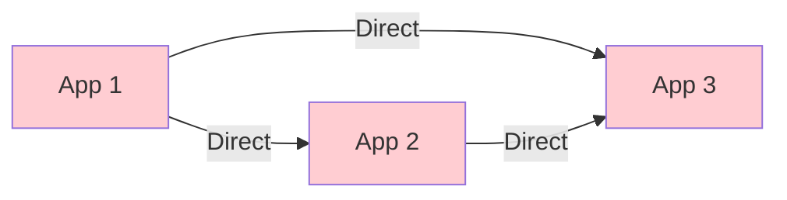
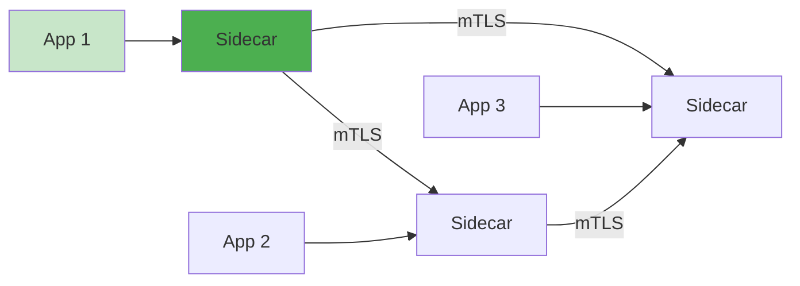
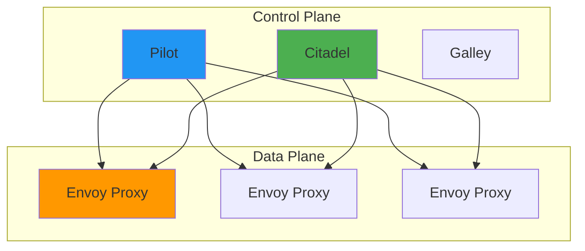
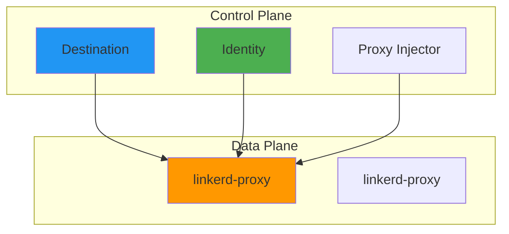
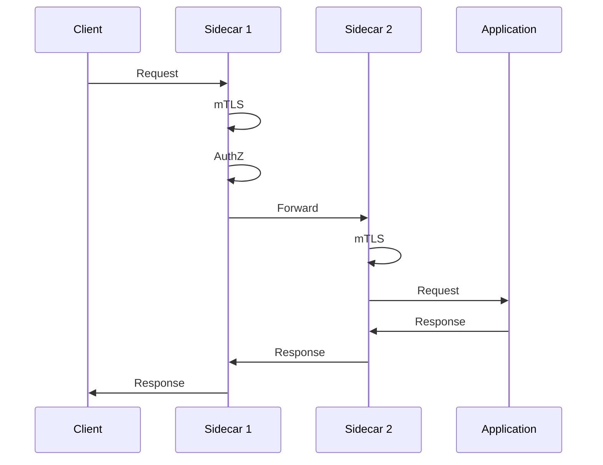
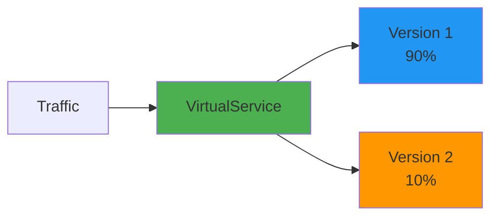

# Service Mesh Fundamentals

## Overview

Service mesh provides a dedicated infrastructure layer for handling service-to-service communication in microservices architectures. It offers traffic management, security, observability, and resilience features without requiring changes to application code. This guide covers service mesh concepts, Istio and Linkerd implementations, and production patterns.

## Deep Explanation

### What is a Service Mesh?

A service mesh is a dedicated infrastructure layer that controls service-to-service communication in a microservices architecture.

#### Service Mesh Architecture



**Components**:
- **Data Plane**: Sidecar proxies (Envoy, Linkerd-proxy)
- **Control Plane**: Management and configuration

### Why Use a Service Mesh?

#### Benefits

1. **Traffic Management**: Load balancing, routing, circuit breaking
2. **Security**: mTLS, authentication, authorization
3. **Observability**: Metrics, logs, traces
4. **Resilience**: Retries, timeouts, circuit breakers
5. **Policy Enforcement**: Rate limiting, access control

#### Without Service Mesh



**Problems**:
- Security logic in each service
- No centralized observability
- Difficult to manage traffic
- Code duplication

#### With Service Mesh



**Benefits**:
- Centralized security
- Unified observability
- Traffic management
- No code changes needed

### Istio Service Mesh

#### Istio Architecture



**Components**:
- **Istiod**: Unified control plane (Pilot, Citadel, Galley)
- **Envoy**: Data plane proxy

#### Installing Istio

```bash
# Download Istio
curl -L https://istio.io/downloadIstio | sh -
cd istio-*

# Install Istio
istioctl install --set profile=default

# Enable sidecar injection
kubectl label namespace default istio-injection=enabled
```

#### Virtual Services

```yaml
apiVersion: networking.istio.io/v1beta1
kind: VirtualService
metadata:
  name: reviews
spec:
  hosts:
  - reviews
  http:
  - match:
    - headers:
        end-user:
          exact: jason
    route:
    - destination:
        host: reviews
        subset: v2
  - route:
    - destination:
        host: reviews
        subset: v1
      weight: 90
    - destination:
        host: reviews
        subset: v2
      weight: 10
```

#### Destination Rules

```yaml
apiVersion: networking.istio.io/v1beta1
kind: DestinationRule
metadata:
  name: reviews
spec:
  host: reviews
  trafficPolicy:
    loadBalancer:
      simple: LEAST_CONN
  subsets:
  - name: v1
    labels:
      version: v1
  - name: v2
    labels:
      version: v2
    trafficPolicy:
      loadBalancer:
        simple: ROUND_ROBIN
```

#### Gateway

```yaml
apiVersion: networking.istio.io/v1beta1
kind: Gateway
metadata:
  name: my-gateway
spec:
  selector:
    istio: ingressgateway
  servers:
  - port:
      number: 80
      name: http
      protocol: HTTP
    hosts:
    - "*"
  - port:
      number: 443
      name: https
      protocol: HTTPS
    tls:
      mode: SIMPLE
      credentialName: my-tls-cert
    hosts:
    - example.com
```

### Traffic Management

#### Canary Deployment

```yaml
apiVersion: networking.istio.io/v1beta1
kind: VirtualService
metadata:
  name: canary
spec:
  hosts:
  - myapp
  http:
  - match:
    - headers:
        canary:
          exact: "true"
    route:
    - destination:
        host: myapp
        subset: v2
      weight: 100
  - route:
    - destination:
        host: myapp
        subset: v1
      weight: 90
    - destination:
        host: myapp
        subset: v2
      weight: 10
```

#### Circuit Breaker

```yaml
apiVersion: networking.istio.io/v1beta1
kind: DestinationRule
metadata:
  name: httpbin
spec:
  host: httpbin
  trafficPolicy:
    connectionPool:
      tcp:
        maxConnections: 1
      http:
        http1MaxPendingRequests: 1
        maxRequestsPerConnection: 1
    outlierDetection:
      consecutiveErrors: 1
      interval: 1s
      baseEjectionTime: 3m
      maxEjectionPercent: 100
```

#### Retry Policy

```yaml
apiVersion: networking.istio.io/v1beta1
kind: VirtualService
metadata:
  name: retry-policy
spec:
  hosts:
  - myapp
  http:
  - match:
    - uri:
        prefix: /api
    route:
    - destination:
        host: myapp
    retries:
      attempts: 3
      perTryTimeout: 2s
      retryOn: 5xx,reset,connect-failure
```

#### Timeout

```yaml
apiVersion: networking.istio.io/v1beta1
kind: VirtualService
metadata:
  name: timeout-policy
spec:
  hosts:
  - myapp
  http:
  - timeout: 3s
    route:
    - destination:
        host: myapp
```

### Security

#### mTLS

```yaml
apiVersion: security.istio.io/v1beta1
kind: PeerAuthentication
metadata:
  name: default
spec:
  mtls:
    mode: STRICT  # Enforce mTLS
```

#### Authorization Policy

```yaml
apiVersion: security.istio.io/v1beta1
kind: AuthorizationPolicy
metadata:
  name: allow-get
spec:
  selector:
    matchLabels:
      app: httpbin
  action: ALLOW
  rules:
  - to:
    - operation:
        methods: ["GET"]
```

#### Request Authentication

```yaml
apiVersion: security.istio.io/v1beta1
kind: RequestAuthentication
metadata:
  name: jwt-auth
spec:
  selector:
    matchLabels:
      app: httpbin
  jwtRules:
  - issuer: "https://example.com"
    jwksUri: "https://example.com/.well-known/jwks.json"
```

### Observability

#### Metrics

```yaml
apiVersion: telemetry.istio.io/v1alpha1
kind: Telemetry
metadata:
  name: mesh-default
spec:
  metrics:
  - providers:
    - name: prometheus
```

#### Access Logs

```yaml
apiVersion: telemetry.istio.io/v1alpha1
kind: Telemetry
metadata:
  name: access-logging
spec:
  accessLogging:
  - providers:
    - name: envoy
```

#### Distributed Tracing

```yaml
apiVersion: telemetry.istio.io/v1alpha1
kind: Telemetry
metadata:
  name: tracing
spec:
  tracing:
  - providers:
    - name: zipkin
```

### Linkerd Service Mesh

#### Linkerd Architecture



#### Installing Linkerd

```bash
# Install CLI
curl -sL https://run.linkerd.io/install | sh

# Install Linkerd
linkerd install | kubectl apply -f -

# Verify installation
linkerd check

# Inject sidecar
kubectl get deployment myapp -o yaml | linkerd inject - | kubectl apply -f -
```

#### Service Profile

```yaml
apiVersion: linkerd.io/v1alpha2
kind: ServiceProfile
metadata:
  name: myapp
  namespace: default
spec:
  routes:
  - name: GET /api/users
    condition:
      method: GET
      pathRegex: /api/users
    isRetryable: true
    timeout: 3000ms
```

#### Traffic Split

```yaml
apiVersion: split.smi-spec.io/v1alpha1
kind: TrafficSplit
metadata:
  name: canary-split
spec:
  service: myapp
  backends:
  - service: myapp-v1
    weight: 90
  - service: myapp-v2
    weight: 10
```

### Service Mesh Comparison

| Feature | Istio | Linkerd |
|---------|-------|---------|
| **Size** | Larger | Smaller |
| **Complexity** | Higher | Lower |
| **Features** | Extensive | Focused |
| **Performance** | Good | Excellent |
| **Learning Curve** | Steep | Gentle |

### Common Patterns

#### Blue-Green Deployment

```yaml
# VirtualService for blue-green
apiVersion: networking.istio.io/v1beta1
kind: VirtualService
metadata:
  name: blue-green
spec:
  hosts:
  - myapp
  http:
  - route:
    - destination:
        host: myapp
        subset: blue
      weight: 100
    # Switch to green by changing weight
```

#### A/B Testing

```yaml
apiVersion: networking.istio.io/v1beta1
kind: VirtualService
metadata:
  name: ab-test
spec:
  hosts:
  - myapp
  http:
  - match:
    - headers:
        user-agent:
          regex: ".*Mobile.*"
    route:
    - destination:
        host: myapp
        subset: mobile
  - route:
    - destination:
        host: myapp
        subset: web
```

#### Rate Limiting

```yaml
apiVersion: networking.istio.io/v1alpha3
kind: EnvoyFilter
metadata:
  name: ratelimit
spec:
  configPatches:
  - applyTo: HTTP_FILTER
    match:
      context: SIDECAR_INBOUND
    patch:
      operation: INSERT_BEFORE
      value:
        name: envoy.filters.http.ratelimit
        config:
          domain: myapp
          rate_limit_service:
            grpc_service:
              envoy_grpc:
                cluster_name: rate_limit_cluster
```

## Diagrams

### Service Mesh Traffic Flow



### Canary Deployment Flow



## Real Code Examples

### Complete Istio Setup

```yaml
# Gateway
apiVersion: networking.istio.io/v1beta1
kind: Gateway
metadata:
  name: myapp-gateway
spec:
  selector:
    istio: ingressgateway
  servers:
  - port:
      number: 80
      name: http
      protocol: HTTP
    hosts:
    - myapp.example.com

---
# VirtualService
apiVersion: networking.istio.io/v1beta1
kind: VirtualService
metadata:
  name: myapp
spec:
  hosts:
  - myapp.example.com
  gateways:
  - myapp-gateway
  http:
  - match:
    - uri:
        prefix: "/api/v2"
    route:
    - destination:
        host: myapp
        subset: v2
  - route:
    - destination:
        host: myapp
        subset: v1
      weight: 90
    - destination:
        host: myapp
        subset: v2
      weight: 10
    retries:
      attempts: 3
      perTryTimeout: 2s
    timeout: 5s

---
# DestinationRule
apiVersion: networking.istio.io/v1beta1
kind: DestinationRule
metadata:
  name: myapp
spec:
  host: myapp
  trafficPolicy:
    loadBalancer:
      simple: LEAST_CONN
    connectionPool:
      tcp:
        maxConnections: 100
      http:
        http1MaxPendingRequests: 10
        maxRequestsPerConnection: 2
    outlierDetection:
      consecutiveErrors: 3
      interval: 30s
      baseEjectionTime: 30s
  subsets:
  - name: v1
    labels:
      version: v1
  - name: v2
    labels:
      version: v2

---
# PeerAuthentication (mTLS)
apiVersion: security.istio.io/v1beta1
kind: PeerAuthentication
metadata:
  name: default
spec:
  mtls:
    mode: STRICT

---
# AuthorizationPolicy
apiVersion: security.istio.io/v1beta1
kind: AuthorizationPolicy
metadata:
  name: myapp-policy
spec:
  selector:
    matchLabels:
      app: myapp
  action: ALLOW
  rules:
  - from:
    - source:
        principals: ["cluster.local/ns/default/sa/myapp"]
    to:
    - operation:
        methods: ["GET", "POST"]
```

### Linkerd Setup

```yaml
# ServiceProfile
apiVersion: linkerd.io/v1alpha2
kind: ServiceProfile
metadata:
  name: myapp
  namespace: default
spec:
  routes:
  - name: GET /api/users
    condition:
      method: GET
      pathRegex: /api/users
    isRetryable: true
    timeout: 3000ms
  - name: POST /api/users
    condition:
      method: POST
      pathRegex: /api/users
    timeout: 5000ms

---
# TrafficSplit
apiVersion: split.smi-spec.io/v1alpha1
kind: TrafficSplit
metadata:
  name: myapp-canary
spec:
  service: myapp
  backends:
  - service: myapp-v1
    weight: 90
  - service: myapp-v2
    weight: 10
```

## Hard Use-Case: Multi-Cluster Service Mesh

### Problem

Connect services across multiple Kubernetes clusters with unified traffic management and security.

### Solution: Multi-Cluster Istio

#### Setup

```bash
# Cluster 1
istioctl install --set values.global.multiCluster.clusterName=cluster1

# Cluster 2
istioctl install --set values.global.multiCluster.clusterName=cluster2

# Exchange secrets
istioctl create-remote-secret --name=cluster1 | kubectl apply -f - --context=cluster2
istioctl create-remote-secret --name=cluster2 | kubectl apply -f - --context=cluster1
```

#### Cross-Cluster Service

```yaml
apiVersion: networking.istio.io/v1beta1
kind: ServiceEntry
metadata:
  name: remote-service
spec:
  hosts:
  - remote-service.cluster2.svc.cluster.local
  ports:
  - number: 80
    name: http
    protocol: HTTP
  resolution: DNS
  location: MESH_INTERNAL
```

## Edge Cases and Pitfalls

### 1. Sidecar Resource Usage

**Problem**: Sidecars consume resources

**Solution**: Limit sidecar resources

```yaml
# Limit sidecar resources
sidecar.istio.io/proxyCPU: "100m"
sidecar.istio.io/proxyMemory: "128Mi"
```

### 2. Performance Overhead

**Problem**: Service mesh adds latency

**Solution**: Optimize configuration

```yaml
# Use eBPF acceleration (Linkerd)
# Optimize proxy settings
# Use appropriate load balancing
```

### 3. Debugging Complexity

**Problem**: Hard to debug issues

**Solution**: Use observability tools

```bash
# Istio
istioctl proxy-config cluster <pod>
istioctl proxy-config route <pod>

# Linkerd
linkerd tap deployment/myapp
linkerd stat deployment/myapp
```

## References and Further Reading

- [Istio Documentation](https://istio.io/latest/docs/) - Istio guide
- [Linkerd Documentation](https://linkerd.io/2/tasks/) - Linkerd guide
- [Service Mesh Interface](https://smi-spec.io/) - SMI specification
- [Envoy Proxy](https://www.envoyproxy.io/) - Envoy documentation

## Quiz

### Question 1
What is the main component of a service mesh data plane?

**A)** Control plane  
**B)** Sidecar proxy  
**C)** API gateway  
**D)** Load balancer

**Answer: B** - The sidecar proxy (like Envoy or linkerd-proxy) is the main component of the data plane, handling all service-to-service communication.

### Question 2
What does mTLS provide in a service mesh?

**A)** Load balancing  
**B)** Mutual authentication and encryption  
**C)** Rate limiting  
**D)** Service discovery

**Answer: B** - mTLS (mutual TLS) provides mutual authentication and encryption between services in the mesh.

### Question 3
What is a VirtualService used for in Istio?

**A)** Defining service endpoints  
**B)** Managing traffic routing rules  
**C)** Creating services  
**D)** Configuring pods

**Answer: B** - VirtualService defines traffic routing rules, including destination, retries, timeouts, and canary deployments.

### Question 4
What is the main advantage of using a service mesh?

**A)** Faster performance  
**B)** No code changes needed for cross-cutting concerns  
**C)** Smaller deployments  
**D)** Less configuration

**Answer: B** - Service mesh provides traffic management, security, and observability without requiring changes to application code.

### Question 5
What is a circuit breaker used for?

**A)** Routing traffic  
**B)** Preventing cascading failures  
**C)** Encrypting traffic  
**D)** Load balancing

**Answer: B** - Circuit breakers prevent cascading failures by stopping requests to failing services and allowing them to recover.

## Related Topics

- [Kubernetes Fundamentals](../02_intermediate/01.%20Kubernetes%20Fundamentals.md) - Kubernetes basics
- [Advanced Kubernetes Patterns](./01.%20Advanced%20Kubernetes%20Patterns.md) - Advanced K8s
- [Monitoring & Observability](../02_intermediate/04.%20Monitoring%20%26%20Observability.md) - Observability

