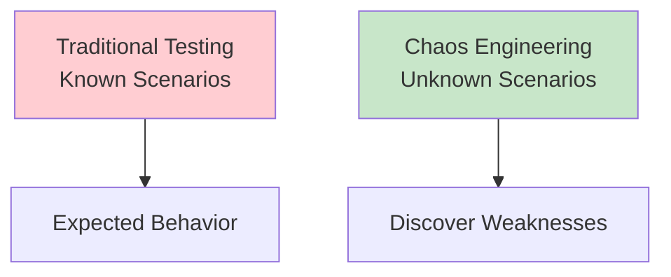
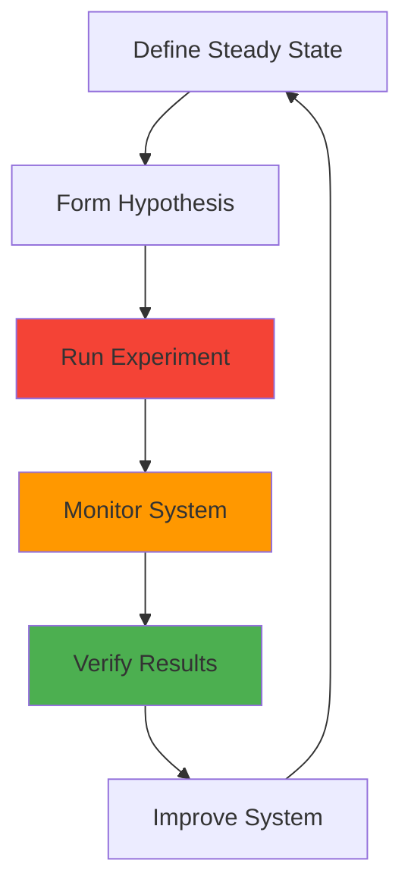
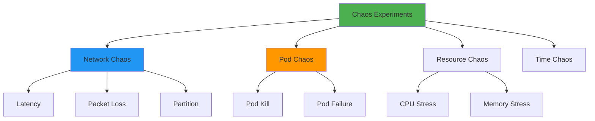

# Chaos Engineering

## Overview

Chaos Engineering is the discipline of experimenting on a system to build confidence in its capability to withstand turbulent conditions in production. It involves intentionally injecting failures to test system resilience, identify weaknesses, and improve reliability. This guide covers chaos engineering principles, tools, experiments, and best practices for building resilient systems.

## Deep Explanation

### What is Chaos Engineering?

Chaos Engineering is the practice of intentionally introducing failures into systems to test their resilience and identify weaknesses before they cause outages.

#### Chaos Engineering Principles

1. **Build Hypothesis**: Form hypothesis about system behavior
2. **Vary Real-World Events**: Test realistic failure scenarios
3. **Run in Production**: Test in production-like environments
4. **Automate Experiments**: Make experiments continuous
5. **Minimize Blast Radius**: Start small, expand gradually

#### Chaos Engineering vs Testing



**Testing**: Verifies known scenarios
**Chaos Engineering**: Discovers unknown weaknesses

### Chaos Engineering Process

#### 1. Steady State

Define normal system behavior:
- Request latency < 200ms
- Error rate < 0.1%
- CPU usage < 70%
- Memory usage < 80%

#### 2. Hypothesis

Form hypothesis about system behavior:
- "If we kill 10% of pods, system should continue serving traffic"
- "If database latency increases, circuit breaker should activate"
- "If network partition occurs, system should degrade gracefully"

#### 3. Experiment

Run controlled experiment:
- Inject failure
- Monitor system
- Measure impact

#### 4. Verify

Compare steady state to experiment results:
- Did system maintain steady state?
- What broke?
- How did system recover?

#### 5. Learn and Improve

Document findings and improve:
- Fix discovered issues
- Update runbooks
- Improve monitoring

### Types of Chaos Experiments

#### Network Chaos

**Latency Injection**:
```yaml
# Chaos Mesh network delay
apiVersion: chaos-mesh.org/v1alpha1
kind: NetworkChaos
metadata:
  name: network-delay
spec:
  action: delay
  mode: one
  selector:
    namespaces:
      - default
    labelSelectors:
      app: myapp
  delay:
    latency: "100ms"
    correlation: "100"
    jitter: "10ms"
  duration: "30s"
```

**Packet Loss**:
```yaml
apiVersion: chaos-mesh.org/v1alpha1
kind: NetworkChaos
metadata:
  name: packet-loss
spec:
  action: loss
  mode: one
  selector:
    labelSelectors:
      app: myapp
  loss:
    loss: "10%"
    correlation: "25"
  duration: "60s"
```

**Network Partition**:
```yaml
apiVersion: chaos-mesh.org/v1alpha1
kind: NetworkChaos
metadata:
  name: network-partition
spec:
  action: partition
  mode: one
  selector:
    labelSelectors:
      app: myapp
  direction: both
  duration: "2m"
```

#### Pod Chaos

**Pod Failure**:
```yaml
apiVersion: chaos-mesh.org/v1alpha1
kind: PodChaos
metadata:
  name: pod-failure
spec:
  action: pod-failure
  mode: one
  selector:
    namespaces:
      - default
    labelSelectors:
      app: myapp
  duration: "5m"
```

**Pod Kill**:
```yaml
apiVersion: chaos-mesh.org/v1alpha1
kind: PodChaos
metadata:
  name: pod-kill
spec:
  action: pod-kill
  mode: fixed-percent
  value: "10"
  selector:
    labelSelectors:
      app: myapp
  duration: "10m"
```

#### CPU Chaos

```yaml
apiVersion: chaos-mesh.org/v1alpha1
kind: StressChaos
metadata:
  name: cpu-stress
spec:
  mode: one
  selector:
    labelSelectors:
      app: myapp
  stressors:
    cpu:
      workers: 2
      load: 80
  duration: "5m"
```

#### Memory Chaos

```yaml
apiVersion: chaos-mesh.org/v1alpha1
kind: StressChaos
metadata:
  name: memory-stress
spec:
  mode: one
  selector:
    labelSelectors:
      app: myapp
  stressors:
    memory:
      workers: 1
      size: "512Mi"
  duration: "5m"
```

### Chaos Engineering Tools

#### Chaos Monkey

**Netflix Chaos Monkey**:
```json
{
  "enabled": true,
  "leashed": false,
  "minTime": "09:00",
  "maxTime": "17:00",
  "exceptions": [
    {
      "account": "prod",
      "region": "us-east-1",
      "group": "critical-service"
    }
  ]
}
```

#### Chaos Mesh

**Installation**:
```bash
# Install Chaos Mesh
curl -sSL https://mirrors.chaos-mesh.org/latest/install.sh | bash

# Verify installation
kubectl get pods -n chaos-mesh
```

**Example Experiment**:
```yaml
apiVersion: chaos-mesh.org/v1alpha1
kind: PodChaos
metadata:
  name: kill-pods
spec:
  action: pod-kill
  mode: fixed-percent
  value: "20"
  selector:
    namespaces:
      - production
    labelSelectors:
      app: web
  scheduler:
    cron: "@every 1h"
```

#### Litmus

**Installation**:
```bash
# Install Litmus
kubectl apply -f https://litmuschaos.github.io/litmus/litmus-operator-v2.14.0.yaml

# Install chaos experiments
kubectl apply -f https://hub.litmuschaos.io/api/chaos/master?file=charts/generic/experiments.yaml
```

**Example Experiment**:
```yaml
apiVersion: litmuschaos.io/v1alpha1
kind: ChaosEngine
metadata:
  name: pod-delete
spec:
  appinfo:
    appns: default
    applabel: app=myapp
    appkind: deployment
  chaosServiceAccount: litmus
  monitoring: true
  jobCleanUpPolicy: retain
  experiments:
    - name: pod-delete
      spec:
        components:
          env:
            - name: TOTAL_CHAOS_DURATION
              value: "60"
            - name: CHAOS_INTERVAL
              value: "10"
            - name: FORCE
              value: "false"
```

#### Gremlin

**Gremlin Attack**:
```python
from gremlin import Gremlin

client = Gremlin(
    team_id="your-team-id",
    api_key="your-api-key"
)

# CPU attack
attack = client.attacks.create(
    target={
        "type": "Random",
        "percent": 10
    },
    command={
        "type": "cpu",
        "cpuPercent": 80,
        "cores": 2
    },
    duration=300
)
```

### Chaos Engineering Experiments

#### Experiment 1: Pod Failure

**Hypothesis**: System can handle pod failures gracefully

**Experiment**:
```yaml
apiVersion: chaos-mesh.org/v1alpha1
kind: PodChaos
metadata:
  name: pod-failure-experiment
spec:
  action: pod-kill
  mode: fixed-percent
  value: "25"
  selector:
    labelSelectors:
      app: web
  duration: "10m"
```

**Metrics to Monitor**:
- Request latency
- Error rate
- Pod restart time
- Traffic distribution

#### Experiment 2: Network Latency

**Hypothesis**: System handles increased latency without errors

**Experiment**:
```yaml
apiVersion: chaos-mesh.org/v1alpha1
kind: NetworkChaos
metadata:
  name: latency-experiment
spec:
  action: delay
  mode: all
  selector:
    labelSelectors:
      app: api
  delay:
    latency: "500ms"
    jitter: "100ms"
  duration: "5m"
```

**Metrics to Monitor**:
- Request timeout rate
- Circuit breaker activation
- Retry behavior
- User experience

#### Experiment 3: Database Failure

**Hypothesis**: System degrades gracefully when database is unavailable

**Experiment**:
```yaml
apiVersion: chaos-mesh.org/v1alpha1
kind: PodChaos
metadata:
  name: db-failure
spec:
  action: pod-failure
  mode: one
  selector:
    labelSelectors:
      app: database
  duration: "2m"
```

**Metrics to Monitor**:
- Error rate
- Cache hit rate
- Fallback mechanisms
- Recovery time

### Chaos Engineering Best Practices

#### 1. Start Small

Begin with non-critical systems:
- Development environments
- Canary deployments
- Non-production workloads

#### 2. Define Blast Radius

Limit impact:
```yaml
# Start with 1% of traffic
value: "1"

# Gradually increase
value: "5"
value: "10"
value: "25"
```

#### 3. Monitor Everything

Set up comprehensive monitoring:
```python
# Monitor key metrics
metrics = {
    'latency': get_latency(),
    'error_rate': get_error_rate(),
    'throughput': get_throughput(),
    'cpu_usage': get_cpu_usage(),
    'memory_usage': get_memory_usage()
}

# Alert on anomalies
if metrics['error_rate'] > 0.05:
    send_alert('High error rate during chaos experiment')
```

#### 4. Have Rollback Plan

Always be able to stop:
```python
def run_chaos_experiment(experiment):
    try:
        start_experiment(experiment)
        monitor_metrics()
        
        if metrics_exceed_threshold():
            stop_experiment(experiment)
            rollback_changes()
    except Exception as e:
        stop_experiment(experiment)
        rollback_changes()
        raise e
```

#### 5. Document Everything

Record experiments:
```markdown
# Chaos Experiment Report

## Experiment: Pod Failure
**Date**: 2024-01-15
**Duration**: 10 minutes
**Blast Radius**: 25% of pods

## Hypothesis
System can handle 25% pod failure without impact.

## Results
- Latency increased by 50ms
- Error rate remained < 0.1%
- Pods restarted within 30s
- Traffic redistributed automatically

## Findings
- System handled failure gracefully
- Auto-scaling worked correctly
- No user impact detected

## Action Items
- [ ] Improve pod restart time
- [ ] Add more monitoring
```

### Game Days

#### What is a Game Day?

Game Day is a planned event where teams intentionally break systems to test response procedures.

#### Game Day Structure

1. **Planning**: Define scenarios and objectives
2. **Execution**: Run chaos experiments
3. **Response**: Teams respond to incidents
4. **Review**: Post-mortem and improvements

#### Example Game Day Scenario

```markdown
# Game Day Scenario: Database Failure

## Scenario
Primary database becomes unavailable for 30 minutes.

## Objectives
1. Test failover to secondary database
2. Verify application continues serving traffic
3. Test team response procedures
4. Measure recovery time

## Execution
1. Stop primary database pod
2. Monitor system behavior
3. Verify failover
4. Restore primary database
5. Verify switchback

## Success Criteria
- Failover completes within 5 minutes
- Error rate < 1%
- No data loss
- Team responds within 15 minutes
```

## Diagrams

### Chaos Engineering Process



### Chaos Experiment Types



## Real Code Examples

### Complete Chaos Experiment Framework

```python
# chaos_framework.py
import time
import kubernetes
from prometheus_client import Counter, Histogram
from typing import Dict, List

class ChaosExperiment:
    def __init__(self, name: str, hypothesis: str):
        self.name = name
        self.hypothesis = hypothesis
        self.metrics_before = {}
        self.metrics_during = {}
        self.metrics_after = {}
    
    def define_steady_state(self) -> Dict:
        """Define normal system behavior"""
        return {
            'latency_p95': 200,  # ms
            'error_rate': 0.001,  # 0.1%
            'cpu_usage': 0.70,  # 70%
            'memory_usage': 0.80  # 80%
        }
    
    def measure_steady_state(self) -> Dict:
        """Measure current system state"""
        return {
            'latency_p95': self.get_latency_p95(),
            'error_rate': self.get_error_rate(),
            'cpu_usage': self.get_cpu_usage(),
            'memory_usage': self.get_memory_usage()
        }
    
    def run_experiment(self, duration: int = 300):
        """Run chaos experiment"""
        print(f"Running experiment: {self.name}")
        print(f"Hypothesis: {self.hypothesis}")
        
        # Measure steady state
        self.metrics_before = self.measure_steady_state()
        print(f"Steady state: {self.metrics_before}")
        
        # Inject failure
        self.inject_failure()
        
        # Monitor during experiment
        start_time = time.time()
        while time.time() - start_time < duration:
            metrics = self.measure_steady_state()
            self.metrics_during.append(metrics)
            time.sleep(10)
        
        # Stop failure
        self.stop_failure()
        
        # Measure after experiment
        time.sleep(30)  # Wait for recovery
        self.metrics_after = self.measure_steady_state()
        
        # Verify results
        self.verify_results()
    
    def verify_results(self):
        """Verify experiment results"""
        steady_state = self.define_steady_state()
        
        # Check if system maintained steady state
        violations = []
        
        if self.metrics_after['latency_p95'] > steady_state['latency_p95'] * 2:
            violations.append('Latency exceeded threshold')
        
        if self.metrics_after['error_rate'] > steady_state['error_rate'] * 10:
            violations.append('Error rate exceeded threshold')
        
        if violations:
            print(f"❌ Experiment failed: {violations}")
        else:
            print("✅ System maintained steady state")
    
    def inject_failure(self):
        """Inject failure - to be implemented by subclasses"""
        raise NotImplementedError
    
    def stop_failure(self):
        """Stop failure - to be implemented by subclasses"""
        raise NotImplementedError
    
    def get_latency_p95(self) -> float:
        """Get p95 latency"""
        # Implementation
        pass
    
    def get_error_rate(self) -> float:
        """Get error rate"""
        # Implementation
        pass
    
    def get_cpu_usage(self) -> float:
        """Get CPU usage"""
        # Implementation
        pass
    
    def get_memory_usage(self) -> float:
        """Get memory usage"""
        # Implementation
        pass


class PodKillExperiment(ChaosExperiment):
    def __init__(self, selector: Dict, percent: int = 10):
        super().__init__(
            name="Pod Kill",
            hypothesis=f"System can handle {percent}% pod failure"
        )
        self.selector = selector
        self.percent = percent
        self.k8s_client = kubernetes.client.CoreV1Api()
    
    def inject_failure(self):
        """Kill pods"""
        pods = self.k8s_client.list_pod_for_all_namespaces(
            label_selector=self.selector
        )
        
        num_to_kill = int(len(pods.items) * self.percent / 100)
        pods_to_kill = pods.items[:num_to_kill]
        
        for pod in pods_to_kill:
            self.k8s_client.delete_namespaced_pod(
                name=pod.metadata.name,
                namespace=pod.metadata.namespace
            )
            print(f"Killed pod: {pod.metadata.name}")
    
    def stop_failure(self):
        """Pods will be recreated automatically"""
        print("Waiting for pods to recover...")


# Run experiment
if __name__ == '__main__':
    experiment = PodKillExperiment(
        selector={'app': 'web'},
        percent=25
    )
    experiment.run_experiment(duration=600)
```

### Automated Chaos Testing

```yaml
# chaos-test.yaml
apiVersion: batch/v1
kind: CronJob
metadata:
  name: chaos-tests
spec:
  schedule: "0 2 * * *"  # Daily at 2 AM
  jobTemplate:
    spec:
      template:
        spec:
          containers:
          - name: chaos-runner
            image: chaos-runner:latest
            command:
            - python
            - /app/run_experiments.py
            env:
            - name: EXPERIMENT_TYPE
              value: "pod-kill"
            - name: BLAST_RADIUS
              value: "10"
            - name: DURATION
              value: "300"
          restartPolicy: OnFailure
```

## Hard Use-Case: Testing Disaster Recovery

### Problem

Verify disaster recovery procedures work correctly.

### Solution: Chaos Engineering for DR

```python
class DisasterRecoveryTest(ChaosExperiment):
    def __init__(self):
        super().__init__(
            name="Disaster Recovery",
            hypothesis="System can recover from complete region failure"
        )
    
    def inject_failure(self):
        """Simulate region failure"""
        # Stop all pods in region
        # Block network traffic
        # Stop database
        print("Simulating region failure...")
    
    def verify_results(self):
        """Verify DR procedures"""
        # Check failover to secondary region
        # Verify data replication
        # Check RTO/RPO targets
        print("Verifying disaster recovery...")
```

## Edge Cases and Pitfalls

### 1. Too Aggressive Experiments

**Problem**: Causing real outages

**Solution**: Start small, increase gradually

```python
# Start with 1%
blast_radius = 0.01

# Gradually increase
if successful:
    blast_radius = 0.05
if successful:
    blast_radius = 0.10
```

### 2. Not Monitoring

**Problem**: Don't know what broke

**Solution**: Comprehensive monitoring

```python
# Monitor key metrics
metrics = {
    'latency': monitor_latency(),
    'errors': monitor_errors(),
    'throughput': monitor_throughput()
}
```

### 3. No Rollback Plan

**Problem**: Can't stop experiment

**Solution**: Always have stop mechanism

```python
def run_experiment():
    try:
        start_experiment()
        monitor()
    except Exception:
        stop_experiment()
        rollback()
```

## References and Further Reading

- [Chaos Engineering Book](https://www.oreilly.com/library/view/chaos-engineering/9781491988459/) - Comprehensive guide
- [Chaos Mesh](https://chaos-mesh.org/) - Chaos engineering platform
- [Principles of Chaos Engineering](https://principlesofchaos.org/) - Core principles

## Quiz

### Question 1
What is chaos engineering?

**A)** Breaking systems randomly  
**B)** Intentionally testing system resilience  
**C)** Fixing broken systems  
**D)** Monitoring systems

**Answer: B** - Chaos engineering involves intentionally injecting failures to test and improve system resilience.

### Question 2
What is the first step in chaos engineering?

**A)** Inject failure  
**B)** Define steady state  
**C)** Monitor system  
**D)** Fix issues

**Answer: B** - The first step is to define steady state (normal system behavior) to compare against.

### Question 3
Where should you start chaos experiments?

**A)** Production immediately  
**B)** Non-critical systems first  
**C)** Never  
**D)** Only in development

**Answer: B** - Start with non-critical systems and gradually expand to production.

### Question 4
What is a Game Day?

**A)** A holiday  
**B)** Planned chaos engineering event  
**C)** A tool  
**D)** A metric

**Answer: B** - Game Day is a planned event where teams intentionally break systems to test response procedures.

### Question 5
What should you always have for chaos experiments?

**A)** No monitoring  
**B)** Rollback plan  
**C)** No limits  
**D)** Random failures

**Answer: B** - Always have a rollback plan to stop experiments if they cause issues.

## Related Topics

- [Site Reliability Engineering (SRE)](../04_overachiever/01.%20Site%20Reliability%20Engineering%20(SRE).md) - Reliability practices
- [Monitoring & Observability](../02_intermediate/04.%20Monitoring%20%26%20Observability.md) - Observability
- [Kubernetes Fundamentals](../02_intermediate/01.%20Kubernetes%20Fundamentals.md) - K8s chaos

