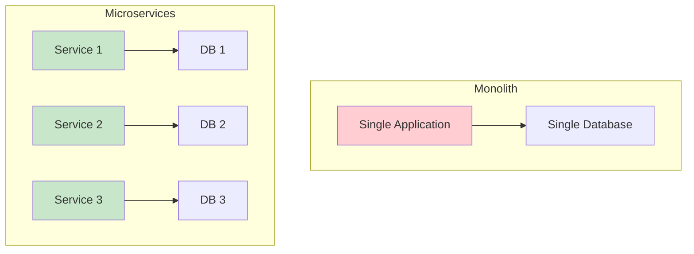
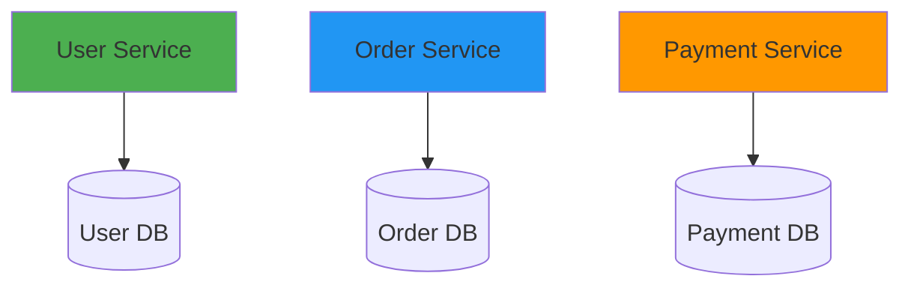
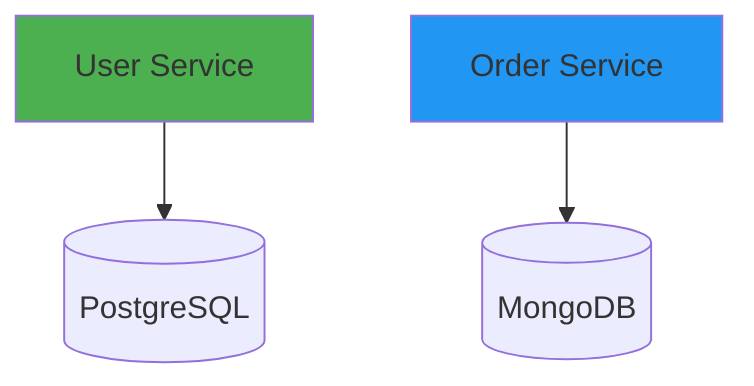
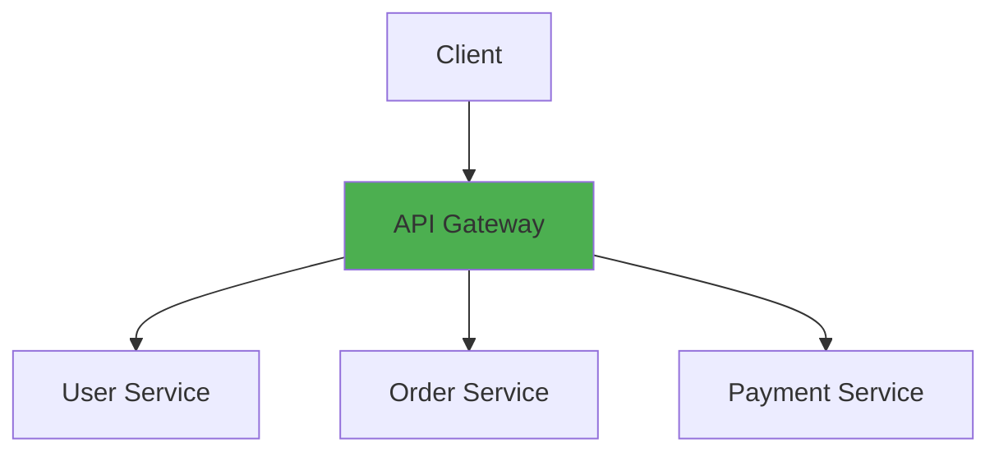
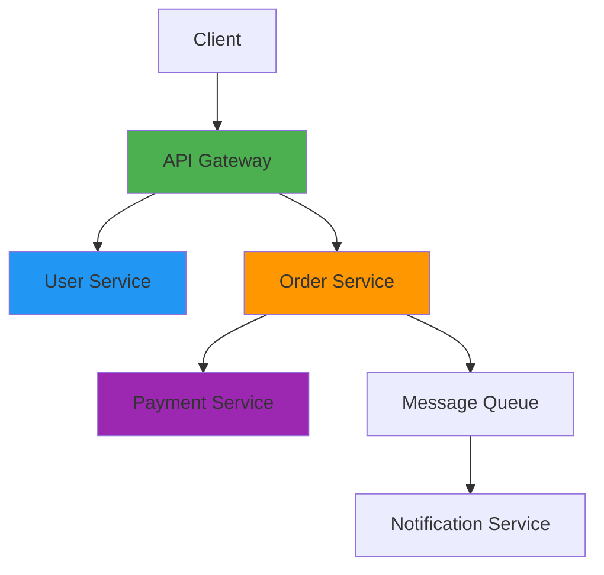
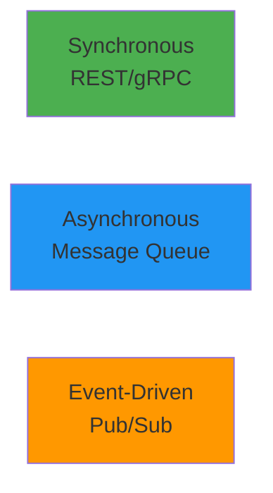

# Microservices Architecture

## Overview

Microservices architecture is an approach to building applications as a collection of small, independent services that communicate over well-defined APIs. This guide covers microservices principles, service design, communication patterns, data management, deployment strategies, and operational challenges in distributed systems.

## Deep Explanation

### What are Microservices?

Microservices are small, independent services that work together to form a complete application.

#### Monolith vs Microservices



**Monolith**:
- Single codebase
- Single database
- Deploy together
- Scale together

**Microservices**:
- Multiple services
- Independent databases
- Deploy independently
- Scale independently

### Microservices Principles

#### 1. Single Responsibility

Each service has one clear purpose.

**Example**:
- User Service: User management
- Order Service: Order processing
- Payment Service: Payment handling

#### 2. Autonomous Services

Services are independent:
- Own database
- Own deployment
- Own team

#### 3. Decentralized Data Management

Each service manages its own data.



#### 4. API-First Design

Services communicate via APIs.

#### 5. Failure Isolation

Failures in one service don't cascade.

### Service Communication

#### Synchronous Communication

**REST API**:
```python
# User Service
from flask import Flask, jsonify

app = Flask(__name__)

@app.route('/api/users/<user_id>')
def get_user(user_id):
    user = db.get_user(user_id)
    return jsonify(user)

# Order Service calling User Service
import requests

def get_user_info(user_id):
    response = requests.get(f'http://user-service/api/users/{user_id}')
    return response.json()
```

**gRPC**:
```protobuf
// user.proto
syntax = "proto3";

service UserService {
  rpc GetUser(UserRequest) returns (UserResponse);
}

message UserRequest {
  string user_id = 1;
}

message UserResponse {
  string id = 1;
  string name = 2;
  string email = 3;
}
```

#### Asynchronous Communication

**Message Queue**:
```python
# Publisher
import pika

connection = pika.BlockingConnection(pika.ConnectionParameters('localhost'))
channel = connection.channel()
channel.queue_declare(queue='orders')

channel.basic_publish(
    exchange='',
    routing_key='orders',
    body='{"order_id": "123", "user_id": "456"}'
)

# Consumer
def callback(ch, method, properties, body):
    order = json.loads(body)
    process_order(order)

channel.basic_consume(
    queue='orders',
    on_message_callback=callback,
    auto_ack=True
)
channel.start_consuming()
```

**Event-Driven**:
```python
# Event publisher
from events import EventPublisher

publisher = EventPublisher()

def create_order(order_data):
    order = save_order(order_data)
    publisher.publish('order.created', {
        'order_id': order.id,
        'user_id': order.user_id,
        'amount': order.amount
    })
    return order

# Event subscriber
@publisher.subscribe('order.created')
def handle_order_created(event):
    # Process payment
    process_payment(event['order_id'], event['amount'])
```

### Data Management

#### Database per Service

**Pattern**:


**Benefits**:
- Technology diversity
- Independent scaling
- Data isolation

**Challenges**:
- Distributed transactions
- Data consistency
- Cross-service queries

#### Saga Pattern

**Choreography**:
```python
# Order Service
def create_order(order_data):
    order = save_order(order_data)
    publish_event('order.created', order)
    return order

# Payment Service
@subscribe('order.created')
def reserve_payment(event):
    payment = reserve_payment(event.order_id, event.amount)
    publish_event('payment.reserved', payment)

# Inventory Service
@subscribe('order.created')
def reserve_inventory(event):
    inventory = reserve_items(event.order_id, event.items)
    publish_event('inventory.reserved', inventory)

# Order Service
@subscribe(['payment.reserved', 'inventory.reserved'])
def confirm_order(events):
    if all_events_received(events):
        confirm_order(order_id)
```

**Orchestration**:
```python
# Order Orchestrator
class OrderOrchestrator:
    def create_order(self, order_data):
        try:
            # Step 1: Create order
            order = self.order_service.create_order(order_data)
            
            # Step 2: Reserve payment
            payment = self.payment_service.reserve_payment(order.id, order.amount)
            
            # Step 3: Reserve inventory
            inventory = self.inventory_service.reserve_items(order.id, order.items)
            
            # Step 4: Confirm order
            self.order_service.confirm_order(order.id)
            
            return order
        except Exception as e:
            # Compensate
            self.compensate(order.id)
            raise e
    
    def compensate(self, order_id):
        self.payment_service.cancel_reservation(order_id)
        self.inventory_service.release_items(order_id)
        self.order_service.cancel_order(order_id)
```

### Service Discovery

#### Client-Side Discovery

```python
# Service Registry
class ServiceRegistry:
    def __init__(self):
        self.services = {}
    
    def register(self, service_name, instance):
        if service_name not in self.services:
            self.services[service_name] = []
        self.services[service_name].append(instance)
    
    def discover(self, service_name):
        instances = self.services.get(service_name, [])
        return random.choice(instances) if instances else None

# Client
registry = ServiceRegistry()
user_service = registry.discover('user-service')
response = requests.get(f'http://{user_service}/api/users/123')
```

#### Server-Side Discovery

```yaml
# Kubernetes Service
apiVersion: v1
kind: Service
metadata:
  name: user-service
spec:
  selector:
    app: user-service
  ports:
  - port: 80
    targetPort: 8080
```

**Client**:
```python
# Client uses service name
response = requests.get('http://user-service/api/users/123')
```

### API Gateway Pattern



**Benefits**:
- Single entry point
- Centralized cross-cutting concerns
- Simplified client

### Deployment Strategies

#### Blue-Green Deployment

```yaml
# Blue deployment
apiVersion: apps/v1
kind: Deployment
metadata:
  name: user-service-blue
spec:
  replicas: 3
  template:
    metadata:
      labels:
        app: user-service
        version: blue
    spec:
      containers:
      - name: user-service
        image: user-service:v1.0.0

---
# Green deployment
apiVersion: apps/v1
kind: Deployment
metadata:
  name: user-service-green
spec:
  replicas: 3
  template:
    metadata:
      labels:
        app: user-service
        version: green
    spec:
      containers:
      - name: user-service
        image: user-service:v1.1.0

---
# Service switches between blue/green
apiVersion: v1
kind: Service
metadata:
  name: user-service
spec:
  selector:
    app: user-service
    version: blue  # Switch to green for new version
```

#### Canary Deployment

```yaml
# Stable deployment
apiVersion: apps/v1
kind: Deployment
metadata:
  name: user-service-stable
spec:
  replicas: 9
  template:
    metadata:
      labels:
        app: user-service
        version: stable
    spec:
      containers:
      - name: user-service
        image: user-service:v1.0.0

---
# Canary deployment
apiVersion: apps/v1
kind: Deployment
metadata:
  name: user-service-canary
spec:
  replicas: 1
  template:
    metadata:
      labels:
        app: user-service
        version: canary
    spec:
      containers:
      - name: user-service
        image: user-service:v1.1.0
```

### Observability

#### Distributed Tracing

```python
# OpenTelemetry tracing
from opentelemetry import trace
from opentelemetry.sdk.trace import TracerProvider
from opentelemetry.sdk.trace.export import ConsoleSpanExporter

trace.set_tracer_provider(TracerProvider())
tracer = trace.get_tracer(__name__)

def process_order(order_id):
    with tracer.start_as_current_span("process_order") as span:
        span.set_attribute("order.id", order_id)
        
        # Call user service
        with tracer.start_as_current_span("get_user") as user_span:
            user = get_user(order_id)
            user_span.set_attribute("user.id", user.id)
        
        # Call payment service
        with tracer.start_as_current_span("process_payment") as payment_span:
            payment = process_payment(order_id)
            payment_span.set_attribute("payment.id", payment.id)
```

#### Service Mesh

```yaml
# Istio VirtualService
apiVersion: networking.istio.io/v1beta1
kind: VirtualService
metadata:
  name: user-service
spec:
  hosts:
  - user-service
  http:
  - route:
    - destination:
        host: user-service
        subset: v1
      weight: 90
    - destination:
        host: user-service
        subset: v2
      weight: 10
```

## Diagrams

### Microservices Architecture



### Service Communication Patterns



## Real Code Examples

### Complete Microservice Example

**User Service**:
```python
# user_service.py
from flask import Flask, jsonify, request
from flask_sqlalchemy import SQLAlchemy
import requests

app = Flask(__name__)
app.config['SQLALCHEMY_DATABASE_URI'] = 'postgresql://user:pass@db/userdb'
db = SQLAlchemy(app)

class User(db.Model):
    id = db.Column(db.Integer, primary_key=True)
    name = db.Column(db.String(100))
    email = db.Column(db.String(100))

@app.route('/api/users/<user_id>', methods=['GET'])
def get_user(user_id):
    user = User.query.get(user_id)
    if user:
        return jsonify({
            'id': user.id,
            'name': user.name,
            'email': user.email
        })
    return jsonify({'error': 'User not found'}), 404

@app.route('/api/users', methods=['POST'])
def create_user():
    data = request.json
    user = User(name=data['name'], email=data['email'])
    db.session.add(user)
    db.session.commit()
    
    # Publish event
    publish_event('user.created', {
        'user_id': user.id,
        'name': user.name
    })
    
    return jsonify({'id': user.id}), 201

if __name__ == '__main__':
    app.run(host='0.0.0.0', port=8080)
```

**Order Service**:
```python
# order_service.py
from flask import Flask, jsonify, request
import requests
import pika

app = Flask(__name__)

ORDER_SERVICE_URL = 'http://order-service:8080'
USER_SERVICE_URL = 'http://user-service:8080'
PAYMENT_SERVICE_URL = 'http://payment-service:8080'

def get_user(user_id):
    response = requests.get(f'{USER_SERVICE_URL}/api/users/{user_id}')
    return response.json() if response.status_code == 200 else None

def process_payment(order_id, amount):
    response = requests.post(
        f'{PAYMENT_SERVICE_URL}/api/payments',
        json={'order_id': order_id, 'amount': amount}
    )
    return response.json() if response.status_code == 200 else None

@app.route('/api/orders', methods=['POST'])
def create_order():
    data = request.json
    user_id = data['user_id']
    
    # Verify user exists
    user = get_user(user_id)
    if not user:
        return jsonify({'error': 'User not found'}), 404
    
    # Create order
    order = {
        'id': generate_id(),
        'user_id': user_id,
        'items': data['items'],
        'amount': calculate_total(data['items'])
    }
    
    # Process payment
    payment = process_payment(order['id'], order['amount'])
    if not payment:
        return jsonify({'error': 'Payment failed'}), 400
    
    # Save order
    save_order(order)
    
    # Publish event
    publish_event('order.created', order)
    
    return jsonify(order), 201

if __name__ == '__main__':
    app.run(host='0.0.0.0', port=8080)
```

### Kubernetes Microservices Deployment

```yaml
# user-service deployment
apiVersion: apps/v1
kind: Deployment
metadata:
  name: user-service
spec:
  replicas: 3
  selector:
    matchLabels:
      app: user-service
  template:
    metadata:
      labels:
        app: user-service
    spec:
      containers:
      - name: user-service
        image: user-service:latest
        ports:
        - containerPort: 8080
        env:
        - name: DATABASE_URL
          valueFrom:
            secretKeyRef:
              name: user-db-secret
              key: url
        livenessProbe:
          httpGet:
            path: /health
            port: 8080
        readinessProbe:
          httpGet:
            path: /ready
            port: 8080

---
apiVersion: v1
kind: Service
metadata:
  name: user-service
spec:
  selector:
    app: user-service
  ports:
  - port: 80
    targetPort: 8080
```

## Hard Use-Case: Migrating Monolith to Microservices

### Problem

Migrate monolithic application to microservices.

### Solution: Strangler Fig Pattern

**Phase 1: Extract First Service**:
```python
# Extract user service
# Keep monolith running
# Route user requests to new service
```

**Phase 2: Gradually Extract**:
```python
# Extract order service
# Extract payment service
# Continue until monolith is empty
```

**Phase 3: Remove Monolith**:
```python
# All services extracted
# Remove monolith
```

## Edge Cases and Pitfalls

### 1. Distributed Transactions

**Problem**: Maintaining consistency across services

**Solution**: Use Saga pattern

```python
# Saga orchestration
def create_order_saga(order_data):
    try:
        order = create_order(order_data)
        reserve_payment(order.id)
        reserve_inventory(order.id)
        confirm_order(order.id)
    except Exception:
        compensate(order.id)
```

### 2. Service Coupling

**Problem**: Services too tightly coupled

**Solution**: API versioning and contracts

```yaml
# Version APIs
/api/v1/users
/api/v2/users
```

### 3. Data Consistency

**Problem**: Eventual consistency challenges

**Solution**: Accept eventual consistency, use events

```python
# Eventual consistency
# User created event
# Eventually consistent across services
```

## References and Further Reading

- [Microservices Patterns](https://microservices.io/patterns/) - Microservices patterns
- [Building Microservices](https://www.oreilly.com/library/view/building-microservices/9781491950340/) - Comprehensive guide
- [Microservices Architecture](https://martinfowler.com/articles/microservices.html) - Martin Fowler's article

## Quiz

### Question 1
What is a microservice?

**A)** A large application  
**B)** A small, independent service  
**C)** A database  
**D)** A programming language

**Answer: B** - A microservice is a small, independent service that works with other services to form a complete application.

### Question 2
What is the database per service pattern?

**A)** Shared database  
**B)** Each service has its own database  
**C)** No database  
**D)** Single database for all

**Answer: B** - Database per service means each service manages its own database, ensuring data isolation and independence.

### Question 3
What is the Saga pattern used for?

**A)** Managing distributed transactions  
**B)** Storing data  
**C)** Routing requests  
**D)** Authentication

**Answer: A** - Saga pattern manages distributed transactions across multiple services without traditional ACID transactions.

### Question 4
What is service discovery?

**A)** Finding services automatically  
**B)** Creating services  
**C)** Deleting services  
**D)** Updating services

**Answer: A** - Service discovery automatically finds and connects to service instances in a distributed system.

### Question 5
What is the API Gateway pattern?

**A)** Multiple entry points  
**B)** Single entry point for all services  
**C)** No gateway  
**D)** Database gateway

**Answer: B** - API Gateway provides a single entry point that routes requests to appropriate backend services.

## Related Topics

- [Kubernetes Fundamentals](../02_intermediate/01.%20Kubernetes%20Fundamentals.md) - Container orchestration
- [Service Mesh Fundamentals](./02.%20Service%20Mesh%20Fundamentals.md) - Service communication
- [API Gateway Fundamentals](../02_intermediate/12.%20API%20Gateway%20Fundamentals.md) - API management

