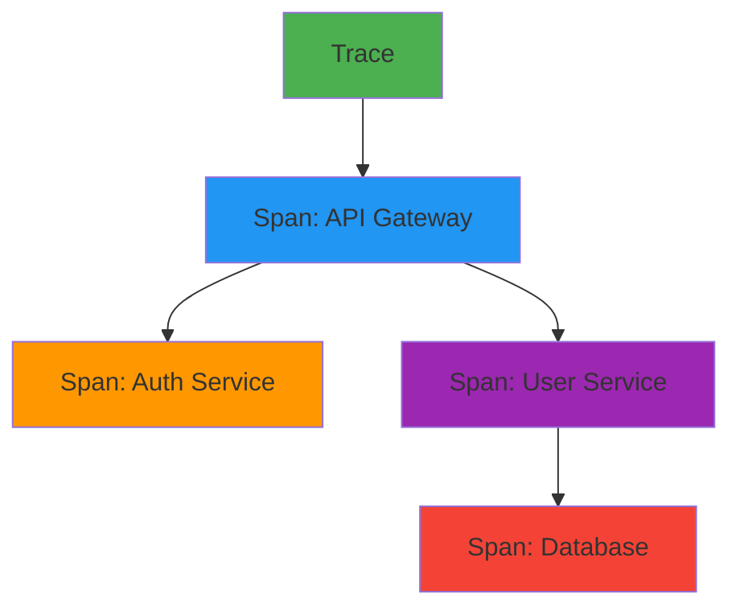
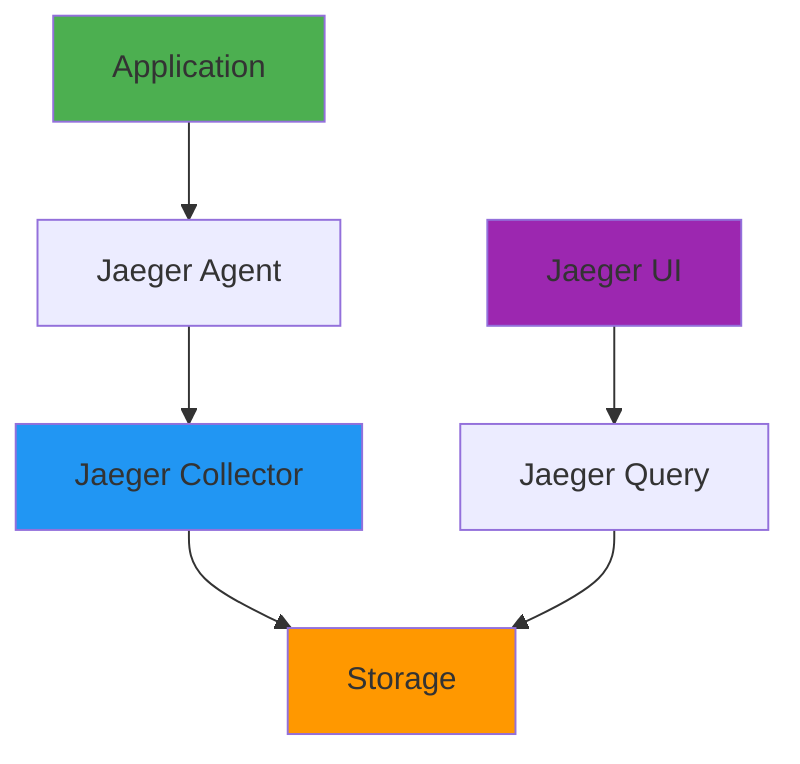
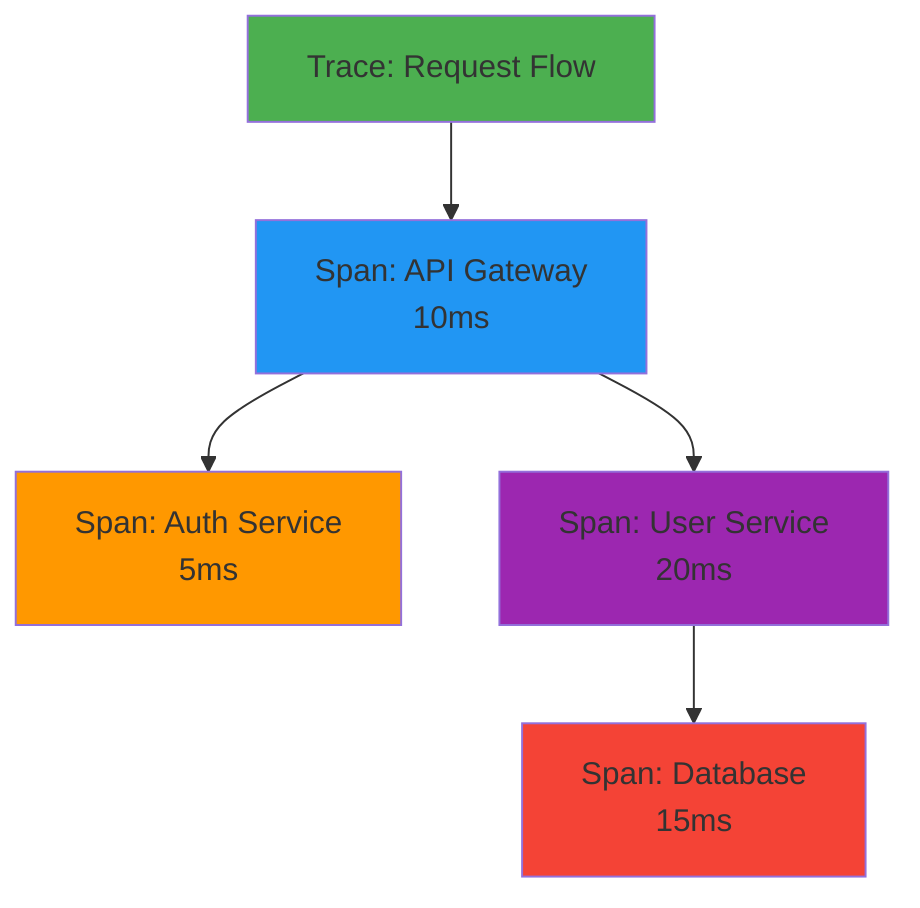
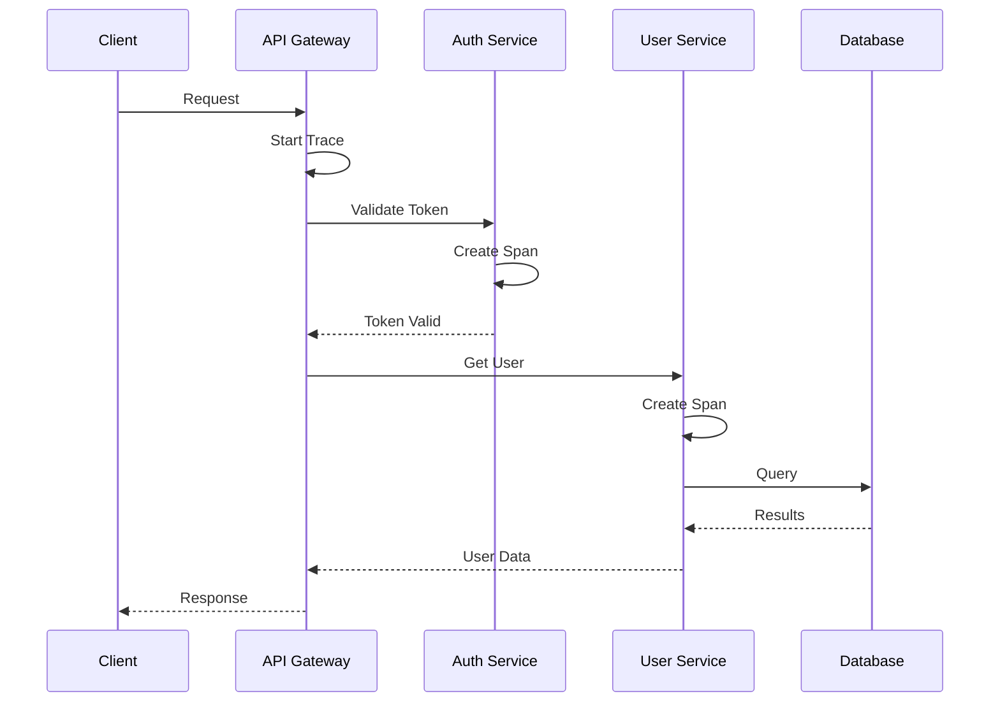

# Distributed Tracing

## Overview

Distributed tracing is a method for tracking requests as they flow through multiple services in a microservices architecture. It provides visibility into system behavior, helps identify bottlenecks, and enables debugging of complex distributed systems. This guide covers OpenTelemetry, Jaeger, Zipkin, trace instrumentation, and tracing patterns for production systems.

## Deep Explanation

### What is Distributed Tracing?

Distributed tracing follows a request as it travels through multiple services, creating a trace that shows the complete request flow.

#### Trace Components

**Trace**: Complete request flow
**Span**: Single operation in a trace
**Context**: Propagation information



### OpenTelemetry

#### What is OpenTelemetry?

OpenTelemetry is a vendor-neutral observability framework for generating, collecting, and exporting telemetry data.

#### OpenTelemetry Components

- **API**: Language-specific APIs
- **SDK**: Implementation
- **Instrumentation**: Auto-instrumentation libraries
- **Collector**: Receives and processes telemetry
- **Exporters**: Send to backends (Jaeger, Zipkin, etc.)

#### Installing OpenTelemetry

**Python**:
```bash
pip install opentelemetry-api
pip install opentelemetry-sdk
pip install opentelemetry-instrumentation-flask
pip install opentelemetry-exporter-jaeger
```

**Node.js**:
```bash
npm install @opentelemetry/api
npm install @opentelemetry/sdk-node
npm install @opentelemetry/instrumentation-http
npm install @opentelemetry/exporter-jaeger
```

#### Basic Instrumentation

**Python**:
```python
from opentelemetry import trace
from opentelemetry.sdk.trace import TracerProvider
from opentelemetry.sdk.trace.export import BatchSpanProcessor
from opentelemetry.exporter.jaeger import JaegerExporter
from opentelemetry.sdk.resources import Resource

# Setup
resource = Resource.create({"service.name": "my-service"})
trace.set_tracer_provider(TracerProvider(resource=resource))
tracer = trace.get_tracer(__name__)

# Export to Jaeger
jaeger_exporter = JaegerExporter(
    agent_host_name="localhost",
    agent_port=6831
)
trace.get_tracer_provider().add_span_processor(
    BatchSpanProcessor(jaeger_exporter)
)

# Create span
def process_request(request_id):
    with tracer.start_as_current_span("process_request") as span:
        span.set_attribute("request.id", request_id)
        span.set_attribute("http.method", "GET")
        
        # Nested span
        with tracer.start_as_current_span("database_query") as db_span:
            db_span.set_attribute("db.query", "SELECT * FROM users")
            result = query_database()
            db_span.set_attribute("db.rows", len(result))
        
        return result
```

**Node.js**:
```javascript
const { NodeTracerProvider } = require('@opentelemetry/sdk-trace-node');
const { JaegerExporter } = require('@opentelemetry/exporter-jaeger');
const { BatchSpanProcessor } = require('@opentelemetry/sdk-trace-base');
const { trace } = require('@opentelemetry/api');

// Setup
const provider = new NodeTracerProvider();
const exporter = new JaegerExporter({
  endpoint: 'http://localhost:14268/api/traces'
});
provider.addSpanProcessor(new BatchSpanProcessor(exporter));
provider.register();

// Create span
const tracer = trace.getTracer('my-service');

function processRequest(requestId) {
  return tracer.startActiveSpan('process_request', (span) => {
    span.setAttribute('request.id', requestId);
    span.setAttribute('http.method', 'GET');
    
    // Nested span
    return tracer.startActiveSpan('database_query', (dbSpan) => {
      dbSpan.setAttribute('db.query', 'SELECT * FROM users');
      const result = queryDatabase();
      dbSpan.setAttribute('db.rows', result.length);
      dbSpan.end();
      return result;
    }, () => {
      span.end();
    });
  });
}
```

### Jaeger

#### What is Jaeger?

Jaeger is an open-source distributed tracing system.

#### Installing Jaeger

**Docker**:
```bash
docker run -d --name jaeger \
  -p 16686:16686 \
  -p 14268:14268 \
  -p 6831:6831/udp \
  jaegertracing/all-in-one:latest
```

**Kubernetes**:
```yaml
apiVersion: apps/v1
kind: Deployment
metadata:
  name: jaeger
spec:
  replicas: 1
  template:
    spec:
      containers:
      - name: jaeger
        image: jaegertracing/all-in-one:latest
        ports:
        - containerPort: 16686
        - containerPort: 14268
        - containerPort: 6831
          protocol: UDP
```

#### Jaeger Architecture



### Zipkin

#### What is Zipkin?

Zipkin is a distributed tracing system.

#### Installing Zipkin

**Docker**:
```bash
docker run -d -p 9411:9411 openzipkin/zipkin
```

**Instrumentation**:
```python
from py_zipkin.zipkin import zipkin_span
from py_zipkin.transport import BaseTransportHandler

class HttpTransport(BaseTransportHandler):
    def get_max_payload_bytes(self):
        return None
    
    def send(self, encoded_span):
        requests.post(
            'http://localhost:9411/api/v2/spans',
            data=encoded_span,
            headers={'Content-Type': 'application/x-thrift'}
        )

@zipkin_span(service_name='my-service', span_name='process_request')
def process_request(request_id):
    # Your code
    pass
```

### Trace Context Propagation

#### W3C Trace Context

**HTTP Headers**:
```
traceparent: 00-4bf92f3577b34da6a3ce929d0e0e4736-00f067aa0ba902b7-01
tracestate: congo=t61rcWkgMzE
```

**Propagation**:
```python
from opentelemetry import trace
from opentelemetry.propagate import inject, extract
from opentelemetry.trace.propagation.tracecontext import TraceContextTextMapPropagator

propagator = TraceContextTextMapPropagator()

# Inject context
def make_request(url):
    with tracer.start_as_current_span("http_request") as span:
        headers = {}
        inject(headers)
        response = requests.get(url, headers=headers)
        return response

# Extract context
def handle_request(request):
    context = extract(request.headers)
    with tracer.start_as_current_span("handle_request", context=context):
        # Process request
        pass
```

### Instrumentation Patterns

#### Auto-Instrumentation

**Flask**:
```python
from opentelemetry.instrumentation.flask import FlaskInstrumentor
from flask import Flask

app = Flask(__name__)
FlaskInstrumentor().instrument_app(app)
```

**Express**:
```javascript
const { NodeTracerProvider } = require('@opentelemetry/sdk-trace-node');
const { HttpInstrumentation } = require('@opentelemetry/instrumentation-http');
const { ExpressInstrumentation } = require('@opentelemetry/instrumentation-express');

const provider = new NodeTracerProvider();
provider.addSpanProcessor(new BatchSpanProcessor(new JaegerExporter()));
provider.register();

const httpInstrumentation = new HttpInstrumentation();
const expressInstrumentation = new ExpressInstrumentation();
```

#### Manual Instrumentation

**Custom Spans**:
```python
from opentelemetry import trace

tracer = trace.get_tracer(__name__)

def complex_operation():
    with tracer.start_as_current_span("complex_operation") as span:
        span.set_attribute("operation.type", "batch")
        
        # Step 1
        with tracer.start_as_current_span("step_1") as step1:
            result1 = do_step_1()
            step1.set_attribute("step1.result", result1)
        
        # Step 2
        with tracer.start_as_current_span("step_2") as step2:
            result2 = do_step_2(result1)
            step2.set_attribute("step2.result", result2)
        
        span.set_attribute("operation.success", True)
        return result2
```

### Trace Analysis

#### Finding Slow Operations

**Jaeger Query**:
```bash
# Find traces with duration > 1s
duration > 1s

# Find traces with errors
tags.error=true

# Find traces for specific service
service.name="user-service"
```

#### Performance Analysis

**Identifying Bottlenecks**:
```python
# Add timing information
with tracer.start_as_current_span("database_query") as span:
    start_time = time.time()
    result = query_database()
    duration = time.time() - start_time
    
    span.set_attribute("db.duration", duration)
    if duration > 1.0:
        span.set_attribute("db.slow", True)
```

### Complete Tracing Setup

```python
# tracing.py
from opentelemetry import trace
from opentelemetry.sdk.trace import TracerProvider
from opentelemetry.sdk.trace.export import BatchSpanProcessor, ConsoleSpanExporter
from opentelemetry.exporter.jaeger import JaegerExporter
from opentelemetry.sdk.resources import Resource
from opentelemetry.instrumentation.flask import FlaskInstrumentor
from opentelemetry.instrumentation.requests import RequestsInstrumentor
from flask import Flask

def setup_tracing(service_name):
    # Create resource
    resource = Resource.create({
        "service.name": service_name,
        "service.version": "1.0.0"
    })
    
    # Setup tracer provider
    provider = TracerProvider(resource=resource)
    trace.set_tracer_provider(provider)
    
    # Add Jaeger exporter
    jaeger_exporter = JaegerExporter(
        agent_host_name="jaeger",
        agent_port=6831
    )
    provider.add_span_processor(BatchSpanProcessor(jaeger_exporter))
    
    # Add console exporter for debugging
    console_exporter = ConsoleSpanExporter()
    provider.add_span_processor(BatchSpanProcessor(console_exporter))
    
    return trace.get_tracer(__name__)

# Initialize
tracer = setup_tracing("my-service")

# Instrument Flask
app = Flask(__name__)
FlaskInstrumentor().instrument_app(app)

# Instrument requests
RequestsInstrumentor().instrument()

# Use in application
@app.route('/api/users/<user_id>')
def get_user(user_id):
    with tracer.start_as_current_span("get_user") as span:
        span.set_attribute("user.id", user_id)
        
        # Call another service
        response = requests.get(f'http://user-service/api/users/{user_id}')
        
        span.set_attribute("http.status_code", response.status_code)
        return response.json()
```

## Diagrams

### Trace Structure



### Distributed Trace Flow



## Real Code Examples

### Complete Microservices Tracing

**API Gateway**:
```python
from flask import Flask, request
from opentelemetry import trace
from opentelemetry.propagate import inject
import requests

app = Flask(__name__)
tracer = trace.get_tracer(__name__)

@app.route('/api/users/<user_id>')
def get_user(user_id):
    with tracer.start_as_current_span("api_gateway.get_user") as span:
        span.set_attribute("user.id", user_id)
        span.set_attribute("http.method", "GET")
        
        # Propagate trace context
        headers = {}
        inject(headers)
        
        # Call user service
        response = requests.get(
            f'http://user-service/api/users/{user_id}',
            headers=headers
        )
        
        span.set_attribute("http.status_code", response.status_code)
        return response.json()
```

**User Service**:
```python
from flask import Flask, request
from opentelemetry import trace
from opentelemetry.propagate import extract
from opentelemetry.trace.propagation.tracecontext import TraceContextTextMapPropagator

app = Flask(__name__)
tracer = trace.get_tracer(__name__)
propagator = TraceContextTextMapPropagator()

@app.route('/api/users/<user_id>')
def get_user(user_id):
    # Extract trace context
    context = extract(request.headers)
    
    with tracer.start_as_current_span("user_service.get_user", context=context) as span:
        span.set_attribute("user.id", user_id)
        
        # Database query span
        with tracer.start_as_current_span("database.query") as db_span:
            db_span.set_attribute("db.query", "SELECT * FROM users WHERE id = ?")
            db_span.set_attribute("db.statement", f"SELECT * FROM users WHERE id = {user_id}")
            
            user = db.query_user(user_id)
            
            db_span.set_attribute("db.rows", 1 if user else 0)
        
        span.set_attribute("user.found", user is not None)
        return jsonify(user) if user else (jsonify({'error': 'Not found'}), 404)
```

## Hard Use-Case: Debugging Slow Request

### Problem

Request taking 5 seconds, need to identify bottleneck.

### Solution: Distributed Tracing

**Trace Analysis**:
```
Trace Duration: 5.2s
├─ API Gateway: 50ms
├─ Auth Service: 100ms
└─ User Service: 5.0s
    ├─ Database Query: 4.8s  ← BOTTLENECK
    └─ Cache Lookup: 200ms
```

**Fix**:
```python
# Add database index
CREATE INDEX idx_users_id ON users(id);

# Add caching
@cache.memoize(timeout=300)
def get_user(user_id):
    return db.query_user(user_id)
```

## Edge Cases and Pitfalls

### 1. High Cardinality Tags

**Problem**: Too many unique tag values

**Solution**: Limit tag cardinality

```python
# BAD: High cardinality
span.set_attribute("user.id", user_id)  # Thousands of unique values

# GOOD: Low cardinality
span.set_attribute("user.tier", user.tier)  # Few values: free, premium, enterprise
```

### 2. Sampling

**Problem**: Too many traces, high overhead

**Solution**: Implement sampling

```python
from opentelemetry.sdk.trace.sampling import TraceIdRatioBased

# Sample 10% of traces
sampler = TraceIdRatioBased(0.1)
provider = TracerProvider(sampler=sampler)
```

### 3. Context Loss

**Problem**: Trace context not propagated

**Solution**: Ensure proper propagation

```python
# Always propagate context
headers = {}
inject(headers)
requests.get(url, headers=headers)
```

## References and Further Reading

- [OpenTelemetry Documentation](https://opentelemetry.io/docs/) - OpenTelemetry guide
- [Jaeger Documentation](https://www.jaegertracing.io/docs/) - Jaeger guide
- [Distributed Tracing](https://www.oreilly.com/library/view/distributed-systems-observability/9781492033431/) - Observability guide

## Quiz

### Question 1
What is a span in distributed tracing?

**A)** A complete request flow  
**B)** A single operation in a trace  
**C)** A service  
**D)** A database

**Answer: B** - A span represents a single operation within a trace, such as a database query or HTTP request.

### Question 2
What is OpenTelemetry?

**A)** A tracing backend  
**B)** A vendor-neutral observability framework  
**C)** A programming language  
**D)** A database

**Answer: B** - OpenTelemetry is a vendor-neutral observability framework for generating and collecting telemetry data.

### Question 3
What is trace context propagation?

**A)** Storing traces  
**B)** Passing trace context between services  
**C)** Deleting traces  
**D)** Creating traces

**Answer: B** - Trace context propagation passes trace context (like trace ID and span ID) between services to maintain trace continuity.

### Question 4
What is sampling in distributed tracing?

**A)** Collecting all traces  
**B)** Selecting a subset of traces to collect  
**C)** Deleting traces  
**D)** Storing traces

**Answer: B** - Sampling selects a subset of traces to collect, reducing overhead while maintaining observability.

### Question 5
What should you avoid in trace attributes?

**A)** All attributes  
**B)** High cardinality attributes  
**C)** Low cardinality attributes  
**D)** No attributes

**Answer: B** - High cardinality attributes (many unique values) can cause performance issues and storage problems.

## Related Topics

- [Monitoring & Observability](../02_intermediate/04.%20Monitoring%20%26%20Observability.md) - Observability concepts
- [Microservices Architecture](./05.%20Microservices%20Architecture.md) - Microservices
- [Service Mesh Fundamentals](./02.%20Service%20Mesh%20Fundamentals.md) - Service mesh tracing

