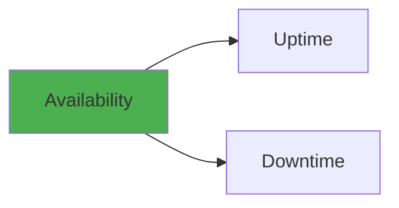
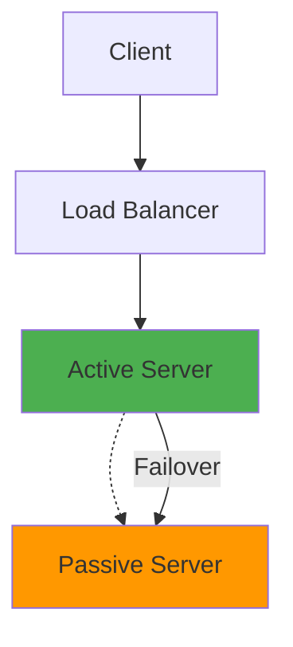
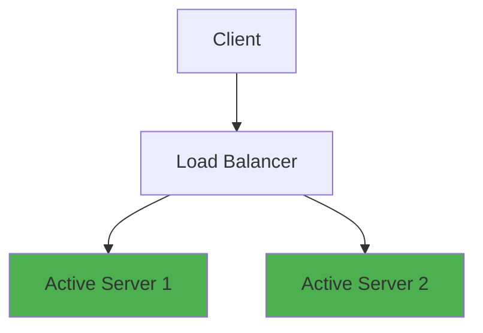
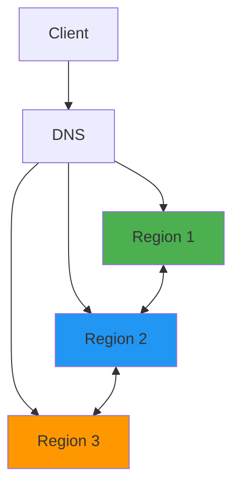
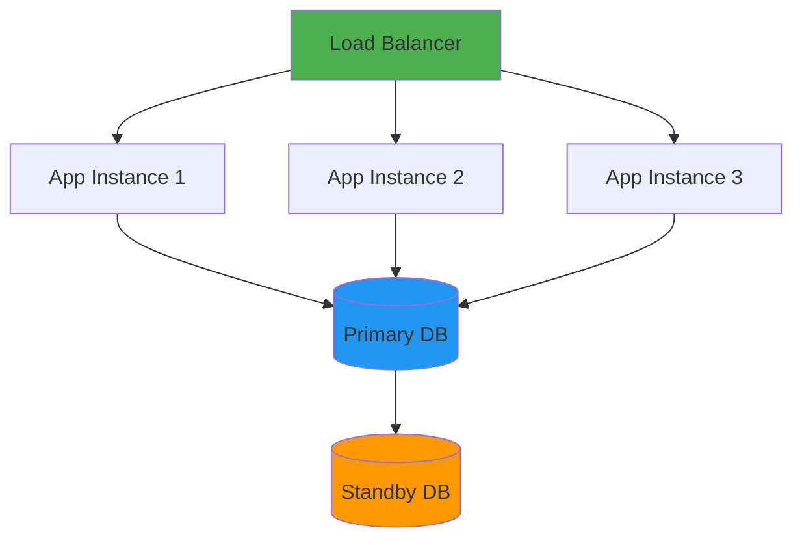
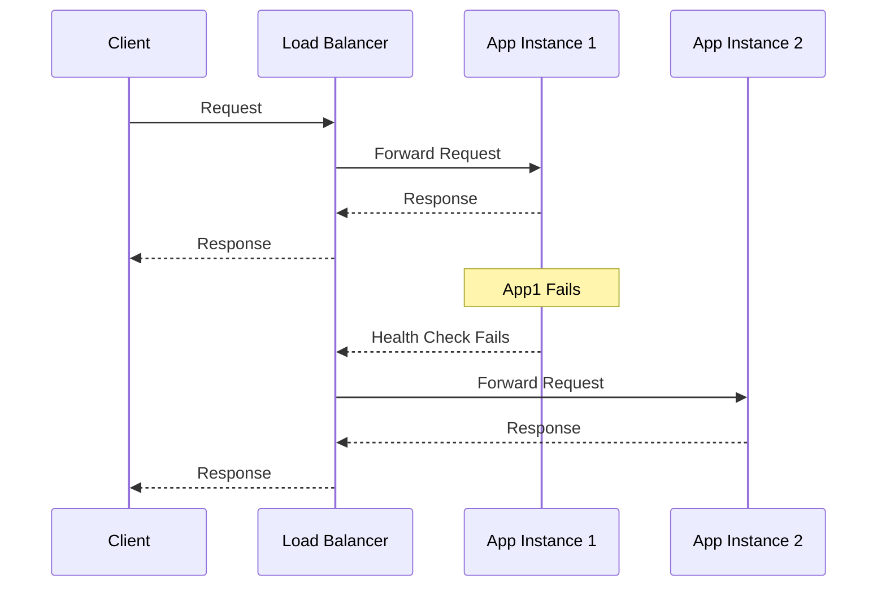

# High Availability Patterns

## Overview

High Availability (HA) patterns ensure systems remain operational with minimal downtime through redundancy, failover mechanisms, and load distribution. This guide covers HA architectures, active-passive and active-active patterns, database clustering, application HA, and designing resilient systems that can withstand failures.

## Deep Explanation

### What is High Availability?

High Availability ensures systems remain operational with minimal downtime through redundancy and failover.

#### Availability Metrics

**Availability Percentage**:
- **99%**: ~87.6 hours downtime/year
- **99.9%**: ~8.76 hours downtime/year
- **99.99%**: ~52.56 minutes downtime/year
- **99.999%**: ~5.26 minutes downtime/year



### HA Patterns

#### Active-Passive (Hot Standby)

**Pattern**:


**Characteristics**:
- One active server handles requests
- Passive server ready to take over
- Data replicated to standby
- Failover time: seconds to minutes

**Example**:
```yaml
# Kubernetes deployment with replica
apiVersion: apps/v1
kind: Deployment
metadata:
  name: app
spec:
  replicas: 2
  template:
    spec:
      containers:
      - name: app
        image: app:latest
        readinessProbe:
          httpGet:
            path: /health
            port: 8080
```

#### Active-Active

**Pattern**:


**Characteristics**:
- Multiple active servers
- Load distributed across servers
- Higher throughput
- More complex data consistency

**Example**:
```yaml
# Multiple active instances
apiVersion: apps/v1
kind: Deployment
metadata:
  name: app
spec:
  replicas: 3
  template:
    spec:
      containers:
      - name: app
        image: app:latest
```

### Database HA

#### PostgreSQL HA

**Streaming Replication**:
```yaml
# Primary configuration
# postgresql.conf
wal_level = replica
max_wal_senders = 3
max_replication_slots = 3

# Standby configuration
# postgresql.conf
hot_standby = on
primary_conninfo = 'host=primary port=5432 user=replicator'
```

**Patroni HA**:
```yaml
# patroni.yml
scope: postgres-cluster
namespace: /db/

restapi:
  listen: 0.0.0.0:8008

etcd:
  hosts: etcd1:2379,etcd2:2379,etcd3:2379

bootstrap:
  dcs:
    postgresql:
      parameters:
        wal_level: replica

postgresql:
  listen: 0.0.0.0:5432
  data_dir: /var/lib/postgresql/data
```

**Kubernetes StatefulSet**:
```yaml
apiVersion: apps/v1
kind: StatefulSet
metadata:
  name: postgres
spec:
  serviceName: postgres
  replicas: 3
  template:
    spec:
      containers:
      - name: postgres
        image: postgres:15
        env:
        - name: POSTGRES_PASSWORD
          valueFrom:
            secretKeyRef:
              name: postgres-secret
              key: password
  volumeClaimTemplates:
  - metadata:
      name: data
    spec:
      accessModes: ["ReadWriteOnce"]
      resources:
        requests:
          storage: 10Gi
```

#### MySQL HA

**MySQL Replication**:
```sql
-- Primary
CHANGE MASTER TO
  MASTER_HOST='primary',
  MASTER_USER='replicator',
  MASTER_PASSWORD='password',
  MASTER_LOG_FILE='binlog.000001',
  MASTER_LOG_POS=154;

START SLAVE;
```

**MySQL Group Replication**:
```sql
-- Configure group replication
SET GLOBAL group_replication_group_name="aaaaaaaa-aaaa-aaaa-aaaa-aaaaaaaaaaaa";
SET GLOBAL group_replication_start_on_boot=off;
SET GLOBAL group_replication_local_address="node1:33061";
SET GLOBAL group_replication_group_seeds="node1:33061,node2:33061,node3:33061";
SET GLOBAL group_replication_bootstrap_group=off;

-- Start group replication
START GROUP_REPLICATION;
```

### Application HA

#### Load Balancing

**Nginx Load Balancer**:
```nginx
upstream backend {
    least_conn;
    server app1:8080 weight=3;
    server app2:8080 weight=3;
    server app3:8080 weight=2 backup;
}

server {
    listen 80;
    
    location / {
        proxy_pass http://backend;
        proxy_set_header Host $host;
        proxy_set_header X-Real-IP $remote_addr;
        
        # Health checks
        proxy_next_upstream error timeout invalid_header http_500 http_502 http_503;
    }
}
```

**HAProxy**:
```haproxy
global
    daemon
    maxconn 4096

defaults
    mode http
    timeout connect 5000ms
    timeout client 50000ms
    timeout server 50000ms

frontend http-in
    bind *:80
    default_backend servers

backend servers
    balance roundrobin
    option httpchk GET /health
    server app1 app1:8080 check
    server app2 app2:8080 check
    server app3 app3:8080 check backup
```

**Kubernetes Service**:
```yaml
apiVersion: v1
kind: Service
metadata:
  name: app-service
spec:
  selector:
    app: app
  ports:
  - port: 80
    targetPort: 8080
  type: LoadBalancer
```

#### Health Checks

**Application Health Endpoint**:
```python
from flask import Flask, jsonify
import psutil

app = Flask(__name__)

@app.route('/health')
def health():
    """Health check endpoint"""
    checks = {
        'status': 'healthy',
        'database': check_database(),
        'memory': check_memory(),
        'disk': check_disk()
    }
    
    status_code = 200 if all(checks.values()) else 503
    return jsonify(checks), status_code

def check_database():
    try:
        db.query('SELECT 1')
        return True
    except:
        return False

def check_memory():
    memory = psutil.virtual_memory()
    return memory.percent < 90

def check_disk():
    disk = psutil.disk_usage('/')
    return disk.percent < 90
```

**Kubernetes Probes**:
```yaml
containers:
- name: app
  image: app:latest
  livenessProbe:
    httpGet:
      path: /health
      port: 8080
    initialDelaySeconds: 30
    periodSeconds: 10
    timeoutSeconds: 5
    failureThreshold: 3
  readinessProbe:
    httpGet:
      path: /ready
      port: 8080
    initialDelaySeconds: 5
    periodSeconds: 5
    timeoutSeconds: 3
    failureThreshold: 3
```

### Failover Mechanisms

#### Automatic Failover

**Keepalived**:
```conf
# keepalived.conf
vrrp_script chk_app {
    script "/usr/local/bin/check_app.sh"
    interval 2
    weight -2
    fall 3
    rise 2
}

vrrp_instance VI_1 {
    state MASTER
    interface eth0
    virtual_router_id 51
    priority 101
    advert_int 1
    authentication {
        auth_type PASS
        auth_pass password
    }
    virtual_ipaddress {
        192.168.1.100
    }
    track_script {
        chk_app
    }
}
```

**Kubernetes Pod Disruption Budget**:
```yaml
apiVersion: policy/v1
kind: PodDisruptionBudget
metadata:
  name: app-pdb
spec:
  minAvailable: 2
  selector:
    matchLabels:
      app: app
```

### Multi-Region HA

#### Cross-Region Replication

**Architecture**:


**Route53 Health Checks**:
```hcl
# Terraform
resource "aws_route53_health_check" "region1" {
  fqdn              = "app.region1.example.com"
  port              = 443
  type              = "HTTPS"
  resource_path     = "/health"
  failure_threshold = 3
  request_interval  = 30
}

resource "aws_route53_record" "app" {
  zone_id = aws_route53_zone.main.zone_id
  name    = "app.example.com"
  type    = "A"
  
  set_identifier = "region1"
  health_check_id = aws_route53_health_check.region1.id
  
  alias {
    name    = aws_lb.region1.dns_name
    zone_id = aws_lb.region1.zone_id
    evaluate_target_health = true
  }
}
```

### Circuit Breaker Pattern

**Implementation**:
```python
import time
from enum import Enum

class CircuitState(Enum):
    CLOSED = "closed"
    OPEN = "open"
    HALF_OPEN = "half_open"

class CircuitBreaker:
    def __init__(self, failure_threshold=5, timeout=60):
        self.failure_threshold = failure_threshold
        self.timeout = timeout
        self.failure_count = 0
        self.last_failure_time = None
        self.state = CircuitState.CLOSED
    
    def call(self, func, *args, **kwargs):
        if self.state == CircuitState.OPEN:
            if time.time() - self.last_failure_time > self.timeout:
                self.state = CircuitState.HALF_OPEN
            else:
                raise Exception("Circuit breaker is OPEN")
        
        try:
            result = func(*args, **kwargs)
            if self.state == CircuitState.HALF_OPEN:
                self.state = CircuitState.CLOSED
                self.failure_count = 0
            return result
        except Exception as e:
            self.failure_count += 1
            self.last_failure_time = time.time()
            
            if self.failure_count >= self.failure_threshold:
                self.state = CircuitState.OPEN
            
            raise e
```

## Diagrams

### High Availability Architecture



### Failover Flow



## Real Code Examples

### Complete HA Setup

**Kubernetes Deployment**:
```yaml
apiVersion: apps/v1
kind: Deployment
metadata:
  name: ha-app
spec:
  replicas: 3
  strategy:
    type: RollingUpdate
    rollingUpdate:
      maxSurge: 1
      maxUnavailable: 0
  selector:
    matchLabels:
      app: ha-app
  template:
    metadata:
      labels:
        app: ha-app
    spec:
      containers:
      - name: app
        image: app:latest
        ports:
        - containerPort: 8080
        livenessProbe:
          httpGet:
            path: /health
            port: 8080
          initialDelaySeconds: 30
          periodSeconds: 10
        readinessProbe:
          httpGet:
            path: /ready
            port: 8080
          initialDelaySeconds: 5
          periodSeconds: 5
        resources:
          requests:
            cpu: 100m
            memory: 128Mi
          limits:
            cpu: 500m
            memory: 512Mi

---
apiVersion: v1
kind: Service
metadata:
  name: ha-app-service
spec:
  selector:
    app: ha-app
  ports:
  - port: 80
    targetPort: 8080
  type: LoadBalancer

---
apiVersion: policy/v1
kind: PodDisruptionBudget
metadata:
  name: ha-app-pdb
spec:
  minAvailable: 2
  selector:
    matchLabels:
      app: ha-app
```

## Hard Use-Case: Zero-Downtime Deployment

### Problem

Deploy new version without downtime.

### Solution: Blue-Green Deployment

**Strategy**:
1. Deploy new version (green)
2. Test green deployment
3. Switch traffic to green
4. Keep blue for rollback

**Implementation**:
```yaml
# Blue deployment
apiVersion: apps/v1
kind: Deployment
metadata:
  name: app-blue
spec:
  replicas: 3
  template:
    metadata:
      labels:
        app: app
        version: blue
    spec:
      containers:
      - name: app
        image: app:v1.0.0

---
# Green deployment
apiVersion: apps/v1
kind: Deployment
metadata:
  name: app-green
spec:
  replicas: 3
  template:
    metadata:
      labels:
        app: app
        version: green
    spec:
      containers:
      - name: app
        image: app:v1.1.0

---
# Service switches between versions
apiVersion: v1
kind: Service
metadata:
  name: app-service
spec:
  selector:
    app: app
    version: blue  # Switch to green for new version
```

## Edge Cases and Pitfalls

### 1. Split-Brain

**Problem**: Multiple nodes think they're primary

**Solution**: Use consensus algorithm

```yaml
# Use etcd/Consul for consensus
etcd:
  hosts: etcd1:2379,etcd2:2379,etcd3:2379
```

### 2. Data Consistency

**Problem**: Data inconsistency during failover

**Solution**: Synchronous replication for critical data

```sql
-- PostgreSQL synchronous replication
synchronous_standby_names = 'ANY 1 (standby1, standby2)'
```

### 3. Cascading Failures

**Problem**: One failure causes others

**Solution**: Circuit breakers and timeouts

```python
# Circuit breaker prevents cascading failures
circuit_breaker = CircuitBreaker(failure_threshold=5)
```

## References and Further Reading

- [High Availability Design](https://www.oreilly.com/library/view/high-availability-design/9781492045199/) - HA guide
- [Kubernetes High Availability](https://kubernetes.io/docs/setup/production-environment/tools/kubeadm/high-availability/) - K8s HA
- [Database High Availability](https://www.postgresql.org/docs/current/high-availability.html) - PostgreSQL HA

## Quiz

### Question 1
What is High Availability?

**A)** One server  
**B)** Systems remain operational with minimal downtime  
**C)** No redundancy  
**D)** Single point of failure

**Answer: B** - High Availability ensures systems remain operational with minimal downtime through redundancy and failover.

### Question 2
What is the difference between active-passive and active-active?

**A)** No difference  
**B)** Active-passive has one active server, active-active has multiple  
**C)** Active-active is slower  
**D)** Active-passive is better

**Answer: B** - Active-passive has one active server with a standby, while active-active has multiple active servers handling requests.

### Question 3
What is a circuit breaker pattern?

**A)** Breaking circuits  
**B)** Preventing cascading failures  
**C)** Increasing requests  
**D)** Storing data

**Answer: B** - Circuit breaker pattern prevents cascading failures by stopping requests to failing services.

### Question 4
What should you use for database HA?

**A)** Single database  
**B)** Replication and clustering  
**C)** No backup  
**D)** One server

**Answer: B** - Database HA uses replication and clustering to ensure availability.

### Question 5
What is the purpose of health checks?

**A)** Nothing  
**B)** Detect failures and trigger failover  
**C)** Slow down system  
**D)** Delete data

**Answer: B** - Health checks detect failures and trigger failover to healthy instances.

## Related Topics

- [Backup & Disaster Recovery](../02_intermediate/14.%20Backup%20%26%20Disaster%20Recovery.md) - DR strategies
- [Kubernetes Fundamentals](../02_intermediate/01.%20Kubernetes%20Fundamentals.md) - K8s HA
- [Microservices Architecture](./05.%20Microservices%20Architecture.md) - Microservices HA

