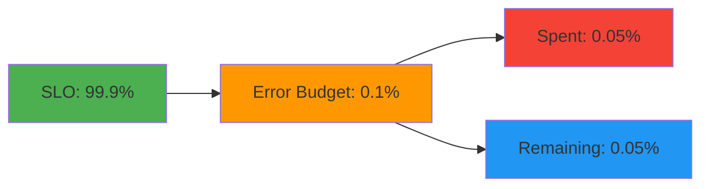
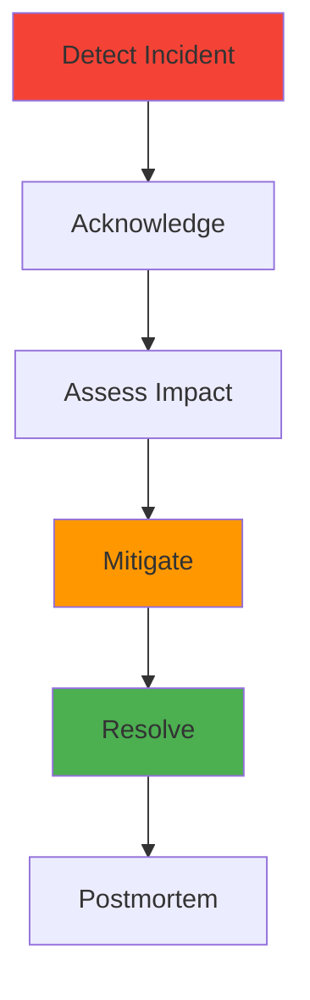
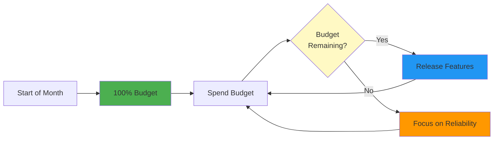
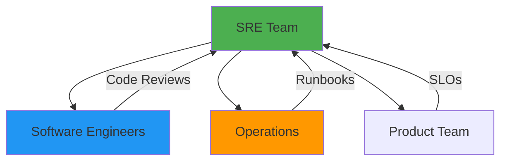

# Site Reliability Engineering (SRE)

## Overview

Site Reliability Engineering (SRE) is a discipline that combines software engineering and operations to build and run large-scale, reliable systems. SRE focuses on balancing reliability with feature velocity through error budgets, SLOs, and systematic approaches to operations. This guide covers SRE principles, practices, error budgets, incident management, and building reliable systems.

## Deep Explanation

### What is SRE?

SRE is what happens when you ask a software engineer to design an operations function. It applies software engineering principles to operations problems.

#### SRE vs Traditional Ops

| Aspect | Traditional Ops | SRE |
|--------|----------------|-----|
| **Focus** | Stability | Balance stability and velocity |
| **Toil** | Accepted | Eliminated through automation |
| **Error Handling** | Manual | Systematic |
| **Change Management** | Slow, cautious | Fast, controlled |
| **Team Structure** | Separate ops team | Engineers in ops |

### Core SRE Principles

#### 1. Embrace Risk

- Accept that 100% reliability is impossible
- Use error budgets to balance reliability and velocity
- Make informed decisions about risk

#### 2. Monitor Systems

- Measure what matters
- Use SLIs, SLOs, and SLAs
- Focus on user experience

#### 3. Automate Everything

- Eliminate toil through automation
- Focus on high-value work
- Reduce human error

#### 4. Release Engineering

- Fast, reliable releases
- Canary deployments
- Rollback capabilities

#### 5. Simplicity

- Reduce complexity
- Favor simple solutions
- Avoid over-engineering

### SLIs, SLOs, and SLAs

#### Service Level Indicators (SLIs)

SLIs are measurable aspects of service quality.

**Common SLIs**:
- **Availability**: Uptime percentage
- **Latency**: Response time percentiles
- **Error Rate**: Percentage of failed requests
- **Throughput**: Requests per second

**Example SLI**:
```
Availability SLI = (Successful requests / Total requests) × 100%
```

#### Service Level Objectives (SLOs)

SLOs are target values for SLIs.

**Example SLOs**:
- 99.9% availability (43 minutes downtime/month)
- p95 latency < 200ms
- Error rate < 0.1%

**SLO Best Practices**:
- Set SLOs based on user needs
- Use multiple SLOs for different aspects
- Review and adjust regularly
- Make SLOs achievable but challenging

#### Service Level Agreements (SLAs)

SLAs are business agreements with consequences.

**SLA vs SLO**:
- **SLO**: Internal target
- **SLA**: External promise with penalties

**Example SLA**:
- 99.9% uptime or refund

### Error Budgets

#### What is an Error Budget?

Error budget = 100% - SLO

**Example**:
- SLO: 99.9% availability
- Error Budget: 0.1% (43 minutes/month)

#### Using Error Budgets



**Error Budget Policy**:
- **Budget Remaining**: Can release features
- **Budget Depleted**: Focus on reliability
- **Budget Exceeded**: Stop feature work, fix reliability

#### Error Budget Calculation

```python
# Error budget calculation
def calculate_error_budget(slo_percentage, total_time_minutes):
    """
    Calculate error budget in minutes
    
    Args:
        slo_percentage: SLO as percentage (e.g., 99.9)
        total_time_minutes: Total time period in minutes
    
    Returns:
        Error budget in minutes
    """
    error_budget_percentage = 100 - slo_percentage
    error_budget_minutes = (error_budget_percentage / 100) * total_time_minutes
    return error_budget_minutes

# Example: 99.9% SLO for a month
monthly_minutes = 30 * 24 * 60  # 43,200 minutes
budget = calculate_error_budget(99.9, monthly_minutes)
print(f"Error budget: {budget:.2f} minutes")  # 43.2 minutes
```

### Toil

#### What is Toil?

Toil is manual, repetitive work that:
- Is manual
- Is repetitive
- Doesn't add value
- Scales linearly with service growth

#### Examples of Toil

- Manual server provisioning
- Manual deployments
- Manual incident response
- Manual data fixes

#### Eliminating Toil

1. **Automate**: Write scripts/tools
2. **Eliminate**: Remove unnecessary work
3. **Delegate**: Move to appropriate team
4. **Accept**: If necessary, minimize

**Toil Budget**: Limit toil to < 50% of time

### Incident Management

#### Incident Response Process



#### Incident Severity

**Severity Levels**:
- **P0**: Service down, all users affected
- **P1**: Major feature broken, many users affected
- **P2**: Minor feature broken, some users affected
- **P3**: Low impact, workaround available

#### Incident Response Roles

- **Incident Commander**: Coordinates response
- **Communications Lead**: Updates stakeholders
- **Operations Lead**: Technical investigation
- **Scribe**: Documents everything

#### Runbooks

Runbooks are step-by-step procedures for common incidents.

**Example Runbook**:
```markdown
# High Error Rate Runbook

## Symptoms
- Error rate > 1%
- Increased latency
- User complaints

## Steps
1. Check service health endpoints
2. Review recent deployments
3. Check database connections
4. Review application logs
5. Check external dependencies

## Escalation
- If unresolved in 15 minutes: Escalate to on-call engineer
- If P0: Page incident commander
```

### Postmortems

#### What is a Postmortem?

A postmortem is a document analyzing an incident to prevent recurrence.

#### Postmortem Structure

1. **Summary**: Brief overview
2. **Timeline**: What happened when
3. **Impact**: Users affected, duration
4. **Root Cause**: Why it happened
5. **Action Items**: What to fix
6. **Lessons Learned**: What we learned

#### Blameless Postmortems

- Focus on process, not people
- Learn from mistakes
- Improve systems
- Share knowledge

**Example Postmortem**:
```markdown
# Postmortem: Service Outage - 2024-01-15

## Summary
Service was unavailable for 23 minutes due to database connection pool exhaustion.

## Timeline
- 14:32: Error rate spikes to 5%
- 14:35: Service becomes unresponsive
- 14:38: Database connection pool exhausted
- 14:45: Restart service, connections restored
- 14:55: Service fully recovered

## Impact
- Duration: 23 minutes
- Users affected: ~50,000
- Error budget consumed: 0.05%

## Root Cause
Connection pool size was too small for increased load. Recent feature release increased database queries by 3x.

## Action Items
1. Increase connection pool size (P0)
2. Add connection pool monitoring (P1)
3. Load test before releases (P1)
4. Add circuit breaker for database (P2)

## Lessons Learned
- Need better capacity planning
- Should have load tested new feature
- Connection pool metrics were missing
```

### Release Engineering

#### Release Principles

1. **Fast**: Deploy quickly
2. **Safe**: Minimize risk
3. **Repeatable**: Same process every time
4. **Automated**: No manual steps

#### Release Strategies

**Canary Deployment**:
- Deploy to small percentage
- Monitor metrics
- Gradually increase
- Rollback if issues

**Blue-Green Deployment**:
- Deploy to new environment
- Switch traffic
- Keep old as backup

**Feature Flags**:
- Deploy code with flags
- Enable gradually
- Instant rollback

### Capacity Planning

#### Capacity Planning Process

1. **Measure**: Current usage
2. **Forecast**: Future growth
3. **Plan**: Resource needs
4. **Provision**: Add capacity
5. **Monitor**: Track usage

#### Capacity Planning Example

```python
# Capacity planning calculation
def calculate_capacity(current_qps, growth_rate, target_capacity_months):
    """
    Calculate required capacity
    
    Args:
        current_qps: Current queries per second
        growth_rate: Monthly growth rate (e.g., 0.1 for 10%)
        target_capacity_months: Months to plan for
    
    Returns:
        Required QPS capacity
    """
    required_qps = current_qps * ((1 + growth_rate) ** target_capacity_months)
    return required_qps

# Example
current = 1000  # QPS
growth = 0.15   # 15% monthly growth
months = 6      # Plan for 6 months

required = calculate_capacity(current, growth, months)
print(f"Required capacity: {required:.0f} QPS")  # ~2,313 QPS
```

### Monitoring and Alerting

#### Alerting Philosophy

- **Alert on Symptoms**: Not causes
- **Actionable Alerts**: Can do something about it
- **Avoid Alert Fatigue**: Don't alert on everything
- **Use SLOs**: Alert when SLO at risk

#### Alerting Best Practices

```yaml
# Good alert: Based on SLO
alert: HighErrorRate
expr: rate(http_requests_total{status=~"5.."}[5m]) > 0.01
for: 5m
annotations:
  summary: "Error rate exceeds SLO threshold"
  runbook: "https://wiki/runbooks/high-error-rate"

# Bad alert: Too sensitive
alert: AnyError
expr: rate(http_requests_total{status=~"5.."}[1m]) > 0
# This will fire constantly
```

### Automation

#### What to Automate

1. **Deployments**: CI/CD pipelines
2. **Scaling**: Auto-scaling
3. **Monitoring**: Health checks
4. **Incident Response**: Runbooks
5. **Testing**: Automated tests

#### Automation Example

```python
# Automated incident response
def handle_high_error_rate():
    """Automated response to high error rate"""
    error_rate = get_error_rate()
    
    if error_rate > 0.05:  # 5% error rate
        # Scale up
        scale_deployment("web-app", replicas=10)
        
        # Enable circuit breaker
        enable_circuit_breaker("database")
        
        # Alert team
        send_alert("High error rate detected, auto-scaling")
        
        # Log action
        log_action("auto_scaled", reason="high_error_rate")
```

## Diagrams

### Error Budget Lifecycle



### SRE Team Structure



## Real Code Examples

### SLO Monitoring Dashboard

```yaml
# Grafana dashboard for SLO monitoring
dashboard:
  title: "SLO Dashboard"
  panels:
  - title: "Availability SLO"
    targets:
    - expr: |
        (
          sum(rate(http_requests_total{status=~"2.."}[5m]))
          /
          sum(rate(http_requests_total[5m]))
        ) * 100
    thresholds:
      - value: 99.9
        color: green
      - value: 99.5
        color: yellow
      - value: 99.0
        color: red
  
  - title: "Error Budget Remaining"
    targets:
    - expr: |
        (100 - 99.9) - (
          (1 - (
            sum(rate(http_requests_total{status=~"2.."}[5m]))
            /
            sum(rate(http_requests_total[5m]))
          )) * 100
        )
    thresholds:
      - value: 0.05
        color: green
      - value: 0.02
        color: yellow
      - value: 0
        color: red
```

### Automated Incident Response

```python
# Automated incident response system
class IncidentResponder:
    def __init__(self):
        self.slo_threshold = 99.9
        self.error_budget_threshold = 0.05
    
    def check_slo(self):
        """Check if SLO is being met"""
        availability = self.get_availability()
        return availability >= self.slo_threshold
    
    def check_error_budget(self):
        """Check error budget remaining"""
        error_budget_used = self.get_error_budget_used()
        return error_budget_used < self.error_budget_threshold
    
    def handle_incident(self, severity):
        """Handle incident based on severity"""
        if severity == "P0":
            # Page on-call
            self.page_oncall()
            # Scale up
            self.scale_up()
            # Enable circuit breakers
            self.enable_circuit_breakers()
        elif severity == "P1":
            # Alert team
            self.alert_team()
            # Scale up
            self.scale_up()
    
    def get_availability(self):
        """Calculate current availability"""
        total_requests = self.get_total_requests()
        successful_requests = self.get_successful_requests()
        return (successful_requests / total_requests) * 100
    
    def get_error_budget_used(self):
        """Calculate error budget used"""
        slo = self.slo_threshold
        availability = self.get_availability()
        return (slo - availability) / 100
```

### Postmortem Template

```markdown
# Postmortem Template

## Incident Summary
- **Date**: YYYY-MM-DD
- **Duration**: X minutes
- **Severity**: P0/P1/P2/P3
- **Impact**: Brief description

## Timeline
- **HH:MM**: Event description
- **HH:MM**: Event description
- **HH:MM**: Resolution

## Impact
- **Users Affected**: Number/percentage
- **Error Budget Consumed**: X%
- **Revenue Impact**: If applicable

## Root Cause
Detailed analysis of why the incident occurred.

## Contributing Factors
- Factor 1
- Factor 2
- Factor 3

## Detection
How was the incident detected?

## Resolution
How was the incident resolved?

## Action Items
- [ ] Item 1 (Owner: Name, Priority: P0/P1/P2, Due: Date)
- [ ] Item 2 (Owner: Name, Priority: P0/P1/P2, Due: Date)

## Lessons Learned
What did we learn from this incident?

## Follow-up
- [ ] Review action items in 1 week
- [ ] Update runbooks
- [ ] Share learnings with team
```

## Hard Use-Case: Implementing SRE in Existing Organization

### Problem

Traditional ops team, manual processes, frequent incidents, slow releases.

### Solution: SRE Transformation

#### Phase 1: Establish SLOs (Month 1-2)

1. **Identify Key Services**: List critical services
2. **Define SLIs**: Choose measurable indicators
3. **Set SLOs**: Based on user needs
4. **Implement Monitoring**: Track SLIs

#### Phase 2: Error Budgets (Month 3-4)

1. **Calculate Budgets**: Based on SLOs
2. **Track Usage**: Monitor budget consumption
3. **Implement Policy**: Use budgets in decisions
4. **Communicate**: Share with product teams

#### Phase 3: Automation (Month 5-6)

1. **Identify Toil**: List manual tasks
2. **Prioritize**: Focus on high-impact
3. **Automate**: Build tools/scripts
4. **Measure**: Track toil reduction

#### Phase 4: Incident Management (Month 7-8)

1. **Define Process**: Incident response procedure
2. **Create Runbooks**: Common incidents
3. **Train Team**: Incident response training
4. **Practice**: Run incident drills

## Edge Cases and Pitfalls

### 1. SLO Too Aggressive

**Problem**: SLO impossible to meet

**Solution**: Set realistic SLOs based on data

```python
# Analyze historical data
historical_availability = [99.5, 99.7, 99.6, 99.8]
average = sum(historical_availability) / len(historical_availability)
slo = average - 0.1  # Slightly below average
```

### 2. Ignoring Error Budgets

**Problem**: Budgets not used in decisions

**Solution**: Make budgets part of process

```yaml
# Release approval process
if error_budget_remaining > threshold:
  approve_release()
else:
  require_reliability_work()
```

### 3. Alert Fatigue

**Problem**: Too many alerts

**Solution**: Alert on SLO violations only

```yaml
# Alert when SLO at risk
alert: SLORisk
expr: error_budget_remaining < 0.02
for: 5m
```

## References and Further Reading

- [Google SRE Book](https://sre.google/books/) - Comprehensive SRE guide
- [SRE Workbook](https://sre.google/workbook/) - Practical SRE practices
- [SLI/SLO Guide](https://sre.google/workbook/sli-slo/) - SLI/SLO best practices
- [Error Budgets](https://sre.google/workbook/error-budget-policy/) - Error budget guide

## Quiz

### Question 1
What is an error budget?

**A)** Money allocated for errors  
**B)** The difference between 100% and the SLO  
**C)** Number of allowed errors  
**D)** Time spent fixing errors

**Answer: B** - Error budget is the difference between 100% and the SLO, representing acceptable unreliability.

### Question 2
What is toil in SRE?

**A)** Important work  
**B)** Manual, repetitive work that doesn't add value  
**C)** Incident response  
**D)** Feature development

**Answer: B** - Toil is manual, repetitive work that should be automated or eliminated.

### Question 3
What is the recommended toil budget?

**A)** < 10%  
**B)** < 50%  
**C)** < 75%  
**D)** No limit

**Answer: B** - SRE teams should limit toil to less than 50% of their time.

### Question 4
What is a blameless postmortem?

**A)** No one is blamed  
**B)** Focuses on process, not people  
**C)** Doesn't identify causes  
**D)** Only positive feedback

**Answer: B** - Blameless postmortems focus on improving processes and systems, not assigning blame to individuals.

### Question 5
What should you alert on?

**A)** Everything  
**B)** Symptoms that violate SLOs  
**C)** All errors  
**D)** Every metric change

**Answer: B** - Alert on symptoms that indicate SLO violations or actionable issues, not every metric change.

## Related Topics

- [Monitoring & Observability](../02_intermediate/04.%20Monitoring%20%26%20Observability.md) - Observability practices
- [Introduction to DevOps](../01_beginners/01.%20Introduction%20to%20DevOps.md) - DevOps fundamentals
- [Advanced Kubernetes Patterns](../03_advanced/01.%20Advanced%20Kubernetes%20Patterns.md) - K8s reliability

