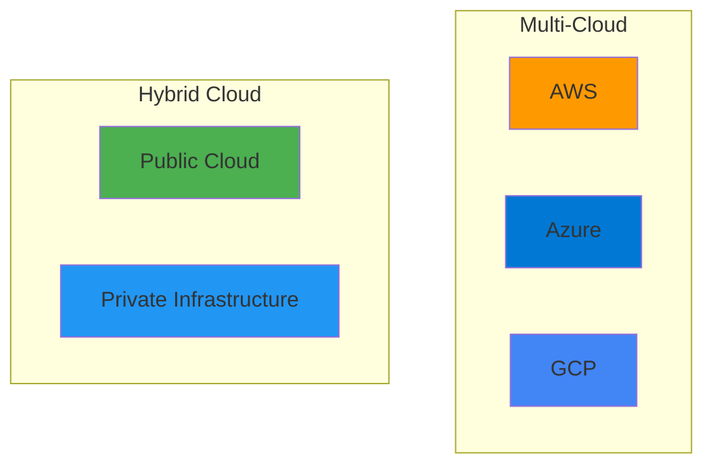
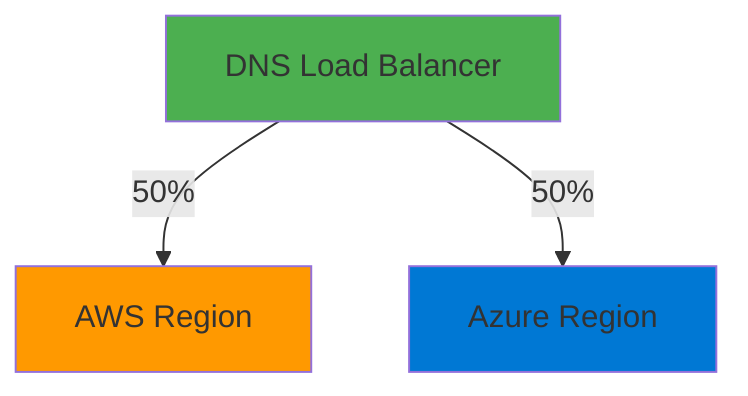
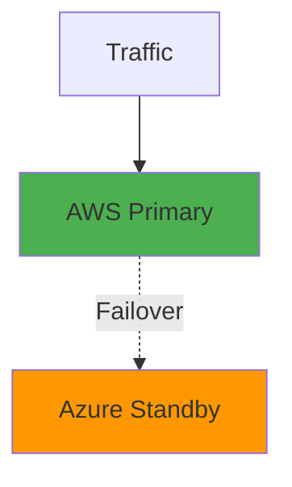
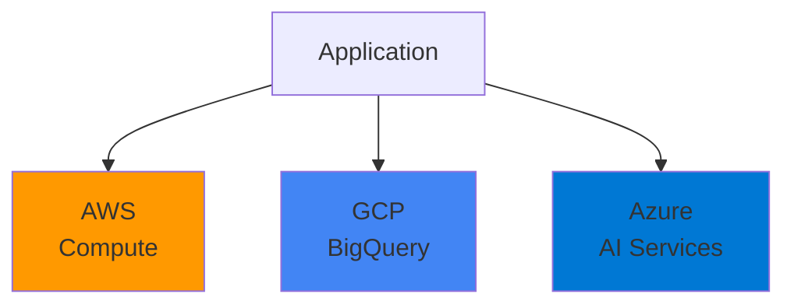
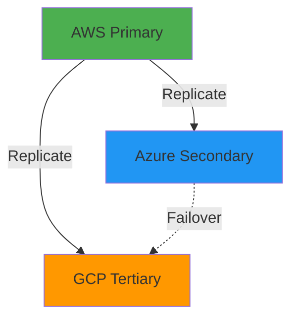
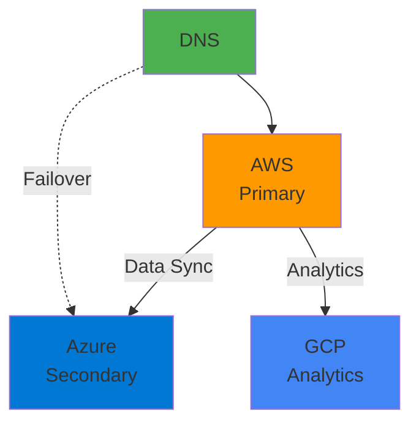
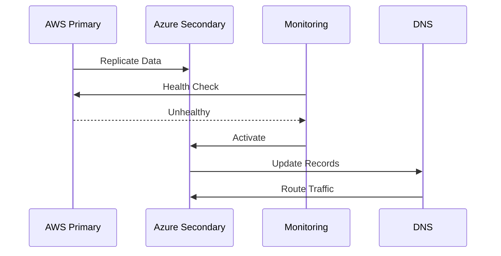
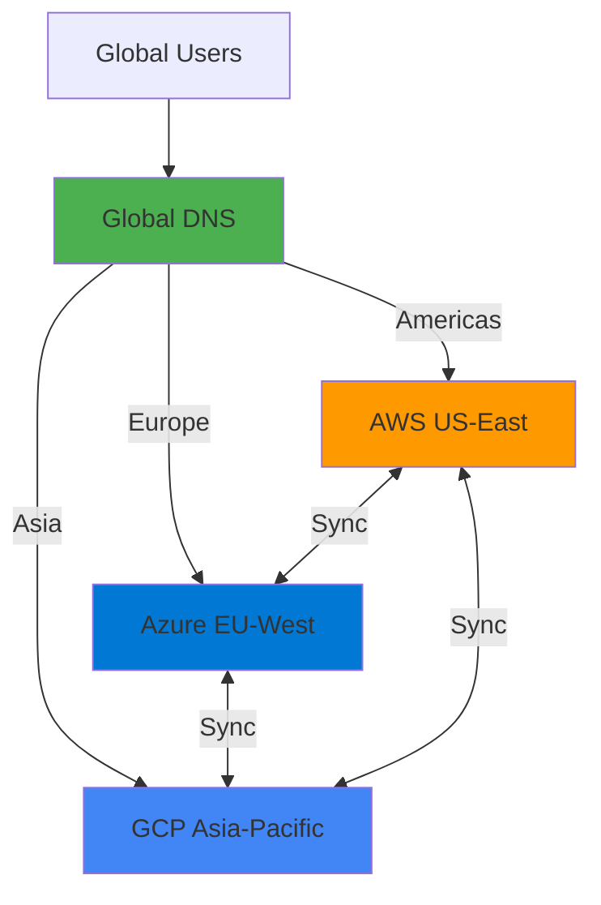

# Multi-Cloud Strategies

## Overview

Multi-cloud strategies involve using multiple cloud providers simultaneously to achieve better resilience, avoid vendor lock-in, optimize costs, and leverage best-of-breed services. This guide covers multi-cloud architectures, implementation patterns, challenges, and best practices for managing applications across AWS, Azure, GCP, and hybrid environments.

## Deep Explanation

### What is Multi-Cloud?

Multi-cloud is the use of multiple cloud computing services from different providers in a single architecture.

#### Multi-Cloud vs Hybrid Cloud

**Multi-Cloud**: Multiple public clouds
**Hybrid Cloud**: Public cloud + private infrastructure



### Why Multi-Cloud?

#### Benefits

1. **Vendor Lock-in Avoidance**: Not dependent on one provider
2. **Best-of-Breed**: Use best services from each provider
3. **Resilience**: Redundancy across providers
4. **Cost Optimization**: Compare and optimize costs
5. **Compliance**: Meet data residency requirements
6. **Disaster Recovery**: Geographic redundancy

#### Challenges

1. **Complexity**: Managing multiple platforms
2. **Skills**: Need expertise in multiple clouds
3. **Cost**: May increase costs if not managed
4. **Integration**: Connecting services across clouds
5. **Consistency**: Maintaining consistency

### Multi-Cloud Architecture Patterns

#### Pattern 1: Active-Active

Both clouds serve traffic simultaneously.



**Use Cases**:
- High availability
- Geographic distribution
- Load distribution

#### Pattern 2: Active-Passive

One cloud active, other on standby.



**Use Cases**:
- Disaster recovery
- Cost optimization
- Compliance

#### Pattern 3: Service-Specific

Different clouds for different services.



**Use Cases**:
- Leverage specialized services
- Cost optimization
- Best-of-breed

### Implementation Strategies

#### Terraform Multi-Cloud

```hcl
# AWS Resources
provider "aws" {
  region = "us-east-1"
}

resource "aws_instance" "web" {
  ami           = "ami-0c55b159cbfafe1f0"
  instance_type = "t2.micro"
}

# Azure Resources
provider "azurerm" {
  features {}
}

resource "azurerm_virtual_machine" "web" {
  name                  = "web-vm"
  location              = "East US"
  resource_group_name   = azurerm_resource_group.example.name
  vm_size               = "Standard_B1s"
}

# GCP Resources
provider "google" {
  project = "my-project"
  region  = "us-central1"
}

resource "google_compute_instance" "web" {
  name         = "web-instance"
  machine_type = "e2-medium"
  zone         = "us-central1-a"
}
```

#### Kubernetes Multi-Cloud

```yaml
# Cluster federation
apiVersion: types.kubefed.io/v1beta1
kind: FederatedDeployment
metadata:
  name: app
spec:
  placement:
    clusters:
    - name: aws-cluster
    - name: azure-cluster
  template:
    spec:
      replicas: 3
      template:
        spec:
          containers:
          - name: app
            image: myapp:latest
```

#### Cross-Cloud Networking

**VPN Connections**:
```hcl
# AWS VPN
resource "aws_vpn_connection" "azure" {
  vpc_id            = aws_vpc.main.id
  customer_gateway_id = aws_customer_gateway.azure.id
  type              = "ipsec.1"
}

# Azure VPN
resource "azurerm_virtual_network_gateway" "aws" {
  name                = "aws-gateway"
  location            = azurerm_resource_group.main.location
  resource_group_name = azurerm_resource_group.main.name
  type                = "Vpn"
  vpn_type            = "RouteBased"
}
```

**Private Links**:
```hcl
# AWS PrivateLink
resource "aws_vpc_endpoint" "azure" {
  vpc_id            = aws_vpc.main.id
  service_name      = "com.amazonaws.region.service"
  vpc_endpoint_type = "Interface"
}

# Azure Private Link
resource "azurerm_private_endpoint" "aws" {
  name                = "aws-endpoint"
  location            = azurerm_resource_group.main.location
  resource_group_name = azurerm_resource_group.main.name
  subnet_id           = azurerm_subnet.main.id
}
```

### Data Synchronization

#### Database Replication

```python
# Cross-cloud database replication
class MultiCloudDatabase:
    def __init__(self):
        self.aws_db = connect_aws_rds()
        self.azure_db = connect_azure_sql()
        self.gcp_db = connect_gcp_sql()
    
    def write(self, data):
        # Write to primary (AWS)
        self.aws_db.write(data)
        
        # Replicate to others
        self.azure_db.write(data)
        self.gcp_db.write(data)
    
    def read(self, query):
        # Read from nearest region
        region = get_nearest_region()
        if region == 'us-east':
            return self.aws_db.read(query)
        elif region == 'us-west':
            return self.azure_db.read(query)
        else:
            return self.gcp_db.read(query)
```

#### Object Storage Sync

```bash
# Sync S3 to Azure Blob
aws s3 sync s3://my-bucket azure://my-container --exclude "*" --include "*.json"

# Sync S3 to GCP Storage
gsutil -m rsync -r s3://my-bucket gs://my-bucket
```

### Identity and Access Management

#### Cross-Cloud IAM

```hcl
# AWS IAM Role
resource "aws_iam_role" "cross_cloud" {
  name = "cross-cloud-role"
  
  assume_role_policy = jsonencode({
    Version = "2012-10-17"
    Statement = [{
      Effect = "Allow"
      Principal = {
        AWS = "arn:aws:iam::ACCOUNT:root"
        Federated = "accounts.google.com"
      }
      Action = "sts:AssumeRole"
    }]
  })
}

# Azure Managed Identity
resource "azurerm_user_assigned_identity" "cross_cloud" {
  name                = "cross-cloud-identity"
  location            = azurerm_resource_group.main.location
  resource_group_name = azurerm_resource_group.main.name
}

# GCP Service Account
resource "google_service_account" "cross_cloud" {
  account_id   = "cross-cloud-sa"
  display_name = "Cross Cloud Service Account"
}
```

### Cost Management

#### Cost Optimization Strategies

**Right-Sizing**:
```python
# Analyze costs across clouds
def analyze_costs():
    aws_cost = get_aws_cost()
    azure_cost = get_azure_cost()
    gcp_cost = get_gcp_cost()
    
    total = aws_cost + azure_cost + gcp_cost
    
    # Find opportunities
    if aws_cost > azure_cost * 1.2:
        recommend_migration('aws', 'azure')
    
    return {
        'total': total,
        'aws': aws_cost,
        'azure': azure_cost,
        'gcp': gcp_cost
    }
```

**Reserved Instances**:
```hcl
# AWS Reserved Instance
resource "aws_reserved_instance" "example" {
  instance_type     = "t3.medium"
  availability_zone = "us-east-1a"
  term_length      = 1
  offering_type    = "Heavy Utilization"
}

# Azure Reserved VM
resource "azurerm_reserved_vm_instance" "example" {
  name                = "reserved-vm"
  scope               = "Subscription"
  location            = "East US"
  sku_name            = "Standard_B1s"
  term                = "P1Y"
}
```

### Disaster Recovery

#### Multi-Cloud DR Strategy



**RTO/RPO Targets**:
- **RTO**: Recovery Time Objective (time to recover)
- **RPO**: Recovery Point Objective (data loss tolerance)

**Implementation**:
```python
class MultiCloudDR:
    def __init__(self):
        self.primary = AWSProvider()
        self.secondary = AzureProvider()
        self.tertiary = GCPProvider()
    
    def failover(self, from_provider, to_provider):
        # Stop primary
        from_provider.stop_services()
        
        # Start secondary
        to_provider.start_services()
        
        # Update DNS
        update_dns(to_provider.endpoint)
        
        # Verify health
        if not to_provider.health_check():
            # Failover to tertiary
            self.failover(to_provider, self.tertiary)
```

### Monitoring and Observability

#### Cross-Cloud Monitoring

```yaml
# Prometheus multi-cloud
global:
  external_labels:
    cloud: 'multi'

scrape_configs:
  - job_name: 'aws'
    ec2_sd_configs:
      - region: us-east-1
    relabel_configs:
      - source_labels: [__meta_ec2_tag_Environment]
        target_label: environment
  
  - job_name: 'azure'
    azure_sd_configs:
      - subscription_id: 'xxx'
        tenant_id: 'xxx'
  
  - job_name: 'gcp'
    gce_sd_configs:
      - project: 'my-project'
        zone: 'us-central1-a'
```

#### Unified Logging

```python
# Centralized logging
import logging
from cloudwatch import CloudWatchHandler
from azure_monitor import AzureMonitorHandler
from stackdriver import StackdriverHandler

logger = logging.getLogger('multi-cloud')
logger.addHandler(CloudWatchHandler())
logger.addHandler(AzureMonitorHandler())
logger.addHandler(StackdriverHandler())

logger.info('Application started', extra={
    'cloud': 'multi',
    'region': 'us-east-1'
})
```

### Security Considerations

#### Cross-Cloud Security

**Encryption**:
```python
# Encrypt data before cross-cloud transfer
from cryptography.fernet import Fernet

def encrypt_for_transfer(data, key):
    f = Fernet(key)
    return f.encrypt(data.encode())

def transfer_to_cloud(data, cloud_provider):
    encrypted = encrypt_for_transfer(data, ENCRYPTION_KEY)
    cloud_provider.store(encrypted)
```

**Network Security**:
```hcl
# AWS Security Group
resource "aws_security_group" "cross_cloud" {
  ingress {
    from_port   = 443
    to_port     = 443
    protocol    = "tcp"
    cidr_blocks = [azurerm_virtual_network.main.address_space[0]]
  }
}

# Azure NSG
resource "azurerm_network_security_group" "cross_cloud" {
  security_rule {
    name                       = "AllowAWS"
    priority                   = 100
    direction                  = "Inbound"
    access                     = "Allow"
    protocol                   = "Tcp"
    source_port_range          = "*"
    destination_port_range    = "443"
    source_address_prefix      = aws_vpc.main.cidr_block
    destination_address_prefix = "*"
  }
}
```

### Best Practices

#### 1. Start Small

Begin with non-critical workloads:
- Development environments
- Backup systems
- Analytics workloads

#### 2. Use Abstraction Layers

```python
# Cloud abstraction
class CloudProvider:
    def create_vm(self, config):
        raise NotImplementedError
    
    def create_storage(self, config):
        raise NotImplementedError

class AWSProvider(CloudProvider):
    def create_vm(self, config):
        return ec2.create_instance(config)

class AzureProvider(CloudProvider):
    def create_vm(self, config):
        return azure_vm.create(config)

# Use abstraction
def deploy_app(provider: CloudProvider):
    provider.create_vm(config)
    provider.create_storage(config)
```

#### 3. Standardize Configurations

```yaml
# Standardized config
cloud_config:
  compute:
    instance_type: "medium"
    os: "ubuntu-20.04"
  storage:
    type: "ssd"
    size: "100GB"
  network:
    ports: [80, 443]
```

#### 4. Automate Everything

```yaml
# CI/CD for multi-cloud
deploy:
  strategy: matrix
  matrix:
    cloud: [aws, azure, gcp]
  steps:
    - name: Deploy to ${{ matrix.cloud }}
      run: terraform apply -var cloud=${{ matrix.cloud }}
```

## Diagrams

### Multi-Cloud Architecture



### Disaster Recovery Flow



## Real Code Examples

### Multi-Cloud Deployment Script

```python
# multi_cloud_deploy.py
import boto3
from azure.identity import DefaultAzureCredential
from azure.mgmt.compute import ComputeManagementClient
from google.cloud import compute_v1

class MultiCloudDeployer:
    def __init__(self):
        self.aws_ec2 = boto3.client('ec2')
        self.azure_compute = ComputeManagementClient(
            DefaultAzureCredential(),
            subscription_id='xxx'
        )
        self.gcp_compute = compute_v1.InstancesClient()
    
    def deploy_to_aws(self, config):
        """Deploy to AWS"""
        response = self.aws_ec2.run_instances(
            ImageId=config['ami'],
            InstanceType=config['instance_type'],
            MinCount=1,
            MaxCount=1
        )
        return response['Instances'][0]['InstanceId']
    
    def deploy_to_azure(self, config):
        """Deploy to Azure"""
        vm_params = {
            'location': config['location'],
            'hardware_profile': {
                'vm_size': config['vm_size']
            },
            'storage_profile': {
                'image_reference': {
                    'publisher': config['publisher'],
                    'offer': config['offer'],
                    'sku': config['sku'],
                    'version': 'latest'
                }
            }
        }
        
        poller = self.azure_compute.virtual_machines.begin_create_or_update(
            config['resource_group'],
            config['vm_name'],
            vm_params
        )
        return poller.result()
    
    def deploy_to_gcp(self, config):
        """Deploy to GCP"""
        instance = compute_v1.Instance()
        instance.name = config['name']
        instance.machine_type = f"zones/{config['zone']}/machineTypes/{config['machine_type']}"
        
        disk = compute_v1.AttachedDisk()
        disk.initialize_params.source_image = config['image']
        disk.auto_delete = True
        disk.boot = True
        instance.disks = [disk]
        
        operation = self.gcp_compute.insert(
            project=config['project'],
            zone=config['zone'],
            instance_resource=instance
        )
        return operation
    
    def deploy_all(self, config):
        """Deploy to all clouds"""
        results = {}
        
        if 'aws' in config:
            results['aws'] = self.deploy_to_aws(config['aws'])
        
        if 'azure' in config:
            results['azure'] = self.deploy_to_azure(config['azure'])
        
        if 'gcp' in config:
            results['gcp'] = self.deploy_to_gcp(config['gcp'])
        
        return results
```

### Terraform Multi-Cloud Module

```hcl
# modules/multi-cloud/main.tf
variable "cloud_providers" {
  type = list(string)
  default = ["aws", "azure", "gcp"]
}

variable "instance_config" {
  type = object({
    instance_type = string
    image         = string
  })
}

# AWS Resources
resource "aws_instance" "multi_cloud" {
  count = contains(var.cloud_providers, "aws") ? 1 : 0
  
  ami           = var.instance_config.image
  instance_type = var.instance_config.instance_type
}

# Azure Resources
resource "azurerm_virtual_machine" "multi_cloud" {
  count = contains(var.cloud_providers, "azure") ? 1 : 0
  
  name                  = "multi-cloud-vm"
  location              = "East US"
  resource_group_name   = azurerm_resource_group.main[0].name
  vm_size               = var.instance_config.instance_type
}

# GCP Resources
resource "google_compute_instance" "multi_cloud" {
  count = contains(var.cloud_providers, "gcp") ? 1 : 0
  
  name         = "multi-cloud-instance"
  machine_type = var.instance_config.instance_type
  zone         = "us-central1-a"
  
  boot_disk {
    initialize_params {
      image = var.instance_config.image
    }
  }
}
```

## Hard Use-Case: Global Application with Multi-Cloud

### Problem

Deploy application globally with:
- Low latency worldwide
- High availability
- Data residency compliance
- Cost optimization

### Solution: Multi-Region Multi-Cloud

#### Architecture



#### Implementation

```python
class GlobalMultiCloud:
    def __init__(self):
        self.regions = {
            'us-east': AWSProvider('us-east-1'),
            'eu-west': AzureProvider('westeurope'),
            'asia-pacific': GCPProvider('asia-east1')
        }
    
    def deploy(self):
        """Deploy to all regions"""
        for region, provider in self.regions.items():
            provider.deploy_application()
            provider.configure_cdn()
    
    def sync_data(self):
        """Sync data across regions"""
        # Primary region (US-East)
        primary_data = self.regions['us-east'].get_data()
        
        # Replicate to other regions
        for region, provider in self.regions.items():
            if region != 'us-east':
                provider.replicate_data(primary_data)
    
    def route_traffic(self, user_location):
        """Route traffic to nearest region"""
        if user_location in ['US', 'CA', 'MX']:
            return self.regions['us-east']
        elif user_location in ['EU', 'UK']:
            return self.regions['eu-west']
        else:
            return self.regions['asia-pacific']
```

## Edge Cases and Pitfalls

### 1. Data Consistency

**Problem**: Data inconsistency across clouds

**Solution**: Eventual consistency with conflict resolution

```python
def sync_with_conflict_resolution(data, timestamp):
    # Use timestamps for conflict resolution
    if timestamp > get_last_sync_time():
        update_data(data)
        update_sync_time(timestamp)
```

### 2. Cost Overruns

**Problem**: Costs higher than expected

**Solution**: Cost monitoring and alerts

```python
def monitor_costs():
    costs = get_all_cloud_costs()
    if costs['total'] > BUDGET:
        send_alert('Cost overrun')
        scale_down_non_critical()
```

### 3. Complexity Management

**Problem**: Too complex to manage

**Solution**: Use abstraction and automation

```python
# Abstract cloud operations
class CloudAbstraction:
    def deploy(self, config):
        # Unified interface
        pass
```

## References and Further Reading

- [Multi-Cloud Architecture](https://www.oreilly.com/library/view/multi-cloud-architecture/9781492086888/) - Multi-cloud patterns
- [Cloud Native Patterns](https://www.oreilly.com/library/view/cloud-native-patterns/9781492053811/) - Cloud patterns
- [AWS Multi-Region](https://aws.amazon.com/solutions/implementations/multi-region-application-architecture/) - AWS patterns

## Quiz

### Question 1
What is the main benefit of multi-cloud?

**A)** Lower costs always  
**B)** Avoid vendor lock-in  
**C)** Simpler management  
**D)** Single vendor support

**Answer: B** - Multi-cloud helps avoid vendor lock-in and provides flexibility to use best services from each provider.

### Question 2
What is the difference between multi-cloud and hybrid cloud?

**A)** They're the same  
**B)** Multi-cloud uses multiple public clouds, hybrid uses public + private  
**C)** Multi-cloud uses private clouds  
**D)** Hybrid uses only public clouds

**Answer: B** - Multi-cloud uses multiple public cloud providers, while hybrid cloud combines public cloud with private infrastructure.

### Question 3
What is a common challenge with multi-cloud?

**A)** Lower costs  
**B)** Increased complexity  
**C)** Vendor lock-in  
**D)** Limited services

**Answer: B** - Managing multiple cloud platforms increases complexity and requires expertise in multiple clouds.

### Question 4
What pattern uses different clouds for different services?

**A)** Active-Active  
**B)** Active-Passive  
**C)** Service-Specific  
**D)** Single-Cloud

**Answer: C** - Service-specific pattern uses different clouds for different services to leverage best-of-breed offerings.

### Question 5
What should you do first when implementing multi-cloud?

**A)** Migrate everything  
**B)** Start with critical workloads  
**C)** Start small with non-critical workloads  
**D)** Use only one cloud

**Answer: C** - Start small with non-critical workloads to learn and validate the approach before migrating critical systems.

## Related Topics

- [Cloud Platforms Overview](../02_intermediate/03.%20Cloud%20Platforms%20Overview.md) - Cloud providers
- [Terraform Fundamentals](../02_intermediate/02.%20Terraform%20Fundamentals.md) - Multi-cloud IaC
- [Site Reliability Engineering (SRE)](./01.%20Site%20Reliability%20Engineering%20(SRE).md) - Reliability practices

