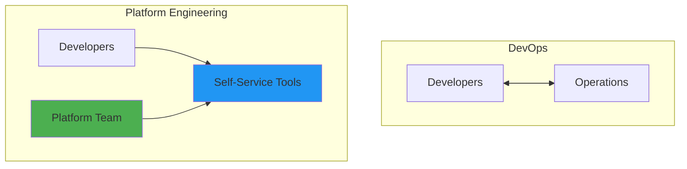
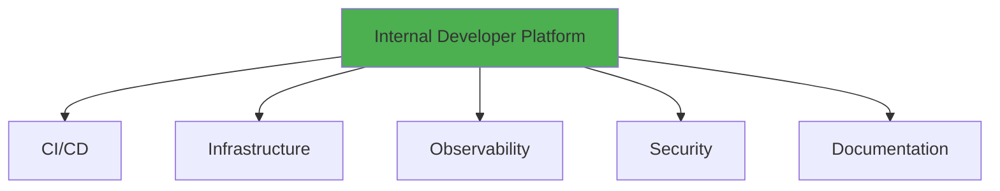
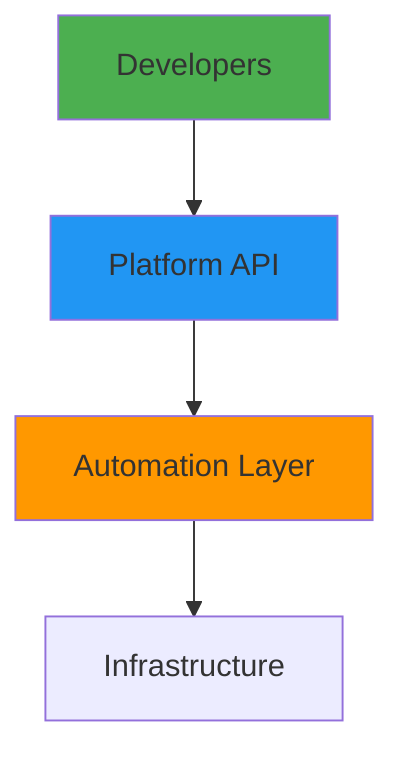
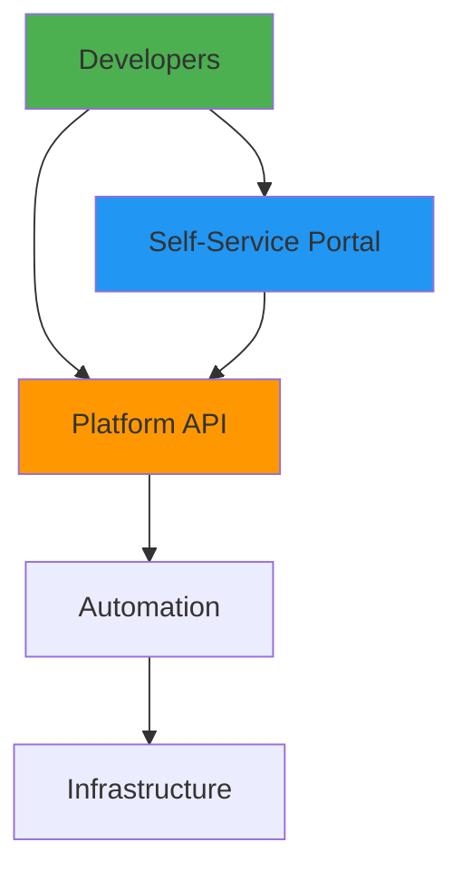
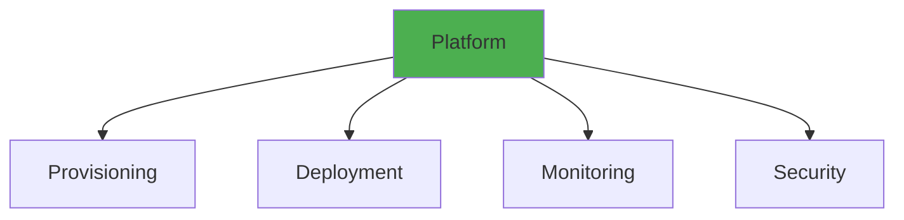

# Platform Engineering

## Overview

Platform Engineering is the discipline of building and operating internal platforms that enable development teams to deliver software quickly and reliably. It focuses on creating self-service capabilities, improving developer experience, and abstracting infrastructure complexity. This guide covers platform engineering principles, internal developer platforms, self-service infrastructure, and building platforms that accelerate software delivery.

## Deep Explanation

### What is Platform Engineering?

Platform Engineering builds internal platforms that provide self-service capabilities for development teams.

#### Platform Engineering vs DevOps

**DevOps**: Developers and operators collaborate
**Platform Engineering**: Platform team builds tools for developers



### Internal Developer Platform (IDP)

#### What is an IDP?

An IDP is a curated set of tools and capabilities that developers use to build, deploy, and operate applications.

#### IDP Components



**Components**:
- **CI/CD**: Automated pipelines
- **Infrastructure**: Self-service provisioning
- **Observability**: Monitoring and logging
- **Security**: Built-in security
- **Documentation**: Self-service docs

### Self-Service Infrastructure

#### Infrastructure as Code Templates

**Terraform Modules**:
```hcl
# Platform module
module "application" {
  source = "git::https://github.com/company/platform-modules.git//application"
  
  name         = "myapp"
  environment  = "production"
  instance_type = "t3.medium"
  replicas     = 3
}
```

**Helm Charts**:
```yaml
# Platform Helm chart
apiVersion: v2
name: platform-app
description: Platform application template
version: 1.0.0

values:
  image:
    repository: ""
    tag: ""
  replicas: 3
  resources:
    requests:
      cpu: 100m
      memory: 128Mi
```

#### Self-Service Portal

**Web Interface**:
```python
# platform_portal.py
from flask import Flask, request, jsonify
import subprocess

app = Flask(__name__)

@app.route('/api/provision', methods=['POST'])
def provision():
    data = request.json
    app_name = data['name']
    environment = data['environment']
    
    # Generate Terraform config
    config = generate_terraform_config(app_name, environment)
    
    # Apply Terraform
    result = subprocess.run(
        ['terraform', 'apply', '-auto-approve'],
        input=config,
        capture_output=True,
        text=True
    )
    
    if result.returncode == 0:
        return jsonify({
            'status': 'success',
            'endpoint': f'https://{app_name}.example.com'
        })
    else:
        return jsonify({
            'status': 'error',
            'message': result.stderr
        }), 500
```

### Platform Capabilities

#### Application Scaffolding

**Template Generator**:
```python
# scaffold.py
import os
import shutil

def scaffold_application(name, language, framework):
    template_dir = f"templates/{language}/{framework}"
    target_dir = f"applications/{name}"
    
    shutil.copytree(template_dir, target_dir)
    
    # Replace placeholders
    replace_in_file(
        f"{target_dir}/config.yaml",
        {"APP_NAME": name}
    )
    
    # Initialize Git
    subprocess.run(['git', 'init'], cwd=target_dir)
    
    return target_dir
```

#### Environment Provisioning

**Environment API**:
```python
@app.route('/api/environments', methods=['POST'])
def create_environment():
    data = request.json
    env_name = data['name']
    app_name = data['application']
    
    # Provision Kubernetes namespace
    kubectl_create_namespace(env_name)
    
    # Deploy application
    deploy_application(app_name, env_name)
    
    # Setup monitoring
    setup_monitoring(app_name, env_name)
    
    return jsonify({
        'environment': env_name,
        'url': f'https://{env_name}.example.com'
    })
```

### Developer Experience

#### CLI Tools

**Platform CLI**:
```python
# platform-cli
import click

@click.group()
def cli():
    pass

@cli.command()
@click.argument('name')
@click.option('--environment', default='development')
def create(name, environment):
    """Create new application"""
    click.echo(f'Creating {name} in {environment}...')
    # Provision infrastructure
    provision_app(name, environment)
    click.echo(f'Application {name} created!')

@cli.command()
@click.argument('name')
def deploy(name):
    """Deploy application"""
    click.echo(f'Deploying {name}...')
    # Trigger deployment
    trigger_deployment(name)
    click.echo(f'{name} deployed!')

@cli.command()
@click.argument('name')
def logs(name):
    """View application logs"""
    # Stream logs
    stream_logs(name)

if __name__ == '__main__':
    cli()
```

**Usage**:
```bash
# Create application
platform create myapp --environment production

# Deploy
platform deploy myapp

# View logs
platform logs myapp
```

### Platform Architecture

#### Platform Layers



**Layers**:
1. **Developer Interface**: CLI, Web UI, API
2. **Platform API**: Self-service APIs
3. **Automation Layer**: CI/CD, IaC
4. **Infrastructure**: Cloud resources

### Complete Platform Example

**Platform API**:
```python
# platform_api.py
from flask import Flask, request, jsonify
import kubernetes
import subprocess

app = Flask(__name__)
k8s_client = kubernetes.client.ApiClient()

@app.route('/api/v1/applications', methods=['POST'])
def create_application():
    """Create new application"""
    data = request.json
    
    app_name = data['name']
    environment = data.get('environment', 'development')
    image = data.get('image', f'{app_name}:latest')
    replicas = data.get('replicas', 1)
    
    # Create Kubernetes deployment
    deployment = create_k8s_deployment(
        name=app_name,
        image=image,
        replicas=replicas,
        namespace=environment
    )
    
    # Create service
    service = create_k8s_service(
        name=app_name,
        namespace=environment
    )
    
    # Create ingress
    ingress = create_k8s_ingress(
        name=app_name,
        host=f'{app_name}.{environment}.example.com',
        namespace=environment
    )
    
    return jsonify({
        'name': app_name,
        'environment': environment,
        'url': f'https://{app_name}.{environment}.example.com',
        'status': 'created'
    })

@app.route('/api/v1/applications/<app_name>/deploy', methods=['POST'])
def deploy_application(app_name):
    """Deploy application"""
    data = request.json
    image = data['image']
    environment = data.get('environment', 'production')
    
    # Update deployment
    update_deployment_image(app_name, image, environment)
    
    # Wait for rollout
    wait_for_rollout(app_name, environment)
    
    return jsonify({
        'status': 'deployed',
        'image': image
    })

@app.route('/api/v1/applications/<app_name>/logs', methods=['GET'])
def get_logs(app_name):
    """Get application logs"""
    environment = request.args.get('environment', 'production')
    lines = request.args.get('lines', 100)
    
    logs = get_pod_logs(app_name, environment, lines)
    
    return jsonify({
        'logs': logs
    })
```

### Platform Metrics

#### Platform Usage Metrics

```python
# Track platform usage
class PlatformMetrics:
    def track_provision(self, app_name, environment):
        self.increment_counter('platform.provision', {
            'environment': environment
        })
    
    def track_deployment(self, app_name, success):
        self.increment_counter('platform.deployment', {
            'success': success
        })
    
    def track_error(self, error_type):
        self.increment_counter('platform.errors', {
            'type': error_type
        })
```

## Diagrams

### Platform Engineering Architecture



### Platform Capabilities



## Real Code Examples

### Complete Platform Implementation

```python
# platform.py
from flask import Flask, request, jsonify
import kubernetes
import subprocess
import yaml

app = Flask(__name__)
k8s_client = kubernetes.client.ApiClient()

class Platform:
    def __init__(self):
        self.apps = {}
    
    def create_application(self, name, config):
        """Create application with full stack"""
        # Create namespace
        self.create_namespace(config['environment'])
        
        # Create deployment
        deployment = self.create_deployment(name, config)
        
        # Create service
        service = self.create_service(name, config)
        
        # Create ingress
        ingress = self.create_ingress(name, config)
        
        # Setup monitoring
        self.setup_monitoring(name, config)
        
        return {
            'name': name,
            'url': f"https://{name}.{config['environment']}.example.com",
            'status': 'created'
        }
    
    def create_deployment(self, name, config):
        """Create Kubernetes deployment"""
        deployment_manifest = {
            'apiVersion': 'apps/v1',
            'kind': 'Deployment',
            'metadata': {
                'name': name,
                'namespace': config['environment']
            },
            'spec': {
                'replicas': config.get('replicas', 1),
                'selector': {
                    'matchLabels': {'app': name}
                },
                'template': {
                    'metadata': {'labels': {'app': name}},
                    'spec': {
                        'containers': [{
                            'name': name,
                            'image': config['image'],
                            'ports': [{'containerPort': 8080}],
                            'resources': config.get('resources', {})
                        }]
                    }
                }
            }
        }
        
        k8s_client.create_namespaced_deployment(
            namespace=config['environment'],
            body=deployment_manifest
        )
    
    def setup_monitoring(self, name, config):
        """Setup monitoring for application"""
        # Create ServiceMonitor for Prometheus
        service_monitor = {
            'apiVersion': 'monitoring.coreos.com/v1',
            'kind': 'ServiceMonitor',
            'metadata': {
                'name': name,
                'namespace': config['environment']
            },
            'spec': {
                'selector': {
                    'matchLabels': {'app': name}
                },
                'endpoints': [{
                    'port': 'http',
                    'path': '/metrics'
                }]
            }
        }
        
        k8s_client.create_namespaced_custom_object(
            group='monitoring.coreos.com',
            version='v1',
            namespace=config['environment'],
            plural='servicemonitors',
            body=service_monitor
        )

platform = Platform()

@app.route('/api/v1/applications', methods=['POST'])
def create_app():
    data = request.json
    result = platform.create_application(data['name'], data)
    return jsonify(result)

if __name__ == '__main__':
    app.run(host='0.0.0.0', port=8080)
```

## Hard Use-Case: Building Internal Platform

### Problem

Enable 50+ development teams to provision infrastructure without ops team involvement.

### Solution: Self-Service Platform

**Platform Features**:
1. **Application Templates**: Pre-configured templates
2. **Self-Service Provisioning**: API/CLI for provisioning
3. **Automated Deployment**: CI/CD integration
4. **Built-in Observability**: Monitoring included
5. **Security by Default**: Security built-in

**Results**:
- **Before**: 2-week wait for infrastructure
- **After**: Self-service in minutes
- **Developer Satisfaction**: Increased significantly

## Edge Cases and Pitfalls

### 1. Over-Abstraction

**Problem**: Platform too abstract, developers can't customize

**Solution**: Provide escape hatches

```python
# Allow custom configuration
def create_application(name, config, custom_config=None):
    base_config = get_base_config(config)
    if custom_config:
        base_config.update(custom_config)
    # ...
```

### 2. Platform Complexity

**Problem**: Platform itself becomes complex

**Solution**: Keep platform simple, use standard tools

```python
# Use standard tools
# Terraform for IaC
# Kubernetes for orchestration
# Don't reinvent the wheel
```

### 3. Lack of Documentation

**Problem**: Developers don't know how to use platform

**Solution**: Comprehensive documentation

```markdown
# Platform Documentation
## Getting Started
## API Reference
## Examples
## Troubleshooting
```

## References and Further Reading

- [Platform Engineering](https://platformengineering.org/) - Platform engineering guide
- [Internal Developer Platforms](https://www.thoughtworks.com/insights/articles/internal-developer-platforms) - IDP guide
- [The Platform Revolution](https://www.oreilly.com/library/view/platform-revolution/9781492045199/) - Platform guide

## Quiz

### Question 1
What is Platform Engineering?

**A)** Building external platforms  
**B)** Building internal platforms for development teams  
**C)** Managing servers  
**D)** Writing code

**Answer: B** - Platform Engineering builds internal platforms that provide self-service capabilities for development teams.

### Question 2
What is an Internal Developer Platform (IDP)?

**A)** External platform  
**B)** Curated set of tools for developers  
**C)** A database  
**D)** A programming language

**Answer: B** - An IDP is a curated set of tools and capabilities that developers use to build, deploy, and operate applications.

### Question 3
What is the main goal of platform engineering?

**A)** Replace developers  
**B)** Improve developer experience and enable self-service  
**C)** Reduce costs  
**D)** Increase complexity

**Answer: B** - Platform Engineering aims to improve developer experience and enable self-service capabilities.

### Question 4
What should a platform provide?

**A)** Only infrastructure  
**B)** Self-service capabilities for common tasks  
**C)** Nothing  
**D)** Only documentation

**Answer: B** - Platforms should provide self-service capabilities for common development and operations tasks.

### Question 5
What is a common pitfall in platform engineering?

**A)** Too simple  
**B)** Over-abstraction  
**C)** Good documentation  
**D)** Self-service

**Answer: B** - Over-abstraction can make platforms too rigid and prevent developers from customizing when needed.

## Related Topics

- [Site Reliability Engineering (SRE)](./01.%20Site%20Reliability%20Engineering%20(SRE).md) - SRE practices
- [Kubernetes Fundamentals](../02_intermediate/01.%20Kubernetes%20Fundamentals.md) - Platform foundation
- [GitOps Fundamentals](../02_intermediate/07.%20GitOps%20Fundamentals.md) - GitOps for platforms

